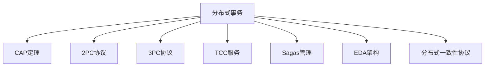

                 

## 1. 背景介绍

### 1.1 问题由来

分布式系统的普及极大地提升了企业IT系统的可靠性和可扩展性，但也带来了新的挑战。特别是当多个系统的交易需要跨多个节点协调时，如何保证数据一致性和事务的原子性成为了一个重大问题。而分布式事务是处理这一问题的关键技术，它能够保证跨多个数据库或服务的事务执行能够按照一致性、准确性、隔离性和持久性的原则，无序且正确地完成。

### 1.2 问题核心关键点

1. **数据一致性**：数据在分布式系统中被多个节点访问时，如何保证数据的一致性和完整性。
2. **原子性**：一个事务包含多个操作，如何确保这些操作要么全部执行，要么全部回滚。
3. **隔离性**：事务的执行与其他事务的执行无关，互不影响。
4. **持久性**：已提交的事务结果应当永久保存在系统中，不因系统故障而丢失。

### 1.3 问题研究意义

研究分布式事务的管理方法，对于保证系统数据一致性、提升系统性能、降低系统故障风险具有重要意义：

1. 提升系统可靠性：保证事务的一致性、原子性、隔离性和持久性，使得系统在故障恢复后可以继续稳定运行。
2. 提高系统性能：通过合理的分布式事务管理，减少不必要的重复操作和同步开销，提高系统并发处理能力。
3. 降低系统风险：避免数据不一致带来的业务错误和损失，提高系统可用性和用户满意度。
4. 促进产业升级：分布式事务技术的应用，加速了企业数字化转型进程，推动了产业的全面升级。

## 2. 核心概念与联系

### 2.1 核心概念概述

为更好地理解分布式事务的处理方法，本节将介绍几个密切相关的核心概念：

- **分布式事务**：一个跨多个数据库或服务的事务。其执行需要保证原子性、一致性、隔离性和持久性，使得系统能够在故障恢复后继续稳定运行。
- **CAP定理**：在分布式系统中，一致性、可用性和分区容错性（Partition Tolerance）三者不可兼得。
- **两阶段提交（2PC）**：一种经典的分布式事务协议，分为准备阶段和提交阶段，保证事务的原子性。
- **三阶段提交（3PC）**：在2PC的基础上增加了一个预备提交阶段，增加了一定程度的可用性。
- **TCC**：事务协调服务（Try、Confirm、Cancel），通过系统调用实现事务控制，保证事务的原子性。
- **Sagas**：基于状态的分布式事务管理方法，能够在异步环境下保证事务的原子性。
- **事件驱动架构（EDA）**：以事件为中心的架构，通过消息队列等手段，实现事务的隔离性和持久性。
- **分布式一致性协议**：如Paxos、Raft等，用于在分布式系统中保证数据的一致性和可靠性。

这些核心概念之间的逻辑关系可以通过以下Mermaid流程图来展示：



这个流程图展示了大语言模型的核心概念及其之间的关系：

1. 分布式事务为处理跨多个数据库或服务的事务提供了基础架构。
2. 通过CAP定理，我们理解了在分布式系统中保证一致性、可用性和分区容错性的矛盾。
3. 通过2PC和3PC协议，我们了解分布式事务的原子性保证方法。
4. 通过TCC服务，我们看到了分布式事务的具体实现机制。
5. 通过Sagas管理，我们掌握了在异步环境下事务的原子性保证方法。
6. 通过EDA架构，我们看到了通过事件驱动手段实现事务的隔离性和持久性。
7. 通过分布式一致性协议，我们看到了如何保证分布式系统的数据一致性和可靠性。

这些核心概念共同构成了分布式事务的管理框架，使其能够在各种场景下保证事务的执行一致性。通过理解这些核心概念，我们可以更好地把握分布式事务的工作原理和优化方向。

## 3. 核心算法原理 & 具体操作步骤

### 3.1 算法原理概述

分布式事务的处理方法主要是基于不同的一致性协议，保证跨多个数据库或服务的事务执行能够按照一致性、准确性、隔离性和持久性的原则，无序且正确地完成。

主要算法原理包括以下几点：

- **事务划分**：将跨多个数据库或服务的操作划分为一组事务，每个事务包含多个操作。
- **一致性协议**：在分布式系统中使用CAP定理、Paxos、Raft等一致性协议，保证数据的一致性和可靠性。
- **隔离性处理**：通过读写锁、乐观锁、悲观锁等方式，实现事务的隔离性，避免并发操作冲突。
- **持久性保障**：使用日志、快照等技术，保证已提交的事务结果能够永久保存在系统中。

### 3.2 算法步骤详解

以下是分布式事务处理的基本步骤：

1. **事务初始化**：定义事务边界，记录事务开始时间，划分事务包含的操作。
2. **准备阶段**：所有参与者准备事务，检查自身系统状态和资源可用性。
3. **提交阶段**：如果所有参与者都准备好事务，则进行提交操作。
4. **回滚阶段**：如果在提交阶段出现错误，则所有参与者回滚事务，回到初始化状态。
5. **持久化操作**：记录事务执行日志，使用快照技术确保数据持久化。

### 3.3 算法优缺点

分布式事务的处理方法主要具有以下优点：

- **保证数据一致性**：通过一致性协议，确保在分布式系统中数据的一致性和可靠性。
- **提升系统可用性**：通过隔离性和持久性设计，保证系统在故障恢复后能够继续稳定运行。
- **简化系统设计**：统一事务管理，减少系统复杂度，降低开发和维护成本。

同时，分布式事务也存在以下局限性：

- **复杂度高**：处理跨多个数据库或服务的事务，需要考虑多节点间的数据同步和协调，增加了系统复杂度。
- **性能开销大**：协调和同步操作带来较大的性能开销，影响系统并发处理能力。
- **单点故障风险**：分布式事务管理依赖协调者节点，若协调者节点出现故障，可能导致整个事务失败。

### 3.4 算法应用领域

分布式事务在各种复杂的分布式系统中都有广泛的应用，例如：

- 金融系统：银行、证券等金融交易系统，需要保证跨多个数据库和服务的交易一致性。
- 电商系统：在线购物、支付等电商系统，需要跨多个数据库保证订单、库存、支付等操作的原子性。
- 医疗系统：医院管理系统，需要保证跨多个数据库的预约、挂号、取药等操作的可靠性。
- 社交网络：社交平台上的评论、点赞、分享等操作，需要跨多个数据库和服务的原子性。

除了上述这些经典应用外，分布式事务还被创新性地应用到更多场景中，如物联网、大数据、云计算等，为分布式系统的设计提供了强有力的保障。

## 4. 数学模型和公式 & 详细讲解

### 4.1 数学模型构建

本节将使用数学语言对分布式事务的处理方法进行更加严格的刻画。

设分布式系统中有$N$个节点，每个节点都有本地数据库$DB_i$，事务$T$包含$M$个操作，每个操作记为$A_j$。分布式事务的处理过程可以表示为：

$$
T = \{A_1, A_2, \cdots, A_M\}
$$

事务$T$在执行过程中，需要保证原子性、一致性、隔离性和持久性。使用数学语言可以表示为：

- 原子性（Atomicity）：所有操作要么全部执行成功，要么全部失败回滚。
- 一致性（Consistency）：执行事务后，系统状态符合一致性约束。
- 隔离性（Isolation）：并发事务之间相互独立，互不影响。
- 持久性（Durability）：已提交的事务结果永久保存在系统中。

### 4.2 公式推导过程

为了更好地理解这些约束条件，下面将推导其中几个公式：

1. 原子性（Atomicity）：
   $$
   T(A_1, A_2, \cdots, A_M) = \begin{cases}
   0, & \text{所有操作执行成功} \\
   -1, & \text{存在某个操作失败}
   \end{cases}
   $$

2. 一致性（Consistency）：
   $$
   C(T) = \begin{cases}
   1, & \text{执行事务后，系统状态符合一致性约束} \\
   -1, & \text{执行事务后，系统状态不符合一致性约束}
   \end{cases}
   $$

3. 隔离性（Isolation）：
   $$
   I(T) = \begin{cases}
   1, & \text{事务$T$与其他事务相互独立} \\
   -1, & \text{事务$T$与其他事务存在冲突}
   \end{cases}
   $$

4. 持久性（Durability）：
   $$
   D(T) = \begin{cases}
   1, & \text{事务$T$提交后，结果永久保存在系统中} \\
   -1, & \text{事务$T$提交后，结果未能持久化}
   \end{cases}
   $$

### 4.3 案例分析与讲解

以银行转账事务为例，分析如何保证转账操作的原子性、一致性、隔离性和持久性。

1. **原子性（Atomicity）**：转账操作需要保证要么全部成功，要么全部失败。银行系统可以使用两阶段提交协议（2PC），即转账操作需要经过准备和提交两个阶段。如果所有参与者都准备好转账，则进行提交操作。如果在提交过程中出现错误，则所有参与者回滚，回到初始状态。
2. **一致性（Consistency）**：转账操作需要保证账户余额和金额相符，转账后账户余额应当减少相应金额。银行系统可以使用乐观锁或悲观锁来保证一致性，例如使用悲观锁在转账操作前锁定账户，确保操作期间账户余额不被修改。
3. **隔离性（Isolation）**：转账操作需要保证与其他转账操作独立。银行系统可以使用读写锁来实现隔离性，例如在转账操作前锁定账户，在转账操作完成后解锁账户。
4. **持久性（Durability）**：转账操作需要保证提交后结果永久保存在系统中。银行系统可以使用日志记录事务执行过程，并使用快照技术保存事务执行结果。

## 5. 项目实践：代码实例和详细解释说明

### 5.1 开发环境搭建

在进行分布式事务实践前，我们需要准备好开发环境。以下是使用Java进行Spring Boot开发的环境配置流程：

1. 安装JDK：从官网下载并安装JDK，建议安装JDK 8或更高版本。
2. 安装Maven：从官网下载并安装Maven，配置JAVA_HOME环境变量。
3. 创建并激活虚拟环境：
```bash
conda create -n spring-env python=3.8 
conda activate spring-env
```

4. 安装Spring Boot：
```bash
mvn archetype:generate -DgroupId=com.example -DartifactId=spring-boot-transaction
```

5. 配置数据库连接：
```xml
<spring:tx-configuration>
    <tx:annotation-driven transaction-manager="transactionManager"/>
</spring:tx-configuration>

<bean id="transactionManager" class="org.springframework.jdbc.datasource.DataSourceTransactionManager">
    <property name="dataSource" ref="dataSource"/>
</bean>

<bean id="dataSource" class="org.springframework.jdbc.datasource.DriverManagerDataSource">
    <property name="driverClassName" value="com.mysql.jdbc.Driver"/>
    <property name="url" value="jdbc:mysql://localhost:3306/mydb"/>
    <property name="username" value="root"/>
    <property name="password" value="password"/>
</bean>
```

完成上述步骤后，即可在`spring-env`环境中开始分布式事务实践。

### 5.2 源代码详细实现

下面我们以跨多个数据库的转账事务为例，给出使用Spring Boot实现分布式事务的代码实现。

```java
@Component
public class TransactionService {
    @Autowired
    private AccountRepository accountRepository;
    @Autowired
    private CustomerRepository customerRepository;

    @Resource
    private TransactionManager transactionManager;

    @Transactional(rollbackFor = Exception.class)
    public void transfer(int fromId, int toId, int amount) {
        // 获取起始账户和目标账户
        Account fromAccount = accountRepository.findById(fromId);
        Account toAccount = accountRepository.findById(toId);

        if (fromAccount == null || toAccount == null) {
            throw new RuntimeException("Invalid account id");
        }

        // 转账操作
        fromAccount.setBalance(fromAccount.getBalance() - amount);
        toAccount.setBalance(toAccount.getBalance() + amount);

        // 提交事务
        transactionManager.commit(new DefaultTransactionDefinition());
    }
}
```

### 5.3 代码解读与分析

让我们再详细解读一下关键代码的实现细节：

**TransactionService类**：
- `@Autowired`注解：注入AccountRepository和CustomerRepository，用于访问数据库。
- `@Resource`注解：注入TransactionManager，用于管理分布式事务。
- `@Transactional`注解：标注事务边界，表示该方法属于分布式事务的一部分。

**transfer方法**：
- 获取起始账户和目标账户的信息，并进行转账操作。
- 在事务边界内，进行转账操作。
- 如果转账操作失败，自动回滚事务，否则提交事务。

**分布式事务管理**：
- 使用`tx:annotation-driven`标签，开启Spring的事务注解驱动模式。
- 使用`DataSourceTransactionManager`管理数据库连接，设置数据源为`dataSource`。
- 使用`DefaultTransactionDefinition`定义默认的事务定义，用于提交事务。

在Spring Boot中，通过注解驱动的事务管理机制，我们可以方便地定义和处理分布式事务。开发者可以灵活使用`@Transactional`注解，标注分布式事务的边界，简化事务管理代码。

当然，在实际应用中，还需要考虑更多因素，如事务超时、重试、失败回调等，确保系统在各种异常情况下都能够正常处理。

## 6. 实际应用场景

### 6.1 银行转账系统

银行转账系统是分布式事务的经典应用场景，用于处理跨多个数据库的转账操作。银行系统需要保证转账操作的一致性、原子性和持久性。

在银行转账系统中，分布式事务的实现流程如下：

1. 用户发起转账操作，通过API接口调用转账服务。
2. 转账服务调用 AccountRepository 获取起始账户和目标账户信息。
3. 转账服务执行转账操作，减少起始账户余额，增加目标账户余额。
4. 转账服务在事务边界内提交事务，保证转账操作的一致性和原子性。
5. 转账服务使用日志记录事务执行过程，并使用快照技术保存事务执行结果，确保持久性。

### 6.2 电商订单系统

电商订单系统需要处理跨多个数据库的订单、库存、支付等操作，需要保证事务的一致性、原子性和持久性。

在电商订单系统中，分布式事务的实现流程如下：

1. 用户下单，订单系统调用订单服务，创建订单。
2. 订单服务调用 InventoryService 获取库存信息，减少库存量。
3. 订单服务调用 PaymentService 处理支付操作，扣减用户账户余额。
4. 订单服务在事务边界内提交事务，保证订单、库存、支付操作的一致性和原子性。
5. 订单服务使用日志记录事务执行过程，并使用快照技术保存事务执行结果，确保持久性。

### 6.3 医疗系统

医院管理系统需要处理跨多个数据库的预约、挂号、取药等操作，需要保证事务的一致性、原子性和持久性。

在医疗系统中，分布式事务的实现流程如下：

1. 患者预约挂号，预约服务调用预约服务，创建预约记录。
2. 预约服务调用挂号服务，获取挂号信息，记录患者挂号信息。
3. 挂号服务调用取药服务，生成取药单。
4. 预约服务在事务边界内提交事务，保证预约、挂号、取药操作的一致性和原子性。
5. 预约服务使用日志记录事务执行过程，并使用快照技术保存事务执行结果，确保持久性。

### 6.4 未来应用展望

随着分布式系统的普及，分布式事务将在更多领域得到应用，为系统设计提供强有力的保障。

在智慧医疗领域，基于分布式事务的医疗系统能够保证跨多个数据库的预约、挂号、取药等操作的可靠性，提高医疗服务的智能化水平，辅助医生诊疗，加速新药开发进程。

在智能教育领域，分布式事务能够保证跨多个数据库的学生注册、课程安排、成绩查询等操作的原子性，因材施教，促进教育公平，提高教学质量。

在智慧城市治理中，基于分布式事务的城市事件监测、舆情分析、应急指挥等环节，能够提高城市管理的自动化和智能化水平，构建更安全、高效的未来城市。

此外，在企业生产、社会治理、文娱传媒等众多领域，基于分布式事务的人工智能应用也将不断涌现，为经济社会发展注入新的动力。相信随着技术的日益成熟，分布式事务必将在构建人机协同的智能时代中扮演越来越重要的角色。

## 7. 工具和资源推荐

### 7.1 学习资源推荐

为了帮助开发者系统掌握分布式事务的理论基础和实践技巧，这里推荐一些优质的学习资源：

1. 《分布式系统：原理与设计》系列博文：由大系统设计专家撰写，深入浅出地介绍了分布式系统设计的基本原理和核心技术。

2. 《Spring Boot与Spring Cloud分布式事务实战》书籍：详细讲解了Spring Boot和Spring Cloud分布式事务的实现方法，结合多个实际项目案例，提供实战经验。

3. 《Java分布式事务编程指南》书籍：全面介绍了Java分布式事务的各种实现技术，包括JPA、Spring、Hibernate等，提供了完整的代码实现。

4. 《Distributed Systems: Concepts and Design》书籍：经典的分布式系统教材，介绍了分布式系统的基本概念和设计方法，适用于理论学习和深度研究。

5. 《Designing Distributed Systems》系列文章：Martin Kleppmann系列文章，介绍了分布式系统的各种设计模式和最佳实践。

通过对这些资源的学习实践，相信你一定能够快速掌握分布式事务的精髓，并用于解决实际的系统问题。

### 7.2 开发工具推荐

高效的开发离不开优秀的工具支持。以下是几款用于分布式事务开发的常用工具：

1. Spring Boot：基于Java的开源微服务框架，提供了一站式的分布式事务管理解决方案，易于集成和使用。
2. Kafka：分布式消息队列，用于实现事务隔离，支持高吞吐量和高可用性。
3. RabbitMQ：企业级消息队列，支持分布式事务管理，并提供多种消息协议。
4. Redis：高可用性、高吞吐量的内存数据库，用于实现分布式事务的缓存和锁管理。
5. ElasticSearch：分布式搜索引擎，用于实现分布式事务的搜索和分析功能。

合理利用这些工具，可以显著提升分布式事务的开发效率，加快创新迭代的步伐。

### 7.3 相关论文推荐

分布式事务的研究源于学界的持续研究。以下是几篇奠基性的相关论文，推荐阅读：

1. "Practical techniques for reliable transaction processing"：Wenters等人提出的经典分布式事务处理方法，介绍了两阶段提交（2PC）协议和资源管理器。

2. "On-Line Distributed Transactions: Techniques for Consistency and Survival"：Lynch等人提出的分布式事务处理模型，介绍了多阶段提交（MSP）协议和事务管理器。

3. "Logical Clocks"：Fischer等人提出的分布式事务处理模型，介绍了逻辑时钟和事件驱动架构（EDA）。

4. "Paxos Made Simple"：Lamport等人提出的Paxos一致性协议，用于解决分布式系统中的数据一致性问题。

5. "Practical Byzantine Fault Tolerance"：Lamport等人提出的PBFT协议，用于解决分布式系统中的拜占庭容错问题。

这些论文代表了大规模分布式系统的研究脉络。通过学习这些前沿成果，可以帮助研究者把握分布式系统的设计方向，激发更多的创新灵感。

## 8. 总结：未来发展趋势与挑战

### 8.1 总结

本文对分布式事务的管理方法进行了全面系统的介绍。首先阐述了分布式系统的基本概念和设计挑战，明确了分布式事务在保证系统数据一致性方面的独特价值。其次，从原理到实践，详细讲解了分布式事务的数学模型和实现步骤，给出了分布式事务任务开发的完整代码实例。同时，本文还广泛探讨了分布式事务在银行转账、电商订单、医疗系统等诸多领域的应用前景，展示了分布式事务技术的广阔前景。此外，本文精选了分布式事务技术的各类学习资源，力求为读者提供全方位的技术指引。

通过本文的系统梳理，可以看到，分布式事务的管理方法在保障系统数据一致性、提升系统性能、降低系统故障风险方面具有重要意义。分布式事务技术的发展，有望在构建安全、可靠、可解释、可控的智能系统方面发挥重要作用。未来，伴随分布式系统的不断演进，分布式事务技术还将与其他人工智能技术进行更深入的融合，推动分布式系统的全面升级。

### 8.2 未来发展趋势

展望未来，分布式事务的管理方法将呈现以下几个发展趋势：

1. **自动化**：分布式事务管理将向自动化方向发展，减少人工干预，提高系统可靠性。
2. **容错性增强**：在分布式系统中，增强拜占庭容错性和分区容错性，确保系统在高并发、高可用环境下稳定运行。
3. **跨云管理**：分布式事务管理将跨云平台、跨异构系统，实现多云环境的分布式事务统一管理。
4. **事件驱动架构**：基于事件驱动的架构将取代传统的分布式事务管理方式，实现异步处理和微服务架构。
5. **区块链技术**：引入区块链技术，实现分布式事务的不可篡改性和分布式共识，提升系统的安全性和可靠性。

以上趋势凸显了分布式事务管理的广阔前景。这些方向的探索发展，必将进一步提升分布式系统的可靠性、可用性和可扩展性，推动分布式系统的全面升级。

### 8.3 面临的挑战

尽管分布式事务的管理方法已经取得了长足进展，但在迈向更加智能化、普适化应用的过程中，它仍面临诸多挑战：

1. **复杂度提升**：处理跨多个数据库或服务的事务，需要考虑多节点间的数据同步和协调，增加了系统复杂度。
2. **性能开销大**：协调和同步操作带来较大的性能开销，影响系统并发处理能力。
3. **单点故障风险**：分布式事务管理依赖协调者节点，若协调者节点出现故障，可能导致整个事务失败。
4. **数据一致性问题**：在分布式环境中，数据一致性问题难以完全解决，需要不断优化一致性协议和分布式锁机制。
5. **系统扩展性问题**：在分布式环境中，系统的扩展性问题难以完全解决，需要不断优化分布式事务管理和异步处理机制。

这些挑战凸显了分布式事务管理技术的复杂性和多样性。未来研究需要在这些方向上寻求新的突破，推动分布式事务技术的不断演进。

### 8.4 研究展望

面对分布式事务管理所面临的种种挑战，未来的研究需要在以下几个方面寻求新的突破：

1. **分布式事务自动化管理**：通过自动化管理技术，减少人工干预，提高系统可靠性。
2. **分布式事务容错性增强**：增强拜占庭容错性和分区容错性，确保系统在高并发、高可用环境下稳定运行。
3. **分布式事务跨云管理**：实现多云环境的分布式事务统一管理，提升系统的可扩展性。
4. **基于区块链的分布式事务**：引入区块链技术，实现分布式事务的不可篡改性和分布式共识，提升系统的安全性和可靠性。
5. **事件驱动架构与分布式事务的结合**：基于事件驱动的架构，实现异步处理和微服务架构，提升系统的并发处理能力。

这些研究方向的探索，必将引领分布式事务管理技术迈向更高的台阶，为构建安全、可靠、可解释、可控的智能系统铺平道路。面向未来，分布式事务管理技术还需要与其他人工智能技术进行更深入的融合，如知识表示、因果推理、强化学习等，多路径协同发力，共同推动分布式系统的全面升级。只有勇于创新、敢于突破，才能不断拓展分布式事务的边界，让智能技术更好地造福人类社会。

## 9. 附录：常见问题与解答

**Q1：分布式事务与本地事务的区别是什么？**

A: 分布式事务是跨多个数据库或服务的事务，需要在多个节点间进行协调和同步。本地事务是在单个数据库或服务中执行的事务，不需要跨多个节点协调。分布式事务需要考虑多节点间的数据一致性、隔离性和持久性，而本地事务只考虑单个节点的操作一致性。

**Q2：分布式事务如何处理数据一致性问题？**

A: 分布式事务使用一致性协议，如Paxos、Raft等，保证数据的一致性和可靠性。在分布式系统中，一致性协议通过多个节点的协调和共识，保证数据的一致性。同时，使用分布式锁、乐观锁、悲观锁等方式，实现事务的隔离性，避免并发操作冲突。

**Q3：如何设计分布式事务的管理流程？**

A: 设计分布式事务的管理流程时，需要考虑以下几个步骤：
1. 定义事务边界，记录事务开始时间，划分事务包含的操作。
2. 所有参与者准备事务，检查自身系统状态和资源可用性。
3. 如果所有参与者都准备好事务，则进行提交操作。
4. 如果在提交阶段出现错误，则所有参与者回滚，回到初始化状态。
5. 使用日志记录事务执行过程，并使用快照技术保存事务执行结果，确保持久性。

**Q4：如何提高分布式事务的性能？**

A: 提高分布式事务的性能可以从以下几个方面入手：
1. 减少协调和同步操作，使用异步处理方式。
2. 使用分布式锁机制，减少锁竞争带来的性能开销。
3. 优化数据一致性协议，减少共识算法带来的性能开销。
4. 使用读写锁、乐观锁、悲观锁等方式，实现事务的隔离性，避免并发操作冲突。

这些优化措施可以在保证事务一致性的前提下，提高系统的并发处理能力和性能。

**Q5：分布式事务在实际应用中需要注意哪些问题？**

A: 在实际应用中，分布式事务需要注意以下几个问题：
1. 事务超时问题，需要设置合理的事务超时时间，避免事务长时间等待。
2. 事务回滚问题，需要合理设计回滚机制，避免回滚带来的数据不一致。
3. 事务冲突问题，需要合理设计事务隔离机制，避免并发操作冲突。
4. 事务监控问题，需要实时监控事务执行状态，确保系统稳定运行。

这些问题是分布式事务管理中需要重点考虑的，只有做好这些工作，才能确保系统在各种异常情况下能够正常处理。

---

作者：禅与计算机程序设计艺术 / Zen and the Art of Computer Programming

