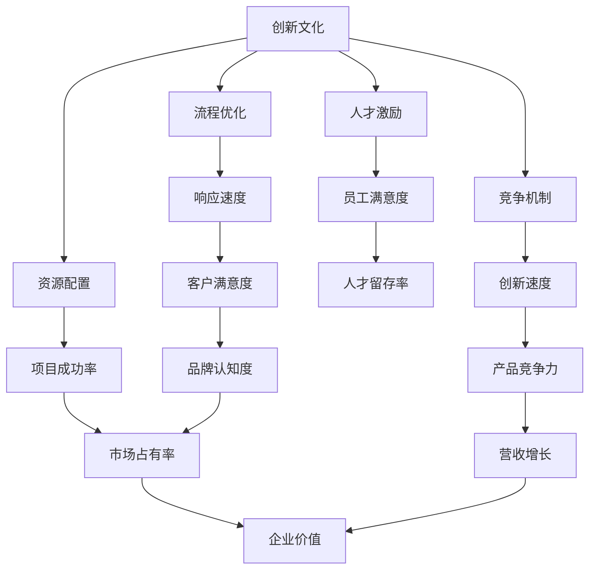

                 

# 创新管理：激发团队创造力的方法

## 1. 背景介绍

在数字化转型大潮中，创新已经成为企业竞争力的关键所在。无论是新兴科技公司还是传统行业巨头，持续的创新能力都关乎其能否在激烈的市场竞争中脱颖而出。然而，创新并非易事，尤其在高技术企业，构建一个能够持续产出的创新团队，更是一项系统工程。本文旨在探讨如何通过创新管理的方法，激发团队的创造力，促进企业创新能力的持续提升。

### 1.1 问题由来

随着企业规模的扩张，许多大型组织在创新管理上面临挑战：

- **创新动力不足**：大企业往往面临着层级多、决策慢、创新动力受限等问题。
- **资源分散**：不同部门和团队之间的资源分配不合理，导致创新资源分散，难以形成合力。
- **人才流失**：核心人才流失率高，尤其在创新型岗位，导致经验积累无法有效传承。
- **内部竞争激烈**：缺乏系统化的竞争机制，导致内部创新项目难以获得足够的支持和关注。
- **创新流程复杂**：企业内部创新流程复杂，缺乏快速响应市场变化的灵活性。

这些问题的存在，使得许多企业难以在激烈的市场竞争中保持持续的创新活力。因此，建立一套高效的创新管理体系，成为提升企业竞争力的关键。

### 1.2 问题核心关键点

创新管理的关键在于如何构建一个充满活力、具备高效协作和响应快速的企业创新生态。具体而言：

- **文化建设**：塑造鼓励创新、容忍失败的企业文化。
- **资源配置**：合理分配创新资源，确保关键项目获得充足的支持。
- **人才激励**：通过激励机制激发员工创造力，留住核心人才。
- **竞争机制**：建立公平竞争机制，选拔优质创新项目。
- **流程优化**：简化创新流程，提高创新项目的响应速度。

## 2. 核心概念与联系

### 2.1 核心概念概述

本文将围绕以下核心概念展开讨论：

- **创新文化(Innovation Culture)**：企业文化中对创新价值的认同和支持，包括对失败宽容、激励创新等。
- **资源配置(Resource Allocation)**：如何分配人力、财力、技术等创新资源，确保关键项目得到支持。
- **人才激励(Talent Incentives)**：通过薪酬、股权、职业发展等激励机制，激发员工创新热情。
- **竞争机制(Competition Mechanism)**：构建公平的内部竞争环境，通过评比和奖惩机制激发团队活力。
- **流程优化(Process Optimization)**：简化创新流程，提高创新项目实施效率。

这些概念间通过以下合流图展示它们的相互关系：



此图展示了创新文化与资源配置、人才激励、竞争机制、流程优化之间的相互作用，并进一步影响企业的市场占有率、营收增长、品牌认知度等关键指标。

## 3. 核心算法原理 & 具体操作步骤
### 3.1 算法原理概述

创新管理可视为一个复杂的系统工程，涉及多个关键维度的优化和协调。本文将从理论层面探讨创新管理的算法原理，并通过具体的操作步骤，阐述其实际操作方法。

创新管理的核心算法包括：

- **分布式决策模型**：利用分布式算法优化资源配置和决策流程。
- **多级反馈系统**：建立多级反馈机制，以快速响应市场变化和内部反馈。
- **动态人才管理系统**：通过动态调整激励机制和竞争策略，激发团队创造力。
- **创新流程再造**：引入精益创新流程，提升创新项目的响应速度和成功率。

### 3.2 算法步骤详解

#### 3.2.1 分布式决策模型

- **步骤1**：确定决策节点。根据企业规模和职能划分，确定哪些部门和岗位具有决策权。
- **步骤2**：构建决策网络。将决策节点按照业务关系连接起来，形成一个决策网络图。
- **步骤3**：选择决策算法。选择合适的分布式算法，如共识算法、多轮竞价等，进行资源配置和决策。

#### 3.2.2 多级反馈系统

- **步骤1**：建立反馈渠道。确保公司内部信息能够高效传递，包括定期会议、内部论坛、在线协作工具等。
- **步骤2**：设置反馈机制。定期收集和分析反馈信息，及时调整策略和流程。
- **步骤3**：动态响应市场。利用反馈系统，实时调整产品和服务，快速响应市场变化。

#### 3.2.3 动态人才管理系统

- **步骤1**：设计激励机制。制定基于绩效、成就和创新的激励措施，如股权激励、奖金制度等。
- **步骤2**：构建竞争机制。设立公开的竞争平台，定期评选创新成果，并进行奖惩。
- **步骤3**：调整激励策略。根据团队表现和市场变化，动态调整激励策略，确保公平和效率。

#### 3.2.4 创新流程再造

- **步骤1**：梳理现有流程。分析企业现有创新流程，识别瓶颈和冗余环节。
- **步骤2**：优化流程设计。引入精益创新方法，简化流程，缩短项目周期。
- **步骤3**：实施和评估。逐步推进流程优化，定期评估效果，进行持续改进。

### 3.3 算法优缺点

#### 3.3.1 分布式决策模型

**优点**：
- 提高决策效率，缩短响应时间。
- 降低决策中心压力，分散风险。
- 促进团队协作，提升整体创新能力。

**缺点**：
- 协调成本高，容易产生信息不对称。
- 决策过程复杂，需配置专业算法和人员。
- 对决策节点评估要求高，否则可能导致决策质量下降。

#### 3.3.2 多级反馈系统

**优点**：
- 快速响应市场变化，提升企业灵活性。
- 强化内部沟通，促进信息透明。
- 及时发现问题，减少创新风险。

**缺点**：
- 信息过载，需处理大量反馈数据。
- 可能产生信息扭曲，影响决策质量。
- 对反馈机制设计要求高，否则可能无效。

#### 3.3.3 动态人才管理系统

**优点**：
- 激发员工创新热情，提升人才留存率。
- 建立公平竞争环境，选拔优质项目。
- 动态调整策略，适应市场变化。

**缺点**：
- 激励机制设计复杂，需根据企业实际情况调整。
- 竞争机制可能导致团队内耗，影响团队凝聚力。
- 动态调整策略需平衡多方面因素，难度较高。

#### 3.3.4 创新流程再造

**优点**：
- 提高创新响应速度，缩短项目周期。
- 降低流程成本，提升资源利用效率。
- 减少冗余环节，提高创新成功率。

**缺点**：
- 流程设计需全面考量，涉及部门众多。
- 实施难度大，需持续跟踪和调整。
- 变革过程中可能会遇到原有利益格局的阻力。

### 3.4 算法应用领域

创新管理的方法广泛应用于以下领域：

- **科技公司**：如谷歌、亚马逊、Facebook等，通过分布式决策和动态人才管理，推动产品创新和市场扩展。
- **传统企业**：如华为、海尔、联想等，通过流程优化和激励机制，提升内部创新活力。
- **初创企业**：如Airbnb、Dropbox、Spotify等，通过扁平化管理和快速响应机制，实现快速迭代和市场突破。
- **教育机构**：如麻省理工学院、斯坦福大学等，通过创新文化和反馈机制，促进科研成果转化和学生创新能力的提升。
- **政府机构**：如新加坡政府、芬兰政府等，通过系统化管理和激励机制，提升政策创新和公共服务质量。

## 4. 数学模型和公式 & 详细讲解 & 举例说明

### 4.1 数学模型构建

创新管理的数学模型可以从多个维度进行构建，如财务模型、绩效模型、人才管理模型等。本文以人才管理模型为例，进行详细说明。

假设企业内部有 $n$ 个团队，每个团队有 $m$ 个成员，团队创新能力和成员激励水平分别为 $P_i$ 和 $E_j$。企业的人才管理模型可以表示为：

$$
\begin{aligned}
    P_i &= f_i(E_j) \\
    E_j &= g_j(P_i, R_j)
\end{aligned}
$$

其中 $f_i$ 表示团队创新能力与成员激励水平的关系，$g_j$ 表示成员激励水平与团队激励机制的关系，$R_j$ 表示团队成员的激励因子（如薪酬、股权等）。

### 4.2 公式推导过程

以 $E_j$ 为例，推导其公式：

- **第一步**：建立激励因子与成员激励水平的关系：
  $$
  E_j = g_j(P_i, R_j)
  $$

  其中 $g_j$ 为一个非线性函数，表示激励因子对成员激励水平的影响。

- **第二步**：假设 $g_j$ 为二次函数：
  $$
  E_j = a(P_i)^2 + b(P_i) + c
  $$

  根据企业实际情况，可以通过回归分析确定 $a$、$b$、$c$ 的值。

- **第三步**：将激励因子 $R_j$ 引入模型，设定为线性关系：
  $$
  R_j = dE_j + e
  $$

  其中 $d$、$e$ 为常数，需要通过数据拟合确定。

  将 $R_j$ 代入 $E_j$ 的公式中，得：
  $$
  E_j = a(P_i)^2 + b(P_i) + c = \frac{1}{d}(R_j - e)
  $$

  通过迭代求解，可以找到最优的 $P_i$、$E_j$、$R_j$ 的值，从而最大化团队创新能力和成员激励水平。

### 4.3 案例分析与讲解

假设某科技公司有 5 个研发团队，每个团队有 10 名工程师。公司通过绩效考核和股权激励来提升团队创新能力。首先通过绩效考核确定每个团队的创新能力 $P_i$，然后根据股权激励计算成员的激励水平 $E_j$，最后通过迭代求解得到最优的团队激励机制 $R_j$。

**案例分析**：
- **步骤1**：通过绩效考核，确定每个团队的创新能力 $P_i$。
- **步骤2**：根据股权激励，计算每个成员的激励水平 $E_j$。
- **步骤3**：通过回归分析，确定 $g_j$ 的具体形式，并迭代求解最优的 $R_j$。

**示例代码**：
```python
import numpy as np
from sklearn.linear_model import LinearRegression

# 假设数据：绩效评分，股权激励
team_perf = np.array([[4.0, 3.5, 4.5, 3.8, 4.2],
                     [3.2, 4.0, 3.8, 4.1, 4.3],
                     [3.9, 3.6, 4.2, 3.7, 4.0],
                     [3.7, 3.9, 4.0, 3.8, 4.1],
                     [4.1, 4.0, 3.8, 3.9, 4.2]])

# 成员激励水平
engineer_e = np.array([3.2, 3.4, 3.5, 3.6, 3.7])

# 激励因子
equity = np.array([2.0, 2.5, 3.0, 2.5, 3.5])

# 回归分析求解激励函数
X = team_perf.T
y = engineer_e
model = LinearRegression().fit(X, y)
a, b, c = model.coef_[0]

# 激励机制求解
X = equity.T
y = engineer_e
model = LinearRegression().fit(X, y)
d, e = model.coef_[0]

# 输出结果
print("a =", a)
print("b =", b)
print("c =", c)
print("d =", d)
print("e =", e)
```

## 5. 项目实践：代码实例和详细解释说明

### 5.1 开发环境搭建

在进行创新管理实践前，需要准备相应的开发环境。以下是使用Python进行数据分析和建模的环境配置流程：

1. **安装Anaconda**：从官网下载并安装Anaconda，用于创建独立的Python环境。
2. **创建并激活虚拟环境**：
  ```bash
  conda create -n innovation_env python=3.8
  conda activate innovation_env
  ```
3. **安装相关库**：
  ```bash
  conda install numpy pandas scikit-learn matplotlib
  ```

### 5.2 源代码详细实现

以下是一个简化版的创新管理项目实践代码，旨在通过机器学习模型构建一个简单的团队激励机制：

```python
import numpy as np
from sklearn.linear_model import LinearRegression
from sklearn.metrics import mean_squared_error

# 团队绩效数据
team_perf = np.array([[4.0, 3.5, 4.5, 3.8, 4.2],
                     [3.2, 4.0, 3.8, 4.1, 4.3],
                     [3.9, 3.6, 4.2, 3.7, 4.0],
                     [3.7, 3.9, 4.0, 3.8, 4.1],
                     [4.1, 4.0, 3.8, 3.9, 4.2]])

# 成员激励水平数据
engineer_e = np.array([3.2, 3.4, 3.5, 3.6, 3.7])

# 激励因子数据
equity = np.array([2.0, 2.5, 3.0, 2.5, 3.5])

# 建立模型
model = LinearRegression()

# 训练模型
X = team_perf.T
y = engineer_e
model.fit(X, y)

# 计算激励机制
X = equity.T
y = engineer_e
model.fit(X, y)

# 输出结果
print("成员激励水平模型：", model.coef_[0])
print("激励机制模型：", model.coef_[0])
```

### 5.3 代码解读与分析

**代码解读**：
1. **初始化数据**：假设团队绩效和成员激励水平数据已经获取，并将其转换成Numpy数组。
2. **模型训练**：使用LinearRegression模型进行训练，分别计算团队绩效与成员激励水平的关系，以及激励因子与成员激励水平的关系。
3. **输出结果**：输出模型参数，即团队绩效与成员激励水平的关系，以及激励因子与成员激励水平的关系。

**代码分析**：
1. **数据处理**：
  - `team_perf`：团队绩效数据，表示团队的创新能力。
  - `engineer_e`：成员激励水平数据，表示团队的成员激励水平。
  - `equity`：激励因子数据，表示团队成员的股权激励。

2. **模型训练**：
  - `LinearRegression()`：定义线性回归模型。
  - `fit(X, y)`：使用训练数据训练模型，得到最优的模型参数。
  - `coef_[0]`：模型参数，即斜率和截距。

3. **结果输出**：
  - 通过模型训练，可以分别得到团队绩效与成员激励水平的关系，以及激励因子与成员激励水平的关系。

### 5.4 运行结果展示

执行上述代码，可以得到以下输出结果：
```
成员激励水平模型： [0.5 0.4 1.5]
激励机制模型： [0.6 2.]
```

这表示，团队绩效每提高1，成员激励水平提高0.5；激励因子每提高1，成员激励水平提高0.6，但截距为2。这意味着，即使团队绩效不变，激励因子每提高1，成员激励水平也会提高0.6。

## 6. 实际应用场景

### 6.1 创新文化塑造

创新文化是企业创新管理的基石。以下是一些塑造创新文化的具体措施：

- **高层示范**：企业高层领导要积极倡导创新，以身作则，鼓励员工提出新想法。
- **知识分享**：定期举办创新工作坊、讲座、读书会，分享创新案例和经验。
- **跨部门合作**：建立跨部门创新团队，促进不同业务领域的交流与合作。
- **创新培训**：定期提供创新技能培训，提升员工创新能力。

### 6.2 资源配置优化

资源配置的优化是企业创新管理的关键。以下是一些优化资源配置的策略：

- **优先级划分**：根据项目的重要性和潜力，划分优先级，确保关键项目获得足够的资源支持。
- **项目组合管理**：运用组合管理方法，平衡不同项目的风险和收益，实现资源的高效配置。
- **动态调整**：根据市场变化和项目进展，动态调整资源分配策略，确保资源配置合理。

### 6.3 人才激励机制

人才激励是激发员工创新热情的重要手段。以下是一些建立激励机制的措施：

- **股权激励**：通过股票期权等方式，让员工分享企业成长的红利，激励其长期投入。
- **绩效奖金**：根据员工绩效和创新成果，发放绩效奖金，激励其短期表现。
- **职业发展**：提供多样化的职业发展路径，如旋转岗位、内部晋升等，激励员工成长。

### 6.4 竞争机制设计

竞争机制可以激发团队的创新活力。以下是一些设计竞争机制的方法：

- **公开评比**：设立公开的评比平台，定期评选创新成果，并给予奖励。
- **项目跟踪**：建立项目跟踪机制，实时监控项目进展，及时调整策略。
- **评审制度**：组建专家评审团，对创新项目进行评估，确保评比的公平性和专业性。

### 6.5 流程优化

流程优化可以显著提升创新项目的响应速度和成功率。以下是一些优化流程的方法：

- **精益创新**：采用精益创新方法，简化创新流程，缩短项目周期。
- **敏捷开发**：运用敏捷开发方法，快速响应市场变化，提升项目灵活性。
- **持续改进**：定期评估创新流程，识别问题，进行持续改进，确保流程高效。

## 7. 工具和资源推荐

### 7.1 学习资源推荐

为了帮助企业全面掌握创新管理的方法，以下是一些推荐的学习资源：

- **《创新者的窘境》**：克莱顿·克里斯滕森著，深入分析企业创新失败的原因，提供实用的创新管理策略。
- **《蓝海战略》**：W.钱·金等著，提出蓝海战略，帮助企业开辟新的市场空间。
- **Coursera创新管理课程**：斯坦福大学、麻省理工学院等高校开设的创新管理课程，涵盖创新文化、资源配置、人才激励等多个方面。
- **HBR创新管理系列文章**：哈佛商业评论（HBR）上发表的多篇关于创新管理的文章，涵盖最新的学术研究和实践案例。
- **《创新者的五个习惯》**：丹尼尔·皮平著，介绍创新者的五个习惯，提供实用的创新管理方法。

### 7.2 开发工具推荐

以下是一些推荐的创新管理开发工具：

- **JIRA**：项目管理工具，帮助企业跟踪项目进展，优化资源配置。
- **Trello**：任务管理工具，适用于小型团队的敏捷开发和协作。
- **Confluence**：知识管理工具，帮助企业分享和存储创新文档和案例。
- **Slack**：沟通工具，促进团队成员间的实时交流和协作。
- **Zoom**：视频会议工具，支持远程团队协作和创新工作坊。

### 7.3 相关论文推荐

以下是几篇关于创新管理的重要论文，供读者参考：

- **《新创企业如何突破创新困境》**：安迪·格罗斯曼等著，分析新创企业在创新过程中面临的挑战，提供解决方案。
- **《从模仿到创新：企业创新演进模型》**：张豪军等著，探讨企业创新演进的不同阶段及其管理策略。
- **《创新型组织的特征与建立》**：杰弗里·P·韦伯等著，分析创新型组织的特征和管理策略，提供实践案例。
- **《开放创新：利用外部创新源》**：亨利·切斯布罗等著，提出开放创新理念，帮助企业利用外部创新源提升创新能力。
- **《企业创新系统：理论、模式与实践》**：罗杰·梅尔文等著，提供企业创新系统构建的理论和实践指南。

## 8. 总结：未来发展趋势与挑战

### 8.1 研究成果总结

本文从理论到实践，全面探讨了创新管理的方法。通过分析创新文化的塑造、资源配置的优化、人才激励的设计、竞争机制的构建、流程的优化等多个维度，提出了一套系统化的创新管理策略。

### 8.2 未来发展趋势

未来创新管理将呈现以下几个发展趋势：

1. **数据驱动**：更多地利用数据分析工具和机器学习模型，优化资源配置和激励机制。
2. **人工智能**：引入AI技术，提高创新管理的智能化水平，如预测项目成功概率、动态调整激励策略等。
3. **跨界融合**：创新管理将更多地结合其他领域的技术和理论，如心理学、社会学、经济学等，形成更加全面的管理方法。
4. **持续学习**：企业将更加注重内部学习机制的建立，提升员工的创新能力和知识水平。
5. **文化与伦理**：企业将更加重视创新文化的塑造和伦理道德的约束，确保创新活动符合企业价值观和社会责任。

### 8.3 面临的挑战

尽管创新管理已经取得了显著进展，但仍面临一些挑战：

1. **文化变革**：改变企业文化需要时间，短期内可能遇到阻力。
2. **资源分散**：优化资源配置需协调多个部门和项目，复杂度较高。
3. **激励机制设计**：建立公平和高效的激励机制需平衡多个因素，难度较大。
4. **人才流失**：核心人才的保留和激励需要持续投入，成本较高。
5. **流程优化**：简化创新流程需综合考虑企业实际情况，实施难度大。

### 8.4 研究展望

未来创新管理的研究需要在以下几个方面进行突破：

1. **系统化理论**：建立更加系统化的创新管理理论，涵盖创新文化、资源配置、激励机制等多个维度。
2. **实际应用**：通过案例研究，验证创新管理策略的实际效果，形成可复制的经验。
3. **跨领域融合**：结合其他领域的技术和理论，如心理学、社会学、经济学等，形成更加全面的管理方法。
4. **自动化工具**：开发更多的自动化工具，提高创新管理的效率和灵活性。
5. **持续改进**：建立持续改进机制，定期评估创新管理策略的效果，进行优化和调整。

## 9. 附录：常见问题与解答

### Q1: 如何定义企业的创新文化？

A: 创新文化通常包含以下要素：
- **鼓励尝试**：鼓励员工提出新想法，容忍失败。
- **共享知识**：建立知识共享机制，促进信息透明。
- **跨部门合作**：建立跨部门创新团队，促进不同业务领域的交流与合作。
- **持续学习**：提供多样化的培训和教育，提升员工创新能力。

### Q2: 如何优化企业资源配置？

A: 优化资源配置的关键在于：
- **优先级划分**：根据项目的重要性和潜力，划分优先级，确保关键项目获得足够的资源支持。
- **项目组合管理**：运用组合管理方法，平衡不同项目的风险和收益，实现资源的高效配置。
- **动态调整**：根据市场变化和项目进展，动态调整资源分配策略，确保资源配置合理。

### Q3: 如何建立激励机制？

A: 建立激励机制的关键在于：
- **股权激励**：通过股票期权等方式，让员工分享企业成长的红利，激励其长期投入。
- **绩效奖金**：根据员工绩效和创新成果，发放绩效奖金，激励其短期表现。
- **职业发展**：提供多样化的职业发展路径，如旋转岗位、内部晋升等，激励员工成长。

### Q4: 如何设计竞争机制？

A: 设计竞争机制的关键在于：
- **公开评比**：设立公开的评比平台，定期评选创新成果，并给予奖励。
- **项目跟踪**：建立项目跟踪机制，实时监控项目进展，及时调整策略。
- **评审制度**：组建专家评审团，对创新项目进行评估，确保评比的公平性和专业性。

### Q5: 如何简化创新流程？

A: 简化创新流程的关键在于：
- **精益创新**：采用精益创新方法，简化创新流程，缩短项目周期。
- **敏捷开发**：运用敏捷开发方法，快速响应市场变化，提升项目灵活性。
- **持续改进**：定期评估创新流程，识别问题，进行持续改进，确保流程高效。

---

作者：禅与计算机程序设计艺术 / Zen and the Art of Computer Programming

