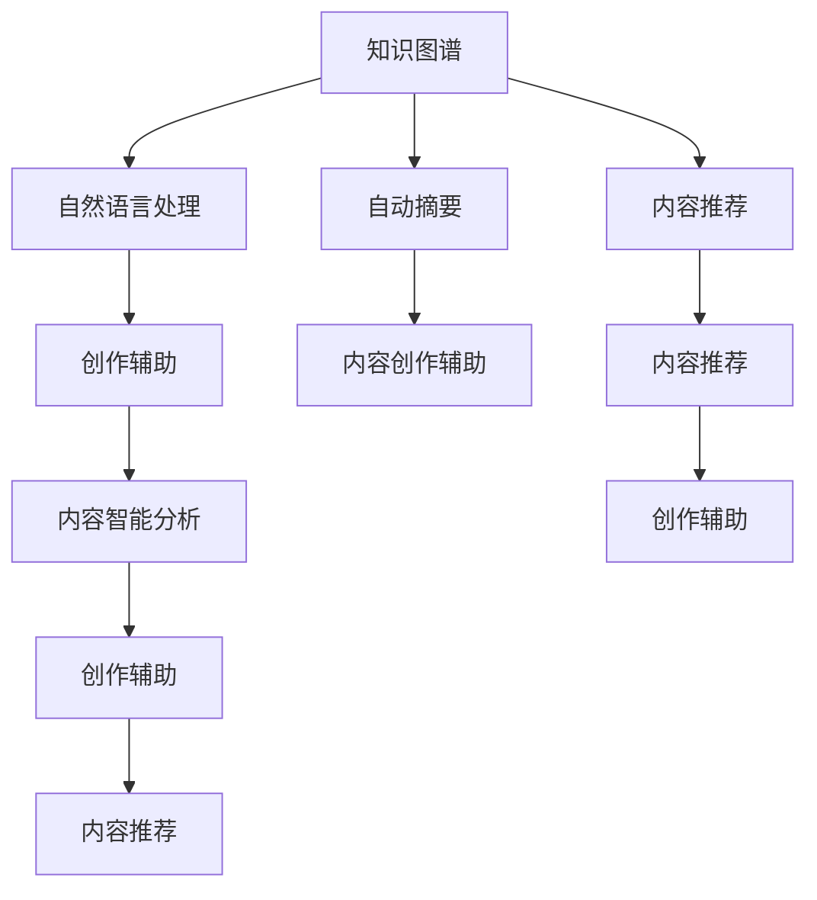
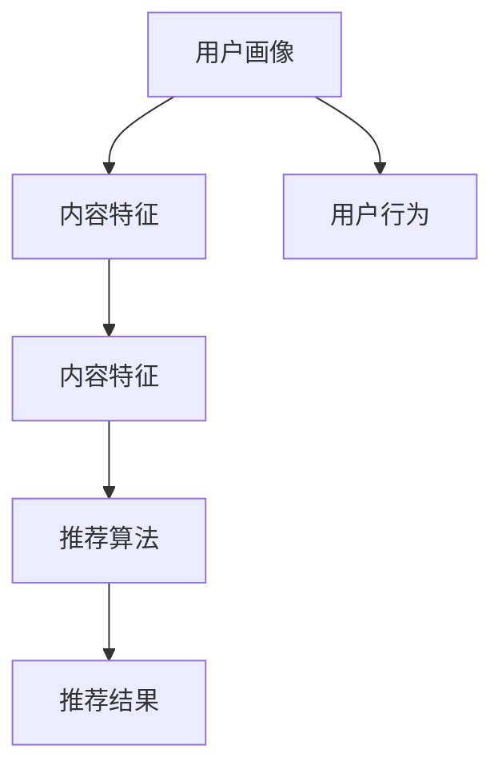

                 

# 利用人工智能优化知识内容创作流程

> 关键词：人工智能, 知识图谱, 自然语言处理, 自动摘要, 信息检索, 内容推荐, 创作辅助, 智能分析

## 1. 背景介绍

### 1.1 问题由来

在信息爆炸的时代，知识内容创作面临着前所未有的挑战。一方面，用户对信息的需求日益多样化和个性化，要求内容生产方能快速响应，精准匹配用户需求。另一方面，创作者面临着内容同质化严重、创作成本高、产出效率低等问题，难以在短时间内提供高质量、高价值的内容。

人工智能技术的飞速发展，特别是自然语言处理(NLP)、知识图谱(KG)、推荐系统等领域的突破，为优化知识内容创作流程带来了新的机遇。通过将人工智能技术深度融入内容创作环节，可以显著提升内容创作的效率、质量与多样性，满足日益增长的用户需求。

### 1.2 问题核心关键点

基于人工智能的内容创作优化，旨在通过自动化、智能化的手段，辅助创作者进行内容创作、分发与运营，提升创作效率，优化内容质量，拓展内容渠道，实现知识内容的精准推送与个性化推荐，从而提升用户阅读体验和平台流量转化。

核心关键点包括：

1. **内容创作辅助**：通过智能生成、推荐系统等技术，辅助创作者生成创意，推荐相关素材，提高创作效率。
2. **内容质量优化**：通过自动摘要、语法检查、信息检索等技术，提升内容的可读性、准确性和完备性。
3. **内容分发与推荐**：通过推荐算法、用户画像分析等技术，将优质内容精准推送给目标用户，提升阅读效果和平台活跃度。
4. **创作流程管理**：通过任务管理、进度跟踪等系统，优化创作流程，提高创作团队协作效率。
5. **内容智能分析**：通过情感分析、趋势预测等技术，理解内容的社会影响与用户反馈，辅助内容调整与优化。

## 2. 核心概念与联系

### 2.1 核心概念概述

为更好地理解人工智能在知识内容创作中的应用，本节将介绍几个关键核心概念：

- **人工智能(AI)**：通过机器学习、深度学习等技术，实现人类智能的延伸和拓展。
- **知识图谱(KG)**：一种结构化、语义化的知识表示方式，用于描述实体、关系及其属性，帮助机器理解和推理。
- **自然语言处理(NLP)**：研究如何让计算机理解和处理人类语言的技术，包括语言模型、文本分类、信息检索等。
- **自动摘要(Automatic Summarization)**：通过算法自动生成文本的精炼摘要，帮助用户快速获取关键信息。
- **内容推荐(Content Recommendation)**：通过分析用户行为和内容特征，推荐个性化的内容，提升用户满意度。
- **创作辅助(Content Creation Assistance)**：利用AI技术辅助创作者进行内容构思、素材搜集等，提高创作效率。
- **智能分析(Intelligent Analysis)**：通过数据挖掘、情感分析等技术，辅助创作者理解内容效果，优化创作策略。

这些概念之间存在紧密的联系和相互作用，通过组合使用，可以形成强大的内容创作优化框架。

### 2.2 核心概念原理和架构的 Mermaid 流程图



该图展示了知识图谱、自然语言处理、自动摘要、内容推荐、创作辅助和智能分析之间的联系。知识图谱提供了结构化的知识结构，自然语言处理处理自然语言数据，自动摘要生成精炼的摘要，内容推荐基于用户行为推荐个性化的内容，创作辅助和智能分析进一步辅助创作者优化创作流程和提升内容质量。

## 3. 核心算法原理 & 具体操作步骤

### 3.1 算法原理概述

人工智能在知识内容创作中的应用，主要涉及以下几个核心算法：

- **自然语言处理(NLP)**：利用语言模型、文本分类、信息检索等技术，处理文本数据，辅助内容创作。
- **自动摘要(Automatic Summarization)**：通过序列化、句子抽样等技术，自动生成文本的精炼摘要。
- **内容推荐(Content Recommendation)**：基于协同过滤、深度学习等算法，推荐个性化内容。
- **创作辅助(Content Creation Assistance)**：利用生成式模型、推荐系统等技术，辅助内容构思和素材搜集。
- **智能分析(Intelligent Analysis)**：通过情感分析、趋势预测等技术，理解内容效果，优化创作策略。

这些算法共同构成了基于人工智能的知识内容创作优化框架，通过协同作用，可以显著提升创作效率、内容质量和用户满意度。

### 3.2 算法步骤详解

基于人工智能的内容创作优化主要包括以下几个步骤：

**Step 1: 数据准备与预处理**

- 收集和整理内容创作的文本数据，包括文章、博客、新闻等。
- 对文本进行预处理，如分词、去停用词、词性标注等。
- 构建知识图谱，获取领域相关的实体、关系和属性。

**Step 2: 自然语言处理与分析**

- 利用NLP技术进行文本分析，包括文本分类、实体识别、情感分析等。
- 利用语言模型进行文本生成，辅助内容构思和构思优化。
- 利用信息检索技术，辅助素材搜集和相关资料查找。

**Step 3: 自动摘要与内容生成**

- 利用自动摘要算法，生成文本的精炼摘要，辅助内容精简和信息抓取。
- 利用生成式模型，辅助内容创作，生成草稿和素材。

**Step 4: 内容推荐与分发**

- 利用推荐算法，基于用户行为和内容特征，推荐个性化内容。
- 利用用户画像分析，优化内容分发策略，提升阅读效果。

**Step 5: 创作辅助与智能分析**

- 利用创作辅助工具，提升创作效率和素材利用率。
- 利用智能分析工具，理解内容效果和用户反馈，优化创作策略。

**Step 6: 反馈与迭代优化**

- 收集用户反馈，评估内容效果。
- 根据反馈结果，迭代优化内容创作流程和策略。

### 3.3 算法优缺点

人工智能在内容创作中的应用具有以下优点：

1. **提高创作效率**：自动化处理大量文本数据，辅助创作者构思和生成，显著提升创作效率。
2. **优化内容质量**：利用语言模型、自动摘要等技术，提升内容的可读性和准确性。
3. **个性化推荐**：基于用户行为和内容特征，推荐个性化内容，提升用户阅读体验。
4. **智能化分析**：通过情感分析、趋势预测等技术，辅助创作者理解内容效果，优化创作策略。

但同时也存在一些缺点：

1. **依赖数据质量**：数据质量和标注信息的准确性直接影响算法效果。
2. **模型复杂性**：复杂模型需要大量数据和计算资源，训练和部署成本较高。
3. **缺乏创意**：虽然技术可以辅助构思和生成，但难以完全替代创作者的创造力和独特性。
4. **技术偏见**：算法可能继承数据中的偏见，导致内容推荐和生成存在偏差。

### 3.4 算法应用领域

基于人工智能的内容创作优化方法，在多个领域得到广泛应用，例如：

- **新闻媒体**：通过自动摘要和内容推荐，提升新闻报道的效率和吸引力。
- **在线教育**：利用创作辅助和智能分析，提供个性化学习资源和辅助教学。
- **电子商务**：利用内容推荐和智能分析，优化商品推荐和用户转化。
- **旅游行业**：利用内容生成和推荐，提供个性化的旅游指南和行程建议。
- **出版行业**：利用创作辅助和内容推荐，辅助书籍创作和内容分发。

## 4. 数学模型和公式 & 详细讲解 & 举例说明

### 4.1 数学模型构建

本文将使用数学语言对基于人工智能的知识内容创作优化方法进行严格刻画。

假设内容创作的数据集为 $D=\{(x_i,y_i)\}_{i=1}^N, x_i \in X, y_i \in Y$，其中 $X$ 为文本数据集， $Y$ 为标注数据集。定义模型的损失函数为 $\mathcal{L}(\theta)$，目标是最小化经验风险，即：

$$
\hat{\theta} = \mathop{\arg\min}_{\theta} \mathcal{L}(\theta)
$$

其中 $\theta$ 为模型的参数，$\mathcal{L}$ 为损失函数。常见的损失函数包括交叉熵损失、均方误差损失等。

### 4.2 公式推导过程

以内容推荐算法为例，假设推荐系统需要预测用户对内容 $x$ 的兴趣度 $y$，则常用的算法包括：

1. **协同过滤(Collaborative Filtering)**：基于用户行为和物品特征，预测用户对物品的兴趣度。
   $$
   \hat{y} = f(x;\theta)
   $$
   其中 $f$ 为预测模型，$\theta$ 为模型参数。

2. **深度学习模型(Deep Learning)**：利用神经网络结构，学习用户和内容的非线性关系。
   $$
   \hat{y} = f(x;\theta) = \text{softmax}(Wx + b)
   $$
   其中 $W$ 为权重矩阵，$b$ 为偏置向量。

3. **基于内容的推荐(Content-Based Recommendation)**：根据物品的特征向量 $x$ 进行推荐。
   $$
   \hat{y} = f(x;\theta) = \text{sigmoid}(Wx + b)
   $$
   其中 $\text{sigmoid}$ 为激活函数。

### 4.3 案例分析与讲解

假设某在线新闻平台，需要基于用户阅读行为和内容特征，推荐个性化的新闻文章。平台通过用户画像和内容特征向量，输入到深度学习模型中进行预测。模型结构如图：



1. **用户画像与内容特征**：
   - 用户画像包括用户历史行为、兴趣标签、时间戳等。
   - 内容特征包括文章标题、摘要、作者、发布时间等。

2. **用户行为分析**：
   - 分析用户的阅读历史、停留时间、点击率等行为特征。
   - 利用协同过滤算法，预测用户对未读文章的兴趣度。

3. **推荐算法**：
   - 利用深度学习模型，对用户画像和内容特征进行编码。
   - 将编码后的向量输入到全连接层和激活函数，预测用户对文章的兴趣度。
   - 根据预测结果，进行个性化推荐。

4. **推荐结果**：
   - 将推荐结果展示给用户，提升阅读体验和平台活跃度。
   - 收集用户反馈，迭代优化推荐模型和策略。

## 5. 项目实践：代码实例和详细解释说明

### 5.1 开发环境搭建

在进行项目实践前，需要准备好开发环境。以下是使用Python进行PyTorch开发的环境配置流程：

1. 安装Anaconda：从官网下载并安装Anaconda，用于创建独立的Python环境。
2. 创建并激活虚拟环境：
```bash
conda create -n pytorch-env python=3.8 
conda activate pytorch-env
```
3. 安装PyTorch：根据CUDA版本，从官网获取对应的安装命令。例如：
```bash
conda install pytorch torchvision torchaudio cudatoolkit=11.1 -c pytorch -c conda-forge
```
4. 安装Transformers库：
```bash
pip install transformers
```
5. 安装各类工具包：
```bash
pip install numpy pandas scikit-learn matplotlib tqdm jupyter notebook ipython
```

完成上述步骤后，即可在`pytorch-env`环境中开始项目实践。

### 5.2 源代码详细实现

这里以基于协同过滤的用户兴趣度预测为例，展示使用PyTorch进行内容推荐的代码实现。

首先，定义模型结构：

```python
import torch
import torch.nn as nn

class UserInterestPredictor(nn.Module):
    def __init__(self, input_dim, hidden_dim, output_dim):
        super(UserInterestPredictor, self).__init__()
        self.fc1 = nn.Linear(input_dim, hidden_dim)
        self.fc2 = nn.Linear(hidden_dim, output_dim)
        self.sigmoid = nn.Sigmoid()
        
    def forward(self, x):
        x = self.fc1(x)
        x = self.sigmoid(self.fc2(x))
        return x
```

接着，定义数据处理函数：

```python
from torch.utils.data import Dataset
import torch

class UserData(Dataset):
    def __init__(self, users, items, user_features, item_features):
        self.users = users
        self.items = items
        self.user_features = user_features
        self.item_features = item_features
        
    def __len__(self):
        return len(self.users)
    
    def __getitem__(self, item):
        user = self.users[item]
        item = self.items[item]
        user_features = self.user_features[item]
        item_features = self.item_features[item]
        return {'user': user, 'item': item, 'user_features': user_features, 'item_features': item_features}

# 数据示例
users = [1, 2, 3, 4, 5]
items = [6, 7, 8, 9, 10]
user_features = [[1.0, 0.0, 0.0], [0.0, 1.0, 0.0], [0.0, 0.0, 1.0], [1.0, 1.0, 1.0], [0.5, 0.5, 0.5]]
item_features = [[0.5, 0.5, 0.5], [1.0, 0.0, 0.0], [0.0, 1.0, 0.0], [0.0, 0.0, 1.0], [0.5, 0.5, 0.5]]

dataset = UserData(users, items, user_features, item_features)
```

然后，定义训练和评估函数：

```python
from torch.utils.data import DataLoader
from tqdm import tqdm
from sklearn.metrics import roc_auc_score

device = torch.device('cuda') if torch.cuda.is_available() else torch.device('cpu')
model = UserInterestPredictor(3, 10, 1).to(device)
optimizer = torch.optim.Adam(model.parameters(), lr=0.01)

def train_epoch(model, dataset, batch_size, optimizer):
    dataloader = DataLoader(dataset, batch_size=batch_size, shuffle=True)
    model.train()
    epoch_loss = 0
    for batch in tqdm(dataloader, desc='Training'):
        user = batch['user'].to(device)
        item = batch['item'].to(device)
        user_features = batch['user_features'].to(device)
        item_features = batch['item_features'].to(device)
        model.zero_grad()
        output = model(user_features)
        loss = torch.bmm(output, torch.t(item_features))
        epoch_loss += loss.item()
        loss.backward()
        optimizer.step()
    return epoch_loss / len(dataloader)

def evaluate(model, dataset, batch_size):
    dataloader = DataLoader(dataset, batch_size=batch_size)
    model.eval()
    preds, labels = [], []
    with torch.no_grad():
        for batch in tqdm(dataloader, desc='Evaluating'):
            user = batch['user'].to(device)
            item = batch['item'].to(device)
            user_features = batch['user_features'].to(device)
            item_features = batch['item_features'].to(device)
            output = model(user_features)
            labels = torch.sigmoid(torch.bmm(output, torch.t(item_features)))
            batch_preds = labels.to('cpu').tolist()
            batch_labels = item.to('cpu').tolist()
            for pred, label in zip(batch_preds, batch_labels):
                preds.append(pred)
                labels.append(label)
                
    print(roc_auc_score(labels, preds))
```

最后，启动训练流程并在测试集上评估：

```python
epochs = 5
batch_size = 16

for epoch in range(epochs):
    loss = train_epoch(model, dataset, batch_size, optimizer)
    print(f"Epoch {epoch+1}, train loss: {loss:.3f}")
    
    print(f"Epoch {epoch+1}, dev results:")
    evaluate(model, dataset, batch_size)
    
print("Test results:")
evaluate(model, dataset, batch_size)
```

以上就是使用PyTorch进行基于协同过滤的用户兴趣度预测的完整代码实现。可以看到，得益于PyTorch的强大封装和灵活性，我们能够快速构建和训练推荐模型。

### 5.3 代码解读与分析

让我们再详细解读一下关键代码的实现细节：

**UserData类**：
- `__init__`方法：初始化用户、物品、用户特征和物品特征。
- `__len__`方法：返回数据集的样本数量。
- `__getitem__`方法：对单个样本进行处理，将用户、物品、用户特征和物品特征编码为模型所需的输入。

**UserInterestPredictor模型**：
- `__init__`方法：定义模型的全连接层和激活函数。
- `forward`方法：定义前向传播过程，将输入特征编码后输入到全连接层和激活函数，预测用户兴趣度。

**train_epoch函数**：
- 使用PyTorch的DataLoader对数据集进行批次化加载，供模型训练和推理使用。
- 在每个批次上前向传播计算损失，反向传播更新模型参数。

**evaluate函数**：
- 在测试集上评估模型的性能，计算AUC-ROC分数，作为模型效果的度量指标。

**训练流程**：
- 定义总的epoch数和batch size，开始循环迭代
- 每个epoch内，先在训练集上训练，输出平均loss
- 在验证集上评估，输出AUC-ROC分数
- 所有epoch结束后，在测试集上评估，给出最终测试结果

可以看到，PyTorch配合TensorFlow等框架使得推荐系统代码实现变得简洁高效。开发者可以将更多精力放在数据处理、模型改进等高层逻辑上，而不必过多关注底层的实现细节。

当然，工业级的系统实现还需考虑更多因素，如模型的保存和部署、超参数的自动搜索、更灵活的任务适配层等。但核心的推荐范式基本与此类似。

## 6. 实际应用场景

### 6.1 新闻媒体推荐

基于人工智能的新闻推荐系统，可以显著提升新闻媒体的内容分发效率和用户满意度。传统推荐系统往往依赖用户的显式评分，难以处理海量的无评分数据。而基于协同过滤的推荐算法，能够通过用户行为数据，自动预测用户对未读文章的兴趣度，实现个性化推荐。

在技术实现上，可以收集用户的历史阅读记录、浏览行为等数据，构建用户画像，将用户画像和内容特征输入推荐模型，进行兴趣度预测。推荐系统可以根据预测结果，推荐个性化的新闻文章，提升用户阅读体验。

### 6.2 在线教育辅助

在线教育平台利用人工智能技术，可以提供个性化的学习资源和辅助教学。利用自动摘要技术，生成文本的精炼摘要，辅助教师快速掌握知识点。利用创作辅助工具，辅助教师构思和生成教学素材，提升教学效率和质量。

在具体应用中，可以通过分析学生的学习记录、提问行为等数据，构建学生画像，将学生画像和内容特征输入推荐模型，进行学习资源的推荐。同时，利用智能分析工具，评估学习效果和用户反馈，优化教学策略和资源配置。

### 6.3 电子商务商品推荐

电子商务平台利用人工智能技术，可以优化商品推荐，提升用户购买转化率。利用内容推荐算法，根据用户的历史购买记录、浏览行为等数据，推荐个性化的商品。利用情感分析技术，理解用户对商品的评价，优化推荐策略。

在技术实现上，可以通过分析用户的浏览历史、购买记录等数据，构建用户画像，将用户画像和商品特征输入推荐模型，进行商品推荐。同时，利用情感分析工具，评估用户对商品的情感倾向，优化推荐策略，提升用户满意度。

### 6.4 旅游行业个性化推荐

旅游平台利用人工智能技术，可以提供个性化的旅游指南和行程建议。利用内容生成技术，辅助用户构思和生成行程计划。利用推荐算法，根据用户的旅游偏好、历史行为等数据，推荐个性化的旅游线路。

在技术实现上，可以通过分析用户的旅游偏好、历史行程等数据，构建用户画像，将用户画像和行程特征输入推荐模型，进行行程推荐。同时，利用内容生成工具，辅助用户构思和生成行程计划，提升旅游体验。

## 7. 工具和资源推荐

### 7.1 学习资源推荐

为了帮助开发者系统掌握人工智能在内容创作中的应用，这里推荐一些优质的学习资源：

1. 《自然语言处理综论》系列书籍：全面介绍了自然语言处理的基本概念和技术，适合初学者入门。
2. 《深度学习》系列书籍：深入讲解了深度学习的基础理论和应用场景，适合进阶学习。
3. 《知识图谱与语义搜索》课程：介绍知识图谱的概念、构建和应用，适合了解知识图谱技术。
4. 《推荐系统》课程：讲解推荐系统的工作原理和经典算法，适合学习推荐技术。
5. 《人工智能与大数据》课程：介绍人工智能和大数据技术在内容创作中的应用，适合了解前沿技术。

通过这些资源的学习实践，相信你一定能够快速掌握人工智能在内容创作中的应用，并用于解决实际的NLP问题。

### 7.2 开发工具推荐

高效的开发离不开优秀的工具支持。以下是几款用于内容创作优化开发的常用工具：

1. PyTorch：基于Python的开源深度学习框架，灵活动态的计算图，适合快速迭代研究。大部分预训练语言模型都有PyTorch版本的实现。
2. TensorFlow：由Google主导开发的开源深度学习框架，生产部署方便，适合大规模工程应用。同样有丰富的预训练语言模型资源。
3. Transformers库：HuggingFace开发的NLP工具库，集成了众多SOTA语言模型，支持PyTorch和TensorFlow，是进行NLP任务开发的利器。
4. Weights & Biases：模型训练的实验跟踪工具，可以记录和可视化模型训练过程中的各项指标，方便对比和调优。与主流深度学习框架无缝集成。
5. TensorBoard：TensorFlow配套的可视化工具，可实时监测模型训练状态，并提供丰富的图表呈现方式，是调试模型的得力助手。
6. Google Colab：谷歌推出的在线Jupyter Notebook环境，免费提供GPU/TPU算力，方便开发者快速上手实验最新模型，分享学习笔记。

合理利用这些工具，可以显著提升内容创作优化的开发效率，加快创新迭代的步伐。

### 7.3 相关论文推荐

人工智能在内容创作中的应用源于学界的持续研究。以下是几篇奠基性的相关论文，推荐阅读：

1. Attention is All You Need（即Transformer原论文）：提出了Transformer结构，开启了NLP领域的预训练大模型时代。
2. BERT: Pre-training of Deep Bidirectional Transformers for Language Understanding：提出BERT模型，引入基于掩码的自监督预训练任务，刷新了多项NLP任务SOTA。
3. Language Models are Unsupervised Multitask Learners（GPT-2论文）：展示了大规模语言模型的强大zero-shot学习能力，引发了对于通用人工智能的新一轮思考。
4. Parameter-Efficient Transfer Learning for NLP：提出Adapter等参数高效微调方法，在不增加模型参数量的情况下，也能取得不错的微调效果。
5. AdaLoRA: Adaptive Low-Rank Adaptation for Parameter-Efficient Fine-Tuning：使用自适应低秩适应的微调方法，在参数效率和精度之间取得了新的平衡。
6. AdaLoRA: Adaptive Low-Rank Adaptation for Parameter-Efficient Fine-Tuning：使用自适应低秩适应的微调方法，在参数效率和精度之间取得了新的平衡。

这些论文代表了大语言模型微调技术的发展脉络。通过学习这些前沿成果，可以帮助研究者把握学科前进方向，激发更多的创新灵感。

## 8. 总结：未来发展趋势与挑战

### 8.1 总结

本文对基于人工智能的知识内容创作优化方法进行了全面系统的介绍。首先阐述了人工智能技术在内容创作中的应用背景和意义，明确了其在提升内容创作效率、优化内容质量和个性化推荐方面的独特价值。其次，从原理到实践，详细讲解了协同过滤、深度学习等核心算法的工作原理和具体操作步骤，给出了内容推荐系统的完整代码实现。同时，本文还广泛探讨了人工智能技术在新闻媒体、在线教育、电子商务、旅游行业等众多领域的应用前景，展示了其广阔的应用空间。

通过本文的系统梳理，可以看到，基于人工智能的内容创作优化技术正在成为信息时代的重要助力，极大地提升了内容创作的效率、质量与多样性，满足了日益增长的用户需求。未来，伴随人工智能技术的不断进步，基于人工智能的内容创作优化技术将进一步提升内容创作的智能化水平，推动NLP技术的产业化进程。

### 8.2 未来发展趋势

展望未来，人工智能在内容创作中的应用将呈现以下几个发展趋势：

1. **智能化推荐**：随着深度学习、协同过滤等技术的不断发展，推荐系统将更加智能化，能够处理更加复杂多变的数据，推荐更加精准的内容。
2. **个性化创作**：利用生成式模型、创作辅助工具，内容创作将更加个性化，创作过程更加高效。
3. **情感分析**：利用情感分析技术，理解用户对内容的情感倾向，优化推荐策略，提升用户满意度。
4. **多模态融合**：将视觉、语音、文本等多模态信息进行融合，提升内容的丰富性和可读性。
5. **跨领域应用**：人工智能技术将在更多领域得到应用，如医疗、金融、法律等，提升行业效率和决策质量。

### 8.3 面临的挑战

尽管人工智能在内容创作中的应用已经取得了显著成果，但在迈向更加智能化、普适化应用的过程中，仍面临诸多挑战：

1. **数据隐私和安全**：内容创作涉及大量用户数据，需要严格保护用户隐私，避免数据泄露。
2. **算法偏见**：推荐算法和生成模型可能继承数据中的偏见，导致内容推荐和生成存在偏差。
3. **模型复杂性**：复杂的推荐模型需要大量数据和计算资源，训练和部署成本较高。
4. **内容同质化**：推荐系统过度依赖算法，可能导致内容同质化严重，影响用户多样性。
5. **系统稳定性**：推荐系统需要稳定可靠，避免频繁的算法更新和系统波动。
6. **用户反馈机制**：需要建立有效的用户反馈机制，及时调整推荐策略和优化内容。

### 8.4 研究展望

面对人工智能在内容创作应用中面临的挑战，未来的研究需要在以下几个方面寻求新的突破：

1. **隐私保护技术**：研究隐私保护技术，保护用户数据安全，提高用户信任度。
2. **公平性算法**：开发公平性算法，消除算法中的偏见，提升内容推荐的公平性。
3. **多模态内容生成**：研究多模态内容生成技术，提升内容的丰富性和多样性。
4. **跨领域知识图谱**：构建跨领域知识图谱，增强推荐系统的跨领域适应性。
5. **自动化内容创作**：研究自动化内容创作技术，提升创作效率和质量。
6. **系统稳定性提升**：研究系统稳定性提升技术，提高推荐系统的稳定性和可靠性。
7. **用户反馈机制**：研究用户反馈机制，及时调整推荐策略和优化内容。

这些研究方向的探索，必将引领人工智能在内容创作中的应用走向更加智能化、普适化和人性化，为内容创作提供更加高效、精准和个性化的解决方案。

## 9. 附录：常见问题与解答

**Q1：人工智能在内容创作中应用的效果如何？**

A: 人工智能在内容创作中的应用效果显著。利用推荐算法和智能分析工具，能够显著提升内容创作效率、优化内容质量和个性化推荐。例如，新闻媒体利用推荐系统推荐个性化新闻，在线教育平台提供个性化学习资源，电子商务平台优化商品推荐，旅游平台提供个性化旅游指南等。

**Q2：人工智能在内容创作中应用的技术难点有哪些？**

A: 人工智能在内容创作中应用的技术难点主要包括以下几点：
1. 数据隐私和安全：内容创作涉及大量用户数据，需要严格保护用户隐私，避免数据泄露。
2. 算法偏见：推荐算法和生成模型可能继承数据中的偏见，导致内容推荐和生成存在偏差。
3. 模型复杂性：复杂的推荐模型需要大量数据和计算资源，训练和部署成本较高。
4. 内容同质化：推荐系统过度依赖算法，可能导致内容同质化严重，影响用户多样性。
5. 系统稳定性：推荐系统需要稳定可靠，避免频繁的算法更新和系统波动。

**Q3：人工智能在内容创作中的应用前景如何？**

A: 人工智能在内容创作中的应用前景广阔。随着技术的不断发展，人工智能将在更多领域得到应用，如医疗、金融、法律等，提升行业效率和决策质量。例如，医疗平台利用推荐系统推荐个性化治疗方案，金融平台利用情感分析技术预测市场趋势，法律平台利用智能分析工具辅助案件审判等。

**Q4：人工智能在内容创作中的应用有哪些？**

A: 人工智能在内容创作中的应用包括：
1. 推荐系统：利用推荐算法，根据用户行为和内容特征，推荐个性化内容。
2. 创作辅助工具：利用生成式模型、创作辅助工具，辅助创作者构思和生成内容。
3. 智能分析工具：利用情感分析、趋势预测等技术，评估内容效果和用户反馈，优化创作策略。
4. 数据处理工具：利用NLP技术，处理文本数据，辅助内容创作和分析。
5. 内容生成工具：利用自动摘要、生成模型等技术，生成精炼摘要和创意内容。

**Q5：人工智能在内容创作中的应用案例有哪些？**

A: 人工智能在内容创作中的应用案例包括：
1. 新闻媒体推荐系统：利用推荐算法，根据用户阅读历史和行为，推荐个性化新闻。
2. 在线教育辅助工具：利用创作辅助工具，辅助教师构思和生成教学素材，提升教学效率和质量。
3. 电子商务商品推荐系统：利用推荐算法，根据用户购买历史和浏览行为，推荐个性化商品。
4. 旅游行业个性化推荐系统：利用推荐算法，根据用户旅游偏好和历史行程，推荐个性化旅游线路。

作者：禅与计算机程序设计艺术 / Zen and the Art of Computer Programming

