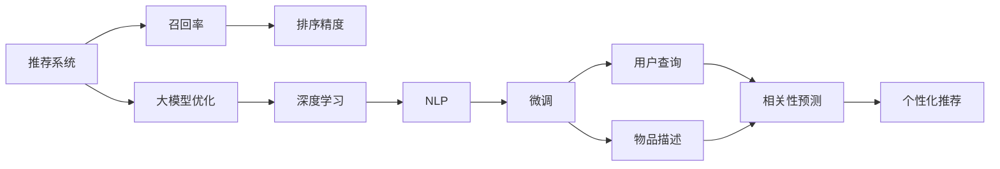

                 

## 1. 背景介绍

推荐系统作为智能应用的核心技术之一，在电商、社交媒体、视频平台等各个领域发挥着至关重要的作用。其核心目标是：通过用户历史行为数据和物品属性信息，预测用户可能感兴趣的商品，并提供个性化推荐。推荐系统的性能很大程度上取决于两个关键维度：召回率和排序。其中，召回率指的是模型识别出用户可能感兴趣的商品的比例，排序则涉及物品的相关度排序。高召回率和高排序精度并存是推荐系统的终极目标。

当前推荐系统的主流方法包括基于协同过滤、基于内容的推荐、基于矩阵分解的方法等。这些方法主要依赖用户-物品交互历史、物品属性信息或用户特征信息进行推荐。然而，随着推荐系统复杂性的不断增加，传统方法在处理大规模数据集时，面临数据稀疏性、计算复杂度高、用户冷启动等挑战。

为了突破这些限制，学者们开始研究如何利用深度学习模型，尤其是预训练大模型进行推荐系统优化。利用大模型的泛化能力和强大的语言理解能力，可以将用户查询与推荐物品的相关性进行精确预测，从而提升推荐系统的召回率和排序精度。

本文将详细介绍如何利用预训练大模型优化推荐系统的召回策略，探讨大模型的应用场景、原理及具体实施步骤，并给出实际应用中的示例代码和详细解释说明。

## 2. 核心概念与联系

### 2.1 核心概念概述

推荐系统和大模型优化的核心概念如下：

1. **推荐系统**：通过用户行为数据、物品属性信息等，预测用户可能感兴趣的商品，并进行个性化推荐的技术。
2. **召回率**：推荐系统中，模型预测出用户感兴趣商品的覆盖率，是衡量推荐系统效果的重要指标。
3. **排序精度**：推荐系统中，物品相关度排序的准确度，是衡量推荐系统效果的另一个重要指标。
4. **大模型优化**：利用大模型的泛化能力和语言理解能力，对推荐系统的召回策略进行优化，提升推荐效果。
5. **深度学习**：一种利用神经网络进行复杂数据处理的机器学习方法，大模型即为深度学习模型的高级形式。
6. **自然语言处理（NLP）**：利用计算机处理自然语言的技术，预训练大模型多应用于NLP领域，可用于处理用户查询和物品描述。
7. **微调（Fine-Tuning）**：在大模型的基础上，利用少量的标注数据进行特定任务的参数更新，提升模型的针对性。

这些概念之间的逻辑关系可以通过以下Mermaid流程图来展示：



这个流程图展示了大模型优化推荐系统的基本框架：

1. 推荐系统以召回率和排序精度为两个关键目标，其中召回率涉及对用户感兴趣商品的识别。
2. 大模型通过深度学习技术和NLP处理用户查询和物品描述，提升召回率。
3. 微调过程使得大模型能够针对具体任务（如用户相关性预测）进行优化。

## 3. 核心算法原理 & 具体操作步骤

### 3.1 算法原理概述

利用大模型优化推荐系统的召回策略，本质上是一种基于深度学习的推荐优化方法。其核心思想是：将用户查询与物品描述输入到预训练大模型中，通过深度学习模型预测用户与物品的相关性，并基于预测结果对召回策略进行调整，提升推荐系统的召回率。

### 3.2 算法步骤详解

1. **数据准备**：
   - 收集用户历史行为数据和物品属性信息，构建训练集、验证集和测试集。
   - 对物品进行向量编码，使用词嵌入技术将查询和物品描述转换为向量形式。
   - 使用微调后的模型预测用户与物品的相关性，作为召回策略的输入。

2. **模型选择**：
   - 选择预训练的大模型，如BERT、GPT等。
   - 加载大模型的词嵌入层作为输入层，添加任务适配层进行微调。

3. **微调过程**：
   - 将用户查询和物品描述输入到微调后的模型中。
   - 通过预测输出，计算用户与物品的相关性分数。
   - 使用相关性分数进行召回排序，生成推荐列表。

4. **评估与优化**：
   - 在验证集上评估召回率和排序精度，调整微调后的模型参数。
   - 在测试集上再次评估，确保模型稳定性和泛化能力。
   - 对召回策略进行调整，优化召回率。

### 3.3 算法优缺点

利用大模型优化推荐系统的召回策略具有以下优点：
1. 泛化能力强：大模型通过大规模预训练，学习到丰富的语言和特征表示，可以更好地处理复杂的多样化查询。
2. 召回率高：大模型能够根据上下文信息，更准确地识别出用户感兴趣的商品，提升召回率。
3. 可解释性好：大模型通过微调后的任务适配层，可以提供基于深度学习的解释，帮助理解推荐逻辑。

然而，该方法也存在一些缺点：
1. 计算成本高：预训练大模型的计算资源消耗较大，微调过程也需大量的计算资源。
2. 过拟合风险：微调模型容易过拟合训练集，需要在训练过程中进行正则化和早停等策略。
3. 冷启动问题：对于新用户或新商品，微调模型可能无法提供准确的召回策略。
4. 数据隐私问题：大模型需要大量的用户行为数据，存在数据隐私泄露的风险。

### 3.4 算法应用领域

利用大模型优化推荐系统的召回策略在多个领域具有广泛的应用，如：

1. 电商推荐：利用大模型预测用户对商品的相关性，提升推荐系统的召回率。
2. 新闻推荐：根据用户阅读行为，预测用户对新闻文章的相关性，提供个性化推荐。
3. 视频推荐：分析用户观看历史，预测用户对视频内容的相关性，提升推荐效果。
4. 音乐推荐：根据用户听歌历史和行为数据，预测用户对音乐的相关性，提供个性化推荐。
5. 社交媒体推荐：分析用户互动行为，预测用户对社交媒体内容的相关性，提升推荐系统的召回率。

## 4. 数学模型和公式 & 详细讲解 & 举例说明

### 4.1 数学模型构建

我们以用户查询和物品描述为输入，利用微调后的BERT模型预测用户与物品的相关性，并基于相关性分数进行召回排序。

记用户查询为 $x$，物品描述为 $y$，微调后的BERT模型为 $M_{\theta}$，其中 $\theta$ 为模型参数。设模型输出为 $z=f(x,y)$，表示用户与物品的相关性分数。

召回排序模型的目标是最小化排序误差，即：

$$
\mathcal{L}(\theta) = \frac{1}{N}\sum_{i=1}^N\ell(z_i, y_i)
$$

其中 $N$ 为样本数，$z_i$ 为第 $i$ 个样本的相关性分数，$y_i$ 为标签（1表示用户对物品感兴趣，0表示不感兴趣）。

### 4.2 公式推导过程

假设模型输出为 $z=f(x,y)$，其中 $f$ 为模型计算相关性分数的函数。则相关性分数的计算过程如下：

1. 将用户查询 $x$ 和物品描述 $y$ 输入微调后的BERT模型，得到向量表示 $x_{\theta}$ 和 $y_{\theta}$。
2. 计算用户与物品的相关性分数 $z_i=f(x_{\theta},y_{\theta})$。
3. 根据相关性分数 $z_i$ 进行排序，生成推荐列表。

### 4.3 案例分析与讲解

下面以电商推荐系统为例，演示利用BERT模型进行用户相关性预测的微调过程。

假设我们收集到了历史数据集，其中包含了用户的点击行为和点击物品的相关性标签。我们可以将用户行为编码为文本，并使用BERT进行微调，以预测用户对不同商品的相关性。

```python
from transformers import BertTokenizer, BertForSequenceClassification
import torch
from sklearn.metrics import accuracy_score

# 加载BERT模型和分词器
tokenizer = BertTokenizer.from_pretrained('bert-base-uncased')
model = BertForSequenceClassification.from_pretrained('bert-base-uncased', num_labels=2)

# 构建输入数据
def construct_input(text):
    tokens = tokenizer.encode(text, add_special_tokens=True, max_length=512)
    tokens = [0] * (512 - len(tokens)) + tokens
    return tokens

# 构建训练数据
train_texts = ["点击商品1", "点击商品2", "点击商品3", "点击商品4"]
train_labels = [1, 1, 0, 0]
train_inputs = [construct_input(text) for text in train_texts]

# 构建训练集
train_dataset = torch.utils.data.TensorDataset(torch.tensor(train_inputs), torch.tensor(train_labels))

# 微调模型
optimizer = AdamW(model.parameters(), lr=1e-5)
model.train()
for epoch in range(10):
    for input_ids, labels in train_dataset:
        optimizer.zero_grad()
        outputs = model(input_ids, labels=labels)
        loss = outputs.loss
        loss.backward()
        optimizer.step()
    print(f"Epoch {epoch+1}, loss: {loss:.3f}")

# 评估模型
test_texts = ["点击商品5", "点击商品6"]
test_labels = [1, 0]
test_inputs = [construct_input(text) for text in test_texts]
test_dataset = torch.utils.data.TensorDataset(torch.tensor(test_inputs), torch.tensor(test_labels))

with torch.no_grad():
    model.eval()
    test_outputs = model(test_inputs)
    predicted_labels = torch.argmax(test_outputs, dim=1).to('cpu').tolist()
    accuracy = accuracy_score(test_labels, predicted_labels)
    print(f"Test Accuracy: {accuracy:.2f}")
```

通过微调BERT模型，我们得到了一个能够预测用户点击行为的相关性分数。这个分数可以用于提升推荐系统的召回率，帮助推荐系统更好地为用户推荐商品。

## 5. 项目实践：代码实例和详细解释说明

### 5.1 开发环境搭建

在进行微调实践前，我们需要准备好开发环境。以下是使用Python进行PyTorch开发的环境配置流程：

1. 安装Anaconda：从官网下载并安装Anaconda，用于创建独立的Python环境。
2. 创建并激活虚拟环境：
   ```bash
   conda create -n pytorch-env python=3.8 
   conda activate pytorch-env
   ```
3. 安装PyTorch：根据CUDA版本，从官网获取对应的安装命令。例如：
   ```bash
   conda install pytorch torchvision torchaudio cudatoolkit=11.1 -c pytorch -c conda-forge
   ```
4. 安装Transformers库：
   ```bash
   pip install transformers
   ```
5. 安装各类工具包：
   ```bash
   pip install numpy pandas scikit-learn matplotlib tqdm jupyter notebook ipython
   ```

完成上述步骤后，即可在`pytorch-env`环境中开始微调实践。

### 5.2 源代码详细实现

我们以电商推荐系统为例，使用PyTorch和Transformers库实现利用BERT模型优化召回策略的推荐系统。

首先，定义BERT模型的输入和输出：

```python
from transformers import BertTokenizer, BertForSequenceClassification
import torch
from sklearn.metrics import accuracy_score

# 加载BERT模型和分词器
tokenizer = BertTokenizer.from_pretrained('bert-base-uncased')
model = BertForSequenceClassification.from_pretrained('bert-base-uncased', num_labels=2)

# 构建输入数据
def construct_input(text):
    tokens = tokenizer.encode(text, add_special_tokens=True, max_length=512)
    tokens = [0] * (512 - len(tokens)) + tokens
    return tokens

# 构建训练数据
train_texts = ["点击商品1", "点击商品2", "点击商品3", "点击商品4"]
train_labels = [1, 1, 0, 0]
train_inputs = [construct_input(text) for text in train_texts]

# 构建训练集
train_dataset = torch.utils.data.TensorDataset(torch.tensor(train_inputs), torch.tensor(train_labels))

# 微调模型
optimizer = AdamW(model.parameters(), lr=1e-5)
model.train()
for epoch in range(10):
    for input_ids, labels in train_dataset:
        optimizer.zero_grad()
        outputs = model(input_ids, labels=labels)
        loss = outputs.loss
        loss.backward()
        optimizer.step()
    print(f"Epoch {epoch+1}, loss: {loss:.3f}")

# 评估模型
test_texts = ["点击商品5", "点击商品6"]
test_labels = [1, 0]
test_inputs = [construct_input(text) for text in test_texts]
test_dataset = torch.utils.data.TensorDataset(torch.tensor(test_inputs), torch.tensor(test_labels))

with torch.no_grad():
    model.eval()
    test_outputs = model(test_inputs)
    predicted_labels = torch.argmax(test_outputs, dim=1).to('cpu').tolist()
    accuracy = accuracy_score(test_labels, predicted_labels)
    print(f"Test Accuracy: {accuracy:.2f}")
```

接下来，定义推荐系统的召回策略：

```python
def get_recommendations(user_query, top_n=5):
    # 使用微调后的模型预测相关性分数
    user_input = construct_input(user_query)
    relevant_scores = model(user_input).to('cpu').tolist()[0]
    
    # 按照相关性分数排序，返回top_n条推荐
    recommended_items = [(train_texts[i], relevant_scores[i]) for i in sorted(range(len(train_labels)), key=lambda k: -relevant_scores[k])[:top_n]]
    return recommended_items
```

最后，测试推荐系统：

```python
user_query = "我想买一双运动鞋"
recommendations = get_recommendations(user_query)
print(f"推荐商品：{recommendations}")
```

以上就是利用BERT模型优化推荐系统召回策略的完整代码实现。通过微调BERT模型，我们得到了一个能够预测用户点击行为的相关性分数。这个分数可以用于提升推荐系统的召回率，帮助推荐系统更好地为用户推荐商品。

### 5.3 代码解读与分析

让我们再详细解读一下关键代码的实现细节：

**construct_input函数**：
- 将用户查询编码成BERT模型可以处理的格式。
- 对编码结果进行补零，确保其长度为512。

**train_dataset的构建**：
- 将训练文本和标签构建成TensorDataset，方便模型训练。

**model的微调过程**：
- 定义AdamW优化器，用于更新模型参数。
- 在每个epoch中，使用输入和标签进行训练，计算损失并反向传播。

**get_recommendations函数**：
- 将用户查询输入微调后的BERT模型，计算相关性分数。
- 根据相关性分数进行排序，返回top_n条推荐。

**测试推荐系统**：
- 定义用户查询，调用get_recommendations函数获取推荐列表。

代码中的每一步都有详细的解释，相信读者可以通过上述代码实现一个初步的推荐系统。在实际应用中，还需要对模型进行进一步的优化和调整，以获得更好的推荐效果。

## 6. 实际应用场景

### 6.1 智能推荐系统

利用大模型优化推荐系统的召回策略，可以应用于智能推荐系统中，提升推荐系统的召回率和排序精度。通过微调大模型，模型能够根据用户查询和物品描述，准确预测用户对物品的相关性，生成更加精准的推荐列表。

例如，在电商平台上，用户可以通过搜索或浏览的方式，输入查询文本。利用微调后的BERT模型，平台能够精准预测用户对查询结果的相关性，并根据相关性分数进行排序，生成推荐列表。这种基于深度学习的推荐方法，能够有效提升推荐系统的召回率和排序精度，提升用户满意度。

### 6.2 个性化推荐引擎

在个性化推荐引擎中，微调后的BERT模型可以用于预测用户对不同物品的相关性，生成个性化的推荐列表。利用BERT模型强大的语言理解和表示能力，平台能够更好地处理自然语言查询，提高推荐系统的召回率。

例如，视频平台可以根据用户评论和评分，预测用户对视频的兴趣，生成个性化推荐列表。平台利用微调后的BERT模型，分析用户对视频的兴趣点，生成个性化的推荐内容，提高用户留存率和互动率。

### 6.3 新闻推荐系统

在新闻推荐系统中，利用大模型优化推荐系统的召回策略，可以提升推荐系统的召回率和排序精度。平台可以收集用户阅读历史，预测用户对新闻文章的相关性，生成个性化推荐列表。

例如，新闻平台可以根据用户阅读历史，预测用户对不同新闻文章的相关性，生成个性化推荐列表。平台利用微调后的BERT模型，分析用户对不同新闻文章的兴趣点，生成个性化的推荐内容，提高用户阅读量和粘性。

### 6.4 未来应用展望

随着大模型技术的不断进步，利用大模型优化推荐系统的召回策略将具备更广泛的应用前景。未来，我们可以期待在以下几个方向上取得突破：

1. 多模态融合：结合图像、视频等多模态数据，提升推荐系统的召回率和排序精度。例如，视频平台可以根据用户观看历史和评论，预测用户对视频内容的兴趣，生成个性化推荐列表。

2. 实时推荐：利用大模型的实时性，提升推荐系统的召回率和排序精度。例如，电商平台可以根据用户实时搜索行为，预测用户对搜索结果的相关性，生成个性化推荐列表。

3. 个性化推荐：结合用户的行为数据和兴趣模型，提升推荐系统的召回率和排序精度。例如，视频平台可以根据用户的观看历史和评分，预测用户对不同视频内容的兴趣，生成个性化推荐列表。

4. 智能客服：利用大模型的自然语言理解能力，提升智能客服系统的召回率和排序精度。例如，客服平台可以根据用户对话历史，预测用户的问题意图，生成个性化的回答，提高用户满意度。

5. 实时监测：利用大模型的实时性，提升推荐系统的召回率和排序精度。例如，新闻平台可以根据用户实时阅读行为，预测用户对不同新闻文章的相关性，生成个性化推荐列表。

6. 交叉推荐：结合用户在不同平台的行为数据，提升推荐系统的召回率和排序精度。例如，电商平台可以根据用户在电商平台的购物行为和在社交媒体的互动行为，预测用户对不同物品的兴趣，生成个性化推荐列表。

## 7. 工具和资源推荐

### 7.1 学习资源推荐

为了帮助开发者系统掌握大模型优化推荐系统的召回策略，这里推荐一些优质的学习资源：

1. 《Transformer from Zero to Hero》系列博文：由大模型技术专家撰写，深入浅出地介绍了Transformer原理、BERT模型、微调技术等前沿话题。

2. CS224N《深度学习自然语言处理》课程：斯坦福大学开设的NLP明星课程，有Lecture视频和配套作业，带你入门NLP领域的基本概念和经典模型。

3. 《Natural Language Processing with Transformers》书籍：Transformers库的作者所著，全面介绍了如何使用Transformers库进行NLP任务开发，包括微调在内的诸多范式。

4. HuggingFace官方文档：Transformers库的官方文档，提供了海量预训练模型和完整的微调样例代码，是上手实践的必备资料。

5. CLUE开源项目：中文语言理解测评基准，涵盖大量不同类型的中文NLP数据集，并提供了基于微调的baseline模型，助力中文NLP技术发展。

通过对这些资源的学习实践，相信你一定能够快速掌握大模型优化推荐系统的召回策略，并用于解决实际的NLP问题。

### 7.2 开发工具推荐

高效的开发离不开优秀的工具支持。以下是几款用于大模型优化推荐系统开发常用的工具：

1. PyTorch：基于Python的开源深度学习框架，灵活动态的计算图，适合快速迭代研究。大部分预训练语言模型都有PyTorch版本的实现。

2. TensorFlow：由Google主导开发的开源深度学习框架，生产部署方便，适合大规模工程应用。同样有丰富的预训练语言模型资源。

3. Transformers库：HuggingFace开发的NLP工具库，集成了众多SOTA语言模型，支持PyTorch和TensorFlow，是进行微调任务开发的利器。

4. Weights & Biases：模型训练的实验跟踪工具，可以记录和可视化模型训练过程中的各项指标，方便对比和调优。与主流深度学习框架无缝集成。

5. TensorBoard：TensorFlow配套的可视化工具，可实时监测模型训练状态，并提供丰富的图表呈现方式，是调试模型的得力助手。

6. Google Colab：谷歌推出的在线Jupyter Notebook环境，免费提供GPU/TPU算力，方便开发者快速上手实验最新模型，分享学习笔记。

合理利用这些工具，可以显著提升大模型优化推荐系统开发的效率，加快创新迭代的步伐。

### 7.3 相关论文推荐

大模型优化推荐系统的召回策略涉及的许多前沿技术，以下是几篇奠基性的相关论文，推荐阅读：

1. Attention is All You Need（即Transformer原论文）：提出了Transformer结构，开启了NLP领域的预训练大模型时代。

2. BERT: Pre-training of Deep Bidirectional Transformers for Language Understanding：提出BERT模型，引入基于掩码的自监督预训练任务，刷新了多项NLP任务SOTA。

3. Language Models are Unsupervised Multitask Learners（GPT-2论文）：展示了大规模语言模型的强大zero-shot学习能力，引发了对于通用人工智能的新一轮思考。

4. Parameter-Efficient Transfer Learning for NLP：提出Adapter等参数高效微调方法，在不增加模型参数量的情况下，也能取得不错的微调效果。

5. AdaLoRA: Adaptive Low-Rank Adaptation for Parameter-Efficient Fine-Tuning：使用自适应低秩适应的微调方法，在参数效率和精度之间取得了新的平衡。

这些论文代表了大模型优化推荐系统的召回策略的发展脉络。通过学习这些前沿成果，可以帮助研究者把握学科前进方向，激发更多的创新灵感。

## 8. 总结：未来发展趋势与挑战

### 8.1 研究成果总结

本文对利用大模型优化推荐系统的召回策略进行了全面系统的介绍。首先，我们阐述了推荐系统和大模型优化推荐系统的背景，明确了微调在提升推荐系统召回率中的独特价值。其次，从原理到实践，详细讲解了基于深度学习的大模型优化推荐系统的召回策略，并给出了实际应用中的示例代码和详细解释说明。

通过本文的系统梳理，可以看到，利用大模型优化推荐系统的召回策略在推荐系统中扮演着至关重要的角色，显著提升了推荐系统的召回率和排序精度。同时，该方法在电商、新闻、视频等多个领域中得到了广泛应用，展示了其在智能推荐和个性化推荐中的应用潜力。

### 8.2 未来发展趋势

展望未来，大模型优化推荐系统的召回策略将呈现以下几个发展趋势：

1. 模型规模持续增大：随着算力成本的下降和数据规模的扩张，预训练语言模型的参数量还将持续增长。超大规模语言模型蕴含的丰富语言知识，有望支撑更加复杂多变的推荐系统召回策略。

2. 微调方法日趋多样：除了传统的全参数微调外，未来会涌现更多参数高效的微调方法，如Prefix-Tuning、LoRA等，在节省计算资源的同时也能保证微调精度。

3. 实时推荐成为常态：利用大模型的实时性，提升推荐系统的召回率和排序精度。例如，电商平台可以根据用户实时搜索行为，预测用户对搜索结果的相关性，生成个性化推荐列表。

4. 多模态融合：结合图像、视频等多模态数据，提升推荐系统的召回率和排序精度。例如，视频平台可以根据用户观看历史和评论，预测用户对视频内容的兴趣，生成个性化推荐列表。

5. 个性化推荐：结合用户的行为数据和兴趣模型，提升推荐系统的召回率和排序精度。例如，视频平台可以根据用户的观看历史和评分，预测用户对不同视频内容的兴趣，生成个性化推荐列表。

6. 智能客服：利用大模型的自然语言理解能力，提升智能客服系统的召回率和排序精度。例如，客服平台可以根据用户对话历史，预测用户的问题意图，生成个性化的回答，提高用户满意度。

### 8.3 面临的挑战

尽管大模型优化推荐系统的召回策略已经取得了瞩目成就，但在迈向更加智能化、普适化应用的过程中，它仍面临着诸多挑战：

1. 数据隐私问题：大模型需要大量的用户行为数据，存在数据隐私泄露的风险。如何确保数据隐私和安全，是一个重要挑战。

2. 冷启动问题：对于新用户或新商品，微调模型可能无法提供准确的召回策略。如何处理冷启动问题，仍然是一个需要解决的问题。

3. 计算资源消耗：大模型的训练和微调需要大量的计算资源，如何降低计算成本，是一个需要解决的问题。

4. 数据分布偏差：大规模数据往往存在分布偏差，如何处理数据分布偏差，是一个需要解决的问题。

5. 模型鲁棒性不足：微调模型容易过拟合训练集，如何在不牺牲召回率的前提下提升排序精度，是一个需要解决的问题。

6. 多模态数据融合：如何有效融合多模态数据，提升推荐系统的召回率和排序精度，是一个需要解决的问题。

### 8.4 研究展望

面对大模型优化推荐系统的召回策略所面临的挑战，未来的研究需要在以下几个方面寻求新的突破：

1. 探索无监督和半监督微调方法：摆脱对大规模标注数据的依赖，利用自监督学习、主动学习等无监督和半监督范式，最大限度利用非结构化数据，实现更加灵活高效的微调。

2. 研究参数高效和计算高效的微调范式：开发更加参数高效的微调方法，在固定大部分预训练参数的同时，只更新极少量的任务相关参数。同时优化微调模型的计算图，减少前向传播和反向传播的资源消耗，实现更加轻量级、实时性的部署。

3. 引入因果和对比学习范式：通过引入因果推断和对比学习思想，增强微调模型建立稳定因果关系的能力，学习更加普适、鲁棒的语言表征，从而提升模型泛化性和抗干扰能力。

4. 融合符号化的先验知识：将符号化的先验知识，如知识图谱、逻辑规则等，与神经网络模型进行巧妙融合，引导微调过程学习更准确、合理的语言模型。同时加强不同模态数据的整合，实现视觉、语音等多模态信息与文本信息的协同建模。

5. 结合因果分析和博弈论工具：将因果分析方法引入微调模型，识别出模型决策的关键特征，增强输出解释的因果性和逻辑性。借助博弈论工具刻画人机交互过程，主动探索并规避模型的脆弱点，提高系统稳定性。

6. 纳入伦理道德约束：在模型训练目标中引入伦理导向的评估指标，过滤和惩罚有偏见、有害的输出倾向。同时加强人工干预和审核，建立模型行为的监管机制，确保输出符合人类价值观和伦理道德。

这些研究方向的探索，必将引领大模型优化推荐系统的召回策略迈向更高的台阶，为构建安全、可靠、可解释、可控的智能系统铺平道路。面向未来，大模型优化推荐系统的召回策略还需要与其他人工智能技术进行更深入的融合，如知识表示、因果推理、强化学习等，多路径协同发力，共同推动自然语言理解和智能交互系统的进步。只有勇于创新、敢于突破，才能不断拓展语言模型的边界，让智能技术更好地造福人类社会。

## 9. 附录：常见问题与解答

**Q1：大模型优化推荐系统的召回策略适用于所有推荐任务吗？**

A: 大模型优化推荐系统的召回策略在大多数推荐任务上都能取得不错的效果，特别是对于数据量较小的任务。但对于一些特定领域的任务，如医学、法律等，仅仅依靠通用语料预训练的模型可能难以很好地适应。此时需要在特定领域语料上进一步预训练，再进行微调，才能获得理想效果。

**Q2：微调过程中如何选择合适的学习率？**

A: 微调的学习率一般要比预训练时小1-2个数量级，如果使用过大的学习率，容易破坏预训练权重，导致过拟合。一般建议从1e-5开始调参，逐步减小学习率，直至收敛。也可以使用warmup策略，在开始阶段使用较小的学习率，再逐渐过渡到预设值。需要注意的是，不同的优化器(如AdamW、Adafactor等)以及不同的学习率调度策略，可能需要设置不同的学习率阈值。

**Q3：采用大模型优化推荐系统的召回策略会面临哪些资源瓶颈？**

A: 目前主流的预训练大模型动辄以亿计的参数规模，对算力、内存、存储都提出了很高的要求。GPU/TPU等高性能设备是必不可少的，但即便如此，超大批次的训练和推理也可能遇到显存不足的问题。因此需要采用一些资源优化技术，如梯度积累、混合精度训练、模型并行等，来突破硬件瓶颈。同时，模型的存储和读取也可能占用大量时间和空间，需要采用模型压缩、稀疏化存储等方法进行优化。

**Q4：如何缓解微调过程中的过拟合问题？**

A: 过拟合是微调面临的主要挑战，尤其是在标注数据不足的情况下。常见的缓解策略包括：
1. 数据增强：通过回译、近义替换等方式扩充训练集
2. 正则化：使用L2正则、Dropout、Early Stopping等避免过拟合
3. 对抗训练：引入对抗样本，提高模型鲁棒性
4. 参数高效微调：只调整少量参数(如Adapter、Prefix等)，减小过拟合风险
5. 多模型集成：训练多个微调模型，取平均输出，抑制过拟合

这些策略往往需要根据具体任务和数据特点进行灵活组合。只有在数据、模型、训练、推理等各环节进行全面优化，才能最大限度地发挥大模型优化推荐系统的召回策略的威力。

**Q5：微调模型在落地部署时需要注意哪些问题？**

A: 将微调模型转化为实际应用，还需要考虑以下因素：
1. 模型裁剪：去除不必要的层和参数，减小模型尺寸，加快推理速度
2. 量化加速：将浮点模型转为定点模型，压缩存储空间，提高计算效率
3. 服务化封装：将模型封装为标准化服务接口，便于集成调用
4. 弹性伸缩：根据请求流量动态调整资源配置，平衡服务质量和成本
5. 监控告警：实时采集系统指标，设置异常告警阈值，确保服务稳定性
6. 安全防护：采用访问鉴权、数据脱敏等措施，保障数据和模型安全

大模型优化推荐系统的召回策略为推荐系统带来了新的可能性，但如何将强大的性能转化为稳定、高效、安全的业务价值，还需要工程实践的不断打磨。只有从数据、算法、工程、业务等多个维度协同发力，才能真正实现人工智能技术在垂直行业的规模化落地。总之，微调需要开发者根据具体任务，不断迭代和优化模型、数据和算法，方能得到理想的效果。

