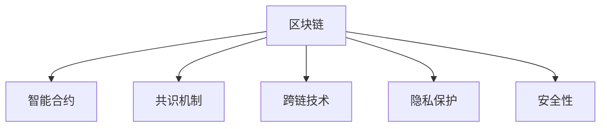

                 

## 1. 背景介绍

### 1.1 问题由来

区块链技术的核心创新在于分布式账本和去中心化信任机制。传统金融系统中存在交易费用高、处理速度慢、数据不透明、易受第三方攻击等问题。而区块链通过去中心化的方式，降低了交易成本，提升了交易速度，提高了数据安全性，增强了信任度。

近年来，随着区块链技术的不断发展，其应用场景不断扩大，从金融、供应链、智能合约等传统领域，到医疗、能源、物联网等新兴领域。区块链技术以其独特的优势，正在推动各行各业的数字化转型。

### 1.2 问题核心关键点

区块链技术的核心在于其去中心化、不可篡改、透明公开的特点，这些特性使得其能够在金融、供应链、智能合约等传统领域进行有效应用，并通过跨链、链上治理等创新，拓展其应用范围。

具体而言，区块链技术的核心关键点包括：
- 去中心化：去除中心化机构，提升系统抗攻击能力和数据安全性。
- 不可篡改：确保记录信息的不可篡改性，保障交易的真实性。
- 透明公开：所有交易信息公开透明，增强信任度。
- 智能合约：通过编程逻辑自动执行合约条款，提高执行效率和公平性。
- 跨链技术：实现不同区块链之间的互联互通，提升数据流通效率。

这些核心特性使得区块链在金融、供应链、智能合约等领域具有巨大的创新潜力。然而，区块链技术在实际应用中也面临诸如性能瓶颈、共识机制复杂、数据隐私保护等问题。如何利用这些技术优势进行创新，成为当前区块链领域的重要研究方向。

## 2. 核心概念与联系

### 2.1 核心概念概述

为更好地理解利用区块链技术进行创新的方法，本节将介绍几个密切相关的核心概念：

- 区块链(Blockchain)：一种去中心化的分布式账本技术，通过共识机制和智能合约实现数据记录、验证和自动执行。

- 智能合约(Smart Contract)：自动执行的合约代码，无需第三方中介，实现交易和执行的自动化。

- 共识机制(Consensus Mechanism)：确保网络节点达成一致的算法，如PoW、PoS等。

- 跨链技术(Cross-chain Technology)：实现不同区块链之间的数据和资产流通，包括联盟链、公有链、私链等。

- 隐私保护(Privacy Protection)：保护区块链上数据的隐私和安全，防止数据泄露和攻击。

- 安全性(Security)：区块链技术通过密码学机制保障数据安全，防止篡改和攻击。

这些核心概念之间的逻辑关系可以通过以下Mermaid流程图来展示：



这个流程图展示了一些区块链的核心概念及其之间的关系：

1. 区块链通过共识机制实现数据记录、验证和自动执行。
2. 智能合约通过编程逻辑实现自动化交易和执行。
3. 跨链技术实现不同区块链之间的数据和资产流通。
4. 隐私保护和安全性是区块链技术的两个重要保障。

这些概念共同构成了区块链技术的框架，为其应用提供了坚实的基础。

## 3. 核心算法原理 & 具体操作步骤
### 3.1 算法原理概述

利用区块链技术进行创新的关键在于如何结合具体应用场景，充分发挥区块链的独特优势。其核心算法原理主要包括以下几点：

1. 去中心化：去除中心化机构，提升系统抗攻击能力和数据安全性。
2. 不可篡改：确保记录信息的不可篡改性，保障交易的真实性。
3. 透明公开：所有交易信息公开透明，增强信任度。
4. 智能合约：通过编程逻辑自动执行合约条款，提高执行效率和公平性。
5. 跨链技术：实现不同区块链之间的互联互通，提升数据流通效率。

### 3.2 算法步骤详解

利用区块链技术进行创新的具体步骤包括：

**Step 1: 识别应用场景**

- 识别目标领域：如金融、供应链、医疗等。
- 确定应用目标：如降低交易成本、提升交易效率、保障数据安全等。

**Step 2: 设计区块链架构**

- 选择适合的区块链类型：如公有链、联盟链、私链等。
- 确定共识机制：如PoW、PoS、DPoS等。
- 设计智能合约：根据应用需求编写自动化执行逻辑。

**Step 3: 实施技术方案**

- 搭建区块链网络：构建节点网络，配置网络参数。
- 开发智能合约：编写和测试智能合约代码。
- 实施跨链方案：实现不同区块链之间的数据和资产流通。

**Step 4: 测试与优化**

- 进行系统测试：验证系统性能和安全。
- 收集用户反馈：优化用户体验和系统性能。
- 迭代改进：根据反馈不断优化系统设计。

**Step 5: 部署与维护**

- 部署系统：将区块链网络部署到生产环境。
- 持续监控：实时监控系统运行状态，及时处理异常。
- 维护更新：根据需求和反馈，定期更新系统功能。

### 3.3 算法优缺点

利用区块链技术进行创新的优点包括：

1. 去中心化：提升系统抗攻击能力和数据安全性。
2. 不可篡改：确保交易的真实性和透明性。
3. 透明公开：增强信任度，提高用户满意度。
4. 智能合约：提高执行效率和公平性，降低人为干预。
5. 跨链技术：实现不同区块链之间的互联互通，提升数据流通效率。

然而，该方法也存在一定的局限性：

1. 性能瓶颈：目前区块链的吞吐量和处理速度仍有待提高。
2. 共识机制复杂：不同的共识机制各有优缺点，需根据应用场景进行选择。
3. 数据隐私保护：如何保护区块链上数据的隐私和安全，防止数据泄露和攻击。
4. 跨链复杂：跨链技术实现起来较为复杂，需要解决互操作性和安全问题。
5. 技术门槛高：区块链技术涉及密码学、分布式系统等多个领域，技术门槛较高。

尽管存在这些局限性，但就目前而言，利用区块链技术进行创新的方法在金融、供应链、智能合约等领域已展现出巨大的潜力和价值。未来相关研究的重点在于如何进一步降低技术门槛，提高区块链的性能和安全性，同时兼顾数据隐私保护和跨链技术等方面的创新。

### 3.4 算法应用领域

利用区块链技术进行创新的方法在多个领域得到应用，包括但不限于：

1. 金融领域：实现去中心化金融(DeFi)应用，如去中心化借贷、稳定币、DeFi交易等。
2. 供应链管理：通过智能合约和区块链，实现供应链全程可追溯和透明化管理。
3. 智能合约：实现自动化执行，如自动执行合同、投票、治理等。
4. 数据交易：通过区块链实现数据的隐私保护和版权管理，如数据交换平台、隐私保护计算等。
5. 物联网：通过区块链实现物联网设备的身份认证和数据共享，如IoT身份认证平台、数据共享平台等。
6. 医疗健康：利用区块链实现医疗数据的隐私保护和共享，如电子病历、药物溯源等。

除了上述这些经典应用外，区块链技术还被创新性地应用到更多场景中，如投票系统、房地产、版权保护、能源交易等，为各行各业带来新的解决方案。

## 4. 数学模型和公式 & 详细讲解  
### 4.1 数学模型构建

利用区块链技术进行创新的数学模型主要包括以下几个方面：

- 共识机制的数学模型：如PoW、PoS等共识机制的数学模型，用于解决网络节点之间的信任问题。
- 智能合约的数学模型：如自动执行合约的数学模型，用于实现自动化交易和执行。
- 隐私保护的数学模型：如隐私计算的数学模型，用于保护区块链上数据的隐私和安全。
- 跨链技术的数学模型：如跨链通信的数学模型，用于实现不同区块链之间的互联互通。

### 4.2 公式推导过程

以共识机制中的PoW为例，推导其数学模型和公式：

1. 共识规则：PoW机制要求网络节点通过计算特定复杂度的问题（如哈希难题）来竞争生成新区块，并得到网络的共识。
2. 计算难度：PoW机制通过调整难度系数来控制问题的计算难度，确保新块产生的速度。
3. 验证机制：网络节点通过验证新块的哈希值是否符合规则，确认其合法性。

根据以上规则，可以得出PoW机制的数学模型：

$$
F_{PoW} = \frac{H_{min}}{W_{target}}
$$

其中 $H_{min}$ 为计算问题的哈希值难度，$W_{target}$ 为目标工作量。

### 4.3 案例分析与讲解

以智能合约为例，智能合约的数学模型主要包括以下几个方面：

- 状态机模型：通过状态机模型描述智能合约的执行过程。
- 编程语言模型：通过编程语言模型实现智能合约的自动化执行。
- 验证模型：通过验证模型确保智能合约的执行结果正确性。

以一个简单的智能合约为例，可以推导其数学模型：

1. 状态机：智能合约的状态包括“未执行”、“已执行”、“已完成”等。
2. 编程语言：智能合约使用Solidity等编程语言编写执行逻辑。
3. 验证模型：通过验证模型确保合约执行结果符合预期。

在编写智能合约时，需要考虑以下几个关键点：

- 编写规则明确：确保合约执行逻辑清晰，便于验证和理解。
- 避免代码漏洞：确保代码没有逻辑错误和安全漏洞，防止攻击。
- 测试验证：对合约进行全面的测试验证，确保执行结果正确。

## 5. 项目实践：代码实例和详细解释说明
### 5.1 开发环境搭建

在进行区块链项目开发前，我们需要准备好开发环境。以下是使用Python进行Hyperledger Fabric开发的环境配置流程：

1. 安装Hyperledger Fabric：从官网下载并安装Hyperledger Fabric，构建网络节点和通道。

2. 创建并激活虚拟环境：
```bash
conda create -n fab-env python=3.8 
conda activate fab-env
```

3. 安装相关工具包：
```bash
pip install fabric-crypto fabric-chaincode-shim fabric-peer-client fabric-gateway
```

4. 构建区块链网络：通过启动节点和加入通道，构建区块链网络。

5. 部署智能合约：使用fabric-gateway和fabric-chaincode-shim，编译和部署智能合约代码。

### 5.2 源代码详细实现

下面以智能合约项目为例，给出使用Hyperledger Fabric进行智能合约开发的PyTorch代码实现。

```python
# 引入相关模块
from hyperledger.fabric import Gateway, Wallets, Client, Consenter, PemUtils

# 配置网络参数
org1 = 'org1.example.com'
org2 = 'org2.example.com'
user1 = 'user1'
user2 = 'user2'
peer0 = 'peer0'
peer1 = 'peer1'
channel_id = 'mychannel'

# 创建 Gateway
gateway = Gateway('localhost:7051')

# 创建 Peer
peer0_obj = gateway.create_peer(peer0)
peer1_obj = gateway.create_peer(peer1)

# 创建 Wallet
wallet = Wallets.Wallets()

# 创建 Client
client = Client('peer0', gateway, wallet, org1)

# 创建 Consenter
consentor = Client('peer0', gateway, wallet, org1)
consenter = Consenter('peer0', gateway, wallet, org1)

# 部署智能合约
cc_path = 'path/to/chaincode'
cc_name = 'MySmartContract'

def deploy_cc():
    with open(cc_path, 'rb') as f:
        cc_data = f.read()
    response = client.deploy_cc(cc_data, cc_name, org2, org1)
    if response['response']['status'] == 'success':
        print(f"Smart Contract {cc_name} deployed successfully.")
    else:
        print(f"Smart Contract deployment failed.")

deploy_cc()
```

以上就是使用Hyperledger Fabric进行智能合约项目开发的完整代码实现。可以看到，得益于Hyperledger Fabric的强大封装，我们可以用相对简洁的代码实现智能合约的部署和调用。

### 5.3 代码解读与分析

让我们再详细解读一下关键代码的实现细节：

**Hyperledger Fabric环境配置**：
- 安装Hyperledger Fabric：构建区块链网络。
- 创建并激活虚拟环境：为Python环境配置依赖。
- 安装相关工具包：确保开发所需依赖。
- 构建区块链网络：启动节点和加入通道。
- 部署智能合约：编译和部署智能合约代码。

**智能合约代码实现**：
- 使用Hyperledger Fabric的API，通过Gateway、Peer、Wallet等组件，构建区块链环境。
- 使用Client和Consenter组件，进行智能合约的部署和调用。
- 定义智能合约的执行逻辑，实现自动化交易和执行。

**智能合约部署**：
- 通过open函数读取智能合约的代码数据。
- 使用Client的deploy_cc方法，部署智能合约到区块链网络。
- 根据响应结果，判断智能合约部署是否成功。

可以看到，Hyperledger Fabric提供了强大的封装和工具支持，使得智能合约的开发和部署变得相对简单。开发者可以将更多精力放在智能合约的逻辑实现和业务设计上，而不必过多关注底层的实现细节。

当然，工业级的系统实现还需考虑更多因素，如网络安全、数据隐私、跨链互操作等。但核心的智能合约范式基本与此类似。

## 6. 实际应用场景
### 6.1 智能合约平台

智能合约平台通过区块链技术实现自动化执行，为金融、供应链等领域的业务提供了新的解决方案。

在金融领域，智能合约可以自动执行借贷、资产抵押等金融操作，降低交易成本，提高交易效率。例如，利用智能合约实现自动贷款，只需输入借款金额、期限等条件，即可自动计算利率、自动完成放款和还款，无需第三方中介。

在供应链管理中，智能合约可以自动执行合同条款，实现供应链全程可追溯和透明化管理。例如，利用智能合约实现自动支付和结算，确保供应链上下游企业按照合同条款及时支付货款，提升供应链整体效率。

### 6.2 去中心化金融(DeFi)

去中心化金融通过区块链技术，提供去中心化的金融服务，如借贷、交易、稳定币等。DeFi平台利用智能合约，实现自动执行，降低交易成本，提高交易效率，增强金融服务的透明度和公平性。

在DeFi借贷平台中，用户只需输入借款金额、期限等条件，即可自动计算利率、自动完成放款和还款，无需第三方中介。同时，DeFi平台通过智能合约自动执行，确保交易的透明性和公平性，防止欺诈和操纵行为。

在DeFi交易平台中，用户只需输入交易订单，即可自动执行交易操作，无需第三方中介。DeFi平台通过智能合约自动执行，确保交易的透明性和公平性，防止欺诈和操纵行为。

### 6.3 数据交换平台

数据交换平台通过区块链技术，实现数据的隐私保护和共享，为数据交易、隐私计算等提供新的解决方案。

在数据交换平台中，数据提供方将数据上传至区块链，数据需求方通过智能合约申请数据访问权限。数据提供方同意后，智能合约自动执行数据传输，确保数据传输的安全性和透明性。

在隐私计算平台中，数据提供方通过智能合约生成数据访问令牌，数据需求方通过智能合约申请令牌使用权限。数据提供方同意后，智能合约自动执行令牌发放和数据传输，确保数据使用的隐私性和安全性。

### 6.4 未来应用展望

随着区块链技术的不断发展，基于区块链技术的创新将涵盖更多领域，带来更加广泛的应用场景。

在智慧城市治理中，智能合约可以实现城市事件监测、舆情分析、应急指挥等环节，提高城市管理的自动化和智能化水平，构建更安全、高效的未来城市。

在智能医疗中，智能合约可以实现医疗数据的隐私保护和共享，为电子病历、药物溯源等提供新的解决方案。例如，利用智能合约实现医疗数据的安全共享，确保患者隐私保护。

在智能制造中，智能合约可以实现生产设备的身份认证和数据共享，为智能制造提供新的解决方案。例如，利用智能合约实现设备状态的透明共享，提升生产效率和设备管理水平。

此外，区块链技术还被创新性地应用到更多场景中，如物联网、教育、能源等，为各行各业带来新的解决方案。

## 7. 工具和资源推荐
### 7.1 学习资源推荐

为了帮助开发者系统掌握区块链技术的理论基础和实践技巧，这里推荐一些优质的学习资源：

1. 《区块链技术基础》系列博文：由区块链技术专家撰写，深入浅出地介绍了区块链原理、智能合约、共识机制等基本概念。

2. CS51x《Blockchain: Theory and Practice》课程：哈佛大学开设的区块链技术课程，系统讲解了区块链技术和应用场景。

3. 《Mastering Blockchain with Solidity》书籍：Solidity官方文档，全面介绍了如何使用Solidity编写智能合约，适用于开发DeFi等应用。

4. Hyperledger官方文档：Hyperledger Fabric官方文档，提供了海量区块链和智能合约的开发样例，是实践区块链技术的必备资料。

5. Ethereum官网：Ethereum区块链平台，提供了丰富的智能合约开发资源和开发工具，适用于开发DApp等应用。

通过对这些资源的学习实践，相信你一定能够快速掌握区块链技术的精髓，并用于解决实际的业务问题。

### 7.2 开发工具推荐

高效的区块链开发离不开优秀的工具支持。以下是几款用于区块链开发常用的工具：

1. Hyperledger Fabric：由Hyperledger开发的企业级区块链平台，提供区块链网络、智能合约、身份管理等功能。

2. Ethereum：由Vitalik Buterin创立的公有区块链平台，支持智能合约和去中心化应用开发。

3. ConsenSys：Ethereum生态系统，提供Ethereum开发工具、测试网络和社区支持。

4. Truffle：基于Solidity的开发框架，提供智能合约开发、测试和部署工具。

5. Parity：开源区块链平台，提供Ethereum节点、钱包和开发工具。

合理利用这些工具，可以显著提升区块链项目的开发效率，加快创新迭代的步伐。

### 7.3 相关论文推荐

区块链技术的发展源于学界的持续研究。以下是几篇奠基性的相关论文，推荐阅读：

1. Satoshi Nakamoto, "Bitcoin: A Peer-to-Peer Electronic Cash System"：比特币白皮书，首次提出区块链概念和技术架构。

2. Vitalik Buterin, "Ethereum Whitepaper"：以太坊白皮书，详细介绍了以太坊平台和智能合约技术。

3. Gavin Wood, "Decentraland Whitepaper"：去中心化世界白皮书，介绍了去中心化世界和去中心化身份的概念。

4. Daniel Larimer, "EOS.IO Whitepaper"：EOS.IO白皮书，介绍了EOS平台的技术架构和应用场景。

5. Neal Patwari, "The Future of Blockchain"：未来区块链，探讨了区块链技术的发展趋势和应用前景。

这些论文代表了大数据和区块链技术的发展脉络。通过学习这些前沿成果，可以帮助研究者把握学科前进方向，激发更多的创新灵感。

## 8. 总结：未来发展趋势与挑战

### 8.1 总结

本文对利用区块链技术进行创新的方法进行了全面系统的介绍。首先阐述了区块链技术的核心优势和应用前景，明确了在金融、供应链、智能合约等领域进行区块链创新的独特价值。其次，从原理到实践，详细讲解了区块链技术的核心算法原理和具体操作步骤，给出了区块链项目开发的完整代码实例。同时，本文还广泛探讨了区块链技术在智慧城市、智能医疗、智能制造等领域的创新应用，展示了区块链技术的广阔前景。

通过本文的系统梳理，可以看到，利用区块链技术进行创新的方法正在成为区块链领域的重要范式，极大地拓展了区块链技术的适用范围，推动了区块链技术的产业化进程。未来，伴随区块链技术的持续演进，基于区块链技术的创新必将在更广阔的领域展现其巨大的潜力和价值。

### 8.2 未来发展趋势

展望未来，区块链技术的创新将呈现以下几个发展趋势：

1. 性能提升：随着区块链技术的不断优化，交易吞吐量和处理速度将显著提升，有望解决当前性能瓶颈问题。

2. 跨链技术发展：不同区块链之间的互操作性和互联互通性将得到进一步提升，打破数据孤岛，提升数据流通效率。

3. 智能合约普及：智能合约将更加广泛地应用于各类场景，实现自动化执行，提升交易效率和公平性。

4. 数据隐私保护：区块链技术的隐私保护能力将进一步提升，确保数据安全和隐私保护。

5. 去中心化治理：区块链平台将更多地采用去中心化治理机制，提高系统的透明性和公平性。

6. 跨链桥接：不同区块链之间的跨链桥接技术将得到快速发展，实现不同区块链之间的无缝连接。

以上趋势凸显了区块链技术的发展潜力，这些方向的探索发展，必将进一步提升区块链系统的性能和安全性，拓展区块链技术的应用范围。

### 8.3 面临的挑战

尽管区块链技术已经取得了显著成就，但在迈向更加智能化、普适化应用的过程中，它仍面临着诸多挑战：

1. 性能瓶颈：当前区块链的吞吐量和处理速度仍有待提高，如何进一步提升性能，将是未来的重要研究课题。

2. 共识机制复杂：不同的共识机制各有优缺点，如何选择适合的共识机制，如何优化共识算法，仍需深入研究和实践。

3. 数据隐私保护：如何保护区块链上数据的隐私和安全，防止数据泄露和攻击，仍是区块链技术的一个重要挑战。

4. 跨链互操作：跨链技术实现起来较为复杂，如何实现互操作性和安全，仍是区块链技术的一个重要问题。

5. 技术门槛高：区块链技术涉及密码学、分布式系统等多个领域，技术门槛较高，如何降低技术门槛，提升易用性，将是未来的研究方向。

尽管存在这些挑战，但区块链技术在金融、供应链、智能合约等领域已经展现出了巨大的潜力。未来相关研究的重点在于如何进一步降低技术门槛，提高区块链的性能和安全性，同时兼顾数据隐私保护和跨链技术等方面的创新。

### 8.4 研究展望

面对区块链技术所面临的挑战，未来的研究需要在以下几个方面寻求新的突破：

1. 探索性能优化算法：开发更加高效的共识算法、存储算法和网络优化算法，提升区块链系统的性能和安全性。

2. 研究跨链互操作技术：开发跨链互操作技术，实现不同区块链之间的无缝连接和数据流通。

3. 融合分布式计算和隐私保护：利用分布式计算和隐私保护技术，提高区块链系统的处理能力和隐私保护能力。

4. 引入区块链架构设计：引入区块链架构设计方法，提升区块链系统的可扩展性和灵活性。

5. 探索区块链应用场景：探索区块链技术在医疗、能源、物联网等新兴领域的应用场景，拓展区块链技术的应用范围。

6. 建立区块链生态系统：建立区块链生态系统，促进区块链技术的商业应用和产业联盟。

这些研究方向的探索，必将引领区块链技术迈向更高的台阶，为区块链技术的发展带来新的动力和突破。总之，区块链技术的创新需要多方协同发力，共同推动区块链技术的广泛应用和持续发展。

## 9. 附录：常见问题与解答

**Q1：如何选择合适的区块链平台？**

A: 选择合适的区块链平台需要考虑多个因素，包括应用场景、业务需求、技术栈等。

1. 应用场景：根据应用场景选择合适的区块链平台。例如，公有链适用于需要去中心化和开放性的应用，联盟链适用于需要隐私保护和可控性的应用。

2. 业务需求：根据业务需求选择合适的区块链平台。例如，智能合约平台适用于需要自动化执行和公平性的应用，去中心化金融平台适用于需要去中心化和金融服务的应用。

3. 技术栈：根据技术栈选择合适的区块链平台。例如，Hyperledger Fabric适用于Java开发，Ethereum适用于Solidity开发。

**Q2：区块链项目开发需要注意哪些问题？**

A: 区块链项目开发需要注意以下几个问题：

1. 网络安全：确保区块链网络的稳定性和安全性，防止攻击和故障。

2. 数据隐私保护：确保区块链上数据的隐私和安全，防止数据泄露和攻击。

3. 性能优化：确保区块链系统的性能和效率，提高交易吞吐量和处理速度。

4. 跨链互操作：确保不同区块链之间的互操作性和数据流通。

5. 系统测试：对区块链系统进行全面的测试验证，确保系统的稳定性和正确性。

6. 系统部署：确保区块链系统的稳定部署和运行，防止系统故障和异常。

**Q3：区块链技术的未来发展趋势是什么？**

A: 区块链技术的未来发展趋势包括：

1. 性能提升：随着区块链技术的不断优化，交易吞吐量和处理速度将显著提升，有望解决当前性能瓶颈问题。

2. 跨链技术发展：不同区块链之间的互操作性和互联互通性将得到进一步提升，打破数据孤岛，提升数据流通效率。

3. 智能合约普及：智能合约将更加广泛地应用于各类场景，实现自动化执行，提升交易效率和公平性。

4. 数据隐私保护：区块链技术的隐私保护能力将进一步提升，确保数据安全和隐私保护。

5. 去中心化治理：区块链平台将更多地采用去中心化治理机制，提高系统的透明性和公平性。

6. 跨链桥接：不同区块链之间的跨链桥接技术将得到快速发展，实现不同区块链之间的无缝连接。

这些趋势凸显了区块链技术的发展潜力，这些方向的探索发展，必将进一步提升区块链系统的性能和安全性，拓展区块链技术的应用范围。

---

作者：禅与计算机程序设计艺术 / Zen and the Art of Computer Programming

