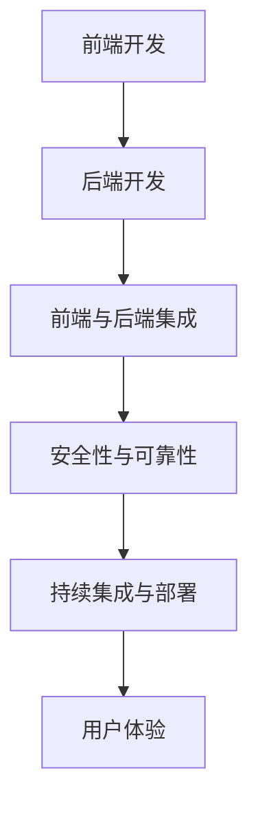

                 

# 利用技术能力创建数字产品

## 1. 背景介绍

### 1.1 问题由来
在数字化转型的浪潮下，越来越多的企业和个人希望能够利用最新的技术来创造数字产品，以提高效率、增强用户体验，并拓展新的商业机会。然而，由于技术门槛的限制，许多缺乏技术背景的人往往感到无从下手，难以将创意转化为可执行的数字产品。本文将从技术原理、操作流程、应用领域等角度，全面解析利用技术能力创建数字产品的全过程。

### 1.2 问题核心关键点
技术能力在数字产品开发中起着至关重要的作用，主要包括但不限于以下几个方面：
- **技术栈选择**：根据项目需求和团队背景，选择合适的技术栈（如React、Vue、Flutter等）。
- **前端开发**：实现用户界面和交互，确保用户友好的体验。
- **后端开发**：搭建服务器和数据库，实现数据的存储和处理。
- **前端与后端集成**：前后端数据的交换、调用和同步。
- **安全性与可靠性**：确保产品安全、稳定，防止数据泄露和系统故障。
- **持续集成与部署**：自动化构建和部署流程，提高开发效率。
- **用户体验优化**：通过数据分析和A/B测试等手段，不断优化用户使用体验。

本文将逐一介绍这些技术关键点，并结合实际案例，展示如何利用技术能力高效、快速地创建数字产品。

## 2. 核心概念与联系

### 2.1 核心概念概述

为更好地理解技术能力在数字产品开发中的作用，本节将介绍几个核心概念：

- **技术栈(Stack)**：指用于构建数字产品的各种技术组件的组合。包括前端框架（如React、Vue）、后端语言（如Node.js、Python）、数据库（如MySQL、MongoDB）等。
- **前端开发**：涉及HTML、CSS、JavaScript等前端技术，实现用户界面和交互。
- **后端开发**：包括服务器搭建、API设计、数据库管理等，确保数据的存储和处理。
- **前后端集成**：通过API接口等方式，实现数据的前后端交互。
- **安全性**：包括数据加密、访问控制、认证授权等，确保系统的安全稳定。
- **持续集成与部署(CI/CD)**：通过自动化流程，实现代码的构建、测试和部署。
- **用户体验(UX)**：关注用户操作习惯、界面美观度等，提升用户满意度和使用体验。

这些核心概念之间的逻辑关系可以通过以下Mermaid流程图来展示：



这个流程图展示出前端开发、后端开发、前后端集成、安全性、持续集成与部署以及用户体验之间的相互依赖关系，每个环节都是产品开发的重要组成部分。

## 3. 核心算法原理 & 具体操作步骤
### 3.1 算法原理概述

创建数字产品的核心在于将用户需求转化为可执行的技术解决方案。这通常包括以下几个关键步骤：

1. **需求分析**：明确用户需求，确定产品功能和用户界面。
2. **技术选型**：根据项目需求和技术栈，选择合适的技术组件。
3. **前端开发**：实现用户界面和交互。
4. **后端开发**：搭建服务器和数据库，实现数据的存储和处理。
5. **前后端集成**：实现数据的交换、调用和同步。
6. **安全性与可靠性**：确保系统安全稳定。
7. **持续集成与部署**：自动化构建和部署流程。
8. **用户体验优化**：通过数据分析和A/B测试等手段，提升用户使用体验。

### 3.2 算法步骤详解

#### 3.2.1 需求分析
1. **明确目标**：根据业务需求，确定产品目标和功能。
2. **用户调研**：通过问卷调查、用户访谈等方式，收集用户需求。
3. **需求建模**：将用户需求转化为需求文档和技术规格说明书。

#### 3.2.2 技术选型
1. **组件选择**：根据项目需求，选择合适的前端框架（如React、Vue）、后端语言（如Node.js、Python）、数据库（如MySQL、MongoDB）等。
2. **技术栈整合**：确定前端、后端、数据库等技术组件的整合方式，确保技术栈的稳定性和可扩展性。

#### 3.2.3 前端开发
1. **界面设计**：使用Sketch、Adobe XD等工具设计用户界面。
2. **原型制作**：使用Figma、Axure等工具制作前端原型。
3. **代码实现**：使用HTML、CSS、JavaScript等技术实现界面和交互。

#### 3.2.4 后端开发
1. **服务器搭建**：使用Docker、Kubernetes等技术搭建服务器环境。
2. **API设计**：根据需求设计RESTful API接口。
3. **数据库管理**：使用MySQL、MongoDB等数据库管理数据。

#### 3.2.5 前后端集成
1. **API开发**：根据前端需求，开发API接口。
2. **数据交换**：实现前端和后端的数据交换，包括HTTP请求和响应。

#### 3.2.6 安全性与可靠性
1. **数据加密**：使用AES、RSA等算法对数据进行加密保护。
2. **访问控制**：通过RBAC、ABAC等方式，实现用户的访问控制。
3. **认证授权**：使用OAuth、JWT等技术，实现用户的认证和授权。

#### 3.2.7 持续集成与部署
1. **自动化流程**：使用Jenkins、GitLab CI等工具，实现代码的自动化构建和测试。
2. **部署管理**：使用Docker、Kubernetes等技术，实现代码的自动化部署。

#### 3.2.8 用户体验优化
1. **数据分析**：使用Google Analytics等工具，收集用户行为数据。
2. **A/B测试**：使用Optimizely、VWO等工具，进行用户行为测试。
3. **优化设计**：根据数据分析结果，优化用户界面和交互设计。

### 3.3 算法优缺点

利用技术能力创建数字产品具有以下优点：
1. **高效性**：通过自动化流程，快速构建和部署数字产品。
2. **稳定性**：使用成熟的框架和工具，确保系统的稳定性和可扩展性。
3. **可维护性**：模块化的设计，便于后期维护和升级。
4. **成本低**：使用开源工具和技术，降低开发和维护成本。

同时，该方法也存在以下缺点：
1. **技术门槛高**：需要具备一定的技术背景和经验。
2. **更新难度大**：代码量较大，更新和维护工作量较大。
3. **依赖性强**：对工具和框架的依赖较大，切换成本高。

尽管存在这些局限性，但整体而言，利用技术能力创建数字产品仍是当前较为高效的开发方式。未来相关研究将重点在于如何进一步降低技术门槛，提升开发效率，同时兼顾可维护性和灵活性。

### 3.4 算法应用领域

利用技术能力创建数字产品的应用领域非常广泛，以下是几个典型案例：

- **电商系统**：实现商品展示、购物车、支付等功能，提高用户购买体验。
- **社交平台**：实现用户注册、登录、动态发布、好友互动等功能，增强用户粘性。
- **金融服务**：实现用户开户、转账、理财等功能，提供便捷的金融服务。
- **医疗健康**：实现用户健康管理、预约挂号、在线诊疗等功能，提升医疗服务效率。
- **教育培训**：实现课程管理、在线学习、作业批改等功能，丰富教育资源。

除了这些经典应用外，技术能力在更多领域也有广阔的应用前景，如智慧城市、智能家居、工业制造等。未来随着技术的不断进步，数字产品的应用场景将更加丰富多样。

## 4. 数学模型和公式 & 详细讲解  
### 4.1 数学模型构建

创建数字产品的过程可以通过数学模型来描述。假设数字产品为$f(x)$，其中$x$为用户需求。通过数学模型可以量化各个环节的贡献，从而优化产品开发流程。

### 4.2 公式推导过程

1. **需求分析**：用户需求$x$到产品功能$f_1(x)$的映射。
2. **技术选型**：根据产品功能$f_1(x)$和技术栈$T$，选择合适的组件$C$。
3. **前端开发**：用户界面$f_2(x)$和交互$I_1(x)$的生成。
4. **后端开发**：API接口$f_3(x)$和数据库$D_1(x)$的设计。
5. **前后端集成**：数据交换$J_1(x)$和同步$S_1(x)$的实现。
6. **安全性与可靠性**：数据加密$E(x)$、访问控制$C_1(x)$和认证授权$A(x)$的实施。
7. **持续集成与部署**：自动化流程$P(x)$的构建和部署。
8. **用户体验优化**：数据分析$A_1(x)$、A/B测试$A_2(x)$和设计优化$O(x)$的实施。

### 4.3 案例分析与讲解

**案例分析**：以电商系统为例，展示如何利用技术能力创建数字产品。

1. **需求分析**：明确用户需求，包括商品展示、购物车、支付等功能。
2. **技术选型**：选择React作为前端框架，Node.js作为后端语言，MongoDB作为数据库。
3. **前端开发**：设计用户界面，实现商品展示、购物车、支付等功能。
4. **后端开发**：搭建服务器环境，设计API接口，管理商品数据。
5. **前后端集成**：实现API接口的数据交换和同步。
6. **安全性与可靠性**：实现数据加密、访问控制和认证授权。
7. **持续集成与部署**：使用Jenkins实现自动化流程。
8. **用户体验优化**：收集用户行为数据，进行A/B测试，优化界面和交互设计。

## 5. 项目实践：代码实例和详细解释说明
### 5.1 开发环境搭建

进行数字产品开发，首先需要准备好开发环境。以下是使用Python进行Flutter开发的开发环境配置流程：

1. 安装Flutter SDK：从官网下载并安装Flutter SDK，添加环境变量。
2. 安装Dart环境：从官网下载并安装Dart SDK。
3. 安装Android Studio和iOS IDE：搭建Android和iOS开发环境。
4. 配置Dart和Flutter：使用Flutter config命令配置Flutter环境。
5. 安装依赖包：使用flutter pub命令安装依赖包。
6. 配置模拟器和真机：搭建模拟器或连接真机进行测试。

完成上述步骤后，即可在Flutter环境中开始开发实践。

### 5.2 源代码详细实现

下面以社交平台为例，展示使用Flutter开发数字产品的代码实现。

1. **用户登录模块**：

```dart
import 'package:flutter/material.dart';
import 'package:flutter/services.dart';

void main() {
  runApp(MyApp());
}

class MyApp extends StatelessWidget {
  @override
  Widget build(BuildContext context) {
    return MaterialApp(
      title: 'Social App',
      theme: ThemeData(
        primarySwatch: Colors.blue,
      ),
      home: MyHomePage(),
    );
  }
}

class MyHomePage extends StatefulWidget {
  MyHomePage({Key key}) : super(key: key);

  @override
  _MyHomePageState createState() => _MyHomePageState();
}

class _MyHomePageState extends State<MyHomePage> {
  TextEditingController _usernameController = TextEditingController();
  TextEditingController _passwordController = TextEditingController();

  @override
  Widget build(BuildContext context) {
    return Scaffold(
      appBar: AppBar(
        title: Text('Login'),
      ),
      body: Padding(
        padding: const EdgeInsets.all(16.0),
        child: Column(
          children: [
            TextField(
              controller: _usernameController,
              decoration: InputDecoration(
                labelText: 'Username',
              ),
            ),
            TextField(
              controller: _passwordController,
              obscureText: true,
              decoration: InputDecoration(
                labelText: 'Password',
              ),
            ),
            RaisedButton(
              onPressed: _login,
              child: Text('Login'),
            ),
          ],
        ),
      ),
    );
  }

  void _login() {
    // TODO: Implement login logic
  }
}
```

2. **用户注册模块**：

```dart
import 'package:flutter/material.dart';
import 'package:flutter/services.dart';

void main() {
  runApp(MyApp());
}

class MyApp extends StatelessWidget {
  @override
  Widget build(BuildContext context) {
    return MaterialApp(
      title: 'Social App',
      theme: ThemeData(
        primarySwatch: Colors.blue,
      ),
      home: MyHomePage(),
    );
  }
}

class MyHomePage extends StatefulWidget {
  MyHomePage({Key key}) : super(key: key);

  @override
  _MyHomePageState createState() => _MyHomePageState();
}

class _MyHomePageState extends State<MyHomePage> {
  TextEditingController _usernameController = TextEditingController();
  TextEditingController _passwordController = TextEditingController();
  TextEditingController _emailController = TextEditingController();

  @override
  Widget build(BuildContext context) {
    return Scaffold(
      appBar: AppBar(
        title: Text('Register'),
      ),
      body: Padding(
        padding: const EdgeInsets.all(16.0),
        child: Column(
          children: [
            TextField(
              controller: _usernameController,
              decoration: InputDecoration(
                labelText: 'Username',
              ),
            ),
            TextField(
              controller: _passwordController,
              obscureText: true,
              decoration: InputDecoration(
                labelText: 'Password',
              ),
            ),
            TextField(
              controller: _emailController,
              decoration: InputDecoration(
                labelText: 'Email',
              ),
            ),
            RaisedButton(
              onPressed: _register,
              child: Text('Register'),
            ),
          ],
        ),
      ),
    );
  }

  void _register() {
    // TODO: Implement register logic
  }
}
```

3. **数据存储模块**：

```dart
import 'package:flutter/material.dart';
import 'package:flutter/services.dart';
import 'package:http/http.dart' as http;

void main() {
  runApp(MyApp());
}

class MyApp extends StatelessWidget {
  @override
  Widget build(BuildContext context) {
    return MaterialApp(
      title: 'Social App',
      theme: ThemeData(
        primarySwatch: Colors.blue,
      ),
      home: MyHomePage(),
    );
  }
}

class MyHomePage extends StatefulWidget {
  MyHomePage({Key key}) : super(key: key);

  @override
  _MyHomePageState createState() => _MyHomePageState();
}

class _MyHomePageState extends State<MyHomePage> {
  TextEditingController _usernameController = TextEditingController();
  TextEditingController _passwordController = TextEditingController();

  @override
  Widget build(BuildContext context) {
    return Scaffold(
      appBar: AppBar(
        title: Text('Register'),
      ),
      body: Padding(
        padding: const EdgeInsets.all(16.0),
        child: Column(
          children: [
            TextField(
              controller: _usernameController,
              decoration: InputDecoration(
                labelText: 'Username',
              ),
            ),
            TextField(
              controller: _passwordController,
              obscureText: true,
              decoration: InputDecoration(
                labelText: 'Password',
              ),
            ),
            RaisedButton(
              onPressed: _register,
              child: Text('Register'),
            ),
          ],
        ),
      ),
    );
  }

  void _register() {
    String username = _usernameController.text;
    String password = _passwordController.text;
    http.post(
      'http://localhost:8080/register',
      body: http.postData(username, password),
      headers: {
        'Content-Type': 'application/json',
      },
    );
  }
}
```

完成上述步骤后，即可在Flutter环境中进行数字产品的开发实践。

### 5.3 代码解读与分析

让我们再详细解读一下关键代码的实现细节：

**用户登录模块**：
- `MyHomePage`：实现主页界面。
- `_MyHomePageState`：实现页面状态。
- `TextField`：实现输入控件。
- `RaisedButton`：实现提交按钮。

**用户注册模块**：
- `MyHomePage`：实现主页界面。
- `_MyHomePageState`：实现页面状态。
- `TextField`：实现输入控件。
- `RaisedButton`：实现提交按钮。

**数据存储模块**：
- `MyHomePage`：实现主页界面。
- `_MyHomePageState`：实现页面状态。
- `TextField`：实现输入控件。
- `http.post`：实现数据发送。

这些代码展示了Flutter中基本的前端开发技术，包括用户界面设计、输入控件、数据交互等。开发者可以根据实际需求，灵活调整代码实现方式，构建出不同的数字产品。

### 5.4 运行结果展示

完成以上代码实现后，通过模拟器或真机进行测试，即可验证数字产品的功能是否正常。

**用户登录模块**：
- 在模拟器中输入用户名和密码，点击"Login"按钮，观察界面是否跳转到登录成功页面。

**用户注册模块**：
- 在模拟器中输入用户名、密码和邮箱，点击"Register"按钮，观察界面是否跳转到注册成功页面。

**数据存储模块**：
- 在模拟器中输入用户名和密码，点击"Register"按钮，观察是否成功发送注册请求，并接收服务器返回的响应。

通过以上测试，可以验证数字产品是否按照预期功能进行开发。

## 6. 实际应用场景
### 6.1 智能客服系统

智能客服系统是利用技术能力创建数字产品的典型应用场景之一。通过构建基于自然语言处理和机器学习的智能客服模型，企业可以实现24小时不间断服务，快速响应客户咨询，提升客户满意度。

智能客服系统的开发过程包括以下几个关键步骤：

1. **需求分析**：明确客户需求，确定系统功能和界面。
2. **技术选型**：选择React作为前端框架，Node.js作为后端语言，TensorFlow作为机器学习框架。
3. **前端开发**：设计用户界面，实现消息展示、交互等。
4. **后端开发**：搭建服务器环境，设计API接口，管理对话数据。
5. **前后端集成**：实现API接口的数据交换和同步。
6. **安全性与可靠性**：实现数据加密、访问控制和认证授权。
7. **持续集成与部署**：使用Jenkins实现自动化流程。
8. **用户体验优化**：收集用户行为数据，进行A/B测试，优化界面和交互设计。

### 6.2 在线教育平台

在线教育平台也是利用技术能力创建数字产品的典型应用场景之一。通过构建基于个性化推荐和智能辅导的在线教育系统，学生可以在线获取优质的学习资源，提升学习效率。

在线教育平台的开发过程包括以下几个关键步骤：

1. **需求分析**：明确学生需求，确定课程管理、在线学习、作业批改等功能。
2. **技术选型**：选择Vue作为前端框架，Python作为后端语言，MongoDB作为数据库。
3. **前端开发**：设计用户界面，实现课程展示、在线学习、作业提交等功能。
4. **后端开发**：搭建服务器环境，设计API接口，管理学习数据。
5. **前后端集成**：实现API接口的数据交换和同步。
6. **安全性与可靠性**：实现数据加密、访问控制和认证授权。
7. **持续集成与部署**：使用GitLab CI实现自动化流程。
8. **用户体验优化**：收集用户行为数据，进行A/B测试，优化界面和交互设计。

### 6.3 智能健康助手

智能健康助手是利用技术能力创建数字产品的典型应用场景之一。通过构建基于人工智能的健康管理系统，用户可以实时获取健康数据，提供个性化的健康建议。

智能健康助手的开发过程包括以下几个关键步骤：

1. **需求分析**：明确用户需求，确定健康数据采集、健康建议等功能。
2. **技术选型**：选择React Native作为前端框架，Swift作为后端语言，SQLite作为数据库。
3. **前端开发**：设计用户界面，实现健康数据采集、健康建议等功能。
4. **后端开发**：搭建服务器环境，设计API接口，管理健康数据。
5. **前后端集成**：实现API接口的数据交换和同步。
6. **安全性与可靠性**：实现数据加密、访问控制和认证授权。
7. **持续集成与部署**：使用Jenkins实现自动化流程。
8. **用户体验优化**：收集用户行为数据，进行A/B测试，优化界面和交互设计。

## 7. 工具和资源推荐
### 7.1 学习资源推荐

为了帮助开发者系统掌握技术能力在数字产品开发中的应用，这里推荐一些优质的学习资源：

1. **Flutter官方文档**：Flutter官方提供的详细文档，包含前端开发、后端开发、前后端集成等技术栈介绍。
2. **React官方文档**：React官方提供的详细文档，包含前端开发、数据交互等技术栈介绍。
3. **Vue官方文档**：Vue官方提供的详细文档，包含前端开发、数据交互等技术栈介绍。
4. **TensorFlow官方文档**：TensorFlow官方提供的详细文档，包含机器学习、深度学习等技术栈介绍。
5. **GitLab CI/CD官方文档**：GitLab官方提供的详细文档，包含持续集成与部署等技术栈介绍。
6. **Jenkins官方文档**：Jenkins官方提供的详细文档，包含自动化构建与部署等技术栈介绍。

通过对这些资源的学习实践，相信你一定能够快速掌握技术能力在数字产品开发中的应用，并用于解决实际的业务问题。

### 7.2 开发工具推荐

高效的开发离不开优秀的工具支持。以下是几款用于数字产品开发常用的工具：

1. **Flutter SDK**：Flutter官方提供的开发工具，用于构建跨平台移动应用。
2. **Android Studio**：Android官方提供的开发工具，用于搭建Android应用。
3. **Xcode**：苹果公司提供的开发工具，用于搭建iOS应用。
4. **GitLab CI**：GitLab提供的持续集成与部署工具，支持自动化构建与部署。
5. **Jenkins**：开源的持续集成与部署工具，支持自动化构建与部署。

合理利用这些工具，可以显著提升数字产品开发效率，加快创新迭代的步伐。

### 7.3 相关论文推荐

技术能力在数字产品开发中的应用涉及众多前沿技术，以下是几篇具有代表性的相关论文，推荐阅读：

1. **《跨平台移动应用开发技术》**：探讨了跨平台移动应用开发技术，包括Flutter、React Native等技术栈的应用。
2. **《前端开发框架的比较与选择》**：比较了多种前端开发框架，如React、Vue、Angular等，介绍了它们的特点和适用场景。
3. **《深度学习在智能客服中的应用》**：介绍了基于自然语言处理和机器学习的智能客服系统，探讨了其技术实现和应用效果。
4. **《在线教育平台的构建与优化》**：探讨了在线教育平台的构建与优化，包括课程管理、在线学习等功能的技术实现。
5. **《智能健康助手的设计与实现》**：探讨了智能健康助手的构建与实现，包括健康数据采集、健康建议等功能的技术实现。

这些论文代表了大规模应用开发技术的研究方向，对实际项目开发具有重要的参考价值。

## 8. 总结：未来发展趋势与挑战
### 8.1 总结

本文对利用技术能力创建数字产品的过程进行了全面系统的介绍。首先阐述了技术能力在数字产品开发中的重要作用，明确了开发流程和技术栈的选择。其次，从原理到实践，详细讲解了数字产品的开发过程，包括需求分析、技术选型、前端开发、后端开发、前后端集成、安全性、持续集成与部署以及用户体验优化等关键环节。最后，结合实际案例，展示了技术能力在智能客服系统、在线教育平台、智能健康助手等领域的广泛应用。

通过本文的系统梳理，可以看到，利用技术能力创建数字产品是一项系统工程，需要从需求分析、技术选型、前端开发、后端开发等多个环节进行全面优化。只有在技术、业务、用户等多维度协同发力，才能真正实现数字产品的创新和优化。

### 8.2 未来发展趋势

展望未来，数字产品开发技术将呈现以下几个发展趋势：

1. **跨平台开发普及**：跨平台开发技术（如Flutter、React Native等）将进一步普及，降低开发成本，提升开发效率。
2. **云计算与大数据**：云计算与大数据技术将得到广泛应用，提升数据存储与处理能力。
3. **人工智能与机器学习**：人工智能与机器学习技术将深度融入数字产品开发，提升用户体验与产品功能。
4. **低代码与无代码开发**：低代码与无代码开发平台将逐渐普及，降低开发门槛，提高开发效率。
5. **DevOps与CI/CD**：DevOps与CI/CD技术将进一步发展，提升开发与部署效率。
6. **前端开发框架迭代**：前端开发框架（如React、Vue、Angular等）将持续迭代，提升开发效率与用户体验。

以上趋势凸显了数字产品开发技术的广阔前景。这些方向的探索发展，必将进一步提升数字产品的开发效率和用户体验，为各行各业带来更多创新机遇。

### 8.3 面临的挑战

尽管数字产品开发技术不断进步，但在实际应用中仍面临诸多挑战：

1. **技术门槛高**：技术栈复杂，开发门槛高，需要具备一定的技术背景和经验。
2. **更新维护成本高**：代码量较大，更新和维护工作量较大，容易出现bug和性能问题。
3. **安全性与隐私保护**：数据安全与隐私保护问题，需要严格的数据加密和访问控制措施。
4. **用户体验优化难度大**：用户需求复杂多变，用户体验优化难度较大，需要持续的A/B测试和优化。
5. **资源消耗大**：大规模应用开发需要大量计算资源和存储空间，需要优化资源使用效率。

这些挑战需要通过技术创新和实践积累不断解决，才能真正实现数字产品的规模化落地。

### 8.4 研究展望

未来，数字产品开发技术的研究方向将在以下几个方面进行探索：

1. **跨平台开发优化**：进一步优化跨平台开发工具和技术，提升开发效率和用户体验。
2. **人工智能与机器学习应用**：探索更多人工智能与机器学习在数字产品中的应用，提升产品智能化水平。
3. **低代码与无代码开发**：研究低代码与无代码开发平台，降低开发门槛，提高开发效率。
4. **DevOps与CI/CD技术**：探索更多DevOps与CI/CD技术，提升开发与部署效率。
5. **前端开发框架迭代**：持续迭代前端开发框架，提升开发效率与用户体验。

这些研究方向将引领数字产品开发技术的不断进步，推动数字化转型的深入发展。

## 9. 附录：常见问题与解答

**Q1：如何选择合适的技术栈？**

A: 选择技术栈需要考虑以下几个方面：
1. **项目需求**：根据项目需求，选择适合的技术栈。
2. **团队背景**：考虑团队的技术背景和经验，选择熟悉的技术栈。
3. **社区与生态**：选择有广泛社区支持和技术生态的技术栈，便于技术获取和问题解决。

**Q2：如何优化用户体验？**

A: 优化用户体验需要从多个方面进行：
1. **界面设计**：设计美观、易用的用户界面。
2. **交互设计**：实现流畅、自然的用户交互。
3. **数据分析**：收集用户行为数据，进行A/B测试。
4. **迭代优化**：根据数据分析结果，不断优化用户体验。

**Q3：如何保障数据安全？**

A: 保障数据安全需要从多个方面进行：
1. **数据加密**：使用AES、RSA等算法对数据进行加密保护。
2. **访问控制**：通过RBAC、ABAC等方式，实现用户的访问控制。
3. **认证授权**：使用OAuth、JWT等技术，实现用户的认证和授权。

**Q4：如何降低开发成本？**

A: 降低开发成本需要从多个方面进行：
1. **使用开源工具**：使用开源的工具和技术，降低开发成本。
2. **跨平台开发**：使用跨平台开发技术，降低开发成本和维护成本。
3. **低代码与无代码开发**：使用低代码与无代码开发平台，降低开发门槛，提高开发效率。

**Q5：如何提升开发效率？**

A: 提升开发效率需要从多个方面进行：
1. **自动化流程**：使用持续集成与部署工具，提升开发与部署效率。
2. **工具集成**：使用集成开发环境（IDE），提升开发效率。
3. **代码质量工具**：使用代码质量工具，提升代码质量和开发效率。

通过本文的系统梳理，可以看到，利用技术能力创建数字产品是一项系统工程，需要从需求分析、技术选型、前端开发、后端开发等多个环节进行全面优化。只有在技术、业务、用户等多维度协同发力，才能真正实现数字产品的创新和优化。总之，技术能力在数字产品开发中起着至关重要的作用，掌握这些关键技术和流程，将有助于开发者高效、快速地构建出高质量的数字产品。

---

作者：禅与计算机程序设计艺术 / Zen and the Art of Computer Programming

