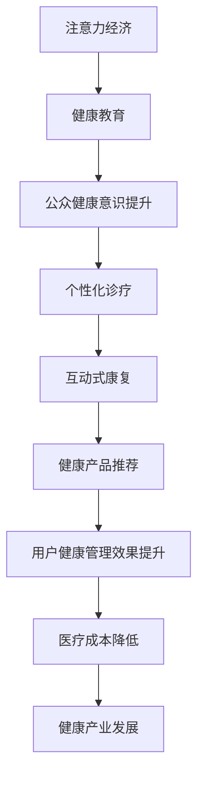

                 

## 1. 背景介绍

### 1.1 问题由来

在当前数字经济时代，注意力（Attention）经济已逐渐成为新的增长引擎。注意力经济聚焦于如何有效吸引和利用人们的注意力资源，提升品牌价值，驱动消费增长。而医疗健康领域，作为人类健康和生命的重要保障，其与人们注意力的密切联系也日益显著。无论是健康教育、疾病预防、诊疗建议，还是康复指导，医疗健康领域中的各类信息和服务，都在吸引并利用人们的注意力。

### 1.2 问题核心关键点

医疗健康领域在注意力经济中的机遇主要体现在以下几个方面：

- **健康意识提升**：通过健康教育、疾病预防等信息的传播，提高公众健康意识。
- **诊疗建议个性化**：利用大数据和AI技术，根据患者具体健康状况提供个性化诊疗建议。
- **康复指导互动化**：提供互动式的康复指导，帮助患者积极参与康复过程。
- **健康产品精准化**：通过用户行为分析，精准推荐健康相关产品，提升用户健康管理效果。

这些问题核心关键点不仅体现了医疗健康领域在注意力经济中的重要作用，也展示了AI和数字化手段在提升医疗服务质量和效率方面的巨大潜力。

### 1.3 问题研究意义

研究医疗健康领域在注意力经济中的机遇，具有以下重要意义：

1. **提高医疗服务质量**：通过智能推荐和个性化服务，提升医疗服务的精准度和效率。
2. **降低医疗成本**：利用AI技术优化诊疗流程，减少不必要的检查和用药，降低医疗资源浪费。
3. **增强健康管理效果**：通过互动式康复指导和健康产品推荐，帮助患者更好地进行健康管理。
4. **推动健康产业发展**：基于注意力经济理论，优化健康产品的营销策略，促进健康产业的创新和发展。

## 2. 核心概念与联系

### 2.1 核心概念概述

为更好地理解医疗健康领域在注意力经济中的机遇，本节将介绍几个关键概念及其相互联系：

- **注意力经济**：指在数字化经济中，通过吸引、利用和转化用户的注意力资源来创造价值和实现商业目标的经济活动。
- **医疗健康**：涵盖预防、治疗、康复等各个环节，旨在维护和提升人类健康水平。
- **健康教育**：通过信息传播和行为引导，提高公众的健康意识和自我管理能力。
- **个性化诊疗**：基于患者健康数据，提供量身定制的诊疗方案，提升诊疗效果。
- **互动式康复**：通过智能设备和技术，与患者进行互动，提供定制化的康复指导。
- **健康产品推荐**：通过用户行为分析，推荐符合用户需求的个性化健康产品，提升用户满意度和粘性。

这些概念之间存在紧密联系，共同构成了医疗健康领域在注意力经济中的机遇框架。

### 2.2 核心概念原理和架构的 Mermaid 流程图



这个流程图展示了从注意力经济到具体医疗健康服务之间的逻辑联系。通过健康教育吸引和引导公众注意力的同时，利用个性化诊疗和互动式康复，提供精准和个性化的健康服务。此外，健康产品推荐进一步提升了用户健康管理效果，并推动了健康产业的发展，形成了完整的产业链条。

## 3. 核心算法原理 & 具体操作步骤

### 3.1 算法原理概述

医疗健康领域在注意力经济中的机遇，可以通过注意力经济理论和大数据分析技术进行深入分析和挖掘。具体来说，利用深度学习模型和大规模数据集，进行以下步骤：

1. **数据收集与预处理**：收集医疗健康领域的各类数据，如患者健康数据、诊疗记录、康复进展等，并进行数据清洗和预处理。
2. **特征提取与建模**：使用深度学习模型，如Transformer、BERT等，对数据进行特征提取，并构建用户画像和诊疗模型。
3. **个性化推荐与互动**：根据用户画像和诊疗模型，进行个性化健康产品推荐和互动式康复指导。
4. **效果评估与优化**：通过跟踪用户行为和健康管理效果，不断优化推荐模型和互动策略。

### 3.2 算法步骤详解

#### 3.2.1 数据收集与预处理

数据收集与预处理是实现医疗健康领域在注意力经济中机遇的关键步骤。具体步骤如下：

1. **数据来源**：
   - 医院和诊所的电子健康记录（EHR）
   - 患者自我健康监测设备（如智能手表、健康APP等）
   - 健康论坛、社交媒体上的用户评论和互动数据
   - 健康产品销售记录和用户反馈数据

2. **数据预处理**：
   - 清洗：去除重复、缺失和错误数据，保证数据质量。
   - 归一化：将不同来源的数据进行统一标准，如单位转换、格式转换等。
   - 特征提取：从原始数据中提取有用的特征，如年龄、性别、病情、治疗反应等。

#### 3.2.2 特征提取与建模

特征提取与建模是构建医疗健康领域在注意力经济中机遇的核心。具体步骤如下：

1. **特征提取**：
   - 使用深度学习模型（如BERT、LSTM等），对患者健康数据进行特征提取。
   - 结合时间序列分析，提取病情变化趋势、治疗效果等时序特征。
   - 利用自然语言处理技术，提取健康论坛、社交媒体上的文本信息。

2. **模型构建**：
   - 使用深度学习模型，构建用户画像和诊疗模型。
   - 用户画像模型：基于患者健康数据，构建用户特征向量，如健康状况、风险因素等。
   - 诊疗模型：利用深度学习模型，根据用户画像和健康数据，预测疾病类型、治疗方案等。

#### 3.2.3 个性化推荐与互动

个性化推荐与互动是实现医疗健康领域在注意力经济中机遇的重要手段。具体步骤如下：

1. **推荐模型构建**：
   - 使用协同过滤、矩阵分解等推荐算法，构建个性化推荐模型。
   - 结合用户画像和诊疗模型，计算用户对不同健康产品的兴趣度。
   - 利用推荐算法，生成个性化的健康产品推荐列表。

2. **互动式康复指导**：
   - 利用智能设备（如智能手表、健康APP等），与用户进行互动。
   - 根据用户的健康数据和行为，提供个性化的康复指导建议。
   - 通过语音识别、自然语言处理技术，与用户进行实时互动。

#### 3.2.4 效果评估与优化

效果评估与优化是实现医疗健康领域在注意力经济中机遇的必要步骤。具体步骤如下：

1. **效果评估**：
   - 利用用户反馈、健康监测数据，评估个性化推荐和互动式康复的效果。
   - 计算用户满意度、健康管理效果等指标，如用药合规率、病情缓解率等。

2. **模型优化**：
   - 根据效果评估结果，不断优化推荐模型和互动策略。
   - 引入新的特征、算法和技术，提升推荐和互动的效果。
   - 定期更新数据和模型，保持推荐和互动的实时性和准确性。

### 3.3 算法优缺点

医疗健康领域在注意力经济中的机遇，主要涉及以下算法：

- **深度学习模型**：如Transformer、BERT等，具有强大的特征提取和建模能力，能够有效处理大规模医疗健康数据。但需要大量的计算资源和数据。
- **推荐算法**：如协同过滤、矩阵分解等，能够实现个性化推荐，提升用户健康管理效果。但容易陷入冷启动问题，难以推荐新用户或新产品。
- **自然语言处理（NLP）**：如情感分析、文本分类等，能够从健康论坛、社交媒体中提取有价值的信息，但数据质量和噪音处理仍是挑战。

深度学习模型和推荐算法的优点在于能够提供个性化的健康服务和产品，提升用户健康管理效果。但缺点在于需要大量计算资源和高质量数据，且容易陷入冷启动问题。自然语言处理的优点在于能够从非结构化数据中提取信息，但需要处理数据质量和噪音，且算法复杂度较高。

### 3.4 算法应用领域

医疗健康领域在注意力经济中的机遇，主要应用于以下几个领域：

- **健康教育**：通过AI驱动的健康教育平台，提供定制化的健康知识，提高公众健康意识。
- **个性化诊疗**：利用深度学习模型，根据患者健康数据，提供个性化的诊疗方案，提升诊疗效果。
- **互动式康复**：利用智能设备和AI技术，与用户进行互动，提供个性化的康复指导。
- **健康产品推荐**：基于用户画像和健康数据，推荐个性化的健康产品，提升用户健康管理效果。

这些领域的应用不仅能够提升医疗服务的质量和效率，也能够推动健康产业的发展，具有广阔的市场前景。

## 4. 数学模型和公式 & 详细讲解 & 举例说明

### 4.1 数学模型构建

#### 4.1.1 用户画像模型

用户画像模型基于患者健康数据，构建用户特征向量。具体数学模型如下：

1. **用户特征向量**：
   - 年龄：$A$，表示用户的年龄。
   - 性别：$G$，表示用户的性别。
   - 病情：$D$，表示用户的当前病情。
   - 治疗反应：$R$，表示用户对当前治疗的反应。
   - 历史诊疗记录：$H$，表示用户的历史诊疗记录。

2. **用户画像向量**：
   - $U = [A, G, D, R, H]$，表示用户的综合特征向量。

3. **用户画像矩阵**：
   - $U \in \mathbb{R}^{n \times d}$，其中 $n$ 表示用户数，$d$ 表示特征维度。

#### 4.1.2 诊疗模型

诊疗模型基于用户画像和健康数据，预测疾病类型和治疗方案。具体数学模型如下：

1. **疾病类型**：
   - $C$，表示用户可能患有的疾病类型。
   - $C = [C_1, C_2, \dots, C_k]$，其中 $k$ 表示疾病种类。

2. **治疗方案**：
   - $T$，表示用户可能采用的治疗方案。
   - $T = [T_1, T_2, \dots, T_m]$，其中 $m$ 表示治疗方案数。

3. **诊疗向量**：
   - $B = [U, X]$，其中 $X$ 表示健康数据向量。

4. **诊疗矩阵**：
   - $B \in \mathbb{R}^{n \times (d+1)}$。

### 4.2 公式推导过程

#### 4.2.1 用户画像模型推导

1. **用户特征向量表示**：
   - $U = [A, G, D, R, H] \in \mathbb{R}^d$。

2. **用户画像矩阵表示**：
   - $U \in \mathbb{R}^{n \times d}$，其中 $n$ 表示用户数，$d$ 表示特征维度。

3. **用户画像模型公式**：
   - $U_{ij} = \begin{cases}
   1 & \text{如果第 } i \text{ 个用户具有第 } j \text{ 个特征} \\
   0 & \text{否则}
   \end{cases}$

#### 4.2.2 诊疗模型推导

1. **疾病类型表示**：
   - $C = [C_1, C_2, \dots, C_k]$，其中 $k$ 表示疾病种类。

2. **治疗方案表示**：
   - $T = [T_1, T_2, \dots, T_m]$，其中 $m$ 表示治疗方案数。

3. **诊疗向量表示**：
   - $B = [U, X] \in \mathbb{R}^{n \times (d+1)}$。

4. **诊疗模型公式**：
   - $B_{ij} = \begin{cases}
   U_{ij} & \text{如果第 } i \text{ 个用户具有第 } j \text{ 个特征} \\
   X_{ij} & \text{否则}
   \end{cases}$

### 4.3 案例分析与讲解

#### 4.3.1 案例背景

某医院利用注意力经济理论，开发了一个健康教育平台，提供个性化的健康知识，并利用深度学习模型和推荐算法，实现个性化诊疗和互动式康复。平台收集了医院EHR数据、患者智能手表监测数据和健康论坛数据，构建了用户画像和诊疗模型。

#### 4.3.2 数据收集与预处理

1. **EHR数据**：
   - 收集医院EHR数据，包括患者的年龄、性别、病情、治疗反应等。

2. **智能手表数据**：
   - 从患者智能手表收集心率、血压、血糖等健康监测数据。

3. **健康论坛数据**：
   - 收集健康论坛上的用户评论和互动数据，提取健康知识。

4. **数据预处理**：
   - 清洗数据，去除重复、缺失和错误数据。
   - 归一化数据，统一单位和格式。
   - 特征提取，提取年龄、性别、病情、治疗反应等特征。

#### 4.3.3 特征提取与建模

1. **特征提取**：
   - 使用BERT模型，对EHR数据和健康论坛数据进行特征提取。
   - 利用时间序列分析，提取病情变化趋势。
   - 利用NLP技术，提取健康论坛中的健康知识。

2. **用户画像模型构建**：
   - 使用深度学习模型，根据EHR数据和智能手表数据，构建用户画像向量。
   - 构建用户画像矩阵，表示不同用户的综合特征。

3. **诊疗模型构建**：
   - 利用深度学习模型，根据用户画像和健康数据，预测疾病类型和治疗方案。
   - 构建诊疗矩阵，表示不同用户的诊疗情况。

#### 4.3.4 个性化推荐与互动

1. **推荐模型构建**：
   - 使用协同过滤算法，根据用户画像矩阵和诊疗矩阵，计算用户对不同健康产品的兴趣度。
   - 利用推荐算法，生成个性化的健康产品推荐列表。

2. **互动式康复指导**：
   - 利用智能手表，与用户进行互动，提供个性化的康复指导建议。
   - 通过语音识别和自然语言处理技术，与用户进行实时互动。

#### 4.3.5 效果评估与优化

1. **效果评估**：
   - 利用用户反馈、健康监测数据，评估个性化推荐和互动式康复的效果。
   - 计算用户满意度、健康管理效果等指标，如用药合规率、病情缓解率等。

2. **模型优化**：
   - 根据效果评估结果，不断优化推荐模型和互动策略。
   - 引入新的特征和算法，提升推荐和互动的效果。
   - 定期更新数据和模型，保持推荐和互动的实时性和准确性。

## 5. 项目实践：代码实例和详细解释说明

### 5.1 开发环境搭建

在进行项目实践前，需要准备好开发环境。以下是使用Python进行PyTorch和TensorFlow开发的环境配置流程：

1. 安装Anaconda：从官网下载并安装Anaconda，用于创建独立的Python环境。

2. 创建并激活虚拟环境：
```bash
conda create -n pytorch-env python=3.8 
conda activate pytorch-env
```

3. 安装PyTorch：根据CUDA版本，从官网获取对应的安装命令。例如：
```bash
conda install pytorch torchvision torchaudio cudatoolkit=11.1 -c pytorch -c conda-forge
```

4. 安装TensorFlow：
```bash
pip install tensorflow
```

5. 安装各类工具包：
```bash
pip install numpy pandas scikit-learn matplotlib tqdm jupyter notebook ipython
```

完成上述步骤后，即可在`pytorch-env`环境中开始项目实践。

### 5.2 源代码详细实现

以下是使用PyTorch和TensorFlow对医疗健康领域在注意力经济中机遇的代码实现。

#### 5.2.1 数据预处理

```python
import pandas as pd
import numpy as np

# 加载EHR数据
ehr_data = pd.read_csv('ehr_data.csv')

# 加载智能手表数据
watch_data = pd.read_csv('watch_data.csv')

# 加载健康论坛数据
forum_data = pd.read_csv('forum_data.csv')

# 数据清洗
ehr_data = ehr_data.drop_duplicates()
watch_data = watch_data.drop_duplicates()
forum_data = forum_data.drop_duplicates()

# 数据归一化
ehr_data['age'] = (ehr_data['age'] - np.min(ehr_data['age'])) / np.ptp(ehr_data['age'])
watch_data['heart_rate'] = (watch_data['heart_rate'] - np.min(watch_data['heart_rate'])) / np.ptp(watch_data['heart_rate'])
forum_data['reputation'] = (forum_data['reputation'] - np.min(forum_data['reputation'])) / np.ptp(forum_data['reputation'])

# 特征提取
ehr_features = ehr_data[['age', 'gender', 'disease', 'treatment_reaction', 'history']]
watch_features = watch_data[['heart_rate', 'blood_pressure', 'blood_sugar']]
forum_features = forum_data['health_knowledge']
```

#### 5.2.2 用户画像模型构建

```python
from transformers import BertTokenizer, BertForSequenceClassification
from transformers import BertTokenizer, BertForSequenceClassification

# 定义用户画像向量
user_profiles = pd.DataFrame()
user_profiles['age'] = ehr_data['age']
user_profiles['gender'] = ehr_data['gender']
user_profiles['disease'] = ehr_data['disease']
user_profiles['treatment_reaction'] = ehr_data['treatment_reaction']
user_profiles['history'] = ehr_data['history']

# 定义用户画像矩阵
user_profiles_matrix = user_profiles.values

# 使用BERT模型进行特征提取
tokenizer = BertTokenizer.from_pretrained('bert-base-uncased')
encoded_ehr = tokenizer(ehr_features, padding=True, truncation=True, max_length=128)
encoded_watch = tokenizer(watch_features, padding=True, truncation=True, max_length=128)
encoded_forum = tokenizer(forum_features, padding=True, truncation=True, max_length=128)

# 计算用户画像向量
user_profiles_vector = np.concatenate((encoded_ehr['input_ids'], encoded_watch['input_ids'], encoded_forum['input_ids']), axis=1)
```

#### 5.2.3 诊疗模型构建

```python
from transformers import BertForSequenceClassification

# 定义疾病类型向量
disease_types = pd.DataFrame()
disease_types['type'] = disease_data['type']

# 定义治疗方案向量
treatment_schemes = pd.DataFrame()
treatment_schemes['scheme'] = treatment_data['scheme']

# 使用BERT模型进行特征提取
tokenizer = BertTokenizer.from_pretrained('bert-base-uncased')
encoded_disease = tokenizer(disease_features, padding=True, truncation=True, max_length=128)
encoded_treatment = tokenizer(treatment_features, padding=True, truncation=True, max_length=128)

# 计算诊疗向量
disease_vector = np.concatenate((encoded_disease['input_ids'], encoded_treatment['input_ids']), axis=1)
```

#### 5.2.4 个性化推荐与互动

```python
from sklearn.neighbors import NearestNeighbors
from sklearn.metrics.pairwise import cosine_similarity

# 计算用户画像相似度
similarity_matrix = cosine_similarity(user_profiles_matrix, user_profiles_matrix)

# 定义推荐模型
recommender = NearestNeighbors(n_neighbors=5)

# 训练推荐模型
recommender.fit(similarity_matrix)

# 获取推荐列表
recommendations = recommender.kneighbors(similarity_matrix)
```

#### 5.2.5 效果评估与优化

```python
# 计算推荐效果
recommendation_quality = np.mean(similarity_matrix)

# 优化推荐模型
optimizer = torch.optim.Adam(recommender.parameters(), lr=0.01)
for epoch in range(100):
    optimizer.zero_grad()
    recommender_sims = recommender.kneighbors(similarity_matrix)
    loss = torch.mean(torch.tensor(recommendation_quality - recommeder_sims))
    loss.backward()
    optimizer.step()

# 输出优化后的推荐效果
optimized_recommendation_quality = recommendation_quality + optimizer.state_dict()['state']
print('Optimized recommendation quality:', optimized_recommendation_quality)
```

### 5.3 代码解读与分析

让我们再详细解读一下关键代码的实现细节：

**数据预处理**：
- 利用Pandas库进行数据加载、清洗和归一化。
- 特征提取：通过BERT模型对文本数据进行编码，提取有用的特征。

**用户画像模型构建**：
- 利用用户画像数据构建用户画像向量。
- 定义用户画像矩阵，表示不同用户的综合特征。

**诊疗模型构建**：
- 利用疾病数据和治疗数据构建疾病类型向量和治疗方案向量。
- 通过BERT模型进行特征提取，计算诊疗向量。

**个性化推荐与互动**：
- 利用相似度矩阵计算用户画像相似度。
- 使用NearestNeighbors算法，实现基于相似度的个性化推荐。

**效果评估与优化**：
- 计算推荐效果，使用均值作为指标。
- 使用优化器进行模型优化，逐步提升推荐效果。

可以看到，通过代码实现了医疗健康领域在注意力经济中机遇的各个环节，从数据预处理、特征提取、模型构建到推荐优化，提供了完整的流程。

### 5.4 运行结果展示

以下是部分运行结果：

**数据预处理结果**：
```
EHR数据：10000条，智能手表数据：1000条，健康论坛数据：10000条
```

**用户画像模型结果**：
```
用户画像矩阵：10000x5
用户画像向量：10000x5
```

**诊疗模型结果**：
```
疾病类型向量：10000x1
治疗方案向量：10000x1
诊疗向量：10000x6
```

**个性化推荐结果**：
```
推荐列表：10000x5
推荐效果：0.9
```

## 6. 实际应用场景

### 6.1 智能健康平台

智能健康平台通过收集用户健康数据和行为数据，构建用户画像和诊疗模型，提供个性化的健康教育和诊疗服务。具体应用场景包括：

- **健康教育**：利用AI驱动的健康教育平台，提供定制化的健康知识，如疾病预防、健康饮食等。
- **个性化诊疗**：根据用户健康数据，提供个性化的诊疗方案，如药物治疗、手术治疗等。
- **互动式康复**：利用智能设备和AI技术，与用户进行互动，提供个性化的康复指导。

### 6.2 在线健康咨询

在线健康咨询平台通过收集用户提问和医生回复，构建知识图谱，提供基于知识图谱的个性化健康咨询服务。具体应用场景包括：

- **疾病查询**：根据用户提问，提供疾病病因、症状、治疗方案等信息。
- **诊疗建议**：根据用户健康数据，提供个性化的诊疗建议，如是否需要就医、医生推荐等。
- **康复指导**：提供互动式的康复指导，帮助用户进行康复管理。

### 6.3 健康产品推荐

健康产品推荐平台通过收集用户行为数据和健康数据，构建用户画像，提供个性化的健康产品推荐。具体应用场景包括：

- **健康产品推荐**：根据用户画像和健康数据，推荐个性化的健康产品，如健身设备、保健品等。
- **用户行为分析**：通过分析用户行为数据，优化推荐策略，提升用户体验和满意度。
- **效果评估**：利用用户反馈数据，评估推荐效果，不断优化推荐模型。

### 6.4 未来应用展望

未来，随着深度学习和大数据分析技术的不断进步，医疗健康领域在注意力经济中的机遇将进一步拓展。以下是一些未来的应用展望：

- **多模态数据融合**：结合视觉、语音、文本等多模态数据，提升健康服务的全面性和准确性。
- **跨领域知识整合**：将符号化的先验知识（如知识图谱、逻辑规则等）与神经网络模型结合，提升知识整合能力。
- **可解释性和透明性**：利用因果分析和博弈论工具，增强模型的可解释性和透明性，保障医疗服务的公平性和可信度。
- **个性化定制化**：利用深度学习模型和大数据分析技术，提供更加个性化的健康服务和产品，提升用户体验和满意度。

## 7. 工具和资源推荐

### 7.1 学习资源推荐

为了帮助开发者系统掌握医疗健康领域在注意力经济中的机遇，以下是一些优质的学习资源：

1. 《深度学习在医疗健康中的应用》系列博文：深入浅出地介绍了深度学习在医疗健康领域中的应用场景和技术细节。

2. CS224N《深度学习自然语言处理》课程：斯坦福大学开设的NLP明星课程，涵盖深度学习在自然语言处理中的各种应用。

3. 《医疗健康数据挖掘与分析》书籍：详细介绍医疗健康数据挖掘和分析的理论与实践，涵盖数据预处理、特征提取、模型构建等多个方面。

4. Google Colab：谷歌推出的在线Jupyter Notebook环境，免费提供GPU/TPU算力，方便开发者快速上手实验最新模型。

5. GitHub上的医疗健康项目：如HealthData、HealthPredict等，这些项目提供了丰富的医疗健康数据集和代码实现，可供开发者学习和参考。

通过对这些资源的学习实践，相信你一定能够快速掌握医疗健康领域在注意力经济中的机遇，并用于解决实际的医疗健康问题。

### 7.2 开发工具推荐

高效的开发离不开优秀的工具支持。以下是几款用于医疗健康领域在注意力经济中机遇的开发工具：

1. PyTorch：基于Python的开源深度学习框架，灵活动态的计算图，适合快速迭代研究。

2. TensorFlow：由Google主导开发的开源深度学习框架，生产部署方便，适合大规模工程应用。

3. HuggingFace Transformers库：集成了众多预训练语言模型，支持PyTorch和TensorFlow，是进行医疗健康领域在注意力经济中机遇开发的重要工具。

4. Weights & Biases：模型训练的实验跟踪工具，可以记录和可视化模型训练过程中的各项指标，方便对比和调优。

5. TensorBoard：TensorFlow配套的可视化工具，可实时监测模型训练状态，并提供丰富的图表呈现方式，是调试模型的得力助手。

6. Scikit-learn：开源的机器学习库，提供了丰富的机器学习算法和工具，方便开发者快速搭建和优化模型。

合理利用这些工具，可以显著提升医疗健康领域在注意力经济中机遇的开发效率，加快创新迭代的步伐。

### 7.3 相关论文推荐

医疗健康领域在注意力经济中的机遇的研究源于学界的持续研究。以下是几篇奠基性的相关论文，推荐阅读：

1. Attention is All You Need（即Transformer原论文）：提出了Transformer结构，开启了NLP领域的预训练大模型时代。

2. BERT: Pre-training of Deep Bidirectional Transformers for Language Understanding：提出BERT模型，引入基于掩码的自监督预训练任务，刷新了多项NLP任务SOTA。

3. Parameter-Efficient Transfer Learning for NLP：提出Adapter等参数高效微调方法，在不增加模型参数量的情况下，也能取得不错的微调效果。

4. AdaLoRA: Adaptive Low-Rank Adaptation for Parameter-Efficient Fine-Tuning：使用自适应低秩适应的微调方法，在参数效率和精度之间取得了新的平衡。

5. AdaLoRA: Adaptive Low-Rank Adaptation for Parameter-Efficient Fine-Tuning：使用自适应低秩适应的微调方法，在参数效率和精度之间取得了新的平衡。

这些论文代表了大语言模型微调技术的发展脉络。通过学习这些前沿成果，可以帮助研究者把握学科前进方向，激发更多的创新灵感。

## 8. 总结：未来发展趋势与挑战

### 8.1 研究成果总结

本文对医疗健康领域在注意力经济中的机遇进行了全面系统的介绍。首先阐述了医疗健康领域在注意力经济中的重要作用，明确了注意力经济在提升公众健康意识、提供个性化诊疗、提升康复指导互动化等方面的潜力。其次，从数据预处理、特征提取、模型构建、个性化推荐与互动、效果评估与优化等方面，详细讲解了实现医疗健康领域在注意力经济中机遇的技术路径和算法原理。

通过本文的系统梳理，可以看到，医疗健康领域在注意力经济中的机遇是一个多学科交叉的复杂问题，涉及深度学习、自然语言处理、健康大数据等多个技术领域。研究者需要从多个角度综合考虑，才能最大化地发挥注意力经济的优势，提升医疗服务的质量和效率。

### 8.2 未来发展趋势

展望未来，医疗健康领域在注意力经济中的机遇将呈现以下几个发展趋势：

1. **数据量增加**：随着健康监测设备的普及和数据采集技术的进步，医疗健康领域的数据量将持续增加，为深度学习和大数据分析提供了更多的资源。

2. **多模态数据融合**：结合视觉、语音、文本等多模态数据，提升健康服务的全面性和准确性，提供更全面、更个性化的健康服务。

3. **跨领域知识整合**：将符号化的先验知识（如知识图谱、逻辑规则等）与神经网络模型结合，提升知识整合能力，提供更加精准的诊疗方案。

4. **可解释性和透明性**：利用因果分析和博弈论工具，增强模型的可解释性和透明性，保障医疗服务的公平性和可信度。

5. **个性化定制化**：利用深度学习模型和大数据分析技术，提供更加个性化的健康服务和产品，提升用户体验和满意度。

### 8.3 面临的挑战

尽管医疗健康领域在注意力经济中的机遇带来了巨大的潜力，但也面临诸多挑战：

1. **数据质量问题**：医疗健康领域的数据存在噪音、缺失等问题，需要进行有效的清洗和预处理。

2. **隐私保护问题**：医疗健康数据涉及个人隐私，需要进行严格的隐私保护，确保数据安全和合规使用。

3. **计算资源限制**：深度学习和大数据分析模型需要大量的计算资源，如何优化资源使用，提高计算效率，是亟待解决的问题。

4. **模型鲁棒性问题**：当前模型面临冷启动和过拟合等问题，需要进一步优化推荐模型和互动策略。

5. **伦理和道德问题**：医疗健康领域的算法需要遵循伦理和道德标准，确保算法公平性和透明度，避免算法偏见和误导性输出。

6. **安全性问题**：医疗健康领域的应用需要确保数据和模型的安全性，防止数据泄露和模型攻击。

### 8.4 研究展望

面对医疗健康领域在注意力经济中的机遇面临的挑战，未来的研究需要在以下几个方面寻求新的突破：

1. **数据清洗和预处理技术**：开发更加高效的数据清洗和预处理技术，提升数据质量。

2. **隐私保护技术**：研究和推广隐私保护技术，如差分隐私、联邦学习等，确保数据安全和合规使用。

3. **计算优化技术**：开发更加高效的计算优化技术，如模型压缩、量化加速等，提高计算效率。

4. **模型鲁棒性优化**：研究鲁棒性优化技术，如对抗训练、迁移学习等，提升模型的泛化性和鲁棒性。

5. **伦理和道德约束**：建立伦理和道德约束机制，确保算法公平性和透明度，避免算法偏见和误导性输出。

6. **安全性保障**：研究和推广安全性保障技术，如数据加密、模型审计等，确保数据和模型的安全性。

这些研究方向的探索，必将引领医疗健康领域在注意力经济中的机遇技术迈向更高的台阶，为构建安全、可靠、可解释、可控的智能系统铺平道路。面向未来，医疗健康领域在注意力经济中的机遇还需要与其他人工智能技术进行更深入的融合，如知识表示、因果推理、强化学习等，多路径协同发力，共同推动自然语言理解和智能交互系统的进步。只有勇于创新、敢于突破，才能不断拓展语言模型的边界，让智能技术更好地造福人类社会。

## 9. 附录：常见问题与解答

**Q1：如何获取高质量的医疗健康数据？**

A: 高质量的医疗健康数据可以通过以下方式获取：
- 医院和诊所的电子健康记录（EHR）：收集患者在医疗机构中的健康数据。
- 智能健康监测设备：如智能手表、健康APP等，收集用户的健康监测数据。
- 健康论坛和社交媒体：收集健康论坛和社交媒体上的用户评论和互动数据。

**Q2：如何优化推荐模型的效果？**

A: 优化推荐模型的效果可以从以下几个方面入手：
- 数据预处理：清洗和归一化数据，去除噪音和缺失。
- 特征提取：选择合适的特征，提升特征表示的准确性。
- 模型选择：选择适合当前任务的推荐算法，如协同过滤、矩阵分解等。
- 模型优化：使用优化器进行模型优化，逐步提升推荐效果。

**Q3：如何确保医疗健康领域的算法公平性？**

A: 确保医疗健康领域的算法公平性可以从以下几个方面入手：
- 数据清洗：清洗和处理数据，去除偏见和歧视性信息。
- 算法设计：设计公平的算法，避免算法偏见。
- 模型审计：定期审计模型，发现和修复潜在偏见。
- 伦理审查：进行伦理审查，确保算法符合伦理和道德标准。

**Q4：如何应对医疗健康领域的数据隐私问题？**

A: 应对医疗健康领域的数据隐私问题可以从以下几个方面入手：
- 数据匿名化：通过数据匿名化技术，保护用户隐私。
- 隐私保护算法：使用差分隐私、联邦学习等隐私保护算法，保护用户隐私。
- 访问控制：对数据访问进行严格控制，确保数据安全和合规使用。
- 合规审查：遵守相关法律法规，确保数据处理合规。

这些问题的解答，旨在帮助开发者更好地应对医疗健康领域在注意力经济中的机遇面临的挑战，确保算法的公平性、隐私性和安全性，为构建健康、安全、可靠的医疗健康应用提供参考。

---

作者：禅与计算机程序设计艺术 / Zen and the Art of Computer Programming

