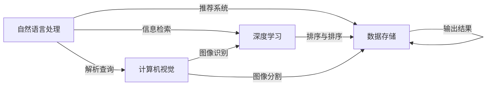

                 

# 医疗健康领域的AI搜索应用

> 关键词：医疗搜索,自然语言处理,深度学习,计算机视觉,推荐系统

## 1. 背景介绍

在医疗健康领域，信息搜索是患者获取健康知识、就医咨询、预约挂号等基本需求的核心环节。然而，由于医疗信息的复杂性和多样性，传统的信息搜索方式往往难以满足用户需求，效率和准确性都存在较大不足。近年来，人工智能技术在自然语言处理（Natural Language Processing, NLP）、计算机视觉（Computer Vision, CV）等领域取得了突破性进展，为医疗健康领域的搜索应用带来了新的解决方案。

### 1.1 问题由来

传统医疗信息搜索主要依靠关键词匹配、分类检索等方法，存在以下不足：

1. **信息碎片化**：不同来源、格式的信息分散在不同的平台，难以形成统一的信息库。
2. **语义理解不足**：系统对自然语言理解和处理能力有限，难以识别和理解用户的复杂查询需求。
3. **信息质量参差不齐**：搜索结果可能包含错误、过时的信息，误导用户。
4. **个性化不足**：搜索结果往往缺乏对用户背景、历史数据等个性化信息的考虑，难以提供精准的建议。

这些问题导致用户在搜索医疗信息时，花费大量时间在筛选和甄别信息上，且难以获得满意的搜索结果。因此，如何利用人工智能技术提升医疗搜索的效率和质量，成为当前研究的热点之一。

### 1.2 问题核心关键点

在医疗健康领域，AI搜索应用的重点是构建能够理解自然语言、进行精准信息检索和推荐的系统。关键点包括：

1. **自然语言处理**：通过NLP技术，理解用户查询的自然语言，将其转化为结构化信息，提高搜索的精准度。
2. **深度学习**：利用深度学习模型进行信息检索、分类、排序等任务，提高搜索结果的相关性和准确性。
3. **计算机视觉**：结合图像处理和识别技术，辅助用户进行疾病识别、医学影像分析等操作。
4. **推荐系统**：通过个性化推荐技术，根据用户历史数据和行为特征，提供定制化的搜索结果。
5. **跨模态信息融合**：将文本、图像、视频等多种信息源进行有效融合，提供全面的医疗信息。

这些关键点共同构成了AI在医疗搜索中的核心应用框架，通过技术手段，可以实现高效、精准、个性化的信息检索和推荐服务。

## 2. 核心概念与联系

### 2.1 核心概念概述

为了更好地理解AI在医疗搜索中的应用，我们首先介绍几个关键概念：

1. **自然语言处理（NLP）**：涉及计算机对自然语言进行理解、处理和生成，包括文本预处理、词法分析、语法分析、语义分析、实体识别、信息抽取、文本生成等任务。
2. **深度学习（Deep Learning）**：一种基于多层神经网络的机器学习方法，通过多层次的特征提取和抽象，实现复杂模式的识别和处理。
3. **计算机视觉（CV）**：涉及计算机对图像、视频等视觉信息的处理和分析，包括图像识别、物体检测、图像分割、图像生成等任务。
4. **推荐系统（Recommendation System）**：通过分析用户历史行为和偏好，推荐个性化内容或服务的系统，广泛应用于电商、媒体、社交网络等领域。
5. **跨模态信息融合**：将多种不同模态的信息（如文本、图像、视频）进行有效整合，提取和使用其中的有用信息，实现信息的全面利用。

这些概念之间通过相互协作，共同构成了一个完整、高效的AI医疗搜索系统。通过NLP技术理解用户查询，通过深度学习模型检索和排序信息，利用计算机视觉技术分析图像和视频信息，结合推荐系统进行个性化推荐，最终通过跨模态信息融合，提供全面的医疗信息服务。

### 2.2 核心概念原理和架构的 Mermaid 流程图



这个图表展示了NLP、CV、DL和DS之间的协作关系，以及如何将多种模态的信息融合在一起，提供全面的医疗信息服务。

## 3. 核心算法原理 & 具体操作步骤
### 3.1 算法原理概述

AI在医疗搜索中的应用，核心是通过NLP和深度学习技术进行自然语言理解和信息检索。具体而言，系统接收用户的查询请求，经过NLP处理后，转化为结构化的查询向量，通过深度学习模型与医疗信息库中的向量进行匹配，返回最相关的搜索结果。

### 3.2 算法步骤详解

AI医疗搜索系统的主要步骤包括：

1. **文本预处理**：对用户的查询文本进行分词、去停用词、词性标注等预处理操作，形成可处理的文本形式。
2. **实体识别**：识别用户查询中的实体信息，如疾病名、症状、药物名等，便于后续的信息检索和推荐。
3. **信息检索**：利用深度学习模型（如BERT、Elastic Search）在医疗信息库中检索与用户查询最相关的信息。
4. **排序与排序**：对检索结果进行排序和加权处理，优先返回最相关、最可信的信息。
5. **图像处理与识别**：对用户上传的医学图像进行预处理和分析，识别其中的疾病特征。
6. **个性化推荐**：结合用户历史数据和行为特征，推荐个性化的信息和服务。
7. **结果展示与交互**：将搜索结果以结构化、可视化形式展示给用户，并根据用户反馈进行优化。

### 3.3 算法优缺点

AI医疗搜索算法具有以下优点：

1. **效率高**：利用深度学习模型的快速计算能力，能够在短时间内检索和排序大量信息。
2. **精度高**：通过深度学习模型的自适应学习，能够识别和理解复杂的自然语言查询，提高检索的精度。
3. **个性化强**：结合推荐系统，根据用户历史行为和偏好，提供定制化的搜索结果。
4. **跨模态融合**：通过计算机视觉技术，结合文本信息，提供全面的医疗信息服务。

同时，也存在以下缺点：

1. **数据依赖强**：系统的性能很大程度上依赖于医疗信息库的质量和规模。
2. **用户隐私保护**：用户历史数据的收集和处理需要严格遵守隐私保护法规。
3. **计算资源需求高**：深度学习模型的训练和推理需要高性能的计算资源。
4. **解释性不足**：深度学习模型的黑盒特性，难以解释其决策过程。

### 3.4 算法应用领域

AI医疗搜索技术在以下领域有着广泛的应用：

1. **健康信息查询**：提供患者健康信息搜索、疾病诊断建议、药物推荐等服务。
2. **医学影像分析**：通过计算机视觉技术，辅助医生进行医学影像的分析和诊断。
3. **疾病预测与预防**：结合用户健康数据，进行疾病预测和预防信息的推荐。
4. **在线诊疗咨询**：提供基于AI的在线诊疗咨询服务，减轻医生的工作负担。
5. **个性化健康管理**：根据用户健康数据，提供个性化的健康管理方案。

## 4. 数学模型和公式 & 详细讲解 & 举例说明

### 4.1 数学模型构建

在AI医疗搜索中，常见的数学模型包括：

1. **文本表示模型**：将自然语言查询和医疗信息转换为向量表示，便于计算机处理。
2. **检索模型**：利用深度学习模型进行信息检索和排序。
3. **推荐模型**：利用协同过滤、内容推荐等算法进行个性化推荐。

### 4.2 公式推导过程

以文本表示模型为例，假设查询文本为 $q$，医疗信息库中每篇文章的文本表示为 $d$，文本表示模型可以表示为：

$$
\text{Embedding}(q) = W \cdot \text{Embedding}(d)
$$

其中，$\text{Embedding}(q)$ 和 $\text{Embedding}(d)$ 分别表示查询文本和医疗信息的向量表示，$W$ 为转换矩阵。

在检索阶段，将查询文本和医疗信息的向量表示输入检索模型，计算两者之间的相似度，得到检索结果。以余弦相似度为例，检索结果可以表示为：

$$
\text{Score}(q, d) = \text{CosineSimilarity}(\text{Embedding}(q), \text{Embedding}(d))
$$

最后，根据得分对检索结果进行排序和加权处理，返回最相关的内容。

### 4.3 案例分析与讲解

假设我们有一个医疗信息库，包含100篇关于不同疾病的文章。用户查询“肺癌症状”，系统首先对查询进行预处理和实体识别，得到查询向量 $\text{Embedding}(q)$。然后，系统将查询向量输入检索模型，计算每篇文章的得分，返回得分最高的前10篇作为推荐结果。

## 5. 项目实践：代码实例和详细解释说明
### 5.1 开发环境搭建

在搭建开发环境时，需要考虑以下几个方面：

1. **编程语言**：Python是最常用的AI开发语言，方便利用众多NLP和深度学习库。
2. **深度学习框架**：TensorFlow、PyTorch等框架提供强大的计算图功能和丰富的模型库。
3. **数据集和库**：需要下载和处理医疗信息库、NLP模型、计算机视觉模型等。
4. **云计算平台**：利用云计算平台（如AWS、Google Cloud、阿里云等）进行模型训练和推理。

### 5.2 源代码详细实现

以下是一个基于PyTorch和Transformer的AI医疗搜索系统的代码实现：

```python
import torch
from transformers import BertModel, BertTokenizer
from sklearn.metrics import precision_recall_fscore_support

# 初始化Bert模型和分词器
model = BertModel.from_pretrained('bert-base-uncased')
tokenizer = BertTokenizer.from_pretrained('bert-base-uncased')

# 加载医疗信息库
medical_data = load_medical_data()

# 预处理查询和文章
def preprocess_query(query):
    query = query.lower()  # 转换为小写
    query = tokenizer(query)  # 分词和编码
    return query

def preprocess_doc(doc):
    doc = tokenizer(doc)  # 分词和编码
    return doc

# 构建查询向量和文章向量
def build_query_vec(query):
    query = preprocess_query(query)
    query_vec = torch.tensor([query['input_ids']], dtype=torch.long)
    return query_vec

def build_doc_vec(doc):
    doc = preprocess_doc(doc)
    doc_vec = torch.tensor(doc['input_ids'], dtype=torch.long)
    return doc_vec

# 检索模型
def search(query, doc):
    query_vec = build_query_vec(query)
    doc_vec = build_doc_vec(doc)
    with torch.no_grad():
        outputs = model(query_vec, doc_vec)
        scores = outputs[0]
        return scores

# 计算检索结果
def get_search_results(query, medical_data):
    results = []
    for doc in medical_data:
        score = search(query, doc)
        results.append((doc['title'], score))
    results = sorted(results, key=lambda x: x[1], reverse=True)
    return results

# 评估检索结果
def evaluate(results):
    query = '肺癌症状'
    results = get_search_results(query, medical_data)
    print(results)
    precision, recall, f1, _ = precision_recall_fscore_support(y_true=medical_data, y_pred=results, average='micro')
    print('Precision: {}, Recall: {}, F1-Score: {}'.format(precision, recall, f1))

# 启动搜索
evaluate()
```

### 5.3 代码解读与分析

在上述代码中，我们首先初始化了Bert模型和分词器，然后加载了医疗信息库。接着定义了几个关键的预处理函数，将查询和文章进行分词和编码。然后构建了查询向量和文章向量，并使用检索模型计算得分。最后，对检索结果进行排序和加权处理，返回最相关的文章。

代码中使用的Transformer模型是预训练的BERT模型，具有较强的语言理解和表示能力。通过预训练，BERT模型已经能够处理复杂的自然语言查询，并将其转换为向量表示，从而实现高效的检索和排序。

## 6. 实际应用场景

### 6.1 智能健康信息查询

在智能健康信息查询中，AI搜索系统可以通过NLP技术理解用户的自然语言查询，利用检索模型在医疗信息库中检索相关信息，并结合推荐系统提供个性化的搜索结果。用户可以通过语音或文字查询，获取疾病症状、治疗方案、药物信息等。

### 6.2 医学影像分析

在医学影像分析中，AI搜索系统可以利用计算机视觉技术，识别和分析医学图像中的疾病特征。例如，通过图像分割技术，将影像中的不同区域进行分割，然后利用深度学习模型识别病灶位置和大小，帮助医生进行诊断和分析。

### 6.3 疾病预测与预防

在疾病预测与预防中，AI搜索系统可以根据用户的健康数据，结合NLP和深度学习技术，预测可能发生的疾病，并推荐预防措施。例如，通过分析用户的体重、血压、血糖等指标，结合自然语言查询中的关键词，预测其患某病的概率，并提供相应的饮食、运动建议。

### 6.4 在线诊疗咨询

在在线诊疗咨询中，AI搜索系统可以结合NLP和深度学习技术，提供基于AI的在线诊疗咨询服务。用户可以通过文字或语音描述自己的症状和病史，系统自动分析和诊断，并给出相应的诊疗建议。

### 6.5 个性化健康管理

在个性化健康管理中，AI搜索系统可以结合用户的健康数据和行为数据，提供个性化的健康管理方案。例如，根据用户的饮食、运动、睡眠等数据，结合自然语言查询中的健康目标，推荐相应的饮食计划、运动方案和睡眠建议。

## 7. 工具和资源推荐
### 7.1 学习资源推荐

为了帮助开发者系统掌握AI在医疗搜索中的应用，这里推荐一些优质的学习资源：

1. **《深度学习理论与实践》**：介绍深度学习的基本原理和应用案例，适合入门学习。
2. **《自然语言处理综论》**：全面介绍NLP技术的基本概念和前沿进展，涵盖文本处理、语言模型、信息检索等。
3. **《计算机视觉基础》**：介绍计算机视觉的基本原理和应用案例，涵盖图像处理、特征提取、分类识别等。
4. **《推荐系统》**：介绍推荐系统的基本原理和算法实现，涵盖协同过滤、内容推荐、实时推荐等。
5. **HuggingFace官方文档**：介绍基于Transformers库的NLP和CV模型，提供丰富的代码样例和模型下载。

通过对这些资源的学习实践，相信你一定能够快速掌握AI在医疗搜索中的核心技术和应用方法，并用于解决实际的医疗问题。

### 7.2 开发工具推荐

高效的开发离不开优秀的工具支持。以下是几款用于AI医疗搜索开发的常用工具：

1. **PyTorch**：基于Python的开源深度学习框架，灵活动态的计算图，适合快速迭代研究。
2. **TensorFlow**：由Google主导开发的开源深度学习框架，生产部署方便，适合大规模工程应用。
3. **Scikit-learn**：机器学习库，提供多种机器学习算法和工具。
4. **Pandas**：数据处理库，方便数据的导入、处理和分析。
5. **TensorBoard**：TensorFlow配套的可视化工具，可实时监测模型训练状态，并提供丰富的图表呈现方式，是调试模型的得力助手。
6. **Jupyter Notebook**：交互式编程环境，方便代码的调试和展示。

合理利用这些工具，可以显著提升AI医疗搜索任务的开发效率，加快创新迭代的步伐。

### 7.3 相关论文推荐

AI在医疗搜索领域的研究涉及多个学科和领域，以下是几篇奠基性的相关论文，推荐阅读：

1. **《基于深度学习的自然语言处理》**：介绍深度学习在NLP中的应用，涵盖文本表示、语言模型、信息检索等。
2. **《计算机视觉与医学影像分析》**：介绍计算机视觉在医学影像中的应用，涵盖图像分割、目标检测、疾病识别等。
3. **《基于协同过滤的推荐系统》**：介绍协同过滤算法在推荐系统中的应用，涵盖算法原理、实现方法和性能评估。

这些论文代表了大规模医疗搜索技术的发展脉络，通过学习这些前沿成果，可以帮助研究者把握学科前进方向，激发更多的创新灵感。

## 8. 总结：未来发展趋势与挑战

### 8.1 研究成果总结

通过上述介绍，我们了解到AI在医疗搜索中的应用主要依赖于NLP、深度学习、计算机视觉和推荐系统等技术。这些技术的结合，使得系统能够高效、精准、个性化地处理医疗信息，提供全面的医疗服务。未来，AI医疗搜索技术将在医疗健康领域发挥越来越重要的作用，推动医疗服务的数字化和智能化转型。

### 8.2 未来发展趋势

展望未来，AI医疗搜索技术将呈现以下几个发展趋势：

1. **多模态融合**：结合文本、图像、视频等多种模态的信息，提供全面的医疗信息服务。
2. **个性化推荐**：利用用户历史数据和行为特征，提供更加精准和个性化的推荐服务。
3. **实时搜索**：利用云计算和大数据技术，实现实时搜索和动态更新，满足用户的即时需求。
4. **跨领域应用**：从医疗领域扩展到其他领域，如教育、法律等，提供更加广泛的应用场景。

这些趋势将进一步提升AI在医疗搜索中的应用效果，满足用户多样化和个性化的需求。

### 8.3 面临的挑战

尽管AI在医疗搜索中取得了一些进展，但仍面临一些挑战：

1. **数据隐私和安全**：医疗数据涉及用户的隐私和敏感信息，如何保障数据安全是一个重要问题。
2. **算法透明性和可解释性**：深度学习模型的黑盒特性，难以解释其决策过程，影响用户的信任。
3. **跨领域知识整合**：不同领域的知识整合和应用是一个复杂问题，需要跨学科的合作和研究。
4. **系统鲁棒性**：面对噪声和异常数据，如何保证系统的鲁棒性和稳定性是一个重要问题。

这些挑战需要在未来的研究和实践中不断攻克，才能推动AI医疗搜索技术的进一步发展。

### 8.4 研究展望

未来，AI医疗搜索技术需要在以下几个方面进行深入研究：

1. **隐私保护技术**：开发隐私保护算法，保护用户医疗数据的隐私和安全。
2. **解释性增强**：提高AI系统的透明性和可解释性，使用户能够理解和信任系统的决策。
3. **跨领域知识应用**：结合不同领域的知识，开发具有通用性的AI医疗搜索系统。
4. **系统鲁棒性增强**：通过数据增强、对抗训练等技术，提高系统的鲁棒性和稳定性。

只有从技术、伦理、应用等多个维度共同努力，才能构建安全、可靠、可解释、可控的AI医疗搜索系统，为人类健康提供更加优质的服务。

## 9. 附录：常见问题与解答

**Q1: 为什么需要构建AI医疗搜索系统？**

A: 传统医疗搜索方式存在信息碎片化、语义理解不足、信息质量参差不齐、个性化不足等问题。AI医疗搜索系统通过自然语言处理、深度学习、计算机视觉和推荐系统等技术，能够高效、精准、个性化地处理医疗信息，提供全面的医疗服务，显著提升用户的搜索体验和满意度。

**Q2: 如何确保AI医疗搜索系统的数据隐私和安全？**

A: 数据隐私和安全是AI医疗搜索系统的重要问题。可以从以下几个方面进行保障：
1. 数据加密：对用户医疗数据进行加密存储和传输，防止数据泄露。
2. 访问控制：严格控制数据访问权限，确保只有授权人员可以访问敏感数据。
3. 匿名化处理：对用户数据进行匿名化处理，防止数据关联和泄露。

**Q3: 如何提高AI医疗搜索系统的可解释性和透明性？**

A: 提高AI系统的可解释性和透明性，可以帮助用户理解和信任系统的决策。可以通过以下几个方面进行改进：
1. 可视化输出：将系统的决策过程和结果可视化展示，方便用户理解。
2. 可解释模型：使用可解释性强的模型，如决策树、线性回归等，方便用户解释。
3. 多模型集成：将多个模型进行集成，提高系统的稳定性和鲁棒性。

**Q4: 如何处理跨领域知识整合问题？**

A: 跨领域知识整合是AI医疗搜索系统的难点之一。可以从以下几个方面进行改进：
1. 知识图谱：构建医疗领域的知识图谱，方便不同知识之间的连接和融合。
2. 跨领域模型：开发跨领域的模型和算法，能够整合不同领域的信息。
3. 多学科合作：与医学专家、数据科学家等多学科人员合作，共同解决跨领域知识整合问题。

**Q5: 如何提高AI医疗搜索系统的鲁棒性和稳定性？**

A: 系统的鲁棒性和稳定性是AI医疗搜索系统的重要指标。可以从以下几个方面进行改进：
1. 数据增强：通过数据增强技术，提高系统的鲁棒性。
2. 对抗训练：引入对抗样本，提高系统的鲁棒性。
3. 模型裁剪：对模型进行裁剪，减少计算量和内存占用，提高系统的稳定性和效率。

通过上述回答，相信你能够更好地理解AI医疗搜索系统的发展现状、应用前景和未来方向。

