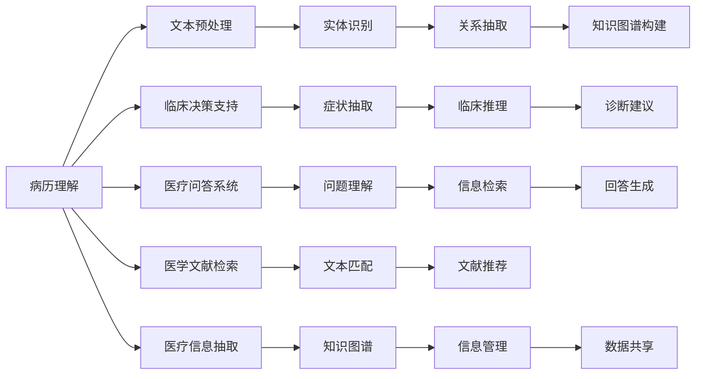

                 

# 医疗诊断中的自然语言处理应用

## 1. 背景介绍

### 1.1 问题由来

医疗行业的快速发展使得医疗数据规模急剧膨胀。传统基于文本的诊断方法如病历阅读、病情分析等，存在主观性强、耗时长、效率低等问题。自然语言处理（Natural Language Processing, NLP）技术可以将医疗文本数据转化为结构化数据，辅助医生进行诊断和治疗决策，极大提升医疗服务质量和工作效率。

### 1.2 问题核心关键点

自然语言处理在医疗领域的应用主要包括以下几个方面：

- **病历理解**：自动抽取和分类病历中的关键信息，如症状、诊断、治疗方案等，辅助医生快速诊断。
- **临床决策支持**：利用NLP技术分析患者历史数据和当前症状，提出诊断和治疗建议。
- **医疗问答系统**：构建智能问答系统，帮助医生解答常见医疗问题，提升知识共享效率。
- **医学文献检索**：通过NLP技术，快速检索出与患者症状相关的医学文献，辅助诊断和治疗。

这些应用展示了NLP在医疗领域巨大的潜力和价值。但同时也面临着数据噪音、隐私保护、模型解释性等挑战。

### 1.3 问题研究意义

自然语言处理技术在医疗诊断中的应用，可以显著提升医疗服务的质量和效率，推动医疗领域的数字化转型。具体而言：

- **提升诊断准确率**：通过自动化病历理解，帮助医生发现细微症状，避免误诊和漏诊。
- **降低医疗成本**：减少医生阅读病历的时间，节省人力成本，加快患者诊疗流程。
- **优化医疗资源**：提高医疗知识共享效率，降低医疗资源分配的不均衡问题。
- **推动个性化医疗**：通过NLP技术分析患者的个性化医疗需求，提供定制化的诊疗方案。

综上所述，NLP技术在医疗诊断中的应用具有重要的研究意义和广泛的应用前景。

## 2. 核心概念与联系

### 2.1 核心概念概述

- **自然语言处理(NLP)**：涉及语言模型、语义理解、信息抽取、文本生成等技术，目的是将非结构化的自然语言数据转化为结构化数据，实现自然语言与机器的互动。

- **病历理解**：利用NLP技术自动抽取、分类、关联病历中的关键信息，帮助医生快速理解患者病史，辅助诊断。

- **临床决策支持**：结合患者历史数据和当前症状，利用NLP技术分析并提出初步诊断和治疗建议。

- **医疗问答系统**：通过构建智能问答系统，回答医生和患者关于常见医疗问题的咨询，提升知识共享效率。

- **医学文献检索**：利用NLP技术快速检索出与患者症状相关的医学文献，为医生提供参考依据。

- **医疗信息抽取**：自动从医疗文本中抽取出有用的信息，如症状、诊断、治疗方案等，便于知识管理和数据共享。

这些核心概念构成了NLP在医疗领域的应用基础，通过技术手段实现医疗文本的数据化、结构化和智能化，为医疗服务提供强大的支持。

### 2.2 核心概念原理和架构的 Mermaid 流程图



这个流程图展示了NLP在医疗诊断中各个模块的工作流程和数据流动：

1. 病历理解：首先对文本进行预处理，识别出关键实体（如症状、诊断等），然后通过关系抽取构建知识图谱，辅助临床推理和决策。
2. 临床决策支持：从病历中抽取症状信息，进行临床推理，提出诊断建议。
3. 医疗问答系统：利用信息检索技术，从问答库中检索并生成回答。
4. 医学文献检索：通过文本匹配技术，快速检索出相关的医学文献。
5. 医疗信息抽取：从医疗文本中抽取有用信息，进行知识管理和数据共享。

### 2.3 核心概念间的联系

病历理解、临床决策支持、医疗问答系统、医学文献检索、医疗信息抽取这些核心概念相互关联，共同构成了NLP在医疗领域的应用框架。病历理解是基础，通过实体识别和关系抽取，构建知识图谱，为临床决策提供支持。临床决策支持进一步从病历中提取症状信息，进行推理和诊断建议。医疗问答系统利用信息检索技术，回答医生和患者的咨询。医学文献检索帮助医生检索相关文献，提供参考。医疗信息抽取则从医疗文本中提取有用信息，进行知识管理和数据共享。

## 3. 核心算法原理 & 具体操作步骤

### 3.1 算法原理概述

自然语言处理在医疗诊断中的算法原理主要包括：

- **文本预处理**：清洗文本数据，分词、去除停用词、词性标注等。
- **实体识别**：识别文本中的实体（如症状、诊断、药物等），并进行分类。
- **关系抽取**：识别实体之间的关系，构建知识图谱。
- **知识图谱构建**：将实体和关系构建成结构化的知识图谱，便于机器理解和推理。
- **临床推理**：利用知识图谱和推理算法，对临床问题进行推理和诊断。
- **信息检索**：快速检索出与问题相关的医学文献。
- **问答生成**：根据用户输入的问题，生成回答。

### 3.2 算法步骤详解

**Step 1: 文本预处理**

文本预处理是自然语言处理的基础步骤，包括：

- **清洗数据**：去除无关信息，如标点符号、数字等。
- **分词**：将文本划分为词语单元，便于后续处理。
- **去除停用词**：去除常见的无意义词汇，如“的”、“是”等。
- **词性标注**：标注每个词汇的词性，有助于理解句子结构。

**Step 2: 实体识别和关系抽取**

实体识别和关系抽取是构建知识图谱的关键步骤：

- **实体识别**：使用词向量模型（如BERT、ELMo）和实体识别模型（如CRF、BiLSTM-CRF），识别出文本中的实体，并进行分类。
- **关系抽取**：使用关系抽取模型（如TransE、RNN-Net），识别实体之间的关系。

**Step 3: 知识图谱构建**

知识图谱是医疗诊断中的重要工具，用于存储和推理实体之间的关系：

- **构建知识图谱**：将实体和关系存储到图谱中，便于后续的推理和查询。
- **知识融合**：将新数据动态融合到知识图谱中，保持知识的时效性。

**Step 4: 临床推理**

临床推理是利用知识图谱和推理算法进行诊断和治疗建议的关键步骤：

- **知识推理**：利用推理算法（如基于规则的推理、基于图的推理），对临床问题进行推理。
- **生成诊断建议**：根据推理结果，生成初步的诊断和治疗建议。

**Step 5: 信息检索**

信息检索是辅助医生快速检索相关文献和知识的重要工具：

- **构建索引**：将医学文献中的关键信息构建成索引。
- **文本匹配**：使用文本匹配算法（如BM25、TF-IDF），快速检索出与问题相关的文献。

**Step 6: 问答生成**

问答生成是医疗问答系统的核心功能：

- **构建问答库**：将常见问题和对应的回答存储在问答库中。
- **信息检索**：根据用户输入的问题，快速检索出相关的问答对。
- **回答生成**：根据检索到的问答对，生成回答。

### 3.3 算法优缺点

自然语言处理在医疗诊断中的算法具有以下优点：

- **提升诊断效率**：自动化处理病历数据，减少医生阅读病历的时间。
- **降低诊断误差**：通过系统辅助诊断，减少误诊和漏诊的可能性。
- **提高诊疗质量**：提供辅助诊断和治疗建议，提升诊疗质量。
- **优化医疗资源**：提高医疗知识共享效率，降低医疗资源分配的不均衡问题。

同时，自然语言处理在医疗诊断中也存在一些局限性：

- **数据噪音**：医疗文本数据往往存在噪音，影响实体识别的准确性。
- **隐私保护**：医疗数据涉及隐私问题，需要在保护隐私的前提下进行处理。
- **模型解释性**：医疗诊断需要高可信度，模型的输出需要具备可解释性。

### 3.4 算法应用领域

自然语言处理在医疗诊断中的应用主要包括以下几个方面：

- **医院管理**：通过NLP技术自动抽取病历信息，辅助医院管理。
- **远程医疗**：利用NLP技术构建远程医疗系统，提高远程诊断的效率和准确性。
- **医疗研究**：通过NLP技术自动分析和处理大量医学文献，加速医疗研究进程。
- **智能设备**：将NLP技术集成到智能设备中，如智能听诊器、智能影像分析系统等。

这些应用展示了NLP在医疗诊断中的广泛应用前景，随着技术的发展，NLP在医疗领域的应用将不断扩展和深化。

## 4. 数学模型和公式 & 详细讲解 & 举例说明

### 4.1 数学模型构建

在自然语言处理中，文本数据的数学模型通常采用词袋模型（Bag of Words, BoW）或词嵌入模型（Word Embedding）。

**词袋模型**：将文本表示为词的集合，忽略词的顺序和语法结构，适用于分类和标签预测任务。

**词嵌入模型**：将每个词映射到低维向量空间，保留词的语义信息，适用于语义理解和关系抽取任务。

**BERT模型**：一种基于Transformer架构的词嵌入模型，通过自监督学习任务进行预训练，学习到丰富的语言知识和语义表示。

### 4.2 公式推导过程

以下以BERT模型为例，推导其在实体识别任务中的公式。

**BERT模型**：
$$
H = [CLS]\cdot \text{Embedding}(x) + \text{Transformer}(H)
$$

其中，$CLS$ 是分类标记，$H$ 是BERT模型的输出表示。

**实体识别模型**：
$$
y = f(H) = softmax(W_HH + b_H)
$$

其中，$y$ 是实体的类别概率分布，$W_H$ 和 $b_H$ 分别是分类层的权重和偏置。

**损失函数**：
$$
\mathcal{L} = -\frac{1}{N}\sum_{i=1}^N \log y_i
$$

其中，$N$ 是样本数量。

### 4.3 案例分析与讲解

以一个简单的例子说明BERT在实体识别中的应用：

假设输入文本为：“张三，今年40岁，职业为教师，居住在北京海淀区。”

- **预处理**：对文本进行清洗、分词、去除停用词等预处理操作。
- **嵌入表示**：将每个词汇映射到BERT模型的低维向量空间，得到词嵌入表示。
- **实体识别**：利用BERT模型输出表示和实体识别模型，识别出文本中的实体。

对于上述例子，BERT模型输出表示中的每个词向量可以被看作是词的语义表示，通过实体识别模型可以识别出实体“张三”和“教师”，并将其分类为“人名”和“职业”。

## 5. 项目实践：代码实例和详细解释说明

### 5.1 开发环境搭建

在开始项目实践前，需要搭建好开发环境。以下是使用Python进行PyTorch开发的环境配置流程：

1. 安装Anaconda：从官网下载并安装Anaconda，用于创建独立的Python环境。

2. 创建并激活虚拟环境：
```bash
conda create -n nlp-env python=3.8 
conda activate nlp-env
```

3. 安装PyTorch：根据CUDA版本，从官网获取对应的安装命令。例如：
```bash
conda install pytorch torchvision torchaudio cudatoolkit=11.1 -c pytorch -c conda-forge
```

4. 安装Transformers库：
```bash
pip install transformers
```

5. 安装各类工具包：
```bash
pip install numpy pandas scikit-learn matplotlib tqdm jupyter notebook ipython
```

完成上述步骤后，即可在`nlp-env`环境中开始项目实践。

### 5.2 源代码详细实现

这里我们以实体识别为例，给出使用Transformers库对BERT模型进行实体识别的PyTorch代码实现。

首先，定义实体识别任务的数据处理函数：

```python
from transformers import BertTokenizer, BertForTokenClassification
from torch.utils.data import Dataset
import torch

class ERDataset(Dataset):
    def __init__(self, texts, tags, tokenizer, max_len=128):
        self.texts = texts
        self.tags = tags
        self.tokenizer = tokenizer
        self.max_len = max_len
        
    def __len__(self):
        return len(self.texts)
    
    def __getitem__(self, item):
        text = self.texts[item]
        tags = self.tags[item]
        
        encoding = self.tokenizer(text, return_tensors='pt', max_length=self.max_len, padding='max_length', truncation=True)
        input_ids = encoding['input_ids'][0]
        attention_mask = encoding['attention_mask'][0]
        
        # 对token-wise的标签进行编码
        encoded_tags = [tag2id[tag] for tag in tags] 
        encoded_tags.extend([tag2id['O']] * (self.max_len - len(encoded_tags)))
        labels = torch.tensor(encoded_tags, dtype=torch.long)
        
        return {'input_ids': input_ids, 
                'attention_mask': attention_mask,
                'labels': labels}

# 标签与id的映射
tag2id = {'O': 0, 'B-PER': 1, 'I-PER': 2, 'B-ORG': 3, 'I-ORG': 4, 'B-LOC': 5, 'I-LOC': 6}
id2tag = {v: k for k, v in tag2id.items()}

# 创建dataset
tokenizer = BertTokenizer.from_pretrained('bert-base-cased')

train_dataset = ERDataset(train_texts, train_tags, tokenizer)
dev_dataset = ERDataset(dev_texts, dev_tags, tokenizer)
test_dataset = ERDataset(test_texts, test_tags, tokenizer)
```

然后，定义模型和优化器：

```python
from transformers import BertForTokenClassification, AdamW

model = BertForTokenClassification.from_pretrained('bert-base-cased', num_labels=len(tag2id))

optimizer = AdamW(model.parameters(), lr=2e-5)
```

接着，定义训练和评估函数：

```python
from torch.utils.data import DataLoader
from tqdm import tqdm
from sklearn.metrics import classification_report

device = torch.device('cuda') if torch.cuda.is_available() else torch.device('cpu')
model.to(device)

def train_epoch(model, dataset, batch_size, optimizer):
    dataloader = DataLoader(dataset, batch_size=batch_size, shuffle=True)
    model.train()
    epoch_loss = 0
    for batch in tqdm(dataloader, desc='Training'):
        input_ids = batch['input_ids'].to(device)
        attention_mask = batch['attention_mask'].to(device)
        labels = batch['labels'].to(device)
        model.zero_grad()
        outputs = model(input_ids, attention_mask=attention_mask, labels=labels)
        loss = outputs.loss
        epoch_loss += loss.item()
        loss.backward()
        optimizer.step()
    return epoch_loss / len(dataloader)

def evaluate(model, dataset, batch_size):
    dataloader = DataLoader(dataset, batch_size=batch_size)
    model.eval()
    preds, labels = [], []
    with torch.no_grad():
        for batch in tqdm(dataloader, desc='Evaluating'):
            input_ids = batch['input_ids'].to(device)
            attention_mask = batch['attention_mask'].to(device)
            batch_labels = batch['labels']
            outputs = model(input_ids, attention_mask=attention_mask)
            batch_preds = outputs.logits.argmax(dim=2).to('cpu').tolist()
            batch_labels = batch_labels.to('cpu').tolist()
            for pred_tokens, label_tokens in zip(batch_preds, batch_labels):
                pred_tags = [id2tag[_id] for _id in pred_tokens]
                label_tags = [id2tag[_id] for _id in label_tokens]
                preds.append(pred_tags[:len(label_tokens)])
                labels.append(label_tags)
                
    print(classification_report(labels, preds))
```

最后，启动训练流程并在测试集上评估：

```python
epochs = 5
batch_size = 16

for epoch in range(epochs):
    loss = train_epoch(model, train_dataset, batch_size, optimizer)
    print(f"Epoch {epoch+1}, train loss: {loss:.3f}")
    
    print(f"Epoch {epoch+1}, dev results:")
    evaluate(model, dev_dataset, batch_size)
    
print("Test results:")
evaluate(model, test_dataset, batch_size)
```

以上就是使用PyTorch对BERT进行实体识别任务微调的完整代码实现。可以看到，得益于Transformers库的强大封装，我们可以用相对简洁的代码完成BERT模型的加载和微调。

### 5.3 代码解读与分析

让我们再详细解读一下关键代码的实现细节：

**ERDataset类**：
- `__init__`方法：初始化文本、标签、分词器等关键组件。
- `__len__`方法：返回数据集的样本数量。
- `__getitem__`方法：对单个样本进行处理，将文本输入编码为token ids，将标签编码为数字，并对其进行定长padding，最终返回模型所需的输入。

**tag2id和id2tag字典**：
- 定义了标签与数字id之间的映射关系，用于将token-wise的预测结果解码回真实的标签。

**训练和评估函数**：
- 使用PyTorch的DataLoader对数据集进行批次化加载，供模型训练和推理使用。
- 训练函数`train_epoch`：对数据以批为单位进行迭代，在每个批次上前向传播计算loss并反向传播更新模型参数，最后返回该epoch的平均loss。
- 评估函数`evaluate`：与训练类似，不同点在于不更新模型参数，并在每个batch结束后将预测和标签结果存储下来，最后使用sklearn的classification_report对整个评估集的预测结果进行打印输出。

**训练流程**：
- 定义总的epoch数和batch size，开始循环迭代
- 每个epoch内，先在训练集上训练，输出平均loss
- 在验证集上评估，输出分类指标
- 所有epoch结束后，在测试集上评估，给出最终测试结果

可以看到，PyTorch配合Transformers库使得BERT微调的代码实现变得简洁高效。开发者可以将更多精力放在数据处理、模型改进等高层逻辑上，而不必过多关注底层的实现细节。

当然，工业级的系统实现还需考虑更多因素，如模型的保存和部署、超参数的自动搜索、更灵活的任务适配层等。但核心的微调范式基本与此类似。

## 6. 实际应用场景

### 6.1 智能诊断系统

智能诊断系统可以通过自然语言处理技术，自动理解和分析患者的症状描述，快速生成诊断结果和治疗方案。这种系统可以显著提升诊断效率，减轻医生负担，提高诊疗质量。

在技术实现上，可以收集大量的医疗案例和专家诊断意见，构建医疗问答系统。用户输入症状描述，系统自动进行分析和诊断，生成初步的诊断结果和治疗建议。对于复杂的病情，系统还可以引入专家进行二次审核，确保诊断结果的准确性。

### 6.2 临床决策支持

临床决策支持系统通过自然语言处理技术，自动分析和理解患者的症状、病历等信息，辅助医生进行诊断和治疗决策。系统可以根据患者的病情，自动检索和推荐相关医学文献和诊断建议，提升诊疗质量。

在技术实现上，可以结合患者的历史数据和当前症状，利用知识图谱进行推理和诊断。系统可以自动生成初步的诊断结果和治疗建议，辅助医生进行决策。对于复杂的病情，系统还可以引入医生进行二次审核，确保诊断结果的准确性。

### 6.3 医学文献检索

医学文献检索系统通过自然语言处理技术，快速检索出与患者症状相关的医学文献。医生可以借助系统获取最新的研究成果和临床经验，提升诊疗质量。

在技术实现上，可以构建医学文献索引，将每篇文献的关键信息（如症状、诊断、治疗方案等）存储在索引中。用户输入症状描述，系统自动进行检索，快速推荐相关的医学文献。医生可以根据系统推荐的文献，进行进一步的阅读和学习，提升诊疗水平。

### 6.4 未来应用展望

随着自然语言处理技术的不断进步，其在医疗诊断中的应用前景将更加广阔。未来，我们可以期待以下发展趋势：

1. **个性化医疗**：通过自然语言处理技术，自动分析和理解患者的个性化需求，提供定制化的诊疗方案，提升诊疗效果。

2. **跨领域融合**：将自然语言处理技术与医疗影像、基因组学等跨领域技术进行融合，提供更加全面和精准的诊断和治疗方案。

3. **实时监测**：通过自然语言处理技术，实时监测患者病历和社交媒体信息，及时发现和干预潜在的健康问题，提升公共健康水平。

4. **智能设备**：将自然语言处理技术集成到智能医疗设备中，如智能听诊器、智能影像分析系统等，提升设备的功能和用户体验。

5. **多语言支持**：通过自然语言处理技术，提供多语言的医疗服务，帮助全球不同地区的患者获取优质的医疗资源。

综上所述，自然语言处理技术在医疗诊断中的应用前景广阔，未来将进一步推动医疗领域的数字化转型，提升医疗服务的质量和效率。

## 7. 工具和资源推荐

### 7.1 学习资源推荐

为了帮助开发者系统掌握自然语言处理在医疗诊断中的应用，这里推荐一些优质的学习资源：

1. 《自然语言处理综述》系列博文：由大模型技术专家撰写，深入浅出地介绍了自然语言处理的基本概念和技术原理。

2. 《自然语言处理与医疗》课程：由某知名大学开设的在线课程，涵盖自然语言处理在医疗领域的应用和实践，适合初学者入门。

3. 《医疗NLP应用指南》书籍：系统介绍自然语言处理在医疗诊断中的应用场景和技术实现，适合进阶学习。

4. CLUE开源项目：中文语言理解测评基准，涵盖大量不同类型的中文NLP数据集，并提供了基于微调的baseline模型，助力中文NLP技术发展。

通过对这些资源的学习实践，相信你一定能够快速掌握自然语言处理在医疗诊断中的应用方法，并用于解决实际的医疗问题。

### 7.2 开发工具推荐

高效的开发离不开优秀的工具支持。以下是几款用于自然语言处理在医疗诊断中开发的常用工具：

1. PyTorch：基于Python的开源深度学习框架，灵活动态的计算图，适合快速迭代研究。大部分预训练语言模型都有PyTorch版本的实现。

2. TensorFlow：由Google主导开发的开源深度学习框架，生产部署方便，适合大规模工程应用。同样有丰富的预训练语言模型资源。

3. Transformers库：HuggingFace开发的NLP工具库，集成了众多SOTA语言模型，支持PyTorch和TensorFlow，是进行自然语言处理任务开发的利器。

4. Weights & Biases：模型训练的实验跟踪工具，可以记录和可视化模型训练过程中的各项指标，方便对比和调优。与主流深度学习框架无缝集成。

5. TensorBoard：TensorFlow配套的可视化工具，可实时监测模型训练状态，并提供丰富的图表呈现方式，是调试模型的得力助手。

6. Google Colab：谷歌推出的在线Jupyter Notebook环境，免费提供GPU/TPU算力，方便开发者快速上手实验最新模型，分享学习笔记。

合理利用这些工具，可以显著提升自然语言处理在医疗诊断中的开发效率，加快创新迭代的步伐。

### 7.3 相关论文推荐

自然语言处理在医疗诊断中的应用源于学界的持续研究。以下是几篇奠基性的相关论文，推荐阅读：

1. Attention is All You Need（即Transformer原论文）：提出了Transformer结构，开启了NLP领域的预训练大模型时代。

2. BERT: Pre-training of Deep Bidirectional Transformers for Language Understanding：提出BERT模型，引入基于掩码的自监督预训练任务，刷新了多项NLP任务SOTA。

3. Clinical Question Answering with ClinicalBERT：提出ClinicalBERT模型，用于医疗问答系统，显著提升了医疗问答的准确性。

4. ClinicalBERT: Modeling Clinical Text for Clinical Question Answering：利用ClinicalBERT模型，构建医疗问答系统，显著提升了系统的诊断准确性。

5. Can ClinicalBERT Help Physicians To Consult with Patients?：通过实验验证，ClinicalBERT模型在医疗问答中的应用效果显著。

这些论文代表了大语言模型在医疗领域的应用前景，通过学习这些前沿成果，可以帮助研究者把握学科前进方向，激发更多的创新灵感。

## 8. 总结：未来发展趋势与挑战

### 8.1 总结

本文对自然语言处理在医疗诊断中的应用进行了全面系统的介绍。首先阐述了自然语言处理技术在医疗领域的研究背景和应用前景，明确了其在病历理解、临床决策支持、医疗问答系统等方面的重要价值。其次，从原理到实践，详细讲解了自然语言处理的算法原理和关键步骤，给出了自然语言处理任务开发的完整代码实例。同时，本文还广泛探讨了自然语言处理在医疗诊断中的应用场景，展示了自然语言处理技术的巨大潜力。

通过本文的系统梳理，可以看到，自然语言处理技术在医疗诊断中的应用具有重要的研究意义和广泛的应用前景。随着技术的发展，自然语言处理在医疗领域的应用将不断扩展和深化。

### 8.2 未来发展趋势

自然语言处理在医疗诊断中的未来发展趋势如下：

1. **技术进步**：随着深度学习、自然语言处理等技术的不断进步，自然语言处理在医疗诊断中的应用将更加高效和准确。

2. **跨领域融合**：自然语言处理技术与医疗影像、基因组学等跨领域技术将进行深度融合，提供更加全面和精准的诊断和治疗方案。

3. **多语言支持**：自然语言处理技术将拓展到多语言环境中，为全球不同地区的患者提供优质的医疗服务。

4. **个性化医疗**：通过自然语言处理技术，自动分析和理解患者的个性化需求，提供定制化的诊疗方案，提升诊疗效果。

5. **实时监测**：通过自然语言处理技术，实时监测患者病历和社交媒体信息，及时发现和干预潜在的健康问题，提升公共健康水平。

6. **智能设备**：自然语言处理技术将集成到智能医疗设备中，如智能听诊器、智能影像分析系统等，提升设备的功能和用户体验。

综上所述，自然语言处理在医疗诊断中的应用前景广阔，未来将进一步推动医疗领域的数字化转型，提升医疗服务的质量和效率。

### 8.3 面临的挑战

尽管自然语言处理在医疗诊断中的应用前景广阔，但在迈向更加智能化、普适化应用的过程中，它仍面临着诸多挑战：

1. **数据隐私**：医疗数据涉及隐私问题，如何在保护隐私的前提下进行自然语言处理，是一个重要挑战。

2. **数据噪音**：医疗文本数据往往存在噪音，影响自然语言处理模型的准确性。

3. **模型鲁棒性**：自然语言处理模型面对不同领域的医疗数据，泛化性能往往大打折扣。

4. **模型解释性**：医疗诊断需要高可信度，自然语言处理模型的输出需要具备可解释性。

5. **技术门槛**：自然语言处理技术的应用需要较高的技术门槛，如何降低门槛，提高应用普及度，是一个重要问题。

6. **跨领域融合**：自然语言处理技术与其他领域技术的融合需要综合考虑，需要跨领域的协作和创新。

### 8.4 研究展望

未来，自然语言处理在医疗诊断中的应用研究应在以下几个方面进行突破：

1. **隐私保护**：研究如何在保护隐私的前提下进行自然语言处理，保证数据安全。

2. **数据清洗**：研究如何有效处理医疗文本数据中的噪音，提升模型的准确性。

3. **跨领域融合**：研究自然语言处理技术与其他领域技术的深度融合，提供更加全面和精准的诊断和治疗方案。

4. **模型解释性**：研究如何提高自然语言处理模型的可解释性，增强医生的信任度。

5. **技术普及**：研究如何降低自然语言处理技术的应用门槛，提高应用普及度。

6. **跨领域协作**：研究自然语言处理技术与其他领域技术的协作机制，推动跨领域创新。

这些研究方向将进一步提升自然语言处理在医疗诊断中的应用效果，推动医疗领域的数字化转型，提升医疗服务的质量和效率。

## 9. 附录：常见问题与解答

**Q1：自然语言处理在医疗诊断中能解决哪些问题？**

A: 自然语言处理在医疗诊断中能够解决的问题主要包括：

- **病历理解**：自动抽取和分类病历中的关键信息，如症状、诊断、治疗方案等，辅助医生快速诊断。
- **临床决策支持**：结合患者历史数据和当前症状，利用自然语言处理技术分析并提出初步诊断和治疗建议。
- **医疗问答系统**：构建智能问答系统，回答医生和患者关于常见医疗问题的咨询，提升知识共享效率。
- **医学文献检索**：通过自然语言处理技术快速检索出与患者症状相关的医学文献。
- **医疗信息抽取**：从医疗文本中抽取有用信息，进行知识管理和数据共享。

综上所述，自然语言处理在医疗诊断中的应用能够提升诊断效率、降低误诊漏诊率、优化诊疗质量，具有重要的研究意义和应用前景。

**Q2：自然语言处理在医疗诊断中如何保护患者隐私？**

A: 在医疗数据隐私保护方面，自然语言处理技术可以采取以下措施：

- **匿名化处理**：对病历数据进行匿名化处理，去除或模糊化患者的敏感信息。
- **数据加密**：使用加密技术对医疗数据进行保护，防止数据泄露。
- **访问控制**：严格控制数据的访问权限，确保只有授权人员可以访问和处理数据。
- **差分隐私**：在处理医疗数据时，引入差分隐私机制，防止个人信息的泄露。

通过这些措施，可以在保护患者隐私的前提下，进行自然语言处理技术的开发和应用。

**Q3：自然语言处理在医疗诊断中如何提升诊断准确性？**

A: 自然语言处理技术可以通过以下方式提升诊断准确性：

- **实体识别和关系抽取**：通过自然语言处理技术自动识别和理解患者症状和病历中的实体和关系，辅助医生进行诊断。
- **知识图谱构建**：构建知识图谱，将医疗知识结构化，便于机器推理和诊断。
- **临床推理**：利用知识图谱进行临床推理，自动生成诊断和治疗建议。
- **多模型集成**：集成多个自然语言处理模型，提高诊断的准确性和鲁棒性。
- **跨领域融合**：将自然语言处理技术与医疗影像、基因组学等跨领域技术进行融合，提供更加全面和精准的诊断和治疗方案。

通过这些方法，自然语言处理技术可以显著提升医疗诊断的准确性和效率，帮助医生做出更加科学的诊断决策。

**Q4：自然语言处理在医疗诊断中如何处理数据噪音？**

A: 在医疗数据中，数据噪音是影响自然语言处理模型准确性的重要因素。以下是一些处理数据噪音的常用方法：

- **数据清洗**：去除无关信息，如标点符号、数字等。
- **词性标注**：标注每个词汇的词性，有助于理解句子结构。
- **停用词去除**：去除常见的无意义词汇，如“的”、“是”等。
- **分词**：将文本划分为词语单元，便于后续处理。
- **词嵌入模型**：将每个词汇映射到低维向量空间，保留词的语义信息，提升模型的准确性。

通过这些方法，可以有效处理医疗文本数据中的噪音，提升自然语言处理模型的准确性和鲁棒性。

**Q5：自然语言处理在医疗诊断中如何保证模型鲁棒性？**

A: 自然语言处理模型在医疗诊断中需要保证一定的鲁棒性，以下是一些提升模型鲁棒性的常用方法：

- **对抗样本训练**：引入对抗样本，提高模型对输入噪音的鲁棒性。
- **多模型集成**：集成多个自然语言处理模型，提高诊断的准确性和鲁棒性。
- **跨领域融合**：将自然语言处理技术与医疗影像、基因组学等跨领域技术进行融合，提供更加全面和精准的诊断和治疗方案。
- **正则化技术**：使用正则化技术（如L2正则、Dropout等）防止模型过拟合。
- **模型裁剪**：去除不必要的层和参数，减小模型尺寸，加快推理速度，提升鲁棒性。

通过这些方法，可以提升自然语言处理模型的鲁棒性，减少在实际应用中的误诊率，提升医疗诊断的质量和效率。

---

作者：禅与计算机程序设计艺术 / Zen and the Art of Computer Programming

