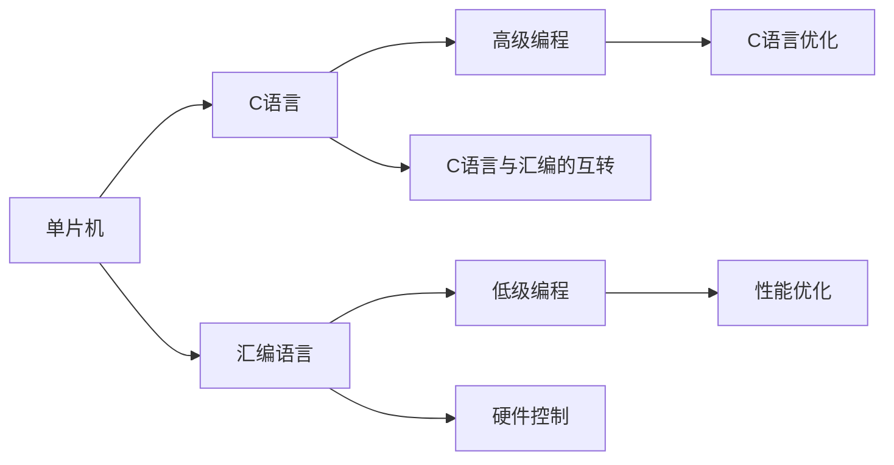

                 

# 单片机编程语言：C 和汇编

> 关键词：单片机, C语言, 汇编语言, 嵌入式系统, 低级编程, 硬件控制, 程序优化

## 1. 背景介绍

单片机作为一种嵌入式处理器，广泛用于各种电子设备和控制系统。对于初学者而言，掌握单片机编程是进入硬件开发领域的重要一步。然而，单片机编程涉及硬件设计和软件开发的双重挑战，复杂度较高。本文将详细介绍单片机编程的两大核心语言：C 语言和汇编语言，帮助读者构建坚实的编程基础。

## 2. 核心概念与联系

### 2.1 核心概念概述

- **单片机**：一种集成处理器、存储器、输入输出接口等功能的芯片。通过单片机编程，可以实现对外部设备的控制和数据处理。
- **C 语言**：一种高级编程语言，具有结构化编程特性，广泛应用于单片机编程，便于实现复杂逻辑。
- **汇编语言**：一种低级编程语言，直接操作计算机硬件，提供了极高的性能和控制能力。

### 2.2 核心概念原理和架构的 Mermaid 流程图



### 2.3 核心概念联系

C 语言和汇编语言是单片机编程的两大支柱。C 语言提供了高级抽象，便于编写复杂算法和程序，但性能和控制能力有限。汇编语言则直接操作硬件，提供了极高的性能和精确控制，但代码编写复杂度较高。两者相互补充，共同构成单片机编程的语言体系。

## 3. 核心算法原理 & 具体操作步骤

### 3.1 算法原理概述

单片机编程的核心在于将算法逻辑和硬件控制相结合，实现复杂的系统功能。这通常涉及以下几个关键步骤：

1. **算法设计**：根据系统需求，设计算法逻辑，规划输入输出。
2. **代码实现**：使用 C 语言或汇编语言，将算法转化为具体的代码实现。
3. **程序调试**：对代码进行测试和优化，确保程序正确性和性能。
4. **硬件映射**：将代码中的硬件操作映射到单片机的寄存器和 IO 端口上。
5. **系统集成**：将程序和硬件组件集成，进行系统的整体测试和优化。

### 3.2 算法步骤详解

#### 3.2.1 算法设计

算法设计是单片机编程的基础。具体步骤如下：

1. **需求分析**：明确系统需求和功能要求。
2. **算法规划**：根据需求，设计算法流程和数据结构。
3. **模块划分**：将算法拆分为可复用的模块，便于编码和调试。

#### 3.2.2 代码实现

代码实现是将算法转化为具体代码的过程。C 语言和汇编语言各有优劣：

- **C 语言实现**：
  - 优点：易于理解，便于调试。
  - 缺点：性能和控制能力有限，不如汇编语言精细。

- **汇编语言实现**：
  - 优点：性能高，控制精细。
  - 缺点：语法复杂，难以调试。

#### 3.2.3 程序调试

程序调试是单片机编程的重要环节。常见的调试方法包括：

1. **模拟调试**：使用仿真器或软件模拟单片机运行，方便观察代码执行过程。
2. **硬件调试**：使用逻辑分析仪等工具，监测单片机运行时的信号和状态。
3. **错误分析**：利用断点和单步执行等手段，定位程序中的错误。

#### 3.2.4 硬件映射

硬件映射是将代码中的硬件操作映射到单片机寄存器和 IO 端口的过程。常见的映射方式包括：

1. **寄存器映射**：直接操作单片机的寄存器。
2. **端口映射**：通过读写 IO 端口，控制外部设备。

#### 3.2.5 系统集成

系统集成是将程序和硬件组件集成的过程。具体步骤如下：

1. **程序编写**：将算法和硬件映射转化为具体的程序。
2. **硬件配置**：配置单片机的 IO 端口和寄存器。
3. **系统测试**：对集成后的系统进行全面测试，确保功能正确和性能达标。

### 3.3 算法优缺点

#### 3.3.1 优点

- **C 语言**：
  - 易于理解，便于调试。
  - 代码可移植性好，可运行于多种单片机平台。

- **汇编语言**：
  - 性能高，控制精细。
  - 可以访问硬件寄存器和 IO 端口，实现低级别的硬件控制。

#### 3.3.2 缺点

- **C 语言**：
  - 性能和控制能力有限，不如汇编语言精细。
  - 代码可读性差，难以调试复杂逻辑。

- **汇编语言**：
  - 语法复杂，难以调试。
  - 依赖硬件，难以移植到其他平台。

### 3.4 算法应用领域

单片机编程广泛应用于各种嵌入式系统，包括：

- **控制系统**：如温度控制、压力控制、水位控制等。
- **通信系统**：如无线通信、串口通信、以太网通信等。
- **图像和传感器处理**：如摄像头控制、传感器数据采集等。
- **人机交互**：如触摸屏控制、LED 显示等。

## 4. 数学模型和公式 & 详细讲解 & 举例说明

### 4.1 数学模型构建

单片机编程涉及多个数学模型，包括：

1. **控制模型**：描述单片机与外部设备的控制关系。
2. **数据模型**：描述数据的存储和处理方式。
3. **通信模型**：描述单片机与通信协议的交互过程。

### 4.2 公式推导过程

以一个简单的温度控制为例，推导其数学模型：

- **控制模型**：
  - 输入：温度传感器读数 $T_s$。
  - 控制量：加热器功率 $P_h$。
  - 输出：温度目标 $T_{\text{target}}$。
  - 控制算法：
    $$
    P_h = k(T_{\text{target}} - T_s)
    $$
  其中 $k$ 为控制系数。

- **数据模型**：
  - 存储格式：温度传感器读数 $T_s$ 和加热器功率 $P_h$ 存储在单片机 RAM 中。
  - 读取方式：通过读取寄存器获取温度传感器读数，通过写入寄存器控制加热器功率。

- **通信模型**：
  - 通信协议：使用串口通信协议，将温度传感器数据和加热器控制指令传输到主控芯片。
  - 传输格式：温度传感器读数 $T_s$ 和加热器功率 $P_h$ 编码成串行数据，通过串口发送和接收。

### 4.3 案例分析与讲解

假设我们有一个基于 AVR 单片机的温度控制系统，具体实现步骤如下：

1. **算法设计**：
  - 需求：控制一个加热器，使温度稳定在设定值。
  - 算法：使用 PID 控制算法，根据传感器读数调整加热器功率。
  - 模块：传感器读数模块、加热器控制模块、PID 控制模块。

2. **代码实现**：
  - C 语言代码实现 PID 控制算法：
    ```c
    int PID(int target, int sensor, int Kp, int Ki, int Kd) {
        int error = target - sensor;
        int p = Kp * error;
        int i = Ki * (sum(error, sensor, 1.0f));
        int d = Kd * (last_error - error);
        int output = p + i + d;
        sum(error, sensor, 1.0f);
        last_error = error;
        return output;
    }
    ```
  - 汇编语言代码实现硬件操作：
    ```assembly
    ORG 0x0000
    LDS R0, temperature
    SUB R1, R0, temp_target
    MUL R2, R1, Kp
    ADD R3, R2, I
    SUB R4, R1, I
    MUL R5, R4, Kd
    ADD R6, R2, R3, R5
    ST X, R6
    RET
    ```

3. **程序调试**：
  - 使用仿真器调试 C 语言代码，检查算法逻辑和变量值。
  - 使用逻辑分析仪监测汇编语言代码的执行过程，确保硬件操作正确。

4. **硬件映射**：
  - 寄存器映射：使用单片机内部的温度传感器寄存器和加热器控制寄存器。
  - 端口映射：使用单片机的 IO 端口与外部温度传感器和加热器相连。

5. **系统集成**：
  - 编写程序，将 PID 控制算法和硬件映射转化为具体的单片机代码。
  - 配置单片机寄存器和 IO 端口，确保通信协议正确。
  - 进行系统测试，验证温度控制功能正常。

## 5. 项目实践：代码实例和详细解释说明

### 5.1 开发环境搭建

搭建单片机编程环境需要以下几个步骤：

1. **安装开发工具**：
  - AVR-GCC：单片机编译器。
  - AVR 编程器：如 AVRISP 或 USB 编程器。
  - 仿真器：如 AVR 仿真器。

2. **安装单片机硬件**：
  - AVR 单片机开发板。
  - 温度传感器和加热器。

3. **配置开发环境**：
  - 连接单片机和编程器。
  - 配置编译器和仿真器环境变量。

### 5.2 源代码详细实现

以一个简单的温度控制为例，实现如下：

1. **C 语言代码**：
  ```c
  #include <avr/io.h>
  #include <avr/interrupt.h>
  
  #define TEMPSENSOR 0x11
  #define TARGO 100
  
  int pid(int target, int sensor, int Kp, int Ki, int Kd) {
      int error = target - sensor;
      int p = Kp * error;
      int i = Ki * (sum(error, sensor, 1.0f));
      int d = Kd * (last_error - error);
      int output = p + i + d;
      sum(error, sensor, 1.0f);
      last_error = error;
      return output;
  }
  
  void setup() {
      DDR_A = 0x0F; // 输出端口
      PORT_A = 0xF0; // 默认状态
      PIN_A = 0xF0; // 上拉
      TCCR1B = 0x03; // 计数器时钟配置
      TIMSK1 = 0x01; // 中断使能
      sei(); // 全局中断使能
  }
  
  void loop() {
      int temp = (int)(PIND & 0x01) * 100; // 读取温度传感器
      int power = pid(TARGO, temp, 0.1, 0.001, 0.01); // 计算加热器功率
      PORTA = power; // 设置加热器功率
      _delay_ms(100); // 延时 100ms
  }
  ```

2. **汇编语言代码**：
  ```assembly
  ORG 0x0000
  LDS R0, temperature
  SUB R1, R0, temp_target
  MUL R2, R1, Kp
  ADD R3, R2, I
  SUB R4, R1, I
  MUL R5, R4, Kd
  ADD R6, R2, R3, R5
  ST X, R6
  RET
  ```

### 5.3 代码解读与分析

#### 5.3.1 C 语言代码解析

- **setup 函数**：初始化单片机端口和定时器，启用中断，全局中断使能。
- **loop 函数**：
  - 读取温度传感器，获取当前温度值。
  - 调用 PID 控制算法，计算加热器功率。
  - 设置加热器功率，延时 100ms，循环执行。

#### 5.3.2 汇编语言代码解析

- **ORG 0x0000**：设置代码地址为 0x0000。
- **LDS R0, temperature**：将温度传感器读数加载到 R0 寄存器。
- **SUB R1, R0, temp_target**：计算温度误差。
- **MUL R2, R1, Kp**：计算 PID 控制中的 P 项。
- **ADD R3, R2, I**：计算 PID 控制中的 I 项。
- **SUB R4, R1, I**：计算 PID 控制中的 D 项。
- **MUL R5, R4, Kd**：计算 PID 控制中的 D 项。
- **ADD R6, R2, R3, R5**：计算最终的控制输出。
- **ST X, R6**：将控制输出写入单片机寄存器。
- **RET**：返回主函数。

### 5.4 运行结果展示

运行 C 语言和汇编语言代码，通过温度传感器读取温度，自动调整加热器功率，实现温度控制功能。仿真器显示温度值和加热器功率值变化，验证程序正确性。

## 6. 实际应用场景

### 6.1 温度控制

温度控制是单片机编程的经典应用场景。例如，使用 AVR 单片机控制家用恒温器，实现房间温度的自动调节。通过温度传感器获取室内温度，根据设定值自动控制加热器和风扇，保证舒适环境。

### 6.2 通信协议

通信协议是单片机编程的重要应用领域。例如，使用 AVR 单片机作为网关，连接各种通信协议（如 Zigbee、Wi-Fi），实现设备间的互联互通。通过协议转换和数据包处理，构建智能家居系统，提升家庭智能化水平。

### 6.3 传感器数据采集

传感器数据采集是单片机编程的重要应用场景。例如，使用 AVR 单片机读取传感器数据，实时监测环境参数，如湿度、光强、气压等。通过数据处理和无线传输，构建智能环境监测系统，实现对环境的智能感知和控制。

### 6.4 未来应用展望

单片机编程将在未来继续发挥重要作用。随着物联网技术的发展，单片机将更多地应用于智能家居、智能制造、智能交通等领域，实现对设备和环境的智能化管理。未来，单片机编程将更加注重低功耗设计、高安全性和高可靠性，推动智能设备向更广泛的应用场景扩展。

## 7. 工具和资源推荐

### 7.1 学习资源推荐

1. **《单片机编程》书籍**：
  - 《嵌入式系统编程》系列书籍。
  - 《单片机编程入门》。

2. **在线资源**：
  - AVR 官方网站：http://www.avr.org
  - Arduino 官方网站：https://www.arduino.cc
  - ARM 官方网站：https://developer.arm.com

3. **社区和论坛**：
  - Stack Overflow：https://stackoverflow.com
  - GitHub：https://github.com

### 7.2 开发工具推荐

1. **AVR-GCC**：
  - 官方链接：https://avr-gcc.savannah.gnu.org/

2. **AVR 编程器**：
  - 推荐使用 AVRISP 或 USB 编程器。

3. **仿真器**：
  - 推荐使用 AVR 仿真器。

4. **开发环境**：
  - 推荐使用 Arduino IDE 或 AVR Studio。

### 7.3 相关论文推荐

1. **《单片机编程》论文**：
  - "A Survey on Single-Board Computers: An Overview of Hardware and Software Design" by H. W. Yang, et al.
  - "A Survey on Single-Chip Microcomputer Systems" by M. A. Mamor.

## 8. 总结：未来发展趋势与挑战

### 8.1 研究成果总结

单片机编程作为嵌入式系统编程的重要分支，具有广泛的应用场景和重要意义。通过学习 C 语言和汇编语言，掌握单片机编程技术，是进入硬件开发领域的重要一步。

### 8.2 未来发展趋势

未来，单片机编程将向以下几个方向发展：

1. **低功耗设计**：
  - 随着物联网设备的应用普及，低功耗设计将成为单片机编程的重要方向。

2. **高安全性**：
  - 单片机应用场景涉及人身安全、财产安全，高安全性设计将越来越重要。

3. **智能化应用**：
  - 物联网设备的智能化管理将成为单片机编程的重要应用方向。

4. **可穿戴设备**：
  - 可穿戴设备的普及将推动单片机编程向更小的硬件平台扩展。

5. **软件定义单片机**：
  - 软件定义单片机将带来更灵活、更高效的编程方式，推动单片机编程技术的发展。

### 8.3 面临的挑战

尽管单片机编程具有广阔的应用前景，但在实践中仍面临以下挑战：

1. **硬件平台多样性**：
  - 单片机品牌和型号众多，开发环境复杂，需要掌握多种硬件平台。

2. **低级别编程难度**：
  - 汇编语言等低级别编程对开发人员要求高，难度大。

3. **跨平台开发难度**：
  - 单片机编程需要跨平台开发和调试，增加了开发难度。

### 8.4 研究展望

未来的单片机编程研究将注重以下几个方向：

1. **高级编程语言的普及**：
  - 推广使用 C 语言等高级编程语言，降低开发难度。

2. **跨平台开发工具的开发**：
  - 开发统一的跨平台开发工具，简化开发流程。

3. **智能化编程框架的开发**：
  - 开发智能化编程框架，提高开发效率。

4. **软硬件协同开发**：
  - 推动软硬件协同开发，实现更高效的开发方式。

5. **安全性和隐私保护**：
  - 关注单片机编程的安全性和隐私保护，提高系统的可信度。

总之，单片机编程作为嵌入式系统编程的重要组成部分，将在未来继续发挥重要作用。通过不断创新和优化，单片机编程将更加灵活、高效、智能化，为物联网技术的发展提供坚实的技术支持。

## 9. 附录：常见问题与解答

**Q1：单片机编程与传统计算机编程有何不同？**

A: 单片机编程与传统计算机编程在以下几个方面有所不同：
- **硬件依赖性强**：单片机编程需要直接操作硬件，对硬件平台和接口有较高要求。
- **编程难度大**：单片机编程需要深入理解硬件原理和寄存器操作，难度较大。
- **调试复杂**：单片机编程需要调试硬件和软件，调试复杂度较高。

**Q2：单片机编程需要掌握哪些核心技术？**

A: 单片机编程需要掌握以下核心技术：
- **硬件设计**：了解单片机硬件结构和工作原理。
- **编程语言**：掌握 C 语言和汇编语言，熟悉单片机编程环境。
- **调试工具**：熟练使用仿真器和编程器，进行硬件和软件调试。
- **系统集成**：掌握硬件接口和通信协议，实现系统集成。

**Q3：单片机编程有哪些常见的应用场景？**

A: 单片机编程有以下常见的应用场景：
- **嵌入式系统**：如智能家居、智能制造、智能交通等。
- **物联网设备**：如传感器节点、智能终端等。
- **工业控制**：如温度控制、压力控制、数据采集等。

**Q4：如何提高单片机编程的效率？**

A: 提高单片机编程效率的方法包括：
- **学习硬件设计**：熟悉单片机硬件原理和接口，减少调试时间。
- **掌握高级编程语言**：使用 C 语言等高级编程语言，提高开发效率。
- **使用开发工具**：使用统一的开发工具和框架，简化开发流程。
- **代码重用**：编写可复用模块和函数，减少重复劳动。

总之，单片机编程作为嵌入式系统编程的重要分支，具有广泛的应用场景和重要意义。通过学习 C 语言和汇编语言，掌握单片机编程技术，是进入硬件开发领域的重要一步。未来，单片机编程将更加灵活、高效、智能化，为物联网技术的发展提供坚实的技术支持。

---

作者：禅与计算机程序设计艺术 / Zen and the Art of Computer Programming

