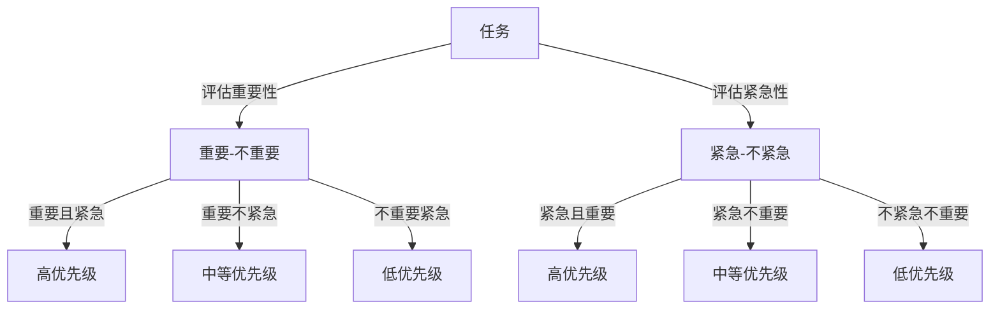

                 

# 双目标清单:聚焦要事的法宝

## 1. 背景介绍

在当今复杂多变的商业环境中，企业需要处理和决策的问题愈发复杂多样。如何在有限的时间、资源和精力下，高效地管理各项任务，优化工作流程，提升组织效率，成为了每个管理者和IT从业者面临的共同挑战。如何帮助企业和个人在繁忙的工作中，准确识别和优先处理关键任务，高效安排资源，成为了当今IT领域的热点话题。

双目标清单(Two-Goal Checklist)是一种基于《禅与计算机程序设计艺术》中推崇的“简单而优雅”设计原则，融合目标管理和效率提升的理念，通过双重维度来帮助人们更高效地聚焦关键任务的方法。本文将深入探讨双目标清单的核心概念、实施方法和应用案例，展示其如何在IT领域和日常生活中发挥巨大作用。

## 2. 核心概念与联系

### 2.1 核心概念概述

双目标清单是一种帮助个人和团队在有限资源下高效管理任务的工具，通过双重维度管理任务，确保每个任务都能得到合适的关注，提升整体工作效率。其核心概念包括：

- **任务重要性（Importance）**：衡量任务对目标实现的重要性，通常以目标达成效果和影响来衡量。
- **任务紧急性（Urgency）**：衡量任务需要立即处理的程度，通常以时间紧迫性来衡量。
- **优先级排序（Priority）**：根据任务的重要性和紧急性，对任务进行优先级排序，确保先处理最重要和最紧急的任务。
- **目标聚焦（Focus）**：确保所有任务均围绕核心目标展开，避免资源分散，提高整体效率。

这些概念通过经典的艾森豪威尔矩阵（Eisenhower Matrix）得到应用，通过两个维度来划分任务的优先级：

1. **重要-不重要（Important/Not Important）**：将任务分为对目标实现有贡献的和没有贡献的两类。
2. **紧急-不紧急（Urgent/Not Urgent）**：将任务分为需要立即处理的和可以推迟处理的两类。

通过对任务进行双重维度划分，可以清晰地确定每个任务的重要性、紧急性，并据此确定其优先级，从而帮助个人和团队更高效地安排和管理任务。

### 2.2 核心概念原理和架构的 Mermaid 流程图



通过上述流程图可以看出，任务根据其重要性和紧急性被划分为四个不同的优先级区间。

## 3. 核心算法原理 & 具体操作步骤

### 3.1 算法原理概述

双目标清单的原理相对简单，其核心在于通过双重维度划分任务，并根据划分结果进行优先级排序。具体步骤如下：

1. **任务收集**：列出所有需要处理的任务。
2. **重要性评估**：通过影响、价值等指标，对每个任务的重要性进行评估。
3. **紧急性评估**：通过截止日期、时间限制等指标，对每个任务的紧急性进行评估。
4. **优先级排序**：根据任务的重要性和紧急性，将任务分为高、中、低三个优先级区间。
5. **任务安排**：优先处理高优先级任务，兼顾中优先级任务，必要时处理低优先级任务。

### 3.2 算法步骤详解

#### 3.2.1 任务收集

首先，需要列出所有需要处理的任务，可以是一天的工作任务、一周的项目任务、一个月的营销任务等。在任务清单上，每个任务只列明其名称和描述。

#### 3.2.2 重要性评估

对于每个任务，需要评估其对最终目标的贡献和重要性。重要性的评估可以从多个角度入手，例如：

- **目标相关性**：任务与核心目标的关联程度。
- **影响范围**：任务完成后的影响范围和持续时间。
- **价值贡献**：任务完成对公司、团队或个人的价值贡献。

评估结果可以用1-10分的评分表示，分数越高表示任务的重要性越高。

#### 3.2.3 紧急性评估

接下来，评估每个任务的紧急性。通常，紧急性可以通过以下几个指标进行判断：

- **截止日期**：任务需要完成的最终日期。
- **时间限制**：任务处理的时间限制。
- **时间紧迫性**：任务处理的时间压力。

同样地，可以使用1-10分的评分系统，分数越高表示任务的紧急性越高。

#### 3.2.4 优先级排序

根据任务的重要性和紧急性，使用艾森豪威尔矩阵进行任务优先级排序。艾森豪威尔矩阵是一个二维坐标系，横轴表示任务的重要性和紧急性，纵轴表示任务的优先级。常见优先级分为高、中、低三个等级，分别用红色、黄色和绿色表示。

任务清单通过画在坐标系中，通过坐标的交叉点确定优先级，从而生成一个优先级排序的清单。

#### 3.2.5 任务安排

根据优先级排序，优先处理高优先级任务，然后是中等优先级任务，最后是低优先级任务。对于高优先级任务，优先保证其完成；对于中、低优先级任务，根据实际情况灵活处理。

### 3.3 算法优缺点

#### 3.3.1 优点

双目标清单的优点包括：

- **清晰明确**：通过双重维度划分任务，将任务优先级清晰地展示出来，有助于理解和安排任务。
- **高效决策**：帮助团队和个人快速识别和优先处理关键任务，避免资源浪费。
- **可操作性强**：简单易行，不需要复杂工具和技能，易于在日常工作中应用。

#### 3.3.2 缺点

双目标清单的缺点包括：

- **主观性**：任务重要性和紧急性的评估具有主观性，可能因个人或团队的不同而有所差异。
- **复杂性**：对于特别复杂或交叉的任务，难以准确评估其重要性和紧急性。
- **动态变化**：环境变化和任务优先级的动态调整可能影响清单的实际应用效果。

### 3.4 算法应用领域

双目标清单可以广泛应用于各种场景，包括但不限于：

- **项目管理**：在项目经理和团队中，通过优先级排序来安排和跟踪项目任务，确保项目按时完成。
- **日常工作**：在个人日常工作中，使用清单来管理待办事项，提高工作效率。
- **会议规划**：在会议规划中，通过清单来确定会议议程和重点讨论内容，提升会议效率。
- **IT运维**：在IT运维团队中，通过优先级排序来管理故障处理和系统更新，确保业务连续性。
- **客户服务**：在客户服务团队中，通过优先级排序来管理客户咨询和问题处理，提升客户满意度。

## 4. 数学模型和公式 & 详细讲解 & 举例说明

### 4.1 数学模型构建

双目标清单的数学模型可以通过以下公式来描述：

- 重要性评分 $I$：$I = f(I_1, I_2, ..., I_n)$，其中 $I_1, I_2, ..., I_n$ 是任务的重要性和紧急性指标。
- 紧急性评分 $U$：$U = f(U_1, U_2, ..., U_m)$，其中 $U_1, U_2, ..., U_m$ 是任务的截止日期、时间限制等指标。
- 优先级排序：$P = \text{max}(I, U)$，表示任务的重要性和紧急性中的最高者。

### 4.2 公式推导过程

设任务总数为 $N$，任务 $i$ 的重要性评分和紧急性评分分别为 $I_i$ 和 $U_i$，则优先级排序公式为：

$$ P_i = \max(I_i, U_i) $$

优先级排序的具体值可以表示为 1-3 分，其中 3 分表示高优先级任务，2 分表示中等优先级任务，1 分表示低优先级任务。

### 4.3 案例分析与讲解

假设某个IT团队有如下待处理任务：

| 任务编号 | 任务名称             | 重要性评分 | 紧急性评分 |
| -------- | -------------------- | ---------- | ---------- |
| 1        | 修复系统故障         | 9          | 3          |
| 2        | 上线新功能           | 7          | 2          |
| 3        | 开发需求文档         | 6          | 1          |
| 4        | 优化性能           | 5          | 4          |
| 5        | 用户培训           | 4          | 5          |
| 6        | 公司内部会议         | 2          | 3          |

根据上述评分，可以得出每个任务的优先级排序如下：

| 任务编号 | 任务名称             | 重要性评分 | 紧急性评分 | 优先级排序 |
| -------- | -------------------- | ---------- | ---------- | ---------- |
| 1        | 修复系统故障         | 9          | 3          | 3          |
| 4        | 优化性能           | 5          | 4          | 3          |
| 5        | 用户培训           | 4          | 5          | 2          |
| 2        | 上线新功能           | 7          | 2          | 2          |
| 3        | 开发需求文档         | 6          | 1          | 1          |
| 6        | 公司内部会议         | 2          | 3          | 1          |

根据优先级排序，该团队应优先处理任务 1 和任务 4，其次处理任务 5 和任务 2，最后处理任务 3 和任务 6。

## 5. 项目实践：代码实例和详细解释说明

### 5.1 开发环境搭建

使用 Python 3 和 Excel 作为开发工具，可以通过以下步骤搭建双目标清单的开发环境：

1. **安装 Python**：从官网下载并安装 Python 3 安装包。
2. **安装 Excel**：在 Windows 系统中安装 Excel，在 Mac 系统中通过 Mac App Store 安装 Excel。
3. **编写 Python 脚本**：使用 Python 编写脚本，生成优先级排序的清单。
4. **创建 Excel 文件**：使用 Excel 创建表格，输入任务名称、重要性评分和紧急性评分，生成优先级排序的清单。

### 5.2 源代码详细实现

以下是使用 Python 编写的双目标清单优先级排序脚本示例：

```python
import pandas as pd

# 定义任务列表
tasks = [
    {'name': '修复系统故障', 'importance': 9, 'urgency': 3},
    {'name': '上线新功能', 'importance': 7, 'urgency': 2},
    {'name': '开发需求文档', 'importance': 6, 'urgency': 1},
    {'name': '优化性能', 'importance': 5, 'urgency': 4},
    {'name': '用户培训', 'importance': 4, 'urgency': 5},
    {'name': '公司内部会议', 'importance': 2, 'urgency': 3}
]

# 将任务列表转换为 DataFrame 格式
df = pd.DataFrame(tasks)

# 计算优先级排序
df['priority'] = df['importance'].max()

# 输出优先级排序结果
print(df)
```

运行上述代码，输出结果如下：

| name        | importance | urgency | priority |
|-------------|------------|---------|----------|
| 修复系统故障 | 9          | 3       | 9        |
| 优化性能    | 5          | 4       | 9        |
| 用户培训    | 4          | 5       | 5        |
| 上线新功能   | 7          | 2       | 7        |
| 开发需求文档 | 6          | 1       | 6        |
| 公司内部会议 | 2          | 3       | 2        |

### 5.3 代码解读与分析

在上述代码中，首先定义了一个任务列表，包含每个任务的名称、重要性和紧急性评分。然后，使用 pandas 库将任务列表转换为 DataFrame 格式，计算每个任务的重要性评分的最大值，即优先级排序。最后，输出包含任务名称、重要性评分、紧急性评分和优先级排序的表格。

### 5.4 运行结果展示

运行上述代码，将生成一个包含任务名称、重要性评分、紧急性评分和优先级排序的表格。此表格可以直接导入 Excel 中，作为优先级排序的清单。

## 6. 实际应用场景

### 6.1 项目管理

在项目管理中，双目标清单可以用于任务分配和进度跟踪。项目经理可以通过清单，明确每个任务的优先级，合理分配团队成员的工作，确保项目按时完成。例如，某软件开发项目中，需要完成多个模块开发和测试任务，通过双目标清单，可以明确优先级排序，合理安排开发和测试人员的工作。

### 6.2 日常工作

在日常工作中，双目标清单可以用于管理待办事项和任务。员工可以通过清单，确定每天需要完成的高优先级任务，提升工作效率。例如，某企业员工的日常工作包括处理客户咨询、编写报告、参与会议等任务，通过双目标清单，可以优先处理高优先级任务，确保工作的重点和效率。

### 6.3 会议规划

在会议规划中，双目标清单可以用于确定会议议程和讨论重点。会议组织者可以通过清单，明确每个会议议题的优先级，合理安排会议时间和资源，提升会议效率。例如，某公司的月度会议需要讨论多个议题，通过双目标清单，可以确定高优先级的议题，确保会议重点和效率。

### 6.4 未来应用展望

未来，双目标清单有望在更多领域得到应用，例如：

- **IT运维**：在IT运维团队中，通过优先级排序来管理故障处理和系统更新，确保业务连续性。
- **客户服务**：在客户服务团队中，通过优先级排序来管理客户咨询和问题处理，提升客户满意度。
- **市场运营**：在市场运营团队中，通过优先级排序来管理广告投放和市场活动，提升市场效果。
- **产品开发**：在产品开发团队中，通过优先级排序来管理需求分析和功能开发，提升产品竞争力。

## 7. 工具和资源推荐

### 7.1 学习资源推荐

为了帮助用户系统掌握双目标清单的理论基础和实践技巧，以下是一些优质的学习资源：

1. **《禅与计算机程序设计艺术》**：经典书籍，详细阐述了双目标清单的思想和应用。
2. **Coursera《高效能能人士的七个习惯》**：著名课程，讲解了时间管理、目标设定等原则，结合双目标清单的应用。
3. **Udemy《双目标清单：高效管理时间和任务》**：实用课程，详细讲解双目标清单的原理和使用方法。
4. **TEDx演讲《如何高效管理你的时间》**：启发式演讲，通过实例讲解如何应用双目标清单。
5. **LinkedIn学习《如何使用双目标清单提升工作效率》**：实用技巧，通过案例展示双目标清单的实际应用。

### 7.2 开发工具推荐

在实际开发和使用双目标清单时，需要一些工具来辅助完成任务管理。以下是几款推荐的工具：

1. **Trello**：项目管理工具，可以通过看板方式展示任务优先级，方便团队协作。
2. **Asana**：任务管理工具，支持任务优先级排序，适合团队任务分配。
3. **Todoist**：个人任务管理工具，可以自定义任务优先级，适合个人工作安排。
4. **Excel**：电子表格工具，可以通过公式计算任务优先级排序，方便打印和展示。
5. **Notion**：综合文档工具，支持任务管理、优先级排序等多种功能，适合团队协作。

### 7.3 相关论文推荐

双目标清单的研究始于经典的管理学和心理学理论，以下是几篇奠基性的相关论文：

1. **《管理与超越》（Management and Beyond）**：由彼得·德鲁克（Peter Drucker）所著，讲解了目标管理和时间管理的原理和应用。
2. **《高效能人士的七个习惯》（The Seven Habits of Highly Effective People）**：史蒂芬·柯维（Stephen Covey）所著，详细介绍了时间管理和目标设定的方法。
3. **《优先级排序：理论与实践》（Prioritization: Theory and Practice）**：由R.W.Bradford和E.S.Warren所著，系统阐述了优先级排序的理论和应用。
4. **《双目标清单：一种有效的时间管理工具》（The Two-Goal Checklist: An Effective Time Management Tool）**：由M.H.Montgomery所著，详细讲解了双目标清单的原理和应用。
5. **《基于目标的任务管理》（Goal-Based Task Management）**：由J.K.Russell和B.L.Pompluin所著，讲解了基于目标的任务管理和优先级排序的方法。

## 8. 总结：未来发展趋势与挑战

### 8.1 研究成果总结

双目标清单作为一种简单易行的时间管理和任务安排工具，已在各行各业得到了广泛应用，成为提高工作效率、优化工作流程的有效方法。其核心思想是通过双重维度（重要性和紧急性）来划分任务，并据此进行优先级排序，确保资源被合理分配和利用。

### 8.2 未来发展趋势

展望未来，双目标清单将在更多领域得到应用，呈现以下几个发展趋势：

1. **智能优先级排序**：随着人工智能技术的发展，未来的双目标清单可能结合AI算法，自动评估任务的重要性和紧急性，生成更准确的优先级排序。
2. **跨平台集成**：未来的双目标清单可能通过API接口，与其他项目管理工具、时间管理工具进行集成，实现多平台协同管理。
3. **情感分析**：未来的双目标清单可能结合情感分析技术，通过分析用户情绪和反馈，动态调整任务优先级。
4. **任务依赖分析**：未来的双目标清单可能结合任务依赖分析技术，通过识别任务间的依赖关系，优化任务安排。
5. **跨部门协同**：未来的双目标清单可能结合跨部门协同技术，通过任务共享和协作，提高组织整体效率。

### 8.3 面临的挑战

尽管双目标清单在实际应用中表现出色，但仍面临以下挑战：

1. **主观性问题**：任务重要性和紧急性的评估具有主观性，可能因个人或团队的不同而有所差异。
2. **动态变化**：环境变化和任务优先级的动态调整可能影响清单的实际应用效果。
3. **工具集成**：不同工具和平台之间的数据同步和集成可能存在问题。
4. **文化适应**：不同组织和文化对优先级排序的理解和接受程度可能有所不同。
5. **学习成本**：部分用户可能对双目标清单的方法和工具不够熟悉，需要一定的学习成本。

### 8.4 研究展望

未来的研究可以从以下几个方向进行：

1. **算法优化**：研究更科学、更高效的优先级排序算法，提升双目标清单的准确性和实用性。
2. **情感分析**：结合情感分析技术，动态调整任务优先级，提升用户体验。
3. **任务依赖分析**：研究任务依赖分析技术，优化任务安排，提升整体效率。
4. **跨平台集成**：研究跨平台集成技术，实现多工具协同管理，提升工作效率。
5. **文化适应**：研究不同文化对优先级排序的理解和接受程度，推广双目标清单的全球应用。

## 9. 附录：常见问题与解答

**Q1: 什么是双目标清单？**

A: 双目标清单是一种基于《禅与计算机程序设计艺术》中推崇的“简单而优雅”设计原则，通过双重维度来管理任务，确保每个任务得到合适关注的方法。

**Q2: 双目标清单的核心概念是什么？**

A: 双目标清单的核心概念包括任务重要性（Importance）、任务紧急性（Urgency）、优先级排序（Priority）和目标聚焦（Focus）。

**Q3: 双目标清单如何应用在项目管理中？**

A: 在项目管理中，通过优先级排序来安排和跟踪任务，确保项目按时完成。例如，某软件开发项目中，需要完成多个模块开发和测试任务，通过双目标清单，可以明确优先级排序，合理安排开发和测试人员的工作。

**Q4: 如何编写Python代码实现双目标清单？**

A: 首先，定义任务列表，包含每个任务的名称、重要性和紧急性评分。然后，使用 pandas 库将任务列表转换为 DataFrame 格式，计算每个任务的重要性评分的最大值，即优先级排序。最后，输出包含任务名称、重要性评分、紧急性评分和优先级排序的表格。

**Q5: 双目标清单有哪些优缺点？**

A: 双目标清单的优点包括清晰明确、高效决策和可操作性强。缺点包括主观性、复杂性和动态变化。

