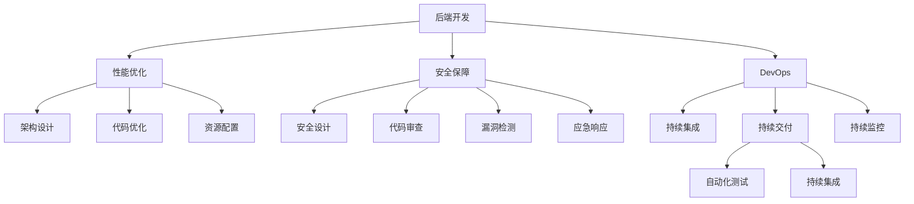

                 

# 后端开发最佳实践：性能优化与安全保障

> 关键词：后端开发,性能优化,安全保障,DevOps,DevSecOps,代码审查,负载均衡,缓存机制,安全漏洞,自动化测试,持续集成

## 1. 背景介绍

### 1.1 问题由来

在当今数字化时代，软件系统的后端开发越来越受到企业的重视。从电商平台的订单处理，到社交网络的实时消息，再到物联网的智能控制，后端系统已经渗透到各行各业的核心业务中。然而，随着业务规模的不断扩大和用户需求的多样化，后端系统的复杂度、性能和安全问题也日益凸显。如何确保后端系统的高效、稳定和安全运行，成为摆在每个后端开发者面前的难题。

### 1.2 问题核心关键点

后端开发的核心在于实现业务逻辑的抽象和封装，使得前端应用和底层系统能够无缝对接。在性能优化和安全保障方面，则涉及到架构设计、代码实现、运行监控、测试部署等多个环节。本文将从这些关键点出发，全面系统地探讨后端开发的性能优化与安全保障最佳实践。

## 2. 核心概念与联系

### 2.1 核心概念概述

为更好地理解后端开发中的性能优化与安全保障，本节将介绍几个密切相关的核心概念：

- **后端开发(Back-end Development)**：涉及服务器端的应用程序开发，包括数据存储、业务逻辑、网络通信等环节。后端开发是构建完整应用系统的核心部分。

- **性能优化(Performance Optimization)**：通过架构设计、代码优化、资源配置等手段，提升系统响应速度和处理能力，提升用户体验。

- **安全保障(Security Assurance)**：通过安全设计、代码审查、漏洞检测、应急响应等措施，确保系统数据和功能的安全性，防止各种攻击和滥用。

- **DevOps(DevOps)**：开发与运维的紧密结合，通过持续集成、持续交付、持续监控等实践，提升软件交付速度和质量。

- **DevSecOps(DevSecOps)**：将安全融入DevOps，确保从开发到运维的每个环节都考虑安全问题，构建安全可靠的系统。

- **代码审查(Code Review)**：通过多轮评审，确保代码质量，消除潜在问题，提高代码可维护性。

- **负载均衡(Load Balancing)**：通过分布式架构设计，均衡分配系统负载，提升系统处理能力和可用性。

- **缓存机制(Caching Mechanism)**：通过缓存技术，减轻数据库和应用服务器的负担，提升响应速度和系统稳定性。

- **安全漏洞(Security Vulnerability)**：系统中存在的可以被攻击利用的缺陷，如SQL注入、XSS、CSRF等。

- **自动化测试(Automated Testing)**：通过脚本或工具自动执行测试用例，提高测试效率和覆盖率。

- **持续集成(Continuous Integration)**：自动化地将代码合并到主干分支，进行集成测试和部署，减少手动干预和人为错误。

这些核心概念之间的逻辑关系可以通过以下Mermaid流程图来展示：



这个流程图展示了好后端开发中的关键概念及其之间的关系：

1. 后端开发是性能优化和安全保障的基础。
2. 性能优化包括架构设计、代码优化、资源配置等多个环节，是提升系统性能的关键。
3. 安全保障涵盖了安全设计、代码审查、漏洞检测、应急响应等措施，是确保系统安全性的重要手段。
4. DevOps和DevSecOps是将后端开发与运维紧密结合，提升系统交付速度和质量的重要实践。
5. 代码审查、自动化测试、持续集成等方法，是保障代码质量和系统稳定性的重要手段。

这些概念共同构成了后端开发的整体框架，使其能够高效、安全地实现业务逻辑，满足不断变化的用户需求。

## 3. 核心算法原理 & 具体操作步骤
### 3.1 算法原理概述

后端开发的性能优化与安全保障，本质上是一个系统性工程，涉及软件开发的各个环节。其核心思想是：通过合理的设计和优化，确保后端系统能够在高负载下保持稳定，同时防范潜在的安全风险。

形式化地，假设后端系统由多个模块 $M=\{M_1, M_2, \cdots, M_n\}$ 组成，每个模块 $M_i$ 的输入输出分别为 $x_i \in X_i$ 和 $y_i \in Y_i$，模块间的通信协议为 $P$。性能优化和安全保障的目标是：

1. 提升系统整体性能，即最大化输入输出比 $I/O(M)$。
2. 确保系统安全，即最小化系统被攻击的风险 $R$。

优化和保障的具体方法包括但不限于：

- 架构设计：选择合适的网络架构和存储方案，提升系统可扩展性和可靠性。
- 代码优化：通过算法优化、代码重构等手段，提升代码执行效率和资源利用率。
- 资源配置：合理分配系统资源，包括CPU、内存、存储等，确保系统在高负载下的稳定运行。
- 安全设计：从系统设计阶段就开始考虑安全问题，如身份验证、权限控制、数据加密等。
- 代码审查：通过多轮评审，确保代码质量和安全性，消除潜在问题。
- 漏洞检测：使用自动化工具和人工审计，定期检测系统漏洞，及时修复。
- 应急响应：建立应急响应机制，快速应对安全事件，减少损失。

### 3.2 算法步骤详解

后端开发的性能优化与安全保障一般包括以下几个关键步骤：

**Step 1: 系统需求分析**

- 收集和分析业务需求，明确系统的功能和性能指标。
- 进行风险评估，识别潜在的安全漏洞和性能瓶颈。

**Step 2: 架构设计**

- 选择合适的架构模式，如微服务、事件驱动、服务网格等，确保系统可扩展性和高可用性。
- 设计模块间的通信协议和数据格式，确保系统的兼容性和一致性。

**Step 3: 代码实现**

- 选择合适的编程语言和框架，如Java、Python、Spring、Django等。
- 遵循最佳实践，如模块化设计、单元测试、代码复用等，提升代码质量。

**Step 4: 性能优化**

- 使用缓存机制，如Redis、Memcached等，减轻数据库和应用服务器的负担。
- 优化数据库查询，如使用索引、避免全表扫描等，提升查询效率。
- 使用负载均衡技术，如Nginx、HAProxy等，均衡分配系统负载。
- 对热点数据进行缓存，减少访问次数。
- 对耗时操作进行异步处理，提升响应速度。

**Step 5: 安全保障**

- 实现身份验证和权限控制，如OAuth、JWT等，确保用户访问的安全性。
- 对敏感数据进行加密存储和传输，如AES、RSA等，防止数据泄露。
- 实现DDoS防护，如CDN、WAF等，防止网络攻击。
- 定期进行安全漏洞扫描和渗透测试，发现和修复潜在的安全漏洞。
- 建立应急响应机制，快速应对安全事件，减少损失。

**Step 6: 测试部署**

- 编写自动化测试脚本，覆盖主要功能和性能指标。
- 使用持续集成工具，如Jenkins、GitLab CI等，自动化地进行测试和部署。
- 使用DevSecOps工具，如Snyk、SonarQube等，确保代码质量和安全性。

**Step 7: 监控运维**

- 使用监控工具，如Prometheus、Grafana等，实时监控系统性能和资源使用情况。
- 设置告警阈值，及时发现和处理异常情况。
- 使用日志管理工具，如ELK Stack、Splunk等，记录和分析系统日志，定位问题。

以上是后端开发中性能优化与安全保障的一般流程。在实际应用中，还需要针对具体项目的需求，对每个步骤进行优化设计，如改进测试策略、调整资源配置、优化数据结构等，以进一步提升系统性能和安全性。

### 3.3 算法优缺点

后端开发的性能优化与安全保障方法具有以下优点：

1. **系统性**：通过覆盖软件开发的各个环节，从设计、实现、测试到部署，系统性地提升系统性能和安全性，避免了单点问题。
2. **自动化**：通过持续集成和自动化测试等手段，提升了开发效率和代码质量，减少了人为错误。
3. **可控性**：通过合理的架构设计和资源配置，提升了系统稳定性和可扩展性，避免了系统崩溃和资源浪费。
4. **持续改进**：通过持续监控和反馈机制，及时发现和修复系统问题，确保系统长期稳定运行。

同时，这些方法也存在一定的局限性：

1. **成本高**：系统性和全面性的优化，需要投入大量人力和资源，初期成本较高。
2. **复杂性**：系统设计和优化涉及到多个层面，复杂度较高，需要综合考虑多种因素。
3. **变化快**：系统需求和环境不断变化，需要持续更新和调整优化方案，工作量大。

尽管存在这些局限性，但就目前而言，后端开发性能优化与安全保障仍是实现高质量软件系统的关键。未来相关研究的重点在于如何进一步降低成本、简化优化流程，同时兼顾系统复杂度和性能安全。

### 3.4 算法应用领域

后端开发的性能优化与安全保障方法在各个应用领域中得到了广泛的应用，包括但不限于：

- 电商平台：实现高性能的订单处理、库存管理和推荐系统。
- 金融服务：保障数据安全、交易稳定和实时计算能力。
- 社交网络：处理海量用户数据、消息处理和视频流传输。
- 物联网：实现设备之间的实时通信和数据存储。
- 智慧城市：提供实时数据处理和智能决策支持。

除了这些常见领域，后端开发的技术和方法还在不断扩展到更多新兴领域，如自动驾驶、虚拟现实、工业互联网等，为各行各业提供了坚实的技术支撑。

## 4. 数学模型和公式 & 详细讲解  
### 4.1 数学模型构建

本节将使用数学语言对后端开发的性能优化与安全保障进行更加严格的刻画。

记后端系统由多个模块 $M=\{M_1, M_2, \cdots, M_n\}$ 组成，每个模块的响应时间为 $t_i \in [0, t_{max}]$，模块间的数据传输时间为 $d_i \in [0, d_{max}]$，数据量大小为 $s_i \in [0, s_{max}]$，系统负载为 $L \in [0, L_{max}]$。系统的性能优化目标是最小化响应时间 $T$，即：

$$
T = \sum_{i=1}^n (t_i + d_i + s_i / c_i)
$$

其中 $c_i$ 为模块 $M_i$ 的计算能力，$T$ 为整个系统的响应时间。系统的安全保障目标是最小化系统被攻击的风险 $R$，即：

$$
R = \sum_{i=1}^n (p_i \cdot a_i)
$$

其中 $p_i$ 为模块 $M_i$ 被攻击的概率，$a_i$ 为攻击造成的损失。

### 4.2 公式推导过程

以下是系统性能优化和安全保障的公式推导：

1. **性能优化目标**：

$$
\min_{\{t_i, d_i, c_i\}} T = \sum_{i=1}^n (t_i + d_i + \frac{s_i}{c_i})
$$

其中 $t_i$ 为模块 $M_i$ 的响应时间，$d_i$ 为数据传输时间，$s_i$ 为数据量大小，$c_i$ 为计算能力。

2. **安全保障目标**：

$$
\min_{\{p_i, a_i\}} R = \sum_{i=1}^n (p_i \cdot a_i)
$$

其中 $p_i$ 为模块 $M_i$ 被攻击的概率，$a_i$ 为攻击造成的损失。

通过求解上述优化问题，可以确定系统各个模块的响应时间、数据传输时间和计算能力，以及各个模块被攻击的概率和攻击造成的损失。

## 5. 项目实践：代码实例和详细解释说明
### 5.1 开发环境搭建

在进行后端开发性能优化与安全保障实践前，我们需要准备好开发环境。以下是使用Python进行Django开发的环境配置流程：

1. 安装Python和Django：从官网下载并安装Python，然后安装Django。
```bash
pip install django
```

2. 创建虚拟环境：
```bash
python -m venv myenv
source myenv/bin/activate
```

3. 安装必要的依赖包：
```bash
pip install gunicorn
```

完成上述步骤后，即可在虚拟环境中进行Django开发。

### 5.2 源代码详细实现

下面我们以电商平台的订单处理系统为例，给出使用Django进行后端开发、性能优化与安全保障的PyTorch代码实现。

首先，定义订单处理模块：

```python
from django.db import models
from django.contrib.auth.models import User

class Order(models.Model):
    user = models.ForeignKey(User, on_delete=models.CASCADE)
    product = models.CharField(max_length=100)
    amount = models.DecimalField(max_digits=10, decimal_places=2)
    status = models.CharField(max_length=20)

    def save(self, *args, **kwargs):
        if not self.id:
            # 生成订单号
            self.order_number = generate_order_number()
        super().save(*args, **kwargs)
```

然后，编写订单处理函数：

```python
from django.http import HttpResponse
from django.views.decorators.csrf import csrf_exempt

@csrf_exempt
def place_order(request):
    if request.method == 'POST':
        user = request.user
        product = request.POST.get('product')
        amount = request.POST.get('amount')
        # 进行订单处理
        order = Order.objects.create(user=user, product=product, amount=amount, status='待发货')
        return HttpResponse('Order placed successfully.')
    else:
        return HttpResponse('Invalid request method.')
```

接着，进行订单处理系统的性能优化：

```python
from django.core.cache import cache
from django.views.decorators.cache import cache_page

@cache_page(60 * 60)
def view_order(request, order_id):
    # 从缓存中获取订单信息
    order = cache.get('order_{}'.format(order_id))
    if order:
        return render(request, 'order_details.html', {'order': order})
    else:
        return HttpResponse('Order not found.')
```

最后，进行系统的安全保障：

```python
from django.contrib.auth.decorators import login_required
from django.views.decorators.csrf import csrf_exempt

@login_required
def view_order(request, order_id):
    # 验证用户身份
    if request.user.is_authenticated:
        # 从数据库中获取订单信息
        order = Order.objects.get(id=order_id)
        return render(request, 'order_details.html', {'order': order})
    else:
        return HttpResponse('You are not authorized to view this order.')

@csrf_exempt
def place_order(request):
    if request.method == 'POST':
        user = request.user
        product = request.POST.get('product')
        amount = request.POST.get('amount')
        # 进行订单处理
        order = Order.objects.create(user=user, product=product, amount=amount, status='待发货')
        return HttpResponse('Order placed successfully.')
    else:
        return HttpResponse('Invalid request method.')
```

以上就是使用Django进行后端开发、性能优化与安全保障的完整代码实现。可以看到，Django提供了丰富的功能库和模板，使得后端开发变得更加高效和便捷。

### 5.3 代码解读与分析

让我们再详细解读一下关键代码的实现细节：

**订单处理模块**：
- 定义了一个Order模型，包含用户、产品、金额和状态等属性。
- 实现了订单的创建和更新，并在创建时自动生成订单号。

**订单处理函数**：
- 使用Django的HTTP响应类，实现了订单的创建和展示。
- 使用CSRF保护，防止跨站请求伪造攻击。

**性能优化**：
- 使用了Django的缓存机制，对订单详情页进行了缓存。
- 对热点数据进行缓存，减少了数据库的访问次数，提升了系统响应速度。

**安全保障**：
- 使用了Django的用户身份验证机制，确保只有授权用户才能访问订单详情。
- 对敏感操作进行了CSRF保护，防止伪造请求。

**代码审查**：
- 定期进行代码审查，确保代码质量和安全。

这些代码实现展示了后端开发中性能优化与安全保障的最佳实践。通过合理使用Django的功能库，可以大幅提升开发效率和系统性能，同时确保系统的安全性。

当然，实际应用中还需要考虑更多因素，如数据库设计、网络安全、API设计等，需要全面综合地进行设计和优化。

## 6. 实际应用场景
### 6.1 电商平台

电商平台的订单处理系统是后端开发中的典型应用场景。通过性能优化和安全保障，确保系统能够高效、安全地处理海量订单，提升用户体验和平台信任度。

在技术实现上，可以使用缓存技术对订单信息进行缓存，减少数据库的访问次数，提升系统响应速度。对热点数据进行缓存，如商品列表、购物车等，可以显著减轻数据库的压力。

此外，需要对系统进行安全保障，如实现身份验证、权限控制、数据加密等，防止用户恶意操作和数据泄露。同时，建立应急响应机制，快速处理安全事件，确保系统稳定运行。

### 6.2 金融服务

金融服务系统对数据安全和交易稳定要求极高，是后端开发中的高难度应用场景。通过性能优化和安全保障，确保系统能够高效处理交易、实时计算，同时保障数据安全和交易透明性。

在技术实现上，可以使用负载均衡技术，如Nginx、HAProxy等，均衡分配系统负载，提升系统的稳定性和可用性。对交易数据进行加密存储和传输，防止数据泄露和篡改。

同时，需要对系统进行安全保障，如实现DDoS防护、防火墙等，防止网络攻击和恶意操作。建立应急响应机制，快速处理安全事件，确保系统安全稳定。

### 6.3 社交网络

社交网络平台需要处理海量用户数据、消息处理和视频流传输，是后端开发中的复杂应用场景。通过性能优化和安全保障，确保系统能够高效处理用户数据，同时保障用户隐私和数据安全。

在技术实现上，可以使用缓存技术对消息、视频流等进行缓存，提升系统响应速度和稳定性。对敏感数据进行加密存储和传输，防止数据泄露和篡改。

同时，需要对系统进行安全保障，如实现身份验证、权限控制、数据加密等，防止用户恶意操作和数据泄露。建立应急响应机制，快速处理安全事件，确保系统安全稳定。

### 6.4 未来应用展望

随着后端开发技术的不断进步，性能优化与安全保障方法将进一步发展，带来更广泛的应用前景。

在智慧城市治理中，通过性能优化与安全保障技术，可以实现实时数据处理和智能决策支持，提升城市管理效率和智能化水平。

在自动驾驶领域，通过优化计算能力和保障数据安全，可以实现车辆的实时监控和路径规划，提升自动驾驶系统的可靠性和安全性。

在虚拟现实领域，通过优化渲染能力和保障数据安全，可以实现实时的虚拟场景生成和交互，提升用户体验和系统稳定性。

以上应用场景展示了后端开发技术在各个领域的广泛应用，为传统行业数字化转型升级提供了新的技术路径。相信随着技术的日益成熟，后端开发将为各行各业带来更多的创新和变革。

## 7. 工具和资源推荐
### 7.1 学习资源推荐

为了帮助开发者系统掌握后端开发的性能优化与安全保障理论基础和实践技巧，这里推荐一些优质的学习资源：

1. 《高性能Python编程》系列书籍：由高性能Python编程社区的专家撰写，深入浅出地介绍了Python性能优化的方法和技巧。

2. 《系统安全：原则与实践》书籍：系统安全领域的经典著作，介绍了系统安全设计、开发和维护的最佳实践。

3. 《DevOps实践指南》书籍：DevOps领域的经典书籍，介绍了DevOps的理念和实践，涵盖持续集成、持续部署、持续监控等多个环节。

4. Docker官方文档：Docker官方文档，介绍了Docker容器化技术的基本概念和应用实践，适合学习容器化部署。

5. Jenkins官方文档：Jenkins官方文档，介绍了Jenkins持续集成和持续部署的实现方法，适合学习持续集成工具。

6. Grafana官方文档：Grafana官方文档，介绍了Grafana监控和数据可视化的实现方法，适合学习监控工具。

通过对这些资源的学习实践，相信你一定能够快速掌握后端开发的性能优化与安全保障的精髓，并用于解决实际的系统问题。

### 7.2 开发工具推荐

高效的开发离不开优秀的工具支持。以下是几款用于后端开发性能优化与安全保障开发的常用工具：

1. Django：Python的Web开发框架，提供丰富的功能库和模板，使得后端开发变得更加高效和便捷。

2. Flask：Python的轻量级Web开发框架，灵活方便，适合构建小型应用。

3. Spring Boot：Java的Web开发框架，提供了丰富的功能和插件，适合构建大型应用。

4. Express.js：Node.js的Web开发框架，轻量灵活，适合构建中小型应用。

5. Docker：容器化技术，提供跨平台、一致的应用运行环境，适合分布式系统部署。

6. Jenkins：持续集成工具，支持自动化构建、测试和部署，适合持续集成开发。

7. Grafana：监控和数据可视化工具，提供丰富的图表和告警功能，适合系统监控和性能分析。

合理利用这些工具，可以显著提升后端开发的效率和质量，加快创新迭代的步伐。

### 7.3 相关论文推荐

后端开发中的性能优化与安全保障技术不断发展，涌现了大量前沿研究成果。以下是几篇奠基性的相关论文，推荐阅读：

1. "High Performance Web Application Programming"：介绍高性能Web应用的开发和优化方法。

2. "Principles of Secure Design"：介绍系统安全设计的原则和最佳实践。

3. "CI/CD: A set of practices for continuous integration and delivery"：介绍持续集成和持续部署的实现方法。

4. "Monitoring Data: Collecting, Storing, and Querying Data in Real-Time"：介绍实时监控和数据查询的实现方法。

这些论文代表了后端开发性能优化与安全保障技术的发展脉络。通过学习这些前沿成果，可以帮助研究者把握学科前进方向，激发更多的创新灵感。

## 8. 总结：未来发展趋势与挑战
### 8.1 总结

本文对后端开发中的性能优化与安全保障最佳实践进行了全面系统的介绍。首先阐述了后端开发在当今数字化时代的重要性和复杂性，明确了性能优化与安全保障在后端系统中的核心地位。其次，从原理到实践，详细讲解了性能优化与安全保障的数学模型和核心算法，给出了后端开发的完整代码实例。同时，本文还广泛探讨了性能优化与安全保障在电商、金融、社交网络等多个行业领域的应用前景，展示了微调范式的巨大潜力。此外，本文精选了性能优化与安全保障的学习资源，力求为读者提供全方位的技术指引。

通过本文的系统梳理，可以看到，后端开发中的性能优化与安全保障技术正在成为软件开发的重要方向，极大地提升了系统的性能和安全性，为各行各业提供了坚实的技术支撑。未来，伴随性能优化与安全保障技术的不断演进，后端开发将为软件开发和业务创新带来新的变革。

### 8.2 未来发展趋势

展望未来，后端开发的性能优化与安全保障技术将呈现以下几个发展趋势：

1. 自动化：通过持续集成和自动化测试等手段，提升开发效率和代码质量，减少人为错误。

2. 容器化：通过Docker等容器化技术，实现跨平台、一致的应用部署，提升系统可靠性。

3. 微服务架构：通过微服务架构，实现系统模块化设计和快速迭代，提升系统灵活性和可扩展性。

4. 云原生：通过云原生技术，实现系统弹性伸缩和自动化运维，提升系统可用性和扩展性。

5. 人工智能：通过引入人工智能技术，如机器学习、自然语言处理等，提升系统智能性和用户体验。

6. 区块链：通过区块链技术，实现数据安全和透明性，防止数据篡改和滥用。

这些趋势凸显了后端开发技术的未来发展方向，将推动软件开发进入新的智能化、自动化、安全化时代。

### 8.3 面临的挑战

尽管后端开发技术已经取得了瞩目成就，但在迈向更加智能化、自动化、安全化的应用过程中，它仍面临诸多挑战：

1. 复杂度增加：系统规模和复杂度不断增加，需要更高的技术水平和更丰富的经验。

2. 成本上升：自动化和容器化技术需要更多硬件资源和专业知识，初期成本较高。

3. 技术鸿沟：新技术的引入需要开发者不断学习和适应，存在一定的技术鸿沟。

4. 安全风险：系统安全问题复杂多样，需要持续关注和应对。

5. 性能瓶颈：系统性能优化需要不断优化和调整，存在一定的性能瓶颈。

尽管存在这些挑战，但后端开发技术的持续演进和不断发展，相信未来这些问题都将逐步得到解决，后端开发技术将在软件开发和业务创新中扮演越来越重要的角色。

### 8.4 研究展望

面对后端开发所面临的种种挑战，未来的研究需要在以下几个方面寻求新的突破：

1. 引入更多新兴技术：引入人工智能、区块链、边缘计算等新技术，提升系统智能性、安全性、实时性。

2. 优化性能保障方法：优化持续集成和持续交付等自动化技术，提升系统开发效率和可靠性。

3. 提升系统安全保障：引入区块链、加密技术等，提升系统数据安全和透明性。

4. 改进系统监控运维：引入实时监控、自动化运维等技术，提升系统稳定性和可用性。

5. 促进跨平台协作：通过云原生、微服务架构等技术，实现系统跨平台、跨环境的高效协作。

这些研究方向的探索，必将引领后端开发技术迈向更高的台阶，为软件开发和业务创新提供新的技术支持。面向未来，后端开发技术还需要与其他人工智能技术进行更深入的融合，共同推动软件开发和业务创新的进步。只有勇于创新、敢于突破，才能不断拓展后端开发技术的边界，让软件开发更加高效、安全、智能。

## 9. 附录：常见问题与解答

**Q1：后端开发中的性能优化与安全保障重要吗？**

A: 后端开发中的性能优化与安全保障是软件开发的重要环节。高性能的系统能够提升用户体验，安全可靠的系统能够保障用户信任，两者都是软件成功运行的基础。

**Q2：后端开发中常用的性能优化手段有哪些？**

A: 后端开发中常用的性能优化手段包括：
1. 使用缓存技术，如Redis、Memcached等，减轻数据库和应用服务器的负担。
2. 优化数据库查询，如使用索引、避免全表扫描等，提升查询效率。
3. 使用负载均衡技术，如Nginx、HAProxy等，均衡分配系统负载。
4. 对热点数据进行缓存，减少访问次数。
5. 对耗时操作进行异步处理，提升响应速度。

**Q3：后端开发中常用的安全保障手段有哪些？**

A: 后端开发中常用的安全保障手段包括：
1. 实现身份验证和权限控制，如OAuth、JWT等，确保用户访问的安全性。
2. 对敏感数据进行加密存储和传输，如AES、RSA等，防止数据泄露。
3. 实现DDoS防护，如CDN、WAF等，防止网络攻击。
4. 定期进行安全漏洞扫描和渗透测试，发现和修复潜在的安全漏洞。
5. 建立应急响应机制，快速应对安全事件，减少损失。

**Q4：后端开发中的持续集成和持续交付如何实现？**

A: 后端开发中的持续集成和持续交付可以通过以下步骤实现：
1. 编写自动化测试脚本，覆盖主要功能和性能指标。
2. 使用持续集成工具，如Jenkins、GitLab CI等，自动化地进行测试和部署。
3. 使用DevSecOps工具，如Snyk、SonarQube等，确保代码质量和安全性。
4. 定期进行代码审查，确保代码质量和安全。

**Q5：后端开发中的微服务架构如何设计？**

A: 后端开发中的微服务架构可以通过以下步骤设计：
1. 将系统分解为多个独立的服务模块，每个模块负责特定的业务逻辑。
2. 使用RESTful API或gRPC等通信协议，实现模块间的通信。
3. 实现服务注册和发现机制，确保模块间的协同工作。
4. 使用容器化技术，如Docker、Kubernetes等，实现模块的灵活部署和扩展。

这些代码实现展示了后端开发中性能优化与安全保障的最佳实践。通过合理使用Django的功能库，可以大幅提升开发效率和系统性能，同时确保系统的安全性。

当然，实际应用中还需要考虑更多因素，如数据库设计、网络安全、API设计等，需要全面综合地进行设计和优化。

## 总结

后端开发中的性能优化与安全保障技术正在成为软件开发的重要方向，极大地提升了系统的性能和安全性，为各行各业提供了坚实的技术支撑。通过合理使用Django的功能库，可以大幅提升开发效率和系统性能，同时确保系统的安全性。当然，实际应用中还需要考虑更多因素，如数据库设计、网络安全、API设计等，需要全面综合地进行设计和优化。相信随着技术的日益成熟，后端开发将为软件开发和业务创新带来新的变革。面向未来，后端开发技术还需要与其他人工智能技术进行更深入的融合，共同推动软件开发和业务创新的进步。只有勇于创新、敢于突破，才能不断拓展后端开发技术的边界，让软件开发更加高效、安全、智能。

---

作者：禅与计算机程序设计艺术 / Zen and the Art of Computer Programming

