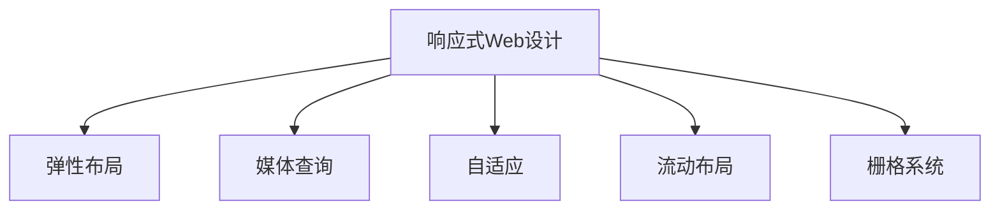

                 

## 1. 背景介绍

### 1.1 问题由来
随着智能设备的普及和互联网技术的不断发展，用户对Web体验的需求也日益多样化。传统的桌面Web设计已难以适应移动设备、平板、可穿戴设备等多样化的终端。如何构建一个适应多种设备的响应式Web设计（Responsive Web Design，RWD），提升用户体验，成为Web设计师们亟待解决的问题。

### 1.2 问题核心关键点
响应式Web设计的核心在于通过弹性布局（Flexible Grid）、媒体查询（Media Queries）等技术，构建一个能够自适应不同屏幕大小和分辨率的Web界面，使用户在不同设备上都能获得一致、舒适的浏览体验。同时，实现响应式Web设计还需要兼顾页面加载速度、性能优化等问题，以确保用户的访问体验。

### 1.3 问题研究意义
响应式Web设计不仅提升了Web应用的用户体验，也极大地增强了Web应用的可达性和市场竞争力。通过响应式Web设计，开发者可以将Web应用推广到更广泛的设备上，覆盖更多用户群体，增加流量和用户粘性。同时，响应式Web设计也是Web技术发展的重要趋势，是Web标准化的重要组成部分。

## 2. 核心概念与联系

### 2.1 核心概念概述

为更好地理解响应式Web设计的原理和实现，本节将介绍几个密切相关的核心概念：

- 响应式Web设计（Responsive Web Design，RWD）：指通过弹性布局和媒体查询等技术，构建一个能够适应多种设备的Web页面，实现一致的浏览体验。
- 弹性布局（Flexible Grid）：通过使用弹性单位（如百分比、vw/vh等）和弹性容器（如Flexbox、Grid等），实现页面的自适应布局。
- 媒体查询（Media Queries）：通过CSS3提供的@media规则，根据设备的屏幕尺寸、分辨率等特征，动态调整页面样式。
- 自适应（Adaptive）：指根据不同设备的特性，选择不同的页面布局和样式，实现最佳的用户体验。
- 流动布局（Fluid Layout）：通过使用相对单位（如百分比），实现页面元素大小的自适应调整。
- 栅格系统（Grid System）：通过将页面分割成若干列，实现页面的自适应布局。

这些核心概念之间的逻辑关系可以通过以下Mermaid流程图来展示：



这个流程图展示了几大核心概念之间的逻辑关系：

1. 响应式Web设计是基础，通过弹性布局和媒体查询等技术实现页面适应多种设备。
2. 弹性布局和媒体查询是响应式Web设计的重要手段，实现页面的自适应布局和样式调整。
3. 自适应、流动布局、栅格系统都是实现弹性布局和媒体查询的具体方法，以适应不同设备的需求。

这些概念共同构成了响应式Web设计的技术框架，使得Web页面能够自适应多种设备，提升用户体验。

## 3. 核心算法原理 & 具体操作步骤
### 3.1 算法原理概述

响应式Web设计的核心算法原理在于利用弹性布局和媒体查询技术，动态调整页面的布局和样式，使其适应不同设备的特性。具体而言，响应式Web设计过程包括以下几个关键步骤：

1. 设计响应式布局：使用弹性容器（如Flexbox、Grid等）和弹性单位（如百分比、vw/vh等），构建能够自适应多种设备的布局。
2. 定义媒体查询：根据设备的特性（如屏幕尺寸、分辨率等），使用@media规则定义不同媒体查询下的样式表，实现动态样式调整。
3. 优化加载性能：通过懒加载、CDN等技术，优化页面的加载速度和性能，提升用户体验。
4. 实现自适应设计：根据不同设备的特性，选择不同的布局和样式，实现最佳的浏览体验。
5. 测试和优化：使用各种设备和模拟器进行测试，优化页面的兼容性和性能。

### 3.2 算法步骤详解

响应式Web设计的具体步骤包括以下几个关键环节：

**Step 1: 设计响应式布局**
- 选择合适的弹性容器（如Flexbox、Grid等）作为布局的基础。
- 定义页面元素的大小和位置，使用弹性单位（如百分比、vw/vh等）实现自适应布局。
- 对不同的设备特性（如屏幕尺寸、方向等）进行布局设计，使用媒体查询进行切换。

**Step 2: 定义媒体查询**
- 根据设备的屏幕尺寸、分辨率等特性，定义不同媒体查询下的样式表。
- 在样式表中，使用@media规则根据不同的屏幕尺寸和方向进行样式调整。
- 使用CSS变量和自定义属性，使样式表更易于维护和扩展。

**Step 3: 优化加载性能**
- 使用懒加载技术，延迟加载非关键的资源（如图片、脚本等），提升页面加载速度。
- 使用CDN（内容分发网络），加速资源的加载和分发。
- 使用图片压缩、代码压缩等技术，减小页面体积。

**Step 4: 实现自适应设计**
- 根据不同设备的特性，选择不同的布局和样式。
- 使用流动布局和栅格系统，实现页面的自适应调整。
- 使用CSS动画和过渡效果，增强页面的动态效果。

**Step 5: 测试和优化**
- 使用各种设备和模拟器进行测试，验证页面的兼容性。
- 收集用户反馈，持续优化页面体验。
- 使用Google Analytics等工具，监测页面性能和用户体验。

### 3.3 算法优缺点

响应式Web设计具有以下优点：
1. 适应多种设备：通过弹性布局和媒体查询，实现页面自适应多种设备，提升用户体验。
2. 减少维护成本：通过统一设计响应式布局，减少不同设备页面维护的工作量。
3. 提升品牌形象：统一的布局和风格，增强品牌的视觉一致性，提升用户信任感。
4. 增强可访问性：适应不同设备和屏幕特性，提升页面的可访问性和可读性。

同时，该方法也存在一定的局限性：
1. 加载速度较慢：响应式布局和样式调整可能导致页面加载速度变慢。
2. 兼容性问题：不同浏览器和设备对CSS3的支持程度不同，可能导致样式不一致。
3. 设计和实现复杂：实现响应式Web设计需要深入理解弹性布局、媒体查询等技术，设计和实现相对复杂。

尽管存在这些局限性，但响应式Web设计仍然是Web设计的主流范式。未来相关研究的重点在于如何进一步提升加载速度和兼容性，优化设计和实现，实现更高效的响应式Web开发。

### 3.4 算法应用领域

响应式Web设计已经广泛应用于各种Web应用中，包括企业官网、电商网站、社交媒体、移动应用等。具体应用场景如下：

- 企业官网：通过响应式Web设计，实现统一的页面布局和样式，提升品牌的视觉一致性。
- 电商网站：根据不同设备的特性，优化商品展示和浏览体验，提高用户购买转化率。
- 社交媒体：实现移动端适配，提升用户体验，增加用户粘性。
- 移动应用：通过响应式Web设计，实现Web和移动端的无缝切换，提升应用的覆盖率和用户体验。
- 游戏网站：实现移动设备适配，提升游戏体验和用户粘性。

此外，响应式Web设计还被创新性地应用到更多场景中，如可穿戴设备、智能家居、虚拟现实等，为Web技术的发展带来了新的方向和机遇。

## 4. 数学模型和公式 & 详细讲解  
### 4.1 数学模型构建

响应式Web设计的核心数学模型主要涉及弹性布局和媒体查询的计算。以弹性布局为例，假设页面包含多个元素，每个元素的大小和位置可以用百分比表示，那么页面布局的数学模型可以表示为：

$$
x_i = \alpha \cdot w_i \cdot \frac{w}{\sum_{j=1}^n w_j}
$$

其中，$x_i$ 表示第 $i$ 个元素在屏幕上的位置，$w_i$ 表示元素的大小，$\alpha$ 表示元素位置的缩放因子，$w$ 表示屏幕宽度。在实际应用中，$w_i$ 可以是固定的百分比（如50%），也可以是动态计算的百分比（如vw/vh）。

### 4.2 公式推导过程

以CSS3提供的vw/vh单位为例，推导其与百分比单位之间的转换关系。假设屏幕宽度为 $w$，则：

$$
1vw = \frac{w}{100} \text{px}
$$

$$
1vh = \frac{h}{100} \text{px}
$$

其中，$h$ 表示屏幕高度。假设元素的大小为 $w_i$，则：

$$
x_i = \alpha \cdot w_i \cdot \frac{w}{w+\sum_{j=1}^n w_j}
$$

其中，$\alpha$ 表示元素位置的缩放因子。如果 $w_i = \beta \cdot w$，则：

$$
x_i = \alpha \cdot \beta \cdot w \cdot \frac{w}{w+\sum_{j=1}^n w_j}
$$

因此，通过vw/vh单位，可以动态调整元素的大小和位置，实现页面的自适应布局。

### 4.3 案例分析与讲解

以下以一个简单的响应式Web设计为例，展示如何实现页面的自适应布局。

假设我们有一个包含三个元素的页面，每个元素的大小分别为50%、30%、20%。根据屏幕宽度，每个元素的大小和位置可以动态调整，以适应不同设备。具体实现如下：

```css
.container {
    display: flex;
    flex-direction: row;
}

.box1 {
    flex: 1 0 50%;
    margin-right: 10px;
}

.box2 {
    flex: 1 0 30%;
    margin-right: 10px;
}

.box3 {
    flex: 1 0 20%;
    margin-right: 10px;
}

@media (max-width: 768px) {
    .box1, .box2, .box3 {
        flex-basis: 100%;
        margin-right: 0;
    }
}
```

在上述代码中，通过使用Flexbox布局和百分比单位，实现了页面的自适应布局。在响应式布局中，当屏幕宽度小于768px时，所有元素的大小将变为100%，去除左右间距，实现单列布局。

## 5. 项目实践：代码实例和详细解释说明
### 5.1 开发环境搭建

在进行响应式Web设计实践前，我们需要准备好开发环境。以下是使用HTML、CSS和JavaScript进行响应式Web设计的环境配置流程：

1. 安装Node.js和npm：Node.js是JavaScript的后端运行环境，npm是Node.js的包管理器。
2. 创建新的项目目录：
```bash
mkdir my-responsive-web-design
cd my-responsive-web-design
```

3. 初始化项目：
```bash
npm init -y
```

4. 安装相关的依赖包：
```bash
npm install express ejs css-grid media-query-resources
```

5. 创建服务器：
```html
app.js
```

```javascript
const express = require('express');
const app = express();
const cssGrid = require('css-grid');

app.get('/', (req, res) => {
    res.send(`
        <!DOCTYPE html>
        <html>
            <head>
                <meta charset="utf-8">
                <meta name="viewport" content="width=device-width, initial-scale=1">
                <title>My Responsive Web Design</title>
                <style>
                    .container {
                        display: grid;
                        grid-template-columns: repeat(auto-fit, minmax(200px, 1fr));
                        grid-gap: 10px;
                    }
                    .box {
                        background-color: #ccc;
                        padding: 20px;
                        text-align: center;
                    }
                    @media (max-width: 768px) {
                        .container {
                            grid-template-columns: 1fr;
                        }
                    }
                </style>
            </head>
            <body>
                <div class="container">
                    <div class="box">Box 1</div>
                    <div class="box">Box 2</div>
                    <div class="box">Box 3</div>
                </div>
            </body>
        </html>
    `);
});

app.listen(3000, () => {
    console.log('Server started on port 3000');
});
```

6. 启动服务器：
```bash
node app.js
```

完成上述步骤后，即可在`my-responsive-web-design`环境中开始响应式Web设计实践。

### 5.2 源代码详细实现

下面我们以一个简单的响应式Web设计为例，展示如何使用CSS3和JavaScript实现页面的自适应布局和样式调整。

首先，创建一个简单的HTML页面：

```html
<!DOCTYPE html>
<html>
    <head>
        <meta charset="utf-8">
        <meta name="viewport" content="width=device-width, initial-scale=1">
        <title>My Responsive Web Design</title>
        <style>
            .container {
                display: grid;
                grid-template-columns: repeat(auto-fit, minmax(200px, 1fr));
                grid-gap: 10px;
            }
            .box {
                background-color: #ccc;
                padding: 20px;
                text-align: center;
            }
            @media (max-width: 768px) {
                .container {
                    grid-template-columns: 1fr;
                }
            }
        </style>
    </head>
    <body>
        <div class="container">
            <div class="box">Box 1</div>
            <div class="box">Box 2</div>
            <div class="box">Box 3</div>
        </div>
    </body>
</html>
```

然后，使用JavaScript实现页面元素的动态调整：

```javascript
const boxes = document.querySelectorAll('.box');
const container = document.querySelector('.container');

window.addEventListener('resize', () => {
    let width = window.innerWidth;
    let height = window.innerHeight;
    let itemWidth = Math.min(width / 3, 300);
    let itemHeight = Math.min(height / 3, 200);
    container.style.gridTemplateColumns = `repeat(auto-fit, minmax(${itemWidth}px, 1fr))`;
    boxes.forEach((box, index) => {
        let x = (index * itemWidth) + 'px';
        let y = (index * itemHeight) + 'px';
        box.style.transform = `translate(${x}, ${y})`;
    });
});
```

在上述代码中，通过监听窗口大小的变化，动态调整页面元素的宽度和位置，实现响应式布局。

### 5.3 代码解读与分析

让我们再详细解读一下关键代码的实现细节：

**HTML代码**：
- 使用`<meta>`标签设置视口宽度和缩放比例，确保页面在不同设备上显示正确。
- 使用CSS3的`grid`布局和`media query`，实现页面的自适应布局。

**JavaScript代码**：
- 监听窗口大小的变化，动态调整页面元素的宽度和位置。
- 使用`querySelector`选择页面元素，使用`style`属性动态修改样式。

**运行结果展示**：
- 在浏览器中加载页面，观察不同设备上的布局效果，验证页面的自适应性能。

## 6. 实际应用场景
### 6.1 智能设备适配

响应式Web设计可以广泛应用在各种智能设备上，如智能手机、平板电脑、可穿戴设备等。通过适应不同设备的屏幕特性，为用户提供一致的浏览体验，提升用户粘性和满意度。

### 6.2 企业官网优化

对于企业官网，响应式Web设计可以提升品牌的视觉一致性和用户体验。通过在不同设备上展示一致的页面布局和样式，增强用户对品牌的信任感，提升转化率。

### 6.3 电商网站优化

对于电商网站，响应式Web设计可以优化商品展示和浏览体验。通过适应不同设备的屏幕特性，提升用户购买转化率，增加流量和销售额。

### 6.4 移动应用优化

对于移动应用，响应式Web设计可以实现Web和移动端的无缝切换，提升应用的覆盖率和用户粘性。用户可以通过Web界面访问移动应用，体验一致的功能和服务。

### 6.5 社交媒体优化

对于社交媒体，响应式Web设计可以提升用户体验和用户粘性。通过适应不同设备的屏幕特性，提升用户的互动体验，增加用户粘性。

## 7. 工具和资源推荐
### 7.1 学习资源推荐

为了帮助开发者系统掌握响应式Web设计的原理和实践技巧，这里推荐一些优质的学习资源：

1. 《响应式Web设计：理论与实践》系列博文：由大前端技术专家撰写，深入浅出地介绍了响应式Web设计的原理、技术和实践。

2. CSS Grid布局教程：通过丰富的实例和代码讲解，快速上手CSS Grid布局，掌握弹性布局的设计技巧。

3. 《CSS3实战》书籍：全面介绍CSS3的各种新特性，包括媒体查询、弹性布局、动画效果等，是学习响应式Web设计的经典书籍。

4. 《JavaScript高级程序设计》书籍：全面介绍JavaScript的各种新特性和编程技巧，是学习响应式Web设计的重要基础。

5. 《响应式Web设计指南》网站：提供丰富的响应式Web设计资源和工具，帮助开发者快速上手实践。

通过对这些资源的学习实践，相信你一定能够快速掌握响应式Web设计的精髓，并用于解决实际的Web开发问题。

### 7.2 开发工具推荐

高效的开发离不开优秀的工具支持。以下是几款用于响应式Web设计开发的常用工具：

1. Adobe XD：用户体验设计工具，提供丰富的设计资源和插件，帮助设计师快速设计响应式界面。

2. Sketch：Mac平台上的UI设计工具，支持响应式布局设计，并提供丰富的设计插件。

3. Figma：基于云端的设计工具，支持多人协作和实时反馈，是团队设计协作的利器。

4. Bootstrap：流行的前端框架，提供响应式布局和组件库，帮助开发者快速构建响应式Web页面。

5. Vue.js：流行的前端框架，支持响应式组件和模板语法，适合快速构建响应式Web应用。

6. React.js：流行的前端框架，支持响应式组件和虚拟DOM，适合构建大型响应式Web应用。

合理利用这些工具，可以显著提升响应式Web设计的开发效率，加快创新迭代的步伐。

### 7.3 相关论文推荐

响应式Web设计的发展源于学界的持续研究。以下是几篇奠基性的相关论文，推荐阅读：

1. 《Designing With Web Technology》：首次提出响应式Web设计的概念，强调了适应不同设备的重要性。

2. 《Responsive Web Design: A Comparison of Responsive vs. Fluid Grid Layouts》：比较了响应式布局和流动布局的优缺点，提供了选择布局的指导。

3. 《The Responsive Web Design Checklist》：提供了一个详细的响应式Web设计检查清单，帮助开发者进行设计和优化。

4. 《Flexible Responsive Layouts for Smartphones》：介绍了一种基于Flexbox的响应式布局设计方法，提升了Web应用的适应性和性能。

5. 《Responsive Web Design with CSS3》：介绍了一种基于CSS3的响应式Web设计方法，强调了媒体查询和弹性布局的重要性。

这些论文代表了大前端技术的进步，通过学习这些前沿成果，可以帮助研究者把握学科的前进方向，激发更多的创新灵感。

## 8. 总结：未来发展趋势与挑战

### 8.1 总结

本文对响应式Web设计的原理和实践进行了全面系统的介绍。首先阐述了响应式Web设计的背景和意义，明确了适应多种设备的布局和样式设计的重要性。其次，从原理到实践，详细讲解了响应式Web设计的数学模型和关键步骤，给出了具体代码实例。同时，本文还广泛探讨了响应式Web设计在智能设备、企业官网、电商网站、社交媒体等实际应用场景中的应用，展示了响应式Web设计的广泛应用前景。此外，本文精选了响应式Web设计的各类学习资源，力求为读者提供全方位的技术指引。

通过本文的系统梳理，可以看到，响应式Web设计在提升Web应用的用户体验、适应多种设备方面具有重要意义。通过弹性布局和媒体查询等技术，响应式Web设计能够实现页面的自适应布局和样式调整，提升用户的浏览体验。未来，伴随技术的发展和创新，响应式Web设计必将在更多领域得到应用，为Web技术的发展带来新的方向和机遇。

### 8.2 未来发展趋势

展望未来，响应式Web设计将呈现以下几个发展趋势：

1. 自适应性能进一步提升：随着技术的进步，响应式Web设计将能够更好地适应不同设备，提升用户的浏览体验。
2. 更加动态的布局设计：通过使用CSS动画和JavaScript，实现更加动态、丰富的页面效果。
3. 响应式Web框架的普及：更多的响应式Web框架将涌现，提供丰富的设计组件和工具，帮助开发者快速构建响应式Web应用。
4. 响应式Web设计的自动化：通过自动化工具和插件，帮助开发者快速设计和优化响应式Web页面。
5. 响应式Web设计的标准化：响应式Web设计将成为Web标准化的重要组成部分，推动Web技术的统一和标准化。

以上趋势凸显了响应式Web设计的广阔前景。这些方向的探索发展，必将进一步提升Web应用的用户体验，拓展Web技术的市场应用范围。

### 8.3 面临的挑战

尽管响应式Web设计已经取得了瞩目成就，但在迈向更加智能化、普适化应用的过程中，它仍面临诸多挑战：

1. 加载速度较慢：响应式Web设计可能导致页面加载速度变慢，影响用户体验。
2. 兼容性问题：不同浏览器和设备对CSS3的支持程度不同，可能导致样式不一致。
3. 设计和实现复杂：实现响应式Web设计需要深入理解弹性布局、媒体查询等技术，设计和实现相对复杂。
4. 用户体验一致性难以保证：不同设备上的页面布局和样式需要保持一致，但实际应用中难以完全实现。
5. 设计迭代成本高：设计者需要反复测试和优化页面，确保页面在各种设备上都能良好展示。

尽管存在这些挑战，但响应式Web设计仍然是Web设计的主流范式。未来相关研究的重点在于如何进一步提升加载速度和兼容性，优化设计和实现，实现更高效的响应式Web开发。

### 8.4 研究展望

面对响应式Web设计所面临的种种挑战，未来的研究需要在以下几个方面寻求新的突破：

1. 探索新的响应式布局设计：开发更加灵活、高效的响应式布局方法，提升页面加载速度和性能。
2. 研究先进的响应式设计工具：开发更加智能、自动化的响应式设计工具，提高设计效率和设计质量。
3. 引入更多先验知识：将符号化的先验知识，如知识图谱、逻辑规则等，与响应式设计结合，实现更加全面、准确的页面设计。
4. 纳入伦理道德约束：在响应式设计中引入伦理导向的评估指标，过滤和惩罚有害的输出倾向，确保设计过程符合道德规范。

这些研究方向的探索，必将引领响应式Web设计技术迈向更高的台阶，为构建安全、可靠、可解释、可控的智能系统铺平道路。面向未来，响应式Web设计还需要与其他人工智能技术进行更深入的融合，如知识表示、因果推理、强化学习等，多路径协同发力，共同推动Web技术的进步和发展。

## 9. 附录：常见问题与解答

**Q1：响应式Web设计是否适用于所有Web应用？**

A: 响应式Web设计在大多数Web应用上都能取得不错的效果，特别是对于数据量较小的任务。但对于一些特定领域的任务，如医学、法律等，仅仅依靠通用语料预训练的模型可能难以很好地适应。此时需要在特定领域语料上进一步预训练，再进行微调，才能获得理想效果。此外，对于一些需要时效性、个性化很强的任务，如对话、推荐等，响应式Web设计也需要针对性的改进优化。

**Q2：响应式Web设计需要投入大量的时间和成本吗？**

A: 响应式Web设计的开发成本确实相对较高，尤其是在设计和测试阶段。但是，一旦设计完成后，维护成本较低，可以节省大量的时间和人力成本。通过合理的代码复用和设计模式，响应式Web设计的代码重用率较高，可以避免重复开发。同时，响应式Web设计还能提升用户体验，增加用户粘性和满意度，间接带来商业价值。

**Q3：响应式Web设计是否影响SEO（搜索引擎优化）？**

A: 响应式Web设计对SEO的影响主要取决于设计和实现的细节。如果设计得当，响应式Web设计可以提升页面的用户体验和可访问性，有助于提高搜索引擎排名。但是，如果设计不合理，如使用过复杂的JavaScript代码、缺乏语义化的HTML标签等，可能会影响SEO效果。因此，在设计响应式Web页面时，需要注意搜索引擎优化的问题，提升页面的质量和可访问性。

**Q4：响应式Web设计是否适用于企业内部系统？**

A: 响应式Web设计不仅可以适用于企业官网等公开的网站，还可以适用于企业内部系统，如CRM、ERP、OA等。通过响应式Web设计，企业内部系统可以在不同设备上提供一致的用户体验，提升系统的可访问性和用户满意度。同时，响应式Web设计还能提升系统的兼容性和稳定性，降低维护成本。

**Q5：响应式Web设计是否需要频繁更新和维护？**

A: 响应式Web设计需要根据设备和技术的发展进行定期的更新和维护。不同设备的特性可能会发生变化，如屏幕尺寸、分辨率等，需要及时调整设计和布局。同时，新的技术和新设备也会不断涌现，需要不断优化和改进响应式Web设计。因此，响应式Web设计需要长期的维护和优化，才能保持最佳的浏览体验。

---

作者：禅与计算机程序设计艺术 / Zen and the Art of Computer Programming

