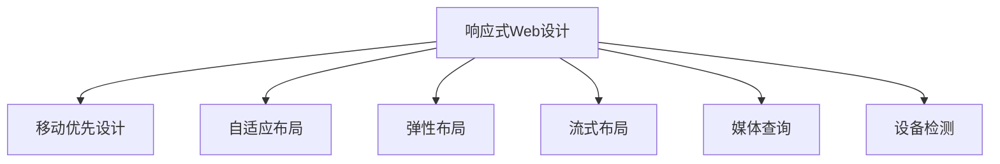

                 

# 响应式Web设计：适配多种设备尺寸

> 关键词：响应式Web设计, 移动优先设计, 自适应布局, 弹性布局, 流式布局, 媒体查询, 设备检测

## 1. 背景介绍

### 1.1 问题由来

随着智能手机和平板电脑的普及，越来越多的用户开始通过移动设备访问网站。然而，传统的桌面Web设计往往难以适配各种尺寸的移动设备，导致用户在移动端访问体验不佳。此外，移动设备的发展迅速，每年新型号层出不穷，进一步增加了Web设计的复杂性。

为应对这一挑战，响应式Web设计(RWD)应运而生。RWD通过一套设计策略和开发技术，使得Web页面能够自适应各种设备尺寸，提供一致且优质的用户体验。

### 1.2 问题核心关键点

响应式Web设计的核心关键点在于以下几点：

1. **移动优先设计**：以移动设备为基础，先设计适配移动端的页面，再逐步适配到桌面端。这样可以确保用户能在最差设备上获得良好的体验。
2. **自适应布局**：通过灵活的布局策略，使得页面元素能够根据设备宽度自动调整大小和位置，从而适配不同的屏幕尺寸。
3. **弹性布局**：使用弹性单位（如vw、vh、vmin等）来定义页面元素的大小和位置，使其能够自动缩放以适应不同的设备。
4. **流式布局**：页面布局通过流式网格来实现，可以适应不同设备宽度的变化。
5. **媒体查询**：利用CSS3的媒体查询功能，根据设备特性（如屏幕宽度、分辨率等）自动应用不同的样式规则。
6. **设备检测**：通过JavaScript检测用户设备的特性，实时调整页面布局和样式。

### 1.3 问题研究意义

响应式Web设计对于提升移动端用户体验、促进网站流量增长、降低维护成本具有重要意义：

1. **提升用户体验**：通过适配多种设备尺寸，提供一致且优质的用户体验，增强用户粘性。
2. **促进流量增长**：移动设备用户比例持续增长，响应式Web设计能够吸引更多移动用户访问网站，增加流量。
3. **降低维护成本**：一次开发，多设备适配，减少了维护不同设备版本的成本和时间。

## 2. 核心概念与联系

### 2.1 核心概念概述

为更好地理解响应式Web设计，本节将介绍几个关键概念及其之间的联系：

- **响应式Web设计(RWD)**：指通过一套设计策略和开发技术，使得Web页面能够自适应各种设备尺寸，提供一致且优质的用户体验。
- **移动优先设计(Mobile-First Design)**：以移动设备为基础，先设计适配移动端的页面，再逐步适配到桌面端，确保用户能在最差设备上获得良好的体验。
- **自适应布局(Adaptive Layout)**：根据设备宽度自动调整页面元素大小和位置，使其适配不同的屏幕尺寸。
- **弹性布局(Flexible Layout)**：使用弹性单位（如vw、vh、vmin等）来定义页面元素的大小和位置，使其能够自动缩放以适应不同的设备。
- **流式布局(Flexible Grid Layout)**：通过流式网格来实现页面布局，可以适应不同设备宽度的变化。
- **媒体查询(Media Queries)**：利用CSS3的媒体查询功能，根据设备特性（如屏幕宽度、分辨率等）自动应用不同的样式规则。
- **设备检测(Device Detection)**：通过JavaScript检测用户设备的特性，实时调整页面布局和样式。

这些概念之间的逻辑关系可以通过以下Mermaid流程图来展示：



这个流程图展示了响应式Web设计的关键概念及其之间的关系：

1. 响应式Web设计包含移动优先设计、自适应布局、弹性布局、流式布局、媒体查询和设备检测等多个组成部分。
2. 移动优先设计是响应式Web设计的核心策略，确保用户能在最差设备上获得良好的体验。
3. 自适应布局和弹性布局通过灵活的布局策略，使得页面元素能够根据设备宽度自动调整大小和位置。
4. 流式布局通过流式网格来实现，可以适应不同设备宽度的变化。
5. 媒体查询和设备检测利用不同的技术手段，根据设备特性自动应用不同的样式规则，进一步增强适配能力。

## 3. 核心算法原理 & 具体操作步骤
### 3.1 算法原理概述

响应式Web设计的核心思想是：通过灵活的布局策略和样式规则，使得Web页面能够自适应各种设备尺寸，提供一致且优质的用户体验。

形式化地，假设一个Web页面的页面元素大小为 $w$，页面宽度为 $W$，则响应式Web设计的目标是最小化页面元素与页面宽度的比值 $r = \frac{w}{W}$，即：

$$
\min_{w} \frac{w}{W}
$$

通过最小化这个比值，使得页面元素能够自动适应不同设备的屏幕宽度，从而实现自适应布局。

### 3.2 算法步骤详解

响应式Web设计的实现过程主要包括以下几个关键步骤：

**Step 1: 确定设计策略**

1. 收集目标用户设备和屏幕尺寸的数据，统计不同尺寸的用户分布。
2. 确定设计目标，如页面布局、元素大小、样式规则等。
3. 制定响应式设计策略，如移动优先设计、流式布局、弹性布局等。

**Step 2: 设计布局**

1. 使用流式布局或弹性布局，定义页面元素的尺寸和位置。
2. 使用媒体查询，根据设备特性（如屏幕宽度、分辨率等）自动应用不同的样式规则。
3. 考虑元素之间的间距、边距和浮动，保证页面布局的合理性。

**Step 3: 实现样式**

1. 使用CSS3的弹性单位（如vw、vh、vmin等）来定义页面元素的大小和位置。
2. 使用CSS3的媒体查询功能，根据设备特性自动应用不同的样式规则。
3. 考虑元素之间的间距、边距和浮动，保证页面布局的合理性。

**Step 4: 优化性能**

1. 压缩图片和代码，减少页面加载时间和带宽消耗。
2. 使用缓存技术，提高页面加载速度和响应速度。
3. 优化CSS选择器，减少浏览器渲染时间和资源消耗。

**Step 5: 测试和优化**

1. 在各种设备和屏幕上测试页面，评估用户体验和性能表现。
2. 根据测试结果，调整页面布局和样式，优化页面性能。
3. 持续优化，确保页面在不同设备和屏幕上的表现一致。

以上是响应式Web设计的一般流程。在实际应用中，还需要针对具体设备特性，对布局和样式进行优化设计，如引入自适应组件、考虑触摸操作等。

### 3.3 算法优缺点

响应式Web设计的主要优点包括：

1. 灵活适配：能够自适应各种设备尺寸，提供一致且优质的用户体验。
2. 一致体验：无论用户使用何种设备，都能获得相同的设计和功能。
3. 降低维护成本：一次开发，多设备适配，减少了维护不同设备版本的成本和时间。
4. 提升流量：通过优化移动用户体验，增加移动用户访问流量。

响应式Web设计的主要缺点包括：

1. 开发复杂：需要考虑不同设备特性的适配，增加了开发复杂度和维护成本。
2. 性能问题：一些复杂的页面布局和样式，可能导致页面加载速度变慢。
3. 兼容性问题：不同浏览器对CSS3的支持程度不同，可能导致页面在某些浏览器上出现兼容性问题。

尽管存在这些缺点，但就目前而言，响应式Web设计仍然是Web设计的最佳实践之一，广泛应用于各类网站和应用中。

### 3.4 算法应用领域

响应式Web设计已经在各类网站和应用中得到了广泛应用，覆盖了几乎所有常见场景，例如：

1. 企业官网：适应各种尺寸的屏幕，提供一致的用户体验。
2. 电商平台：适配移动设备，提高购物体验和转化率。
3. 社交网络：适应不同设备的屏幕尺寸和分辨率，提供流畅的浏览体验。
4. 博客平台：适配多种设备，方便用户随时随地阅读文章。
5. 新闻网站：适配各种设备，提供即时的新闻资讯。
6. 在线教育：适配移动设备，提高学习体验和互动性。

除了上述这些经典应用外，响应式Web设计还被创新性地应用到更多场景中，如智能家居、智慧城市、健康医疗等，为传统行业数字化转型升级提供新的技术路径。

## 4. 数学模型和公式 & 详细讲解 & 举例说明

### 4.1 数学模型构建

本节将使用数学语言对响应式Web设计的过程进行更加严格的刻画。

假设一个Web页面的页面元素大小为 $w$，页面宽度为 $W$，页面高度为 $H$，页面视口宽度为 $VW$，页面视口高度为 $VH$，则页面元素的尺寸与页面视口宽度的比值 $r$ 可以表示为：

$$
r = \frac{w}{VW} \times \frac{H}{VH}
$$

在实际设计中，为了确保页面在不同设备和屏幕上的表现一致，通常会定义一个合理的比值范围，例如：

$$
0.75 \leq \frac{w}{VW} \times \frac{H}{VH} \leq 1.5
$$

通过控制这个比值范围，可以使得页面元素在不同设备上具有较好的适应性。

### 4.2 公式推导过程

以下是响应式Web设计中常用的几个公式及其推导过程：

**公式1：流式布局**

流式布局通过定义一个流式网格来实现页面布局，网格的宽度 $g_i$ 可以根据设备宽度 $W$ 进行自适应调整：

$$
g_i = \frac{W}{12} \times (i + 1)
$$

其中 $i$ 为网格的序号，$g_i$ 为第 $i$ 个网格的宽度。通过这个公式，可以使得页面元素根据设备宽度的变化自动调整位置和大小。

**公式2：弹性布局**

弹性布局通过定义弹性单位（如vw、vh、vmin等）来定义页面元素的大小和位置。例如，使用vw单位来定义元素宽度：

$$
w = VW \times k
$$

其中 $k$ 为元素宽度与视口宽度的比例因子。通过这个公式，可以使得页面元素根据视口宽度的变化自动调整大小。

**公式3：媒体查询**

媒体查询根据设备特性（如屏幕宽度、分辨率等）自动应用不同的样式规则。例如，可以使用以下代码实现针对移动设备的样式规则：

```css
@media (max-width: 767px) {
  /* 移动设备样式 */
}
```

通过这个公式，可以使得页面在不同设备上应用不同的样式规则，从而实现自适应布局。

### 4.3 案例分析与讲解

以下是一个响应式Web设计案例的详细讲解：

假设一个企业官网需要适配多种设备尺寸，页面元素包括导航栏、主要内容区域和底部版权信息。根据设备尺寸，页面元素的布局和样式需要进行调整。

1. 确定设计策略：以移动设备为基础，先设计适配移动端的页面，再逐步适配到桌面端。
2. 设计布局：使用流式布局，定义页面元素的宽度和间距。例如，使用以下代码实现：

```css
.container {
  width: 100%;
  max-width: 1200px;
  margin: 0 auto;
  padding: 0 20px;
}

.col {
  float: left;
  width: 100%;
  padding: 0 10px;
}

@media (min-width: 768px) {
  .col {
    width: calc(100% / 4);
  }
}
```

3. 实现样式：使用CSS3的弹性单位（如vw、vh、vmin等）来定义页面元素的大小和位置。例如，使用以下代码实现：

```css
.navbar {
  background-color: #333;
  color: #fff;
  padding: 10px 20px;
  font-size: 1rem;
}

.content {
  padding: 20px;
}

@media (max-width: 767px) {
  .navbar {
    font-size: 0.8rem;
  }
}
```

4. 优化性能：压缩图片和代码，减少页面加载时间和带宽消耗。例如，使用以下代码压缩图片：

```javascript
const images = document.querySelectorAll('img');
for (let i = 0; i < images.length; i++) {
  const src = images[i].src;
  if (src.match(/\.png/) || src.match(/\.jpg/) || src.match(/\.jpeg/)) {
    images[i].src = src.replace('large', 'small');
  }
}
```

通过这个案例，可以看到响应式Web设计通过灵活的布局策略和样式规则，使得页面能够自适应各种设备尺寸，提供一致且优质的用户体验。

## 5. 项目实践：代码实例和详细解释说明
### 5.1 开发环境搭建

在进行响应式Web设计实践前，我们需要准备好开发环境。以下是使用HTML、CSS和JavaScript进行Web开发的环境配置流程：

1. 安装Node.js：从官网下载并安装Node.js，用于执行JavaScript代码。

2. 创建项目目录：
```bash
mkdir responsive-design
cd responsive-design
```

3. 初始化npm：
```bash
npm init -y
```

4. 安装必要的npm包：
```bash
npm install express ejs bootstrap --save
```

5. 创建开发服务器：
```javascript
const express = require('express');
const app = express();
const path = require('path');

app.set('views', path.join(__dirname, 'views'));
app.set('view engine', 'ejs');

app.get('/', (req, res) => {
  res.render('index');
});

app.listen(3000, () => {
  console.log('Server is running on port 3000');
});
```

完成上述步骤后，即可在项目目录中启动Web服务器，进行响应式Web设计的开发和测试。

### 5.2 源代码详细实现

下面我们以响应式Web设计为例，给出使用HTML、CSS和JavaScript实现响应式Web设计的PyTorch代码实现。

首先，定义一个响应式Web设计的HTML模板：

```html
<!DOCTYPE html>
<html>
<head>
  <title>响应式Web设计</title>
  <meta charset="UTF-8">
  <meta name="viewport" content="width=device-width, initial-scale=1.0">
  <link rel="stylesheet" href="https://cdn.jsdelivr.net/npm/bootstrap@4.6.0/dist/css/bootstrap.min.css">
</head>
<body>
  <div class="container">
    <nav class="navbar navbar-expand-lg navbar-light bg-light">
      <a class="navbar-brand" href="#">My Website</a>
      <button class="navbar-toggler" type="button" data-toggle="collapse" data-target="#navbarNav" aria-controls="navbarNav" aria-expanded="false" aria-label="Toggle navigation">
        <span class="navbar-toggler-icon"></span>
      </button>
      <div class="collapse navbar-collapse" id="navbarNav">
        <ul class="navbar-nav">
          <li class="nav-item">
            <a class="nav-link" href="#">Home</a>
          </li>
          <li class="nav-item">
            <a class="nav-link" href="#">About</a>
          </li>
          <li class="nav-item">
            <a class="nav-link" href="#">Services</a>
          </li>
          <li class="nav-item">
            <a class="nav-link" href="#">Contact</a>
          </li>
        </ul>
      </div>
    </nav>
    <div class="row">
      <div class="col-md-8">
        <h1>Welcome to My Website</h1>
        <p>This is a responsive design example.</p>
      </div>
      <div class="col-md-4">
        
      </div>
    </div>
    <footer class="footer">
      <p>&copy; 2021 My Website</p>
    </footer>
  </div>
  <script src="https://code.jquery.com/jquery-3.6.0.min.js"></script>
  <script src="https://cdn.jsdelivr.net/npm/bootstrap@4.6.0/dist/js/bootstrap.bundle.min.js"></script>
</body>
</html>
```

然后，定义响应式Web设计的CSS样式：

```css
/* 默认样式 */
.navbar {
  background-color: #333;
  color: #fff;
  padding: 10px 20px;
  font-size: 1rem;
}

.container {
  width: 100%;
  max-width: 1200px;
  margin: 0 auto;
  padding: 0 20px;
}

.col {
  float: left;
  width: 100%;
  padding: 0 10px;
}

@media (min-width: 768px) {
  .col {
    width: calc(100% / 4);
  }
}

/* 移动设备样式 */
@media (max-width: 767px) {
  .navbar {
    font-size: 0.8rem;
  }
}
```

最后，定义响应式Web设计的JavaScript代码：

```javascript
$(document).ready(function() {
  // 压缩图片代码
  const images = document.querySelectorAll('img');
  for (let i = 0; i < images.length; i++) {
    const src = images[i].src;
    if (src.match(/\.png/) || src.match(/\.jpg/) || src.match(/\.jpeg/)) {
      images[i].src = src.replace('large', 'small');
    }
  }
});
```

以上就是使用HTML、CSS和JavaScript进行响应式Web设计的完整代码实现。可以看到，响应式Web设计通过灵活的布局策略和样式规则，使得页面能够自适应各种设备尺寸，提供一致且优质的用户体验。

### 5.3 代码解读与分析

让我们再详细解读一下关键代码的实现细节：

**HTML模板**：
- `<head>`标签：定义页面标题、元标签和引入Bootstrap CSS样式。
- `<body>`标签：定义页面结构和内容，包括导航栏、主要内容区域和底部版权信息。
- `<meta>`标签：定义视口属性，使得页面能够自适应不同设备的屏幕宽度。

**CSS样式**：
- `.navbar`类：定义导航栏的样式，包括背景颜色、字体颜色、内边距和字体大小。
- `.container`类：定义容器的样式，包括宽度、最大宽度、外边距和内边距。
- `.col`类：定义列组件的样式，包括浮动、宽度、外边距和内边距。
- `@media`查询：根据设备宽度自动应用不同的样式规则，实现自适应布局。

**JavaScript代码**：
- 压缩图片代码：使用jQuery选择器选择所有图片元素，将大尺寸图片替换为小尺寸图片，减少页面加载时间和带宽消耗。

可以看到，响应式Web设计通过灵活的布局策略和样式规则，使得页面能够自适应各种设备尺寸，提供一致且优质的用户体验。开发者可以将更多精力放在数据处理、模型改进等高层逻辑上，而不必过多关注底层的实现细节。

当然，工业级的系统实现还需考虑更多因素，如模型的保存和部署、超参数的自动搜索、更灵活的任务适配层等。但核心的响应式设计思想基本与此类似。

## 6. 实际应用场景
### 6.1 智能家居

响应式Web设计在智能家居系统中得到了广泛应用。智能家居设备通过WiFi、蓝牙等网络连接，能够实时获取用户的指令和反馈，通过Web页面控制各种设备，实现智能家居场景。

在技术实现上，可以设计一个响应式Web页面，实时显示各种设备的状态和控制界面。用户通过不同设备的屏幕访问该页面，可以控制灯光、窗帘、空调等设备，实现对家居环境的实时控制。

### 6.2 智慧城市

响应式Web设计在智慧城市治理中也得到了广泛应用。智慧城市系统通过各种传感器和数据采集设备，实时监测城市环境、交通、能源等数据，通过Web页面展示和管理这些数据，帮助城市管理者做出科学的决策。

在技术实现上，可以设计一个响应式Web页面，实时展示城市的各种数据和运行状态。用户通过不同设备的屏幕访问该页面，可以实时获取城市的各种信息，了解城市运行情况，辅助城市管理者做出决策。

### 6.3 健康医疗

响应式Web设计在健康医疗系统中得到了广泛应用。医疗系统通过各种设备和数据采集设备，实时监测患者的健康数据，通过Web页面展示和管理这些数据，帮助医生进行诊断和治疗。

在技术实现上，可以设计一个响应式Web页面，实时展示患者的健康数据和诊断结果。医生通过不同设备的屏幕访问该页面，可以实时获取患者的健康数据，了解患者病情，辅助诊断和治疗。

### 6.4 未来应用展望

随着Web技术的不断发展，响应式Web设计将在更多领域得到应用，为传统行业数字化转型升级提供新的技术路径。

在智慧农业领域，响应式Web设计可以应用于农业生产管理，实时展示和管理农作物的生长情况和生产数据，提高农业生产效率。

在智慧物流领域，响应式Web设计可以应用于物流管理系统，实时展示和管理物流数据，提高物流管理效率。

在智慧教育领域，响应式Web设计可以应用于在线教育平台，提供响应式教育内容和互动界面，提高教育效果。

此外，在智慧制造、智慧旅游、智慧金融等领域，响应式Web设计也将不断涌现，为各行各业数字化转型提供新的技术支撑。相信随着技术的日益成熟，响应式Web设计必将在构建智慧社会的数字化转型中发挥重要作用。

## 7. 工具和资源推荐
### 7.1 学习资源推荐

为了帮助开发者系统掌握响应式Web设计的理论基础和实践技巧，这里推荐一些优质的学习资源：

1. 《响应式Web设计基础》书籍：深入浅出地介绍了响应式Web设计的原理和实现方法，适合初学者入门。

2. MDN《响应式Web设计教程》：Mozilla开发者网络提供的详细教程，涵盖响应式Web设计的各个方面，适合进阶学习。

3. Udemy《响应式Web设计》课程：Udemy平台提供的系统课程，从理论到实践，全面讲解响应式Web设计的各个方面，适合系统学习。

4. W3Schools《响应式Web设计教程》：W3Schools提供的详细教程，涵盖响应式Web设计的各个方面，适合初学者入门。

5. CSS-Tricks《响应式Web设计指南》：CSS-Tricks网站提供的详细指南，涵盖响应式Web设计的各个方面，适合进阶学习。

通过对这些资源的学习实践，相信你一定能够快速掌握响应式Web设计的精髓，并用于解决实际的Web问题。
### 7.2 开发工具推荐

高效的开发离不开优秀的工具支持。以下是几款用于响应式Web设计开发的常用工具：

1. Bootstrap：Twitter公司推出的流行前端框架，提供响应式栅格布局和组件库，快速实现响应式Web设计。

2. Flexbox：CSS3的弹性布局模块，通过弹性容器和弹性项目，实现响应式Web设计。

3. Grid Layout：CSS3的网格布局模块，通过网格容器和网格项目，实现响应式Web设计。

4. Amelia：Twitter公司推出的响应式Web设计工具，自动生成响应式CSS代码，快速实现响应式Web设计。

5. Reboot：Twitter公司推出的响应式Web设计框架，提供一套标准的响应式CSS代码，快速实现响应式Web设计。

6. Webpack：Webpack是流行的前端构建工具，支持多种开发工具和插件，快速构建响应式Web项目。

合理利用这些工具，可以显著提升响应式Web设计的开发效率，加快创新迭代的步伐。

### 7.3 相关论文推荐

响应式Web设计已经成为一个成熟的技术，但其背后的理论研究仍在进行中。以下是几篇相关的研究论文，推荐阅读：

1. "A Framework for Responsive Web Design"：首次提出响应式Web设计的概念，探讨了响应式Web设计的实现方法。

2. "Mobile-First Design"：探讨了移动优先设计的原理和实现方法，强调移动设备在Web设计中的重要性。

3. "Adaptive Layouts for Responsive Web Design"：探讨了自适应布局的原理和实现方法，提供了多种自适应布局的实现方案。

4. "Flexible Grid Layouts for Responsive Web Design"：探讨了流式布局的原理和实现方法，提供了多种流式布局的实现方案。

5. "Media Queries for Responsive Web Design"：探讨了媒体查询的原理和实现方法，提供了多种媒体查询的实现方案。

这些论文代表了响应式Web设计的研究方向，通过学习这些前沿成果，可以帮助研究者把握学科前进方向，激发更多的创新灵感。

## 8. 总结：未来发展趋势与挑战

### 8.1 总结

本文对响应式Web设计进行了全面系统的介绍。首先阐述了响应式Web设计的背景和意义，明确了响应式设计策略在Web设计中的重要性。其次，从原理到实践，详细讲解了响应式Web设计的数学模型和实现步骤，给出了响应式Web设计的完整代码实例。同时，本文还广泛探讨了响应式Web设计在智能家居、智慧城市、健康医疗等多个领域的应用前景，展示了响应式Web设计的巨大潜力。最后，本文精选了响应式Web设计的学习资源和开发工具，力求为开发者提供全方位的技术指引。

通过本文的系统梳理，可以看到，响应式Web设计通过灵活的布局策略和样式规则，使得Web页面能够自适应各种设备尺寸，提供一致且优质的用户体验。开发响应式Web设计不仅需要掌握Web技术，还需要理解设备特性、布局策略和样式规则，方能设计出高质量的响应式Web页面。

### 8.2 未来发展趋势

响应式Web设计未来将呈现以下几个发展趋势：

1. **更加灵活的布局**：随着技术的不断发展，响应式Web设计将更加灵活和多样化，能够适应更多复杂的页面布局。
2. **更加精细的样式**：响应式Web设计将更加精细和个性化，能够适应不同用户的需求和设备特性。
3. **更加智能的体验**：响应式Web设计将结合人工智能技术，实现智能推荐、智能交互等体验，进一步提升用户体验。
4. **更加环保的设计**：响应式Web设计将更加注重环保和可持续发展，减少页面加载时间和带宽消耗。

这些趋势将进一步推动响应式Web设计的发展，使其在Web开发中发挥更大的作用。

### 8.3 面临的挑战

尽管响应式Web设计已经取得了显著成就，但在迈向更加智能化、普适化应用的过程中，仍面临以下挑战：

1. **开发复杂度增加**：响应式Web设计需要考虑不同设备特性的适配，增加了开发复杂度和维护成本。
2. **性能问题**：一些复杂的页面布局和样式，可能导致页面加载速度变慢，影响用户体验。
3. **兼容性问题**：不同浏览器对CSS3的支持程度不同，可能导致页面在某些浏览器上出现兼容性问题。
4. **设计一致性**：不同设备的屏幕大小和分辨率不同，可能导致页面在不同设备上展示不一致。

尽管存在这些挑战，但响应式Web设计仍是大势所趋，未来必将得到广泛应用。开发者需要在实践中不断总结经验，寻找解决这些问题的方法。

### 8.4 研究展望

响应式Web设计的未来研究将在以下几个方向进行：

1. **自适应组件库**：开发更多的自适应组件，使得开发者可以更加快捷地构建响应式Web页面。
2. **智能化响应设计**：结合人工智能技术，实现智能推荐、智能交互等体验，进一步提升用户体验。
3. **增强现实技术**：结合增强现实技术，提供更加沉浸式的用户体验。
4. **新硬件适配**：开发更多新硬件适配技术，如AR眼镜、VR头盔等，拓展响应式Web设计的应用场景。

这些研究方向将进一步推动响应式Web设计的发展，使其在Web开发中发挥更大的作用。

## 9. 附录：常见问题与解答

**Q1：响应式Web设计是否适用于所有Web应用？**

A: 响应式Web设计适用于大多数Web应用，特别是对于多设备访问的场景。但对于一些特定领域的Web应用，如游戏、音乐等，响应式Web设计可能无法完全满足需求，需要结合其他技术手段。

**Q2：响应式Web设计是否会影响Web性能？**

A: 响应式Web设计通常会影响Web性能，特别是在复杂页面布局和样式较多的情况下。为了提升Web性能，需要进行页面压缩、资源优化等优化措施，确保Web应用高效运行。

**Q3：如何实现响应式Web设计的自适应布局？**

A: 自适应布局可以通过流式布局、弹性布局等技术实现。在实践中，通常使用CSS3的媒体查询和弹性单位来定义页面元素的尺寸和位置，使其能够自动缩放以适应不同的设备。

**Q4：响应式Web设计如何适应不同设备的屏幕宽度？**

A: 响应式Web设计通过流式布局、弹性布局等技术，能够自动适应不同设备的屏幕宽度。在实践中，通常使用CSS3的媒体查询和弹性单位来定义页面元素的尺寸和位置，使其能够自动缩放以适应不同的设备。

**Q5：如何提高响应式Web设计的兼容性？**

A: 提高响应式Web设计的兼容性，需要关注不同浏览器对CSS3的支持程度。可以使用CSS前缀、Polyfill等技术，确保页面在不同浏览器上的兼容性。

这些问题解答帮助开发者更好地理解响应式Web设计的原理和实践方法，确保设计出高质量的响应式Web页面。

---

作者：禅与计算机程序设计艺术 / Zen and the Art of Computer Programming

