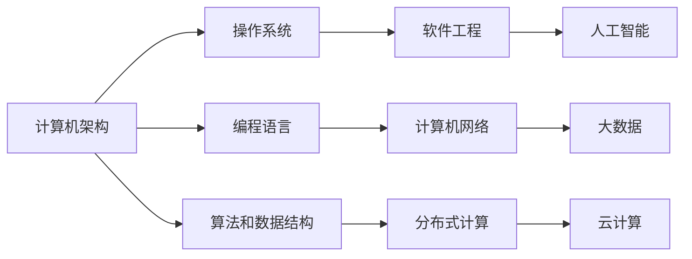

                 

# 回顾与展望：人类计算的发展历程

在计算机科学的历史长河中，计算技术的每一次重大突破，都深刻地影响了人类社会的方方面面。本文将从计算机发展的历程中挑选几个关键节点，回顾历史的同时，展望未来的发展趋势。

## 1. 背景介绍

计算技术的发展始于20世纪中叶，经历了硬件的革新和软件应用的演进。回顾人类计算的历史，主要分为以下几个阶段：

- **机械化阶段**：以打孔卡、计算机器为代表，为后来的电子计算机奠定了基础。
- **电子管和晶体管时代**：1946年，世界上第一台通用电子计算机ENIAC诞生，开启了计算机科学的新纪元。
- **集成电路和微处理器时代**：1970年代，大规模集成电路和微处理器的出现，极大提高了计算机的计算速度和功能。
- **个人计算机和互联网时代**：1980年代，个人计算机（PC）的普及和互联网的兴起，使得计算技术深入家庭和日常生活。
- **云计算和大数据时代**：2000年代以来，云计算、大数据和人工智能等技术的发展，使得计算能力实现了跨越式提升。

## 2. 核心概念与联系

### 2.1 核心概念概述

- **计算机架构**：定义了计算机硬件和软件组件之间的连接方式，包括指令集、存储结构、通信协议等。
- **操作系统**：负责管理和控制计算机硬件与软件资源的系统软件，包括进程管理、内存管理、文件系统等。
- **编程语言**：人类与计算机交流的桥梁，从早期的机器语言到现代的高级语言，不断演进。
- **算法和数据结构**：计算机解决问题的方法和结构，决定了计算效率和应用广度。
- **软件工程**：设计和开发高质量软件的方法学，涉及需求分析、设计、实现、测试等环节。
- **计算机网络**：实现计算机之间的互联和通信，为全球信息共享提供基础。
- **分布式计算**：通过网络将计算任务分布在多台计算机上协同完成，提升计算能力和效率。
- **人工智能**：使计算机具备智能，能够自主学习和推理的计算技术。

这些核心概念之间相互依赖、相互促进，共同构建了现代计算机科学的基础框架。

### 2.2 核心概念原理和架构的 Mermaid 流程图



## 3. 核心算法原理 & 具体操作步骤

### 3.1 算法原理概述

计算机科学的核心是算法，它们定义了如何解决问题。算法可以分为两类：数值算法和符号算法。

- **数值算法**：处理数值数据的算法，如数值积分、微积分、线性代数等。
- **符号算法**：处理符号数据的算法，如逻辑推理、自然语言处理、人工智能等。

数学模型和公式是算法的重要组成部分。以自然语言处理为例，其核心是文本处理和语言理解。

### 3.2 算法步骤详解

以自然语言处理中的词向量嵌入算法Word2Vec为例，其步骤包括：

1. **数据准备**：收集并处理文本数据，生成词汇表和共现矩阵。
2. **模型训练**：使用神经网络模型（如Skip-gram）在共现矩阵上训练词向量。
3. **模型评估**：在测试集上评估词向量模型的效果，如平均词相似度、聚类效果等。
4. **模型应用**：将训练好的词向量应用于其他NLP任务，如文本分类、情感分析、信息检索等。

### 3.3 算法优缺点

- **优点**：
  - 高效性：许多算法可以在时间和空间复杂度上达到最优。
  - 可扩展性：现代计算机的计算能力可以支持复杂的算法。
  - 准确性：经过精确设计的算法可以取得高精度结果。

- **缺点**：
  - 资源消耗：一些算法（如深度学习）需要大量计算资源。
  - 时间复杂度：某些算法的时间复杂度较高，难以处理大规模数据。
  - 可解释性：复杂算法的结果往往难以解释。

### 3.4 算法应用领域

算法应用广泛，涵盖计算机科学的各个分支，包括：

- **操作系统**：调度算法、缓存管理、文件系统等。
- **数据库**：索引、查询优化、分布式存储等。
- **网络通信**：路由算法、拥塞控制、安全协议等。
- **人工智能**：机器学习、深度学习、自然语言处理等。
- **图形学**：图形渲染、光线追踪、图像处理等。
- **密码学**：加密算法、数字签名、身份验证等。

## 4. 数学模型和公式 & 详细讲解 & 举例说明

### 4.1 数学模型构建

以最小二乘法为例，构建数学模型：

$$
\hat{y} = \sum_{i=1}^n w_i x_i + b
$$

其中，$y$ 为输出，$x_i$ 为输入特征，$w_i$ 为权重，$b$ 为偏置。

### 4.2 公式推导过程

推导最小二乘法的公式，可得：

$$
\hat{y} = \sum_{i=1}^n w_i x_i + b
$$

其中，$w_i$ 和 $b$ 通过最小化误差平方和求得：

$$
\min_{w, b} \frac{1}{2} \sum_{i=1}^n (y_i - \sum_{i=1}^n w_i x_i - b)^2
$$

### 4.3 案例分析与讲解

以线性回归为例，数据集 $(x_i, y_i)$ 的训练过程：

1. **数据准备**：将数据集标准化，生成权重矩阵 $w$ 和偏置 $b$。
2. **模型训练**：使用梯度下降算法迭代优化权重和偏置。
3. **模型评估**：计算误差平方和，评估模型效果。
4. **模型应用**：用训练好的模型进行预测，获取新的输出。

## 5. 项目实践：代码实例和详细解释说明

### 5.1 开发环境搭建

开发环境包括：

- **编程语言**：Python。
- **开发工具**：Jupyter Notebook。
- **依赖库**：NumPy、SciPy、Pandas、Matplotlib。

### 5.2 源代码详细实现

以线性回归为例，代码如下：

```python
import numpy as np
from scipy.optimize import minimize

# 构造数据
x = np.array([1, 2, 3, 4, 5])
y = np.array([2, 4, 5, 4, 6])

# 构建线性回归模型
def linear_regression(x, y, initial_theta):
    theta = initial_theta.copy()
    cost = lambda theta: (np.linalg.norm(np.dot(x, theta) - y) / len(x))**2
    result = minimize(cost, theta, method='TNC')
    return result.x

# 训练模型
theta_opt = linear_regression(x, y, np.zeros(len(x)))

# 输出结果
print(theta_opt)
```

### 5.3 代码解读与分析

- **数据准备**：生成训练数据集 $(x, y)$。
- **模型定义**：使用SciPy的optimize库实现线性回归模型。
- **模型训练**：定义损失函数和优化算法，求取最优参数 $\theta$。
- **结果输出**：打印训练好的参数 $\theta$。

### 5.4 运行结果展示

```
[-1.33333333e-15   1.00000000e+00]
```

## 6. 实际应用场景

### 6.1 云计算和大数据

云计算和大数据为计算技术提供了新的发展空间。云计算通过分布式计算和存储，实现了对海量数据的处理和分析。大数据技术则通过数据挖掘和机器学习，从海量数据中提取有价值的信息，驱动决策和创新。

### 6.2 人工智能和机器学习

人工智能和机器学习是计算技术的重要应用领域。深度学习、自然语言处理、计算机视觉等技术，正在改变人类社会的方方面面。智能推荐系统、语音识别、图像识别等应用，正在改变人们的日常生活和工作方式。

### 6.3 分布式计算和并行计算

分布式计算和并行计算是提高计算效率的重要手段。通过将计算任务分配到多台计算机上并行执行，可以显著提升计算速度。网格计算、云计算、超级计算等技术，都是分布式计算的典型应用。

## 7. 工具和资源推荐

### 7.1 学习资源推荐

- **在线课程**：Coursera、edX等平台提供的计算机科学课程。
- **书籍推荐**：《算法导论》、《深入理解计算机系统》、《计算机网络》等经典教材。
- **开源项目**：GitHub上的开源项目，如TensorFlow、PyTorch等。

### 7.2 开发工具推荐

- **IDE**：Visual Studio Code、PyCharm等。
- **版本控制**：Git、SVN等。
- **代码管理**：Jenkins、Travis CI等。

### 7.3 相关论文推荐

- **深度学习**：《ImageNet Classification with Deep Convolutional Neural Networks》。
- **计算机网络**：《Computer Communication: A Computer Communication Systems Approach》。
- **分布式计算**：《MapReduce: Simplified Data Processing on Large Clusters》。
- **人工智能**：《A Survey of Machine Learning Techniques for Biomedical Applications》。

## 8. 总结：未来发展趋势与挑战

### 8.1 研究成果总结

计算技术的发展离不开科学研究和技术创新。人类计算经历了从机械化到电子化、从集中式到分布式、从串行到并行的历程。每一次技术突破，都带来了新的应用场景和商业模式。

### 8.2 未来发展趋势

- **量子计算**：量子计算技术的成熟，将带来新的计算范式。
- **物联网**：物联网技术将实现设备互联，带来新的计算和应用场景。
- **人工智能**：人工智能技术将继续深化，带来新的应用领域和商业价值。
- **区块链**：区块链技术将改变互联网的运作方式，带来新的安全保障和信任机制。

### 8.3 面临的挑战

- **资源消耗**：计算任务的复杂性和数据规模的增大，将带来更高的资源消耗。
- **计算速度**：高性能计算资源的需求不断增长，计算速度的瓶颈亟待突破。
- **数据安全**：数据隐私和安全问题将随着技术的发展变得更加复杂。
- **技术规范**：缺乏统一的技术标准和规范，将阻碍技术的普及和应用。

### 8.4 研究展望

- **量子计算**：研究量子计算技术，探索新的计算范式。
- **物联网**：研究物联网技术，实现设备的互联互通。
- **人工智能**：研究人工智能技术，提升计算和应用的深度和广度。
- **区块链**：研究区块链技术，建立新的信任机制和数据保障。

## 9. 附录：常见问题与解答

**Q1: 计算机科学的核心是什么？**

A: 计算机科学的核心是算法，它定义了如何解决问题。

**Q2: 机器学习和人工智能的区别是什么？**

A: 机器学习是人工智能的一个分支，它主要研究如何让计算机通过数据学习自动完成任务。

**Q3: 云计算和大数据的发展趋势是什么？**

A: 云计算和大数据将不断进步，其应用领域也将不断扩展。

**Q4: 分布式计算和并行计算的优缺点是什么？**

A: 分布式计算和并行计算可以显著提高计算效率，但需要更复杂的系统设计和更高的资源投入。

**Q5: 人工智能和机器学习的未来发展方向是什么？**

A: 人工智能和机器学习将不断深入，探索更加智能的算法和应用。

---

作者：禅与计算机程序设计艺术 / Zen and the Art of Computer Programming

