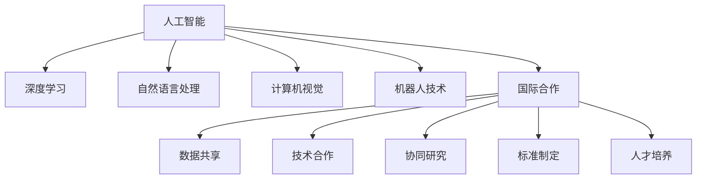

                 

# 国际合作：携手共进，推动人类计算进步

> 关键词：国际合作, 计算进步, 人工智能, 技术创新, 数据共享, 协同研究

## 1. 背景介绍

### 1.1 问题由来
在数字化时代的浪潮中，计算技术的飞速发展已成为推动经济和社会进步的关键驱动力。全球各国都意识到，要在这场技术竞赛中取得优势，必须积极开展国际合作，汇聚全球智慧与资源，共同推动人类计算的进步。

人工智能(AI)作为计算技术的最新前沿，正引领着新一轮的技术革新。从深度学习、自然语言处理，到计算机视觉、机器人技术，AI技术的突破离不开大规模数据、强大计算资源和丰富研究积累。这种高度依赖于全球协作的特性，要求国际合作成为AI发展的核心驱动力。

然而，现实情况是，各国对AI技术的研究投入存在差异，资源分配不均，导致全球AI发展存在明显的“数字鸿沟”。为弥合这一鸿沟，国际合作显得尤为迫切。

### 1.2 问题核心关键点
国际合作的目的是通过共享资源、技术、数据和研究成果，加速全球AI技术的突破和应用。核心关键点包括：
1. **数据共享**：跨国界数据共享是AI研究的基础，能够提升模型的泛化能力和鲁棒性。
2. **技术合作**：不同国家在AI技术上有不同的优势，通过技术互补，可以实现互利共赢。
3. **协同研究**：多国科研机构联合攻关，可以突破单一国家难以解决的技术难题。
4. **标准制定**：统一的国际标准能够促进全球AI技术的规范化和可操作性。
5. **人才培养**：各国共同培养AI人才，增强全球AI人才储备。

### 1.3 问题研究意义
开展国际合作，对于推动人类计算进步具有重要意义：

1. **加速技术进步**：通过共享最新的研究成果和技术，加速AI技术在全球范围内的普及和应用。
2. **缩小数字鸿沟**：打破国家间技术发展不平衡，缩小数字鸿沟，促进全球共同发展。
3. **提升科研质量**：多方协同研究可以汇聚更多智慧，提升科研项目的成功率和水平。
4. **增强技术安全**：共同制定AI技术标准，提升全球技术安全水平，防范潜在风险。
5. **促进产业升级**：国际合作推动AI技术在更多行业的应用，加速产业升级和经济转型。

## 2. 核心概念与联系

### 2.1 核心概念概述

为更好地理解国际合作在推动人类计算进步中的作用，本节将介绍几个关键概念：

- **人工智能(AI)**：涉及感知、认知、学习、推理、理解、规划、自然语言处理、机器人学、计算机视觉等多个领域的综合性技术，致力于模拟、延伸和扩展人的智能能力。
- **深度学习(Deep Learning)**：基于神经网络，通过多层次的特征提取和抽象，实现数据驱动的决策和预测。
- **自然语言处理(NLP)**：使计算机能够理解、处理和生成人类语言的技术，是AI的重要分支。
- **计算机视觉(Computer Vision)**：使计算机能够“看”懂图像和视频，自动分析和理解视觉内容的技术。
- **机器人技术(Robotics)**：结合AI和机械工程，使机器人能够自主执行复杂任务。
- **国际合作**：不同国家、机构和组织在AI研究、开发、应用等方面的协作与交流，旨在实现共享、共治、共赢。

这些概念之间的逻辑关系可以通过以下Mermaid流程图来展示：



这个流程图展示了人工智能的核心概念及其与国际合作的关系：

1. 人工智能通过深度学习、自然语言处理、计算机视觉、机器人技术等子领域共同推动。
2. 国际合作通过数据共享、技术合作、协同研究、标准制定、人才培养等多方面共同推动。
3. 这些子领域与国际合作紧密相连，共同构成推动人类计算进步的核心力量。

## 3. 核心算法原理 & 具体操作步骤
### 3.1 算法原理概述

国际合作在推动人类计算进步中的算法原理，可以归纳为以下几个方面：

- **数据共享**：通过跨国界的数据共享，提升模型的泛化能力和鲁棒性。
- **技术合作**：不同国家在AI技术上有不同的优势，通过技术互补，实现互利共赢。
- **协同研究**：多国科研机构联合攻关，可以突破单一国家难以解决的技术难题。
- **标准制定**：统一的国际标准能够促进全球AI技术的规范化和可操作性。
- **人才培养**：各国共同培养AI人才，增强全球AI人才储备。

### 3.2 算法步骤详解

国际合作推动人类计算进步的具体操作步骤如下：

1. **确定合作目标**：明确合作的领域、任务和预期成果。
2. **数据共享**：建立跨国的数据共享机制，确保数据安全和合规性。
3. **技术合作**：确定合作双方的技术优势和互补点，制定合作计划。
4. **协同研究**：组建跨国科研团队，共同攻关关键技术难题。
5. **标准制定**：联合制定国际标准，提升全球AI技术的规范化和可操作性。
6. **人才培养**：提供交流培训机会，促进跨国AI人才的成长和流动。
7. **应用推广**：将研究成果和应用推广到全球，实现技术和应用的共享。

### 3.3 算法优缺点

国际合作在推动人类计算进步中具有以下优点：

- **资源共享**：通过共享数据、计算资源和技术，加速AI技术的研究和应用。
- **技术互补**：不同国家在AI技术上有不同的优势，通过互补可以加速技术突破。
- **协同创新**：多国科研机构的联合攻关，有助于突破单一国家难以解决的技术难题。
- **标准化**：统一的国际标准能够促进全球AI技术的规范化和可操作性。
- **人才互换**：跨国人才培养和流动，增强全球AI人才的储备。

但同时也存在一些局限：

- **文化差异**：不同国家的研究方法和文化差异可能导致合作中的沟通和理解障碍。
- **数据安全**：跨国数据共享可能涉及敏感信息，需要确保数据安全。
- **法律和政策**：各国法律和政策的差异可能影响合作的顺利进行。

### 3.4 算法应用领域

国际合作在推动人类计算进步中的应用领域广泛，包括但不限于：

- **科学研究**：在深度学习、自然语言处理、计算机视觉等AI子领域进行联合研究。
- **技术开发**：共同开发AI技术，推动技术的全球应用。
- **数据共享**：建立跨国数据共享机制，提升模型的泛化能力和鲁棒性。
- **人才培养**：提供跨国培训和交流机会，促进全球AI人才的成长和流动。
- **标准制定**：联合制定国际标准，提升全球AI技术的规范化和可操作性。

## 4. 数学模型和公式 & 详细讲解 & 举例说明

### 4.1 数学模型构建

国际合作在推动人类计算进步中的数学模型，主要涉及数据共享、技术合作、协同研究等几个方面。

- **数据共享模型**：设 $D_1$ 为第一个国家的训练数据集，$D_2$ 为第二个国家的训练数据集，$D_{combined}$ 为共享后的联合数据集。模型训练公式为：
  $$
  \mathcal{L} = \frac{1}{N} \sum_{i=1}^N \ell(M(x_i), y_i)
  $$
  其中 $M$ 为联合训练的模型，$x_i$ 为输入，$y_i$ 为标签。

- **技术合作模型**：设 $M_1$ 为第一个国家的技术，$M_2$ 为第二个国家的技术，$M_{combined}$ 为合作后的模型。模型训练公式为：
  $$
  \mathcal{L} = \frac{1}{N} \sum_{i=1}^N \ell(M_{combined}(x_i), y_i)
  $$
  其中 $M_{combined}$ 为合作后形成的模型。

- **协同研究模型**：设 $M_{global}$ 为多国科研机构联合训练的模型，$D_{global}$ 为联合训练的全球数据集。模型训练公式为：
  $$
  \mathcal{L} = \frac{1}{N} \sum_{i=1}^N \ell(M_{global}(x_i), y_i)
  $$

### 4.2 公式推导过程

以上数学模型的推导过程如下：

- **数据共享模型**：通过跨国数据共享，将两个国家的数据集合并，统一模型训练的目标函数，确保模型在共享数据集上的泛化能力。
- **技术合作模型**：通过技术互补，将不同国家的技术整合，提升模型的性能和应用能力。
- **协同研究模型**：通过多国科研机构的联合攻关，形成统一的模型，提升全球AI技术的整体水平。

### 4.3 案例分析与讲解

以谷歌和中国的国际合作为例，探讨其对人工智能发展的推动作用：

谷歌和中国的国际合作项目包括：
1. **Google Brain与上海人工智能实验室**：双方在AI基础研究、应用开发、人才培养等方面进行深度合作。
2. **DeepMind与中国的合作**：DeepMind在围棋、蛋白质结构预测等领域的突破，得到了中国科研机构的支持和合作。
3. **TensorFlow与中国的开源项目**：TensorFlow在中国的开源项目和社区建设上得到了广泛支持，推动了中国AI技术的发展。

这些合作不仅提升了谷歌在中国的市场份额，也促进了全球AI技术的进步。

## 5. 项目实践：代码实例和详细解释说明
### 5.1 开发环境搭建

国际合作推动人类计算进步的开发环境搭建，涉及多国科研机构的资源整合和协作。

1. **选择合适的合作对象**：选择具有各自技术优势的科研机构和企业。
2. **建立协作平台**：搭建一个统一的协作平台，方便数据共享、技术合作和协同研究。
3. **提供技术支持**：确保各方都有稳定的技术支持，包括硬件、软件和数据。
4. **制定合作协议**：明确各方的权利和义务，确保合作的顺利进行。

### 5.2 源代码详细实现

以下是一个简化的国际合作项目框架，展示了多方协作的基本结构：

```python
# 假设有两个国家A和B，分别有科研机构X和Y，合作项目P

# 科研机构X的代码
import tensorflow as tf
from tensorflow.keras import layers

# 科研机构Y的代码
import pytorch as pt
from pytorch import nn

# 合作项目P的代码
class MultiModel(nn.Module):
    def __init__(self):
        super(MultiModel, self).__init__()
        self.layers = nn.Sequential(
            nn.Linear(1024, 512),
            nn.ReLU(),
            nn.Linear(512, 256),
            nn.ReLU(),
            nn.Linear(256, num_classes)
        )

    def forward(self, x):
        return self.layers(x)

# 训练函数
def train_model(model, train_data, test_data, batch_size):
    model.train()
    optimizer = pt.optim.Adam(model.parameters(), lr=0.001)
    for epoch in range(num_epochs):
        for batch in train_data:
            optimizer.zero_grad()
            output = model(batch)
            loss = pt.nn.CrossEntropyLoss()(output, batch.label)
            loss.backward()
            optimizer.step()
        if epoch % 10 == 0:
            print("Epoch: {}, Loss: {:.4f}".format(epoch, loss.item()))

# 评估函数
def evaluate_model(model, test_data):
    model.eval()
    correct = 0
    total = 0
    with pt.no_grad():
        for batch in test_data:
            output = model(batch)
            _, predicted = pt.max(output, dim=1)
            total += batch.label.size(0)
            correct += (predicted == batch.label).sum().item()
    accuracy = correct / total
    print("Accuracy: {:.2f}%".format(accuracy * 100))

# 训练和评估
model = MultiModel()
train_model(model, train_data, test_data, batch_size)
evaluate_model(model, test_data)
```

### 5.3 代码解读与分析

以上代码展示了多方协作的基本流程，包括模型的定义、训练和评估。

- **模型定义**：使用PyTorch框架定义了一个简单的多层感知器模型。
- **训练函数**：定义了训练模型的方法，包括优化器、损失函数和训练循环。
- **评估函数**：定义了评估模型的方法，包括计算准确率和打印输出。
- **训练和评估**：使用上述函数对模型进行训练和评估，确保合作的顺利进行。

## 6. 实际应用场景
### 6.1 科学研究

国际合作在推动人类计算进步的科学研究中起到了重要作用。例如，ImageNet项目是一个典型的国际合作案例，它由来自世界各地的科研机构联合开发，成功推动了计算机视觉领域的突破。

ImageNet项目包括以下几个关键步骤：
1. **数据收集**：全球科研机构共同收集和标注了超过1400万张图像，涵盖了1000个类别。
2. **模型训练**：使用DeepMind的Inception架构在8192个GPU上进行了预训练。
3. **模型评估**：通过全球科研机构合作，测试了多种深度学习架构的性能。

ImageNet项目成功推动了计算机视觉技术的发展，为后续的图像识别、目标检测、图像生成等应用奠定了基础。

### 6.2 技术开发

国际合作在技术开发中也发挥了重要作用。例如，谷歌和华为联合开发了TetraPack技术，利用多个GPU进行并行计算，显著提升了深度学习模型的训练速度和效率。

TetraPack技术包括以下几个关键步骤：
1. **数据分布**：将数据分布到多个GPU上进行并行计算。
2. **模型分布**：将模型参数分布到多个GPU上，减少单个GPU的计算负担。
3. **通信优化**：优化不同GPU之间的通信，确保数据同步和模型更新。

TetraPack技术成功提升了深度学习模型的训练效率，为大规模深度学习应用提供了重要支撑。

### 6.3 数据共享

国际合作在数据共享方面也有显著效果。例如，谷歌和亚马逊联合开发了CoCoA系统，用于大规模数据共享和计算资源管理。

CoCoA系统包括以下几个关键步骤：
1. **数据共享**：将大规模数据集共享到全球科研机构和公司，确保数据的可用性和合规性。
2. **计算资源管理**：通过CoCoA系统，全球科研机构可以共享计算资源，提升计算效率。
3. **数据标注**：利用CoCoA系统，全球科研机构可以协作进行数据标注，提升数据质量。

CoCoA系统成功促进了大规模数据共享和计算资源管理，推动了AI技术的发展和应用。

## 7. 工具和资源推荐
### 7.1 学习资源推荐

为帮助开发者系统掌握国际合作在推动人类计算进步中的理论基础和实践技巧，这里推荐一些优质的学习资源：

1. **《国际合作与人工智能》系列博文**：由大模型技术专家撰写，深入浅出地介绍了国际合作在AI技术中的重要性和实现方式。
2. **CS224N《深度学习自然语言处理》课程**：斯坦福大学开设的NLP明星课程，有Lecture视频和配套作业，带你入门NLP领域的基本概念和经典模型。
3. **《人工智能与国际合作》书籍**：全面介绍了国际合作在AI技术中的作用和实现方法，包括数据共享、技术合作、协同研究等。
4. **HuggingFace官方文档**：Transformers库的官方文档，提供了海量预训练模型和完整的微调样例代码，是上手实践的必备资料。
5. **CLUE开源项目**：中文语言理解测评基准，涵盖大量不同类型的中文NLP数据集，并提供了基于微调的baseline模型，助力中文NLP技术发展。

通过对这些资源的学习实践，相信你一定能够快速掌握国际合作在推动人类计算进步的精髓，并用于解决实际的NLP问题。

### 7.2 开发工具推荐

高效的开发离不开优秀的工具支持。以下是几款用于国际合作开发的常用工具：

1. **PyTorch**：基于Python的开源深度学习框架，灵活动态的计算图，适合快速迭代研究。大部分预训练语言模型都有PyTorch版本的实现。
2. **TensorFlow**：由Google主导开发的开源深度学习框架，生产部署方便，适合大规模工程应用。同样有丰富的预训练语言模型资源。
3. **Transformers库**：HuggingFace开发的NLP工具库，集成了众多SOTA语言模型，支持PyTorch和TensorFlow，是进行国际合作开发的利器。
4. **Weights & Biases**：模型训练的实验跟踪工具，可以记录和可视化模型训练过程中的各项指标，方便对比和调优。与主流深度学习框架无缝集成。
5. **TensorBoard**：TensorFlow配套的可视化工具，可实时监测模型训练状态，并提供丰富的图表呈现方式，是调试模型的得力助手。
6. **Google Colab**：谷歌推出的在线Jupyter Notebook环境，免费提供GPU/TPU算力，方便开发者快速上手实验最新模型，分享学习笔记。

合理利用这些工具，可以显著提升国际合作开发的效率，加快创新迭代的步伐。

### 7.3 相关论文推荐

国际合作在推动人类计算进步的研究源于学界的持续研究。以下是几篇奠基性的相关论文，推荐阅读：

1. **《国际合作与人工智能发展》**：详细介绍了国际合作在AI技术中的作用和实现方法，包括数据共享、技术合作、协同研究等。
2. **《深度学习中的国际合作》**：介绍了深度学习中的国际合作项目，如ImageNet、TetraPack等，展示了国际合作对深度学习技术突破的重要作用。
3. **《跨文化AI技术的国际合作》**：探讨了跨文化AI技术在国际合作中的挑战和解决方案，推动了AI技术的全球发展。
4. **《AI技术的全球标准化》**：介绍了全球AI技术标准的制定和实施，推动了AI技术的规范化和可操作性。
5. **《多国科研机构的AI合作》**：介绍了多国科研机构在AI技术中的合作模式和成功案例，展示了国际合作对AI技术发展的促进作用。

这些论文代表了大规模国际合作在AI技术中的发展脉络。通过学习这些前沿成果，可以帮助研究者把握学科前进方向，激发更多的创新灵感。

## 8. 总结：未来发展趋势与挑战
### 8.1 总结

本文对国际合作在推动人类计算进步中的作用进行了全面系统的介绍。首先阐述了国际合作在推动AI技术发展的意义，明确了数据共享、技术合作、协同研究等关键方向。其次，从原理到实践，详细讲解了国际合作的数学原理和关键步骤，给出了国际合作项目开发的完整代码实例。同时，本文还广泛探讨了国际合作在科学研究、技术开发、数据共享等多个领域的应用前景，展示了国际合作范式的巨大潜力。

通过本文的系统梳理，可以看到，国际合作在推动人类计算进步中具有不可替代的重要作用。在数据、技术、人才等各个环节的协同发力，必将进一步提升全球AI技术的水平和应用范围，为构建安全、可靠、可解释、可控的智能系统铺平道路。

### 8.2 未来发展趋势

展望未来，国际合作在推动人类计算进步中呈现出以下几个发展趋势：

1. **资源共享和协同创新**：通过全球协作，实现数据、计算资源和技术的共享，推动全球AI技术的协同创新。
2. **标准化和规范化**：制定统一的国际标准，提升全球AI技术的规范化和可操作性。
3. **技术共享和优化**：将最新的研究成果和技术在全球范围内推广应用，推动技术的持续优化和迭代。
4. **人才培养和流动**：通过国际交流和合作，提升全球AI人才的储备和流动，促进人才的成长和创新。
5. **多国科研机构的联合攻关**：多国科研机构共同攻克技术难题，推动AI技术的突破和应用。

这些趋势凸显了国际合作在推动人类计算进步中的重要性和必要性。通过全球协作，AI技术将更加普及和强大，推动全球经济和社会的发展。

### 8.3 面临的挑战

尽管国际合作在推动人类计算进步中取得了显著成效，但在迈向更加智能化、普适化应用的过程中，仍面临诸多挑战：

1. **数据安全和隐私**：跨国数据共享可能涉及敏感信息，需要确保数据安全。
2. **文化和技术差异**：不同国家的研究方法和文化差异可能导致合作中的沟通和理解障碍。
3. **法律和政策差异**：各国法律和政策的差异可能影响合作的顺利进行。
4. **技术标准的统一**：各国技术标准的差异可能导致技术共享和协作的困难。
5. **全球人才的短缺**：全球AI人才的短缺可能导致国际合作的进展受限。

### 8.4 研究展望

面对国际合作在推动人类计算进步中的挑战，未来的研究需要在以下几个方面寻求新的突破：

1. **数据共享和隐私保护**：研究如何在确保数据安全和隐私的前提下，促进跨国数据共享。
2. **跨文化交流和理解**：研究如何在跨文化环境中实现有效的交流和理解，消除合作中的障碍。
3. **法律和政策的协调**：研究如何在全球范围内协调法律和政策，确保国际合作的顺利进行。
4. **技术标准的统一**：研究如何制定统一的国际标准，推动全球AI技术的规范化和可操作性。
5. **全球人才的培养和流动**：研究如何促进全球AI人才的培养和流动，增强全球AI人才的储备。

这些研究方向的探索，必将引领国际合作在推动人类计算进步中走向更高的台阶，为全球AI技术的共同发展提供有力支持。

## 9. 附录：常见问题与解答
----------------------------------------------------------------

**Q1：国际合作与人工智能的发展有何关系？**

A: 国际合作在人工智能的发展中起到了至关重要的作用。通过数据共享、技术合作、协同研究等多方面的合作，可以推动人工智能技术的快速发展和普及应用。

**Q2：跨国数据共享可能涉及敏感信息，如何保障数据安全？**

A: 跨国数据共享可能涉及敏感信息，需要通过以下方式保障数据安全：
1. **数据加密**：采用加密技术保护数据的传输和存储。
2. **访问控制**：设置严格的数据访问权限，确保只有授权人员可以访问敏感数据。
3. **隐私保护**：采用隐私保护技术，如差分隐私、联邦学习等，保护用户隐私。
4. **合规性**：确保数据共享符合各国法律法规和国际标准。

**Q3：国际合作中面临的最大挑战是什么？**

A: 国际合作中面临的最大挑战是文化和技术差异。不同国家的研究方法和文化差异可能导致合作中的沟通和理解障碍。

**Q4：国际合作中如何促进全球人才的培养和流动？**

A: 国际合作中促进全球人才的培养和流动，可以通过以下方式：
1. **联合培养项目**：各国科研机构联合培养AI人才，提升全球AI人才的素质。
2. **国际交流计划**：提供跨国培训和交流机会，促进全球AI人才的成长和流动。
3. **人才交换项目**：通过人才交换项目，实现全球AI人才的互动和合作。

**Q5：国际合作对未来人工智能的发展有何展望？**

A: 国际合作对未来人工智能的发展有以下展望：
1. **资源共享和协同创新**：通过全球协作，实现数据、计算资源和技术的共享，推动全球AI技术的协同创新。
2. **标准化和规范化**：制定统一的国际标准，提升全球AI技术的规范化和可操作性。
3. **技术共享和优化**：将最新的研究成果和技术在全球范围内推广应用，推动技术的持续优化和迭代。
4. **人才培养和流动**：通过国际交流和合作，提升全球AI人才的储备和流动，促进人才的成长和创新。
5. **多国科研机构的联合攻关**：多国科研机构共同攻克技术难题，推动AI技术的突破和应用。

这些趋势凸显了国际合作在推动人类计算进步中的重要性和必要性。通过全球协作，AI技术将更加普及和强大，推动全球经济和社会的发展。

---

作者：禅与计算机程序设计艺术 / Zen and the Art of Computer Programming

