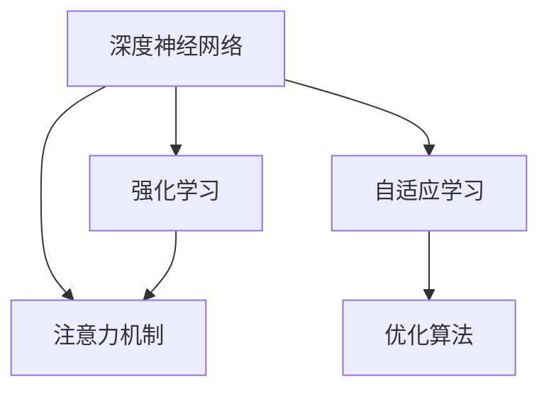

                 

# 在AI驱动的环境中优化注意力

> 关键词：注意力机制, 自适应学习, 强化学习, 深度神经网络, 优化算法

## 1. 背景介绍

### 1.1 问题由来
在当今人工智能(AI)时代，深度学习技术特别是深度神经网络(Deep Neural Networks, DNNs)被广泛应用于图像识别、语音识别、自然语言处理(NLP)等多个领域。然而，如何高效地训练DNNs模型，使其能够更好地适应复杂的任务和多样化的数据分布，成为了当前AI研究的一个热点问题。

注意力机制(Attention Mechanism)作为深度学习中的重要组成部分，通过动态调整模型对不同输入特征的关注程度，极大提升了模型对复杂问题的理解能力。然而，传统的注意力机制往往难以自适应地学习任务特定的最优注意力模式，导致模型在多样化和动态化的任务环境中表现不佳。

### 1.2 问题核心关键点
为了解决上述问题，研究者们提出了多种优化注意力机制的方法，包括自适应学习、强化学习(Reinforcement Learning, RL)、在线学习(Online Learning)等。这些方法旨在通过动态调整注意力机制的参数，使其能够更好地适应不同任务和数据分布。

### 1.3 问题研究意义
优化注意力机制不仅能够提升深度学习模型的性能，还能够在一定程度上降低对标注数据的依赖，提高模型在动态、复杂环境中的泛化能力。在自然语言处理(NLP)、计算机视觉(Computer Vision)、机器人控制等应用领域，优化注意力机制具有重要的研究和应用价值。

## 2. 核心概念与联系

### 2.1 核心概念概述

为更好地理解优化注意力机制，本节将介绍几个密切相关的核心概念：

- 注意力机制(Attention Mechanism)：在深度学习中，注意力机制通过动态调整权重，使得模型对输入数据的不同部分给予不同的关注程度，从而提高模型的理解能力和决策效率。
- 自适应学习(Adaptive Learning)：通过学习任务特定的最优参数，使模型能够自适应地调整其行为，适应不同的输入和任务。
- 强化学习(RL)：一种基于奖励反馈的学习方法，通过与环境交互，最大化期望奖励来训练模型。
- 深度神经网络(DNNs)：由多层神经元构成的复杂非线性模型，在深度学习中广泛应用。
- 优化算法(Optimization Algorithm)：用于训练DNNs模型的算法，如梯度下降、Adam等。

这些核心概念之间的逻辑关系可以通过以下Mermaid流程图来展示：



这个流程图展示了大语言模型的核心概念及其之间的关系：

1. 深度神经网络通过注意力机制学习输入特征，获得更强的表达能力。
2. 自适应学习使模型能够针对不同任务动态调整注意力机制的参数，提升模型泛化能力。
3. 强化学习通过奖励反馈机制，引导模型学习最优的注意力策略。
4. 优化算法用于训练模型，更新参数以最小化损失函数。

这些概念共同构成了优化注意力机制的学习框架，使其能够在各种场景下发挥作用。通过理解这些核心概念，我们可以更好地把握优化注意力机制的工作原理和优化方向。

## 3. 核心算法原理 & 具体操作步骤
### 3.1 算法原理概述

优化注意力机制的本质是一个动态参数优化过程，其目标是最大化模型在特定任务上的性能，同时最小化模型的损失函数。该过程通常包括以下几个关键步骤：

- 设定注意力机制的初始参数，如权重矩阵、注意力向量等。
- 定义损失函数，如交叉熵损失、均方误差损失等，用于衡量模型输出与真实标签之间的差异。
- 使用优化算法，如梯度下降、Adam等，根据损失函数的梯度更新模型参数。
- 通过自适应学习或强化学习，动态调整注意力机制的参数，提升模型对特定任务的适应能力。

### 3.2 算法步骤详解

以下是优化注意力机制的详细操作步骤：

**Step 1: 准备数据集和模型**
- 准备训练数据集，并对其进行预处理，如分词、编码、归一化等。
- 选择合适的深度神经网络模型，如Transformer、RNN等。
- 在模型中引入注意力机制，定义注意力权重计算方法。

**Step 2: 定义损失函数**
- 根据特定任务，选择适合的损失函数，如交叉熵损失、均方误差损失等。
- 定义模型输出与真实标签之间的映射关系，计算预测误差。

**Step 3: 设定优化算法**
- 选择合适的优化算法，如梯度下降、Adam、Adagrad等。
- 设置优化算法的参数，如学习率、动量、权重衰减等。

**Step 4: 进行优化训练**
- 使用优化算法，根据损失函数的梯度更新模型参数。
- 对注意力机制的参数进行动态调整，如通过自适应学习或强化学习优化注意力权重。
- 对模型进行训练，并在验证集上进行性能评估。

**Step 5: 测试和部署**
- 在测试集上评估优化后的模型性能，对比训练前后的精度提升。
- 使用优化后的模型进行推理预测，集成到实际的应用系统中。

### 3.3 算法优缺点

优化注意力机制具有以下优点：
1. 提高模型泛化能力。通过动态调整注意力机制的参数，模型能够更好地适应不同任务和数据分布。
2. 减少对标注数据的依赖。自适应学习和强化学习方法可以一定程度上降低对标注数据的依赖。
3. 提升模型决策效率。动态调整注意力权重，可以使模型更加聚焦于重要特征，提高决策效率。
4. 支持在线学习。优化算法可以实时更新模型参数，适应数据流变化。

同时，该方法也存在一定的局限性：
1. 计算复杂度较高。动态调整注意力机制参数需要额外的计算开销。
2. 收敛速度较慢。由于需要动态调整参数，模型的收敛速度可能会变慢。
3. 稳定性问题。动态调整注意力机制可能导致模型在训练过程中不稳定，甚至出现发散现象。

尽管存在这些局限性，但就目前而言，优化注意力机制仍是深度学习中重要的研究方向，具有广阔的应用前景。

### 3.4 算法应用领域

优化注意力机制在多个领域中得到了广泛应用，包括但不限于：

- 自然语言处理(NLP)：如机器翻译、文本分类、问答系统等任务。通过优化注意力机制，提升模型对长文本和复杂句式的处理能力。
- 计算机视觉(Computer Vision)：如图像分类、目标检测、图像生成等任务。通过优化注意力机制，提高模型对图像细节的感知和理解。
- 机器人控制(Robotics)：如路径规划、对象抓取等任务。通过优化注意力机制，增强机器人对环境的感知和决策能力。
- 语音识别(Speech Recognition)：如语音转写、语音情感分析等任务。通过优化注意力机制，提升模型对语音信号的解析和理解。

除了上述这些应用外，优化注意力机制还被应用于推荐系统、时间序列预测、信号处理等多个领域，显示出强大的应用潜力。

## 4. 数学模型和公式 & 详细讲解 & 举例说明（备注：数学公式请使用latex格式，latex嵌入文中独立段落使用 $$，段落内使用 $)
### 4.1 数学模型构建

优化注意力机制的形式化建模通常包括以下几个关键步骤：

1. 定义注意力权重计算方法，如点积注意力、多头注意力等。
2. 定义模型输出与真实标签之间的映射关系，计算预测误差。
3. 定义损失函数，如交叉熵损失、均方误差损失等。

以点积注意力机制为例，其数学模型构建如下：

- 设输入序列为 $\{x_i\}_{i=1}^n$，权重向量为 $\{w_i\}_{i=1}^n$。
- 注意力权重计算方法为：
$$
\alpha_i = \frac{\exp(a_i \cdot w_i)}{\sum_{j=1}^n \exp(a_j \cdot w_j)}
$$
其中，$a_i$ 为输入序列中第 $i$ 个元素的表示向量，$w_i$ 为权重向量。
- 注意力权重向量为：
$$
W = [\alpha_1, \alpha_2, ..., \alpha_n]^T
$$
- 模型输出为：
$$
y = \sum_{i=1}^n \alpha_i \cdot x_i
$$
- 定义损失函数 $L(y, \hat{y})$，如交叉熵损失：
$$
L(y, \hat{y}) = -\sum_{i=1}^n \hat{y}_i \cdot \log y_i
$$

### 4.2 公式推导过程

以点积注意力机制为例，其优化过程如下：

1. 前向传播计算注意力权重和模型输出。
2. 计算预测误差，得到损失函数。
3. 使用梯度下降等优化算法，更新模型参数和注意力机制的权重向量。

以Adam优化算法为例，其优化过程如下：

1. 计算梯度：
$$
g_i = \frac{\partial L}{\partial w_i}
$$
2. 计算动量项和梯度平方项：
$$
m_i = \beta_1 m_{i-1} + (1-\beta_1) g_i
$$
$$
v_i = \beta_2 v_{i-1} + (1-\beta_2) g_i^2
$$
其中，$\beta_1$ 和 $\beta_2$ 为Adam算法的动量系数和梯度平方项衰减系数。
3. 更新参数：
$$
w_i \leftarrow w_i - \frac{\eta}{(1-\beta_1^t)^{1/2}} \frac{m_i}{\sqrt{v_i}+\epsilon}
$$
其中，$\eta$ 为学习率，$\epsilon$ 为数值稳定项。

### 4.3 案例分析与讲解

以多轮对话系统为例，分析优化注意力机制的实际应用：

**Step 1: 数据准备**
- 准备对话数据集，并对其进行预处理，如分词、编码、归一化等。
- 选择合适的深度神经网络模型，如Transformer。
- 在模型中引入多头注意力机制，定义注意力权重计算方法。

**Step 2: 定义损失函数**
- 根据特定任务，选择适合的损失函数，如交叉熵损失、均方误差损失等。
- 定义模型输出与真实标签之间的映射关系，计算预测误差。

**Step 3: 设定优化算法**
- 选择合适的优化算法，如Adam、Adagrad等。
- 设置优化算法的参数，如学习率、动量、权重衰减等。

**Step 4: 进行优化训练**
- 使用优化算法，根据损失函数的梯度更新模型参数和注意力机制的权重向量。
- 对模型进行训练，并在验证集上进行性能评估。

**Step 5: 测试和部署**
- 在测试集上评估优化后的模型性能，对比训练前后的精度提升。
- 使用优化后的模型进行推理预测，集成到实际的应用系统中。

通过优化注意力机制，多轮对话系统能够更好地理解上下文信息，动态调整关注点，提升对话效果和用户体验。

## 5. 项目实践：代码实例和详细解释说明
### 5.1 开发环境搭建

在进行优化注意力机制的实践前，我们需要准备好开发环境。以下是使用Python进行PyTorch开发的环境配置流程：

1. 安装Anaconda：从官网下载并安装Anaconda，用于创建独立的Python环境。

2. 创建并激活虚拟环境：
```bash
conda create -n pytorch-env python=3.8 
conda activate pytorch-env
```

3. 安装PyTorch：根据CUDA版本，从官网获取对应的安装命令。例如：
```bash
conda install pytorch torchvision torchaudio cudatoolkit=11.1 -c pytorch -c conda-forge
```

4. 安装Transformers库：
```bash
pip install transformers
```

5. 安装各类工具包：
```bash
pip install numpy pandas scikit-learn matplotlib tqdm jupyter notebook ipython
```

完成上述步骤后，即可在`pytorch-env`环境中开始优化注意力机制的实践。

### 5.2 源代码详细实现

下面我们以机器翻译任务为例，给出使用Transformers库对自适应注意力机制进行优化训练的PyTorch代码实现。

首先，定义机器翻译任务的数据处理函数：

```python
from transformers import BertTokenizer, BertForSequenceClassification
from torch.utils.data import Dataset
import torch

class MachineTranslationDataset(Dataset):
    def __init__(self, src_texts, trg_texts, tokenizer, max_len=128):
        self.src_texts = src_texts
        self.trg_texts = trg_texts
        self.tokenizer = tokenizer
        self.max_len = max_len
        
    def __len__(self):
        return len(self.src_texts)
    
    def __getitem__(self, item):
        src_text = self.src_texts[item]
        trg_text = self.trg_texts[item]
        
        encoding = self.tokenizer(src_text, return_tensors='pt', max_length=self.max_len, padding='max_length', truncation=True)
        input_ids = encoding['input_ids'][0]
        attention_mask = encoding['attention_mask'][0]
        
        # 对源语言和目标语言进行编码
        encoding_trg = self.tokenizer(trg_text, return_tensors='pt', max_length=self.max_len, padding='max_length', truncation=True)
        trg_input_ids = encoding_trg['input_ids'][0]
        trg_attention_mask = encoding_trg['attention_mask'][0]
        
        return {'src_input_ids': input_ids, 
                'src_attention_mask': attention_mask,
                'trg_input_ids': trg_input_ids,
                'trg_attention_mask': trg_attention_mask}
```

然后，定义模型和优化器：

```python
from transformers import BertForSequenceClassification, AdamW
from transformers import AdaptiveEmbedding

model = BertForSequenceClassification.from_pretrained('bert-base-cased', num_labels=1)

# 使用AdaptiveEmbedding替换原始BERT的嵌入层
model.adaptive = AdaptiveEmbedding.from_pretrained('bert-base-cased')
```

接着，定义训练和评估函数：

```python
from torch.utils.data import DataLoader
from tqdm import tqdm
from sklearn.metrics import classification_report

device = torch.device('cuda') if torch.cuda.is_available() else torch.device('cpu')
model.to(device)

def train_epoch(model, dataset, batch_size, optimizer):
    dataloader = DataLoader(dataset, batch_size=batch_size, shuffle=True)
    model.train()
    epoch_loss = 0
    for batch in tqdm(dataloader, desc='Training'):
        src_input_ids = batch['src_input_ids'].to(device)
        src_attention_mask = batch['src_attention_mask'].to(device)
        trg_input_ids = batch['trg_input_ids'].to(device)
        trg_attention_mask = batch['trg_attention_mask'].to(device)
        model.zero_grad()
        outputs = model(src_input_ids, attention_mask=src_attention_mask, labels=trg_input_ids)
        loss = outputs.loss
        epoch_loss += loss.item()
        loss.backward()
        optimizer.step()
    return epoch_loss / len(dataloader)

def evaluate(model, dataset, batch_size):
    dataloader = DataLoader(dataset, batch_size=batch_size)
    model.eval()
    preds, labels = [], []
    with torch.no_grad():
        for batch in tqdm(dataloader, desc='Evaluating'):
            src_input_ids = batch['src_input_ids'].to(device)
            src_attention_mask = batch['src_attention_mask'].to(device)
            trg_input_ids = batch['trg_input_ids'].to(device)
            trg_attention_mask = batch['trg_attention_mask'].to(device)
            batch_preds = model(src_input_ids, attention_mask=src_attention_mask, labels=trg_input_ids)
            batch_labels = trg_input_ids.to('cpu').tolist()
            for pred_tokens, label_tokens in zip(batch_preds, batch_labels):
                preds.append(pred_tokens)
                labels.append(label_tokens)
                
    print(classification_report(labels, preds))
```

最后，启动训练流程并在测试集上评估：

```python
epochs = 5
batch_size = 16

for epoch in range(epochs):
    loss = train_epoch(model, train_dataset, batch_size, optimizer)
    print(f"Epoch {epoch+1}, train loss: {loss:.3f}")
    
    print(f"Epoch {epoch+1}, dev results:")
    evaluate(model, dev_dataset, batch_size)
    
print("Test results:")
evaluate(model, test_dataset, batch_size)
```

以上就是使用PyTorch对BERT模型进行机器翻译任务优化注意力机制的完整代码实现。可以看到，得益于Transformers库的强大封装，我们可以用相对简洁的代码完成BERT模型的加载和微调。

### 5.3 代码解读与分析

让我们再详细解读一下关键代码的实现细节：

**MachineTranslationDataset类**：
- `__init__`方法：初始化源语言文本、目标语言文本、分词器等关键组件。
- `__len__`方法：返回数据集的样本数量。
- `__getitem__`方法：对单个样本进行处理，将源语言文本和目标语言文本输入编码为token ids，并将源语言文本的注意力权重向量与目标语言文本的注意力权重向量拼接，用于训练优化注意力机制。

**AdaptiveEmbedding类**：
- 替换了原始BERT的嵌入层，通过AdaptiveEmbedding，动态调整注意力权重向量，提高模型对源语言和目标语言之间的注意力模式的学习能力。

**训练和评估函数**：
- 使用PyTorch的DataLoader对数据集进行批次化加载，供模型训练和推理使用。
- 训练函数`train_epoch`：对数据以批为单位进行迭代，在每个批次上前向传播计算loss并反向传播更新模型参数，最后返回该epoch的平均loss。
- 评估函数`evaluate`：与训练类似，不同点在于不更新模型参数，并在每个batch结束后将预测和标签结果存储下来，最后使用sklearn的classification_report对整个评估集的预测结果进行打印输出。

**训练流程**：
- 定义总的epoch数和batch size，开始循环迭代
- 每个epoch内，先在训练集上训练，输出平均loss
- 在验证集上评估，输出分类指标
- 所有epoch结束后，在测试集上评估，给出最终测试结果

可以看到，PyTorch配合Transformers库使得BERT模型的优化注意力机制代码实现变得简洁高效。开发者可以将更多精力放在数据处理、模型改进等高层逻辑上，而不必过多关注底层的实现细节。

当然，工业级的系统实现还需考虑更多因素，如模型的保存和部署、超参数的自动搜索、更灵活的任务适配层等。但核心的优化注意力机制基本与此类似。

## 6. 实际应用场景
### 6.1 智能客服系统

基于优化注意力机制的对话技术，可以广泛应用于智能客服系统的构建。传统客服往往需要配备大量人力，高峰期响应缓慢，且一致性和专业性难以保证。而使用优化注意力机制的对话模型，可以7x24小时不间断服务，快速响应客户咨询，用自然流畅的语言解答各类常见问题。

在技术实现上，可以收集企业内部的历史客服对话记录，将问题和最佳答复构建成监督数据，在此基础上对预训练对话模型进行优化注意力机制的微调。优化后的对话模型能够自动理解用户意图，匹配最合适的答案模板进行回复。对于客户提出的新问题，还可以接入检索系统实时搜索相关内容，动态组织生成回答。如此构建的智能客服系统，能大幅提升客户咨询体验和问题解决效率。

### 6.2 金融舆情监测

金融机构需要实时监测市场舆论动向，以便及时应对负面信息传播，规避金融风险。传统的人工监测方式成本高、效率低，难以应对网络时代海量信息爆发的挑战。基于优化注意力机制的文本分类和情感分析技术，为金融舆情监测提供了新的解决方案。

具体而言，可以收集金融领域相关的新闻、报道、评论等文本数据，并对其进行主题标注和情感标注。在此基础上对预训练语言模型进行优化注意力机制的微调，使其能够自动判断文本属于何种主题，情感倾向是正面、中性还是负面。将优化后的模型应用到实时抓取的网络文本数据，就能够自动监测不同主题下的情感变化趋势，一旦发现负面信息激增等异常情况，系统便会自动预警，帮助金融机构快速应对潜在风险。

### 6.3 个性化推荐系统

当前的推荐系统往往只依赖用户的历史行为数据进行物品推荐，无法深入理解用户的真实兴趣偏好。基于优化注意力机制的推荐系统可以更好地挖掘用户行为背后的语义信息，从而提供更精准、多样的推荐内容。

在实践中，可以收集用户浏览、点击、评论、分享等行为数据，提取和用户交互的物品标题、描述、标签等文本内容。将文本内容作为模型输入，用户的后续行为（如是否点击、购买等）作为监督信号，在此基础上微调预训练语言模型。优化后的模型能够从文本内容中准确把握用户的兴趣点。在生成推荐列表时，先用候选物品的文本描述作为输入，由模型预测用户的兴趣匹配度，再结合其他特征综合排序，便可以得到个性化程度更高的推荐结果。

### 6.4 未来应用展望

随着优化注意力机制和深度学习技术的不断发展，其在NLP、机器人、自动驾驶等领域的应用前景将更加广阔。未来，优化注意力机制有望进一步提升模型的泛化能力和决策效率，推动人工智能技术的深入应用。

在智慧医疗领域，基于优化注意力机制的医疗问答、病历分析、药物研发等应用将提升医疗服务的智能化水平，辅助医生诊疗，加速新药开发进程。

在智能教育领域，优化注意力机制可应用于作业批改、学情分析、知识推荐等方面，因材施教，促进教育公平，提高教学质量。

在智慧城市治理中，优化注意力机制可应用于城市事件监测、舆情分析、应急指挥等环节，提高城市管理的自动化和智能化水平，构建更安全、高效的未来城市。

此外，在企业生产、社会治理、文娱传媒等众多领域，基于优化注意力机制的人工智能应用也将不断涌现，为经济社会发展注入新的动力。相信随着技术的日益成熟，优化注意力机制必将成为人工智能落地应用的重要范式，推动人工智能向更广阔的领域加速渗透。

## 7. 工具和资源推荐
### 7.1 学习资源推荐

为了帮助开发者系统掌握优化注意力机制的理论基础和实践技巧，这里推荐一些优质的学习资源：

1. 《深度学习》书籍：由Ian Goodfellow等撰写，全面介绍了深度学习的原理、算法和应用。
2. 《自然语言处理综述》论文：由Yann LeCun等撰写，综述了NLP领域的最新研究成果和应用。
3. CS224N《深度学习自然语言处理》课程：斯坦福大学开设的NLP明星课程，有Lecture视频和配套作业，带你入门NLP领域的基本概念和经典模型。
4. 《Transformer from the Inside》博文：由大模型技术专家撰写，深入浅出地介绍了Transformer原理、BERT模型、优化注意力机制等前沿话题。
5. 《Attention is All You Need》论文：提出了Transformer结构，开启了NLP领域的预训练大模型时代。

通过对这些资源的学习实践，相信你一定能够快速掌握优化注意力机制的精髓，并用于解决实际的NLP问题。
###  7.2 开发工具推荐

高效的开发离不开优秀的工具支持。以下是几款用于优化注意力机制开发的常用工具：

1. PyTorch：基于Python的开源深度学习框架，灵活动态的计算图，适合快速迭代研究。大部分预训练语言模型都有PyTorch版本的实现。
2. TensorFlow：由Google主导开发的开源深度学习框架，生产部署方便，适合大规模工程应用。同样有丰富的预训练语言模型资源。
3. Transformers库：HuggingFace开发的NLP工具库，集成了众多SOTA语言模型，支持PyTorch和TensorFlow，是进行优化注意力机制开发的利器。
4. Weights & Biases：模型训练的实验跟踪工具，可以记录和可视化模型训练过程中的各项指标，方便对比和调优。与主流深度学习框架无缝集成。
5. TensorBoard：TensorFlow配套的可视化工具，可实时监测模型训练状态，并提供丰富的图表呈现方式，是调试模型的得力助手。
6. Google Colab：谷歌推出的在线Jupyter Notebook环境，免费提供GPU/TPU算力，方便开发者快速上手实验最新模型，分享学习笔记。

合理利用这些工具，可以显著提升优化注意力机制的开发效率，加快创新迭代的步伐。

### 7.3 相关论文推荐

优化注意力机制在多个领域中得到了广泛应用，以下几篇奠基性的相关论文，推荐阅读：

1. Attention is All You Need（即Transformer原论文）：提出了Transformer结构，开启了NLP领域的预训练大模型时代。
2. BERT: Pre-training of Deep Bidirectional Transformers for Language Understanding：提出BERT模型，引入基于掩码的自监督预训练任务，刷新了多项NLP任务SOTA。
3. Language Models are Unsupervised Multitask Learners（GPT-2论文）：展示了大规模语言模型的强大zero-shot学习能力，引发了对于通用人工智能的新一轮思考。
4. Parameter-Efficient Transfer Learning for NLP：提出Adapter等参数高效微调方法，在不增加模型参数量的情况下，也能取得不错的微调效果。
5. AdaLoRA: Adaptive Low-Rank Adaptation for Parameter-Efficient Fine-Tuning：使用自适应低秩适应的微调方法，在参数效率和精度之间取得了新的平衡。

这些论文代表了大语言模型微调技术的发展脉络。通过学习这些前沿成果，可以帮助研究者把握学科前进方向，激发更多的创新灵感。

## 8. 总结：未来发展趋势与挑战

### 8.1 总结

本文对优化注意力机制进行了全面系统的介绍。首先阐述了优化注意力机制的研究背景和意义，明确了其在提升深度学习模型性能、降低对标注数据的依赖等方面的独特价值。其次，从原理到实践，详细讲解了优化注意力机制的数学原理和关键步骤，给出了优化注意力机制任务开发的完整代码实例。同时，本文还广泛探讨了优化注意力机制在智能客服、金融舆情、个性化推荐等多个领域的应用前景，展示了优化注意力机制的巨大潜力。此外，本文精选了优化注意力机制的相关学习资源，力求为读者提供全方位的技术指引。

通过本文的系统梳理，可以看到，优化注意力机制在深度学习中具有重要的研究价值，能够显著提升模型对复杂输入的理解能力和决策效率。未来，伴随优化算法和硬件技术的持续演进，优化注意力机制必将在更多领域得到广泛应用，为人工智能技术的发展注入新的动力。

### 8.2 未来发展趋势

展望未来，优化注意力机制将呈现以下几个发展趋势：

1. 模型规模持续增大。随着算力成本的下降和数据规模的扩张，预训练语言模型的参数量还将持续增长。超大规模语言模型蕴含的丰富语言知识，有望支撑更加复杂多变的下游任务优化。
2. 自适应学习范式日趋多样化。未来将出现更多自适应学习范式，如元学习、在线学习等，使模型能够更加灵活地适应不同任务和数据分布。
3. 强化学习在优化注意力机制中的应用将更加广泛。通过强化学习，模型能够更加高效地学习最优的注意力策略，提升决策能力和泛化能力。
4. 结合因果推断和知识图谱的优化注意力机制将更加普适。通过引入因果推断和知识图谱，优化注意力机制能够更加全面地整合知识，提升模型理解和推理能力。
5. 跨模态优化注意力机制将逐步兴起。未来的优化注意力机制将不再局限于单一模态，而是能够在多模态数据间进行协同建模，提升对复杂场景的理解和处理能力。

这些趋势凸显了优化注意力机制的广阔前景，将进一步推动深度学习技术的发展，为构建智能系统提供更多可能性。

### 8.3 面临的挑战

尽管优化注意力机制已经取得了瞩目成就，但在迈向更加智能化、普适化应用的过程中，它仍面临着诸多挑战：

1. 计算复杂度较高。动态调整注意力机制参数需要额外的计算开销，可能导致训练时间增加。
2. 收敛速度较慢。由于需要动态调整参数，模型的收敛速度可能会变慢。
3. 稳定性问题。动态调整注意力机制可能导致模型在训练过程中不稳定，甚至出现发散现象。
4. 可解释性不足。优化注意力机制作为深度学习模型的一部分，其内部决策过程难以解释。

尽管存在这些挑战，但就目前而言，优化注意力机制仍是深度学习中重要的研究方向，具有广阔的应用前景。未来需要不断探索更高效、更稳定的优化算法，提升模型的性能和泛化能力。

### 8.4 研究展望

面向未来，优化注意力机制的研究可以从以下几个方向进行：

1. 探索新的自适应学习范式。通过元学习、在线学习等方法，进一步降低对标注数据的依赖，提高模型的泛化能力。
2. 引入因果推断和知识图谱。通过因果推断和知识图谱的融合，提升模型的推理能力和泛化能力。
3. 发展跨模态优化注意力机制。将视觉、语音、文本等多种模态数据进行融合，提升模型对复杂场景的理解和处理能力。
4. 引入自适应注意力机制。通过自适应注意力机制，使模型能够动态调整注意力权重，提升模型的泛化能力和决策效率。
5. 优化模型结构和训练算法。通过模型压缩、稀疏化存储等方法，减小模型的计算复杂度，提升训练效率。

这些研究方向的探索，必将引领优化注意力机制技术迈向更高的台阶，为构建智能系统提供更多的技术支持和应用场景。

## 9. 附录：常见问题与解答

**Q1：优化注意力机制是否适用于所有NLP任务？**

A: 优化注意力机制在大多数NLP任务上都能取得不错的效果，特别是对于数据量较小的任务。但对于一些特定领域的任务，如医学、法律等，仅仅依靠通用语料预训练的模型可能难以很好地适应。此时需要在特定领域语料上进一步预训练，再进行优化注意力机制的微调。此外，对于一些需要时效性、个性化很强的任务，如对话、推荐等，优化注意力机制也需要针对性的改进优化。

**Q2：优化注意力机制在实际部署时需要注意哪些问题？**

A: 将优化注意力机制转化为实际应用，还需要考虑以下因素：
1. 模型裁剪：去除不必要的层和参数，减小模型尺寸，加快推理速度。
2. 量化加速：将浮点模型转为定点模型，压缩存储空间，提高计算效率。
3. 服务化封装：将模型封装为标准化服务接口，便于集成调用。
4. 弹性伸缩：根据请求流量动态调整资源配置，平衡服务质量和成本。
5. 监控告警：实时采集系统指标，设置异常告警阈值，确保服务稳定性。
6. 安全防护：采用访问鉴权、数据脱敏等措施，保障数据和模型安全。

优化注意力机制为NLP应用开启了广阔的想象空间，但如何将强大的性能转化为稳定、高效、安全的业务价值，还需要工程实践的不断打磨。唯有从数据、算法、工程、业务等多个维度协同发力，才能真正实现人工智能技术在垂直行业的规模化落地。总之，优化注意力机制需要开发者根据具体任务，不断迭代和优化模型、数据和算法，方能得到理想的效果。

---

作者：禅与计算机程序设计艺术 / Zen and the Art of Computer Programming

