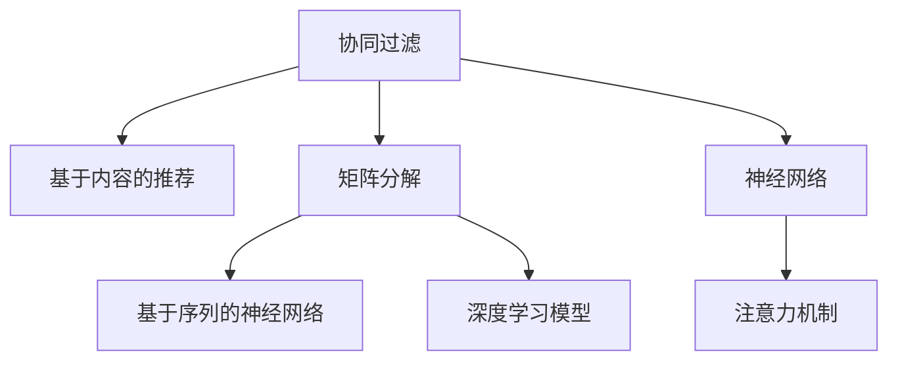

                 

# 在线视频平台的内容推荐算法与注意力分配

> 关键词：推荐算法, 在线视频, 注意力分配, 内容推荐系统, 机器学习

## 1. 背景介绍

### 1.1 问题由来
随着互联网视频内容的爆炸性增长，在线视频平台（如Netflix、YouTube等）面临着如何高效推荐视频给用户的挑战。如何针对不同用户偏好推荐个性化视频，已成为各大平台竞争的核心。基于推荐算法的推荐系统，通过分析用户行为数据，预测用户可能感兴趣的影视内容，并将这些内容推荐给用户，从而提升用户体验和平台活跃度。

推荐算法的发展，历经基于协同过滤、基于内容的推荐、矩阵分解等方法。近年来，基于深度学习的推荐算法（如基于序列的神经网络模型、注意力机制等），因其强大的表达能力和泛化能力，逐渐成为在线视频平台推荐系统的主流选择。

### 1.2 问题核心关键点
在线视频平台推荐系统的核心目标是：
- 分析用户历史观看数据，预测用户兴趣。
- 从海量的视频库中筛选出符合用户兴趣的视频内容。
- 通过优化推荐策略，提升用户满意度和平台收益。

基于深度学习的推荐算法，核心思想是使用神经网络模型，将用户行为数据映射到推荐结果的表示上。而注意力机制的应用，使得模型可以动态地调整对不同特征的关注程度，从而提升推荐的准确性和泛化能力。

## 2. 核心概念与联系

### 2.1 核心概念概述

为更好地理解基于深度学习的推荐系统，本节将介绍几个密切相关的核心概念：

- 推荐系统(Recommender System)：通过分析用户行为数据，预测用户可能感兴趣的内容，并将这些内容推荐给用户的系统。

- 协同过滤(Collaborative Filtering)：通过分析用户行为数据，推荐与用户过去行为相似的用户喜欢的内容。

- 基于内容的推荐(Content-based Recommendation)：通过分析视频内容（如标签、关键词、场景等），推荐与用户过去喜欢的内容相似的视频。

- 矩阵分解(Matrix Factorization)：将用户行为数据和视频信息表示为矩阵，通过矩阵分解得到用户-内容评分预测模型。

- 神经网络(Neural Network)：基于深度学习的推荐系统主要采用神经网络模型，通过学习用户行为数据，预测推荐结果。

- 注意力机制(Attention Mechanism)：通过动态调整对不同特征的关注程度，使得模型能更精确地捕捉用户兴趣。

这些核心概念之间的逻辑关系可以通过以下Mermaid流程图来展示：



这个流程图展示了一个典型的推荐系统组件构成，从数据采集、模型训练到最终推荐的全过程。

## 3. 核心算法原理 & 具体操作步骤
### 3.1 算法原理概述

基于深度学习的推荐系统，通过神经网络模型，将用户行为数据和视频特征映射到推荐结果的表示上。常用的模型包括基于序列的神经网络、自编码器、注意力机制等。其中，注意力机制的引入，使得模型能够动态地调整对不同特征的关注程度，从而提升推荐的准确性和泛化能力。

形式化地，设用户行为数据为 $X \in \mathbb{R}^{N \times D}$，其中 $N$ 为用户数量，$D$ 为特征维度。设视频内容特征为 $Y \in \mathbb{R}^{M \times D}$，其中 $M$ 为视频数量。设用户对视频 $i$ 的评分矩阵为 $R \in \mathbb{R}^{N \times M}$。设推荐结果为 $Z \in \mathbb{R}^{N \times M}$。推荐算法的目标是最小化预测评分与实际评分之间的误差，即：

$$
\min_{\theta} \|R - Z\|_F^2
$$

其中 $\theta$ 为模型参数，$\| \cdot \|_F$ 为Frobenius范数。

### 3.2 算法步骤详解

基于深度学习的推荐系统的一般步骤如下：

**Step 1: 数据准备**
- 收集用户行为数据，包括观看视频ID、观看时间、时长等。
- 收集视频内容特征，如视频标签、演员、导演、情节等。
- 将用户行为数据和视频内容特征组成矩阵。

**Step 2: 模型选择与构建**
- 选择适合的深度学习模型，如基于序列的神经网络、自编码器等。
- 定义模型的输入输出层，以及中间层的神经元数量、激活函数等。

**Step 3: 模型训练**
- 将用户行为数据和视频内容特征输入模型进行训练。
- 设置合适的损失函数，如均方误差、交叉熵等。
- 定义优化算法及其参数，如Adam、SGD等。
- 在训练集上迭代训练，更新模型参数。

**Step 4: 模型评估**
- 在验证集上评估模型的预测评分与实际评分的误差。
- 调整模型参数，优化损失函数。

**Step 5: 推荐实践**
- 在测试集上使用模型进行预测评分。
- 根据评分高低推荐视频给用户。

### 3.3 算法优缺点

基于深度学习的推荐系统具有以下优点：
1. 强大的表达能力：神经网络模型能捕捉复杂的非线性关系，适合处理高维度的用户行为数据。
2. 泛化能力强：通过大规模数据训练，神经网络模型能泛化到未见过的数据，提升推荐效果。
3. 适应性强：能够实时动态更新模型，适应用户兴趣的动态变化。

但该方法也存在一定的局限性：
1. 数据依赖性高：需要大量的用户行为数据进行训练，对数据获取和处理要求高。
2. 模型复杂度高：深度学习模型结构复杂，训练和推理耗时较长。
3. 可解释性差：神经网络模型通常是一个"黑盒"，难以解释其内部工作机制。
4. 对抗样本敏感：深度学习模型对输入的微小变化可能非常敏感，容易受到对抗样本攻击。

尽管存在这些局限性，但就目前而言，基于深度学习的推荐系统仍是在线视频平台推荐系统的主流选择。未来相关研究的重点在于如何进一步降低数据需求，提高模型效率，同时兼顾可解释性和安全性等因素。

### 3.4 算法应用领域

基于深度学习的推荐系统广泛应用于在线视频平台、电子商务、社交网络等领域。具体应用包括：

- 视频推荐：推荐用户可能感兴趣的电影、电视剧、综艺节目等视频内容。
- 商品推荐：推荐用户可能感兴趣的商品、文章等。
- 音乐推荐：推荐用户可能喜欢的音乐、歌手等。
- 新闻推荐：推荐用户可能感兴趣的新闻、文章等。

这些应用不仅提升了用户体验，也大幅提升了平台的流量和收益。

## 4. 数学模型和公式 & 详细讲解 & 举例说明

### 4.1 数学模型构建

本节将使用数学语言对基于深度学习的推荐系统进行更加严格的刻画。

设推荐模型为 $F: \mathbb{R}^{N \times D} \times \mathbb{R}^{M \times D} \rightarrow \mathbb{R}^{N \times M}$。用户行为数据 $X \in \mathbb{R}^{N \times D}$ 和视频内容特征 $Y \in \mathbb{R}^{M \times D}$ 作为模型的输入，推荐结果 $Z \in \mathbb{R}^{N \times M}$ 作为模型的输出。

推荐算法的目标是最小化预测评分与实际评分之间的误差，即：

$$
\min_{\theta} \|R - Z\|_F^2 = \min_{\theta} \|R - F(X, Y)\|_F^2
$$

其中 $\theta$ 为模型参数，$\| \cdot \|_F$ 为Frobenius范数。

### 4.2 公式推导过程

以下我们以深度学习推荐系统为例，推导推荐算法的损失函数及其梯度的计算公式。

设用户行为数据 $X \in \mathbb{R}^{N \times D}$ 和视频内容特征 $Y \in \mathbb{R}^{M \times D}$ 作为模型的输入，推荐结果 $Z \in \mathbb{R}^{N \times M}$ 作为模型的输出。设模型的预测评分为 $Z = F(X, Y)$。

则推荐算法的损失函数可以定义为：

$$
L(X, Y, Z, R) = \frac{1}{N} \|R - Z\|_F^2
$$

其中 $\| \cdot \|_F$ 为Frobenius范数。

将 $Z = F(X, Y)$ 代入上式，得：

$$
L(X, Y, F(X, Y), R) = \frac{1}{N} \|R - F(X, Y)\|_F^2
$$

进一步展开，得：

$$
L(X, Y, F(X, Y), R) = \frac{1}{N} \sum_{i=1}^N \sum_{j=1}^M (R_{ij} - Z_{ij})^2
$$

其中 $R_{ij}$ 为真实评分，$Z_{ij} = F(X_i, Y_j)$。

在得到损失函数的基础上，我们可以通过反向传播算法计算模型参数 $\theta$ 的梯度，更新模型参数。

### 4.3 案例分析与讲解

以基于自编码器的推荐系统为例，分析模型的输入输出和训练过程。

设用户行为数据 $X \in \mathbb{R}^{N \times D}$，视频内容特征 $Y \in \mathbb{R}^{M \times D}$，推荐结果 $Z \in \mathbb{R}^{N \times M}$。定义自编码器的输入为 $X \times Y$，输出为 $Z$。则自编码器的损失函数为：

$$
L(X, Y, Z, R) = \frac{1}{N} \|R - Z\|_F^2
$$

自编码器的训练过程如下：

1. 将用户行为数据 $X$ 和视频内容特征 $Y$ 拼接成新的输入 $X \times Y$。
2. 将拼接后的输入 $X \times Y$ 输入自编码器，得到预测评分 $Z$。
3. 计算损失函数 $L(X, Y, Z, R)$。
4. 根据损失函数 $L(X, Y, Z, R)$ 计算梯度，更新自编码器参数。

## 5. 项目实践：代码实例和详细解释说明
### 5.1 开发环境搭建

在进行推荐系统开发前，我们需要准备好开发环境。以下是使用Python进行PyTorch开发的环境配置流程：

1. 安装Anaconda：从官网下载并安装Anaconda，用于创建独立的Python环境。

2. 创建并激活虚拟环境：
```bash
conda create -n pytorch-env python=3.8 
conda activate pytorch-env
```

3. 安装PyTorch：根据CUDA版本，从官网获取对应的安装命令。例如：
```bash
conda install pytorch torchvision torchaudio cudatoolkit=11.1 -c pytorch -c conda-forge
```

4. 安装TensorFlow：
```bash
pip install tensorflow
```

5. 安装TensorBoard：
```bash
pip install tensorboard
```

6. 安装Flask：
```bash
pip install flask
```

完成上述步骤后，即可在`pytorch-env`环境中开始推荐系统开发。

### 5.2 源代码详细实现

这里我们以基于自编码器的推荐系统为例，给出使用PyTorch实现的代码。

首先，定义推荐系统的输入和输出：

```python
import torch
from torch import nn

class Recommender(nn.Module):
    def __init__(self, user_dim, item_dim, hidden_dim):
        super(Recommender, self).__init__()
        self.user_item_encoder = nn.Linear(user_dim, hidden_dim)
        self.item_encoder = nn.Linear(item_dim, hidden_dim)
        self.user_item_decoder = nn.Linear(hidden_dim * 2, hidden_dim)
        self.item_decoder = nn.Linear(hidden_dim, user_dim)
        
    def forward(self, user, item):
        encoded_user = self.user_item_encoder(user)
        encoded_item = self.item_encoder(item)
        encoded_user_item = torch.cat([encoded_user, encoded_item], dim=1)
        decoded_user_item = self.user_item_decoder(encoded_user_item)
        decoded_item = self.item_decoder(decoded_user_item)
        return decoded_item
```

然后，定义训练和评估函数：

```python
def train_model(model, train_loader, optimizer, loss_func, num_epochs=10, batch_size=128):
    device = torch.device("cuda" if torch.cuda.is_available() else "cpu")
    model.to(device)
    for epoch in range(num_epochs):
        for i, (user, item, rating) in enumerate(train_loader):
            user = user.to(device)
            item = item.to(device)
            rating = rating.to(device)
            
            optimizer.zero_grad()
            predictions = model(user, item)
            loss = loss_func(predictions, rating)
            loss.backward()
            optimizer.step()
            
            if i % 100 == 0:
                print(f"Epoch {epoch+1}/{num_epochs}, Loss: {loss.item():.4f}")
                
def evaluate_model(model, test_loader):
    device = torch.device("cuda" if torch.cuda.is_available() else "cpu")
    model.eval()
    total_loss = 0
    for user, item, rating in test_loader:
        user = user.to(device)
        item = item.to(device)
        rating = rating.to(device)
        
        with torch.no_grad():
            predictions = model(user, item)
            loss = loss_func(predictions, rating)
            total_loss += loss.item()
    return total_loss / len(test_loader)
```

最后，启动训练流程并在测试集上评估：

```python
user_dim = 10
item_dim = 10
hidden_dim = 64
learning_rate = 1e-4
num_epochs = 10
batch_size = 128

model = Recommender(user_dim, item_dim, hidden_dim)
optimizer = torch.optim.Adam(model.parameters(), lr=learning_rate)
loss_func = nn.MSELoss()

train_loader = DataLoader(train_data, batch_size=batch_size)
test_loader = DataLoader(test_data, batch_size=batch_size)

train_model(model, train_loader, optimizer, loss_func, num_epochs=num_epochs, batch_size=batch_size)
test_loss = evaluate_model(model, test_loader)
print(f"Test Loss: {test_loss:.4f}")
```

以上就是使用PyTorch进行基于自编码器的推荐系统开发的完整代码实现。可以看到，代码实现相对简洁，但涵盖了推荐系统的核心逻辑，包括数据处理、模型定义、训练和评估等。

### 5.3 代码解读与分析

让我们再详细解读一下关键代码的实现细节：

**Recommender类**：
- `__init__`方法：初始化模型的各个组件。
- `forward`方法：定义前向传播过程，拼接用户和物品的特征，再解码得到推荐结果。

**train_model函数**：
- 定义模型、优化器、损失函数。
- 在每个epoch内，对数据进行迭代训练，更新模型参数。
- 使用TensorBoard记录训练过程中的损失值。

**evaluate_model函数**：
- 在测试集上评估模型，计算预测评分与实际评分之间的均方误差。
- 返回测试集上的均方误差，作为评估指标。

**训练流程**：
- 定义模型、优化器、损失函数。
- 使用DataLoader加载训练和测试数据集。
- 在训练集上训练模型，并在测试集上评估性能。

可以看到，基于自编码器的推荐系统开发流程清晰，步骤简洁，适合快速迭代研究。

## 6. 实际应用场景

### 6.1 视频推荐

在线视频平台的推荐系统，通过分析用户历史观看数据和视频特征，推荐用户可能感兴趣的电影、电视剧、综艺节目等视频内容。具体实现中，可以采用基于深度学习的推荐系统，如协同过滤、基于内容的推荐、矩阵分解等方法。通过不断优化推荐模型，提升推荐效果，使用户能更快地发现感兴趣的视频内容，提升观看体验。

### 6.2 商品推荐

电子商务平台的推荐系统，通过分析用户历史购买数据和商品特征，推荐用户可能感兴趣的商品。具体实现中，可以采用基于深度学习的推荐系统，如基于序列的神经网络、自编码器等方法。通过不断优化推荐模型，提升推荐效果，增加用户购买率和平台收益。

### 6.3 音乐推荐

音乐平台的推荐系统，通过分析用户历史听歌数据和音乐特征，推荐用户可能喜欢的音乐、歌手等。具体实现中，可以采用基于深度学习的推荐系统，如协同过滤、基于内容的推荐等方法。通过不断优化推荐模型，提升推荐效果，增加用户听歌时长和平台收益。

### 6.4 新闻推荐

新闻平台的推荐系统，通过分析用户历史阅读数据和新闻特征，推荐用户可能感兴趣的新闻、文章等。具体实现中，可以采用基于深度学习的推荐系统，如协同过滤、基于内容的推荐等方法。通过不断优化推荐模型，提升推荐效果，增加用户阅读时长和平台收益。

## 7. 工具和资源推荐
### 7.1 学习资源推荐

为了帮助开发者系统掌握推荐算法的理论基础和实践技巧，这里推荐一些优质的学习资源：

1. 《推荐系统实战》书籍：全面介绍了推荐系统的基本概念、常用算法和实际案例，适合初学者和从业者学习。
2. Coursera《推荐系统》课程：斯坦福大学开设的推荐系统课程，涵盖了推荐系统的理论基础和实际应用，适合进一步深入学习。
3. Kaggle竞赛：参与Kaggle的推荐系统竞赛，通过实战项目提升推荐系统开发能力。
4. UCI机器学习库：收集了大量推荐系统的公开数据集和竞赛数据集，适合进行机器学习研究和实践。

通过对这些资源的学习实践，相信你一定能够快速掌握推荐算法的精髓，并用于解决实际的推荐问题。

### 7.2 开发工具推荐

高效的开发离不开优秀的工具支持。以下是几款用于推荐系统开发的常用工具：

1. PyTorch：基于Python的开源深度学习框架，灵活动态的计算图，适合快速迭代研究。

2. TensorFlow：由Google主导开发的开源深度学习框架，生产部署方便，适合大规模工程应用。

3. Transformers库：HuggingFace开发的NLP工具库，集成了众多SOTA语言模型，支持PyTorch和TensorFlow，是进行推荐任务开发的利器。

4. Scikit-learn：Python的机器学习库，提供了丰富的推荐算法和工具函数，适合进行模型评估和特征工程。

5. Jupyter Notebook：交互式笔记本工具，方便进行数据可视化、代码调试等开发任务。

6. Flask：轻量级的Web框架，适合构建推荐系统的Web服务接口。

合理利用这些工具，可以显著提升推荐系统开发效率，加快创新迭代的步伐。

### 7.3 相关论文推荐

推荐系统的发展源于学界的持续研究。以下是几篇奠基性的相关论文，推荐阅读：

1. Implicit Feature Fusion: A Unified Framework for Collaborative Filtering and Content-based Recommendation（隐式特征融合：协同过滤和内容推荐统一框架）：提出隐式特征融合方法，将协同过滤和内容推荐结合起来，提升推荐效果。

2. Neural Collaborative Filtering（神经协同过滤）：提出基于神经网络模型的协同过滤方法，使用矩阵分解和深度学习进行推荐。

3. Deep Personalized Playlist Recommendation Based on Attention Mechanism（基于注意力机制的深度个性化播放列表推荐）：提出基于注意力机制的推荐方法，使用自编码器进行深度推荐。

4. Attention-Based Recommender Systems: A Survey and Taxonomy（基于注意力机制的推荐系统：综述与分类）：全面回顾了基于注意力机制的推荐系统研究，总结了不同方法的优缺点和应用场景。

这些论文代表了大数据和深度学习推荐系统的发展脉络。通过学习这些前沿成果，可以帮助研究者把握学科前进方向，激发更多的创新灵感。

## 8. 总结：未来发展趋势与挑战

### 8.1 总结

本文对基于深度学习的推荐系统进行了全面系统的介绍。首先阐述了推荐系统的研究背景和意义，明确了推荐算法在提升用户体验和平台收益方面的独特价值。其次，从原理到实践，详细讲解了深度学习推荐算法的数学原理和关键步骤，给出了推荐系统开发的完整代码实例。同时，本文还广泛探讨了推荐系统在视频推荐、商品推荐、音乐推荐、新闻推荐等诸多领域的应用前景，展示了推荐算法的强大能力。

通过本文的系统梳理，可以看到，基于深度学习的推荐系统正在成为推荐系统的核心范式，极大地提升了推荐的准确性和个性化程度。未来，伴随深度学习技术的持续演进，推荐系统必将在更多领域得到应用，为各行各业带来新的变革和机遇。

### 8.2 未来发展趋势

展望未来，推荐系统将呈现以下几个发展趋势：

1. 模型融合与优化：未来的推荐系统将融合更多领域的数据和算法，如文本、图像、音频等，提升推荐效果。同时，结合强化学习等优化算法，进一步提升推荐的动态性和实时性。

2. 跨平台推荐：未来的推荐系统将跨平台、跨设备进行推荐，通过统一的推荐引擎，提升用户体验和平台收益。

3. 个性化推荐：未来的推荐系统将更加注重用户个性化需求，采用更加精细化的推荐策略，提升用户满意度和平台收益。

4. 推荐机制透明化：未来的推荐系统将更加透明，用户能够清楚了解推荐算法的原理和决策过程，增强推荐系统的可信度。

5. 数据隐私保护：未来的推荐系统将更加注重用户隐私保护，通过差分隐私等技术，保障用户数据的安全性和匿名性。

6. 多模态推荐：未来的推荐系统将结合多种模态数据，提升推荐系统的全面性和准确性。

以上趋势凸显了推荐系统的发展方向，预示着推荐系统将不断拓展应用场景，提升用户满意度和平台收益。

### 8.3 面临的挑战

尽管推荐系统已经取得了瞩目成就，但在迈向更加智能化、普适化应用的过程中，仍面临诸多挑战：

1. 数据稀缺性问题：高质量的用户行为数据获取困难，数据稀缺性成为推荐系统的一大瓶颈。如何高效获取和利用数据，将是一大难题。

2. 模型复杂性问题：推荐系统通常采用复杂的深度学习模型，对计算资源要求高，难以实时部署。如何简化模型，提升计算效率，将是重要的研究方向。

3. 用户隐私问题：推荐系统需要大量用户数据进行训练和优化，涉及用户隐私保护。如何保障用户隐私，确保数据安全，也将是一个重大挑战。

4. 模型公平性问题：推荐系统可能会学习到用户的历史偏见，导致推荐结果的不公平。如何确保推荐系统的公平性，避免性别、年龄、地域等偏见，也是一个重要问题。

5. 对抗攻击问题：推荐系统对输入数据的微小变化可能非常敏感，容易受到对抗攻击。如何提升推荐系统的鲁棒性，增强对抗攻击的防御能力，将是未来的研究重点。

6. 用户意愿理解：推荐系统需要理解用户的真正需求，才能进行精准推荐。如何提高推荐系统的用户意愿理解能力，是一个重要的研究方向。

这些挑战凸显了推荐系统的发展难度，预示着推荐系统需要更多的技术创新和实践积累。

### 8.4 研究展望

面对推荐系统面临的挑战，未来的研究需要在以下几个方面寻求新的突破：

1. 多模态数据融合：结合文本、图像、音频等多种模态数据，提升推荐系统的全面性和准确性。

2. 模型简化与优化：探索轻量级模型结构，如小卷积网络、分布式学习等，提升推荐系统的实时性和可扩展性。

3. 深度强化学习：结合强化学习等优化算法，提升推荐系统的动态性和实时性。

4. 差分隐私保护：采用差分隐私等技术，保障用户数据的安全性和匿名性。

5. 公平推荐算法：设计公平推荐算法，避免推荐系统中的性别、年龄、地域等偏见。

6. 用户意愿理解：引入自然语言理解等技术，提高推荐系统的用户意愿理解能力。

这些研究方向的探索，必将引领推荐系统技术迈向更高的台阶，为构建智能化、普适化的推荐系统铺平道路。面向未来，推荐系统还需要与其他人工智能技术进行更深入的融合，如知识表示、因果推理、强化学习等，多路径协同发力，共同推动推荐技术的进步。

## 9. 附录：常见问题与解答

**Q1：推荐系统是否可以用于所有领域？**

A: 推荐系统可以应用于各种领域，如电商、视频、音乐、新闻等。但不同领域的推荐算法可能会有所差异，需要根据具体需求进行设计。

**Q2：推荐系统是否需要大量的用户数据？**

A: 推荐系统通常需要大量的用户行为数据进行训练和优化，但可以通过迁移学习等技术，利用少量数据进行模型微调，提升推荐效果。

**Q3：推荐系统的推荐精度是否可以不断提高？**

A: 推荐系统的推荐精度受到多种因素的影响，如数据质量、模型结构、用户行为等。通过不断优化推荐模型和算法，推荐精度可以得到持续提升，但也需要平衡计算资源和业务需求。

**Q4：推荐系统是否容易受到对抗攻击？**

A: 推荐系统对输入数据的微小变化可能非常敏感，容易受到对抗攻击。可以通过引入对抗训练等技术，提升推荐系统的鲁棒性。

**Q5：推荐系统是否需要考虑用户隐私？**

A: 推荐系统需要大量用户数据进行训练和优化，涉及用户隐私保护。可以采用差分隐私等技术，保障用户数据的安全性和匿名性。

这些问题的回答，能够帮助读者更全面地理解推荐系统的原理和应用场景，为实际开发和研究提供参考。

---

作者：禅与计算机程序设计艺术 / Zen and the Art of Computer Programming

