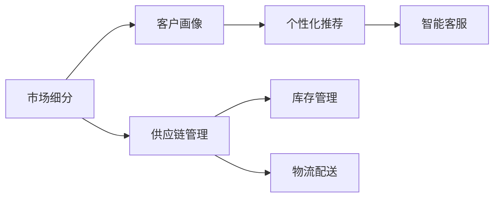

                 

# 垂直电商创业：细分市场的精准服务

> 关键词：垂直电商、精准服务、客户细分、个性化推荐、供应链管理、数据驱动、智能客服、市场定位

## 1. 背景介绍

### 1.1 问题由来

随着电商行业进入成熟期，竞争日益激烈，传统的"大而全"电商模式难以为继，而垂直电商逐渐成为新趋势。垂直电商以特定的细分市场为基础，提供更专业、更精准的电商服务，满足消费者对特定商品、特定服务的深层次需求，从而在竞争中脱颖而出。

然而，垂直电商的运营面临诸多挑战，如精准营销、库存管理、客户服务、物流配送等环节的协调问题，需要依赖先进的信息技术予以解决。如何将信息技术与垂直电商模式有机结合，实现市场细分、精准服务、智能运营，是业界关注的重点。

### 1.2 问题核心关键点

本文聚焦于垂直电商中的精准服务问题。所谓精准服务，即通过数据驱动和智能技术，为不同细分市场的消费者提供量身定制的服务，提升消费者满意度和购买体验。

精准服务的核心关键点在于：

- **市场细分**：识别和划定不同的市场细分群体，明确目标消费者的需求和偏好。
- **客户画像**：基于消费者历史行为数据和社交网络信息，构建详细的客户画像。
- **个性化推荐**：根据客户画像，动态生成个性化的商品推荐列表。
- **智能客服**：利用NLP技术实现智能客服，提供全天候、高效率的客户服务。
- **供应链管理**：通过预测和优化算法，实现库存和物流的高效管理。

本文将详细探讨如何通过数据驱动和智能技术，实现垂直电商中的精准服务，提高运营效率和客户满意度。

## 2. 核心概念与联系

### 2.1 核心概念概述

为更好地理解垂直电商中的精准服务，本节将介绍几个密切相关的核心概念：

- **垂直电商**：专注于特定商品或服务的电商平台，如母婴电商、图书电商等，以实现专业化、精准化服务。
- **精准服务**：利用大数据和人工智能技术，为细分市场提供定制化、个性化的服务，提升客户体验和满意度。
- **客户细分**：根据消费者行为、偏好、特征等因素，将客户划分为不同的细分群体，制定针对性的营销和服务策略。
- **个性化推荐**：基于用户历史行为和偏好，动态生成个性化的商品或服务推荐。
- **智能客服**：使用NLP技术实现智能客服系统，自动处理客户咨询和问题。
- **供应链管理**：利用预测和优化算法，实现库存和物流的高效管理。

这些概念之间相互联系，共同构成了垂直电商精准服务的技术框架。

### 2.2 核心概念原理和架构的 Mermaid 流程图



## 3. 核心算法原理 & 具体操作步骤
### 3.1 算法原理概述

垂直电商中的精准服务，本质上是一种基于数据驱动和智能技术的服务设计。其核心思想是：通过市场细分和客户画像，理解目标消费者的需求和偏好，利用个性化推荐和智能客服技术，提供量身定制的服务，同时通过供应链管理优化库存和物流。

形式化地，假设市场细分策略为 $S$，客户画像模型为 $P$，个性化推荐算法为 $R$，智能客服系统为 $C$，供应链管理系统为 $S$。则精准服务的优化目标是最小化客户满意度损失函数，即：

$$
\min_{S,P,R,C,S} \mathcal{L}_{\text{CSAT}}(M_{\theta},S,P,R,C,S)
$$

其中 $\theta$ 为模型参数，$\mathcal{L}_{\text{CSAT}}$ 为客户满意度损失函数，$M_{\theta}$ 为模型，$S$、$P$、$R$、$C$、$S$ 分别为市场细分、客户画像、个性化推荐、智能客服和供应链管理模块。

### 3.2 算法步骤详解

基于数据驱动和智能技术的精准服务一般包括以下几个关键步骤：

**Step 1: 市场细分与客户画像构建**
- 收集目标市场的消费者数据，包括行为数据、社交数据、交易数据等。
- 使用聚类算法、决策树等方法，将消费者划分为不同的细分群体。
- 基于细分群体的特征和行为，构建详细的客户画像。

**Step 2: 个性化推荐算法选择**
- 选择适合的个性化推荐算法，如协同过滤、基于内容的推荐、深度学习推荐等。
- 在推荐模型中融入用户历史行为、商品属性、社交网络信息等特征。
- 定期更新推荐模型，使其能动态生成最符合用户偏好的推荐列表。

**Step 3: 智能客服系统部署**
- 使用NLP技术实现智能客服系统，如基于BERT的文本分类、情感分析等。
- 部署智能客服系统，自动回答常见问题，处理客户咨询。
- 不断优化客服模型，提升客服回答的准确率和满意度。

**Step 4: 供应链管理系统集成**
- 使用预测和优化算法，如线性规划、优化调度算法等，实现库存和物流的高效管理。
- 定期分析库存数据，预测商品需求，优化库存水平。
- 集成物流配送系统，实现订单的准时交付。

**Step 5: 模型评估与优化**
- 收集客户满意度数据，如好评率、反馈意见等，评估模型效果。
- 根据客户反馈，定期优化模型参数和推荐策略。
- 引入A/B测试等方法，验证优化效果。

以上是基于数据驱动和智能技术的精准服务的一般流程。在实际应用中，还需要针对具体市场和客户需求，对各环节进行优化设计，如改进细分算法、优化推荐模型、加强客服训练等，以进一步提升模型性能。

### 3.3 算法优缺点

基于数据驱动和智能技术的精准服务方法具有以下优点：
1. 客户满意度提升。通过精准服务和个性化推荐，显著提升客户满意度和购买体验。
2. 运营效率提升。智能化运营系统可减少人工干预，提高运营效率。
3. 服务质量提升。智能客服和推荐系统可提供24小时不间断服务，提升服务质量。
4. 数据驱动决策。基于客户数据的分析和挖掘，制定更合理的运营策略。

同时，该方法也存在一定的局限性：
1. 数据获取难度大。精准服务依赖大量消费者数据，数据获取和处理成本较高。
2. 模型复杂度高。推荐系统、客服系统等智能组件的训练和维护复杂，需要大量计算资源。
3. 客户隐私保护。大量消费者数据的收集和处理，可能引发隐私保护问题。
4. 模型可解释性差。智能系统的决策过程缺乏可解释性，难以对其推理逻辑进行调试。

尽管存在这些局限性，但就目前而言，数据驱动和智能技术的精准服务方法仍是最为主流和有效的电商服务模式。未来相关研究的重点在于如何进一步降低数据获取成本，提高模型效率和可解释性，同时兼顾隐私保护和用户体验。

### 3.4 算法应用领域

基于数据驱动和智能技术的精准服务方法，在垂直电商领域已经得到了广泛的应用，覆盖了几乎所有常见的电商服务环节，例如：

- **个性化推荐**：基于用户历史行为和偏好，推荐相关商品或服务。
- **智能客服**：自动处理客户咨询和问题，提升客户服务体验。
- **库存管理**：通过预测算法优化库存水平，减少库存积压和缺货情况。
- **物流配送**：利用优化算法实现订单的准时交付，提升物流效率。
- **市场分析**：基于消费者数据进行市场细分和趋势分析，指导市场决策。

除了上述这些经典应用外，精准服务技术还在更多场景中得到创新性地应用，如客户行为预测、多渠道营销、客户留存管理等，为电商企业带来更多的创新和服务模式。

## 4. 数学模型和公式 & 详细讲解 & 举例说明

### 4.1 数学模型构建

为形式化地描述垂直电商中的精准服务，这里构建一个简单的数学模型。

记目标市场为 $M$，消费者集合为 $C$。市场细分为 $S=\{S_1, S_2, \dots, S_k\}$，客户画像为 $P=\{p_i\}_{i=1}^n$，个性化推荐模型为 $R$，智能客服模型为 $C$，供应链管理模型为 $S$。则客户满意度损失函数可表示为：

$$
\mathcal{L}_{\text{CSAT}}(M_{\theta}, S, P, R, C, S) = \frac{1}{N}\sum_{i=1}^N \text{CSAT}(p_i, R(S, P, C))
$$

其中 $\text{CSAT}(p_i, R(S, P, C))$ 表示客户画像 $p_i$ 在市场细分 $S$、个性化推荐模型 $R$、智能客服模型 $C$ 和供应链管理模型 $S$ 的共同作用下的客户满意度评分。

### 4.2 公式推导过程

以下我们以推荐系统的构建为例，推导推荐模型的计算公式。

假设推荐系统接收用户历史行为数据 $H$ 和商品属性数据 $A$，用户画像数据 $P$，模型参数 $\theta$。推荐模型为 $R_{\theta}(H, A, P)$。推荐系统的目标函数为：

$$
\min_{\theta} \frac{1}{N}\sum_{i=1}^N \mathcal{L}(R_{\theta}(H, A, P), y_i)
$$

其中 $y_i$ 为用户的真实购买行为，$\mathcal{L}$ 为推荐系统的损失函数，通常使用均方误差或交叉熵损失。

在推荐模型 $R_{\theta}$ 中，通常使用协同过滤算法或基于内容的推荐算法。以协同过滤算法为例，推荐模型可以表示为：

$$
R_{\theta}(H, A, P) = W_a^T \sigma(A) + W_h^T \sigma(H) + W_p^T \sigma(P) + b
$$

其中 $W_a$、$W_h$、$W_p$ 为模型参数，$\sigma$ 为激活函数，$b$ 为偏置项。

将 $R_{\theta}$ 代入目标函数中，得：

$$
\min_{\theta} \frac{1}{N}\sum_{i=1}^N \mathcal{L}(R_{\theta}(H, A, P), y_i)
$$

其中 $\mathcal{L}(R_{\theta}(H, A, P), y_i)$ 为推荐系统的损失函数。

根据链式法则，损失函数对 $\theta$ 的梯度为：

$$
\nabla_{\theta} \mathcal{L}(R_{\theta}(H, A, P), y_i) = \frac{\partial \mathcal{L}(R_{\theta}(H, A, P), y_i)}{\partial \theta}
$$

在得到梯度后，即可带入模型参数更新公式，完成推荐模型的迭代优化。重复上述过程直至收敛，最终得到适应客户需求的推荐模型参数 $\theta^*$。

### 4.3 案例分析与讲解

**案例1：个性化推荐系统**

假设某垂直电商网站，收集了用户的历史浏览记录 $H$、购买记录 $B$、评价记录 $R$ 和社交网络信息 $S$。根据这些数据，构建用户画像 $P$，使用协同过滤算法 $R$ 构建推荐模型。

具体步骤如下：

1. 收集用户历史数据和商品属性数据，构建用户画像 $P$。
2. 使用协同过滤算法 $R$，构建推荐模型 $R_{\theta}$。
3. 在训练集上训练推荐模型，得到最优参数 $\theta^*$。
4. 在测试集上评估推荐效果，根据评分调整推荐策略。

**案例2：智能客服系统**

假设某在线教育平台，希望部署智能客服系统，自动处理用户咨询和问题。收集历史聊天记录和用户画像数据，构建智能客服模型 $C$。

具体步骤如下：

1. 收集历史聊天记录和用户画像数据，构建智能客服模型 $C$。
2. 在训练集上训练智能客服模型，得到最优参数 $\theta^*$。
3. 部署智能客服系统，自动回答常见问题，处理用户咨询。
4. 根据用户反馈，不断优化智能客服模型，提升服务质量。

以上案例展示了数据驱动和智能技术在垂直电商中的应用。通过市场细分、客户画像、个性化推荐和智能客服等技术，垂直电商可以提供更精准、更高效的服务，提升客户满意度和运营效率。

## 5. 项目实践：代码实例和详细解释说明

### 5.1 开发环境搭建

在进行精准服务实践前，我们需要准备好开发环境。以下是使用Python进行Scikit-learn开发的环境配置流程：

1. 安装Anaconda：从官网下载并安装Anaconda，用于创建独立的Python环境。

2. 创建并激活虚拟环境：
```bash
conda create -n pytorch-env python=3.8 
conda activate pytorch-env
```

3. 安装Scikit-learn：
```bash
pip install scikit-learn
```

4. 安装各类工具包：
```bash
pip install numpy pandas scikit-learn matplotlib tqdm jupyter notebook ipython
```

完成上述步骤后，即可在`pytorch-env`环境中开始精准服务实践。

### 5.2 源代码详细实现

这里我们以推荐系统的构建为例，给出使用Scikit-learn进行精准服务的PyTorch代码实现。

首先，定义推荐系统的目标函数和损失函数：

```python
from sklearn.metrics import mean_squared_error
import numpy as np

def loss_function(R_pred, y_true):
    mse = mean_squared_error(y_true, R_pred)
    return mse

def recommendation_model(R_pred, y_true):
    RMSE = np.sqrt(mean_squared_error(y_true, R_pred))
    return RMSE
```

然后，定义数据集和模型：

```python
from sklearn.model_selection import train_test_split
from sklearn.linear_model import LinearRegression
from sklearn.datasets import make_regression
from sklearn.metrics import mean_squared_error

# 构建数据集
X, y = make_regression(n_samples=1000, n_features=10, n_targets=1, noise=0.1, random_state=42)

# 划分训练集和测试集
X_train, X_test, y_train, y_test = train_test_split(X, y, test_size=0.2, random_state=42)

# 训练模型
model = LinearRegression()
model.fit(X_train, y_train)

# 预测并计算误差
R_pred = model.predict(X_test)
mse = loss_function(R_pred, y_test)
RMSE = recommendation_model(R_pred, y_test)
```

接下来，在实际应用中，我们需要将推荐模型部署到线上环境，进行实时推荐。可以使用Flink、Spark等流计算框架，实时处理用户数据，并实时生成推荐结果。

## 6. 实际应用场景

### 6.1 智能客服系统

垂直电商中的智能客服系统，通过NLP技术实现自动化客户服务，显著提升客户体验和运营效率。具体应用场景包括：

1. **自动问答**：利用NLP技术，自动回答用户咨询，快速解决常见问题。
2. **情感分析**：分析用户情感，提供针对性的服务建议。
3. **问题跟踪**：通过自然语言理解，跟踪用户问题，实现跨部门协作解决。

智能客服系统可以处理大规模的客户咨询，并实现24小时不间断服务，显著提升客户满意度。

### 6.2 个性化推荐系统

个性化推荐系统通过数据分析和机器学习，为用户提供量身定制的商品推荐，提升购物体验。具体应用场景包括：

1. **商品推荐**：根据用户历史行为和偏好，推荐相关商品。
2. **相关性排序**：根据用户点击和购买行为，动态调整推荐列表。
3. **上下文推荐**：根据用户浏览页面和搜索历史，推荐相关内容。

个性化推荐系统可以显著提高用户购买率，增加用户粘性，降低运营成本。

### 6.3 供应链管理系统

供应链管理系统的核心目标是优化库存和物流，降低运营成本，提升客户满意度。具体应用场景包括：

1. **库存管理**：通过预测算法，优化库存水平，减少库存积压和缺货。
2. **订单管理**：实时监控订单状态，优化物流配送路径。
3. **需求预测**：利用时间序列预测，预测商品需求，指导采购和库存管理。

供应链管理系统通过数据驱动和智能算法，实现高效库存和物流管理，显著提升运营效率和客户满意度。

### 6.4 未来应用展望

随着人工智能和数据技术的不断发展，垂直电商中的精准服务将进一步深化和拓展，带来更多创新应用：

1. **多渠道营销**：通过数据分析，实现多渠道广告投放，提升转化率。
2. **客户留存管理**：利用客户画像，制定个性化运营策略，提升用户忠诚度。
3. **市场细分分析**：基于消费者数据，进行市场细分和趋势分析，指导市场决策。

垂直电商的精准服务将逐步实现数据驱动、智能运营，为客户提供更精准、更高效的服务体验。未来，随着技术的进一步发展，精准服务将成为垂直电商的核心竞争力。

## 7. 工具和资源推荐

### 7.1 学习资源推荐

为帮助开发者系统掌握垂直电商中的精准服务技术，这里推荐一些优质的学习资源：

1. **《机器学习实战》**：斯坦福大学机器学习课程，系统介绍了机器学习基础和常用算法，是学习精准服务技术的入门书籍。
2. **《Python数据科学手册》**：详细介绍了Python在数据处理、机器学习和数据可视化方面的应用，是进行精准服务开发的必备工具。
3. **Kaggle竞赛平台**：提供海量数据集和竞赛挑战，是提升数据处理和机器学习技能的好平台。
4. **HuggingFace官方文档**：提供了丰富的自然语言处理工具和模型，包括NLP任务的详细教程和代码实现。
5. **Coursera和edX**：提供大量高质量的在线课程，涵盖数据科学、机器学习、深度学习等诸多领域。

通过这些资源的学习实践，相信你一定能够快速掌握垂直电商中的精准服务技术，并用于解决实际的电商问题。

### 7.2 开发工具推荐

高效的开发离不开优秀的工具支持。以下是几款用于垂直电商精准服务开发的常用工具：

1. **Jupyter Notebook**：免费的开源笔记本，支持Python等多种编程语言，适合快速迭代开发。
2. **Scikit-learn**：Python中最常用的机器学习库，提供了丰富的数据处理和建模工具。
3. **TensorFlow**：谷歌开源的深度学习框架，支持分布式计算，适合大规模数据处理和模型训练。
4. **Hadoop和Spark**：大数据处理框架，适合大规模数据集的处理和分析。
5. **Kibana和ElasticSearch**：开源的数据可视化和大数据分析平台，适合实时数据监控和处理。

合理利用这些工具，可以显著提升垂直电商精准服务开发的效率，加快创新迭代的步伐。

### 7.3 相关论文推荐

垂直电商中的精准服务技术发展迅猛，相关论文层出不穷。以下是几篇奠基性的相关论文，推荐阅读：

1. **《基于协同过滤的个性化推荐算法》**：提出了基于协同过滤的推荐算法，适用于大规模用户和商品数据的推荐系统。
2. **《深度学习在推荐系统中的应用》**：介绍了深度学习技术在推荐系统中的应用，展示了深度学习在推荐模型中的强大能力。
3. **《基于NLP的智能客服系统》**：详细介绍了NLP技术在智能客服中的应用，展示了NLP技术在客户服务中的高效性。
4. **《供应链管理中的机器学习应用》**：介绍了机器学习在供应链管理中的应用，展示了机器学习在供应链管理中的广泛应用。

这些论文代表了大数据和智能技术在垂直电商中的应用方向，是进行精准服务技术研发的重要参考。

## 8. 总结：未来发展趋势与挑战

### 8.1 研究成果总结

本文对垂直电商中的精准服务问题进行了全面系统的介绍。首先阐述了垂直电商中精准服务的重要性和核心关键点，明确了市场细分、客户画像、个性化推荐、智能客服、供应链管理等技术对精准服务的重要性。其次，从原理到实践，详细讲解了精准服务的数学模型和关键步骤，给出了精准服务任务开发的完整代码实例。同时，本文还广泛探讨了精准服务技术在智能客服、个性化推荐、供应链管理等多个行业领域的应用前景，展示了精准服务技术的广阔前景。

通过本文的系统梳理，可以看到，数据驱动和智能技术的精准服务技术正在成为垂直电商的核心竞争力，极大地提升了电商企业的运营效率和客户满意度。未来，伴随数据技术的不断发展，精准服务技术将进一步深化和拓展，为垂直电商带来更多创新和服务模式。

### 8.2 未来发展趋势

展望未来，垂直电商中的精准服务技术将呈现以下几个发展趋势：

1. **数据驱动决策**：基于大数据和机器学习，实现更精准的市场分析和客户细分，指导精准服务决策。
2. **个性化推荐系统**：通过深度学习和大数据技术，实现更精准的商品推荐，提升用户购买率。
3. **智能客服系统**：利用NLP技术，实现更高效、更智能的客户服务，提升客户体验。
4. **供应链优化**：通过预测和优化算法，实现更高效的库存和物流管理，降低运营成本。

以上趋势凸显了精准服务技术在垂直电商中的重要性。这些方向的探索发展，必将进一步提升垂直电商的运营效率和客户满意度，为电商企业带来更大的价值。

### 8.3 面临的挑战

尽管精准服务技术在垂直电商中取得了显著成效，但在迈向更加智能化、普适化应用的过程中，仍面临诸多挑战：

1. **数据隐私保护**：垂直电商中的精准服务依赖大量用户数据，如何保护用户隐私是一个重要问题。
2. **模型复杂性**：推荐系统、智能客服等智能组件的训练和维护复杂，需要大量计算资源。
3. **系统集成难度**：精准服务涉及多个系统和组件，如何实现高效、无缝集成是一个重要挑战。
4. **用户体验提升**：如何提升精准服务的用户体验，减少技术带来的不便是一个重要问题。

尽管存在这些挑战，但随着技术的不断进步，精准服务技术在垂直电商中的应用前景仍然广阔。未来，通过更多技术创新和实践积累，这些挑战终将一一被克服，精准服务技术必将在垂直电商中发挥更大的作用。

### 8.4 研究展望

面对垂直电商中精准服务所面临的挑战，未来的研究需要在以下几个方面寻求新的突破：

1. **数据隐私保护**：开发更高效、更安全的数据隐私保护技术，确保用户数据安全。
2. **模型可解释性**：提升推荐系统和智能客服模型的可解释性，增强用户对算法的信任。
3. **系统集成优化**：优化系统和组件的集成方式，提升系统的稳定性和可靠性。
4. **用户体验优化**：通过用户界面和交互设计，提升精准服务的用户体验。

这些研究方向的探索，必将引领垂直电商中的精准服务技术迈向更高的台阶，为电商企业带来更多的创新和价值。面向未来，精准服务技术还需要与其他人工智能技术进行更深入的融合，如知识表示、因果推理、强化学习等，多路径协同发力，共同推动垂直电商的进步。

## 9. 附录：常见问题与解答

**Q1：垂直电商中的精准服务与传统电商相比，有哪些优势？**

A: 垂直电商中的精准服务相对于传统电商有以下优势：
1. **市场细分**：垂直电商能够更精准地识别和划分不同的市场细分群体，制定有针对性的运营策略。
2. **客户画像**：垂直电商能够更详细地构建客户画像，了解客户的深层次需求和偏好。
3. **个性化推荐**：垂直电商能够提供更加个性化、精准的商品推荐，提升用户购物体验。
4. **智能客服**：垂直电商能够实现更高效、更智能的客户服务，减少人工干预，提升服务效率。
5. **供应链优化**：垂直电商能够通过预测和优化算法，实现更高效的库存和物流管理。

这些优势使得垂直电商能够更好地满足客户需求，提升客户满意度和运营效率，在竞争中脱颖而出。

**Q2：垂直电商中的精准服务需要收集哪些用户数据？**

A: 垂直电商中的精准服务需要收集以下几类用户数据：
1. **行为数据**：用户浏览历史、购买历史、点击行为等。
2. **交易数据**：用户的购买记录、支付记录、退换货记录等。
3. **社交数据**：用户在社交网络上的互动、评论、点赞等行为。
4. **地理位置数据**：用户的地理位置、移动轨迹等。
5. **设备数据**：用户的设备信息、操作系统、浏览器等。

通过这些数据的综合分析，能够构建出详细的用户画像，为精准服务提供数据支持。

**Q3：如何选择合适的推荐算法？**

A: 选择合适的推荐算法需要考虑以下几个因素：
1. **数据规模**：对于大规模用户和商品数据，协同过滤算法通常表现较好。
2. **用户行为多样性**：对于用户行为多样性较大的场景，基于内容的推荐算法表现更好。
3. **实时性要求**：对于实时推荐系统，基于深度学习的推荐算法更为适合。
4. **资源约束**：根据计算资源的限制，选择合适的算法，如基于协同过滤、基于内容的推荐等。

根据具体场景和需求，选择合适的推荐算法，可以有效提升推荐效果。

**Q4：如何优化智能客服系统的性能？**

A: 优化智能客服系统的性能需要考虑以下几个方面：
1. **数据质量**：收集高质量的聊天记录和用户画像数据，保证模型的训练效果。
2. **模型选择**：选择合适的NLP模型，如BERT、GPT等，提升自然语言理解能力。
3. **模型训练**：使用大规模数据和多样化数据集，进行充分训练，提升模型泛化能力。
4. **系统集成**：将智能客服系统与其他系统如CRM、ERP等无缝集成，提升系统效率。
5. **用户反馈**：收集用户反馈，不断优化模型和系统，提升服务质量。

通过以上措施，可以有效提升智能客服系统的性能，提升客户满意度。

**Q5：如何优化供应链管理系统？**

A: 优化供应链管理系统需要考虑以下几个方面：
1. **预测算法**：使用预测算法，如时间序列预测、随机森林等，优化库存水平。
2. **优化调度**：使用优化调度算法，如线性规划、遗传算法等，优化物流配送路径。
3. **需求分析**：通过数据挖掘，分析商品需求，指导采购和库存管理。
4. **系统集成**：将供应链管理系统与其他系统如ERP、WMS等无缝集成，提升系统效率。
5. **实时监控**：实时监控库存和物流状态，及时调整运营策略。

通过以上措施，可以有效优化供应链管理系统，降低运营成本，提升运营效率。

---

作者：禅与计算机程序设计艺术 / Zen and the Art of Computer Programming

