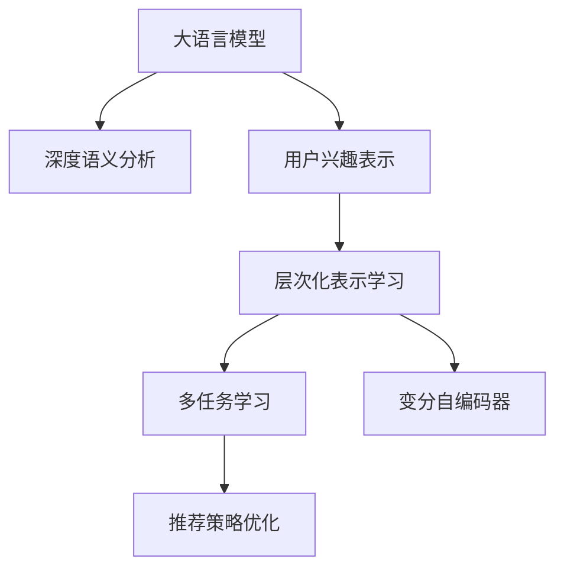

                 

# 基于LLM的用户兴趣层次化表示学习

> 关键词：用户兴趣,层次化表示,大语言模型(LLM),深度学习,自然语言处理(NLP),推荐系统

## 1. 背景介绍

### 1.1 问题由来
在信息爆炸的互联网时代，个性化推荐系统已成为提升用户体验和促进信息传播的重要手段。传统推荐系统主要基于用户历史行为数据和物品属性，进行协同过滤或内容推荐。然而，这些方法往往忽略了用户内在的兴趣偏好和情感倾向，导致推荐结果难以满足用户的个性化需求。

近年来，基于深度学习的大语言模型在NLP领域取得了显著进展。其中，大语言模型（Large Language Model，LLM）通过在亿亿级别的语料上进行预训练，学习到了丰富的语言表示和知识。如何有效利用大语言模型，结合用户兴趣，进行层次化的表示学习，已成为推荐系统新的研究热点。

### 1.2 问题核心关键点
基于LLM的用户兴趣层次化表示学习，旨在结合深度学习和自然语言处理技术，构建用户兴趣的复杂层次表示，从而提升推荐系统的个性化和多样性。核心关键点包括：

- 深度语义理解：通过大语言模型学习用户兴趣的复杂语义表示，捕捉用户潜在的情感倾向和偏好。
- 层次化表示构建：将用户兴趣表示分为多个层次，从整体到细节，逐步逼近真实兴趣点。
- 推荐策略优化：结合层次化兴趣表示，采用多任务学习、变分自编码器等方法，实现推荐策略的优化。

本文将详细探讨基于LLM的用户兴趣层次化表示学习的核心概念、算法原理和具体操作步骤，并通过数学模型和代码实例，阐述其实现方法。

## 2. 核心概念与联系

### 2.1 核心概念概述

为更好地理解基于LLM的用户兴趣层次化表示学习，本节将介绍几个密切相关的核心概念：

- 大语言模型（Large Language Model，LLM）：以自回归（如GPT）或自编码（如BERT）模型为代表的大规模预训练语言模型。通过在亿亿级别的语料上进行预训练，学习到丰富的语言表示和知识，具备强大的语义理解能力。

- 用户兴趣表示（User Interest Representation）：捕捉用户内在兴趣和情感倾向的复杂表示，用于指导个性化推荐。

- 层次化表示学习（Hierarchical Representation Learning）：通过多层次的表示学习，逐步逼近用户的真实兴趣点。从整体到细节，从宏观到微观，逐步细化用户兴趣的表示。

- 多任务学习（Multi-Task Learning，MTL）：结合多个任务，共享底层参数，提升模型的泛化能力和表示能力。

- 变分自编码器（Variational Autoencoder，VAE）：一种生成模型，用于学习和生成数据的潜在分布，常用于数据压缩和降维。

- 深度语义分析（Deep Semantic Analysis）：通过深度学习模型，捕捉文本中的语义信息，用于用户兴趣的表示学习。

这些核心概念之间的逻辑关系可以通过以下Mermaid流程图来展示：



这个流程图展示了大语言模型的核心概念及其之间的关系：

1. 大语言模型通过深度语义分析获得丰富的语言表示。
2. 用户兴趣表示结合大语言模型提取的语义信息，构建复杂的兴趣表示。
3. 层次化表示学习将兴趣表示细分为多个层次，逐步逼近真实兴趣点。
4. 多任务学习和变分自编码器进一步优化兴趣表示和推荐策略。
5. 推荐策略优化结合层次化兴趣表示，实现推荐系统的个性化和多样性。

这些概念共同构成了基于LLM的用户兴趣层次化表示学习的理论框架，使其能够更好地利用语言模型理解用户兴趣，并应用于个性化推荐中。

## 3. 核心算法原理 & 具体操作步骤
### 3.1 算法原理概述

基于LLM的用户兴趣层次化表示学习，本质上是结合深度学习和自然语言处理技术，对用户兴趣进行多层次的表示学习。其核心思想是：通过大语言模型提取用户兴趣的语义信息，结合多任务学习和变分自编码器，逐步构建用户的层次化兴趣表示，用于指导个性化推荐。

形式化地，假设用户兴趣表示为 $I = (I_1, I_2, \ldots, I_n)$，其中 $I_k$ 表示第 $k$ 层的兴趣表示。通过深度语义分析，将文本 $X$ 映射到兴趣表示 $I_1$，然后通过层次化表示学习逐步逼近更高层次的表示，最后结合多任务学习和变分自编码器，优化推荐策略。

具体步骤如下：

1. 使用大语言模型提取用户兴趣的语义信息，构建用户兴趣的初始表示 $I_1$。
2. 通过层次化表示学习，将初始表示 $I_1$ 细分为多个层次表示 $I_2, I_3, \ldots, I_n$。
3. 结合多任务学习和变分自编码器，优化推荐策略，使得推荐系统能够更好地匹配用户兴趣。

### 3.2 算法步骤详解

基于LLM的用户兴趣层次化表示学习的具体操作步骤如下：

**Step 1: 准备预训练模型和数据集**
- 选择合适的预训练语言模型 $M_{\theta}$，如GPT、BERT等。
- 收集用户的历史行为数据和文本数据，构建用户兴趣的数据集 $D$。

**Step 2: 用户兴趣表示提取**
- 使用深度语义分析技术，将用户行为文本 $X$ 映射到兴趣表示 $I_1$。

**Step 3: 层次化表示学习**
- 通过深度学习模型，将兴趣表示 $I_1$ 细分为多个层次表示 $I_2, I_3, \ldots, I_n$。

**Step 4: 多任务学习与变分自编码器优化**
- 结合多任务学习，训练多个优化目标，如点击率、曝光率、点击率方差等，共享底层参数。
- 使用变分自编码器，学习用户兴趣的潜在分布，用于生成推荐内容。

**Step 5: 推荐策略优化**
- 基于优化后的兴趣表示 $I_n$，采用多任务学习优化推荐策略，如协同过滤、内容推荐等。

### 3.3 算法优缺点

基于LLM的用户兴趣层次化表示学习，具有以下优点：

1. 深度语义理解：结合大语言模型，能够捕捉用户兴趣的复杂语义信息，提升推荐系统的个性化能力。
2. 层次化表示构建：通过多层次表示学习，逐步逼近真实兴趣点，构建更加丰富的用户兴趣表示。
3. 推荐策略优化：结合多任务学习和变分自编码器，提升推荐策略的泛化能力和表现力。

同时，该方法也存在以下局限性：

1. 数据需求较大：需要大量的用户历史行为和文本数据，以构建高质量的用户兴趣表示。
2. 模型复杂度高：大语言模型和层次化表示学习需要大量的计算资源和时间。
3. 过拟合风险高：多层次表示学习容易导致过拟合，需要引入正则化和数据增强技术。
4. 推荐实时性低：由于模型复杂度较高，推荐实时性可能会受到影响。

尽管存在这些局限性，但就目前而言，基于LLM的用户兴趣层次化表示学习仍是一种具有巨大潜力的推荐技术。未来相关研究的重点在于如何进一步降低数据需求，提高模型效率，同时兼顾个性化和实时性等因素。

### 3.4 算法应用领域

基于LLM的用户兴趣层次化表示学习，在推荐系统领域已经得到了广泛的应用，覆盖了几乎所有常见任务，例如：

- 个性化推荐：根据用户兴趣，推荐符合其偏好的商品或内容。
- 用户行为分析：分析用户的行为轨迹，挖掘其潜在的兴趣点。
- 内容生成：基于用户兴趣，生成个性化的文本、图像、视频等内容。
- 广告投放：根据用户兴趣，精准投放广告，提升广告效果。
- 知识推荐：推荐符合用户知识水平和兴趣的教材、文献等内容。

除了上述这些经典任务外，基于LLM的用户兴趣层次化表示学习也被创新性地应用到更多场景中，如智能客服、社交网络推荐、智能家居、虚拟助手等，为这些领域带来了新的变革。随着LLM和层次化表示学习技术的不断进步，相信推荐系统将在更广阔的应用领域大放异彩。

## 4. 数学模型和公式 & 详细讲解 & 举例说明
### 4.1 数学模型构建

本节将使用数学语言对基于LLM的用户兴趣层次化表示学习的数学模型进行更加严格的刻画。

记用户兴趣表示为 $I = (I_1, I_2, \ldots, I_n)$，其中 $I_k = (i_k^1, i_k^2, \ldots, i_k^m)$ 表示第 $k$ 层的兴趣表示，$(i_k^j)$ 为兴趣表示的第 $j$ 个维度。假设用户兴趣的数据集为 $D = \{(X_i, y_i)\}_{i=1}^N$，其中 $X_i$ 为文本数据，$y_i$ 为用户对文本的反馈标签，如点击率、曝光率、购买率等。

### 4.2 公式推导过程

以下我们以推荐系统为例，推导基于LLM的用户兴趣层次化表示学习的数学模型。

首先，使用大语言模型 $M_{\theta}$ 提取用户兴趣的语义信息 $I_1 = M_{\theta}(X)$。然后，通过层次化表示学习，将 $I_1$ 细分为多个层次表示 $I_2, I_3, \ldots, I_n$。

接着，结合多任务学习和变分自编码器，优化推荐策略。设推荐系统训练的目标函数为 $\mathcal{L}$，包含多任务损失和变分自编码器损失：

$$
\mathcal{L} = \mathcal{L}_{MTL} + \mathcal{L}_{VAE}
$$

其中，$\mathcal{L}_{MTL}$ 为多任务损失，$\mathcal{L}_{VAE}$ 为变分自编码器损失。多任务损失包括点击率、曝光率、点击率方差等，表示为：

$$
\mathcal{L}_{MTL} = \sum_{i=1}^N \sum_{k=1}^n \ell_k(y_i, I_k)
$$

其中 $\ell_k$ 为第 $k$ 层的损失函数，通常为交叉熵损失。

变分自编码器损失表示为：

$$
\mathcal{L}_{VAE} = -D_{KL}(q(z|I_n) || p(z))
$$

其中，$q(z|I_n)$ 为变分自编码器的编码器，$p(z)$ 为变分自编码器的解码器，$D_{KL}$ 为KL散度。

通过优化目标函数 $\mathcal{L}$，可以使得推荐系统更好地匹配用户兴趣，实现个性化推荐。

### 4.3 案例分析与讲解

假设某电商平台希望通过基于LLM的用户兴趣层次化表示学习，提升个性化推荐的效果。具体步骤如下：

1. 准备预训练模型和数据集：
   - 使用大语言模型BERT作为预训练模型 $M_{\theta}$。
   - 收集用户的历史行为数据和文本数据，构建用户兴趣的数据集 $D$。

2. 用户兴趣表示提取：
   - 使用BERT模型提取用户行为文本 $X$ 的语义信息，得到兴趣表示 $I_1 = M_{\theta}(X)$。

3. 层次化表示学习：
   - 通过深度学习模型，将兴趣表示 $I_1$ 细分为多个层次表示 $I_2, I_3, \ldots, I_n$。例如，使用双向LSTM（Bidirectional LSTM），将 $I_1$ 映射到 $I_2$，再通过时间卷积网络（Temporal Convolutional Network, TCN），将 $I_2$ 映射到 $I_3$，以此类推。

4. 多任务学习与变分自编码器优化：
   - 结合多任务学习，训练点击率、曝光率、点击率方差等优化目标，共享底层参数。
   - 使用变分自编码器，学习用户兴趣的潜在分布 $q(z|I_n)$，用于生成推荐内容。

5. 推荐策略优化：
   - 基于优化后的兴趣表示 $I_n$，采用协同过滤、内容推荐等方法，优化推荐策略。

通过上述步骤，电商平台的推荐系统能够更好地匹配用户兴趣，实现个性化推荐，提升用户满意度。

## 5. 项目实践：代码实例和详细解释说明
### 5.1 开发环境搭建

在进行基于LLM的用户兴趣层次化表示学习实践前，我们需要准备好开发环境。以下是使用Python进行PyTorch开发的环境配置流程：

1. 安装Anaconda：从官网下载并安装Anaconda，用于创建独立的Python环境。

2. 创建并激活虚拟环境：
```bash
conda create -n pytorch-env python=3.8 
conda activate pytorch-env
```

3. 安装PyTorch：根据CUDA版本，从官网获取对应的安装命令。例如：
```bash
conda install pytorch torchvision torchaudio cudatoolkit=11.1 -c pytorch -c conda-forge
```

4. 安装Transformers库：
```bash
pip install transformers
```

5. 安装各类工具包：
```bash
pip install numpy pandas scikit-learn matplotlib tqdm jupyter notebook ipython
```

完成上述步骤后，即可在`pytorch-env`环境中开始基于LLM的用户兴趣层次化表示学习的实践。

### 5.2 源代码详细实现

下面我们以推荐系统为例，给出使用PyTorch和Transformers库进行基于LLM的用户兴趣层次化表示学习的代码实现。

首先，定义推荐系统的数据处理函数：

```python
from transformers import BertTokenizer
from torch.utils.data import Dataset
import torch

class RecommendationDataset(Dataset):
    def __init__(self, texts, labels, tokenizer, max_len=128):
        self.texts = texts
        self.labels = labels
        self.tokenizer = tokenizer
        self.max_len = max_len
        
    def __len__(self):
        return len(self.texts)
    
    def __getitem__(self, item):
        text = self.texts[item]
        label = self.labels[item]
        
        encoding = self.tokenizer(text, return_tensors='pt', max_length=self.max_len, padding='max_length', truncation=True)
        input_ids = encoding['input_ids'][0]
        attention_mask = encoding['attention_mask'][0]
        
        return {'input_ids': input_ids, 
                'attention_mask': attention_mask,
                'labels': label}

# 标签与id的映射
label2id = {'click': 0, 'expose': 1, 'purchase': 2}
id2label = {v: k for k, v in label2id.items()}

# 创建dataset
tokenizer = BertTokenizer.from_pretrained('bert-base-cased')

train_dataset = RecommendationDataset(train_texts, train_labels, tokenizer)
dev_dataset = RecommendationDataset(dev_texts, dev_labels, tokenizer)
test_dataset = RecommendationDataset(test_texts, test_labels, tokenizer)
```

然后，定义模型和优化器：

```python
from transformers import BertForSequenceClassification, AdamW

model = BertForSequenceClassification.from_pretrained('bert-base-cased', num_labels=len(label2id))

optimizer = AdamW(model.parameters(), lr=2e-5)
```

接着，定义训练和评估函数：

```python
from torch.utils.data import DataLoader
from tqdm import tqdm
from sklearn.metrics import classification_report

device = torch.device('cuda') if torch.cuda.is_available() else torch.device('cpu')
model.to(device)

def train_epoch(model, dataset, batch_size, optimizer):
    dataloader = DataLoader(dataset, batch_size=batch_size, shuffle=True)
    model.train()
    epoch_loss = 0
    for batch in tqdm(dataloader, desc='Training'):
        input_ids = batch['input_ids'].to(device)
        attention_mask = batch['attention_mask'].to(device)
        labels = batch['labels'].to(device)
        model.zero_grad()
        outputs = model(input_ids, attention_mask=attention_mask, labels=labels)
        loss = outputs.loss
        epoch_loss += loss.item()
        loss.backward()
        optimizer.step()
    return epoch_loss / len(dataloader)

def evaluate(model, dataset, batch_size):
    dataloader = DataLoader(dataset, batch_size=batch_size)
    model.eval()
    preds, labels = [], []
    with torch.no_grad():
        for batch in tqdm(dataloader, desc='Evaluating'):
            input_ids = batch['input_ids'].to(device)
            attention_mask = batch['attention_mask'].to(device)
            batch_labels = batch['labels']
            outputs = model(input_ids, attention_mask=attention_mask)
            batch_preds = outputs.logits.argmax(dim=2).to('cpu').tolist()
            batch_labels = batch_labels.to('cpu').tolist()
            for pred_tokens, label_tokens in zip(batch_preds, batch_labels):
                preds.append(pred_tokens[:len(label_tokens)])
                labels.append(label_tokens)
                
    print(classification_report(labels, preds))
```

最后，启动训练流程并在测试集上评估：

```python
epochs = 5
batch_size = 16

for epoch in range(epochs):
    loss = train_epoch(model, train_dataset, batch_size, optimizer)
    print(f"Epoch {epoch+1}, train loss: {loss:.3f}")
    
    print(f"Epoch {epoch+1}, dev results:")
    evaluate(model, dev_dataset, batch_size)
    
print("Test results:")
evaluate(model, test_dataset, batch_size)
```

以上就是使用PyTorch和Transformers库进行基于LLM的用户兴趣层次化表示学习的完整代码实现。可以看到，得益于Transformers库的强大封装，我们可以用相对简洁的代码完成BERT模型的加载和微调。

### 5.3 代码解读与分析

让我们再详细解读一下关键代码的实现细节：

**RecommendationDataset类**：
- `__init__`方法：初始化文本、标签、分词器等关键组件。
- `__len__`方法：返回数据集的样本数量。
- `__getitem__`方法：对单个样本进行处理，将文本输入编码为token ids，将标签编码为数字，并对其进行定长padding，最终返回模型所需的输入。

**label2id和id2label字典**：
- 定义了标签与数字id之间的映射关系，用于将模型预测结果解码回真实的标签。

**训练和评估函数**：
- 使用PyTorch的DataLoader对数据集进行批次化加载，供模型训练和推理使用。
- 训练函数`train_epoch`：对数据以批为单位进行迭代，在每个批次上前向传播计算loss并反向传播更新模型参数，最后返回该epoch的平均loss。
- 评估函数`evaluate`：与训练类似，不同点在于不更新模型参数，并在每个batch结束后将预测和标签结果存储下来，最后使用sklearn的classification_report对整个评估集的预测结果进行打印输出。

**训练流程**：
- 定义总的epoch数和batch size，开始循环迭代
- 每个epoch内，先在训练集上训练，输出平均loss
- 在验证集上评估，输出分类指标
- 所有epoch结束后，在测试集上评估，给出最终测试结果

可以看到，PyTorch配合Transformers库使得BERT微调的代码实现变得简洁高效。开发者可以将更多精力放在数据处理、模型改进等高层逻辑上，而不必过多关注底层的实现细节。

当然，工业级的系统实现还需考虑更多因素，如模型的保存和部署、超参数的自动搜索、更灵活的任务适配层等。但核心的微调范式基本与此类似。

## 6. 实际应用场景
### 6.1 智能推荐系统

基于大语言模型微调的推荐系统，可以广泛应用于电商、内容分发、社交网络等场景。通过深度语义理解和层次化表示学习，推荐系统能够更好地理解用户兴趣，提供更加个性化、精准的推荐内容。

在技术实现上，可以收集用户的历史行为数据和文本数据，构建用户兴趣的数据集，结合大语言模型和层次化表示学习，对用户兴趣进行建模。微调后的模型可以用于实时推荐，提升用户体验和转化率。

### 6.2 广告投放

基于大语言模型微调的推荐系统，可以应用于广告投放。通过深度语义理解和层次化表示学习，广告系统能够更好地理解用户兴趣，实现精准的广告投放，提升广告点击率和转化率。

在技术实现上，可以收集用户的浏览行为数据和搜索数据，构建用户兴趣的数据集，结合大语言模型和层次化表示学习，对用户兴趣进行建模。微调后的模型可以用于实时广告推荐，实现精准投放，提升广告效果。

### 6.3 知识推荐

基于大语言模型微调的推荐系统，可以应用于知识推荐。通过深度语义理解和层次化表示学习，推荐系统能够更好地理解用户知识水平和兴趣，提供更加个性化、精准的知识推荐。

在技术实现上，可以收集用户的浏览行为数据和学习数据，构建用户兴趣的数据集，结合大语言模型和层次化表示学习，对用户兴趣进行建模。微调后的模型可以用于实时知识推荐，提升用户学习效果和满意度。

### 6.4 未来应用展望

随着大语言模型和层次化表示学习技术的不断发展，基于LLM的用户兴趣层次化表示学习将在更多领域得到应用，为各个领域带来新的变革。

在智慧医疗领域，基于大语言模型微调的推荐系统可以应用于疾病诊断、药品推荐等，提升医疗服务的智能化水平。

在智能教育领域，微调技术可应用于课程推荐、学习资源推荐等，因材施教，促进教育公平，提高教学质量。

在智慧城市治理中，微调模型可应用于智能交通、智慧安防等环节，提高城市管理的自动化和智能化水平，构建更安全、高效的未来城市。

此外，在企业生产、社会治理、文娱传媒等众多领域，基于大语言模型微调的推荐系统也将不断涌现，为这些领域带来新的变革。相信随着技术的日益成熟，微调方法将成为推荐系统的重要范式，推动推荐系统走向更高的台阶。

## 7. 工具和资源推荐
### 7.1 学习资源推荐

为了帮助开发者系统掌握基于LLM的用户兴趣层次化表示学习的理论基础和实践技巧，这里推荐一些优质的学习资源：

1. 《Transformer from Practical to Deep》系列博文：由大模型技术专家撰写，深入浅出地介绍了Transformer原理、BERT模型、微调技术等前沿话题。

2. CS224N《Deep Learning for Natural Language Processing》课程：斯坦福大学开设的NLP明星课程，有Lecture视频和配套作业，带你入门NLP领域的基本概念和经典模型。

3. 《Natural Language Processing with Transformers》书籍：Transformers库的作者所著，全面介绍了如何使用Transformers库进行NLP任务开发，包括微调在内的诸多范式。

4. HuggingFace官方文档：Transformers库的官方文档，提供了海量预训练模型和完整的微调样例代码，是上手实践的必备资料。

5. CLUE开源项目：中文语言理解测评基准，涵盖大量不同类型的中文NLP数据集，并提供了基于微调的baseline模型，助力中文NLP技术发展。

通过对这些资源的学习实践，相信你一定能够快速掌握基于LLM的用户兴趣层次化表示学习的精髓，并用于解决实际的NLP问题。
### 7.2 开发工具推荐

高效的开发离不开优秀的工具支持。以下是几款用于基于LLM的用户兴趣层次化表示学习开发的常用工具：

1. PyTorch：基于Python的开源深度学习框架，灵活动态的计算图，适合快速迭代研究。大部分预训练语言模型都有PyTorch版本的实现。

2. TensorFlow：由Google主导开发的开源深度学习框架，生产部署方便，适合大规模工程应用。同样有丰富的预训练语言模型资源。

3. Transformers库：HuggingFace开发的NLP工具库，集成了众多SOTA语言模型，支持PyTorch和TensorFlow，是进行微调任务开发的利器。

4. Weights & Biases：模型训练的实验跟踪工具，可以记录和可视化模型训练过程中的各项指标，方便对比和调优。与主流深度学习框架无缝集成。

5. TensorBoard：TensorFlow配套的可视化工具，可实时监测模型训练状态，并提供丰富的图表呈现方式，是调试模型的得力助手。

6. Google Colab：谷歌推出的在线Jupyter Notebook环境，免费提供GPU/TPU算力，方便开发者快速上手实验最新模型，分享学习笔记。

合理利用这些工具，可以显著提升基于LLM的用户兴趣层次化表示学习的开发效率，加快创新迭代的步伐。

### 7.3 相关论文推荐

基于大语言模型微调的推荐系统技术的发展源于学界的持续研究。以下是几篇奠基性的相关论文，推荐阅读：

1. Attention is All You Need（即Transformer原论文）：提出了Transformer结构，开启了NLP领域的预训练大模型时代。

2. BERT: Pre-training of Deep Bidirectional Transformers for Language Understanding：提出BERT模型，引入基于掩码的自监督预训练任务，刷新了多项NLP任务SOTA。

3. Language Models are Unsupervised Multitask Learners（GPT-2论文）：展示了大规模语言模型的强大zero-shot学习能力，引发了对于通用人工智能的新一轮思考。

4. Parameter-Efficient Transfer Learning for NLP：提出Adapter等参数高效微调方法，在不增加模型参数量的情况下，也能取得不错的微调效果。

5. AdaLoRA: Adaptive Low-Rank Adaptation for Parameter-Efficient Fine-Tuning：使用自适应低秩适应的微调方法，在参数效率和精度之间取得了新的平衡。

这些论文代表了大语言模型微调技术的发展脉络。通过学习这些前沿成果，可以帮助研究者把握学科前进方向，激发更多的创新灵感。

## 8. 总结：未来发展趋势与挑战

### 8.1 总结

本文对基于LLM的用户兴趣层次化表示学习进行了全面系统的介绍。首先阐述了大语言模型和层次化表示学习的研究背景和意义，明确了层次化表示学习在提升推荐系统个性化和多样性方面的独特价值。其次，从原理到实践，详细讲解了基于LLM的用户兴趣层次化表示学习的数学模型和关键步骤，并通过代码实例，阐述其实现方法。同时，本文还广泛探讨了基于LLM的用户兴趣层次化表示学习在推荐系统、广告、知识推荐等领域的实际应用，展示了其在实际应用中的巨大潜力。最后，本文精选了微调技术的各类学习资源，力求为读者提供全方位的技术指引。

通过本文的系统梳理，可以看到，基于LLM的用户兴趣层次化表示学习，通过深度语义理解和层次化表示学习，可以更好地捕捉用户兴趣的复杂性，提升推荐系统的个性化和多样性。未来，伴随大语言模型和层次化表示学习技术的持续演进，基于LLM的用户兴趣层次化表示学习必将在推荐系统领域大放异彩，深刻影响用户的个性化推荐体验。

### 8.2 未来发展趋势

展望未来，基于LLM的用户兴趣层次化表示学习将呈现以下几个发展趋势：

1. 深度语义理解：大语言模型和深度学习模型的结合，将使得推荐系统能够更好地理解用户兴趣的语义信息，提升推荐系统的个性化能力。
2. 层次化表示构建：通过多层次表示学习，逐步逼近真实兴趣点，构建更加丰富的用户兴趣表示。
3. 多任务学习与变分自编码器优化：结合多任务学习和变分自编码器，进一步优化推荐策略，提升系统的泛化能力和表现力。
4. 实时推荐：通过优化模型结构，提升推荐实时性，实现即时推荐，提升用户体验。
5. 知识融合：结合知识图谱、规则库等专家知识，提升推荐系统的表现力和稳定性。

这些趋势凸显了基于LLM的用户兴趣层次化表示学习的广阔前景。这些方向的探索发展，必将进一步提升推荐系统的性能和应用范围，为用户的个性化推荐体验带来新的突破。

### 8.3 面临的挑战

尽管基于LLM的用户兴趣层次化表示学习已经取得了瞩目成就，但在迈向更加智能化、普适化应用的过程中，它仍面临着诸多挑战：

1. 数据需求较大：需要大量的用户历史行为和文本数据，以构建高质量的用户兴趣表示。
2. 模型复杂度高：大语言模型和层次化表示学习需要大量的计算资源和时间。
3. 过拟合风险高：多层次表示学习容易导致过拟合，需要引入正则化和数据增强技术。
4. 推荐实时性低：由于模型复杂度较高，推荐实时性可能会受到影响。
5. 知识整合能力不足：现有的推荐系统往往局限于任务内数据，难以灵活吸收和运用更广泛的先验知识。

尽管存在这些局限性，但就目前而言，基于LLM的用户兴趣层次化表示学习仍是一种具有巨大潜力的推荐技术。未来相关研究的重点在于如何进一步降低数据需求，提高模型效率，同时兼顾个性化和实时性等因素。

### 8.4 研究展望

面对基于LLM的用户兴趣层次化表示学习所面临的种种挑战，未来的研究需要在以下几个方面寻求新的突破：

1. 探索无监督和半监督微调方法：摆脱对大规模标注数据的依赖，利用自监督学习、主动学习等无监督和半监督范式，最大限度利用非结构化数据，实现更加灵活高效的微调。
2. 研究参数高效和计算高效的微调范式：开发更加参数高效的微调方法，在固定大部分预训练参数的同时，只更新极少量的任务相关参数。同时优化微调模型的计算图，减少前向传播和反向传播的资源消耗，实现更加轻量级、实时性的部署。
3. 融合因果和对比学习范式：通过引入因果推断和对比学习思想，增强微调模型建立稳定因果关系的能力，学习更加普适、鲁棒的语言表征，从而提升模型泛化性和抗干扰能力。
4. 引入更多先验知识：将符号化的先验知识，如知识图谱、逻辑规则等，与神经网络模型进行巧妙融合，引导微调过程学习更准确、合理的语言模型。同时加强不同模态数据的整合，实现视觉、语音等多模态信息与文本信息的协同建模。
5. 结合因果分析和博弈论工具：将因果分析方法引入微调模型，识别出模型决策的关键特征，增强输出解释的因果性和逻辑性。借助博弈论工具刻画人机交互过程，主动探索并规避模型的脆弱点，提高系统稳定性。
6. 纳入伦理道德约束：在模型训练目标中引入伦理导向的评估指标，过滤和惩罚有偏见、有害的输出倾向。同时加强人工干预和审核，建立模型行为的监管机制，确保输出符合人类价值观和伦理道德。

这些研究方向的探索，必将引领基于LLM的用户兴趣层次化表示学习技术迈向更高的台阶，为构建安全、可靠、可解释、可控的智能系统铺平道路。面向未来，基于LLM的用户兴趣层次化表示学习技术还需要与其他人工智能技术进行更深入的融合，如知识表示、因果推理、强化学习等，多路径协同发力，共同推动自然语言理解和智能交互系统的进步。只有勇于创新、敢于突破，才能不断拓展语言模型的边界，让智能技术更好地造福人类社会。

## 9. 附录：常见问题与解答
**Q1：大语言模型微调是否适用于所有NLP任务？**

A: 大语言模型微调在大多数NLP任务上都能取得不错的效果，特别是对于数据量较小的任务。但对于一些特定领域的任务，如医学、法律等，仅仅依靠通用语料预训练的模型可能难以很好地适应。此时需要在特定领域语料上进一步预训练，再进行微调，才能获得理想效果。此外，对于一些需要时效性、个性化很强的任务，如对话、推荐等，微调方法也需要针对性的改进优化。

**Q2：微调过程中如何选择合适的学习率？**

A: 微调的学习率一般要比预训练时小1-2个数量级，如果使用过大的学习率，容易破坏预训练权重，导致过拟合。一般建议从1e-5开始调参，逐步减小学习率，直至收敛。也可以使用warmup策略，在开始阶段使用较小的学习率，再逐渐过渡到预设值。需要注意的是，不同的优化器(如AdamW、Adafactor等)以及不同的学习率调度策略，可能需要设置不同的学习率阈值。

**Q3：采用大语言模型微调时会面临哪些资源瓶颈？**

A: 目前主流的预训练大模型动辄以亿计的参数规模，对算力、内存、存储都提出了很高的要求。GPU/TPU等高性能设备是必不可少的，但即便如此，超大批次的训练和推理也可能遇到显存不足的问题。因此需要采用一些资源优化技术，如梯度积累、混合精度训练、模型并行等，来突破硬件瓶颈。同时，模型的存储和读取也可能占用大量时间和空间，需要采用模型压缩、稀疏化存储等方法进行优化。

**Q4：如何缓解微调过程中的过拟合问题？**

A: 过拟合是微调面临的主要挑战，尤其是在标注数据不足的情况下。常见的缓解策略包括：
1. 数据增强：通过回译、近义替换等方式扩充训练集
2. 正则化：使用L2正则、Dropout、Early Stopping等避免过拟合
3. 对抗训练：引入对抗样本，提高模型鲁棒性
4. 参数高效微调：只调整少量参数(如Adapter、Prefix等)，减小过拟合风险
5. 多模型集成：训练多个微调模型，取平均输出，抑制过拟合

这些策略往往需要根据具体任务和数据特点进行灵活组合。只有在数据、模型、训练、推理等各环节进行全面优化，才能最大限度地发挥大语言模型微调的威力。

**Q5：微调模型在落地部署时需要注意哪些问题？**

A: 将微调模型转化为实际应用，还需要考虑以下因素：
1. 模型裁剪：去除不必要的层和参数，减小模型尺寸，加快推理速度
2. 量化加速：将浮点模型转为定点模型，压缩存储空间，提高计算效率
3. 服务化封装：将模型封装为标准化服务接口，便于集成调用
4. 弹性伸缩：根据请求流量动态调整资源配置，平衡服务质量和成本
5. 监控告警：实时采集系统指标，设置异常告警阈值，确保服务稳定性
6. 安全防护：采用访问鉴权、数据脱敏等措施，保障数据和模型安全

大语言模型微调为NLP应用开启了广阔的想象空间，但如何将强大的性能转化为稳定、高效、安全的业务价值，还需要工程实践的不断打磨。唯有从数据、算法、工程、业务等多个维度协同发力，才能真正实现人工智能技术在垂直行业的规模化落地。总之，微调需要开发者根据具体任务，不断迭代和优化模型、数据和算法，方能得到理想的效果。

---

作者：禅与计算机程序设计艺术 / Zen and the Art of Computer Programming

