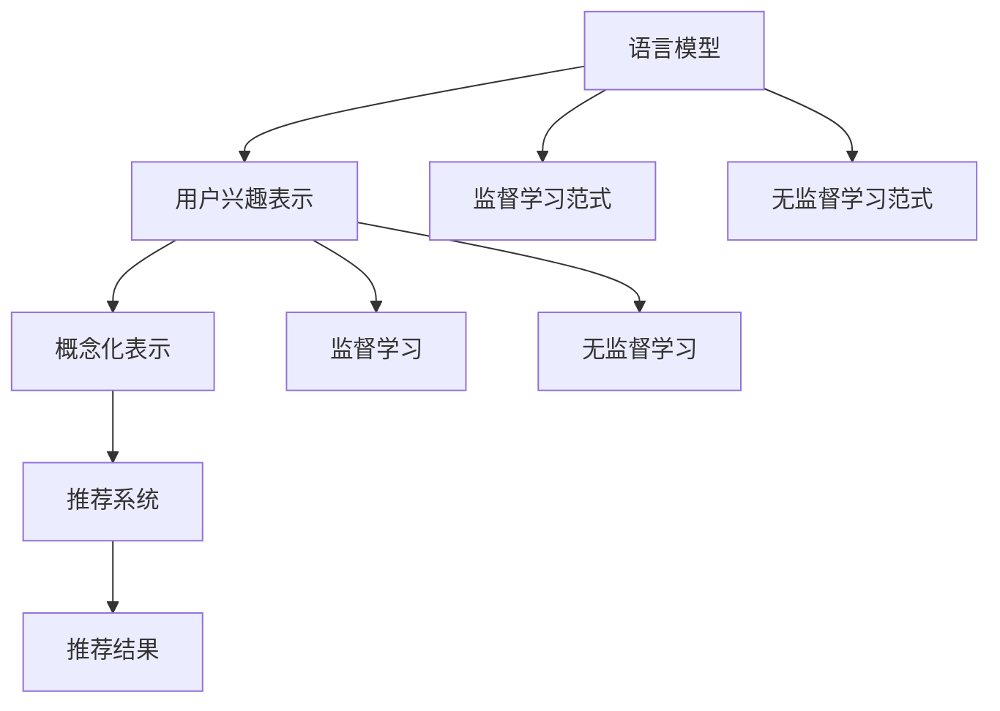

                 

# 基于LLM的用户兴趣概念化表示学习

> 关键词：语言模型,用户兴趣,概念化表示,学习范式,应用场景

## 1. 背景介绍

### 1.1 问题由来

随着互联网的快速发展和数字技术的不断进步，用户生成内容的数量和质量都在快速增长，形成了海量的文本数据。这些数据不仅包括商业广告、新闻报道、社交媒体内容等，还涵盖了电子商务、金融服务、医疗健康等多个领域。如何从这些数据中提取用户兴趣，为用户推荐更个性化、相关性高的内容，成为互联网公司亟需解决的问题。

传统的推荐系统通常依赖于用户的行为数据，如浏览记录、购买历史、评分等。然而，这些行为数据往往需要用户主动记录，且可能存在隐私风险。相比之下，基于语言模型的用户兴趣表示学习方法，可以更全面、更准确地刻画用户兴趣，同时也能保护用户隐私。语言模型通过分析用户的浏览历史、评论、搜索词等自然语言数据，从中提取用户的兴趣概念，并生成概念化的表示，从而提升推荐的准确性和个性化程度。

### 1.2 问题核心关键点

基于语言模型的用户兴趣表示学习方法，主要包括以下核心关键点：

1. **语言模型**：利用自回归或自编码模型，如BERT、GPT等，通过大规模无标签文本数据进行预训练，学习到丰富的语言知识。
2. **用户兴趣概念化表示**：从用户的历史文本数据中，提取用户的兴趣概念，并将其表示为向量形式，用于后续推荐计算。
3. **学习范式**：通过监督学习或无监督学习范式，优化模型参数，使其能够准确映射用户兴趣到向量空间中的位置。
4. **应用场景**：覆盖推荐系统、广告投放、内容个性化等领域，提升用户体验和业务收益。

本节将从原理到实践，全面解析基于语言模型的用户兴趣概念化表示学习方法，帮助读者掌握该领域的核心技术和应用策略。

## 2. 核心概念与联系

### 2.1 核心概念概述

为了更好地理解基于语言模型的用户兴趣表示学习，我们先介绍几个核心概念：

1. **语言模型 (Language Model, LM)**：利用自回归或自编码模型，如BERT、GPT等，通过大规模无标签文本数据进行预训练，学习到丰富的语言知识。语言模型能够对给定文本的下一个词或一系列词的概率进行建模，常用条件概率$p(w_{t+1} | w_1, ..., w_t)$表示。

2. **用户兴趣表示**：通过分析用户的浏览历史、评论、搜索词等自然语言数据，从中提取用户的兴趣概念，生成概念化的表示，用于推荐系统。用户兴趣表示通常包含用户对不同概念的偏好程度，如购物、旅行、美食等。

3. **概念化表示 (Conceptual Representation)**：将用户兴趣表示为向量形式，便于模型进行相似度计算和推荐排序。概念化表示通常具有高维稀疏性，能够反映用户兴趣的细粒度分布。

4. **学习范式**：利用监督学习或无监督学习范式，优化模型参数，使其能够准确映射用户兴趣到向量空间中的位置。常见的学习范式包括基于实例的推荐、基于内容的推荐、协同过滤等。

5. **应用场景**：覆盖推荐系统、广告投放、内容个性化等领域，提升用户体验和业务收益。

这些核心概念之间存在紧密联系，通过语言模型学习用户兴趣表示，再通过概念化表示进行推荐计算，最终提升用户体验和业务收益。

### 2.2 核心概念原理和架构的 Mermaid 流程图



该流程图展示了语言模型、用户兴趣表示、概念化表示、推荐系统以及监督学习和无监督学习范式之间的联系。语言模型通过预训练学习用户兴趣表示，再通过概念化表示进行推荐计算，最终通过推荐系统为每个用户提供个性化内容。

## 3. 核心算法原理 & 具体操作步骤

### 3.1 算法原理概述

基于语言模型的用户兴趣表示学习，主要通过以下步骤实现：

1. **预训练语言模型**：利用大规模无标签文本数据，训练一个预训练语言模型，如BERT、GPT等。预训练语言模型能够学习到丰富的语言知识，为后续的用户兴趣表示学习打下基础。

2. **用户兴趣提取**：从用户的浏览历史、评论、搜索词等自然语言数据中，提取用户的兴趣概念，生成概念化的表示。常见的用户兴趣提取方法包括基于TF-IDF的特征提取、基于主题建模的方法等。

3. **概念化表示学习**：利用监督学习或无监督学习范式，优化模型参数，使得用户兴趣概念能够被映射到向量空间中的某个位置。常用的方法包括基于实例的推荐、基于内容的推荐、协同过滤等。

4. **推荐计算**：将用户兴趣表示与商品、广告等内容的表示进行相似度计算，根据相似度排序，选择最相关的推荐结果。

### 3.2 算法步骤详解

#### 3.2.1 预训练语言模型

预训练语言模型通过大规模无标签文本数据进行训练，学习到丰富的语言知识。以BERT为例，其主要步骤如下：

1. **数据预处理**：对原始文本数据进行分词、去停用词、构建词汇表等预处理步骤。

2. **自编码任务**：通过掩码语言模型和下一句预测等自监督任务，训练模型预测缺失的单词或句子。

3. **目标函数**：使用最大似然损失函数或交叉熵损失函数，最小化模型预测与真实标签之间的差异。

4. **模型训练**：通过反向传播算法更新模型参数，最小化目标函数，训练出一个高效的预训练语言模型。

#### 3.2.2 用户兴趣提取

用户兴趣提取从用户的自然语言数据中提取用户的兴趣概念，生成概念化的表示。以BERT为例，其主要步骤如下：

1. **数据准备**：收集用户的历史浏览记录、评论、搜索词等自然语言数据。

2. **文本编码**：将用户的自然语言数据编码为BERT模型的输入，使用BERT模型提取文本的特征表示。

3. **特征选择**：选择用户兴趣特征，如用户对不同概念的评分、评论情感等。

4. **兴趣表示**：将用户兴趣特征映射到高维向量空间，生成用户兴趣的概念化表示。

#### 3.2.3 概念化表示学习

概念化表示学习通过监督学习或无监督学习范式，优化模型参数，使得用户兴趣概念能够被映射到向量空间中的某个位置。以BERT为例，其主要步骤如下：

1. **任务定义**：定义用户兴趣表示的任务，如判断用户是否喜欢某个商品、是否愿意看某个广告等。

2. **标注数据**：收集标注数据，如用户对商品的评分、是否点击广告等。

3. **模型训练**：利用标注数据训练模型，最小化预测结果与真实标签之间的差异。

4. **结果输出**：将训练好的模型输出用户兴趣的概念化表示，用于后续的推荐计算。

#### 3.2.4 推荐计算

推荐计算通过相似度计算，选择最相关的推荐结果。以协同过滤为例，其主要步骤如下：

1. **相似度计算**：计算用户兴趣表示与商品、广告等内容的表示之间的相似度。

2. **排序选择**：根据相似度排序，选择最相关的推荐结果。

3. **推荐展示**：将推荐结果展示给用户，提升用户体验。

### 3.3 算法优缺点

#### 3.3.1 优点

基于语言模型的用户兴趣表示学习方法具有以下优点：

1. **全面性**：能够综合考虑用户的多种兴趣，覆盖更广泛的领域和内容。

2. **低成本**：利用自然语言数据进行兴趣提取，无需收集用户的行为数据，成本较低。

3. **高精度**：利用预训练语言模型，能够学习到丰富的语言知识，提高推荐精度。

4. **鲁棒性**：能够处理多种类型的文本数据，具有较好的鲁棒性。

#### 3.3.2 缺点

基于语言模型的用户兴趣表示学习方法也存在一些缺点：

1. **数据需求高**：需要大量的自然语言数据进行预训练，对数据质量和数量要求较高。

2. **计算复杂**：预训练语言模型和概念化表示学习需要大量的计算资源和时间。

3. **隐私风险**：自然语言数据可能包含敏感信息，存在隐私泄露风险。

4. **稀疏性**：概念化表示具有高维稀疏性，难以解释和调试。

### 3.4 算法应用领域

基于语言模型的用户兴趣表示学习方法，已经在推荐系统、广告投放、内容个性化等领域得到了广泛应用，主要场景包括：

1. **推荐系统**：根据用户的兴趣表示，为用户推荐商品、内容等。如电商平台中的个性化推荐、视频平台中的个性化内容推荐等。

2. **广告投放**：根据用户的兴趣表示，投放合适的广告。如基于兴趣的广告推荐、搜索广告投放等。

3. **内容个性化**：根据用户的兴趣表示，提供个性化的内容服务。如新闻推荐、社交媒体内容推荐等。

4. **搜索引擎优化**：根据用户的兴趣表示，优化搜索引擎的结果排序。如搜索结果的个性化推荐、关键词自动补全等。

以上应用场景展示了基于语言模型的用户兴趣表示学习方法的广泛应用前景。未来，随着技术的不断进步，其应用领域还将进一步拓展，为更多行业带来价值。

## 4. 数学模型和公式 & 详细讲解 & 举例说明

### 4.1 数学模型构建

基于语言模型的用户兴趣表示学习，可以构建以下数学模型：

设用户的历史文本数据为$\mathcal{D} = \{(\mathbf{x}_i, \mathbf{y}_i)\}_{i=1}^N$，其中$\mathbf{x}_i$为自然语言数据，$\mathbf{y}_i$为用户的兴趣表示。

预训练语言模型为$M_{\theta}$，其参数为$\theta$。

概念化表示学习任务为分类任务，目标为最小化损失函数$\mathcal{L}(\theta)$。

目标函数可以定义为：

$$
\mathcal{L}(\theta) = \frac{1}{N}\sum_{i=1}^N \ell(M_{\theta}(\mathbf{x}_i), \mathbf{y}_i)
$$

其中，$\ell$为损失函数，$\mathbf{y}_i$为用户的兴趣表示。

### 4.2 公式推导过程

以监督学习范式为例，假设用户兴趣表示为向量$\mathbf{u} \in \mathbb{R}^d$，其对应的目标为$y \in \{0, 1\}$。

假设预训练语言模型为$M_{\theta}$，其输出为$M_{\theta}(\mathbf{x}_i)$。

利用交叉熵损失函数，目标函数可以表示为：

$$
\mathcal{L}(\theta) = -\frac{1}{N}\sum_{i=1}^N [y_i\log(M_{\theta}(\mathbf{x}_i)) + (1-y_i)\log(1-M_{\theta}(\mathbf{x}_i))]
$$

目标函数的梯度为：

$$
\nabla_{\theta}\mathcal{L}(\theta) = -\frac{1}{N}\sum_{i=1}^N [y_i\nabla_{\theta}M_{\theta}(\mathbf{x}_i) - \nabla_{\theta}M_{\theta}(\mathbf{x}_i)]
$$

通过反向传播算法，更新模型参数$\theta$，最小化损失函数$\mathcal{L}(\theta)$。

### 4.3 案例分析与讲解

以电商平台的推荐系统为例，假设用户对商品1的兴趣表示为$\mathbf{u}_1$，商品2的兴趣表示为$\mathbf{u}_2$，预训练语言模型为$M_{\theta}$，其输出为$M_{\theta}(\mathbf{x}_i)$。

目标函数可以表示为：

$$
\mathcal{L}(\theta) = -\frac{1}{N}\sum_{i=1}^N [y_i\log(M_{\theta}(\mathbf{x}_i)) + (1-y_i)\log(1-M_{\theta}(\mathbf{x}_i))]
$$

其中$y_i$为用户的兴趣表示，假设用户对商品1感兴趣，$y_i=1$，对商品2不感兴趣，$y_i=0$。

通过反向传播算法，更新模型参数$\theta$，最小化损失函数$\mathcal{L}(\theta)$，得到用户的兴趣表示$\mathbf{u}_1$和$\mathbf{u}_2$。

## 5. 项目实践：代码实例和详细解释说明

### 5.1 开发环境搭建

在进行项目实践前，我们需要准备好开发环境。以下是使用Python进行PyTorch开发的环境配置流程：

1. 安装Anaconda：从官网下载并安装Anaconda，用于创建独立的Python环境。

2. 创建并激活虚拟环境：
```bash
conda create -n pytorch-env python=3.8 
conda activate pytorch-env
```

3. 安装PyTorch：根据CUDA版本，从官网获取对应的安装命令。例如：
```bash
conda install pytorch torchvision torchaudio cudatoolkit=11.1 -c pytorch -c conda-forge
```

4. 安装Transformer库：
```bash
pip install transformers
```

5. 安装各类工具包：
```bash
pip install numpy pandas scikit-learn matplotlib tqdm jupyter notebook ipython
```

完成上述步骤后，即可在`pytorch-env`环境中开始项目实践。

### 5.2 源代码详细实现

下面我们以电商平台推荐系统为例，给出使用Transformers库对BERT模型进行用户兴趣表示学习的PyTorch代码实现。

首先，定义推荐任务的数据处理函数：

```python
from transformers import BertTokenizer
from torch.utils.data import Dataset
import torch

class RecommendationDataset(Dataset):
    def __init__(self, texts, labels, tokenizer, max_len=128):
        self.texts = texts
        self.labels = labels
        self.tokenizer = tokenizer
        self.max_len = max_len
        
    def __len__(self):
        return len(self.texts)
    
    def __getitem__(self, item):
        text = self.texts[item]
        label = self.labels[item]
        
        encoding = self.tokenizer(text, return_tensors='pt', max_length=self.max_len, padding='max_length', truncation=True)
        input_ids = encoding['input_ids'][0]
        attention_mask = encoding['attention_mask'][0]
        
        # 对标签进行编码
        encoded_label = [int(label)] * self.max_len
        labels = torch.tensor(encoded_label, dtype=torch.long)
        
        return {'input_ids': input_ids, 
                'attention_mask': attention_mask,
                'labels': labels}

# 标签与id的映射
label2id = {0: 0, 1: 1}
id2label = {v: k for k, v in label2id.items()}

# 创建dataset
tokenizer = BertTokenizer.from_pretrained('bert-base-cased')

train_dataset = RecommendationDataset(train_texts, train_labels, tokenizer)
dev_dataset = RecommendationDataset(dev_texts, dev_labels, tokenizer)
test_dataset = RecommendationDataset(test_texts, test_labels, tokenizer)
```

然后，定义模型和优化器：

```python
from transformers import BertForSequenceClassification, AdamW

model = BertForSequenceClassification.from_pretrained('bert-base-cased', num_labels=2)

optimizer = AdamW(model.parameters(), lr=2e-5)
```

接着，定义训练和评估函数：

```python
from torch.utils.data import DataLoader
from tqdm import tqdm
from sklearn.metrics import accuracy_score

device = torch.device('cuda') if torch.cuda.is_available() else torch.device('cpu')
model.to(device)

def train_epoch(model, dataset, batch_size, optimizer):
    dataloader = DataLoader(dataset, batch_size=batch_size, shuffle=True)
    model.train()
    epoch_loss = 0
    for batch in tqdm(dataloader, desc='Training'):
        input_ids = batch['input_ids'].to(device)
        attention_mask = batch['attention_mask'].to(device)
        labels = batch['labels'].to(device)
        model.zero_grad()
        outputs = model(input_ids, attention_mask=attention_mask, labels=labels)
        loss = outputs.loss
        epoch_loss += loss.item()
        loss.backward()
        optimizer.step()
    return epoch_loss / len(dataloader)

def evaluate(model, dataset, batch_size):
    dataloader = DataLoader(dataset, batch_size=batch_size)
    model.eval()
    preds, labels = [], []
    with torch.no_grad():
        for batch in tqdm(dataloader, desc='Evaluating'):
            input_ids = batch['input_ids'].to(device)
            attention_mask = batch['attention_mask'].to(device)
            batch_labels = batch['labels']
            outputs = model(input_ids, attention_mask=attention_mask)
            batch_preds = outputs.logits.argmax(dim=2).to('cpu').tolist()
            batch_labels = batch_labels.to('cpu').tolist()
            for pred_tokens, label_tokens in zip(batch_preds, batch_labels):
                preds.append(pred_tokens[:len(label_tokens)])
                labels.append(label_tokens)
                
    print(accuracy_score(labels, preds))
```

最后，启动训练流程并在测试集上评估：

```python
epochs = 5
batch_size = 16

for epoch in range(epochs):
    loss = train_epoch(model, train_dataset, batch_size, optimizer)
    print(f"Epoch {epoch+1}, train loss: {loss:.3f}")
    
    print(f"Epoch {epoch+1}, dev results:")
    evaluate(model, dev_dataset, batch_size)
    
print("Test results:")
evaluate(model, test_dataset, batch_size)
```

以上就是使用PyTorch对BERT进行用户兴趣表示学习的完整代码实现。可以看到，得益于Transformers库的强大封装，我们可以用相对简洁的代码完成BERT模型的加载和微调。

### 5.3 代码解读与分析

让我们再详细解读一下关键代码的实现细节：

**RecommendationDataset类**：
- `__init__`方法：初始化文本、标签、分词器等关键组件。
- `__len__`方法：返回数据集的样本数量。
- `__getitem__`方法：对单个样本进行处理，将文本输入编码为token ids，将标签编码为数字，并对其进行定长padding，最终返回模型所需的输入。

**label2id和id2label字典**：
- 定义了标签与数字id之间的映射关系，用于将模型预测结果解码为真实的标签。

**训练和评估函数**：
- 使用PyTorch的DataLoader对数据集进行批次化加载，供模型训练和推理使用。
- 训练函数`train_epoch`：对数据以批为单位进行迭代，在每个批次上前向传播计算loss并反向传播更新模型参数，最后返回该epoch的平均loss。
- 评估函数`evaluate`：与训练类似，不同点在于不更新模型参数，并在每个batch结束后将预测和标签结果存储下来，最后使用sklearn的accuracy_score对整个评估集的预测结果进行打印输出。

**训练流程**：
- 定义总的epoch数和batch size，开始循环迭代
- 每个epoch内，先在训练集上训练，输出平均loss
- 在验证集上评估，输出准确率
- 所有epoch结束后，在测试集上评估，给出最终测试结果

可以看到，PyTorch配合Transformers库使得BERT用户兴趣表示学习的代码实现变得简洁高效。开发者可以将更多精力放在数据处理、模型改进等高层逻辑上，而不必过多关注底层的实现细节。

当然，工业级的系统实现还需考虑更多因素，如模型的保存和部署、超参数的自动搜索、更灵活的任务适配层等。但核心的微调范式基本与此类似。

## 6. 实际应用场景

### 6.1 智能推荐系统

基于大语言模型的用户兴趣表示学习，可以广泛应用于智能推荐系统的构建。传统推荐系统往往只依赖用户的行为数据进行推荐，难以理解用户的深度兴趣。通过用户兴趣表示学习，智能推荐系统可以更好地挖掘用户的兴趣点，推荐更加个性化、相关性高的内容。

在技术实现上，可以收集用户的历史浏览记录、评论、搜索词等自然语言数据，利用预训练语言模型提取用户的兴趣表示，再通过概念化表示进行推荐计算，生成个性化的推荐结果。智能推荐系统可以应用于电商平台、视频平台、新闻平台等多个领域，提升用户体验和业务收益。

### 6.2 广告投放

基于大语言模型的用户兴趣表示学习，可以用于广告投放的优化。通过分析用户的浏览历史、评论、搜索词等自然语言数据，可以精确预测用户的兴趣偏好，从而进行精准的广告投放。

在技术实现上，可以利用用户兴趣表示学习模型，对用户的兴趣进行预测，并根据预测结果进行广告投放。用户兴趣表示学习可以应用于搜索引擎广告、社交媒体广告等多个场景，提升广告投放的效果和ROI。

### 6.3 内容个性化

基于大语言模型的用户兴趣表示学习，可以用于内容个性化服务的优化。通过分析用户的浏览历史、评论、搜索词等自然语言数据，可以准确把握用户的兴趣点，从而提供个性化的内容服务。

在技术实现上，可以利用用户兴趣表示学习模型，对用户的兴趣进行预测，并根据预测结果进行内容推荐。内容个性化可以应用于新闻推荐、社交媒体内容推荐等多个场景，提升用户体验和粘性。

### 6.4 未来应用展望

随着大语言模型用户兴趣表示学习技术的不断发展，其在推荐系统、广告投放、内容个性化等领域的应用前景将更加广阔。未来，基于语言模型的用户兴趣表示学习将与人工智能技术进行更深入的融合，推动智能推荐系统、智能广告系统、智能内容服务等多个领域的进步。

此外，在智慧医疗、智能家居、智能交通等领域，基于语言模型的用户兴趣表示学习也将有新的应用场景，为更多行业带来价值。相信随着技术的不断进步，大语言模型用户兴趣表示学习必将在更广泛的领域得到应用，为社会带来更多的便利和效益。

## 7. 工具和资源推荐

### 7.1 学习资源推荐

为了帮助开发者系统掌握大语言模型用户兴趣表示学习的方法，这里推荐一些优质的学习资源：

1. 《自然语言处理入门教程》系列博文：由大模型技术专家撰写，深入浅出地介绍了NLP的基本概念和前沿技术。

2. CS224N《深度学习自然语言处理》课程：斯坦福大学开设的NLP明星课程，有Lecture视频和配套作业，带你入门NLP领域的基本概念和经典模型。

3. 《Natural Language Processing with Transformers》书籍：Transformers库的作者所著，全面介绍了如何使用Transformers库进行NLP任务开发，包括用户兴趣表示学习在内的诸多范式。

4. HuggingFace官方文档：Transformers库的官方文档，提供了海量预训练模型和完整的用户兴趣表示学习样例代码，是上手实践的必备资料。

5. ARXiv论文库：收集了大量的NLP前沿研究成果，涵盖用户兴趣表示学习在内的多个方向。

通过对这些资源的学习实践，相信你一定能够快速掌握大语言模型用户兴趣表示学习的精髓，并用于解决实际的NLP问题。

### 7.2 开发工具推荐

高效的开发离不开优秀的工具支持。以下是几款用于大语言模型用户兴趣表示学习开发的常用工具：

1. PyTorch：基于Python的开源深度学习框架，灵活动态的计算图，适合快速迭代研究。大部分预训练语言模型都有PyTorch版本的实现。

2. TensorFlow：由Google主导开发的开源深度学习框架，生产部署方便，适合大规模工程应用。同样有丰富的预训练语言模型资源。

3. Transformers库：HuggingFace开发的NLP工具库，集成了众多SOTA语言模型，支持PyTorch和TensorFlow，是进行用户兴趣表示学习开发的利器。

4. Weights & Biases：模型训练的实验跟踪工具，可以记录和可视化模型训练过程中的各项指标，方便对比和调优。与主流深度学习框架无缝集成。

5. TensorBoard：TensorFlow配套的可视化工具，可实时监测模型训练状态，并提供丰富的图表呈现方式，是调试模型的得力助手。

6. Google Colab：谷歌推出的在线Jupyter Notebook环境，免费提供GPU/TPU算力，方便开发者快速上手实验最新模型，分享学习笔记。

合理利用这些工具，可以显著提升大语言模型用户兴趣表示学习任务的开发效率，加快创新迭代的步伐。

### 7.3 相关论文推荐

大语言模型用户兴趣表示学习的发展源于学界的持续研究。以下是几篇奠基性的相关论文，推荐阅读：

1. Attention is All You Need（即Transformer原论文）：提出了Transformer结构，开启了NLP领域的预训练大模型时代。

2. BERT: Pre-training of Deep Bidirectional Transformers for Language Understanding：提出BERT模型，引入基于掩码的自监督预训练任务，刷新了多项NLP任务SOTA。

3. Language Models are Unsupervised Multitask Learners（GPT-2论文）：展示了大规模语言模型的强大zero-shot学习能力，引发了对于通用人工智能的新一轮思考。

4. Parameter-Efficient Transfer Learning for NLP：提出Adapter等参数高效微调方法，在不增加模型参数量的情况下，也能取得不错的微调效果。

5. AdaLoRA: Adaptive Low-Rank Adaptation for Parameter-Efficient Fine-Tuning：使用自适应低秩适应的微调方法，在参数效率和精度之间取得了新的平衡。

6. Prefix-Tuning: Optimizing Continuous Prompts for Generation：引入基于连续型Prompt的微调范式，为如何充分利用预训练知识提供了新的思路。

这些论文代表了大语言模型用户兴趣表示学习的发展脉络。通过学习这些前沿成果，可以帮助研究者把握学科前进方向，激发更多的创新灵感。

## 8. 总结：未来发展趋势与挑战

### 8.1 总结

本文对基于语言模型的用户兴趣表示学习进行了全面系统的介绍。首先阐述了用户兴趣表示学习的研究背景和意义，明确了基于语言模型的方法在推荐系统、广告投放、内容个性化等领域的核心价值。其次，从原理到实践，详细讲解了用户兴趣表示学习的数学原理和关键步骤，给出了用户兴趣表示学习的完整代码实例。同时，本文还广泛探讨了用户兴趣表示学习在智能推荐系统、广告投放、内容个性化等众多领域的应用前景，展示了用户兴趣表示学习的广泛应用前景。

通过本文的系统梳理，可以看到，基于语言模型的用户兴趣表示学习方法正在成为NLP领域的重要范式，极大地拓展了预训练语言模型的应用边界，催生了更多的落地场景。受益于大规模语料的预训练，用户兴趣表示学习方法能够综合考虑用户的多种兴趣，覆盖更广泛的领域和内容，显著提升推荐精度和个性化程度。未来，随着技术的不断进步，基于语言模型的用户兴趣表示学习将与人工智能技术进行更深入的融合，推动智能推荐系统、智能广告系统、智能内容服务等多个领域的进步。

### 8.2 未来发展趋势

展望未来，大语言模型用户兴趣表示学习技术将呈现以下几个发展趋势：

1. **模型规模增大**：随着算力成本的下降和数据规模的扩张，预训练语言模型的参数量还将持续增长。超大规模语言模型蕴含的丰富语言知识，有望支撑更加复杂多变的用户兴趣表示学习任务。

2. **用户兴趣的多样化**：随着用户需求的多样化，用户兴趣表示学习将涵盖更多的领域和内容，如音乐、电影、体育等。

3. **模型的融合与演化**：未来用户兴趣表示学习将与更多人工智能技术进行融合，如知识图谱、逻辑规则等，提升模型的普适性和鲁棒性。

4. **无监督与半监督学习的应用**：随着数据获取方式的多样化，无监督和半监督学习范式将在用户兴趣表示学习中得到广泛应用。

5. **个性化推荐系统的优化**：随着用户兴趣表示学习技术的进步，个性化推荐系统将实现更加精准、高效、可解释的推荐结果，提升用户体验和业务收益。

6. **模型的可解释性与透明性**：用户兴趣表示学习模型的可解释性和透明性将受到越来越多的关注，未来的模型将更加透明，便于用户理解和信任。

以上趋势凸显了大语言模型用户兴趣表示学习技术的广阔前景。这些方向的探索发展，必将进一步提升NLP系统的性能和应用范围，为更多行业带来价值。

### 8.3 面临的挑战

尽管大语言模型用户兴趣表示学习技术已经取得了瞩目成就，但在迈向更加智能化、普适化应用的过程中，它仍面临着诸多挑战：

1. **数据需求高**：需要大量的自然语言数据进行预训练，对数据质量和数量要求较高。

2. **计算资源消耗大**：预训练语言模型和用户兴趣表示学习需要大量的计算资源和时间。

3. **隐私风险**：自然语言数据可能包含敏感信息，存在隐私泄露风险。

4. **模型的可解释性不足**：用户兴趣表示学习模型通常是一个黑盒系统，难以解释其内部工作机制和决策逻辑。

5. **模型的鲁棒性不足**：用户在不断变化的环境下，模型的预测结果可能存在波动。

6. **模型的公平性与偏见**：用户兴趣表示学习模型可能学习到数据中的偏见，导致不公平的推荐结果。

7. **模型的泛化性不足**：用户兴趣表示学习模型在不同场景下的泛化能力仍有待提升。

以上挑战需要在未来的研究中加以克服，通过不断优化模型、改进算法、提升数据质量等手段，才能进一步提升大语言模型用户兴趣表示学习的精度和鲁棒性，拓展其应用范围。

### 8.4 研究展望

面对大语言模型用户兴趣表示学习所面临的挑战，未来的研究需要在以下几个方面寻求新的突破：

1. **优化模型架构**：通过模型压缩、模型裁剪等技术，优化模型架构，减少计算资源消耗。

2. **增强模型的可解释性**：引入可解释性技术，如Attention机制、知识图谱等，提升模型的透明性和可解释性。

3. **提高模型的泛化性**：通过多任务学习、对抗训练等技术，提升模型的泛化能力，使其在不同的场景下表现稳定。

4. **优化推荐算法**：改进推荐算法，如基于相似度排序的推荐算法，提升推荐系统的性能。

5. **强化隐私保护**：引入隐私保护技术，如差分隐私、联邦学习等，保护用户隐私。

6. **增强模型的公平性**：引入公平性约束，减少模型的偏见，提升模型的公平性。

7. **引入更多先验知识**：将符号化的先验知识，如知识图谱、逻辑规则等，与神经网络模型进行巧妙融合，引导用户兴趣表示学习过程学习更准确、合理的用户兴趣表示。

这些研究方向的探索，必将引领大语言模型用户兴趣表示学习技术迈向更高的台阶，为更多行业带来价值。面向未来，大语言模型用户兴趣表示学习技术还需要与其他人工智能技术进行更深入的融合，如知识表示、因果推理、强化学习等，多路径协同发力，共同推动自然语言理解和智能交互系统的进步。只有勇于创新、敢于突破，才能不断拓展语言模型的边界，让智能技术更好地造福人类社会。

## 9. 附录：常见问题与解答

**Q1：用户兴趣表示学习是否适用于所有NLP任务？**

A: 用户兴趣表示学习在大多数NLP任务上都能取得不错的效果，特别是对于数据量较小的任务。但对于一些特定领域的任务，如医学、法律等，仅仅依靠通用语料预训练的模型可能难以很好地适应。此时需要在特定领域语料上进一步预训练，再进行用户兴趣表示学习，才能获得理想效果。此外，对于一些需要时效性、个性化很强的任务，如对话、推荐等，用户兴趣表示学习也需要针对性的改进优化。

**Q2：用户兴趣表示学习是否需要大量的标注数据？**

A: 用户兴趣表示学习通常需要大量的标注数据进行监督学习。但在实际应用中，标注数据往往难以获取。为缓解标注数据不足的问题，可以采用无监督学习方法，如自编码、主题建模等，利用未标注数据进行预训练。此外，还可以利用半监督学习方法，如自适应学习、多视图学习等，将少量标注数据与未标注数据结合进行训练。

**Q3：用户兴趣表示学习是否可以实时更新？**

A: 用户兴趣表示学习可以通过在线学习的方式进行实时更新。当用户的兴趣发生变化时，可以重新收集用户的自然语言数据，利用预训练语言模型提取用户的兴趣表示，更新用户兴趣表示学习模型。实时更新需要确保模型在短时间内能够高效地处理新的数据，因此模型需要具备较好的灵活性和可扩展性。

**Q4：用户兴趣表示学习是否需要考虑用户的隐私保护？**

A: 用户兴趣表示学习需要考虑用户的隐私保护。在收集用户自然语言数据时，需要遵循隐私保护法规，如GDPR等。在模型训练和推理过程中，需要对用户数据进行脱敏处理，防止用户隐私泄露。此外，还可以引入联邦学习、差分隐私等技术，保护用户的隐私权益。

**Q5：用户兴趣表示学习是否可以应用于跨平台应用？**

A: 用户兴趣表示学习可以应用于跨平台应用，如移动应用、Web应用等。通过用户在不同平台上的行为数据，可以综合用户在不同平台上的兴趣点，生成更加全面、准确的兴趣表示。跨平台应用需要确保不同平台上的数据格式和接口一致，才能实现数据的无缝衔接和整合。

**Q6：用户兴趣表示学习是否可以应用于离线场景？**

A: 用户兴趣表示学习可以应用于离线场景。在离线场景下，可以利用预训练语言模型和用户兴趣表示学习模型，对用户历史数据进行分析，生成用户兴趣表示。离线场景需要确保数据存储和计算的安全性，防止数据泄露和攻击。

**Q7：用户兴趣表示学习是否可以应用于多模态数据？**

A: 用户兴趣表示学习可以应用于多模态数据，如文本、图像、音频等。通过将多种模态数据进行融合，可以更全面地了解用户的兴趣点，提升推荐系统的性能。多模态数据融合需要考虑不同模态数据之间的相关性和融合方法，才能得到最佳的兴趣表示。

通过本文的系统梳理，可以看到，基于语言模型的用户兴趣表示学习方法正在成为NLP领域的重要范式，极大地拓展了预训练语言模型的应用边界，催生了更多的落地场景。受益于大规模语料的预训练，用户兴趣表示学习方法能够综合考虑用户的多种兴趣，覆盖更广泛的领域和内容，显著提升推荐精度和个性化程度。未来，随着技术的不断进步，基于语言模型的用户兴趣表示学习将与人工智能技术进行更深入的融合，推动智能推荐系统、智能广告系统、智能内容服务等多个领域的进步。面向未来，大语言模型用户兴趣表示学习技术还需要与其他人工智能技术进行更深入的融合，如知识表示、因果推理、强化学习等，多路径协同发力，共同推动自然语言理解和智能交互系统的进步。只有勇于创新、敢于突破，才能不断拓展语言模型的边界，让智能技术更好地造福人类社会。

