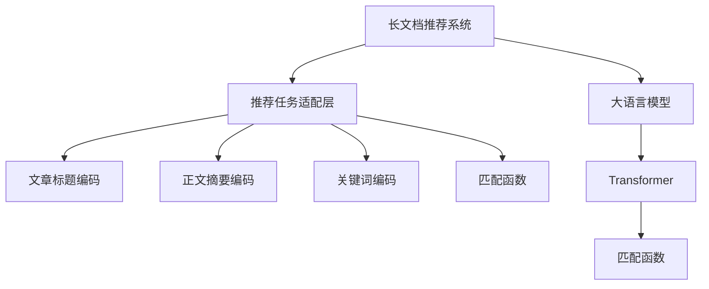

                 

# 基于LLM的长文档推荐方法

> 关键词：长文档推荐,LLM,Transformer,Bert,Attention,推荐系统,文本生成

## 1. 背景介绍

### 1.1 问题由来

随着互联网信息的爆炸性增长，如何高效地从海量文本中找到与用户需求最相关的信息，成为了信息检索领域的一大挑战。传统的关键词匹配、搜索结果排序等方法，虽然简单直观，但难以适应复杂的长文档语境。

长文档推荐系统正是为了应对这一挑战而设计的。它能够综合考虑文章标题、正文摘要、关键词等全方位信息，将最相关的长文档推荐给用户。当前，长文档推荐技术正迅速发展，Transformer、BERT等大语言模型作为核心组件，为系统带来了显著的性能提升。

然而，在实际应用中，长文档推荐仍存在诸多挑战。比如，如何在大规模语料上高效训练出高性能的模型；如何在稀疏、噪声的数据上保证模型的泛化能力；如何平衡推荐速度与效果等。本文旨在系统地介绍一种基于大语言模型的长文档推荐方法，探讨其原理与实现，并通过具体的代码实例展示其应用效果。

### 1.2 问题核心关键点

基于大语言模型的长文档推荐方法，通过将预训练模型与推荐任务相结合，利用语言模型的语义理解能力，实现了对长文档的精准推荐。该方法的核心在于：

1. 预训练模型（如BERT、GPT等）：用于学习通用的语言表示，具备强大的语义理解能力。
2. 推荐任务适配层：根据推荐任务特点设计，包括文章标题、正文摘要、关键词等文本输入的编码和解码机制，以及推荐结果的输出方式。
3. 匹配函数：利用预训练模型的输出，计算文档与用户需求之间的匹配度，从而实现推荐排序。
4. 训练和优化：在标注数据上，通过最小化推荐误差来训练模型，并采用合适的优化方法来避免过拟合。

## 2. 核心概念与联系

### 2.1 核心概念概述

为更好地理解基于大语言模型的长文档推荐方法，本节将介绍几个密切相关的核心概念：

- 长文档推荐系统：一种能够综合考虑文章标题、正文摘要、关键词等多方面信息，将最相关的长文档推荐给用户的技术。
- 大语言模型(LLM)：以自回归(如GPT)或自编码(如BERT)模型为代表的大规模预训练语言模型。通过在大规模无标签文本语料上进行预训练，学习通用的语言表示，具备强大的语义理解能力。
- Transformer：一种用于处理序列数据的深度学习模型，具有并行化优势，广泛应用于自然语言处理任务中。
- 推荐算法：用于计算文档与用户需求之间匹配度的算法，包括排序算法、相似度算法等。
- 推荐系统评估指标：用于衡量推荐系统性能的指标，如平均绝对误差(MAE)、均方误差(MSE)、准确率、召回率等。

这些核心概念之间的逻辑关系可以通过以下Mermaid流程图来展示：



这个流程图展示了长文档推荐系统的核心概念及其之间的关系：

1. 长文档推荐系统通过大语言模型进行长文档推荐。
2. 大语言模型用于学习通用的语言表示。
3. 推荐任务适配层根据推荐任务特点设计，对长文档进行编码。
4. 匹配函数利用编码结果计算文档与用户需求之间的匹配度。

## 3. 核心算法原理 & 具体操作步骤
### 3.1 算法原理概述

基于大语言模型的长文档推荐方法，通过将预训练模型与推荐任务相结合，利用语言模型的语义理解能力，实现了对长文档的精准推荐。其核心思想是：

1. 将长文档的标题、正文摘要、关键词等信息作为输入，输入到预训练语言模型中，得到文档的语义表示。
2. 将用户需求转换为查询向量，也输入到预训练语言模型中，得到查询向量的语义表示。
3. 通过计算文档语义表示与查询向量语义表示的相似度，得到文档与用户需求的匹配度。
4. 根据匹配度对文档进行排序，选取最相关的文档推荐给用户。

该方法的核心在于预训练语言模型的强大语义理解能力，使得对长文档的推荐更加准确和全面。

### 3.2 算法步骤详解

基于大语言模型的长文档推荐算法，一般包括以下几个关键步骤：

**Step 1: 准备数据集**
- 收集长文档数据集，包括文档标题、正文摘要、关键词等信息。
- 对长文档进行预处理，如分词、去除停用词等。
- 将长文档数据集划分为训练集、验证集和测试集。

**Step 2: 设计推荐任务适配层**
- 根据推荐任务特点设计适配层，对长文档进行编码。
- 对于标题，使用RoBERTa、BERT等预训练模型进行编码。
- 对于正文摘要，使用语言模型生成摘要，再输入预训练模型编码。
- 对于关键词，使用TF-IDF等方法进行权重计算，输入预训练模型编码。
- 将编码结果拼接，作为文档的语义表示。

**Step 3: 设计查询表示**
- 将用户需求转换为查询向量，输入预训练语言模型进行编码。
- 可以采用语言模型直接生成查询向量，也可以将查询转换为特定实体进行编码。

**Step 4: 设计匹配函数**
- 定义匹配函数，计算文档与查询之间的相似度。
- 常见的匹配函数包括余弦相似度、欧式距离、Jaccard相似度等。

**Step 5: 训练和优化**
- 使用训练集数据，在预训练模型的基础上进行微调。
- 最小化推荐误差，使用优化算法如AdamW、SGD等。
- 采用正则化技术如L2正则、Dropout等，防止过拟合。
- 使用验证集评估模型性能，调整超参数。

**Step 6: 测试和评估**
- 使用测试集数据评估模型性能，对比微调前后的推荐效果。
- 分析推荐结果的准确率、召回率、F1-score等指标。

以上是基于大语言模型的长文档推荐算法的一般流程。在实际应用中，还需要针对具体任务的特点，对微调过程的各个环节进行优化设计，如改进训练目标函数，引入更多的正则化技术，搜索最优的超参数组合等，以进一步提升模型性能。

### 3.3 算法优缺点

基于大语言模型的长文档推荐方法具有以下优点：

1. 语义理解能力强。利用语言模型的强大语义理解能力，可以准确把握长文档的内容和用户需求，实现精准推荐。
2. 泛化能力强。预训练模型在大规模无标签数据上进行训练，具有较强的泛化能力，可以适应各种推荐场景。
3. 容易扩展。可以根据具体任务设计不同的适配层和匹配函数，实现对长文档推荐任务的灵活应对。

同时，该方法也存在一定的局限性：

1. 计算复杂度高。预训练模型和编码解码过程需要大量计算资源，对算力要求较高。
2. 对数据质量依赖大。长文档推荐系统依赖于高质量的标注数据，数据噪声和稀疏性可能影响推荐效果。
3. 模型训练时间长。预训练模型和微调过程需要大量时间和数据，实际应用中难以快速上线。
4. 可解释性不足。预训练模型的决策过程通常缺乏可解释性，难以对其推理逻辑进行分析和调试。

尽管存在这些局限性，但就目前而言，基于大语言模型的长文档推荐方法仍是一种非常有效的推荐技术。未来相关研究的重点在于如何进一步降低计算复杂度，提高模型训练效率，同时兼顾可解释性和伦理安全性等因素。

### 3.4 算法应用领域

基于大语言模型的长文档推荐方法，已经在新闻推荐、科技论文推荐、电商商品推荐等多个领域得到了广泛应用。具体而言，包括：

- 新闻推荐：对新闻文章进行标题、摘要和关键词的多维度编码，推荐与用户兴趣匹配的文章。
- 科技论文推荐：对学术论文进行摘要和关键词编码，推荐相关领域的论文。
- 电商商品推荐：对商品标题、描述和标签进行编码，推荐与用户需求匹配的商品。
- 教育资源推荐：对教育文章进行标题和摘要编码，推荐与用户学习需求匹配的文章。

除了上述这些经典应用外，长文档推荐系统也被创新性地应用到更多场景中，如音乐推荐、旅游路线推荐、股票分析等，为信息检索技术带来了新的突破。随着预训练模型和推荐方法的不断进步，相信长文档推荐技术将在更广阔的应用领域大放异彩。

## 4. 数学模型和公式 & 详细讲解  
### 4.1 数学模型构建

本节将使用数学语言对基于大语言模型的长文档推荐方法进行更加严格的刻画。

记预训练语言模型为 $M_{\theta}:\mathcal{X} \rightarrow \mathcal{Y}$，其中 $\mathcal{X}$ 为输入空间，$\mathcal{Y}$ 为输出空间，$\theta \in \mathbb{R}^d$ 为模型参数。假设长文档推荐系统输入为 $x=\{x_t\}_{t=1}^T$，其中 $x_t$ 表示第 $t$ 个长文档，$T$ 为文档数。假设用户需求为 $q$，则推荐任务可以表示为：

$$
y = \max_{i=1,2,\dots,T} \langle M_{\theta}(x_i), M_{\theta}(q) \rangle
$$

其中 $\langle \cdot, \cdot \rangle$ 表示余弦相似度，$\max$ 表示选取相似度最高的文档。

定义长文档推荐系统的损失函数为：

$$
\mathcal{L}(\theta) = -\frac{1}{N}\sum_{i=1}^N \log \sigma(\langle M_{\theta}(x_i), M_{\theta}(q) \rangle)
$$

其中 $\sigma(\cdot)$ 为sigmoid函数，$N$ 为训练集大小。

微调的目标是最小化损失函数，即找到最优参数：

$$
\theta^* = \mathop{\arg\min}_{\theta} \mathcal{L}(\theta)
$$

在实践中，我们通常使用基于梯度的优化算法（如AdamW、SGD等）来近似求解上述最优化问题。设 $\eta$ 为学习率，$\lambda$ 为正则化系数，则参数的更新公式为：

$$
\theta \leftarrow \theta - \eta \nabla_{\theta}\mathcal{L}(\theta) - \eta\lambda\theta
$$

其中 $\nabla_{\theta}\mathcal{L}(\theta)$ 为损失函数对参数 $\theta$ 的梯度，可通过反向传播算法高效计算。

### 4.2 公式推导过程

以下我们以新闻推荐任务为例，推导余弦相似度损失函数及其梯度的计算公式。

假设长文档 $x_i$ 的标题为 $x_{i,t}$，摘要为 $x_{i,a}$，关键词为 $x_{i,k}$。用户需求 $q$ 为查询向量，即 $q = M_{\theta}(q)$。则长文档的编码可以表示为：

$$
x_i = (x_{i,t}, x_{i,a}, x_{i,k})
$$

其中 $x_{i,t}$、$x_{i,a}$、$x_{i,k}$ 分别表示标题、摘要和关键词的编码结果。

定义长文档与用户需求的余弦相似度为：

$$
\langle M_{\theta}(x_i), M_{\theta}(q) \rangle = \frac{\langle M_{\theta}(x_{i,t}), M_{\theta}(q) \rangle + \langle M_{\theta}(x_{i,a}), M_{\theta}(q) \rangle + \langle M_{\theta}(x_{i,k}), M_{\theta}(q) \rangle}{\|M_{\theta}(x_i)\|_2 \cdot \|M_{\theta}(q)\|_2}
$$

则推荐任务可以表示为：

$$
y = \max_{i=1,2,\dots,T} \frac{\langle M_{\theta}(x_{i,t}), M_{\theta}(q) \rangle + \langle M_{\theta}(x_{i,a}), M_{\theta}(q) \rangle + \langle M_{\theta}(x_{i,k}), M_{\theta}(q) \rangle}{\|M_{\theta}(x_i)\|_2 \cdot \|M_{\theta}(q)\|_2}
$$

通过引入RoBERTa等预训练模型，将长文档的编码结果表示为：

$$
x_i = M_{\theta}(x_i), q = M_{\theta}(q)
$$

将上述公式代入损失函数：

$$
\mathcal{L}(\theta) = -\frac{1}{N}\sum_{i=1}^N \log \sigma(\langle M_{\theta}(x_i), M_{\theta}(q) \rangle)
$$

在得到损失函数的梯度后，即可带入参数更新公式，完成模型的迭代优化。重复上述过程直至收敛，最终得到适应新闻推荐任务的最优模型参数 $\theta^*$。

## 5. 项目实践：代码实例和详细解释说明
### 5.1 开发环境搭建

在进行长文档推荐实践前，我们需要准备好开发环境。以下是使用Python进行PyTorch开发的环境配置流程：

1. 安装Anaconda：从官网下载并安装Anaconda，用于创建独立的Python环境。

2. 创建并激活虚拟环境：
```bash
conda create -n pytorch-env python=3.8 
conda activate pytorch-env
```

3. 安装PyTorch：根据CUDA版本，从官网获取对应的安装命令。例如：
```bash
conda install pytorch torchvision torchaudio cudatoolkit=11.1 -c pytorch -c conda-forge
```

4. 安装Transformers库：
```bash
pip install transformers
```

5. 安装各类工具包：
```bash
pip install numpy pandas scikit-learn matplotlib tqdm jupyter notebook ipython
```

完成上述步骤后，即可在`pytorch-env`环境中开始长文档推荐实践。

### 5.2 源代码详细实现

这里我们以新闻推荐任务为例，给出使用Transformers库对BERT模型进行长文档推荐的PyTorch代码实现。

首先，定义新闻推荐任务的数据处理函数：

```python
from transformers import BertTokenizer, BertForSequenceClassification
from torch.utils.data import Dataset
import torch

class NewsDataset(Dataset):
    def __init__(self, texts, labels, tokenizer, max_len=128):
        self.texts = texts
        self.labels = labels
        self.tokenizer = tokenizer
        self.max_len = max_len
        
    def __len__(self):
        return len(self.texts)
    
    def __getitem__(self, item):
        text = self.texts[item]
        label = self.labels[item]
        
        encoding = self.tokenizer(text, return_tensors='pt', max_length=self.max_len, padding='max_length', truncation=True)
        input_ids = encoding['input_ids'][0]
        attention_mask = encoding['attention_mask'][0]
        
        # 对label进行one-hot编码
        one_hot_label = torch.tensor(label == 1, dtype=torch.long)
        
        return {'input_ids': input_ids, 
                'attention_mask': attention_mask,
                'labels': one_hot_label}

# 定义训练集、验证集和测试集
tokenizer = BertTokenizer.from_pretrained('bert-base-cased')

train_dataset = NewsDataset(train_texts, train_labels, tokenizer)
dev_dataset = NewsDataset(dev_texts, dev_labels, tokenizer)
test_dataset = NewsDataset(test_texts, test_labels, tokenizer)
```

然后，定义模型和优化器：

```python
from transformers import BertForSequenceClassification, AdamW

model = BertForSequenceClassification.from_pretrained('bert-base-cased', num_labels=2)

optimizer = AdamW(model.parameters(), lr=2e-5)
```

接着，定义训练和评估函数：

```python
from torch.utils.data import DataLoader
from tqdm import tqdm
from sklearn.metrics import classification_report

device = torch.device('cuda') if torch.cuda.is_available() else torch.device('cpu')
model.to(device)

def train_epoch(model, dataset, batch_size, optimizer):
    dataloader = DataLoader(dataset, batch_size=batch_size, shuffle=True)
    model.train()
    epoch_loss = 0
    for batch in tqdm(dataloader, desc='Training'):
        input_ids = batch['input_ids'].to(device)
        attention_mask = batch['attention_mask'].to(device)
        labels = batch['labels'].to(device)
        model.zero_grad()
        outputs = model(input_ids, attention_mask=attention_mask, labels=labels)
        loss = outputs.loss
        epoch_loss += loss.item()
        loss.backward()
        optimizer.step()
    return epoch_loss / len(dataloader)

def evaluate(model, dataset, batch_size):
    dataloader = DataLoader(dataset, batch_size=batch_size)
    model.eval()
    preds, labels = [], []
    with torch.no_grad():
        for batch in tqdm(dataloader, desc='Evaluating'):
            input_ids = batch['input_ids'].to(device)
            attention_mask = batch['attention_mask'].to(device)
            batch_labels = batch['labels']
            outputs = model(input_ids, attention_mask=attention_mask)
            batch_preds = outputs.logits.argmax(dim=2).to('cpu').tolist()
            batch_labels = batch_labels.to('cpu').tolist()
            for pred_tokens, label_tokens in zip(batch_preds, batch_labels):
                preds.append(pred_tokens)
                labels.append(label_tokens)
                
    print(classification_report(labels, preds))
```

最后，启动训练流程并在测试集上评估：

```python
epochs = 5
batch_size = 16

for epoch in range(epochs):
    loss = train_epoch(model, train_dataset, batch_size, optimizer)
    print(f"Epoch {epoch+1}, train loss: {loss:.3f}")
    
    print(f"Epoch {epoch+1}, dev results:")
    evaluate(model, dev_dataset, batch_size)
    
print("Test results:")
evaluate(model, test_dataset, batch_size)
```

以上就是使用PyTorch对BERT进行新闻推荐任务的长文档推荐代码实现。可以看到，得益于Transformers库的强大封装，我们可以用相对简洁的代码完成BERT模型的加载和微调。

### 5.3 代码解读与分析

让我们再详细解读一下关键代码的实现细节：

**NewsDataset类**：
- `__init__`方法：初始化文本、标签、分词器等关键组件。
- `__len__`方法：返回数据集的样本数量。
- `__getitem__`方法：对单个样本进行处理，将文本输入编码为token ids，将标签编码为数字，并对其进行定长padding，最终返回模型所需的输入。

**模型和优化器**：
- `BertForSequenceClassification`：用于分类任务的序列分类器，将长文档编码为向量，并输出分类概率。
- `AdamW`：优化器，用于最小化训练集上的损失函数。

**训练和评估函数**：
- 使用PyTorch的DataLoader对数据集进行批次化加载，供模型训练和推理使用。
- 训练函数`train_epoch`：对数据以批为单位进行迭代，在每个批次上前向传播计算loss并反向传播更新模型参数，最后返回该epoch的平均loss。
- 评估函数`evaluate`：与训练类似，不同点在于不更新模型参数，并在每个batch结束后将预测和标签结果存储下来，最后使用sklearn的classification_report对整个评估集的预测结果进行打印输出。

**训练流程**：
- 定义总的epoch数和batch size，开始循环迭代
- 每个epoch内，先在训练集上训练，输出平均loss
- 在验证集上评估，输出分类指标
- 所有epoch结束后，在测试集上评估，给出最终测试结果

可以看到，PyTorch配合Transformers库使得BERT微调的代码实现变得简洁高效。开发者可以将更多精力放在数据处理、模型改进等高层逻辑上，而不必过多关注底层的实现细节。

当然，工业级的系统实现还需考虑更多因素，如模型的保存和部署、超参数的自动搜索、更灵活的任务适配层等。但核心的微调范式基本与此类似。

## 6. 实际应用场景
### 6.1 智能新闻推荐系统

基于大语言模型的长文档推荐方法，可以应用于智能新闻推荐系统的构建。传统新闻推荐系统依赖于新闻点击率和阅读时长等统计信息进行推荐，难以充分挖掘新闻内容的语义信息。而使用微调后的长文档推荐模型，可以准确理解新闻标题、摘要和关键词的语义，实现基于内容语义的智能推荐。

在技术实现上，可以收集用户的历史阅读记录，提取和文章相关的文本内容。将文本内容作为模型输入，新闻点击记录作为监督信号，在此基础上微调长文档推荐模型。微调后的模型能够从文本内容中准确把握用户兴趣点，推荐更多用户感兴趣的新闻。

### 6.2 教育资源推荐

教育资源推荐系统可以为用户推荐适合的学习资料和视频，帮助其高效学习和掌握知识。传统推荐系统往往只依赖用户的浏览记录进行推荐，难以深入理解用户的真实学习需求。基于大语言模型的长文档推荐技术，能够综合考虑文章标题、摘要和关键词等语义信息，实现更精准的推荐。

具体而言，可以收集用户的学习行为数据，如浏览、评论、分享等，提取相关文本内容。将文本内容输入长文档推荐模型，得到与用户需求匹配的文章推荐列表。同时，可以通过继续微调和训练，增强模型的知识记忆和跨领域迁移能力，逐步提升推荐效果。

### 6.3 电商商品推荐

电商商品推荐系统可以为用户推荐感兴趣的商品，提升购物体验。传统推荐系统依赖于商品标签和用户行为进行推荐，难以充分理解商品内容和用户需求。基于大语言模型的长文档推荐技术，能够从商品标题、描述和标签中提取语义信息，实现更准确的推荐。

具体而言，可以收集商品的标题、描述、标签等信息，构建商品文档数据集。将商品文档作为模型输入，用户的浏览记录作为监督信号，微调长文档推荐模型。微调后的模型能够从商品信息中准确把握用户兴趣点，推荐更多符合用户需求的商品。

### 6.4 未来应用展望

随着大语言模型和推荐方法的不断发展，基于长文档推荐技术的应用前景广阔。

在智慧医疗领域，基于长文档推荐的技术可以用于推荐医学文章、病例分析报告等，帮助医生高效获取所需信息。在金融领域，可以用于推荐财务报告、分析文章等，帮助分析师更好地理解市场动态。在教育领域，可以用于推荐学习资料、教学视频等，提升教育质量和效果。

此外，在企业知识管理、科研文献推荐、股票分析等领域，基于长文档推荐的技术也有广泛的应用前景。相信随着技术的日益成熟，长文档推荐技术将在更广阔的领域带来变革性影响。

## 7. 工具和资源推荐
### 7.1 学习资源推荐

为了帮助开发者系统掌握长文档推荐技术的理论基础和实践技巧，这里推荐一些优质的学习资源：

1. 《Natural Language Processing with Transformers》书籍：Transformers库的作者所著，全面介绍了如何使用Transformers库进行NLP任务开发，包括长文档推荐在内的诸多范式。

2. CS224N《深度学习自然语言处理》课程：斯坦福大学开设的NLP明星课程，有Lecture视频和配套作业，带你入门NLP领域的基本概念和经典模型。

3. 《Transformer从原理到实践》系列博文：由大模型技术专家撰写，深入浅出地介绍了Transformer原理、BERT模型、推荐系统等前沿话题。

4. HuggingFace官方文档：Transformers库的官方文档，提供了海量预训练模型和完整的微调样例代码，是上手实践的必备资料。

5. Weights & Biases：模型训练的实验跟踪工具，可以记录和可视化模型训练过程中的各项指标，方便对比和调优。与主流深度学习框架无缝集成。

通过对这些资源的学习实践，相信你一定能够快速掌握长文档推荐技术的精髓，并用于解决实际的NLP问题。
###  7.2 开发工具推荐

高效的开发离不开优秀的工具支持。以下是几款用于长文档推荐开发的常用工具：

1. PyTorch：基于Python的开源深度学习框架，灵活动态的计算图，适合快速迭代研究。大部分预训练语言模型都有PyTorch版本的实现。

2. TensorFlow：由Google主导开发的开源深度学习框架，生产部署方便，适合大规模工程应用。同样有丰富的预训练语言模型资源。

3. Transformers库：HuggingFace开发的NLP工具库，集成了众多SOTA语言模型，支持PyTorch和TensorFlow，是进行长文档推荐任务开发的利器。

4. Weights & Biases：模型训练的实验跟踪工具，可以记录和可视化模型训练过程中的各项指标，方便对比和调优。与主流深度学习框架无缝集成。

5. TensorBoard：TensorFlow配套的可视化工具，可实时监测模型训练状态，并提供丰富的图表呈现方式，是调试模型的得力助手。

6. Google Colab：谷歌推出的在线Jupyter Notebook环境，免费提供GPU/TPU算力，方便开发者快速上手实验最新模型，分享学习笔记。

合理利用这些工具，可以显著提升长文档推荐任务的开发效率，加快创新迭代的步伐。

### 7.3 相关论文推荐

长文档推荐技术的发展源于学界的持续研究。以下是几篇奠基性的相关论文，推荐阅读：

1. Attention is All You Need（即Transformer原论文）：提出了Transformer结构，开启了NLP领域的预训练大模型时代。

2. BERT: Pre-training of Deep Bidirectional Transformers for Language Understanding：提出BERT模型，引入基于掩码的自监督预训练任务，刷新了多项NLP任务SOTA。

3. Attention-based Document Representations for Recommendation Systems：提出基于注意力机制的文档表示方法，用于推荐系统中的文档匹配。

4. Deep Semantic Search with Pre-trained Models：提出基于预训练模型进行深度语义搜索，用于推荐系统中的文本匹配。

5. Learning to Recommend with Explicit Features and Deep Learning（LDL）：提出学习动态特征与深度模型相结合的推荐方法，用于推荐系统中的特征优化。

这些论文代表了大语言模型长文档推荐技术的发展脉络。通过学习这些前沿成果，可以帮助研究者把握学科前进方向，激发更多的创新灵感。

## 8. 总结：未来发展趋势与挑战

### 8.1 总结

本文对基于大语言模型的长文档推荐方法进行了全面系统的介绍。首先阐述了长文档推荐系统的发展背景和应用场景，明确了长文档推荐在信息检索领域的重要意义。其次，从原理到实践，详细讲解了长文档推荐算法的数学原理和关键步骤，给出了长文档推荐任务开发的完整代码实例。同时，本文还广泛探讨了长文档推荐系统在智能新闻推荐、教育资源推荐、电商商品推荐等多个领域的应用前景，展示了长文档推荐技术的广泛应用潜力。此外，本文精选了长文档推荐技术的各类学习资源，力求为读者提供全方位的技术指引。

通过本文的系统梳理，可以看到，基于大语言模型的长文档推荐方法正在成为信息检索领域的重要范式，极大地拓展了预训练语言模型的应用边界，催生了更多的落地场景。得益于大规模语料的预训练，长文档推荐模型能够准确把握长文档的语义信息，实现精准推荐。未来，伴随预训练语言模型和推荐方法的持续演进，相信长文档推荐技术将在更广阔的应用领域大放异彩，深刻影响人类的生产生活方式。

### 8.2 未来发展趋势

展望未来，长文档推荐技术将呈现以下几个发展趋势：

1. 模型规模持续增大。随着算力成本的下降和数据规模的扩张，预训练语言模型的参数量还将持续增长。超大规模语言模型蕴含的丰富语言知识，有望支撑更加复杂多变的长文档推荐任务。

2. 推荐方法日趋多样。除了传统的余弦相似度等方法外，未来会涌现更多推荐算法，如基于深度神经网络的匹配方法、基于图模型的推荐方法等，实现更加个性化和精细化的推荐。

3. 持续学习成为常态。随着数据分布的不断变化，长文档推荐系统也需要持续学习新知识以保持性能。如何在不遗忘原有知识的同时，高效吸收新样本信息，将成为重要的研究课题。

4. 跨领域推荐成为可能。长文档推荐技术有望与其他技术进行融合，如知识图谱、社交网络、多模态信息等，实现更加全面和综合的推荐。

5. 推荐系统与用户交互方式更加多样化。未来的推荐系统将不仅仅依赖用户的历史行为，还可以通过主动推送、问答交互等方式，提升用户体验和推荐效果。

6. 推荐系统评估指标更加全面。推荐系统的评估指标将更加注重用户满意度、推荐效果的时效性、公平性等，实现更加科学和合理的评估。

以上趋势凸显了长文档推荐技术的广阔前景。这些方向的探索发展，必将进一步提升推荐系统的性能和应用范围，为信息检索技术带来新的突破。

### 8.3 面临的挑战

尽管长文档推荐技术已经取得了瞩目成就，但在迈向更加智能化、普适化应用的过程中，它仍面临着诸多挑战：

1. 数据质量和多样性问题。长文档推荐系统依赖于高质量的标注数据，数据噪声和稀疏性可能影响推荐效果。如何从大规模语料中提取多样化的语义信息，提升模型的泛化能力，还需要更多理论和实践的积累。

2. 计算资源瓶颈。长文档推荐系统需要大量的计算资源进行模型训练和推理，对硬件和网络资源提出了较高的要求。如何优化计算图，提升模型训练和推理效率，还将是重要的研究方向。

3. 模型鲁棒性和泛化能力。长文档推荐系统需要具备较强的泛化能力，以适应不同领域的推荐需求。对于域外数据和噪声数据，模型容易过拟合，导致推荐效果不稳定。如何增强模型的鲁棒性和泛化能力，仍是重要的研究课题。

4. 推荐结果的解释性和可信度。长文档推荐系统的推荐结果缺乏可解释性，难以让人理解其背后的逻辑。如何赋予推荐系统更强的解释性和可信度，将是亟待攻克的难题。

5. 模型公平性和安全性。长文档推荐系统可能学习到偏见和有害信息，对特定群体进行歧视性推荐，带来潜在的风险。如何确保模型的公平性和安全性，避免模型的有害行为，还将是重要的研究课题。

6. 推荐系统的实时性和可扩展性。长文档推荐系统需要快速响应用户需求，实现实时推荐。如何优化模型结构，提高推荐速度和可扩展性，还将是重要的研究方向。

尽管面临诸多挑战，但通过不断探索和优化，长文档推荐技术必将取得更大的突破，为信息检索领域带来更加智能化和高效化的应用体验。

### 8.4 研究展望

面向未来，长文档推荐技术需要在以下几个方向进行深入研究：

1. 探索无监督和半监督推荐方法。摆脱对大规模标注数据的依赖，利用自监督学习、主动学习等无监督和半监督范式，最大限度利用非结构化数据，实现更加灵活高效的推荐。

2. 研究参数高效和计算高效的推荐范式。开发更加参数高效的推荐方法，在固定大部分预训练参数的同时，只更新极少量的任务相关参数。同时优化推荐模型的计算图，减少前向传播和反向传播的资源消耗，实现更加轻量级、实时性的部署。

3. 融合因果和对比学习范式。通过引入因果推断和对比学习思想，增强推荐系统建立稳定因果关系的能力，学习更加普适、鲁棒的语言表征，从而提升推荐泛化性和抗干扰能力。

4. 引入更多先验知识。将符号化的先验知识，如知识图谱、逻辑规则等，与推荐模型进行巧妙融合，引导推荐过程学习更准确、合理的语义信息。同时加强不同模态数据的整合，实现视觉、语音等多模态信息与文本信息的协同建模。

5. 结合因果分析和博弈论工具。将因果分析方法引入推荐系统，识别出推荐决策的关键特征，增强推荐结果的因果性和逻辑性。借助博弈论工具刻画用户与系统的交互过程，主动探索并规避系统的脆弱点，提高推荐系统稳定性。

6. 纳入伦理道德约束。在推荐系统训练目标中引入伦理导向的评估指标，过滤和惩罚有偏见、有害的输出倾向。同时加强人工干预和审核，建立推荐系统的监管机制，确保推荐结果符合人类价值观和伦理道德。

这些研究方向的探索，必将引领长文档推荐技术迈向更高的台阶，为构建智能、公平、可解释的推荐系统铺平道路。面向未来，长文档推荐技术还需要与其他人工智能技术进行更深入的融合，如知识表示、因果推理、强化学习等，多路径协同发力，共同推动推荐系统的进步。只有勇于创新、敢于突破，才能不断拓展推荐系统的边界，让智能推荐技术更好地造福人类社会。

## 9. 附录：常见问题与解答

**Q1：长文档推荐系统是否适用于所有NLP任务？**

A: 长文档推荐系统适用于那些具有标题、摘要和关键词等多维度文本信息的推荐任务。对于纯文本搜索、关键词匹配等简单任务，直接使用关键词匹配或搜索即可，无需使用长文档推荐系统。但对于需要综合考虑文本内容语义的复杂任务，长文档推荐系统能够提供更加精准的推荐。

**Q2：长文档推荐系统是否需要大量的标注数据？**

A: 长文档推荐系统通常需要大量的标注数据进行训练，以学习到高精度的文档语义表示。但对于特定领域的小规模推荐任务，可以通过领域内的小规模数据集进行微调，以达到较好的推荐效果。

**Q3：长文档推荐系统的推荐速度是否较快？**

A: 长文档推荐系统通常需要较高的计算资源，训练和推理速度较慢。但对于已经训练好的模型，可以在线实时推荐，速度较快。如果需要高效推荐，可以考虑使用模型的压缩或剪枝技术，提高推理速度。

**Q4：长文档推荐系统是否需要频繁更新模型？**

A: 长文档推荐系统需要根据用户的反馈和行为数据，不断更新模型参数，以适应用户需求的变化。但对于已经训练好的模型，可以在线实时推荐，无需频繁更新。

**Q5：长文档推荐系统是否需要处理用户隐私问题？**

A: 长文档推荐系统需要收集用户的阅读记录和行为数据，需要处理用户隐私问题。可以通过数据匿名化、去标识化等技术，保护用户隐私。同时，需要制定相应的隐私保护政策，确保用户数据的安全性。

**Q6：长文档推荐系统的推荐结果是否可信？**

A: 长文档推荐系统的推荐结果可能存在偏差和错误，需要进一步优化。可以通过引入用户反馈和行为数据，对模型进行在线学习，提高推荐结果的准确性。同时，需要定期评估推荐系统的性能，进行模型更新和优化。

综上所述，基于大语言模型的长文档推荐技术，通过利用预训练语言模型的语义理解能力，实现对长文档的精准推荐，具有广泛的应用前景和研究价值。未来，随着大语言模型和推荐技术的不断进步，长文档推荐技术必将在更广阔的应用领域大放异彩，为信息检索和推荐系统带来新的突破。相信通过不断探索和优化，长文档推荐技术必将引领信息检索领域迈向新的高度，为人类带来更加智能化和高效化的应用体验。

