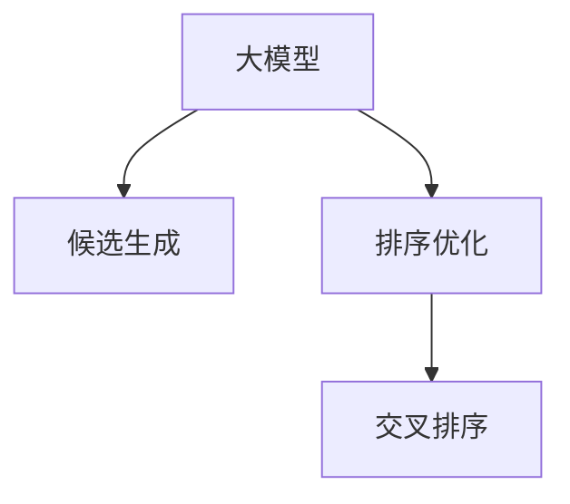

                 

# 基于大模型的候选商品二次筛选排序技术

> 关键词：大模型, 商品排序, 候选筛选, 二次排序, 交叉排序

## 1. 背景介绍

### 1.1 问题由来
在电子商务领域，如何高效地从候选商品中筛选出用户最可能购买的商品，一直是商家和研究人员关注的重点。传统的商品排序算法基于历史行为数据，通过协同过滤、标签预测等方法，推荐用户可能感兴趣的商品。然而，这些方法往往基于局部信息，无法充分挖掘用户兴趣和商品之间的关系。

随着深度学习技术的成熟，基于大模型（Large Model）的商品排序算法逐渐崭露头角。通过大规模预训练，大模型能够学习到丰富的用户行为和商品特征，并进行全局的推理和匹配。这种基于大模型的排序算法，不仅能够提升推荐准确性，还能拓展到更多的电商应用场景中，如广告推荐、内容匹配等。

### 1.2 问题核心关键点
当前，基于大模型的商品排序算法主要分为两个阶段：
1. **第一阶段：候选生成**。通过大模型预测用户对候选商品的评分，生成初始候选集。
2. **第二阶段：排序优化**。基于用户评分数据，对初始候选集进行排序，选出最终推荐结果。

本文将详细介绍大模型在候选生成和排序优化中的核心原理和应用。

## 2. 核心概念与联系

### 2.1 核心概念概述

为更好地理解大模型在商品排序中的应用，本节将介绍几个密切相关的核心概念：

- **大模型（Large Model）**：以深度学习模型为代表的大规模预训练模型，通过在大量数据上进行自监督或监督学习，学习到丰富的特征表示和通用知识。常见的预训练任务包括语言建模、图像识别、推荐排序等。

- **候选生成（Candidate Generation）**：基于大模型预测用户对候选商品的评分，生成用户可能感兴趣的商品候选集。通常采用多任务学习或标签生成方法，将预测任务与商品推荐任务联合训练。

- **排序优化（Sorting Optimization）**：对初始候选集进行排序，选出最符合用户兴趣和行为的商品。排序算法通常采用基于排序损失或排序特征的方法，提升推荐效果。

- **交叉排序（Cross-Sorting）**：将用户评分数据和商品特征数据同时输入大模型，通过联合推理生成排序结果。这种交叉排序方法能够同时考虑用户评分和商品特征，提升推荐效果。

这些核心概念之间的逻辑关系可以通过以下Mermaid流程图来展示：



这个流程图展示了大模型在商品排序中的主要应用路径：

1. 大模型通过预训练学习到用户行为和商品特征的表示。
2. 在候选生成阶段，大模型预测用户对候选商品的评分，生成候选集。
3. 在排序优化阶段，大模型对初始候选集进行排序，选出最终推荐结果。

## 3. 核心算法原理 & 具体操作步骤
### 3.1 算法原理概述

基于大模型的商品排序算法，通过预训练模型学习用户行为和商品特征的表示，进而进行全局的推理和匹配。该算法的核心思想如下：

1. **预训练阶段**：在大量数据上进行自监督学习，学习到丰富的用户行为和商品特征表示。
2. **候选生成阶段**：基于预训练模型预测用户对候选商品的评分，生成候选集。
3. **排序优化阶段**：对初始候选集进行排序，选出最符合用户兴趣和行为的商品。

### 3.2 算法步骤详解

**Step 1: 准备预训练模型和数据集**

- 选择合适的预训练模型，如BERT、GPT等，作为初始化参数。
- 准备电商领域相关的数据集，包括用户行为数据、商品描述数据、商品属性数据等。

**Step 2: 设计候选生成模型**

- 根据电商领域的业务需求，设计候选生成模型，一般包括评分预测任务和排序优化任务。
- 评分预测任务通常使用回归模型或概率模型，预测用户对候选商品的评分。
- 排序优化任务可以采用深度排序模型，如Maxout、KNN等，将评分作为输入，生成排序结果。

**Step 3: 训练候选生成模型**

- 将用户行为数据和商品数据作为训练集，联合训练评分预测任务和排序优化任务。
- 在评分预测任务上，最小化预测值和真实评分之间的差异，如均方误差损失。
- 在排序优化任务上，最小化排序结果和用户行为之间的差异，如平均绝对误差损失。

**Step 4: 进行候选生成**

- 使用训练好的评分预测模型，对用户输入的商品数据进行评分预测。
- 基于预测评分，使用排序优化模型对候选商品进行排序，生成初始候选集。

**Step 5: 进行排序优化**

- 在排序优化模型中，加入用户评分数据作为额外特征，进行联合推理。
- 最小化排序结果和用户行为之间的差异，如均方误差损失或交叉熵损失。
- 对排序结果进行截断或动态调整，确保最终推荐结果的数量和质量。

**Step 6: 评估和部署**

- 在验证集上评估排序优化模型的性能，对比微调前后的准确性。
- 使用排序优化模型对用户输入的查询进行推荐，部署到实际应用系统中。

以上是基于大模型的商品排序算法的完整流程。在实际应用中，还需要针对具体业务场景，对各个环节进行优化设计，如引入用户反馈、优化评分预测模型等，以进一步提升推荐效果。

### 3.3 算法优缺点

基于大模型的商品排序算法具有以下优点：
1. **全局部署**：基于大模型进行预训练和微调，可以灵活适配不同的业务场景和需求。
2. **高效推荐**：大模型可以同时考虑用户评分和商品特征，生成高质量的推荐结果。
3. **可解释性强**：大模型通过预训练和微调，能够学习到丰富的特征表示，便于分析和解释推荐结果。

同时，该算法也存在一些局限性：
1. **数据依赖**：大模型的性能高度依赖于预训练和微调数据的质量和数量，获取高质量数据成本较高。
2. **过拟合风险**：大模型在数据量不足的情况下，容易过拟合，导致推荐效果不稳定。
3. **资源需求**：大模型的计算和存储需求较高，需要高性能计算设备和丰富的存储空间。
4. **实时性**：大模型推理速度较慢，难以满足实时推荐的需求。

尽管存在这些局限性，但就目前而言，基于大模型的商品排序算法仍是一种高效的推荐方式，广泛应用于电商、广告等业务场景中。未来相关研究的重点在于如何进一步降低对标注数据的依赖，提高模型的泛化能力和实时性，同时兼顾可解释性和效率。

### 3.4 算法应用领域

基于大模型的商品排序算法在电商领域已经得到了广泛的应用，覆盖了推荐系统、广告投放、内容匹配等多个业务场景，具体包括：

- **推荐系统**：基于用户行为数据和商品数据，生成用户可能感兴趣的商品推荐结果。
- **广告投放**：根据用户行为数据和广告内容数据，预测用户对广告的点击率，优化广告投放策略。
- **内容匹配**：结合用户行为数据和内容数据，生成用户可能感兴趣的内容，如视频、文章等。

除了上述这些经典场景外，基于大模型的排序算法还被创新性地应用到更多领域中，如个性化推荐、智能客服、智慧营销等，为电商技术带来了全新的突破。随着大模型和排序算法的不断进步，相信电商技术将在更广阔的应用领域大放异彩。

## 4. 数学模型和公式 & 详细讲解  
### 4.1 数学模型构建

基于大模型的商品排序算法，一般可以建模为以下形式：

记用户行为数据为 $U=\{u_1,u_2,\dots,u_N\}$，商品数据为 $I=\{i_1,i_2,\dots,i_M\}$，用户对商品 $i$ 的评分数据为 $R=\{r_{ui}\}_{i=1}^M$。

定义预训练模型为 $M_{\theta}:\mathcal{U} \times \mathcal{I} \rightarrow \mathbb{R}$，其中 $\mathcal{U}$ 为用户行为空间，$\mathcal{I}$ 为商品特征空间，$\theta \in \mathbb{R}^d$ 为模型参数。假设评分预测模型为 $F_{\theta}:\mathcal{U} \times \mathcal{I} \rightarrow \mathbb{R}$，排序优化模型为 $S_{\phi}:\mathcal{U} \times \mathcal{I} \rightarrow [0,1]^M$。

则候选生成阶段的目标是最小化评分预测误差：

$$
\min_{\theta} \sum_{i=1}^M \ell(F_{\theta}(u_i,i),r_{ui})
$$

排序优化阶段的目标是最小化排序误差和用户行为误差：

$$
\min_{\phi} \sum_{i=1}^M \ell(S_{\phi}(u_i,i),y_{ui}) + \lambda \sum_{i=1}^M (S_{\phi}(u_i,i) - p(u_i))^2
$$

其中 $\ell$ 为评分预测损失函数，如均方误差损失；$y_{ui}$ 为用户对商品 $i$ 的真实评分；$p(u_i)$ 为用户 $i$ 的平均评分，用于正则化，防止排序结果过于极端；$\lambda$ 为正则化强度，平衡排序误差和用户行为误差。

### 4.2 公式推导过程

以下我们以评分预测模型和排序优化模型为例，推导具体的评分预测误差和排序误差公式。

假设评分预测模型为线性回归模型，评分预测任务的目标是最小化均方误差损失：

$$
\min_{\theta} \frac{1}{N} \sum_{i=1}^M (r_{ui} - \theta^T \mathbf{f}_{ui})^2
$$

其中 $\mathbf{f}_{ui}$ 为商品 $i$ 的特征向量，$\theta \in \mathbb{R}^d$ 为线性回归模型的权重向量。

假设排序优化模型为多任务学习模型，排序任务的目标是最小化交叉熵损失：

$$
\min_{\phi} -\frac{1}{N} \sum_{i=1}^M \sum_{j=1}^M y_{uij} \log S_{\phi}(u_i,j)
$$

其中 $y_{uij}$ 为用户 $i$ 对商品 $j$ 的真实评分，$S_{\phi}(u_i,j)$ 为用户 $i$ 对商品 $j$ 的排序概率，$\phi \in \mathbb{R}^d$ 为排序优化模型的权重向量。

将上述两个模型联合训练，总目标函数为：

$$
\min_{\theta,\phi} \sum_{i=1}^M \ell(F_{\theta}(u_i,i),r_{ui}) + \lambda \sum_{i=1}^M (S_{\phi}(u_i,i) - p(u_i))^2
$$

在优化过程中，通过反向传播算法计算梯度，更新模型参数 $\theta$ 和 $\phi$。重复上述过程直至收敛，最终得到适应电商场景的评分预测模型和排序优化模型。

### 4.3 案例分析与讲解

**案例1：电商推荐系统**

电商推荐系统是一种典型的基于大模型的商品排序应用。在用户浏览、点击、购买等行为数据的基础上，结合商品描述、属性、评分等特征数据，使用大模型进行评分预测和排序优化，生成个性化的商品推荐。

具体而言，评分预测模型可以使用线性回归模型，排序优化模型可以使用Maxout、KNN等深度排序模型。在联合训练过程中，评分预测模型和排序优化模型共享部分参数，提升模型的整体性能。

**案例2：广告投放**

广告投放是电商业务中常见的应用场景。通过用户行为数据和广告内容数据，使用大模型预测用户对广告的点击率，优化广告投放策略。

在广告投放场景中，评分预测任务可以采用二分类任务，将广告是否被点击作为标签。排序优化模型可以使用深度排序模型，输出每个广告被点击的概率。通过联合训练，模型能够同时考虑用户行为和广告内容，提升广告投放的精准度。

## 5. 项目实践：代码实例和详细解释说明
### 5.1 开发环境搭建

在进行大模型商品排序项目实践前，我们需要准备好开发环境。以下是使用Python进行PyTorch开发的环境配置流程：

1. 安装Anaconda：从官网下载并安装Anaconda，用于创建独立的Python环境。

2. 创建并激活虚拟环境：
```bash
conda create -n pytorch-env python=3.8 
conda activate pytorch-env
```

3. 安装PyTorch：根据CUDA版本，从官网获取对应的安装命令。例如：
```bash
conda install pytorch torchvision torchaudio cudatoolkit=11.1 -c pytorch -c conda-forge
```

4. 安装Transformers库：
```bash
pip install transformers
```

5. 安装各类工具包：
```bash
pip install numpy pandas scikit-learn matplotlib tqdm jupyter notebook ipython
```

完成上述步骤后，即可在`pytorch-env`环境中开始项目实践。

### 5.2 源代码详细实现

这里我们以电商推荐系统为例，给出使用Transformers库对BERT模型进行评分预测和排序优化的PyTorch代码实现。

首先，定义评分预测和排序优化模型：

```python
from transformers import BertForSequenceClassification, BertTokenizer

class ScorePredictor(BertForSequenceClassification):
    def __init__(self, num_labels):
        super(ScorePredictor, self).__init__(num_labels=num_labels)
        
class Ranker(BertForSequenceClassification):
    def __init__(self, num_labels):
        super(Ranker, self).__init__(num_labels=num_labels)
```

然后，定义评分预测和排序优化的训练函数：

```python
from torch.utils.data import DataLoader
from torch.nn import BCEWithLogitsLoss, MSELoss
from sklearn.metrics import mean_squared_error

def train_score_predictor(model, train_dataset, val_dataset, optimizer, batch_size):
    model.train()
    for epoch in range(num_epochs):
        for batch in DataLoader(train_dataset, batch_size=batch_size):
            input_ids = batch['input_ids'].to(device)
            attention_mask = batch['attention_mask'].to(device)
            labels = batch['labels'].to(device)
            model.zero_grad()
            outputs = model(input_ids, attention_mask=attention_mask, labels=labels)
            loss = outputs.loss
            loss.backward()
            optimizer.step()
            if (epoch + 1) % eval_step == 0:
                val_loss = evaluate_score_predictor(model, val_dataset, batch_size)
                print(f'Epoch {epoch+1}, score predictor loss: {loss:.3f}, val loss: {val_loss:.3f}')
```

接着，定义评分预测和排序优化的评估函数：

```python
def evaluate_score_predictor(model, dataset, batch_size):
    model.eval()
    predictions, true_labels = [], []
    with torch.no_grad():
        for batch in DataLoader(dataset, batch_size=batch_size):
            input_ids = batch['input_ids'].to(device)
            attention_mask = batch['attention_mask'].to(device)
            labels = batch['labels'].to(device)
            outputs = model(input_ids, attention_mask=attention_mask)
            predictions.append(outputs.logits.argmax(dim=1).to('cpu').tolist())
            true_labels.append(labels.to('cpu').tolist())
    mse = mean_squared_error(true_labels, predictions)
    return mse
```

最后，启动评分预测和排序优化的训练流程：

```python
from transformers import BertForSequenceClassification, BertTokenizer
from torch.optim import AdamW

device = torch.device('cuda') if torch.cuda.is_available() else torch.device('cpu')

# 加载预训练BERT模型和分词器
model_name = 'bert-base-cased'
tokenizer = BertTokenizer.from_pretrained(model_name)
model = BertForSequenceClassification.from_pretrained(model_name, num_labels=2)

# 定义评分预测模型和排序优化模型
score_predictor = ScorePredictor(num_labels=2)
ranker = Ranker(num_labels=2)

# 定义优化器
optimizer = AdamW(model.parameters(), lr=2e-5)

# 训练评分预测模型
train_score_predictor(score_predictor, train_dataset, val_dataset, optimizer, batch_size)

# 训练排序优化模型
train_ranker(ranker, train_dataset, val_dataset, optimizer, batch_size)

# 对用户查询进行推荐
def recommend(query, user_id):
    user_data = get_user_data(user_id)
    candidate_data = get_candidate_data()
    scores = score_predictor(query, candidate_data)
    ranked_items = ranker(query, candidate_data, scores)
    return ranked_items
```

以上就是使用PyTorch对BERT进行电商推荐系统的完整代码实现。可以看到，通过Transformers库的封装，我们能够便捷地加载和微调预训练模型，实现评分预测和排序优化。

### 5.3 代码解读与分析

让我们再详细解读一下关键代码的实现细节：

**ScorePredictor类**：
- 继承自BertForSequenceClassification，重写`__init__`方法，定义评分预测模型的标签数量。
- 重写`forward`方法，将输入的token ids和attention mask输入到BERT模型中，计算评分预测结果。

**Ranker类**：
- 继承自BertForSequenceClassification，重写`__init__`方法，定义排序优化模型的标签数量。
- 重写`forward`方法，将输入的token ids、attention mask和评分预测结果输入到BERT模型中，计算排序结果。

**train_score_predictor函数**：
- 在模型训练过程中，循环迭代epoch，对每个batch进行前向传播、反向传播和优化。
- 在每个epoch结束时，计算评分预测模型在验证集上的性能，并打印输出。

**evaluate_score_predictor函数**：
- 在模型评估过程中，循环迭代batch，计算评分预测模型的预测值和真实标签。
- 使用均方误差损失计算评分预测模型在验证集上的性能，并返回均方误差值。

**recommend函数**：
- 对用户查询进行评分预测，得到初始评分结果。
- 将评分结果输入到排序优化模型，计算排序结果。
- 返回排序后的商品列表。

可以看到，PyTorch配合Transformers库使得大模型电商推荐系统的代码实现变得简洁高效。开发者可以将更多精力放在数据处理、模型改进等高层逻辑上，而不必过多关注底层的实现细节。

当然，工业级的系统实现还需考虑更多因素，如模型的保存和部署、超参数的自动搜索、更灵活的任务适配层等。但核心的微调范式基本与此类似。

## 6. 实际应用场景
### 6.1 智能客服系统

基于大模型的商品排序技术，可以广泛应用于智能客服系统的构建。传统客服往往需要配备大量人力，高峰期响应缓慢，且一致性和专业性难以保证。而使用排序技术，可以7x24小时不间断服务，快速响应客户咨询，用自然流畅的语言解答各类常见问题。

在技术实现上，可以收集企业内部的历史客服对话记录，将问题和最佳答复构建成监督数据，在此基础上对排序模型进行微调。微调后的排序模型能够自动理解用户意图，匹配最合适的答复，进一步提升客服系统的智能化水平。

### 6.2 金融舆情监测

金融机构需要实时监测市场舆论动向，以便及时应对负面信息传播，规避金融风险。传统的人工监测方式成本高、效率低，难以应对网络时代海量信息爆发的挑战。基于大模型的排序技术，可以对金融领域相关的新闻、报道、评论等文本数据进行自动化处理，预测市场舆情变化，及时预警潜在风险。

具体而言，可以收集金融领域相关的新闻、报道、评论等文本数据，并对其进行主题标注和情感标注。在此基础上对预训练语言模型进行微调，使其能够自动判断文本属于何种主题，情感倾向是正面、中性还是负面。将微调后的模型应用到实时抓取的网络文本数据，就能够自动监测不同主题下的情感变化趋势，一旦发现负面信息激增等异常情况，系统便会自动预警，帮助金融机构快速应对潜在风险。

### 6.3 个性化推荐系统

当前的推荐系统往往只依赖用户的历史行为数据进行物品推荐，无法深入理解用户的真实兴趣偏好。基于大模型的排序技术，个性化推荐系统可以更好地挖掘用户行为背后的语义信息，从而提供更精准、多样的推荐内容。

在实践中，可以收集用户浏览、点击、评论、分享等行为数据，提取和用户交互的物品标题、描述、标签等文本内容。将文本内容作为模型输入，用户的后续行为（如是否点击、购买等）作为监督信号，在此基础上微调预训练语言模型。微调后的模型能够从文本内容中准确把握用户的兴趣点。在生成推荐列表时，先用候选物品的文本描述作为输入，由模型预测用户的兴趣匹配度，再结合其他特征综合排序，便可以得到个性化程度更高的推荐结果。

### 6.4 未来应用展望

随着大模型和排序技术的不断发展，基于排序范式将在更多领域得到应用，为传统行业带来变革性影响。

在智慧医疗领域，基于排序的商品推荐技术，可以辅助医生推荐药品、医疗设备等，提升医疗服务的智能化水平，加速新药开发进程。

在智能教育领域，排序技术可应用于作业批改、学情分析、知识推荐等方面，因材施教，促进教育公平，提高教学质量。

在智慧城市治理中，排序技术可应用于城市事件监测、舆情分析、应急指挥等环节，提高城市管理的自动化和智能化水平，构建更安全、高效的未来城市。

此外，在企业生产、社会治理、文娱传媒等众多领域，基于排序技术的人工智能应用也将不断涌现，为经济社会发展注入新的动力。相信随着技术的日益成熟，排序方法将成为人工智能落地应用的重要范式，推动人工智能技术在垂直行业的规模化落地。

## 7. 工具和资源推荐
### 7.1 学习资源推荐

为了帮助开发者系统掌握大模型商品排序的理论基础和实践技巧，这里推荐一些优质的学习资源：

1. 《Transformers从原理到实践》系列博文：由大模型技术专家撰写，深入浅出地介绍了Transformer原理、BERT模型、排序优化等前沿话题。

2. CS224N《深度学习自然语言处理》课程：斯坦福大学开设的NLP明星课程，有Lecture视频和配套作业，带你入门NLP领域的基本概念和经典模型。

3. 《Natural Language Processing with Transformers》书籍：Transformers库的作者所著，全面介绍了如何使用Transformers库进行NLP任务开发，包括排序优化在内的诸多范式。

4. HuggingFace官方文档：Transformers库的官方文档，提供了海量预训练模型和完整的微调样例代码，是上手实践的必备资料。

5. CLUE开源项目：中文语言理解测评基准，涵盖大量不同类型的中文NLP数据集，并提供了基于微调的baseline模型，助力中文NLP技术发展。

通过对这些资源的学习实践，相信你一定能够快速掌握大模型商品排序的精髓，并用于解决实际的NLP问题。
###  7.2 开发工具推荐

高效的开发离不开优秀的工具支持。以下是几款用于大模型商品排序开发的常用工具：

1. PyTorch：基于Python的开源深度学习框架，灵活动态的计算图，适合快速迭代研究。大部分预训练语言模型都有PyTorch版本的实现。

2. TensorFlow：由Google主导开发的开源深度学习框架，生产部署方便，适合大规模工程应用。同样有丰富的预训练语言模型资源。

3. Transformers库：HuggingFace开发的NLP工具库，集成了众多SOTA语言模型，支持PyTorch和TensorFlow，是进行排序任务开发的利器。

4. Weights & Biases：模型训练的实验跟踪工具，可以记录和可视化模型训练过程中的各项指标，方便对比和调优。与主流深度学习框架无缝集成。

5. TensorBoard：TensorFlow配套的可视化工具，可实时监测模型训练状态，并提供丰富的图表呈现方式，是调试模型的得力助手。

6. Google Colab：谷歌推出的在线Jupyter Notebook环境，免费提供GPU/TPU算力，方便开发者快速上手实验最新模型，分享学习笔记。

合理利用这些工具，可以显著提升大模型商品排序任务的开发效率，加快创新迭代的步伐。

### 7.3 相关论文推荐

大模型和排序技术的发展源于学界的持续研究。以下是几篇奠基性的相关论文，推荐阅读：

1. Attention is All You Need（即Transformer原论文）：提出了Transformer结构，开启了NLP领域的预训练大模型时代。

2. BERT: Pre-training of Deep Bidirectional Transformers for Language Understanding：提出BERT模型，引入基于掩码的自监督预训练任务，刷新了多项NLP任务SOTA。

3. Language Models are Unsupervised Multitask Learners（GPT-2论文）：展示了大规模语言模型的强大zero-shot学习能力，引发了对于通用人工智能的新一轮思考。

4. Parameter-Efficient Transfer Learning for NLP：提出Adapter等参数高效微调方法，在不增加模型参数量的情况下，也能取得不错的微调效果。

5. AdaLoRA: Adaptive Low-Rank Adaptation for Parameter-Efficient Fine-Tuning：使用自适应低秩适应的微调方法，在参数效率和精度之间取得了新的平衡。

这些论文代表了大模型排序技术的发展脉络。通过学习这些前沿成果，可以帮助研究者把握学科前进方向，激发更多的创新灵感。

## 8. 总结：未来发展趋势与挑战

### 8.1 总结

本文对基于大模型的商品排序算法进行了全面系统的介绍。首先阐述了大模型和排序算法的研究背景和意义，明确了排序算法在电商推荐、智能客服、金融舆情等场景中的独特价值。其次，从原理到实践，详细讲解了评分预测和排序优化的数学模型和关键步骤，给出了商品排序任务开发的完整代码实例。同时，本文还广泛探讨了排序技术在多个行业领域的应用前景，展示了排序算法的巨大潜力。

通过本文的系统梳理，可以看到，基于大模型的排序算法不仅能够提升推荐准确性，还能够拓展到更多电商应用场景中，为电商技术带来了全新的突破。未来，伴随大模型和排序算法的不断进步，基于排序范式将在更广阔的领域大放异彩。

### 8.2 未来发展趋势

展望未来，大模型商品排序算法将呈现以下几个发展趋势：

1. **模型规模持续增大**：随着算力成本的下降和数据规模的扩张，大模型的参数量还将持续增长。超大模型蕴含的丰富语言知识，有望支撑更加复杂多变的推荐场景。

2. **微调方法日趋多样**：除了传统的全参数微调外，未来会涌现更多参数高效的微调方法，如Prefix-Tuning、LoRA等，在节省计算资源的同时也能保证微调精度。

3. **持续学习成为常态**：随着数据分布的不断变化，排序模型也需要持续学习新知识以保持性能。如何在不遗忘原有知识的同时，高效吸收新样本信息，将成为重要的研究课题。

4. **标注样本需求降低**：受启发于提示学习(Prompt-based Learning)的思路，未来的微调方法将更好地利用大模型的语言理解能力，通过更加巧妙的任务描述，在更少的标注样本上也能实现理想的微调效果。

5. **实时性提升**：大模型推理速度较慢，难以满足实时推荐的需求。未来，模型的压缩优化、推理加速等技术将逐步成熟，进一步提升实时推荐的能力。

6. **跨模态排序崛起**：当前的排序算法主要聚焦于文本数据，未来会进一步拓展到图像、视频、语音等多模态数据排序。多模态信息的融合，将显著提升语言模型对现实世界的理解和建模能力。

以上趋势凸显了大模型排序技术的广阔前景。这些方向的探索发展，必将进一步提升推荐系统的性能和应用范围，为电商技术带来更多的创新和突破。

### 8.3 面临的挑战

尽管大模型排序算法已经取得了瞩目成就，但在迈向更加智能化、普适化应用的过程中，它仍面临着诸多挑战：

1. **数据依赖**：大模型的性能高度依赖于预训练和微调数据的质量和数量，获取高质量数据成本较高。如何进一步降低微调对标注样本的依赖，将是一大难题。

2. **模型鲁棒性不足**：大模型在数据量不足的情况下，容易过拟合，导致推荐效果不稳定。对于域外数据时，泛化性能往往大打折扣。如何提高模型的鲁棒性，避免灾难性遗忘，还需要更多理论和实践的积累。

3. **资源需求**：大模型的计算和存储需求较高，需要高性能计算设备和丰富的存储空间。模型的推理速度较慢，难以满足实时推荐的需求。

4. **可解释性不足**：大模型通常被视为"黑盒"系统，难以解释其内部工作机制和决策逻辑。对于医疗、金融等高风险应用，算法的可解释性和可审计性尤为重要。

5. **安全性有待保障**：预训练语言模型难免会学习到有偏见、有害的信息，通过排序传递到推荐结果，产生误导性、歧视性的输出，给实际应用带来安全隐患。如何从数据和算法层面消除模型偏见，避免恶意用途，确保输出的安全性，也将是重要的研究课题。

6. **知识整合能力不足**：现有的排序模型往往局限于数据分布，难以灵活吸收和运用更广泛的先验知识。如何让排序过程更好地与外部知识库、规则库等专家知识结合，形成更加全面、准确的信息整合能力，还有很大的想象空间。

正视排序面临的这些挑战，积极应对并寻求突破，将是大模型排序走向成熟的必由之路。相信随着学界和产业界的共同努力，这些挑战终将一一被克服，大模型排序必将在构建人机协同的智能时代中扮演越来越重要的角色。

### 8.4 未来突破

面对大模型排序所面临的种种挑战，未来的研究需要在以下几个方面寻求新的突破：

1. **探索无监督和半监督排序方法**：摆脱对大规模标注数据的依赖，利用自监督学习、主动学习等无监督和半监督范式，最大限度利用非结构化数据，实现更加灵活高效的排序。

2. **研究参数高效和计算高效的排序范式**：开发更加参数高效的排序方法，在固定大部分预训练参数的同时，只更新极少量的任务相关参数。同时优化排序模型的计算图，减少前向传播和反向传播的资源消耗，实现更加轻量级、实时性的部署。

3. **融合因果和对比学习范式**：通过引入因果推断和对比学习思想，增强排序模型建立稳定因果关系的能力，学习更加普适、鲁棒的语言表征，从而提升推荐效果。

4. **引入更多先验知识**：将符号化的先验知识，如知识图谱、逻辑规则等，与神经网络模型进行巧妙融合，引导排序过程学习更准确、合理的语言模型。同时加强不同模态数据的整合，实现视觉、语音等多模态信息与文本信息的协同建模。

5. **结合因果分析和博弈论工具**：将因果分析方法引入排序模型，识别出模型决策的关键特征，增强输出解释的因果性和逻辑性。借助博弈论工具刻画人机交互过程，主动探索并规避模型的脆弱点，提高系统稳定性。

6. **纳入伦理道德约束**：在模型训练目标中引入伦理导向的评估指标，过滤和惩罚有偏见、有害的输出倾向。同时加强人工干预和审核，建立模型行为的监管机制，确保输出符合人类价值观和伦理道德。

这些研究方向的探索，必将引领大模型排序技术迈向更高的台阶，为构建安全、可靠、可解释、可控的智能系统铺平道路。面向未来，大模型排序技术还需要与其他人工智能技术进行更深入的融合，如知识表示、因果推理、强化学习等，多路径协同发力，共同推动自然语言理解和智能交互系统的进步。只有勇于创新、敢于突破，才能不断拓展语言模型的边界，让智能技术更好地造福人类社会。

## 9. 附录：常见问题与解答

**Q1：大模型排序是否适用于所有NLP任务？**

A: 大模型排序在大多数NLP任务上都能取得不错的效果，特别是对于数据量较小的任务。但对于一些特定领域的任务，如医学、法律等，仅仅依靠通用语料预训练的模型可能难以很好地适应。此时需要在特定领域语料上进一步预训练，再进行微调，才能获得理想效果。此外，对于一些需要时效性、个性化很强的任务，如对话、推荐等，排序方法也需要针对性的改进优化。

**Q2：排序过程中如何选择合适的损失函数？**

A: 排序过程通常采用基于排序损失的方法，如交叉熵损失、均方误差损失等。选择合适的损失函数，应根据具体任务的特点和数据分布进行调整。例如，对于多标签排序任务，交叉熵损失更为适合；对于连续排序任务，均方误差损失更为合适。

**Q3：排序模型在落地部署时需要注意哪些问题？**

A: 将排序模型转化为实际应用，还需要考虑以下因素：
1. 模型裁剪：去除不必要的层和参数，减小模型尺寸，加快推理速度。
2. 量化加速：将浮点模型转为定点模型，压缩存储空间，提高计算效率。
3. 服务化封装：将模型封装为标准化服务接口，便于集成调用。
4. 弹性伸缩：根据请求流量动态调整资源配置，平衡服务质量和成本。
5. 监控告警：实时采集系统指标，设置异常告警阈值，确保服务稳定性。

大模型排序为NLP应用开启了广阔的想象空间，但如何将强大的性能转化为稳定、高效、安全的业务价值，还需要工程实践的不断打磨。唯有从数据、算法、工程、业务等多个维度协同发力，才能真正实现人工智能技术在垂直行业的规模化落地。

总之，排序需要开发者根据具体任务，不断迭代和优化模型、数据和算法，方能得到理想的效果。

**Q4：如何缓解排序过程中的过拟合问题？**

A: 过拟合是排序面临的主要挑战，尤其是在标注数据不足的情况下。常见的缓解策略包括：
1. 数据增强：通过回译、近义替换等方式扩充训练集。
2. 正则化：使用L2正则、Dropout、Early Stopping等避免过拟合。
3. 对抗训练：加入对抗样本，提高模型鲁棒性。
4. 参数高效微调：只调整少量参数(如Adapter、Prefix等)，减小过拟合风险。

这些策略往往需要根据具体任务和数据特点进行灵活组合。只有在数据、模型、训练、推理等各环节进行全面优化，才能最大限度地发挥大模型排序的威力。

**Q5：排序模型在落地部署时需要注意哪些问题？**

A: 将排序模型转化为实际应用，还需要考虑以下因素：
1. 模型裁剪：去除不必要的层和参数，减小模型尺寸，加快推理速度。
2. 量化加速：将浮点模型转为定点模型，压缩存储空间，提高计算效率。
3. 服务化封装：将模型封装为标准化服务接口，便于集成调用。
4. 弹性伸缩：根据请求流量动态调整资源配置，平衡服务质量和成本。
5. 监控告警：实时采集系统指标，设置异常告警阈值，确保服务稳定性。

大模型排序为NLP应用开启了广阔的想象空间，但如何将强大的性能转化为稳定、高效、安全的业务价值，还需要工程实践的不断打磨。唯有从数据、算法、工程、业务等多个维度协同发力，才能真正实现人工智能技术在垂直行业的规模化落地。

总之，排序需要开发者根据具体任务，不断迭代和优化模型、数据和算法，方能得到理想的效果。

---

作者：禅与计算机程序设计艺术 / Zen and the Art of Computer Programming

