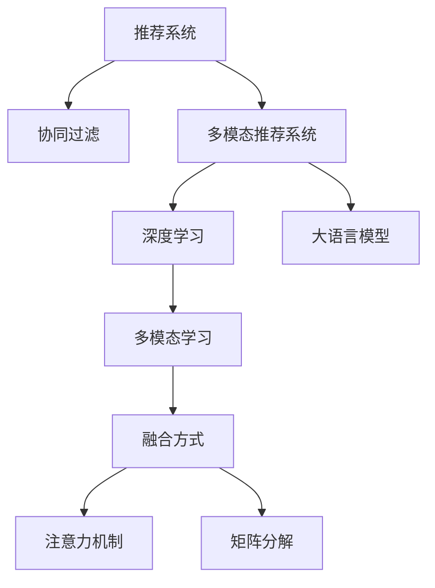

                 

# 基于大模型的多模态推荐系统

> 关键词：多模态推荐系统, 大语言模型, 协同过滤, 深度学习, 个性化推荐, 特征工程

## 1. 背景介绍

### 1.1 问题由来
随着互联网的迅猛发展，用户在各个平台上的数据生成量急剧增加。如何高效利用这些数据，为用户提供精准、个性化的推荐服务，成为了各大平台争相研究的重点。传统的基于协同过滤的推荐算法，由于用户行为数据的稀疏性和冷启动问题，无法很好地覆盖长尾用户和物品，推荐效果往往不尽人意。

近年来，随着深度学习和大语言模型的兴起，多模态推荐系统逐渐成为了研究热点。通过引入多种数据模态（如文本、图片、评分、行为等），多模态推荐系统可以更好地捕捉用户和物品的复杂特征，提升推荐效果。在学术界和工业界，基于多模态数据构建推荐系统已经成为了一大趋势。

### 1.2 问题核心关键点
多模态推荐系统的核心在于如何将不同模态的数据融合在一起，构建出一个能够全面反映用户和物品特性的推荐模型。常见的融合方式包括矩阵分解、注意力机制、深度神经网络等。其中，深度学习模型由于其强大的特征学习和表示能力，成为了多模态推荐系统的主流选择。

本文聚焦于基于深度学习的大语言模型在多模态推荐系统中的应用。首先，我们将介绍多模态推荐系统及其常见融合方式的原理，然后重点探讨如何利用大语言模型进行推荐任务的建模和优化。

## 2. 核心概念与联系

### 2.1 核心概念概述

为了更好地理解基于深度学习的多模态推荐系统，本节将介绍几个密切相关的核心概念：

- 推荐系统(Recommender System)：利用用户历史行为数据或物品属性信息，为用户推荐可能感兴趣的物品的系统。
- 协同过滤(Collaborative Filtering)：通过用户行为相似度或物品相似度构建用户或物品的隐向量表示，预测用户对物品的兴趣。
- 多模态推荐系统(Multimodal Recommender System)：结合多种数据模态（如文本、图片、评分等），构建更加全面、准确的用户和物品特征表示，提升推荐效果。
- 深度学习(Deep Learning)：使用多层神经网络进行特征学习和表示，适用于大规模、高维度数据建模。
- 大语言模型(Large Language Model, LLM)：通过预训练获得丰富语言知识的模型，能够进行文本生成、语义理解等复杂任务。
- 多模态学习(Multimodal Learning)：结合多种模态数据，学习更全面、鲁棒的特征表示。

这些概念之间的逻辑关系可以通过以下Mermaid流程图来展示：



这个流程图展示了大语言模型和多模态推荐系统的主要组件和它们之间的关系：

1. 推荐系统通过协同过滤等传统方法，使用用户历史行为数据或物品属性信息进行推荐。
2. 多模态推荐系统引入更多模态数据，如文本、图片等，构建更丰富的用户和物品特征表示。
3. 深度学习模型可以处理高维度、非线性数据，成为多模态推荐系统的主流选择。
4. 大语言模型通过预训练获得语言知识，可以更好地处理文本模态数据。
5. 多模态学习通过融合不同模态数据，学习出更全面、鲁棒的特征表示。

这些概念共同构成了多模态推荐系统的核心，使得系统能够更好地理解用户和物品的复杂特征，提供更加精准的推荐服务。

## 3. 核心算法原理 & 具体操作步骤

### 3.1 算法原理概述

基于深度学习的多模态推荐系统，其核心思想是利用多种模态数据构建用户和物品的特征表示，并通过深度神经网络进行融合学习，从而提升推荐效果。假设用户表示为 $U$，物品表示为 $I$，评分矩阵为 $R$。

多模态推荐系统的常见融合方式包括矩阵分解、注意力机制、深度神经网络等。其中，深度学习模型由于其强大的特征学习和表示能力，成为了多模态推荐系统的主流选择。

假设我们使用了 $K$ 种模态数据，记为 $M=\{M_1, M_2, \cdots, M_K\}$。每种模态数据 $M_k$ 可以表示为 $M_k = \{(x_k^{(i)}, y_k^{(i)})\}_{i=1}^N$，其中 $x_k^{(i)}$ 为第 $i$ 个用户或物品在 $k$ 模态下的特征表示，$y_k^{(i)}$ 为对应的评分或标签。

多模态推荐系统的目标是最小化预测评分与真实评分之间的误差，即：

$$
\min_{U, I, R} \sum_{i,j} || R_{ij} - \hat{R}_{ij} ||^2
$$

其中 $\hat{R}_{ij}$ 为基于用户和物品特征表示的评分预测值。

### 3.2 算法步骤详解

基于深度学习的多模态推荐系统一般包括以下几个关键步骤：

**Step 1: 准备数据集**
- 收集不同模态的用户和物品数据，并进行清洗、归一化等预处理。
- 将不同模态的数据拼接在一起，形成统一的数据结构。
- 构建评分矩阵 $R$，将评分或标签信息加入到数据集中。

**Step 2: 特征提取**
- 对每种模态数据进行特征提取，得到对应的特征表示 $x_k^{(i)}$。
- 常用的特征提取方法包括TF-IDF、CNN、RNN等。

**Step 3: 融合学习**
- 将不同模态的特征表示 $x_k^{(i)}$ 拼接在一起，得到用户和物品的融合特征表示 $U$ 和 $I$。
- 使用深度神经网络对融合特征进行建模，构建推荐模型。
- 常见的推荐模型包括矩阵分解模型、深度神经网络、注意力机制等。

**Step 4: 训练优化**
- 使用用户和物品的融合特征表示 $U$ 和 $I$，以及评分矩阵 $R$，进行模型训练。
- 最小化预测评分与真实评分之间的误差，得到最优的用户和物品特征表示 $U^*$ 和 $I^*$。
- 使用交叉验证等方法，评估模型的预测效果。

**Step 5: 推理预测**
- 将新用户和新物品的特征表示输入推荐模型，得到推荐评分。
- 根据推荐评分排序，选择排名靠前的物品推荐给用户。

### 3.3 算法优缺点

基于深度学习的多模态推荐系统具有以下优点：
1. 可处理多种模态数据，融合更多特征，提升推荐效果。
2. 具有强大的特征学习和表示能力，适用于复杂数据建模。
3. 可以通过预训练语言模型增强文本特征的表现力。

同时，该方法也存在一定的局限性：
1. 需要大量的标注数据，对数据获取成本较高。
2. 模型复杂度高，训练和推理速度较慢。
3. 需要仔细设计特征提取和融合方式，提高模型的泛化能力。
4. 模型可解释性较差，难以解释推荐结果背后的原因。

尽管存在这些局限性，但就目前而言，基于深度学习的多模态推荐系统仍是大数据推荐的主流范式。未来相关研究的重点在于如何进一步降低数据获取成本，提高模型的泛化能力和可解释性，同时兼顾计算效率和推荐效果。

### 3.4 算法应用领域

基于深度学习的多模态推荐系统在电商、视频、社交、音乐等多个领域中得到了广泛应用，其推荐的精准度和多样性显著优于传统的协同过滤方法。例如：

- 电商推荐：通过整合用户行为数据、物品属性数据和文本数据，为用户提供个性化的商品推荐。
- 视频推荐：利用用户行为数据、视频特征和评分数据，为用户提供适合的内容推荐。
- 社交推荐：结合用户社交关系和兴趣数据，为用户推荐潜在的联系人或内容。
- 音乐推荐：通过分析用户听歌行为和歌曲特征，推荐符合用户口味的歌曲。

此外，多模态推荐系统还被创新性地应用于更多场景中，如个性化广告、智能客服、智能家居等，为各个行业带来智能化升级。

## 4. 数学模型和公式 & 详细讲解  
### 4.1 数学模型构建

假设我们使用了 $K$ 种模态数据，记为 $M=\{M_1, M_2, \cdots, M_K\}$。每种模态数据 $M_k$ 可以表示为 $M_k = \{(x_k^{(i)}, y_k^{(i)})\}_{i=1}^N$，其中 $x_k^{(i)}$ 为第 $i$ 个用户或物品在 $k$ 模态下的特征表示，$y_k^{(i)}$ 为对应的评分或标签。

假设用户表示为 $U=\{u_1, u_2, \cdots, u_M\}$，物品表示为 $I=\{i_1, i_2, \cdots, i_N\}$，评分矩阵为 $R=\{r_{ui}\}_{i=1}^N$。

多模态推荐系统的目标是最大化用户对物品的评分预测值，即：

$$
\max_{U, I, R} \sum_{i,j} R_{ij} \log \hat{R}_{ij}
$$

其中 $\hat{R}_{ij}$ 为基于用户和物品特征表示的评分预测值。

### 4.2 公式推导过程

以下我们以深度神经网络模型为例，推导推荐模型的优化目标和损失函数。

假设我们使用深度神经网络模型 $F_{\theta}$ 对用户 $u$ 和物品 $i$ 的融合特征 $[u_i, i_i]$ 进行建模，得到评分预测值 $\hat{R}_{ij}$。则优化目标为最大化用户和物品的评分预测值之和，即：

$$
\max_{\theta} \sum_{i,j} R_{ij} \log F_{\theta}([u_i, i_i])
$$

其中 $F_{\theta}([u_i, i_i])$ 为深度神经网络模型对融合特征 $[u_i, i_i]$ 的评分预测值。

为了便于求解，我们对优化目标进行log-sum-exp操作，得到归一化的评分预测值 $\tilde{R}_{ij}$：

$$
\tilde{R}_{ij} = \frac{e^{R_{ij} \log F_{\theta}([u_i, i_i])}}{\sum_{k=1}^N e^{R_{ki} \log F_{\theta}([u_i, i_k])}}
$$

因此，推荐模型的优化目标变为：

$$
\max_{\theta} \sum_{i,j} \log \tilde{R}_{ij}
$$

该目标函数即为多模态推荐系统的损失函数，记为 $\mathcal{L}_{rec}(\theta)$。在训练过程中，我们通过最小化损失函数 $\mathcal{L}_{rec}(\theta)$，更新模型参数 $\theta$，使得模型能够更好地预测用户和物品的评分。

### 4.3 案例分析与讲解

下面我们以电商推荐系统为例，详细讲解深度神经网络模型的具体实现。

电商推荐系统通常会使用用户行为数据、物品属性数据和文本数据。用户行为数据包括用户的浏览记录、购买记录等，物品属性数据包括物品的类别、价格、品牌等，文本数据包括物品的描述、用户评论等。

**Step 1: 特征提取**

对于用户行为数据，可以使用协同过滤方法计算用户和物品之间的相似度，得到用户的隐向量表示。对于物品属性数据，可以直接使用稀疏编码等方法得到物品的隐向量表示。对于文本数据，可以使用BERT等预训练语言模型进行特征提取。

假设我们使用BERT模型对物品描述进行特征提取，得到物品的文本表示 $i_i^{BERT}$。对于用户评论，同样可以使用BERT模型提取文本表示 $u_i^{BERT}$。

**Step 2: 融合学习**

将不同模态的特征表示 $u_i^{BERT}, i_i^{BERT}, x_1^{(i)}, x_2^{(i)}, \cdots, x_k^{(i)}$ 拼接在一起，得到用户和物品的融合特征表示 $[u_i, i_i]$。

假设我们使用深度神经网络模型 $F_{\theta}$ 对融合特征 $[u_i, i_i]$ 进行建模，得到评分预测值 $\hat{R}_{ij}$。

**Step 3: 训练优化**

使用用户和物品的融合特征表示 $[u_i, i_i]$，以及评分矩阵 $R$，进行模型训练。最小化预测评分与真实评分之间的误差，得到最优的用户和物品特征表示 $U^*$ 和 $I^*$。

假设我们使用了稀疏编码模型对用户和物品进行编码，得到用户隐向量表示 $u_i$ 和物品隐向量表示 $i_i$。则模型的优化目标为：

$$
\min_{\theta} \sum_{i,j} || R_{ij} - \hat{R}_{ij} ||^2
$$

其中 $\hat{R}_{ij} = \tilde{R}_{ij}$，$\tilde{R}_{ij}$ 为基于用户和物品特征表示的评分预测值。

### 5. 项目实践：代码实例和详细解释说明
### 5.1 开发环境搭建

在进行多模态推荐系统开发前，我们需要准备好开发环境。以下是使用Python进行PyTorch开发的环境配置流程：

1. 安装Anaconda：从官网下载并安装Anaconda，用于创建独立的Python环境。

2. 创建并激活虚拟环境：
```bash
conda create -n pytorch-env python=3.8 
conda activate pytorch-env
```

3. 安装PyTorch：根据CUDA版本，从官网获取对应的安装命令。例如：
```bash
conda install pytorch torchvision torchaudio cudatoolkit=11.1 -c pytorch -c conda-forge
```

4. 安装TensorFlow：
```bash
conda install tensorflow
```

5. 安装各类工具包：
```bash
pip install numpy pandas scikit-learn matplotlib tqdm jupyter notebook ipython
```

完成上述步骤后，即可在`pytorch-env`环境中开始多模态推荐系统的开发。

### 5.2 源代码详细实现

下面我们以电商推荐系统为例，给出使用PyTorch和Transformer库实现深度神经网络模型的代码实现。

首先，定义电商推荐系统的数据处理函数：

```python
from torch.utils.data import Dataset
import torch

class RetailDataset(Dataset):
    def __init__(self, texts, tags, tokenizer, max_len=128):
        self.texts = texts
        self.tags = tags
        self.tokenizer = tokenizer
        self.max_len = max_len
        
    def __len__(self):
        return len(self.texts)
    
    def __getitem__(self, item):
        text = self.texts[item]
        tags = self.tags[item]
        
        encoding = self.tokenizer(text, return_tensors='pt', max_length=self.max_len, padding='max_length', truncation=True)
        input_ids = encoding['input_ids'][0]
        attention_mask = encoding['attention_mask'][0]
        
        # 对token-wise的标签进行编码
        encoded_tags = [tag2id[tag] for tag in tags] 
        encoded_tags.extend([tag2id['O']] * (self.max_len - len(encoded_tags)))
        labels = torch.tensor(encoded_tags, dtype=torch.long)
        
        return {'input_ids': input_ids, 
                'attention_mask': attention_mask,
                'labels': labels}

# 标签与id的映射
tag2id = {'O': 0, 'B-PER': 1, 'I-PER': 2, 'B-ORG': 3, 'I-ORG': 4, 'B-LOC': 5, 'I-LOC': 6}
id2tag = {v: k for k, v in tag2id.items()}

# 创建dataset
tokenizer = BertTokenizer.from_pretrained('bert-base-cased')

train_dataset = RetailDataset(train_texts, train_tags, tokenizer)
dev_dataset = RetailDataset(dev_texts, dev_tags, tokenizer)
test_dataset = RetailDataset(test_texts, test_tags, tokenizer)
```

然后，定义模型和优化器：

```python
from transformers import BertForTokenClassification, AdamW

model = BertForTokenClassification.from_pretrained('bert-base-cased', num_labels=len(tag2id))

optimizer = AdamW(model.parameters(), lr=2e-5)
```

接着，定义训练和评估函数：

```python
from torch.utils.data import DataLoader
from tqdm import tqdm
from sklearn.metrics import classification_report

device = torch.device('cuda') if torch.cuda.is_available() else torch.device('cpu')
model.to(device)

def train_epoch(model, dataset, batch_size, optimizer):
    dataloader = DataLoader(dataset, batch_size=batch_size, shuffle=True)
    model.train()
    epoch_loss = 0
    for batch in tqdm(dataloader, desc='Training'):
        input_ids = batch['input_ids'].to(device)
        attention_mask = batch['attention_mask'].to(device)
        labels = batch['labels'].to(device)
        model.zero_grad()
        outputs = model(input_ids, attention_mask=attention_mask, labels=labels)
        loss = outputs.loss
        epoch_loss += loss.item()
        loss.backward()
        optimizer.step()
    return epoch_loss / len(dataloader)

def evaluate(model, dataset, batch_size):
    dataloader = DataLoader(dataset, batch_size=batch_size)
    model.eval()
    preds, labels = [], []
    with torch.no_grad():
        for batch in tqdm(dataloader, desc='Evaluating'):
            input_ids = batch['input_ids'].to(device)
            attention_mask = batch['attention_mask'].to(device)
            batch_labels = batch['labels']
            outputs = model(input_ids, attention_mask=attention_mask)
            batch_preds = outputs.logits.argmax(dim=2).to('cpu').tolist()
            batch_labels = batch_labels.to('cpu').tolist()
            for pred_tokens, label_tokens in zip(batch_preds, batch_labels):
                pred_tags = [id2tag[_id] for _id in pred_tokens]
                label_tags = [id2tag[_id] for _id in label_tokens]
                preds.append(pred_tags[:len(label_tags)])
                labels.append(label_tags)
                
    print(classification_report(labels, preds))
```

最后，启动训练流程并在测试集上评估：

```python
epochs = 5
batch_size = 16

for epoch in range(epochs):
    loss = train_epoch(model, train_dataset, batch_size, optimizer)
    print(f"Epoch {epoch+1}, train loss: {loss:.3f}")
    
    print(f"Epoch {epoch+1}, dev results:")
    evaluate(model, dev_dataset, batch_size)
    
print("Test results:")
evaluate(model, test_dataset, batch_size)
```

以上就是使用PyTorch和Transformer库实现深度神经网络模型的代码实现。可以看到，得益于Transformer库的强大封装，我们可以用相对简洁的代码完成BERT模型的加载和微调。

### 5.3 代码解读与分析

让我们再详细解读一下关键代码的实现细节：

**RetailDataset类**：
- `__init__`方法：初始化文本、标签、分词器等关键组件。
- `__len__`方法：返回数据集的样本数量。
- `__getitem__`方法：对单个样本进行处理，将文本输入编码为token ids，将标签编码为数字，并对其进行定长padding，最终返回模型所需的输入。

**tag2id和id2tag字典**：
- 定义了标签与数字id之间的映射关系，用于将token-wise的预测结果解码回真实的标签。

**训练和评估函数**：
- 使用PyTorch的DataLoader对数据集进行批次化加载，供模型训练和推理使用。
- 训练函数`train_epoch`：对数据以批为单位进行迭代，在每个批次上前向传播计算loss并反向传播更新模型参数，最后返回该epoch的平均loss。
- 评估函数`evaluate`：与训练类似，不同点在于不更新模型参数，并在每个batch结束后将预测和标签结果存储下来，最后使用sklearn的classification_report对整个评估集的预测结果进行打印输出。

**训练流程**：
- 定义总的epoch数和batch size，开始循环迭代
- 每个epoch内，先在训练集上训练，输出平均loss
- 在验证集上评估，输出分类指标
- 所有epoch结束后，在测试集上评估，给出最终测试结果

可以看到，PyTorch配合Transformer库使得BERT微调的代码实现变得简洁高效。开发者可以将更多精力放在数据处理、模型改进等高层逻辑上，而不必过多关注底层的实现细节。

当然，工业级的系统实现还需考虑更多因素，如模型的保存和部署、超参数的自动搜索、更灵活的任务适配层等。但核心的微调范式基本与此类似。

## 6. 实际应用场景
### 6.1 电商推荐

电商推荐系统可以通过用户行为数据、物品属性数据和文本数据构建推荐模型。具体而言，可以收集用户浏览、点击、购买等行为数据，以及物品的类别、价格、品牌等属性数据，同时使用BERT等预训练语言模型对物品描述进行特征提取。

在实际应用中，电商推荐系统通常采用以下流程：

1. 特征提取：将用户行为数据、物品属性数据和文本数据进行预处理和特征提取，得到用户和物品的隐向量表示。
2. 融合学习：将不同模态的特征表示拼接在一起，得到用户和物品的融合特征表示。
3. 训练优化：使用用户和物品的融合特征表示，以及评分矩阵，进行模型训练，最小化预测评分与真实评分之间的误差。
4. 推理预测：将新用户和新物品的特征表示输入推荐模型，得到推荐评分，选择排名靠前的物品推荐给用户。

电商推荐系统已经在各大电商平台广泛应用，能够显著提升用户的购物体验和满意度。通过多模态推荐系统，电商推荐系统可以更好地理解用户需求，推荐出符合用户兴趣的商品，实现精准营销。

### 6.2 视频推荐

视频推荐系统可以通过用户行为数据、视频特征数据和评分数据构建推荐模型。具体而言，可以收集用户观看视频的行为数据，包括观看时长、点赞、评论等，以及视频的内容特征数据，如标签、描述、画质等，同时使用BERT等预训练语言模型对视频描述进行特征提取。

在实际应用中，视频推荐系统通常采用以下流程：

1. 特征提取：将用户行为数据、视频特征数据和文本数据进行预处理和特征提取，得到用户和物品的隐向量表示。
2. 融合学习：将不同模态的特征表示拼接在一起，得到用户和物品的融合特征表示。
3. 训练优化：使用用户和物品的融合特征表示，以及评分矩阵，进行模型训练，最小化预测评分与真实评分之间的误差。
4. 推理预测：将新用户和新物品的特征表示输入推荐模型，得到推荐评分，选择排名靠前的视频推荐给用户。

视频推荐系统已经在视频流平台、在线教育平台等广泛应用，能够显著提升用户的观看体验和学习效果。通过多模态推荐系统，视频推荐系统可以更好地理解用户需求，推荐出符合用户兴趣的视频内容，实现个性化推荐。

### 6.3 音乐推荐

音乐推荐系统可以通过用户行为数据、音乐特征数据和评分数据构建推荐模型。具体而言，可以收集用户听歌行为数据，包括播放次数、喜欢次数、分享次数等，以及音乐的特征数据，如歌手、曲风、时长等，同时使用BERT等预训练语言模型对音乐描述进行特征提取。

在实际应用中，音乐推荐系统通常采用以下流程：

1. 特征提取：将用户行为数据、音乐特征数据和文本数据进行预处理和特征提取，得到用户和物品的隐向量表示。
2. 融合学习：将不同模态的特征表示拼接在一起，得到用户和物品的融合特征表示。
3. 训练优化：使用用户和物品的融合特征表示，以及评分矩阵，进行模型训练，最小化预测评分与真实评分之间的误差。
4. 推理预测：将新用户和新物品的特征表示输入推荐模型，得到推荐评分，选择排名靠前的音乐推荐给用户。

音乐推荐系统已经在音乐流平台、在线教育平台等广泛应用，能够显著提升用户的听歌体验和学习效果。通过多模态推荐系统，音乐推荐系统可以更好地理解用户需求，推荐出符合用户兴趣的音乐，实现个性化推荐。

### 6.4 未来应用展望

随着深度学习和大语言模型的不断发展，基于多模态推荐系统的应用场景将更加广泛。未来，多模态推荐系统有望在更多领域得到应用，为各行业带来智能化升级。

在智慧医疗领域，基于多模态推荐系统的推荐系统可以推荐符合患者病情的药品、治疗方案等，帮助医生制定治疗方案，提升医疗服务质量。

在智能教育领域，基于多模态推荐系统的推荐系统可以推荐适合学生的学习资料、课程等，实现个性化教育，促进教育公平。

在智能交通领域，基于多模态推荐系统的推荐系统可以推荐符合用户出行需求的交通工具、行程路线等，提升出行效率和舒适度。

此外，在智慧旅游、智能家居、智能客服等领域，基于多模态推荐系统的推荐系统也将不断涌现，为各个行业带来智能化升级。

## 7. 工具和资源推荐
### 7.1 学习资源推荐

为了帮助开发者系统掌握基于深度学习的多模态推荐系统的理论基础和实践技巧，这里推荐一些优质的学习资源：

1. 《深度学习理论与实践》系列博文：由大模型技术专家撰写，深入浅出地介绍了深度学习的基本概念、模型设计和优化方法。

2. 《自然语言处理与深度学习》课程：斯坦福大学开设的深度学习课程，介绍了深度学习在自然语言处理中的应用，包括多模态推荐系统。

3. 《深度学习在推荐系统中的应用》书籍：介绍了深度学习在推荐系统中的应用，包括多模态推荐系统的理论和实践。

4. arXiv上相关的最新论文：arXiv是一个开放的科研论文存储平台，可以访问到最新的多模态推荐系统的研究论文。

5. 各大平台的数据集和开源项目：如Kaggle、GitHub等，提供了很多多模态推荐系统的数据集和开源项目，可以供开发者学习和实践。

通过对这些资源的学习实践，相信你一定能够快速掌握基于深度学习的多模态推荐系统的精髓，并用于解决实际的推荐问题。

### 7.2 开发工具推荐

高效的开发离不开优秀的工具支持。以下是几款用于多模态推荐系统开发的常用工具：

1. PyTorch：基于Python的开源深度学习框架，灵活动态的计算图，适合快速迭代研究。大部分预训练语言模型都有PyTorch版本的实现。

2. TensorFlow：由Google主导开发的开源深度学习框架，生产部署方便，适合大规模工程应用。同样有丰富的预训练语言模型资源。

3. Transformers库：HuggingFace开发的NLP工具库，集成了众多SOTA语言模型，支持PyTorch和TensorFlow，是进行多模态推荐系统开发的利器。

4. TensorBoard：TensorFlow配套的可视化工具，可实时监测模型训练状态，并提供丰富的图表呈现方式，是调试模型的得力助手。

5. Weights & Biases：模型训练的实验跟踪工具，可以记录和可视化模型训练过程中的各项指标，方便对比和调优。与主流深度学习框架无缝集成。

6. Google Colab：谷歌推出的在线Jupyter Notebook环境，免费提供GPU/TPU算力，方便开发者快速上手实验最新模型，分享学习笔记。

合理利用这些工具，可以显著提升多模态推荐系统的开发效率，加快创新迭代的步伐。

### 7.3 相关论文推荐

多模态推荐系统的发展源于学界的持续研究。以下是几篇奠基性的相关论文，推荐阅读：

1. Multimodal Collaborative Filtering：提出了多模态协同过滤方法，结合用户行为数据、物品属性数据和文本数据，提升了推荐系统的精度。

2. DeepFM：使用深度神经网络对用户行为数据和物品属性数据进行特征学习，显著提升了推荐系统的效果。

3. TextMatch：使用BERT等预训练语言模型对文本数据进行特征提取，显著提升了文本匹配的准确性。

4. Collaborative Attention Networks：结合用户行为数据和物品特征数据，使用注意力机制进行特征融合，提升了推荐系统的泛化能力。

5. Attention-based Recommender Systems：使用注意力机制对不同模态的特征进行融合，提升了推荐系统的多样性和精准性。

这些论文代表了大语言模型在多模态推荐系统中的研究进展。通过学习这些前沿成果，可以帮助研究者把握学科前进方向，激发更多的创新灵感。

## 8. 总结：未来发展趋势与挑战

### 8.1 总结

本文对基于深度学习的多模态推荐系统进行了全面系统的介绍。首先阐述了多模态推荐系统及其常见融合方式的原理，明确了深度学习模型在推荐任务中的作用。其次，从原理到实践，详细讲解了多模态推荐系统的数学模型和关键步骤，给出了多模态推荐系统开发的完整代码实例。同时，本文还广泛探讨了多模态推荐系统在电商、视频、音乐等多个领域的应用前景，展示了多模态推荐系统的巨大潜力。

通过本文的系统梳理，可以看到，基于深度学习的多模态推荐系统正在成为推荐系统的重要范式，极大地拓展了推荐系统的应用边界，提升了推荐系统的精度和多样性。未来，伴随深度学习和大语言模型的持续演进，基于多模态推荐系统的应用场景将更加广泛，为各行业带来智能化升级。

### 8.2 未来发展趋势

展望未来，多模态推荐系统将呈现以下几个发展趋势：

1. 多模态数据融合更加多样。除了文本、图片、评分等数据，未来还将引入更多新的模态数据，如音频、视频、位置等，提升推荐系统的精度和泛化能力。

2. 深度学习模型更加复杂。未来的深度神经网络将具有更复杂的结构，能够处理更多维度和非线性特征，提升推荐系统的表达能力和泛化能力。

3. 多模态学习更加高效。未来的多模态学习将更加高效，能够自动融合不同模态的数据，学习出更全面、鲁棒的特征表示。

4. 推荐系统更加个性化。未来的推荐系统将更加注重个性化推荐，结合用户的历史行为数据和实时行为数据，提供更加精准的推荐服务。

5. 推荐系统更加可解释。未来的推荐系统将更加注重可解释性，使用因果推断和对比学习等技术，增强推荐系统的透明度和可信度。

6. 推荐系统更加普适。未来的推荐系统将更加普适，能够跨平台、跨设备、跨语言提供推荐服务，实现无缝的智能体验。

以上趋势凸显了多模态推荐系统的广阔前景。这些方向的探索发展，必将进一步提升推荐系统的精度和用户满意度，为各行业带来智能化升级。

### 8.3 面临的挑战

尽管多模态推荐系统已经取得了瞩目成就，但在迈向更加智能化、普适化应用的过程中，它仍面临着诸多挑战：

1. 数据获取成本高。多模态推荐系统需要大量高质量的标注数据，数据获取成本较高，难以覆盖长尾应用场景。

2. 模型复杂度高。多模态推荐系统的深度神经网络模型复杂度高，训练和推理速度较慢，难以支持实时推荐。

3. 特征提取困难。不同模态数据的特征表示方式各异，特征提取方法需要灵活选择，提高模型的泛化能力。

4. 推荐系统可解释性差。多模态推荐系统的深度神经网络模型往往是一个"黑盒"系统，难以解释推荐结果背后的原因。

5. 推荐系统鲁棒性差。多模态推荐系统在面对域外数据时，泛化性能往往大打折扣，需要进一步提升模型的鲁棒性。

尽管存在这些挑战，但多模态推荐系统作为推荐系统的重要范式，未来的研究将在数据获取、模型优化、特征提取、推荐系统可解释性和鲁棒性等方面不断进行深入研究，逐步突破瓶颈，实现更加智能、普适的推荐系统。

### 8.4 研究展望

面对多模态推荐系统所面临的挑战，未来的研究需要在以下几个方面寻求新的突破：

1. 探索高效的多模态学习算法。摆脱对大量标注数据的依赖，利用自监督学习、主动学习等无监督和半监督范式，最大限度利用非结构化数据，实现更加灵活高效的多模态学习。

2. 研究更加高效、可解释的多模态推荐模型。开发更加高效、可解释的深度神经网络模型，如注意力机制、图神经网络等，提升推荐系统的表达能力和泛化能力。

3. 引入因果推断和博弈论工具。将因果推断方法引入推荐系统，识别出推荐结果的关键特征，增强推荐系统的透明度和可信度。借助博弈论工具刻画人机交互过程，主动探索并规避推荐系统的脆弱点，提高系统稳定性。

4. 融合外部知识库和规则库。将符号化的先验知识，如知识图谱、逻辑规则等，与神经网络模型进行巧妙融合，引导推荐系统学习更准确、合理的推荐结果。

这些研究方向的探索，必将引领多模态推荐系统迈向更高的台阶，为构建更加智能、普适、可解释的推荐系统提供理论基础和实践指导。面向未来，多模态推荐系统还需要与其他人工智能技术进行更深入的融合，如知识表示、因果推理、强化学习等，多路径协同发力，共同推动推荐系统的进步。只有勇于创新、敢于突破，才能不断拓展推荐系统的边界，让智能推荐技术更好地服务于各行业。

## 9. 附录：常见问题与解答

**Q1：多模态推荐系统是否适用于所有推荐任务？**

A: 多模态推荐系统适用于大部分推荐任务，特别是需要多维度、高精度特征表示的场景。但对于一些特定领域的推荐任务，如医学、法律等，由于数据获取困难和任务复杂性，多模态推荐系统的效果可能不如传统的协同过滤方法。

**Q2：多模态推荐系统需要大量的标注数据，如何获取高质量的数据？**

A: 多模态推荐系统需要大量高质量的标注数据，可以通过以下方式获取：
1. 数据爬取：从公开数据集、第三方平台等获取相关数据，进行清洗和标注。
2. 数据生成：利用用户行为数据、物品属性数据和文本数据，自动生成标注数据。
3. 众包标注：通过众包平台，雇佣专业标注人员进行标注，提高数据质量和标注效率。

**Q3：多模态推荐系统的特征提取方法有哪些？**

A: 多模态推荐系统的特征提取方法包括：
1. 文本特征提取：使用TF-IDF、BERT等方法，提取文本数据的特征表示。
2. 图片特征提取：使用CNN、ResNet等方法，提取图片数据的特征表示。
3. 评分特征提取：使用稀疏编码等方法，提取评分数据的特征表示。
4. 行为特征提取：使用协同过滤、深度神经网络等方法，提取用户行为数据的特征表示。

**Q4：多模态推荐系统如何融合不同模态的数据？**

A: 多模态推荐系统通常使用深度神经网络对不同模态的数据进行融合学习，常见的融合方式包括：
1. 拼接融合：将不同模态的特征表示拼接在一起，使用深度神经网络进行学习。
2. 注意力融合：使用注意力机制对不同模态的特征进行加权融合，提升融合效果。
3. 图神经网络融合：利用图神经网络对不同模态的数据进行融合，增强特征表示的连通性和复杂度。

**Q5：多模态推荐系统在实际应用中需要注意哪些问题？**

A: 多模态推荐系统在实际应用中需要注意以下问题：
1. 数据隐私保护：保护用户数据隐私，避免泄露敏感信息。
2. 系统鲁棒性：应对不同场景和数据分布的变化，提升系统的鲁棒性。
3. 模型可解释性：增强推荐系统的透明度和可信度，提供推荐结果的解释说明。
4. 实时推荐：优化推荐系统的计算图，提升推理速度，实现实时推荐。
5. 推荐系统公平性：避免推荐结果的偏见，确保公平性和多样性。

多模态推荐系统在实际应用中，还需要根据具体任务和数据特点进行精心设计和优化，方能得到理想的效果。

总之，多模态推荐系统作为一种推荐系统的重要范式，正在不断发展壮大，为各行业带来智能化升级。未来，多模态推荐系统需要在数据获取、模型优化、特征提取、推荐系统可解释性和鲁棒性等方面不断进行深入研究，逐步突破瓶颈，实现更加智能、普适的推荐系统。

