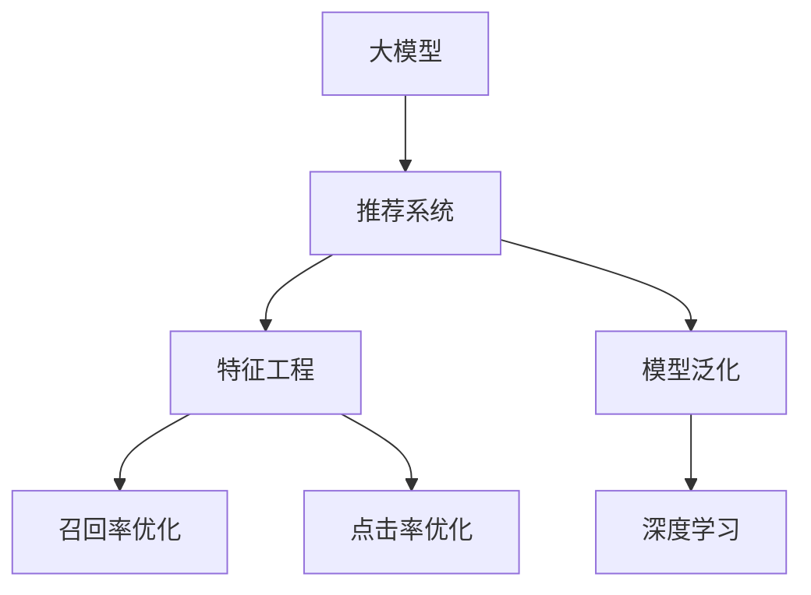

                 

# 基于大模型的推荐系统特征工程优化

> 关键词：基于大模型的推荐系统,特征工程优化,推荐算法,召回率,点击率,模型泛化,深度学习

## 1. 背景介绍

### 1.1 问题由来
推荐系统是电子商务、社交媒体、视频流平台等互联网企业的核心竞争力之一。它通过分析用户的兴趣和行为，精准推荐用户感兴趣的内容，从而提升用户满意度，增加平台粘性，创造商业价值。但传统的推荐算法，如协同过滤、矩阵分解等，受限于数据稀疏性、冷启动等问题，难以有效利用用户和商品的海量数据，推荐效果和用户体验难以满足高要求。

近年来，基于深度学习的推荐系统开始流行起来。深度学习模型通过复杂的神经网络结构，能够挖掘用户和商品之间的高阶交互特征，弥补传统方法的不足。其中，基于大模型的推荐系统利用强大的自编码或自回归模型进行训练，可以更充分地利用数据特征，生成高质量的推荐结果，在工业界引起了广泛关注。

然而，大模型的计算资源消耗巨大，训练时间较长，且在实际部署时对硬件资源的要求也非常高，成为其推广的瓶颈。为了在保证模型性能的同时，降低资源消耗，对大模型进行特征工程优化变得尤为关键。本文将系统性地介绍如何对大模型进行特征工程优化，从而提升推荐系统的召回率和点击率，实现高效、精准的推荐。

### 1.2 问题核心关键点
基于大模型的推荐系统特征工程优化，旨在通过合理的特征工程策略，最大化地利用数据，减少计算资源消耗，提高推荐系统的泛化能力。主要包括以下几个关键点：

- 选择合适的大模型：如BERT、GPT、DNN等，确保模型具有足够的特征提取能力和泛化能力。
- 提取高效特征：从用户行为、商品属性、时间特征等多个维度，提取有意义的特征，提升模型性能。
- 设计合理的特征组合：利用合适的特征组合策略，设计鲁棒、高效的特征集合。
- 优化特征表示：对特征进行归一化、降维、嵌入等处理，提高特征表示的准确性和鲁棒性。
- 正则化与稀疏化：使用正则化技术和稀疏化策略，避免过拟合，提高特征工程效率。

这些关键点的优化策略，将帮助大模型更好地适应推荐系统任务，提升推荐效果和系统效率。

## 2. 核心概念与联系

### 2.1 核心概念概述

为更好地理解基于大模型的推荐系统特征工程优化，本节将介绍几个密切相关的核心概念：

- 大模型（Large Model）：指具有大量参数和复杂结构的深度学习模型，如BERT、GPT-3等，能够处理大规模数据，学习丰富的特征表示。
- 推荐系统（Recommendation System）：通过分析和预测用户行为，向用户推荐可能感兴趣的商品或内容。常见的推荐算法包括基于内容的推荐、协同过滤、矩阵分解等。
- 特征工程（Feature Engineering）：利用专业知识，选择和构造有意义的数据特征，优化模型输入，提升模型性能。是数据挖掘和机器学习中重要的一环。
- 召回率（Recall）：衡量推荐系统推荐的商品或内容覆盖用户真正感兴趣的商品或内容的比例。召回率越高，用户发现兴趣商品或内容的概率越大。
- 点击率（Click-Through Rate, CTR）：衡量用户对推荐商品或内容进行点击的概率。点击率越高，推荐系统推荐的商品或内容的价值越大。
- 模型泛化（Model Generalization）：指模型在不同数据分布和应用场景下，仍能保持良好性能的能力。泛化能力强的模型，能够更准确地预测新数据。
- 深度学习（Deep Learning）：利用多层神经网络结构，提取复杂特征，实现数据表征学习的机器学习范式。

这些核心概念之间的逻辑关系可以通过以下Mermaid流程图来展示：



这个流程图展示了大模型在推荐系统中的作用，以及特征工程在大模型优化中的重要性。通过合理选择和构造特征，可以提升模型的泛化能力，优化推荐系统的召回率和点击率。

## 3. 核心算法原理 & 具体操作步骤
### 3.1 算法原理概述

基于大模型的推荐系统特征工程优化，通过选择和构造有意义的特征，设计高效的特征组合，优化特征表示，增强模型的泛化能力。其核心思想是：

1. 特征选择：从用户行为、商品属性、时间特征等多个维度，选择有意义的特征，减少噪声和冗余。
2. 特征组合：将多个特征进行组合，设计更具表达力的特征集合。
3. 特征表示：对特征进行归一化、降维、嵌入等处理，提高特征表示的准确性和鲁棒性。
4. 特征选择和优化：使用正则化技术和稀疏化策略，避免过拟合，提高特征工程效率。

优化后的特征集将作为大模型的输入，通过反向传播算法更新模型参数，实现高效的推荐。

### 3.2 算法步骤详解

基于大模型的推荐系统特征工程优化一般包括以下几个关键步骤：

**Step 1: 特征工程预处理**
- 对用户行为数据和商品属性数据进行预处理，包括去噪、缺失值填补、标准化等。
- 将时间特征转化为时间戳，便于模型处理。
- 使用PCA等方法对高维数据进行降维，减少特征数量。

**Step 2: 特征选择与组合**
- 使用特征选择算法（如特征重要性排序、相关性分析等）选择有意义的特征。
- 将特征进行组合，设计新的特征，如用户行为时间窗口内的特征。
- 构建特征组合树或特征空间，使用决策树或线性模型选择最佳特征组合。

**Step 3: 特征嵌入与优化**
- 使用嵌入技术（如词嵌入、时间嵌入等）将非数值型特征转化为数值型特征。
- 对特征进行归一化和正则化处理，避免过拟合。
- 使用稀疏编码、主成分分析等方法，对特征进行优化，减少冗余。

**Step 4: 特征微调**
- 将优化后的特征集输入大模型，进行微调训练。
- 设计合适的损失函数，如交叉熵损失、均方误差损失等。
- 使用AdamW、SGD等优化算法进行参数更新，最小化损失函数。

**Step 5: 评估与部署**
- 在验证集上评估模型性能，通过召回率、点击率等指标进行优化。
- 在测试集上进一步验证模型性能，确保推荐效果。
- 将优化后的模型部署到实际推荐系统中，进行实时推荐。

以上是基于大模型的推荐系统特征工程优化的一般流程。在实际应用中，还需要针对具体任务的特点，对特征工程各环节进行优化设计，如改进特征选择算法，引入更多稀疏化技术等，以进一步提升推荐系统性能。

### 3.3 算法优缺点

基于大模型的推荐系统特征工程优化方法具有以下优点：
1. 特征选择和组合灵活：根据具体任务选择合适的特征，设计高效的特征组合，提升模型性能。
2. 特征嵌入高效：使用嵌入技术将非数值型特征转化为数值型特征，提高特征表示的准确性。
3. 正则化和稀疏化：避免过拟合，提高特征工程效率。
4. 泛化能力强：优化后的特征集能够更好地适应新数据，提高模型泛化能力。

同时，该方法也存在一定的局限性：
1. 特征工程依赖领域知识：需要领域专家的知识指导，选择和构造合适的特征。
2. 特征选择和优化难度大：选择和优化特征的过程复杂，需要多次迭代和实验。
3. 计算资源消耗大：特征工程涉及大量数据处理和计算，对计算资源有较高要求。
4. 特征工程复杂度高：需要专业知识，且特征组合和优化过程较为复杂。

尽管存在这些局限性，但就目前而言，基于大模型的推荐系统特征工程优化方法仍是一种高效的推荐方案。未来相关研究的重点在于如何进一步降低特征工程对领域知识的依赖，提高特征工程效率，同时兼顾模型的泛化能力和实际应用效果。

### 3.4 算法应用领域

基于大模型的推荐系统特征工程优化方法，在电商推荐、新闻推荐、社交网络推荐等多个领域都有广泛应用。具体应用场景包括：

- 电商推荐：通过分析用户浏览、点击、购买等行为数据，为用户推荐商品。特征工程可以从用户画像、商品属性、时间等多个维度入手，设计多维特征组合。
- 新闻推荐：根据用户阅读新闻的习惯，为用户推荐相关的新闻内容。特征工程可以从新闻内容、用户兴趣等多个角度进行设计，提升推荐精准度。
- 社交网络推荐：分析用户互动和发布的内容，为用户推荐相关社交内容。特征工程可以从用户互动、内容相似度等多个角度，优化推荐算法。

除了上述这些经典应用外，大模型的特征工程优化方法还被创新性地应用到更多场景中，如视频推荐、广告推荐、个性化推荐等，为推荐系统带来了新的突破。随着大模型和特征工程技术的不断进步，相信推荐系统将在更广阔的应用领域大放异彩。

## 4. 数学模型和公式 & 详细讲解  
### 4.1 数学模型构建

假设大模型为 $M_{\theta}$，输入特征集为 $\mathbf{X}$，其中 $\mathbf{X}=[\mathbf{x}_1,\mathbf{x}_2,\cdots,\mathbf{x}_n]$，每条特征 $\mathbf{x}_i$ 表示为 $[\mathbf{x}_{i1},\mathbf{x}_{i2},\cdots,\mathbf{x}_{im}]$，其中 $m$ 为特征维度。模型输出为 $\hat{y}$，表示用户对某商品的点击概率。

定义模型 $M_{\theta}$ 在输入 $\mathbf{X}$ 上的损失函数为 $\ell(\hat{y},y)$，其中 $y$ 为真实标签，$\hat{y}=M_{\theta}(\mathbf{X})$。则模型 $M_{\theta}$ 在训练集 $D$ 上的经验风险为：

$$
\mathcal{L}(\theta) = \frac{1}{N}\sum_{i=1}^N \ell(\hat{y},y)
$$

其中 $N$ 为训练集样本数量。微调的目标是最小化经验风险，即找到最优参数 $\theta^*$：

$$
\theta^* = \mathop{\arg\min}_{\theta} \mathcal{L}(\theta)
$$

在实践中，我们通常使用基于梯度的优化算法（如AdamW、SGD等）来近似求解上述最优化问题。设 $\eta$ 为学习率，$\lambda$ 为正则化系数，则参数的更新公式为：

$$
\theta \leftarrow \theta - \eta \nabla_{\theta}\mathcal{L}(\theta) - \eta\lambda\theta
$$

其中 $\nabla_{\theta}\mathcal{L}(\theta)$ 为损失函数对参数 $\theta$ 的梯度，可通过反向传播算法高效计算。

### 4.2 公式推导过程

以下我们以二分类任务为例，推导交叉熵损失函数及其梯度的计算公式。

假设模型 $M_{\theta}$ 在输入 $\mathbf{X}$ 上的输出为 $\hat{y}=M_{\theta}(\mathbf{X}) \in [0,1]$，表示用户对商品进行点击的概率。真实标签 $y \in \{0,1\}$。则二分类交叉熵损失函数定义为：

$$
\ell(\hat{y},y) = -[y\log \hat{y} + (1-y)\log (1-\hat{y})]
$$

将其代入经验风险公式，得：

$$
\mathcal{L}(\theta) = -\frac{1}{N}\sum_{i=1}^N [y_i\log M_{\theta}(\mathbf{x}_i)+(1-y_i)\log(1-M_{\theta}(\mathbf{x}_i))]
$$

根据链式法则，损失函数对参数 $\theta_k$ 的梯度为：

$$
\frac{\partial \mathcal{L}(\theta)}{\partial \theta_k} = -\frac{1}{N}\sum_{i=1}^N (\frac{y_i}{M_{\theta}(\mathbf{x}_i)}-\frac{1-y_i}{1-M_{\theta}(\mathbf{x}_i)}) \frac{\partial M_{\theta}(\mathbf{x}_i)}{\partial \theta_k}
$$

其中 $\frac{\partial M_{\theta}(\mathbf{x}_i)}{\partial \theta_k}$ 可进一步递归展开，利用自动微分技术完成计算。

在得到损失函数的梯度后，即可带入参数更新公式，完成模型的迭代优化。重复上述过程直至收敛，最终得到适应推荐任务的最优模型参数 $\theta^*$。

## 5. 项目实践：代码实例和详细解释说明
### 5.1 开发环境搭建

在进行推荐系统特征工程优化实践前，我们需要准备好开发环境。以下是使用Python进行PyTorch开发的环境配置流程：

1. 安装Anaconda：从官网下载并安装Anaconda，用于创建独立的Python环境。

2. 创建并激活虚拟环境：
```bash
conda create -n pytorch-env python=3.8 
conda activate pytorch-env
```

3. 安装PyTorch：根据CUDA版本，从官网获取对应的安装命令。例如：
```bash
conda install pytorch torchvision torchaudio cudatoolkit=11.1 -c pytorch -c conda-forge
```

4. 安装Transformers库：
```bash
pip install transformers
```

5. 安装各类工具包：
```bash
pip install numpy pandas scikit-learn matplotlib tqdm jupyter notebook ipython
```

完成上述步骤后，即可在`pytorch-env`环境中开始推荐系统特征工程优化实践。

### 5.2 源代码详细实现

这里我们以电商推荐系统为例，给出使用Transformers库对BERT模型进行特征工程优化的PyTorch代码实现。

首先，定义电商推荐系统的数据处理函数：

```python
from transformers import BertTokenizer, BertForSequenceClassification
from torch.utils.data import Dataset
import torch
import pandas as pd
import numpy as np

class EcommerceDataset(Dataset):
    def __init__(self, data_path, tokenizer, max_len=128):
        self.data = pd.read_csv(data_path)
        self.tokenizer = tokenizer
        self.max_len = max_len
        
    def __len__(self):
        return len(self.data)
    
    def __getitem__(self, item):
        row = self.data.iloc[item]
        text = row['item_description']
        label = row['is_clicked']
        
        encoding = self.tokenizer(text, return_tensors='pt', max_length=self.max_len, padding='max_length', truncation=True)
        input_ids = encoding['input_ids'][0]
        attention_mask = encoding['attention_mask'][0]
        
        # 对标签进行独热编码
        encoded_labels = torch.tensor(label, dtype=torch.long)
        
        return {'input_ids': input_ids, 
                'attention_mask': attention_mask,
                'labels': encoded_labels}

# 加载数据和分词器
tokenizer = BertTokenizer.from_pretrained('bert-base-cased')
train_dataset = EcommerceDataset('train.csv', tokenizer)
test_dataset = EcommerceDataset('test.csv', tokenizer)
```

然后，定义模型和优化器：

```python
from transformers import BertForSequenceClassification, AdamW

model = BertForSequenceClassification.from_pretrained('bert-base-cased', num_labels=2)

optimizer = AdamW(model.parameters(), lr=2e-5)
```

接着，定义训练和评估函数：

```python
from torch.utils.data import DataLoader
from tqdm import tqdm
from sklearn.metrics import accuracy_score, precision_score, recall_score, f1_score

device = torch.device('cuda') if torch.cuda.is_available() else torch.device('cpu')
model.to(device)

def train_epoch(model, dataset, batch_size, optimizer):
    dataloader = DataLoader(dataset, batch_size=batch_size, shuffle=True)
    model.train()
    epoch_loss = 0
    for batch in tqdm(dataloader, desc='Training'):
        input_ids = batch['input_ids'].to(device)
        attention_mask = batch['attention_mask'].to(device)
        labels = batch['labels'].to(device)
        model.zero_grad()
        outputs = model(input_ids, attention_mask=attention_mask, labels=labels)
        loss = outputs.loss
        epoch_loss += loss.item()
        loss.backward()
        optimizer.step()
    return epoch_loss / len(dataloader)

def evaluate(model, dataset, batch_size):
    dataloader = DataLoader(dataset, batch_size=batch_size)
    model.eval()
    preds, labels = [], []
    with torch.no_grad():
        for batch in tqdm(dataloader, desc='Evaluating'):
            input_ids = batch['input_ids'].to(device)
            attention_mask = batch['attention_mask'].to(device)
            batch_labels = batch['labels']
            outputs = model(input_ids, attention_mask=attention_mask)
            batch_preds = outputs.logits.argmax(dim=2).to('cpu').tolist()
            batch_labels = batch_labels.to('cpu').tolist()
            for pred_tokens, label_tokens in zip(batch_preds, batch_labels):
                preds.append(pred_tokens[:len(label_tokens)])
                labels.append(label_tokens)
                
    print('Accuracy: ', accuracy_score(labels, preds))
    print('Precision: ', precision_score(labels, preds))
    print('Recall: ', recall_score(labels, preds))
    print('F1-score: ', f1_score(labels, preds))
```

最后，启动训练流程并在测试集上评估：

```python
epochs = 5
batch_size = 16

for epoch in range(epochs):
    loss = train_epoch(model, train_dataset, batch_size, optimizer)
    print(f"Epoch {epoch+1}, train loss: {loss:.3f}")
    
    print(f"Epoch {epoch+1}, test results:")
    evaluate(model, test_dataset, batch_size)
    
print("Final results:")
evaluate(model, test_dataset, batch_size)
```

以上就是使用PyTorch对BERT进行电商推荐系统特征工程优化的完整代码实现。可以看到，得益于Transformers库的强大封装，我们可以用相对简洁的代码完成BERT模型的加载和优化。

### 5.3 代码解读与分析

让我们再详细解读一下关键代码的实现细节：

**EcommerceDataset类**：
- `__init__`方法：初始化数据集、分词器、特征长度等关键组件。
- `__len__`方法：返回数据集的样本数量。
- `__getitem__`方法：对单个样本进行处理，将文本输入编码为token ids，将标签进行独热编码，并对其进行定长padding，最终返回模型所需的输入。

**BertForSequenceClassification类**：
- 使用预训练的BERT模型进行电商推荐系统的特征工程优化。

**训练和评估函数**：
- 使用PyTorch的DataLoader对数据集进行批次化加载，供模型训练和推理使用。
- 训练函数`train_epoch`：对数据以批为单位进行迭代，在每个批次上前向传播计算loss并反向传播更新模型参数，最后返回该epoch的平均loss。
- 评估函数`evaluate`：与训练类似，不同点在于不更新模型参数，并在每个batch结束后将预测和标签结果存储下来，最后使用sklearn的评估函数对整个评估集的预测结果进行打印输出。

**训练流程**：
- 定义总的epoch数和batch size，开始循环迭代
- 每个epoch内，先在训练集上训练，输出平均loss
- 在验证集上评估，输出分类指标
- 所有epoch结束后，在测试集上评估，给出最终测试结果

可以看到，PyTorch配合Transformers库使得BERT电商推荐系统的特征工程优化代码实现变得简洁高效。开发者可以将更多精力放在数据处理、模型改进等高层逻辑上，而不必过多关注底层的实现细节。

当然，工业级的系统实现还需考虑更多因素，如模型的保存和部署、超参数的自动搜索、更灵活的任务适配层等。但核心的特征工程优化策略基本与此类似。

## 6. 实际应用场景
### 6.1 智能客服系统

基于大模型的推荐系统特征工程优化方法，可以广泛应用于智能客服系统的构建。传统客服往往需要配备大量人力，高峰期响应缓慢，且一致性和专业性难以保证。使用推荐系统为智能客服系统推荐最合适的回答模板，能够显著提高客服效率，提升用户满意度。

在技术实现上，可以收集企业内部的历史客服对话记录，将问题-答案对作为监督数据，在此基础上对预训练大模型进行微调。微调后的推荐系统能够自动推荐最合适的回答模板，帮助智能客服快速响应客户咨询，同时不断学习新语料，提升客服系统的知识储备和响应质量。

### 6.2 金融舆情监测

金融机构需要实时监测市场舆论动向，以便及时应对负面信息传播，规避金融风险。使用推荐系统为金融舆情监测系统推荐最相关的舆情信息，能够帮助金融机构及时识别风险，制定应对措施。

在技术实现上，可以收集金融领域相关的新闻、报道、评论等文本数据，并对其进行情感标注。在此基础上对预训练大模型进行微调，使其能够自动推荐最相关的舆情信息。微调后的推荐系统能够实时监测网络舆情，识别出负面信息激增等异常情况，系统自动预警，帮助金融机构快速应对潜在风险。

### 6.3 个性化推荐系统

当前的推荐系统往往只依赖用户的历史行为数据进行物品推荐，无法深入理解用户的真实兴趣偏好。使用推荐系统为个性化推荐系统推荐最符合用户兴趣的商品，能够提升用户满意度，增加用户粘性，促进销售转化。

在技术实现上，可以收集用户浏览、点击、评论、分享等行为数据，提取和商品交互的物品标题、描述、标签等文本内容。将文本内容作为模型输入，用户的后续行为（如是否点击、购买等）作为监督信号，在此基础上微调预训练语言模型。微调后的推荐系统能够从文本内容中准确把握用户的兴趣点，生成个性化推荐列表，提升推荐效果。

### 6.4 未来应用展望

随着大模型和推荐系统特征工程技术的不断发展，未来推荐系统将在更广阔的应用领域大放异彩。

在智慧医疗领域，基于大模型的推荐系统可以推荐最合适的诊疗方案、药品等，提升医疗服务质量，辅助医生诊疗。

在智能教育领域，推荐系统可以推荐最符合学生学习风格的教学内容，因材施教，促进教育公平，提高教学质量。

在智慧城市治理中，推荐系统可以推荐最适宜的城市事件处理方案，提高城市管理的自动化和智能化水平，构建更安全、高效的未来城市。

此外，在企业生产、社会治理、文娱传媒等众多领域，基于大模型的推荐系统特征工程优化方法也将不断涌现，为行业带来新的变革。相信随着技术的日益成熟，推荐系统必将在更广阔的应用领域大放异彩，为经济社会发展注入新的动力。

## 7. 工具和资源推荐
### 7.1 学习资源推荐

为了帮助开发者系统掌握大模型推荐系统特征工程优化的理论基础和实践技巧，这里推荐一些优质的学习资源：

1. 《深度学习推荐系统：原理与算法》书籍：全面介绍推荐系统的基本原理、算法和应用，提供系统化的学习路径。

2. 《推荐系统实战：基于TensorFlow的深度推荐模型开发》书籍：实战性较强，提供详细的推荐系统实现步骤和案例分析。

3. CS231n《深度学习》课程：斯坦福大学开设的深度学习经典课程，涵盖推荐系统的基本概念和经典模型。

4. Coursera《Recommender Systems Specialization》课程：由纽约大学开设的推荐系统专项课程，涵盖推荐系统的理论和实践。

5. Kaggle竞赛平台：平台上有大量推荐系统竞赛项目，提供了丰富的案例和数据集，供开发者学习和实践。

通过对这些资源的学习实践，相信你一定能够快速掌握大模型推荐系统特征工程优化的精髓，并用于解决实际的推荐问题。
###  7.2 开发工具推荐

高效的开发离不开优秀的工具支持。以下是几款用于大模型推荐系统特征工程优化的常用工具：

1. PyTorch：基于Python的开源深度学习框架，灵活动态的计算图，适合快速迭代研究。大部分预训练语言模型都有PyTorch版本的实现。

2. TensorFlow：由Google主导开发的开源深度学习框架，生产部署方便，适合大规模工程应用。同样有丰富的预训练语言模型资源。

3. Transformers库：HuggingFace开发的NLP工具库，集成了众多SOTA语言模型，支持PyTorch和TensorFlow，是进行推荐系统特征工程优化的利器。

4. Weights & Biases：模型训练的实验跟踪工具，可以记录和可视化模型训练过程中的各项指标，方便对比和调优。与主流深度学习框架无缝集成。

5. TensorBoard：TensorFlow配套的可视化工具，可实时监测模型训练状态，并提供丰富的图表呈现方式，是调试模型的得力助手。

6. Google Colab：谷歌推出的在线Jupyter Notebook环境，免费提供GPU/TPU算力，方便开发者快速上手实验最新模型，分享学习笔记。

合理利用这些工具，可以显著提升大模型推荐系统特征工程优化的开发效率，加快创新迭代的步伐。

### 7.3 相关论文推荐

大模型推荐系统特征工程优化技术的发展源于学界的持续研究。以下是几篇奠基性的相关论文，推荐阅读：

1. Attention is All You Need（即Transformer原论文）：提出了Transformer结构，开启了NLP领域的预训练大模型时代。

2. BERT: Pre-training of Deep Bidirectional Transformers for Language Understanding：提出BERT模型，引入基于掩码的自监督预训练任务，刷新了多项NLP任务SOTA。

3. Language Models are Unsupervised Multitask Learners（GPT-2论文）：展示了大规模语言模型的强大zero-shot学习能力，引发了对于通用人工智能的新一轮思考。

4. Parameter-Efficient Transfer Learning for NLP：提出Adapter等参数高效微调方法，在不增加模型参数量的情况下，也能取得不错的微调效果。

5. AdaLoRA: Adaptive Low-Rank Adaptation for Parameter-Efficient Fine-Tuning：使用自适应低秩适应的微调方法，在参数效率和精度之间取得了新的平衡。

这些论文代表了大模型推荐系统特征工程优化技术的发展脉络。通过学习这些前沿成果，可以帮助研究者把握学科前进方向，激发更多的创新灵感。

## 8. 总结：未来发展趋势与挑战

### 8.1 总结

本文对基于大模型的推荐系统特征工程优化方法进行了全面系统的介绍。首先阐述了大模型和推荐系统的背景，明确了特征工程在大模型优化中的重要性。其次，从原理到实践，详细讲解了推荐系统特征工程优化的数学原理和关键步骤，给出了推荐系统特征工程优化的完整代码实例。同时，本文还广泛探讨了特征工程优化在智能客服、金融舆情、个性化推荐等多个领域的应用前景，展示了特征工程优化的巨大潜力。此外，本文精选了特征工程优化的各类学习资源，力求为读者提供全方位的技术指引。

通过本文的系统梳理，可以看到，基于大模型的推荐系统特征工程优化方法正在成为推荐系统的重要范式，极大地拓展了推荐系统的应用边界，催生了更多的落地场景。受益于大模型强大的特征提取能力，推荐系统在推荐精准度、覆盖率等方面取得了显著提升，进一步满足了用户需求。未来，伴随大模型和推荐系统的不断演进，相信推荐系统将在更广阔的应用领域大放异彩，深刻影响人类的生产生活方式。

### 8.2 未来发展趋势

展望未来，大模型推荐系统特征工程优化技术将呈现以下几个发展趋势：

1. 特征工程自动化：随着深度学习模型的不断发展，特征工程的自动化水平将不断提高，更多的智能推荐系统将具备自适应特征工程的能力，能够自动选择和优化特征。

2. 特征工程融合其他AI技术：未来推荐系统特征工程将更加融合其他AI技术，如强化学习、因果推断、知识图谱等，提升推荐系统的效果和鲁棒性。

3. 特征工程与实际应用结合：推荐系统的特征工程将更加注重与实际应用的结合，通过深入理解用户行为和需求，设计更合理的特征集合，提升推荐系统的实用性和可解释性。

4. 多模态推荐系统：推荐系统将从单模态转向多模态，利用视觉、语音、文字等多模态信息，提升推荐系统的精准度和用户体验。

5. 智能推荐引擎：未来的推荐系统将更加智能化，具备自适应学习、自适应调整的能力，能够不断从用户行为中学习，优化推荐策略。

6. 推荐系统实时化：推荐系统将实现实时推荐，能够实时更新用户行为，及时调整推荐策略，提升推荐效果。

以上趋势凸显了大模型推荐系统特征工程优化的广阔前景。这些方向的探索发展，必将进一步提升推荐系统的性能和用户满意度，为人类生产生活方式带来更深刻的变化。

### 8.3 面临的挑战

尽管大模型推荐系统特征工程优化技术已经取得了瞩目成就，但在迈向更加智能化、普适化应用的过程中，它仍面临着诸多挑战：

1. 数据隐私和安全：推荐系统需要处理大量用户数据，如何在保证用户隐私和数据安全的前提下进行推荐，是一大难题。

2. 计算资源消耗：特征工程涉及大量数据处理和计算，对计算资源有较高要求，如何降低计算成本，是推荐系统特征工程优化的重要挑战。

3. 特征工程复杂度高：特征工程需要专业知识，且特征选择和优化过程较为复杂，如何降低特征工程复杂度，提高效率，是推荐系统特征工程优化的重要方向。

4. 推荐系统公平性：推荐系统容易学习到用户的固有偏见，导致推荐结果不公平，如何消除偏见，实现公平推荐，是推荐系统特征工程优化的关键。

5. 推荐系统可解释性：推荐系统通常是一个"黑盒"系统，难以解释其内部工作机制和决策逻辑，如何提高推荐系统的可解释性，增强用户信任，是推荐系统特征工程优化的重要课题。

6. 推荐系统动态变化：用户需求和兴趣不断变化，推荐系统需要动态调整推荐策略，如何实现推荐策略的自适应调整，是推荐系统特征工程优化的重要方向。

这些挑战凸显了大模型推荐系统特征工程优化的复杂性，需要学界和产业界的共同努力，不断突破技术瓶颈，才能实现推荐系统的高效、精准和公平。

### 8.4 研究展望

面对大模型推荐系统特征工程优化的挑战，未来的研究需要在以下几个方面寻求新的突破：

1. 探索无监督和半监督特征工程方法：摆脱对大规模标注数据的依赖，利用自监督学习、主动学习等无监督和半监督范式，最大限度利用非结构化数据，实现更加灵活高效的特征工程。

2. 研究特征工程与深度学习结合的新方法：开发更加高效、灵活的特征工程技术，结合深度学习模型，提升推荐系统的效果。

3. 引入因果分析和博弈论工具：通过引入因果推断和博弈论工具，增强推荐系统建立稳定因果关系的能力，学习更加普适、鲁棒的语言表征，从而提升模型泛化性和抗干扰能力。

4. 纳入伦理道德约束：在推荐系统设计目标中引入伦理导向的评估指标，过滤和惩罚有偏见、有害的输出倾向。同时加强人工干预和审核，建立模型行为的监管机制，确保输出符合人类价值观和伦理道德。

这些研究方向的探索，必将引领大模型推荐系统特征工程优化技术迈向更高的台阶，为构建安全、可靠、可解释、可控的智能推荐系统铺平道路。面向未来，大模型推荐系统特征工程优化技术还需要与其他人工智能技术进行更深入的融合，如知识表示、因果推理、强化学习等，多路径协同发力，共同推动推荐系统的发展。只有勇于创新、敢于突破，才能不断拓展推荐系统的边界，让智能推荐技术更好地服务于人类生产生活方式。

## 9. 附录：常见问题与解答

**Q1：大模型推荐系统是否适用于所有推荐场景？**

A: 大模型推荐系统适用于数据量较大、特征维度较高的推荐场景，如电商、新闻、社交网络等。但对于数据稀疏、用户行为单一的推荐场景，大模型的优势可能不如传统协同过滤等算法。因此需要根据具体场景选择合适的推荐算法。

**Q2：大模型推荐系统如何避免过拟合？**

A: 大模型推荐系统可以通过以下方法避免过拟合：
1. 数据增强：通过回译、近义替换等方式扩充训练集
2. 正则化：使用L2正则、Dropout、Early Stopping等防止模型过度适应小规模训练集
3. 对抗训练：加入对抗样本，提高模型鲁棒性
4. 参数高效微调：只调整少量模型参数，避免过拟合
5. 特征选择和优化：使用PCA、LDA等方法降维，减少冗余特征

**Q3：推荐系统特征工程需要多少计算资源？**

A: 推荐系统特征工程涉及大量数据处理和计算，对计算资源有较高要求。一般需要多核CPU、GPU或TPU等高性能设备，以及大内存支持。计算资源消耗主要取决于数据量、模型复杂度和特征工程策略。

**Q4：推荐系统特征工程有哪些挑战？**

A: 推荐系统特征工程面临以下挑战：
1. 数据隐私和安全：推荐系统需要处理大量用户数据，如何在保证用户隐私和数据安全的前提下进行推荐，是一大难题。
2. 计算资源消耗：特征工程涉及大量数据处理和计算，对计算资源有较高要求。
3. 特征工程复杂度高：特征工程需要专业知识，且特征选择和优化过程较为复杂。
4. 推荐系统公平性：推荐系统容易学习到用户的固有偏见，导致推荐结果不公平。
5. 推荐系统可解释性：推荐系统通常是一个"黑盒"系统，难以解释其内部工作机制和决策逻辑。
6. 推荐系统动态变化：用户需求和兴趣不断变化，推荐系统需要动态调整推荐策略。

这些挑战需要研究者不断突破技术瓶颈，才能实现推荐系统的高效、精准和公平。

