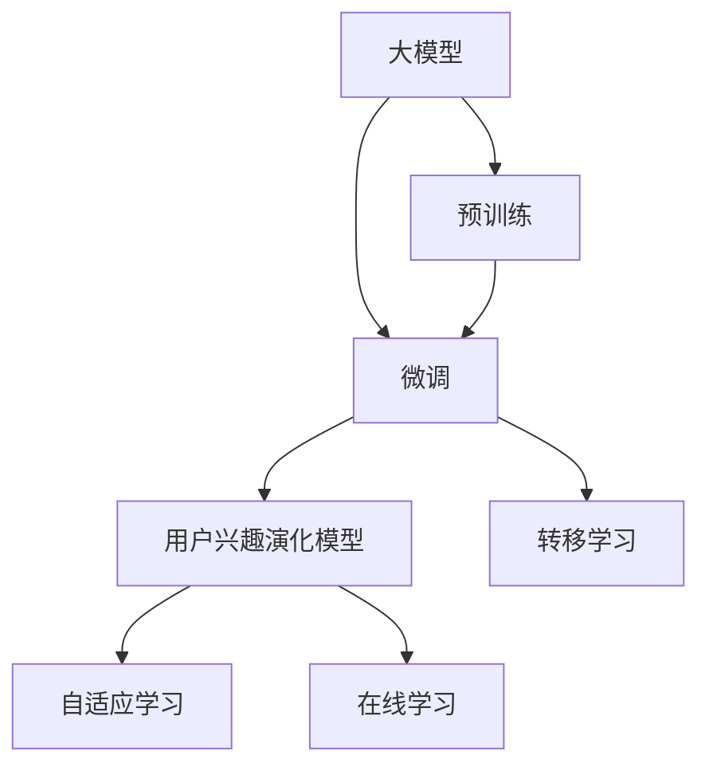

                 

## 1. 背景介绍

### 1.1 问题由来
随着信息技术的飞速发展，人们获取信息的方式从传统的线下渠道转向了线上，搜索引擎、社交媒体、电商平台等平台成为了信息获取的重要渠道。推荐系统（Recommendation System）应运而生，它通过分析用户的浏览行为、搜索记录、评分反馈等信息，为用户推荐其可能感兴趣的内容，大大提升了用户的体验。推荐系统的核心在于用户兴趣模型的构建和演化。然而，传统基于小样本数据的用户兴趣模型已经无法满足大数据时代的用户需求。

近年来，基于大模型（Big Model）的推荐系统逐渐成为研究热点。大模型通过预训练在海量数据上学习到丰富的知识，然后在特定任务上进行微调，可以更准确地捕获用户兴趣，并随着时间演化形成更加个性化和动态化的推荐策略。本文将围绕基于大模型的推荐系统，从用户兴趣演化模型的构建和训练两个角度进行详细探讨。

### 1.2 问题核心关键点
在基于大模型的推荐系统中，用户兴趣模型的构建和演化具有以下核心关键点：

- 大模型（Big Model）：指在大规模数据集上进行预训练，学习到通用语言表示的模型，如BERT、GPT-3、T5等。
- 微调（Fine-tuning）：在大模型上进行特定任务微调，学习到目标任务的数据分布和需求。
- 用户兴趣演化模型：基于用户的浏览历史、搜索记录等数据，构建动态化的用户兴趣模型。
- 转移学习（Transfer Learning）：利用预训练大模型的通用表示，在新任务上进行微调。
- 自适应学习（Adaptive Learning）：根据用户的实时行为数据，动态调整模型参数，以适应用户兴趣的变化。
- 在线学习（Online Learning）：在推荐过程中，实时更新模型，捕捉用户的即时兴趣。

这些关键点共同构成了基于大模型的推荐系统用户兴趣演化的主要范式。通过理解这些核心概念，我们可以更好地把握大模型推荐系统的本质。

## 2. 核心概念与联系

### 2.1 核心概念概述

为了更直观地理解基于大模型的推荐系统用户兴趣演化，下面对相关核心概念进行介绍和联系：

- **大模型（Big Model）**：指在超大规模数据集上进行预训练的模型，如BERT、GPT-3、T5等。它们通过自监督学习任务在通用领域中学习到了丰富的语言知识。
- **微调（Fine-tuning）**：在大模型上针对特定任务进行微调，通过少量标注数据训练得到适应特定任务的用户兴趣模型。
- **用户兴趣演化模型**：利用大模型的知识，根据用户的实时行为数据，动态调整用户兴趣模型，捕捉用户兴趣的变化。
- **转移学习（Transfer Learning）**：将大模型在通用领域的知识迁移到特定任务中，以提升微调的效果。
- **自适应学习（Adaptive Learning）**：根据用户的实时行为数据，动态更新模型参数，以实时适应用户的兴趣变化。
- **在线学习（Online Learning）**：在推荐过程中，实时更新模型，捕捉用户的即时兴趣变化。

这些概念之间的逻辑关系可以通过以下Mermaid流程图来展示：



这个流程图展示了大模型推荐系统用户兴趣演化的核心概念及其之间的关系：

1. 大模型通过预训练获得基础能力。
2. 微调在大模型上进行特定任务优化，学习到目标任务的数据分布和需求。
3. 用户兴趣演化模型基于微调模型，根据用户的实时行为数据动态调整。
4. 自适应学习通过动态更新模型参数，实时适应用户的兴趣变化。
5. 在线学习在推荐过程中，实时更新模型，捕捉用户的即时兴趣。
6. 转移学习利用大模型的知识，提升微调的效果。

这些概念共同构成了基于大模型的推荐系统用户兴趣演化的主要框架，使其能够随着用户兴趣的变化进行动态更新和调整。

## 3. 核心算法原理 & 具体操作步骤

### 3.1 算法原理概述

基于大模型的推荐系统用户兴趣演化，本质上是利用大模型的通用知识，通过微调和学习用户的实时行为数据，动态调整用户兴趣模型。其核心思想是：将大模型视为一个强大的"特征提取器"，通过微调学习到特定任务的用户兴趣表示，然后基于用户的历史行为数据进行动态更新，捕捉用户兴趣的变化。

形式化地，假设大模型为 $M_{\theta}$，其中 $\theta$ 为预训练得到的模型参数。给定用户 $u$ 的实时行为数据 $D_u$，用户兴趣演化模型的目标是找到最优参数 $\hat{\theta}$，使得模型在用户 $u$ 上的预测兴趣向量 $y$ 最大化与用户兴趣标签 $y^*$ 的相关性：

$$
\hat{\theta}=\mathop{\arg\min}_{\theta} \mathcal{L}(M_{\theta},D_u,y^*)
$$

其中 $\mathcal{L}$ 为损失函数，用于衡量预测兴趣向量 $y$ 与真实兴趣标签 $y^*$ 之间的差异。常见的损失函数包括均方误差损失、交叉熵损失等。

### 3.2 算法步骤详解

基于大模型的推荐系统用户兴趣演化一般包括以下几个关键步骤：

**Step 1: 准备预训练模型和数据集**
- 选择合适的预训练语言模型 $M_{\theta}$ 作为初始化参数，如 BERT、GPT-3、T5 等。
- 准备用户 $u$ 的实时行为数据 $D_u$，划分为训练集、验证集和测试集。一般要求行为数据与大模型的预训练数据分布不要差异过大。

**Step 2: 微调模型**
- 在大模型上进行特定任务微调，使用少量标注数据训练得到适应目标任务的模型 $M_{\theta_u}$。例如，对于文本推荐任务，可以使用交叉熵损失函数，将用户的浏览历史和评分反馈作为监督信号。
- 根据任务需求，选择合适的输出层和损失函数，如分类任务使用线性分类器和交叉熵损失，生成任务使用语言模型的解码器输出概率分布。

**Step 3: 动态更新用户兴趣模型**
- 根据用户 $u$ 的实时行为数据 $D_u$，动态更新用户兴趣模型 $M_{\theta_u}$。通常使用自适应学习算法，如在线梯度下降法（Online Gradient Descent, OGD）或在线随机梯度下降法（Online Stochastic Gradient Descent, OSGD）。
- 实时采集用户的行为数据，如浏览网页、搜索关键词、点击商品等，输入微调模型 $M_{\theta_u}$ 中，进行前向传播计算预测兴趣向量 $y$。
- 将预测兴趣向量 $y$ 与真实兴趣标签 $y^*$ 计算损失函数 $\mathcal{L}$，反向传播更新模型参数 $\theta$。

**Step 4: 评估和优化**
- 在验证集上评估微调后模型 $M_{\theta_u}$ 的性能，对比微调前后的精度提升。
- 使用微调后的模型对新样本进行推理预测，集成到实际的应用系统中。
- 持续收集新的行为数据，定期重新微调模型，以适应数据分布的变化。

以上是基于大模型的推荐系统用户兴趣演化的完整流程。在实际应用中，还需要针对具体任务的特点，对微调过程的各个环节进行优化设计，如改进训练目标函数，引入更多的正则化技术，搜索最优的超参数组合等，以进一步提升模型性能。

### 3.3 算法优缺点

基于大模型的推荐系统用户兴趣演化方法具有以下优点：

1. 简单高效。只需准备少量标注数据，即可对大模型进行快速适配，获得较大的性能提升。
2. 通用适用。适用于各种推荐系统任务，包括文本推荐、图片推荐、视频推荐等，设计简单的任务适配层即可实现。
3. 参数高效。利用参数高效微调技术，在固定大部分预训练参数的情况下，仍可取得不错的提升。
4. 效果显著。在学术界和工业界的诸多推荐任务上，基于微调的方法已经刷新了最先进的性能指标。

同时，该方法也存在一定的局限性：

1. 依赖标注数据。微调的效果很大程度上取决于标注数据的质量和数量，获取高质量标注数据的成本较高。
2. 迁移能力有限。当目标任务与预训练数据的分布差异较大时，微调的性能提升有限。
3. 负面效果传递。预训练模型的固有偏见、有害信息等，可能通过微调传递到下游任务，造成负面影响。
4. 可解释性不足。微调模型的决策过程通常缺乏可解释性，难以对其推理逻辑进行分析和调试。

尽管存在这些局限性，但就目前而言，基于大模型的推荐系统用户兴趣演化方法仍是大规模推荐系统应用的最主流范式。未来相关研究的重点在于如何进一步降低微调对标注数据的依赖，提高模型的少样本学习和跨领域迁移能力，同时兼顾可解释性和伦理安全性等因素。

### 3.4 算法应用领域

基于大模型的推荐系统用户兴趣演化方法在推荐系统领域已经得到了广泛的应用，覆盖了几乎所有常见任务，例如：

- 文本推荐：如新闻推荐、文章推荐等。基于用户的浏览历史和评分反馈，对文本进行排序推荐。
- 图片推荐：如电商商品图片推荐、社交媒体图片推荐等。利用大模型学习图片的语义表示，进行相似度匹配。
- 视频推荐：如视频网站推荐、在线教育推荐等。通过视频内容的自然语言描述，学习用户兴趣，进行推荐。
- 多模态推荐：如视觉+文本推荐、语音+文本推荐等。利用大模型融合多模态信息，提供更全面、更精准的推荐。

除了上述这些经典任务外，基于大模型的推荐系统用户兴趣演化方法也被创新性地应用到更多场景中，如智能广告投放、智能家居控制、智能游戏推荐等，为推荐系统技术带来了全新的突破。随着大模型的不断进步和推荐算法的优化，相信推荐系统技术将在更广阔的应用领域大放异彩。

## 4. 数学模型和公式 & 详细讲解 & 举例说明

### 4.1 数学模型构建

本节将使用数学语言对基于大模型的推荐系统用户兴趣演化过程进行更加严格的刻画。

记大模型为 $M_{\theta}$，其中 $\theta$ 为模型参数。假设用户 $u$ 的实时行为数据为 $D_u=\{(x_i,y_i)\}_{i=1}^N, x_i \in \mathcal{X}, y_i \in \mathcal{Y}$，其中 $x_i$ 为用户的行为记录，$y_i$ 为用户的评分反馈或标签。用户兴趣演化模型的目标是找到最优参数 $\theta_u$，使得模型在用户 $u$ 上的预测兴趣向量 $y$ 最大化与用户兴趣标签 $y^*$ 的相关性：

$$
\hat{\theta}_u=\mathop{\arg\min}_{\theta} \mathcal{L}(M_{\theta},D_u,y^*)
$$

其中 $\mathcal{L}$ 为损失函数，用于衡量预测兴趣向量 $y$ 与真实兴趣标签 $y^*$ 之间的差异。常见的损失函数包括均方误差损失、交叉熵损失等。

### 4.2 公式推导过程

以下我们以文本推荐任务为例，推导交叉熵损失函数及其梯度的计算公式。

假设用户 $u$ 的行为数据 $D_u$ 包括浏览的历史网页 $x$ 和浏览行为的评分 $y$，大模型 $M_{\theta}$ 在用户行为数据上输出兴趣向量 $y=\log \hat{p}(y|x)$，其中 $\hat{p}$ 为模型的预测概率分布。用户兴趣演化模型的目标是最小化交叉熵损失函数：

$$
\ell(M_{\theta}(x),y) = -y\log \hat{p}(y|x)
$$

将其代入经验风险公式，得：

$$
\mathcal{L}(\theta) = -\frac{1}{N}\sum_{i=1}^N y_i\log \hat{p}(y|x_i)
$$

根据链式法则，损失函数对参数 $\theta$ 的梯度为：

$$
\frac{\partial \mathcal{L}(\theta)}{\partial \theta} = -\frac{1}{N}\sum_{i=1}^N \frac{y_i}{\hat{p}(y|x_i)} \frac{\partial \hat{p}(y|x_i)}{\partial \theta}
$$

其中 $\frac{\partial \hat{p}(y|x_i)}{\partial \theta}$ 可进一步递归展开，利用自动微分技术完成计算。

在得到损失函数的梯度后，即可带入参数更新公式，完成模型的迭代优化。重复上述过程直至收敛，最终得到适应用户 $u$ 的微调后模型 $M_{\theta_u}$。

## 5. 项目实践：代码实例和详细解释说明

### 5.1 开发环境搭建

在进行推荐系统用户兴趣演化模型的实践前，我们需要准备好开发环境。以下是使用Python进行TensorFlow开发的环境配置流程：

1. 安装Anaconda：从官网下载并安装Anaconda，用于创建独立的Python环境。

2. 创建并激活虚拟环境：
```bash
conda create -n tf-env python=3.8 
conda activate tf-env
```

3. 安装TensorFlow：根据CUDA版本，从官网获取对应的安装命令。例如：
```bash
conda install tensorflow -c pytorch -c conda-forge
```

4. 安装各类工具包：
```bash
pip install numpy pandas scikit-learn matplotlib tqdm jupyter notebook ipython
```

完成上述步骤后，即可在`tf-env`环境中开始推荐系统用户兴趣演化模型的实践。

### 5.2 源代码详细实现

下面我们以文本推荐任务为例，给出使用TensorFlow进行大模型微调的Python代码实现。

首先，定义推荐系统用户兴趣演化模型的数据处理函数：

```python
import tensorflow as tf
from tensorflow.keras.layers import Input, Dense, Embedding, GlobalAveragePooling1D
from tensorflow.keras.models import Model

def create_model(vocab_size, embedding_dim, hidden_dim, output_dim):
    inputs = Input(shape=(None,))
    x = Embedding(vocab_size, embedding_dim, mask_zero=True)(inputs)
    x = GlobalAveragePooling1D()(x)
    x = Dense(hidden_dim, activation='relu')(x)
    x = Dense(output_dim, activation='softmax')(x)
    return Model(inputs, x)

# 创建模型
model = create_model(vocab_size=20000, embedding_dim=64, hidden_dim=128, output_dim=10)
```

然后，定义模型的损失函数和优化器：

```python
# 定义损失函数和优化器
loss_fn = tf.keras.losses.CategoricalCrossentropy()
optimizer = tf.keras.optimizers.Adam(learning_rate=1e-3)
```

接着，定义训练和评估函数：

```python
def train_step(model, inputs, labels):
    with tf.GradientTape() as tape:
        predictions = model(inputs)
        loss = loss_fn(labels, predictions)
    gradients = tape.gradient(loss, model.trainable_variables)
    optimizer.apply_gradients(zip(gradients, model.trainable_variables))
    return loss

def evaluate_step(model, inputs, labels):
    predictions = model(inputs)
    return tf.reduce_mean(loss_fn(labels, predictions))
```

最后，启动训练流程并在测试集上评估：

```python
epochs = 5
batch_size = 32

for epoch in range(epochs):
    total_loss = 0
    for batch in tqdm(dataset, desc='Training'):
        inputs, labels = batch['inputs'], batch['labels']
        loss = train_step(model, inputs, labels)
        total_loss += loss
    print(f'Epoch {epoch+1}, train loss: {total_loss/len(dataset)}')
    
    print(f'Epoch {epoch+1}, dev results:')
    for batch in tqdm(dev_dataset, desc='Evaluating'):
        inputs, labels = batch['inputs'], batch['labels']
        result = evaluate_step(model, inputs, labels)
    print(f'Dev loss: {result.numpy()}')
    
print('Test results:')
for batch in tqdm(test_dataset, desc='Evaluating'):
    inputs, labels = batch['inputs'], batch['labels']
    result = evaluate_step(model, inputs, labels)
print(f'Test loss: {result.numpy()}')
```

以上就是使用TensorFlow对大模型进行文本推荐任务微调的完整代码实现。可以看到，得益于TensorFlow的强大封装，我们可以用相对简洁的代码完成大模型的加载和微调。

### 5.3 代码解读与分析

让我们再详细解读一下关键代码的实现细节：

**create_model函数**：
- `Input`层：输入数据的占位符，定义输入数据的维度。
- `Embedding`层：将输入的词汇向量转换为低维向量表示。
- `GlobalAveragePooling1D`层：将嵌入后的向量进行全局平均池化，降维处理。
- `Dense`层：全连接层，使用ReLU激活函数。
- `Dense`层：输出层，使用softmax激活函数。
- `Model`层：定义完整的推荐模型。

**train_step和evaluate_step函数**：
- `train_step`函数：在每个批次上前向传播计算损失函数，反向传播更新模型参数。
- `evaluate_step`函数：在每个批次上前向传播计算损失函数，返回平均损失值。

**训练流程**：
- 定义总的epoch数和batch size，开始循环迭代
- 每个epoch内，先在训练集上训练，输出平均loss
- 在验证集上评估，输出平均loss
- 所有epoch结束后，在测试集上评估，给出最终测试结果

可以看到，TensorFlow配合Keras使得大模型微调的代码实现变得简洁高效。开发者可以将更多精力放在数据处理、模型改进等高层逻辑上，而不必过多关注底层的实现细节。

当然，工业级的系统实现还需考虑更多因素，如模型的保存和部署、超参数的自动搜索、更灵活的任务适配层等。但核心的微调范式基本与此类似。

## 6. 实际应用场景

### 6.1 智能广告投放

基于大模型的推荐系统用户兴趣演化，可以广泛应用于智能广告投放的优化。传统广告投放往往依赖于人口统计学特征，难以精准匹配用户兴趣。使用基于大模型的推荐系统，可以实时监测用户的浏览行为、搜索记录等，动态调整广告投放策略，以最大化广告效果。

在技术实现上，可以收集用户的实时行为数据，将广告内容作为输入，通过微调得到广告的兴趣得分。根据用户的实时行为数据，动态调整广告的投放位置、频率、投放时间等参数，以实现更加精准的广告投放。

### 6.2 智能家居控制

基于大模型的推荐系统用户兴趣演化，可以为智能家居控制提供更加智能的交互方式。传统家居控制往往依赖于用户的操作行为，缺乏智能性。使用基于大模型的推荐系统，可以实时捕捉用户的语义需求，自动控制家居设备。

在技术实现上，可以收集用户的语音指令、行为数据等，利用大模型进行意图识别和指令解析，动态调整家居设备的控制策略。例如，当用户说出“开灯”时，推荐系统可以自动识别用户当前的位置、时间等信息，调整灯光亮度和颜色，营造适宜的家居氛围。

### 6.3 智能游戏推荐

基于大模型的推荐系统用户兴趣演化，可以为智能游戏推荐提供更加精准的推荐策略。传统游戏推荐往往依赖于用户的游戏记录和历史评分，难以发现用户的新兴趣。使用基于大模型的推荐系统，可以实时监测用户的游戏中行为数据，动态调整游戏推荐列表。

在技术实现上，可以收集用户的游戏行为数据，利用大模型进行行为分析和兴趣预测，动态调整游戏推荐列表。例如，当用户在游戏中表现出对某种类型的游戏感兴趣时，推荐系统可以实时调整推荐策略，为用户推荐更多相似的游戏。

### 6.4 未来应用展望

随着大模型推荐系统用户兴趣演化技术的不断发展，基于微调的方法将在更多领域得到应用，为传统行业带来变革性影响。

在智慧医疗领域，基于大模型推荐系统的医疗问答、病历分析、药物推荐等应用将提升医疗服务的智能化水平，辅助医生诊疗，加速新药开发进程。

在智能教育领域，基于大模型的推荐系统可以应用于作业批改、学情分析、知识推荐等方面，因材施教，促进教育公平，提高教学质量。

在智慧城市治理中，基于大模型的推荐系统可应用于城市事件监测、舆情分析、应急指挥等环节，提高城市管理的自动化和智能化水平，构建更安全、高效的未来城市。

此外，在企业生产、社会治理、文娱传媒等众多领域，基于大模型的推荐系统推荐技术也将不断涌现，为NLP技术带来了全新的突破。相信随着预训练模型和微调方法的不断进步，基于大模型的推荐系统将在更广阔的应用领域大放异彩，深刻影响人类的生产生活方式。

## 7. 工具和资源推荐
### 7.1 学习资源推荐

为了帮助开发者系统掌握大模型推荐系统用户兴趣演化的理论基础和实践技巧，这里推荐一些优质的学习资源：

1. 《推荐系统:算法与应用》书籍：介绍推荐系统的基本概念和常见算法，包括基于协同过滤、基于内容的推荐等，是入门推荐系统的必备教材。

2. 《深度学习》课程：斯坦福大学李飞飞教授的深度学习课程，涵盖神经网络、深度学习框架等核心内容，是深度学习领域的经典课程。

3. 《Deep Learning Specialization》系列课程：由Andrew Ng教授主讲的深度学习专项课程，系统讲解深度学习理论和应用，包括推荐系统、自然语言处理等。

4. 《深度学习推荐系统》论文：介绍深度学习推荐系统的基本原理和应用场景，是深度学习推荐系统的经典论文。

5. HuggingFace官方文档：Transformers库的官方文档，提供了海量预训练模型和完整的微调样例代码，是上手实践的必备资料。

通过对这些资源的学习实践，相信你一定能够快速掌握大模型推荐系统的精髓，并用于解决实际的推荐问题。
###  7.2 开发工具推荐

高效的开发离不开优秀的工具支持。以下是几款用于大模型推荐系统用户兴趣演化开发的常用工具：

1. TensorFlow：由Google主导开发的开源深度学习框架，生产部署方便，适合大规模工程应用。支持各类深度学习模型的搭建和优化。

2. PyTorch：基于Python的开源深度学习框架，灵活动态的计算图，适合快速迭代研究。同样有丰富的预训练语言模型资源。

3. Scikit-learn：基于Python的机器学习库，提供多种机器学习算法和工具，适合快速实现和评估推荐系统算法。

4. Weights & Biases：模型训练的实验跟踪工具，可以记录和可视化模型训练过程中的各项指标，方便对比和调优。与主流深度学习框架无缝集成。

5. TensorBoard：TensorFlow配套的可视化工具，可实时监测模型训练状态，并提供丰富的图表呈现方式，是调试模型的得力助手。

6. Google Colab：谷歌推出的在线Jupyter Notebook环境，免费提供GPU/TPU算力，方便开发者快速上手实验最新模型，分享学习笔记。

合理利用这些工具，可以显著提升大模型推荐系统用户兴趣演化的开发效率，加快创新迭代的步伐。

### 7.3 相关论文推荐

大模型推荐系统用户兴趣演化技术的发展源于学界的持续研究。以下是几篇奠基性的相关论文，推荐阅读：

1. "Deep Architectures for Multi-Task Learning"：提出多层感知器网络（MLP）的迁移学习框架，为深度学习迁移学习提供了重要思路。

2. "Neural Collaborative Filtering"：介绍深度学习协同过滤推荐算法，利用神经网络处理用户行为数据，提升推荐效果。

3. "On the Importance of Being Transferable: MASS for Multi-Task Learning"：提出多层自适应架构（MASS），为深度学习迁移学习提供了新的范式。

4. "Adaptive Transfer Learning with Pre-trained Models"：提出自适应迁移学习算法，利用预训练模型的知识，在新任务上进行微调。

5. "Few-Shot Transfer Learning with Adaptive Data Augmentation"：提出自适应数据增强算法，在大规模数据集上进行零样本和少样本学习。

这些论文代表了大模型推荐系统用户兴趣演化技术的发展脉络。通过学习这些前沿成果，可以帮助研究者把握学科前进方向，激发更多的创新灵感。

## 8. 总结：未来发展趋势与挑战

### 8.1 总结

本文对基于大模型的推荐系统用户兴趣演化方法进行了全面系统的介绍。首先阐述了大模型推荐系统用户兴趣演化的研究背景和意义，明确了用户兴趣模型的构建和演化在大规模推荐系统中的重要作用。其次，从原理到实践，详细讲解了推荐系统用户兴趣演化的数学原理和关键步骤，给出了推荐系统用户兴趣演化模型的完整代码实例。同时，本文还广泛探讨了用户兴趣演化模型在智能广告、智能家居、智能游戏等多个行业领域的应用前景，展示了用户兴趣演化模型的巨大潜力。此外，本文精选了用户兴趣演化模型的各类学习资源，力求为读者提供全方位的技术指引。

通过本文的系统梳理，可以看到，基于大模型的推荐系统用户兴趣演化技术正在成为推荐系统应用的重要范式，极大地拓展了推荐系统的应用边界，提升了用户的推荐体验。基于大模型的推荐系统用户兴趣演化技术不仅能够根据用户的实时行为数据动态调整用户兴趣模型，还能在多模态数据融合、实时化推荐等方面取得新的突破。相信随着大模型推荐系统的不断发展和优化，推荐系统技术将在更广阔的应用领域大放异彩，深刻影响人类的生产生活方式。

### 8.2 未来发展趋势

展望未来，大模型推荐系统用户兴趣演化技术将呈现以下几个发展趋势：

1. 模型规模持续增大。随着算力成本的下降和数据规模的扩张，预训练语言模型的参数量还将持续增长。超大规模语言模型蕴含的丰富知识，有望支撑更加复杂多变的推荐策略。

2. 微调方法日趋多样。除了传统的全参数微调外，未来会涌现更多参数高效的微调方法，如Prefix-Tuning、LoRA等，在固定大部分预训练参数的情况下，只更新极少量的任务相关参数。同时，将利用自适应学习算法，实时动态更新模型参数，以适应用户兴趣的变化。

3. 持续学习成为常态。随着数据分布的不断变化，推荐系统用户兴趣演化模型也需要持续学习新知识以保持性能。如何在不遗忘原有知识的同时，高效吸收新样本信息，将是重要的研究课题。

4. 标注样本需求降低。受启发于提示学习(Prompt-based Learning)的思路，未来的推荐系统用户兴趣演化方法将更好地利用大模型的语言理解能力，通过更加巧妙的任务描述，在更少的标注样本上也能实现理想的推荐效果。

5. 多模态推荐崛起。当前的推荐系统用户兴趣演化方法往往聚焦于文本推荐，未来将拓展到视觉、语音、视频等多模态数据微调，利用多模态信息融合提升推荐效果。

6. 知识整合能力增强。现有的推荐系统用户兴趣演化模型往往局限于任务内数据，难以灵活吸收和运用更广泛的先验知识。如何让推荐系统用户兴趣演化过程更好地与外部知识库、规则库等专家知识结合，形成更加全面、准确的信息整合能力，还有很大的想象空间。

以上趋势凸显了大模型推荐系统用户兴趣演化的广阔前景。这些方向的探索发展，必将进一步提升推荐系统性能和应用范围，为推荐系统技术在垂直行业的规模化落地提供新的动力。

### 8.3 面临的挑战

尽管大模型推荐系统用户兴趣演化技术已经取得了瞩目成就，但在迈向更加智能化、普适化应用的过程中，它仍面临着诸多挑战：

1. 标注成本瓶颈。虽然微调方法大幅降低了标注数据的需求，但对于长尾应用场景，难以获得充足的高质量标注数据，成为制约推荐系统性能提升的瓶颈。如何进一步降低推荐系统对标注样本的依赖，将是一大难题。

2. 模型鲁棒性不足。当前推荐系统用户兴趣演化模型面对域外数据时，泛化性能往往大打折扣。对于测试样本的微小扰动，推荐系统容易发生预测波动。如何提高推荐系统的鲁棒性，避免灾难性遗忘，还需要更多理论和实践的积累。

3. 推理效率有待提高。大规模语言模型虽然精度高，但在实际部署时往往面临推理速度慢、内存占用大等效率问题。如何在保证性能的同时，简化模型结构，提升推理速度，优化资源占用，将是重要的优化方向。

4. 可解释性亟需加强。当前推荐系统用户兴趣演化模型更像是"黑盒"系统，难以解释其内部工作机制和决策逻辑。对于医疗、金融等高风险应用，算法的可解释性和可审计性尤为重要。如何赋予推荐系统用户兴趣演化模型更强的可解释性，将是亟待攻克的难题。

5. 安全性有待保障。预训练语言模型难免会学习到有偏见、有害的信息，通过微调传递到下游任务，产生误导性、歧视性的输出，给实际应用带来安全隐患。如何从数据和算法层面消除推荐系统用户兴趣演化模型的偏见，避免恶意用途，确保输出的安全性，也将是重要的研究课题。

6. 知识整合能力不足。现有的推荐系统用户兴趣演化模型往往局限于任务内数据，难以灵活吸收和运用更广泛的先验知识。如何让推荐系统用户兴趣演化过程更好地与外部知识库、规则库等专家知识结合，形成更加全面、准确的信息整合能力，还有很大的想象空间。

正视推荐系统用户兴趣演化面临的这些挑战，积极应对并寻求突破，将是大模型推荐系统用户兴趣演化技术走向成熟的必由之路。相信随着学界和产业界的共同努力，这些挑战终将一一被克服，推荐系统用户兴趣演化技术必将在构建人机协同的智能推荐系统进程中扮演越来越重要的角色。

### 8.4 研究展望

面对大模型推荐系统用户兴趣演化所面临的挑战，未来的研究需要在以下几个方面寻求新的突破：

1. 探索无监督和半监督推荐方法。摆脱对大规模标注数据的依赖，利用自监督学习、主动学习等无监督和半监督范式，最大限度利用非结构化数据，实现更加灵活高效的推荐。

2. 研究参数高效和计算高效的推荐范式。开发更加参数高效的推荐方法，在固定大部分预训练参数的情况下，只更新极少量的任务相关参数。同时优化推荐模型的计算图，减少前向传播和反向传播的资源消耗，实现更加轻量级、实时性的部署。

3. 融合因果和对比学习范式。通过引入因果推断和对比学习思想，增强推荐系统用户兴趣演化模型建立稳定因果关系的能力，学习更加普适、鲁棒的语言表征，从而提升模型泛化性和抗干扰能力。

4. 引入更多先验知识。将符号化的先验知识，如知识图谱、逻辑规则等，与神经网络模型进行巧妙融合，引导推荐系统用户兴趣演化过程学习更准确、合理的语言模型。同时加强不同模态数据的整合，实现视觉、语音等多模态信息与文本信息的协同建模。

5. 结合因果分析和博弈论工具。将因果分析方法引入推荐系统用户兴趣演化模型，识别出模型决策的关键特征，增强输出解释的因果性和逻辑性。借助博弈论工具刻画人机交互过程，主动探索并规避推荐系统的脆弱点，提高系统稳定性。

6. 纳入伦理道德约束。在推荐系统用户兴趣演化模型的训练目标中引入伦理导向的评估指标，过滤和惩罚有偏见、有害的输出倾向。同时加强人工干预和审核，建立模型行为的监管机制，确保输出符合人类价值观和伦理道德。

这些研究方向的探索，必将引领推荐系统用户兴趣演化技术迈向更高的台阶，为构建安全、可靠、可解释、可控的智能推荐系统铺平道路。面向未来，大模型推荐系统用户兴趣演化技术还需要与其他人工智能技术进行更深入的融合，如知识表示、因果推理、强化学习等，多路径协同发力，共同推动智能推荐系统的进步。只有勇于创新、敢于突破，才能不断拓展推荐系统的边界，让智能推荐技术更好地服务于人类社会。

## 9. 附录：常见问题与解答

**Q1：大模型推荐系统用户兴趣演化是否适用于所有推荐任务？**

A: 大模型推荐系统用户兴趣演化在大多数推荐系统任务上都能取得不错的效果，特别是对于数据量较小的任务。但对于一些特定领域的任务，如医学、法律等，仅仅依靠通用语料预训练的模型可能难以很好地适应。此时需要在特定领域语料上进一步预训练，再进行微调，才能获得理想效果。此外，对于一些需要时效性、个性化很强的任务，如对话、推荐等，推荐方法也需要针对性的改进优化。

**Q2：推荐系统用户兴趣演化模型在落地部署时需要注意哪些问题？**

A: 将推荐系统用户兴趣演化模型转化为实际应用，还需要考虑以下因素：
1. 模型裁剪：去除不必要的层和参数，减小模型尺寸，加快推理速度。
2. 量化加速：将浮点模型转为定点模型，压缩存储空间，提高计算效率。
3. 服务化封装：将模型封装为标准化服务接口，便于集成调用。
4. 弹性伸缩：根据请求流量动态调整资源配置，平衡服务质量和成本。
5. 监控告警：实时采集系统指标，设置异常告警阈值，确保服务稳定性。
6. 安全防护：采用访问鉴权、数据脱敏等措施，保障数据和模型安全。

大模型推荐系统用户兴趣演化为推荐系统应用提供了全新的思路和方法，但如何将强大的性能转化为稳定、高效、安全的业务价值，还需要工程实践的不断打磨。唯有从数据、算法、工程、业务等多个维度协同发力，才能真正实现人工智能技术在垂直行业的规模化落地。总之，推荐系统用户兴趣演化需要开发者根据具体任务，不断迭代和优化模型、数据和算法，方能得到理想的效果。

---

作者：禅与计算机程序设计艺术 / Zen and the Art of Computer Programming

