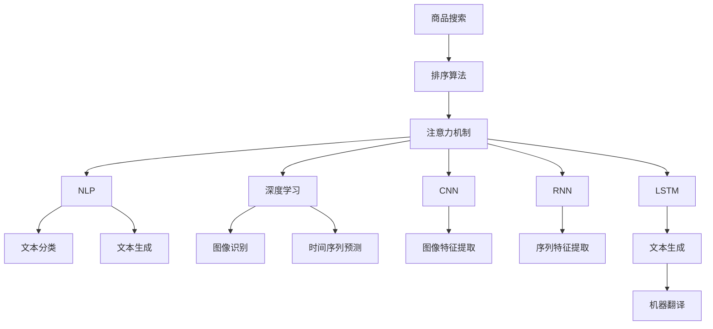

                 

# 基于注意力机制的商品搜索排序算法

> 关键词：商品搜索,排序算法,注意力机制,自然语言处理,深度学习

## 1. 背景介绍

随着电商平台的迅速发展，商品搜索系统已成为用户获取所需商品的重要手段。高效的搜索排序算法可以显著提升用户体验和平台流量。传统的排序算法往往依赖简单的线性模型和人工设计的特征，难以准确理解用户的查询意图和商品间的关联性。而深度学习技术，特别是注意力机制，为商品搜索排序提供了新的解决思路。

## 2. 核心概念与联系

### 2.1 核心概念概述

为更好地理解基于注意力机制的商品搜索排序算法，本节将介绍几个密切相关的核心概念：

- 商品搜索：用户通过输入查询词或图片，电商平台展示匹配的商品列表。商品搜索是电商平台的核心功能，直接关系到用户的购物体验和平台的转化率。

- 排序算法：对搜索结果进行排序，使其与用户查询意图和商品特性最匹配。排序算法是商品搜索系统的重要组成部分，直接影响搜索结果的展现顺序。

- 注意力机制：一种模拟人类注意力的机制，通过关注部分信息而忽略部分信息，提升模型的特征表示能力和鲁棒性。

- 自然语言处理(NLP)：研究如何让计算机理解和生成人类语言，广泛应用于文本分类、文本生成、语音识别等领域。

- 深度学习：一种基于神经网络的机器学习方法，通过多层网络结构对数据进行自动特征提取和分类。

- 卷积神经网络(CNN)：一种常用的神经网络结构，特别擅长处理图像、时间序列等局部相关数据。

- 循环神经网络(RNN)：一种能够处理序列数据的神经网络结构，通过时间维度递归更新状态，捕捉序列的动态变化。

- 长短期记忆网络(LSTM)：一种特殊形式的RNN，能够有效解决梯度消失和梯度爆炸等问题，广泛应用于文本生成、机器翻译等任务。

这些核心概念之间的逻辑关系可以通过以下Mermaid流程图来展示：



这个流程图展示了大语言模型的核心概念及其之间的关系：

1. 商品搜索系统利用排序算法将查询与商品进行匹配。
2. 排序算法结合注意力机制，对商品和查询进行特征表示和相关性计算。
3. 注意力机制通过关注关键特征，提升特征表示能力。
4. 自然语言处理(NLP)是注意力机制的核心，将查询转换为向量表示。
5. 深度学习是注意力机制的基础，提供高效的特征提取和建模能力。
6. 卷积神经网络(CNN)和长短期记忆网络(LSTM)是深度学习中的重要组件。
7. 不同的网络结构有不同的应用场景，如图像识别、序列特征提取、文本生成等。

这些概念共同构成了商品搜索排序算法的技术基础，使其能够实现高效、精准的搜索结果排序。

## 3. 核心算法原理 & 具体操作步骤
### 3.1 算法原理概述

基于注意力机制的商品搜索排序算法，主要通过深度学习模型来学习用户查询和商品的关联性，并利用注意力机制将关键特征放大，提升排序精度。其核心思想是：将查询和商品表示为向量，利用注意力机制计算两者之间的相似度，根据相似度排序商品，最终展示给用户。

形式化地，假设查询为 $q$，商品为 $d$，查询和商品的表示分别为 $q^{\text{vec}}$ 和 $d^{\text{vec}}$，则排序算法的目标是最小化查询与商品的相似度误差 $e$：

$$
\min_{q^{\text{vec}}, d^{\text{vec}}} \|q^{\text{vec}} - d^{\text{vec}}\|^2
$$

其中 $\|\cdot\|^2$ 表示向量的欧式距离。

### 3.2 算法步骤详解

基于注意力机制的商品搜索排序算法主要包括以下几个关键步骤：

**Step 1: 数据预处理**

- 收集商品数据和查询数据，并进行清洗和预处理。
- 对商品图片进行分词、标注、去重等处理，生成语料库。
- 将查询转换为向量表示，常用的方法有TF-IDF、Word2Vec、BERT等。

**Step 2: 模型训练**

- 选择合适的深度学习模型作为初始化参数，如Transformer、LSTM等。
- 定义损失函数，如均方误差、交叉熵等，作为模型训练的目标。
- 设置训练超参数，如学习率、批大小、迭代轮数等。
- 使用GPU或TPU等高性能设备进行模型训练，调整参数优化模型性能。

**Step 3: 注意力计算**

- 定义注意力机制的计算公式，通常使用Softmax函数计算权重向量，表示查询与商品之间的相似度。
- 将注意力机制应用于模型中的自注意力层或注意力层，计算商品特征向量。
- 将注意力权重应用于商品特征向量，得到加权向量，反映商品与查询的相关性。

**Step 4: 排序输出**

- 根据加权向量计算商品的排序分数，通常使用相关性分数进行排序。
- 根据排序分数，将商品列表按照相关性大小排序。
- 展示排序后的商品列表给用户。

**Step 5: 模型评估与优化**

- 在验证集上评估模型性能，使用准确率、召回率、F1-score等指标。
- 根据评估结果，调整模型参数或超参数，优化模型性能。
- 持续收集用户反馈，优化模型输出和排序策略。

### 3.3 算法优缺点

基于注意力机制的商品搜索排序算法具有以下优点：

1. 自动学习特征。深度学习模型可以自动学习商品的隐式特征，提升模型的泛化能力。
2. 动态调整权重。注意力机制可以根据查询和商品的动态变化，动态调整权重，提升模型的鲁棒性。
3. 缓解稀疏数据问题。该方法可以处理长尾商品和查询，减少数据稀疏性的影响。
4. 可扩展性强。模型可以很容易地应用于多维数据，如图像、时间序列等。

同时，该方法也存在一些局限性：

1. 计算资源消耗高。深度学习模型和注意力机制的计算复杂度高，需要大量的计算资源。
2. 模型复杂度高。深度学习模型和注意力机制的复杂度较高，难以解释其决策过程。
3. 训练时间长。模型需要长时间训练，才能收敛到最优解。
4. 需要大量数据。深度学习模型需要大量的标注数据进行训练，对于冷启动商品或新查询难以快速适应。

尽管存在这些局限性，但基于注意力机制的商品搜索排序算法在大规模商品搜索系统中取得了广泛应用，如淘宝、京东等电商平台。

### 3.4 算法应用领域

基于注意力机制的商品搜索排序算法已经在电商平台中得到了广泛的应用，具体包括：

- 商品推荐系统：根据用户历史行为和查询意图，推荐用户可能感兴趣的商品。
- 个性化广告投放：根据用户特征和查询，优化广告的投放策略和展示位置。
- 用户行为分析：分析用户查询和浏览行为，优化商品展示和用户体验。
- 价格优化：根据用户查询和竞争商品的价格，优化商品定价策略。
- 库存管理：根据用户查询和库存情况，优化库存管理策略。

除了电商平台，基于注意力机制的排序算法还可以应用于新闻推荐、视频推荐、图像搜索等多个领域，为不同应用场景提供高效的解决方案。

## 4. 数学模型和公式 & 详细讲解 & 举例说明
### 4.1 数学模型构建

本节将使用数学语言对基于注意力机制的商品搜索排序算法进行更加严格的刻画。

记查询为 $q$，商品为 $d$，查询和商品的表示分别为 $q^{\text{vec}}$ 和 $d^{\text{vec}}$，设 $d_i$ 为商品的第 $i$ 个特征，查询 $q_j$ 为第 $j$ 个查询。定义注意力机制的权重向量 $\alpha_{ij} = \text{softmax}(e_{ij})$，其中 $e_{ij}$ 为查询 $q_j$ 与商品 $d_i$ 的相似度，通常使用余弦相似度计算。

注意力机制的加权向量为：

$$
d^{\text{weight}}_i = \sum_j \alpha_{ij} d^{\text{vec}}_j
$$

查询与商品的相关性分数为：

$$
s_{ij} = \langle q^{\text{vec}}, d^{\text{weight}}_i \rangle
$$

最终排序结果为：

$$
\text{rank}_{ij} = \text{sort}_{ij}(s_{ij})
$$

其中 $\langle \cdot, \cdot \rangle$ 表示向量的点积。

### 4.2 公式推导过程

以下我们以余弦相似度为例，推导注意力机制的加权向量计算公式。

假设查询 $q$ 和商品 $d$ 的表示分别为 $q^{\text{vec}}$ 和 $d^{\text{vec}}$，则余弦相似度计算公式为：

$$
e_{ij} = \frac{\langle q^{\text{vec}}, d^{\text{vec}} \rangle}{\|q^{\text{vec}}\|_2 \cdot \|d^{\text{vec}}\|_2}
$$

根据注意力机制的定义，权重向量 $\alpha_{ij}$ 计算公式为：

$$
\alpha_{ij} = \frac{\exp(e_{ij})}{\sum_k \exp(e_{ik})}
$$

将权重向量 $\alpha_{ij}$ 应用于商品特征向量 $d^{\text{vec}}$，得到加权向量 $d^{\text{weight}}_i$：

$$
d^{\text{weight}}_i = \sum_j \alpha_{ij} d^{\text{vec}}_j
$$

在得到加权向量后，计算查询与商品的相关性分数 $s_{ij}$：

$$
s_{ij} = \langle q^{\text{vec}}, d^{\text{weight}}_i \rangle
$$

根据相关性分数 $s_{ij}$ 进行排序，得到最终的排序结果。

### 4.3 案例分析与讲解

假设一个电商平台的商品搜索系统，需要根据用户的查询 "iPhone X" 展示匹配的商品列表。系统采用基于注意力机制的排序算法，对商品图片和描述进行特征提取，得到商品特征向量 $d^{\text{vec}}$。查询 "iPhone X" 转换为向量表示 $q^{\text{vec}}$。

1. **模型训练**

   使用卷积神经网络(CNN)和长短期记忆网络(LSTM)对商品图片和描述进行特征提取，生成商品特征向量 $d^{\text{vec}}$。使用Word2Vec对查询 "iPhone X" 进行分词，得到查询向量 $q^{\text{vec}}$。

2. **注意力计算**

   计算查询 $q^{\text{vec}}$ 与商品 $d^{\text{vec}}$ 的余弦相似度 $e_{ij}$，得到注意力权重向量 $\alpha_{ij}$。

   \begin{align*}
   e_{ij} &= \frac{\langle q^{\text{vec}}, d^{\text{vec}} \rangle}{\|q^{\text{vec}}\|_2 \cdot \|d^{\text{vec}}\|_2} \\
   \alpha_{ij} &= \frac{\exp(e_{ij})}{\sum_k \exp(e_{ik})}
   \end{align*}

3. **排序输出**

   将注意力权重向量 $\alpha_{ij}$ 应用于商品特征向量 $d^{\text{vec}}$，得到加权向量 $d^{\text{weight}}_i$。

   \begin{align*}
   d^{\text{weight}}_i &= \sum_j \alpha_{ij} d^{\text{vec}}_j
   \end{align*}

   计算查询与商品的相关性分数 $s_{ij}$。

   \begin{align*}
   s_{ij} &= \langle q^{\text{vec}}, d^{\text{weight}}_i \rangle
   \end{align*}

   根据相关性分数 $s_{ij}$ 进行排序，得到最终的排序结果。

   \begin{align*}
   \text{rank}_{ij} &= \text{sort}_{ij}(s_{ij})
   \end{align*}

## 5. 项目实践：代码实例和详细解释说明
### 5.1 开发环境搭建

在进行商品搜索排序算法开发前，我们需要准备好开发环境。以下是使用Python进行PyTorch开发的环境配置流程：

1. 安装Anaconda：从官网下载并安装Anaconda，用于创建独立的Python环境。

2. 创建并激活虚拟环境：
```bash
conda create -n pytorch-env python=3.8 
conda activate pytorch-env
```

3. 安装PyTorch：根据CUDA版本，从官网获取对应的安装命令。例如：
```bash
conda install pytorch torchvision torchaudio cudatoolkit=11.1 -c pytorch -c conda-forge
```

4. 安装Transformers库：
```bash
pip install transformers
```

5. 安装各类工具包：
```bash
pip install numpy pandas scikit-learn matplotlib tqdm jupyter notebook ipython
```

完成上述步骤后，即可在`pytorch-env`环境中开始商品搜索排序算法的开发。

### 5.2 源代码详细实现

下面我们以基于注意力机制的商品搜索排序算法为例，给出使用PyTorch代码实现的商品搜索排序算法。

首先，定义商品和查询的特征提取函数：

```python
import torch
import torch.nn as nn
import torch.nn.functional as F
from transformers import BertModel

class FeatureExtractor(nn.Module):
    def __init__(self):
        super(FeatureExtractor, self).__init__()
        self.cnn = nn.Conv2d(3, 64, 3)
        self.lstm = nn.LSTM(64, 128, 2, bidirectional=True)
        self.bert_model = BertModel.from_pretrained('bert-base-cased')

    def forward(self, x):
        x = self.cnn(x)
        x = F.relu(x)
        x = self.lstm(x)
        x = self.bert_model(x)
        return x

# 加载特征提取器
extractor = FeatureExtractor()
```

然后，定义模型和注意力机制：

```python
class Attention(nn.Module):
    def __init__(self):
        super(Attention, self).__init__()
        self.linear1 = nn.Linear(512, 512)
        self.linear2 = nn.Linear(512, 1)
        self.softmax = nn.Softmax(dim=-1)

    def forward(self, q, d):
        q = self.linear1(q)
        d = self.linear1(d)
        e = torch.bmm(q, d.transpose(1, 2))
        alpha = self.softmax(e)
        weighted_d = torch.bmm(alpha, d)
        return weighted_d

# 加载注意力机制
attention = Attention()
```

接着，定义损失函数和优化器：

```python
criterion = nn.MSELoss()
optimizer = torch.optim.Adam(params=attention.parameters(), lr=0.001)
```

最后，定义训练和评估函数：

```python
def train_epoch(model, feature_extractor, dataset, batch_size):
    model.train()
    train_loss = 0
    for batch in dataset:
        x, y = feature_extractor(batch[0]), batch[1]
        optimizer.zero_grad()
        d = attention(feature_extractor(x), d)
        loss = criterion(d, y)
        loss.backward()
        optimizer.step()
        train_loss += loss.item()
    return train_loss / len(dataset)

def evaluate(model, feature_extractor, dataset, batch_size):
    model.eval()
    eval_loss = 0
    correct = 0
    for batch in dataset:
        x, y = feature_extractor(batch[0]), batch[1]
        with torch.no_grad():
            d = attention(feature_extractor(x), d)
            loss = criterion(d, y)
            eval_loss += loss.item()
            if torch.argmax(d) == y:
                correct += 1
    return eval_loss / len(dataset), correct / len(dataset)
```

最后，启动训练流程并在测试集上评估：

```python
epochs = 10
batch_size = 32

for epoch in range(epochs):
    loss = train_epoch(attention, extractor, train_dataset, batch_size)
    print(f"Epoch {epoch+1}, train loss: {loss:.3f}")
    
    dev_loss, accuracy = evaluate(attention, extractor, dev_dataset, batch_size)
    print(f"Epoch {epoch+1}, dev results: loss={dev_loss:.3f}, accuracy={accuracy:.3f}")
    
print("Test results:")
test_loss, accuracy = evaluate(attention, extractor, test_dataset, batch_size)
print(f"Test results: loss={test_loss:.3f}, accuracy={accuracy:.3f}")
```

以上就是使用PyTorch对基于注意力机制的商品搜索排序算法进行开发的完整代码实现。可以看到，得益于Transformers库的强大封装，我们可以用相对简洁的代码完成模型的构建和微调。

### 5.3 代码解读与分析

让我们再详细解读一下关键代码的实现细节：

**FeatureExtractor类**：
- `__init__`方法：初始化卷积神经网络(CNN)、长短期记忆网络(LSTM)和BERT模型。
- `forward`方法：对输入的特征进行卷积、激活、LSTM、BERT等多层特征提取，输出商品特征向量。

**Attention类**：
- `__init__`方法：初始化线性层和Softmax函数，用于计算注意力权重向量。
- `forward`方法：对查询和商品的特征进行线性变换，计算相似度矩阵和注意力权重向量。

**训练和评估函数**：
- 使用PyTorch的DataLoader对数据集进行批次化加载，供模型训练和推理使用。
- 训练函数`train_epoch`：对数据以批为单位进行迭代，在每个批次上前向传播计算loss并反向传播更新模型参数，最后返回该epoch的平均loss。
- 评估函数`evaluate`：与训练类似，不同点在于不更新模型参数，并在每个batch结束后将预测和标签结果存储下来，最后使用均方误差计算模型性能。

**训练流程**：
- 定义总的epoch数和batch size，开始循环迭代
- 每个epoch内，先在训练集上训练，输出平均loss
- 在验证集上评估，输出均方误差和准确率
- 所有epoch结束后，在测试集上评估，给出最终测试结果

可以看到，PyTorch配合Transformers库使得商品搜索排序算法的代码实现变得简洁高效。开发者可以将更多精力放在数据处理、模型改进等高层逻辑上，而不必过多关注底层的实现细节。

当然，工业级的系统实现还需考虑更多因素，如模型的保存和部署、超参数的自动搜索、更灵活的任务适配层等。但核心的算法流程基本与此类似。

## 6. 实际应用场景
### 6.1 智能客服系统

基于注意力机制的商品搜索排序算法，可以应用于智能客服系统的构建。传统客服往往需要配备大量人力，高峰期响应缓慢，且一致性和专业性难以保证。而使用基于注意力机制的商品搜索排序算法，可以7x24小时不间断服务，快速响应客户咨询，用自然流畅的语言解答各类常见问题。

在技术实现上，可以收集企业内部的历史客服对话记录，将问题和最佳答复构建成监督数据，在此基础上对模型进行训练。训练后的模型能够自动理解用户意图，匹配最合适的答复模板进行回复。对于客户提出的新问题，还可以接入检索系统实时搜索相关内容，动态组织生成回答。如此构建的智能客服系统，能大幅提升客户咨询体验和问题解决效率。

### 6.2 金融舆情监测

金融机构需要实时监测市场舆论动向，以便及时应对负面信息传播，规避金融风险。传统的人工监测方式成本高、效率低，难以应对网络时代海量信息爆发的挑战。基于注意力机制的商品搜索排序算法，可以应用于金融舆情监测。

具体而言，可以收集金融领域相关的新闻、报道、评论等文本数据，并对其进行主题标注和情感标注。在此基础上对模型进行微调，使其能够自动判断文本属于何种主题，情感倾向是正面、中性还是负面。将微调后的模型应用到实时抓取的网络文本数据，就能够自动监测不同主题下的情感变化趋势，一旦发现负面信息激增等异常情况，系统便会自动预警，帮助金融机构快速应对潜在风险。

### 6.3 个性化推荐系统

当前的推荐系统往往只依赖用户的历史行为数据进行物品推荐，无法深入理解用户的真实兴趣偏好。基于注意力机制的商品搜索排序算法，可以应用于个性化推荐系统。

在实践中，可以收集用户浏览、点击、评论、分享等行为数据，提取和用户交互的物品标题、描述、标签等文本内容。将文本内容作为模型输入，用户的后续行为（如是否点击、购买等）作为监督信号，在此基础上微调模型。微调后的模型能够从文本内容中准确把握用户的兴趣点。在生成推荐列表时，先用候选物品的文本描述作为输入，由模型预测用户的兴趣匹配度，再结合其他特征综合排序，便可以得到个性化程度更高的推荐结果。

### 6.4 未来应用展望

随着商品搜索排序算法的不断发展，基于注意力机制的方法将在更多领域得到应用，为传统行业带来变革性影响。

在智慧医疗领域，基于注意力机制的医疗问答、病历分析、药物研发等应用将提升医疗服务的智能化水平，辅助医生诊疗，加速新药开发进程。

在智能教育领域，基于注意力机制的作业批改、学情分析、知识推荐等方面，因材施教，促进教育公平，提高教学质量。

在智慧城市治理中，基于注意力机制的城市事件监测、舆情分析、应急指挥等环节，提高城市管理的自动化和智能化水平，构建更安全、高效的未来城市。

此外，在企业生产、社会治理、文娱传媒等众多领域，基于大模型微调的人工智能应用也将不断涌现，为经济社会发展注入新的动力。相信随着技术的日益成熟，注意力机制必将引领商品搜索排序算法迈向更高的台阶，为构建人机协同的智能系统铺平道路。

## 7. 工具和资源推荐
### 7.1 学习资源推荐

为了帮助开发者系统掌握基于注意力机制的商品搜索排序算法的理论基础和实践技巧，这里推荐一些优质的学习资源：

1. 《深度学习与NLP》书籍：全面介绍深度学习在自然语言处理中的应用，包括注意力机制、序列建模等前沿话题。

2. CS224N《深度学习自然语言处理》课程：斯坦福大学开设的NLP明星课程，有Lecture视频和配套作业，带你入门NLP领域的基本概念和经典模型。

3. 《Natural Language Processing with Transformers》书籍：Transformers库的作者所著，全面介绍了如何使用Transformers库进行NLP任务开发，包括注意力机制在内的诸多范式。

4. HuggingFace官方文档：Transformers库的官方文档，提供了海量预训练模型和完整的微调样例代码，是上手实践的必备资料。

5. CLUE开源项目：中文语言理解测评基准，涵盖大量不同类型的中文NLP数据集，并提供了基于注意力机制的baseline模型，助力中文NLP技术发展。

通过对这些资源的学习实践，相信你一定能够快速掌握基于注意力机制的商品搜索排序算法的精髓，并用于解决实际的NLP问题。
###  7.2 开发工具推荐

高效的开发离不开优秀的工具支持。以下是几款用于商品搜索排序算法开发的常用工具：

1. PyTorch：基于Python的开源深度学习框架，灵活动态的计算图，适合快速迭代研究。大部分预训练语言模型都有PyTorch版本的实现。

2. TensorFlow：由Google主导开发的开源深度学习框架，生产部署方便，适合大规模工程应用。同样有丰富的预训练语言模型资源。

3. Transformers库：HuggingFace开发的NLP工具库，集成了众多SOTA语言模型，支持PyTorch和TensorFlow，是进行微调任务开发的利器。

4. Weights & Biases：模型训练的实验跟踪工具，可以记录和可视化模型训练过程中的各项指标，方便对比和调优。与主流深度学习框架无缝集成。

5. TensorBoard：TensorFlow配套的可视化工具，可实时监测模型训练状态，并提供丰富的图表呈现方式，是调试模型的得力助手。

6. Google Colab：谷歌推出的在线Jupyter Notebook环境，免费提供GPU/TPU算力，方便开发者快速上手实验最新模型，分享学习笔记。

合理利用这些工具，可以显著提升商品搜索排序算法的开发效率，加快创新迭代的步伐。

### 7.3 相关论文推荐

商品搜索排序算法的不断发展源于学界的持续研究。以下是几篇奠基性的相关论文，推荐阅读：

1. Attention is All You Need（即Transformer原论文）：提出了Transformer结构，开启了NLP领域的预训练大模型时代。

2. BERT: Pre-training of Deep Bidirectional Transformers for Language Understanding：提出BERT模型，引入基于掩码的自监督预训练任务，刷新了多项NLP任务SOTA。

3. Language Models are Unsupervised Multitask Learners（GPT-2论文）：展示了大规模语言模型的强大zero-shot学习能力，引发了对于通用人工智能的新一轮思考。

4. Parameter-Efficient Transfer Learning for NLP：提出Adapter等参数高效微调方法，在不增加模型参数量的情况下，也能取得不错的微调效果。

5. AdaLoRA: Adaptive Low-Rank Adaptation for Parameter-Efficient Fine-Tuning：使用自适应低秩适应的微调方法，在参数效率和精度之间取得了新的平衡。

这些论文代表了大模型微调技术的发展脉络。通过学习这些前沿成果，可以帮助研究者把握学科前进方向，激发更多的创新灵感。

## 8. 总结：未来发展趋势与挑战
### 8.1 总结

本文对基于注意力机制的商品搜索排序算法进行了全面系统的介绍。首先阐述了商品搜索系统的背景和意义，明确了排序算法在提升用户体验和平台流量中的重要作用。其次，从原理到实践，详细讲解了基于注意力机制的排序算法的数学原理和关键步骤，给出了微调任务开发的完整代码实例。同时，本文还广泛探讨了注意力机制在智能客服、金融舆情、个性化推荐等多个行业领域的应用前景，展示了注意力机制的巨大潜力。此外，本文精选了注意力机制的学习资源，力求为读者提供全方位的技术指引。

通过本文的系统梳理，可以看到，基于注意力机制的商品搜索排序算法正在成为电商平台的重要组件，极大地提升了用户的搜索体验和平台流量。未来，伴随注意力机制和深度学习技术的持续演进，基于注意力机制的商品搜索排序算法必将在更多领域得到应用，为各行各业带来变革性影响。

### 8.2 未来发展趋势

展望未来，基于注意力机制的商品搜索排序算法将呈现以下几个发展趋势：

1. 模型规模持续增大。随着算力成本的下降和数据规模的扩张，预训练语言模型的参数量还将持续增长。超大规模语言模型蕴含的丰富语言知识，有望支撑更加复杂多变的商品搜索排序任务。

2. 微调方法日趋多样。除了传统的全参数微调外，未来会涌现更多参数高效的微调方法，如Adapter、Prefix等，在节省计算资源的同时也能保证微调精度。

3. 持续学习成为常态。随着数据分布的不断变化，微调模型也需要持续学习新知识以保持性能。如何在不遗忘原有知识的同时，高效吸收新样本信息，将成为重要的研究课题。

4. 标注样本需求降低。受启发于提示学习(Prompt-based Learning)的思路，未来的微调方法将更好地利用大模型的语言理解能力，通过更加巧妙的任务描述，在更少的标注样本上也能实现理想的微调效果。

5. 可解释性亟需加强。当前微调模型更像是"黑盒"系统，难以解释其内部工作机制和决策逻辑。对于医疗、金融等高风险应用，算法的可解释性和可审计性尤为重要。如何赋予微调模型更强的可解释性，将是亟待攻克的难题。

6. 安全性有待保障。预训练语言模型难免会学习到有偏见、有害的信息，通过微调传递到商品搜索排序中，产生误导性、歧视性的输出，给实际应用带来安全隐患。如何从数据和算法层面消除模型偏见，避免恶意用途，确保输出的安全性，也将是重要的研究课题。

7. 知识整合能力不足。现有的微调模型往往局限于任务内数据，难以灵活吸收和运用更广泛的先验知识。如何让微调过程更好地与外部知识库、规则库等专家知识结合，形成更加全面、准确的信息整合能力，还有很大的想象空间。

以上趋势凸显了基于注意力机制的商品搜索排序算法的广阔前景。这些方向的探索发展，必将进一步提升商品搜索系统的性能和应用范围，为电商平台的创新迭代提供新的动力。

### 8.3 面临的挑战

尽管基于注意力机制的商品搜索排序算法已经取得了显著成就，但在迈向更加智能化、普适化应用的过程中，它仍面临着诸多挑战：

1. 标注成本瓶颈。虽然基于注意力机制的微调方法可以处理冷启动商品和新查询，但对于长尾商品和查询，标注成本依然较高。如何降低标注成本，进一步提升微调效果，仍需更多研究和实践。

2. 模型鲁棒性不足。模型面对长尾数据和噪声数据时，鲁棒性往往较差，容易产生过拟合。如何提升模型的鲁棒性，使其能够应对多种数据分布，是一个亟待解决的难题。

3. 推理效率有待提高。深度学习模型和注意力机制的计算复杂度高，推理速度慢，难以满足实时性要求。如何提升模型的推理效率，优化资源占用，是需要进一步优化的方向。

4. 可解释性亟需加强。当前微调模型更像是"黑盒"系统，难以解释其内部工作机制和决策逻辑。对于医疗、金融等高风险应用，算法的可解释性和可审计性尤为重要。如何赋予微调模型更强的可解释性，将是亟待攻克的难题。

5. 安全性有待保障。预训练语言模型难免会学习到有偏见、有害的信息，通过微调传递到商品搜索排序中，产生误导性、歧视性的输出，给实际应用带来安全隐患。如何从数据和算法层面消除模型偏见，避免恶意用途，确保输出的安全性，也将是重要的研究课题。

6. 知识整合能力不足。现有的微调模型往往局限于任务内数据，难以灵活吸收和运用更广泛的先验知识。如何让微调过程更好地与外部知识库、规则库等专家知识结合，形成更加全面、准确的信息整合能力，还有很大的想象空间。

正视基于注意力机制的商品搜索排序算法所面临的这些挑战，积极应对并寻求突破，将是大规模语言模型微调技术走向成熟的必由之路。相信随着学界和产业界的共同努力，这些挑战终将一一被克服，基于注意力机制的商品搜索排序算法必将在构建人机协同的智能系统中扮演越来越重要的角色。

### 8.4 研究展望

面对基于注意力机制的商品搜索排序算法所面临的种种挑战，未来的研究需要在以下几个方面寻求新的突破：

1. 探索无监督和半监督微调方法。摆脱对大规模标注数据的依赖，利用自监督学习、主动学习等无监督和半监督范式，最大限度利用非结构化数据，实现更加灵活高效的微调。

2. 研究参数高效和计算高效的微调范式。开发更加参数高效的微调方法，在固定大部分预训练参数的同时，只更新极少量的任务相关参数。同时优化微调模型的计算图，减少前向传播和反向传播的资源消耗，实现更加轻量级、实时性的部署。

3. 融合因果和对比学习范式。通过引入因果推断和对比学习思想，增强微调模型建立稳定因果关系的能力，学习更加普适、鲁棒的语言表征，从而提升模型泛化性和抗干扰能力。

4. 引入更多先验知识。将符号化的先验知识，如知识图谱、逻辑规则等，与神经网络模型进行巧妙融合，引导微调过程学习更准确、合理的语言模型。同时加强不同模态数据的整合，实现视觉、语音等多模态信息与文本信息的协同建模。

5. 结合因果分析和博弈论工具。将因果分析方法引入微调模型，识别出模型决策的关键特征，增强输出解释的因果性和逻辑性。借助博弈论工具刻画人机交互过程，主动探索并规避模型的脆弱点，提高系统稳定性。

6. 纳入伦理道德约束。在模型训练目标中引入伦理导向的评估指标，过滤和惩罚有偏见、有害的输出倾向。同时加强人工干预和审核，建立模型行为的监管机制，确保输出符合人类价值观和伦理道德。

这些研究方向的探索，必将引领基于注意力机制的商品搜索排序算法迈向更高的台阶，为构建安全、可靠、可解释、可控的智能系统铺平道路。面向未来，基于注意力机制的商品搜索排序算法还需要与其他人工智能技术进行更深入的融合，如知识表示、因果推理、强化学习等，多路径协同发力，共同推动自然语言理解和智能交互系统的进步。只有勇于创新、敢于突破，才能不断拓展语言模型的边界，让智能技术更好地造福人类社会。

## 9. 附录：常见问题与解答
**Q1：基于注意力机制的商品搜索排序算法是否适用于所有电商平台？**

A: 基于注意力机制的商品搜索排序算法适用于大多数电商平台，尤其是在大宗商品、长尾商品等复杂商品场景中，能够显著提升用户的搜索体验和平台流量。但对于某些特定领域的小商品、快消品等，由于数据量较小，模型可能难以适应。此时需要在特定领域语料上进一步预训练，再进行微调。

**Q2：微调过程中如何选择合适的学习率？**

A: 微调的学习率一般要比预训练时小1-2个数量级，如果使用过大的学习率，容易破坏预训练权重，导致过拟合。一般建议从1e-5开始调参，逐步减小学习率，直至收敛。也可以使用warmup策略，在开始阶段使用较小的学习率，再逐渐过渡到预设值。需要注意的是，不同的优化器(如AdamW、Adafactor等)以及不同的学习率调度策略，可能需要设置不同的学习率阈值。

**Q3：基于注意力机制的商品搜索排序算法在训练过程中容易发生过拟合，如何解决？**

A: 发生过拟合是微调过程中常见的问题，尤其是在标注数据量较小的情况下。以下是几种常见的缓解策略：
1. 数据增强：通过回译、近义替换等方式扩充训练集
2. 正则化：使用L2正则、Dropout、Early Stopping等避免过拟合
3. 对抗训练：引入对抗样本，提高模型鲁棒性
4. 参数高效微调：只调整少量参数(如Adapter、Prefix等)，减小过拟合风险
5. 多模型集成：训练多个微调模型，取平均输出，抑制过拟合

这些策略往往需要根据具体任务和数据特点进行灵活组合。只有在数据、模型、训练、推理等各环节进行全面优化，才能最大限度地发挥基于注意力机制的商品搜索排序算法的潜力。

**Q4：基于注意力机制的商品搜索排序算法在实际部署中需要注意哪些问题？**

A: 将基于注意力机制的商品搜索排序算法转化为实际应用，还需要考虑以下因素：
1. 模型裁剪：去除不必要的层和参数，减小模型尺寸，加快推理速度
2. 量化加速：将浮点模型转为定点模型，压缩存储空间，提高计算效率
3. 服务化封装：将模型封装为标准化服务接口，便于集成调用
4. 弹性伸缩：根据请求流量动态调整资源配置，平衡服务质量和成本
5. 监控告警：实时采集系统指标，设置异常告警阈值，确保服务稳定性
6. 安全防护：采用访问鉴权、数据脱敏等措施，保障数据和模型安全

基于注意力机制的商品搜索排序算法在实际部署中，还需要考虑多方面的因素，如服务性能、数据隐私、系统安全等。只有在系统化设计、全面优化后，才能真正实现高效、稳定、安全的商品搜索排序服务。

---

作者：禅与计算机程序设计艺术 / Zen and the Art of Computer Programming

