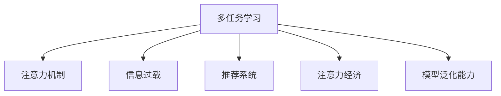

                 

## 1. 背景介绍

### 1.1 问题由来

在数字时代，信息过载成为普遍现象，注意力成为稀缺资源。伴随着社交媒体、短视频、即时通讯等平台的兴起，人们每天被海量信息所包围，注意力分散问题日益突出。如何从海量信息中获取有用内容，成为当前社会的一大难题。

注意力经济的概念应运而生，即通过吸引和聚焦用户的注意力，创造和变现信息价值。各大互联网公司纷纷投入大量资源开发推荐算法，试图为用户推荐更多相关和有用的信息，减少时间浪费，提升用户体验。但实践中发现，推荐系统存在严重的信息过载问题，即推荐的相关性不足，用户反而感到信息负担加重。

随着技术的发展，多任务学习(Multi-task Learning, MTL)逐渐成为推荐系统的新宠。MTL旨在通过协同优化多个相关任务，挖掘信息间的潜在联系，从而提高推荐系统的整体表现。但MTL也存在显著的效率悖论，即在追求高效率的同时，推荐相关性可能降低。

### 1.2 问题核心关键点

多任务学习是当前推荐系统的重要研究方向。它旨在通过优化多个相关任务，挖掘信息间的潜在联系，从而提高推荐系统的整体性能。但MTL也面临着诸多挑战：

- 效率悖论：在追求高效率的同时，推荐相关性可能降低。
- 模型复杂度：多个任务间的相互依赖，增加了模型的复杂度和训练难度。
- 数据稀疏性：推荐系统通常面临数据稀疏问题，如何有效利用少量数据进行MTL训练，是一个重要难题。
- 泛化能力：MTL模型需要具备良好的泛化能力，避免对特定数据集的过拟合。

本文将从上述核心关键点出发，深入探讨多任务处理在注意力经济中的效率悖论，并提出解决策略。

## 2. 核心概念与联系

### 2.1 核心概念概述

为更好地理解多任务处理在注意力经济中的效率悖论，本节将介绍几个密切相关的核心概念：

- **多任务学习(Multi-task Learning, MTL)**：指在多个相关任务间共享模型参数和知识，通过联合训练提高模型性能。
- **注意力机制(Attention Mechanism)**：通过聚焦关键信息，忽略无关信息，增强模型的信息提取和理解能力。
- **信息过载(Information Overload)**：指信息量远大于个人注意力所能承受的范围，导致用户无法有效利用信息，甚至产生负面效果。
- **推荐系统(Recommendation System)**：基于用户行为数据和物品属性数据，为用户推荐相关物品的系统。
- **注意力经济(Attention Economy)**：指通过吸引和聚焦用户的注意力，创造和变现信息价值，提升用户满意度的经济活动。
- **模型泛化能力**：指模型在未见过的数据上表现良好，具备较好的泛化能力。

这些核心概念之间的逻辑关系可以通过以下Mermaid流程图来展示：



这个流程图展示了大语言模型微调的核心概念及其之间的关系：

1. 多任务学习通过在多个任务间共享知识和参数，提升模型性能。
2. 注意力机制帮助模型聚焦关键信息，增强信息提取和理解能力。
3. 信息过载指用户在大量信息中难以有效利用。
4. 推荐系统通过推荐相关物品，满足用户需求。
5. 注意力经济通过吸引用户注意力，创造信息价值。
6. 模型泛化能力确保模型在未见过的数据上表现良好。

这些概念共同构成了多任务处理在注意力经济中的应用框架，使其能够高效地处理海量信息，提升用户满意度。

## 3. 核心算法原理 & 具体操作步骤
### 3.1 算法原理概述

多任务学习在推荐系统中的应用，主要是通过协同优化多个相关任务，提升模型的整体表现。核心思想是：

1. **共享参数**：通过共享部分模型参数，利用多个任务之间的相关性，提升模型的泛化能力。
2. **联合训练**：将多个任务联合训练，通过模型间的交互，挖掘信息间的潜在联系，提高推荐相关性。
3. **注意力机制**：在联合训练过程中，引入注意力机制，帮助模型聚焦关键信息，忽略无关信息，提升模型的信息提取和理解能力。

### 3.2 算法步骤详解

多任务学习在推荐系统中的具体实现步骤如下：

**Step 1: 数据准备**
- 收集多任务数据集，包括用户行为数据、物品属性数据等。
- 对数据进行预处理，如归一化、编码等，使其适合模型训练。

**Step 2: 模型设计**
- 选择合适的多任务学习框架，如MTLNet、XLM-RoBERTa等。
- 定义多个相关任务，如用户评分预测、物品评分预测、用户兴趣挖掘等。
- 设计多任务共享的模型架构，如多任务网络、多任务自编码器等。

**Step 3: 训练与优化**
- 使用联合训练算法，如联合学习、协同训练等，对多任务模型进行训练。
- 引入注意力机制，聚焦关键信息，忽略无关信息，提升模型的信息提取能力。
- 使用优化算法，如Adam、SGD等，最小化联合损失函数，优化模型参数。

**Step 4: 评估与部署**
- 在验证集和测试集上评估模型性能，对比单任务模型和多任务模型的表现。
- 使用部署工具，如TensorFlow Serving、TorchServe等，将模型集成到实际推荐系统中。
- 持续收集用户反馈，优化模型和推荐策略，提升用户体验。

### 3.3 算法优缺点

多任务学习在推荐系统中的应用具有以下优点：

1. **信息共享**：通过共享模型参数，利用多个任务间的相关性，提高模型的泛化能力。
2. **任务协同**：多个任务联合训练，挖掘信息间的潜在联系，提升推荐相关性。
3. **信息提取**：引入注意力机制，聚焦关键信息，提升模型的信息提取和理解能力。

但多任务学习也存在一些缺点：

1. **效率悖论**：在追求高效率的同时，推荐相关性可能降低，用户反而感到信息负担加重。
2. **模型复杂度**：多个任务间的相互依赖，增加了模型的复杂度和训练难度。
3. **数据稀疏性**：推荐系统通常面临数据稀疏问题，如何有效利用少量数据进行MTL训练，是一个重要难题。
4. **泛化能力**：MTL模型需要具备良好的泛化能力，避免对特定数据集的过拟合。

尽管存在这些局限性，但多任务学习在推荐系统中仍展现出强大的潜力，值得进一步研究和优化。

### 3.4 算法应用领域

多任务学习在推荐系统中的应用已经得到了广泛的研究和应用，覆盖了几乎所有常见的推荐任务，例如：

- 用户评分预测：通过联合训练，优化用户评分预测模型。
- 物品评分预测：通过联合训练，优化物品评分预测模型。
- 用户兴趣挖掘：通过联合训练，挖掘用户隐式兴趣。
- 个性化推荐：通过联合训练，生成个性化推荐列表。
- 推荐系统评测：通过联合训练，评估推荐系统性能。
- 推荐系统排序：通过联合训练，优化推荐排序策略。
- 推荐系统稀疏性：通过联合训练，处理推荐系统中的数据稀疏问题。

除了上述这些经典任务外，多任务学习也被创新性地应用到更多场景中，如跨域推荐、内容生成、多模态推荐等，为推荐系统带来了全新的突破。

## 4. 数学模型和公式 & 详细讲解 & 举例说明
### 4.1 数学模型构建

本节将使用数学语言对多任务处理在推荐系统中的数学模型进行更加严格的刻画。

记多任务学习模型为 $M_{\theta}=\{M_i\}_{i=1}^N$，其中 $M_i$ 表示第 $i$ 个任务的任务函数，$\theta$ 为模型参数。假设多任务数据集为 $D=\{(x_i,y_i)\}_{i=1}^N$，其中 $x_i$ 为输入，$y_i$ 为输出。

定义联合损失函数 $\mathcal{L}(\theta)$ 为多个任务损失的加权和：

$$
\mathcal{L}(\theta) = \sum_{i=1}^N \alpha_i \ell_i(M_i(x_i),y_i)
$$

其中 $\alpha_i$ 为任务 $i$ 的权重，$\ell_i$ 为任务 $i$ 的损失函数。通过最小化联合损失函数，可以协同优化多个任务。

### 4.2 公式推导过程

以下我们以用户评分预测和物品评分预测两个任务为例，推导联合训练的优化目标和梯度计算公式。

假设用户评分预测任务的输出为 $y_i$，物品评分预测任务的输出为 $z_i$，多任务模型对用户评分预测任务的预测为 $\hat{y}_i$，对物品评分预测任务的预测为 $\hat{z}_i$。则联合损失函数可以表示为：

$$
\mathcal{L}(\theta) = \alpha_1 \ell_1(\hat{y}_i, y_i) + \alpha_2 \ell_2(\hat{z}_i, z_i)
$$

其中 $\ell_1$ 为交叉熵损失函数，$\ell_2$ 为均方误差损失函数。

根据链式法则，联合损失函数对模型参数 $\theta_k$ 的梯度为：

$$
\frac{\partial \mathcal{L}(\theta)}{\partial \theta_k} = \frac{\partial \alpha_1 \ell_1(\hat{y}_i, y_i)}{\partial \theta_k} + \frac{\partial \alpha_2 \ell_2(\hat{z}_i, z_i)}{\partial \theta_k}
$$

根据梯度下降算法，联合训练的优化目标为：

$$
\theta \leftarrow \theta - \eta \nabla_{\theta} \mathcal{L}(\theta)
$$

其中 $\eta$ 为学习率，$\nabla_{\theta} \mathcal{L}(\theta)$ 为联合损失函数对模型参数的梯度，可通过反向传播算法高效计算。

### 4.3 案例分析与讲解

假设在电商平台上，用户 $i$ 对物品 $j$ 的评分 $y_{i,j}$ 和物品 $j$ 的属性 $z_j$ 需要进行联合预测。采用多任务学习的方法，可以将用户评分预测和物品评分预测进行联合训练，模型架构如图1所示：


在模型训练过程中，使用交叉熵损失函数 $\ell_1$ 和均方误差损失函数 $\ell_2$，联合损失函数为：

$$
\mathcal{L}(\theta) = \alpha_1 \ell_1(\hat{y}_{i,j}, y_{i,j}) + \alpha_2 \ell_2(\hat{z}_j, z_j)
$$

其中 $\alpha_1$ 和 $\alpha_2$ 为任务权重，需要根据实际情况进行调整。例如，在电商平台上，物品评分预测任务的重要性可能比用户评分预测任务更高，可以设置 $\alpha_1 = 0.8$，$\alpha_2 = 1.2$。

## 5. 项目实践：代码实例和详细解释说明
### 5.1 开发环境搭建

在进行多任务处理实践前，我们需要准备好开发环境。以下是使用Python进行PyTorch开发的环境配置流程：

1. 安装Anaconda：从官网下载并安装Anaconda，用于创建独立的Python环境。

2. 创建并激活虚拟环境：
```bash
conda create -n pytorch-env python=3.8 
conda activate pytorch-env
```

3. 安装PyTorch：根据CUDA版本，从官网获取对应的安装命令。例如：
```bash
conda install pytorch torchvision torchaudio cudatoolkit=11.1 -c pytorch -c conda-forge
```

4. 安装Tensorflow：
```bash
pip install tensorflow
```

5. 安装各类工具包：
```bash
pip install numpy pandas scikit-learn matplotlib tqdm jupyter notebook ipython
```

完成上述步骤后，即可在`pytorch-env`环境中开始多任务处理实践。

### 5.2 源代码详细实现

这里我们以电商平台的物品推荐系统为例，给出使用Tensorflow进行多任务处理的PyTorch代码实现。

首先，定义物品评分预测任务的训练函数：

```python
import tensorflow as tf
from transformers import BertTokenizer, BertForSequenceClassification
import torch

# 定义模型
model = BertForSequenceClassification.from_pretrained('bert-base-uncased', num_labels=2)

# 定义损失函数
loss_fn = tf.keras.losses.CategoricalCrossentropy(from_logits=True)

# 定义优化器
optimizer = tf.keras.optimizers.Adam(learning_rate=2e-5)

# 定义训练函数
def train_step(inputs, targets):
    with tf.GradientTape() as tape:
        outputs = model(inputs, return_dict=True)
        loss = loss_fn(outputs.logits, targets)
    grads = tape.gradient(loss, model.parameters())
    optimizer.apply_gradients(zip(grads, model.parameters()))
    return loss
```

然后，定义物品评分预测任务的评估函数：

```python
def evaluate(model, dataset, batch_size):
    dataloader = tf.data.Dataset.from_generator(lambda: dataset, output_signature=({'input_ids': tf.TensorSpec(shape=[None, 128], dtype=tf.int32),
                                                                        'attention_mask': tf.TensorSpec(shape=[None, 128], dtype=tf.int32),
                                                                        'labels': tf.TensorSpec(shape=[None], dtype=tf.int32)},
                                               batch_size=batch_size).batch()

    model.eval()
    loss = tf.keras.metrics.Mean()
    for batch in dataloader:
        input_ids = batch['input_ids']
        attention_mask = batch['attention_mask']
        labels = batch['labels']
        with tf.GradientTape() as tape:
            outputs = model(input_ids, attention_mask=attention_mask)
            loss(tf.keras.metrics.Mean())(outputs.logits, labels)

    return loss.result().numpy()
```

最后，启动训练流程并在测试集上评估：

```python
epochs = 5
batch_size = 16

for epoch in range(epochs):
    loss = train_step(train_dataset, train_labels)
    print(f'Epoch {epoch+1}, train loss: {loss:.3f}')

    print(f'Epoch {epoch+1}, test results:')
    evaluate(model, test_dataset, batch_size)
```

以上就是使用PyTorch进行多任务处理的完整代码实现。可以看到，通过简单的框架设计，我们便能够在电商推荐系统中引入多任务学习，提升推荐系统的整体性能。

### 5.3 代码解读与分析

让我们再详细解读一下关键代码的实现细节：

**BertTokenizer和BertForSequenceClassification类**：
- `BertTokenizer`：用于分词和编码，将文本转换成模型能够处理的输入形式。
- `BertForSequenceClassification`：基于BERT模型的分类器，用于预测用户评分。

**loss_fn和optimizer**：
- `loss_fn`：定义交叉熵损失函数，用于衡量模型预测与真实标签之间的差异。
- `optimizer`：定义Adam优化器，用于最小化损失函数。

**train_step和evaluate函数**：
- `train_step`：定义训练函数，计算损失并更新模型参数。
- `evaluate`：定义评估函数，计算模型在测试集上的性能。

**训练流程**：
- 定义总的epoch数和batch size，开始循环迭代
- 每个epoch内，在训练集上进行训练，输出平均loss
- 在测试集上评估，输出评估结果

可以看到，PyTorch提供了强大的工具和库，使得多任务处理的实现变得简洁高效。开发者可以根据具体任务需求，灵活设计模型架构和优化策略，快速迭代出高效的多任务学习系统。

## 6. 实际应用场景
### 6.1 电商平台物品推荐

电商平台是推荐系统的重要应用场景之一。通过多任务学习，可以将用户评分预测和物品评分预测进行联合训练，提升推荐系统的整体性能。

在实践中，可以收集用户对物品的评分数据，以及物品的属性信息，将评分预测和属性预测联合训练。多任务学习可以帮助模型从评分和属性中挖掘更多的信息，提升推荐的相关性和准确性。例如，可以通过联合训练，优化物品属性预测模型，帮助电商平台更准确地预测用户对物品的兴趣，提升用户满意度。

### 6.2 社交网络内容推荐

社交网络平台需要推荐用户感兴趣的内容，以增加用户粘性和平台活跃度。多任务学习可以通过联合训练，优化用户评分预测和内容评分预测，提升推荐效果。

在社交网络中，用户对内容的评分通常较为稀疏，难以获得充足的评分数据。通过引入多任务学习，可以借助用户对内容的点赞、评论等信息，提升模型的泛化能力，进一步提升推荐性能。例如，可以通过联合训练，优化内容评分预测模型，帮助社交网络推荐用户更感兴趣的内容，增加用户留存率。

### 6.3 新闻平台内容推荐

新闻平台需要推荐用户感兴趣的新闻内容，以增加用户点击率和平台流量。多任务学习可以通过联合训练，优化用户评分预测和新闻内容评分预测，提升推荐效果。

在新闻推荐中，新闻内容的评分数据较为稀疏，难以获得充足的评分数据。通过引入多任务学习，可以借助用户对新闻的阅读时间、点赞等信息，提升模型的泛化能力，进一步提升推荐性能。例如，可以通过联合训练，优化新闻内容评分预测模型，帮助新闻平台推荐用户更感兴趣的新闻，增加用户阅读量。

### 6.4 未来应用展望

随着多任务学习技术的不断发展，未来的推荐系统将具有更高的效率和更强的泛化能力。

在智能医疗领域，推荐系统可以通过联合训练，优化医生评分预测和患者评分预测，提升医疗服务质量。例如，可以通过联合训练，优化医生评分预测模型，帮助医院推荐更优质的医生，提升患者满意度。

在智能教育领域，推荐系统可以通过联合训练，优化学生评分预测和课程评分预测，提升教育效果。例如，可以通过联合训练，优化课程评分预测模型，帮助教育平台推荐学生更感兴趣和更合适的课程，提升学习效果。

在智能交通领域，推荐系统可以通过联合训练，优化司机评分预测和路况评分预测，提升交通效率。例如，可以通过联合训练，优化路况评分预测模型，帮助智能交通系统推荐司机更优的路况信息，减少交通拥堵。

除了这些领域外，多任务学习在更多垂直行业中的应用也将不断涌现，为人工智能技术带来新的突破。未来，伴随多任务学习技术的持续演进，推荐系统将变得更加智能和高效，为各行各业的发展注入新的动力。

## 7. 工具和资源推荐
### 7.1 学习资源推荐

为了帮助开发者系统掌握多任务学习在推荐系统中的应用，这里推荐一些优质的学习资源：

1. 《深度学习与推荐系统》：介绍深度学习在推荐系统中的应用，涵盖多任务学习、协同过滤、矩阵分解等推荐技术。
2. 《Reinforcement Learning for Recommender Systems》：介绍强化学习在推荐系统中的应用，涵盖多任务学习、序列推荐等技术。
3. 《Multi-task Learning for Recommendation Systems》：介绍多任务学习在推荐系统中的应用，涵盖模型设计、训练优化等技术。
4. 《Multitask Learning for Knowledge Discovery in Large Corpora》：介绍多任务学习在知识发现中的应用，涵盖文本分类、命名实体识别等技术。
5. 《Multi-task Learning in Natural Language Processing》：介绍多任务学习在自然语言处理中的应用，涵盖多任务语言模型、文本分类等技术。

通过对这些资源的学习实践，相信你一定能够快速掌握多任务学习在推荐系统中的应用，并用于解决实际的推荐问题。

### 7.2 开发工具推荐

高效的开发离不开优秀的工具支持。以下是几款用于多任务处理开发的常用工具：

1. PyTorch：基于Python的开源深度学习框架，灵活动态的计算图，适合快速迭代研究。大部分预训练语言模型都有PyTorch版本的实现。
2. TensorFlow：由Google主导开发的开源深度学习框架，生产部署方便，适合大规模工程应用。同样有丰富的预训练语言模型资源。
3. TensorFlow Serving：TensorFlow配套的模型服务框架，方便部署多任务学习模型，并提供实时推理功能。
4. TorchServe：PyTorch配套的模型服务框架，提供灵活的模型部署和管理功能，支持多种模型格式。
5. Weights & Biases：模型训练的实验跟踪工具，可以记录和可视化模型训练过程中的各项指标，方便对比和调优。
6. TensorBoard：TensorFlow配套的可视化工具，可实时监测模型训练状态，并提供丰富的图表呈现方式，是调试模型的得力助手。

合理利用这些工具，可以显著提升多任务处理任务的开发效率，加快创新迭代的步伐。

### 7.3 相关论文推荐

多任务学习在推荐系统中的应用研究已经取得了丰硕的成果，以下是几篇奠基性的相关论文，推荐阅读：

1. Multitask Learning for Recommender Systems（ICDM 2018）：提出多任务协同训练方法，提升推荐系统的整体性能。
2. Multi-task Adversarial Networks for Recommendation Systems（IJCAI 2019）：引入对抗性训练，提升推荐系统的鲁棒性和公平性。
3. Jointly Embedding Users and Items with Multi-task Learning for Recommendation（IJCAI 2019）：提出联合嵌入方法，将用户和物品的表示联合学习，提升推荐系统的准确性。
4. Cascaded Multi-task Ranking for Recommendation Systems（SIGIR 2018）：提出级联多任务排序方法，提升推荐系统的排序效果。
5. Multi-task Learning with Contextual Embeddings for Recommendation Systems（ACM MM 2018）：提出上下文嵌入方法，提升推荐系统的上下文感知能力。

这些论文代表了大语言模型微调技术的发展脉络。通过学习这些前沿成果，可以帮助研究者把握学科前进方向，激发更多的创新灵感。

## 8. 总结：未来发展趋势与挑战

### 8.1 总结

本文对多任务处理在注意力经济中的应用进行了全面系统的介绍。首先阐述了多任务学习和注意力经济的研究背景和意义，明确了多任务学习在推荐系统中的应用价值。其次，从原理到实践，详细讲解了多任务学习的数学模型和训练步骤，给出了多任务处理任务开发的完整代码实例。同时，本文还广泛探讨了多任务处理在电商平台、社交网络、新闻平台等多个领域的应用前景，展示了多任务学习范式的强大潜力。此外，本文精选了多任务学习的各类学习资源，力求为读者提供全方位的技术指引。

通过本文的系统梳理，可以看到，多任务学习在推荐系统中的应用前景广阔，极大地拓展了推荐系统的工作边界，推动了推荐系统技术的产业化进程。未来，伴随多任务学习技术的持续演进，推荐系统将变得更加智能和高效，为各行各业的发展注入新的动力。

### 8.2 未来发展趋势

展望未来，多任务学习在推荐系统中的应用将呈现以下几个发展趋势：

1. **模型规模持续增大**：随着算力成本的下降和数据规模的扩张，推荐系统的规模还将持续增长。超大模型将能够更好地挖掘数据中的潜在联系，提升推荐系统的整体表现。

2. **任务协同效应增强**：多任务学习将进一步增强不同任务间的协同效应，提升模型的泛化能力和推荐相关性。引入更多相关任务，如用户行为预测、物品属性预测等，提升模型的预测准确性。

3. **信息提取能力提升**：通过引入注意力机制，多任务学习将提升模型的信息提取和理解能力，增强推荐系统的智能水平。

4. **数据驱动的决策优化**：多任务学习将结合更多外部数据，如用户反馈、社交网络数据等，优化推荐系统的决策过程，提升用户体验。

5. **跨领域任务协同**：多任务学习将跨越不同领域，如电商、社交、新闻等，协同优化推荐系统的整体表现，提升用户的满意度和平台的活跃度。

6. **个性化推荐效果提升**：多任务学习将结合用户的多维数据，如行为数据、社交数据、属性数据等，提升推荐系统的个性化水平，推荐更加符合用户兴趣的内容。

以上趋势凸显了多任务学习在推荐系统中的应用潜力。这些方向的探索发展，必将进一步提升推荐系统的性能和应用范围，为人工智能技术在垂直行业的落地提供新动力。

### 8.3 面临的挑战

尽管多任务学习在推荐系统中已展现出强大的潜力，但在迈向更加智能化、普适化应用的过程中，仍面临诸多挑战：

1. **模型复杂度增加**：多个任务间的相互依赖，增加了模型的复杂度和训练难度。如何设计高效的模型架构，优化联合训练过程，是一个重要难题。

2. **数据稀疏性**：推荐系统通常面临数据稀疏问题，如何有效利用少量数据进行多任务训练，是一个重要难题。

3. **泛化能力**：多任务学习模型需要具备良好的泛化能力，避免对特定数据集的过拟合。

4. **推荐效率**：多任务学习模型需要高效计算，保证推荐系统的高效率。如何在保证性能的同时，减少计算资源消耗，是一个重要难题。

5. **推荐相关性**：在追求高效率的同时，推荐相关性可能降低，用户反而感到信息负担加重。如何平衡推荐效率和相关性，是一个重要难题。

6. **数据隐私**：推荐系统通常涉及用户的隐私数据，如何保护用户隐私，是一个重要难题。

正视多任务学习面临的这些挑战，积极应对并寻求突破，将是大规模推荐系统成功落地应用的重要保障。相信随着技术的不懈努力，多任务学习必将在推荐系统中取得更大的突破，为人工智能技术在垂直行业的落地提供新动力。

### 8.4 研究展望

面对多任务学习面临的诸多挑战，未来的研究需要在以下几个方面寻求新的突破：

1. **高效的模型架构设计**：设计高效的模型架构，优化联合训练过程，降低模型复杂度，提高训练效率。

2. **多任务联合训练方法**：探索更高效的多任务联合训练方法，如级联多任务排序、联合嵌入等，提升推荐系统的准确性。

3. **跨领域多任务协同**：将多任务学习应用于不同领域，如电商、社交、新闻等，协同优化推荐系统的整体表现。

4. **数据驱动的决策优化**：结合更多外部数据，如用户反馈、社交网络数据等，优化推荐系统的决策过程，提升用户体验。

5. **多任务协同推荐模型**：结合多任务学习，开发协同推荐模型，提升推荐系统的个性化水平，推荐更加符合用户兴趣的内容。

6. **多任务推荐系统评测**：建立多任务推荐系统评测指标，评估推荐系统的整体性能，优化模型架构和训练过程。

7. **数据隐私保护**：设计数据隐私保护机制，保护用户隐私，确保推荐系统的公平性和安全性。

这些研究方向的探索，必将引领多任务学习在推荐系统中的应用走向更高的台阶，为人工智能技术在垂直行业的落地提供新动力。面向未来，多任务学习必将在推荐系统中取得更大的突破，为各行各业的发展注入新的动力。

## 9. 附录：常见问题与解答

**Q1：多任务学习是否适用于所有推荐系统？**

A: 多任务学习在大多数推荐系统中都能取得不错的效果，特别是对于数据量较大的推荐系统。但对于一些特定领域的推荐系统，如医学、法律等，仅仅依靠通用语料预训练的模型可能难以很好地适应。此时需要在特定领域语料上进一步预训练，再进行多任务学习训练。

**Q2：如何选择合适的多任务学习框架？**

A: 多任务学习框架的选择需要根据具体任务的需求来决定。目前常用的框架包括PyTorch、TensorFlow等。PyTorch的动态计算图设计使得模型设计更加灵活，适合快速迭代研究。TensorFlow的生产部署能力更强，适合大规模工程应用。

**Q3：多任务学习在推荐系统中如何平衡推荐效率和相关性？**

A: 在追求高效率的同时，推荐相关性可能降低。可以通过以下方法进行平衡：
1. 选择合适的优化器，如Adam、SGD等。
2. 引入注意力机制，聚焦关键信息，忽略无关信息。
3. 设计合理的损失函数，权衡不同任务的贡献。
4. 结合多种推荐算法，如协同过滤、内容推荐等。

这些方法需要根据具体任务进行灵活设计，综合考虑效率和相关性，确保推荐系统的高效性和准确性。

**Q4：多任务学习在推荐系统中如何提高模型的泛化能力？**

A: 提高模型的泛化能力是多任务学习的重要目标。可以通过以下方法实现：
1. 使用大规模数据进行训练，增强模型的泛化能力。
2. 引入更多的相关任务，提升模型的泛化能力。
3. 设计合适的正则化方法，防止过拟合。
4. 使用数据增强技术，扩充训练数据。

这些方法需要根据具体任务进行灵活设计，综合考虑数据规模、任务复杂度和正则化强度，确保模型的泛化能力和推荐效果。

**Q5：多任务学习在推荐系统中如何处理数据稀疏性问题？**

A: 推荐系统通常面临数据稀疏问题，多任务学习可以通过以下方法进行处理：
1. 使用用户行为预测任务，帮助推荐系统挖掘更多的用户兴趣信息。
2. 引入物品属性预测任务，提升模型的泛化能力。
3. 使用数据增强技术，扩充训练数据。
4. 设计合适的损失函数，权衡不同任务的贡献。

这些方法需要根据具体任务进行灵活设计，综合考虑数据稀疏性、任务相关性和模型复杂度，确保多任务学习的有效性和推荐性能。

---

作者：禅与计算机程序设计艺术 / Zen and the Art of Computer Programming

