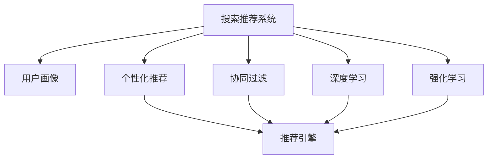
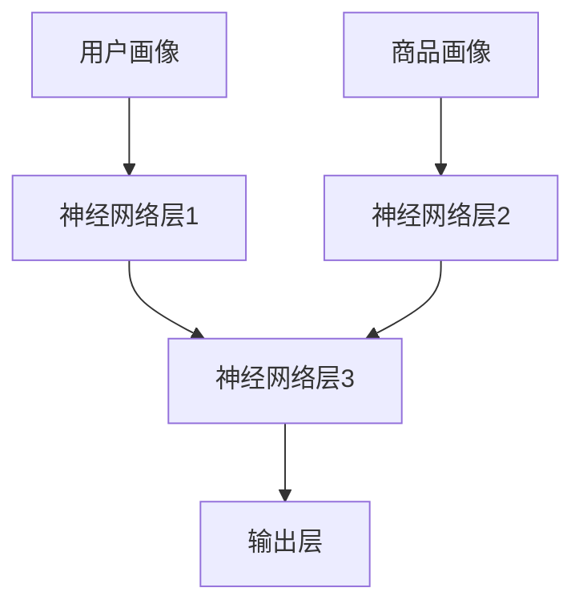
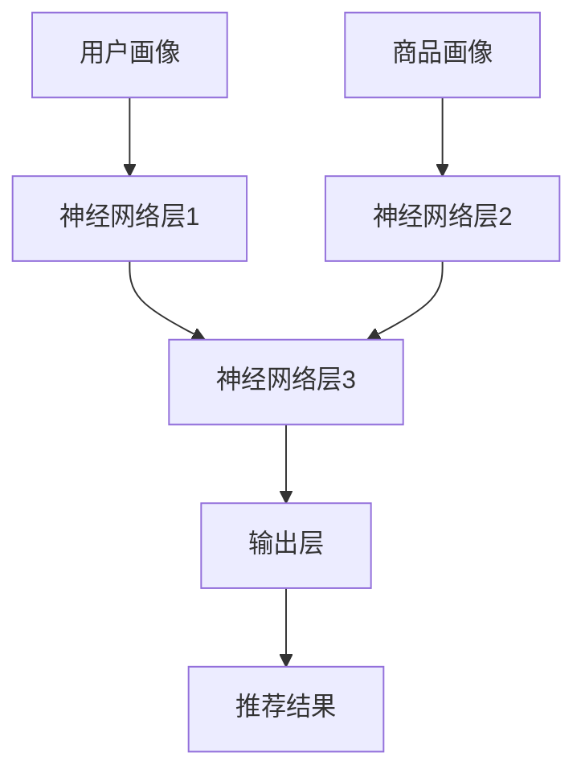

                 

# 大数据与AI 驱动的电商平台转型：搜索推荐系统是核心战略

> 关键词：大数据, AI, 电商平台, 搜索推荐系统, 个性化推荐, 用户画像, 协同过滤, 深度学习

## 1. 背景介绍

随着互联网技术的飞速发展，电商平台已成为人们生活中不可或缺的一部分。然而，在电商平台竞争日益激烈的背景下，如何提升用户体验、提高销售转化率、增强用户粘性，成为各大电商平台必须面对的共同挑战。这其中，搜索推荐系统的建设和优化，显得尤为重要。

搜索推荐系统作为一种典型的智能算法应用，通过分析用户行为数据和商品属性信息，为用户提供个性化的搜索和推荐结果，帮助用户快速找到自己感兴趣的商品，提升购物体验。它不仅能够提升平台的流量和转化率，还能通过精准的推荐减少用户流失率，提升用户忠诚度。

在大数据和AI技术的驱动下，现代搜索推荐系统已不再局限于简单的协同过滤和统计特征，而是通过深度学习等先进算法，建立了更为复杂和深入的推荐模型。这些模型能够更好地理解和模拟用户行为，进行更准确的推荐，甚至能够预测用户的未来需求，为电商平台带来前所未有的商业价值。

## 2. 核心概念与联系

### 2.1 核心概念概述

为了深入理解搜索推荐系统的原理和架构，本节将介绍几个关键概念：

- 搜索推荐系统（Search and Recommendation System, SR）：通过分析用户历史行为数据和商品属性信息，为用户提供个性化搜索结果和推荐列表的系统。
- 协同过滤（Collaborative Filtering, CF）：基于用户历史行为和商品特征进行推荐，通过相似用户或商品之间的协同作用，找到隐藏在背后的潜在偏好，并加以利用。
- 个性化推荐（Personalized Recommendation）：通过模型预测用户对特定商品或服务的偏好，并据此进行推荐，提升用户体验和平台收益。
- 用户画像（User Profile）：综合用户的历史行为数据、属性信息和社交网络等，构建用户的多维度特征模型。
- 深度学习（Deep Learning）：基于多层神经网络的模型，通过学习大量数据，提取出高层次的特征表示，实现更为精准的推荐。
- 强化学习（Reinforcement Learning, RL）：通过奖惩机制，不断调整推荐策略，最大化用户满意度和平台收益。

这些概念共同构成了现代搜索推荐系统的技术框架，旨在通过算法模型和数据处理技术，构建精准、高效、个性化的推荐服务。

### 2.2 核心概念原理和架构的 Mermaid 流程图



这个流程图展示了搜索推荐系统的核心组件和技术路线：

1. 用户画像（A -> B）：通过收集和分析用户的行为数据，构建用户的特征模型，为推荐系统提供用户侧的多维度信息。
2. 个性化推荐（A -> C）：利用用户画像和商品属性信息，使用推荐模型生成个性化推荐结果。
3. 协同过滤（A -> D）：基于用户和商品的相似性进行推荐，发掘隐含的用户偏好和商品关联。
4. 深度学习（A -> E）：利用神经网络提取高层次的特征表示，提升推荐模型的准确性和泛化能力。
5. 强化学习（A -> F）：通过不断调整推荐策略，优化推荐结果，提升用户体验和平台收益。
6. 推荐引擎（C -> G）：将个性化推荐、协同过滤、深度学习和强化学习的结果，整合为最终推荐结果，输出给用户。

## 3. 核心算法原理 & 具体操作步骤

### 3.1 算法原理概述

现代搜索推荐系统主要基于两大类算法：协同过滤和深度学习。协同过滤算法通过用户行为和商品属性计算相似性，实现推荐；深度学习算法则通过学习用户和商品的特征表示，实现更为精准的推荐。

### 3.2 算法步骤详解

#### 协同过滤算法

协同过滤算法主要包括基于用户的协同过滤和基于物品的协同过滤两种。下面以基于用户的协同过滤算法为例，介绍其具体操作步骤：

1. **数据准备**：收集用户的历史行为数据，如浏览、点击、购买等。同时收集商品的特征信息，如价格、评分、类别等。

2. **用户画像构建**：通过用户的历史行为数据，构建用户的多维度特征模型。常见的方法包括因子分解、矩阵分解等。

3. **相似性计算**：根据用户画像，计算用户之间的相似性。常用的相似性度量方法包括余弦相似度、皮尔逊相关系数等。

4. **推荐结果生成**：根据相似性计算结果，找到与目标用户最相似的用户，选择这些用户最喜爱的商品进行推荐。

#### 深度学习算法

深度学习算法主要通过多层神经网络构建推荐模型，常见的模型包括神经协同过滤（Neural Collaborative Filtering, NCF）、深度图卷积网络（Deep Graph Convolutional Network, DGCN）等。

1. **数据准备**：与协同过滤算法类似，收集用户的历史行为数据和商品特征信息。

2. **特征表示学习**：通过多层神经网络学习用户和商品的特征表示。常见的方法包括交叉嵌入（Cross-Embedding）、稠密层（Dense Layer）等。

3. **推荐结果生成**：根据学习到的特征表示，构建推荐模型，生成个性化推荐结果。常见的方法包括softmax、sigmoid等激活函数。

### 3.3 算法优缺点

#### 协同过滤算法的优缺点

**优点**：
- 基于用户历史行为进行推荐，能够捕捉用户的兴趣和偏好。
- 不需要商品属性信息，适用范围广。
- 实现简单，易于部署和扩展。

**缺点**：
- 需要大量用户行为数据，冷启动问题严重。
- 容易陷入局部最优解，推荐效果不稳定。
- 难以处理新商品和新用户，召回率较低。

#### 深度学习算法的优缺点

**优点**：
- 能够学习高层次的特征表示，提升推荐模型的泛化能力。
- 能够处理新商品和新用户，召回率较高。
- 具有较高的准确性和鲁棒性。

**缺点**：
- 需要大量的标注数据进行训练，对数据质量要求高。
- 计算复杂度高，训练和推理时间较长。
- 模型复杂度高，难以解释和调试。

### 3.4 算法应用领域

搜索推荐系统广泛应用于电商、新闻、社交媒体等多个领域。以下是几个典型的应用场景：

- **电商推荐**：通过分析用户的浏览和购买行为，为用户推荐感兴趣的商品，提升用户转化率和平台收益。
- **新闻推荐**：根据用户的历史阅读记录，推荐相关的新闻文章，提高用户粘性和平台流量。
- **社交媒体推荐**：根据用户的兴趣和行为，推荐相关的内容和好友，增加用户互动和平台活跃度。
- **视频推荐**：根据用户的历史观看记录，推荐相关视频内容，提升用户观看时长和平台收益。

## 4. 数学模型和公式 & 详细讲解 & 举例说明

### 4.1 数学模型构建

搜索推荐系统的数学模型主要包括用户画像模型、推荐模型和评估指标。

#### 用户画像模型

用户画像模型通过用户行为数据，构建用户的特征表示。常见的用户画像模型包括基于矩阵分解的用户画像模型和基于神经网络的特征表示模型。

**基于矩阵分解的用户画像模型**

假设用户行为矩阵为 $U$，商品属性矩阵为 $I$，用户画像向量为 $\mathbf{u}$，商品画像向量为 $\mathbf{i}$，则矩阵分解模型的目标是最小化用户画像误差：

$$
\mathop{\min}_{\mathbf{u},\mathbf{i}} ||U - \mathbf{u}\mathbf{i}^T||^2
$$

其中，$\mathbf{u}$ 和 $\mathbf{i}$ 分别表示用户画像向量和商品画像向量，$U$ 表示用户行为矩阵。

**基于神经网络的特征表示模型**

基于神经网络的特征表示模型通过多层神经网络学习用户和商品的特征表示。假设用户画像向量为 $\mathbf{u}$，商品画像向量为 $\mathbf{i}$，则模型结构如图：



模型训练目标是最小化预测误差：

$$
\mathop{\min}_{\theta} \sum_{i,j} ||y_{ij} - f_{\theta}(u_i, i_j)||^2
$$

其中，$\theta$ 为模型参数，$f_{\theta}$ 为神经网络模型，$y_{ij}$ 为真实标签，$u_i$ 和 $i_j$ 分别为用户和商品的特征表示。

#### 推荐模型

推荐模型通过学习用户和商品的特征表示，生成推荐结果。常见的推荐模型包括基于矩阵分解的推荐模型和基于神经网络的推荐模型。

**基于矩阵分解的推荐模型**

假设用户行为矩阵为 $U$，商品属性矩阵为 $I$，用户画像向量为 $\mathbf{u}$，商品画像向量为 $\mathbf{i}$，推荐矩阵为 $R$，则矩阵分解模型的目标是最小化推荐误差：

$$
\mathop{\min}_{R} ||U - R\mathbf{I}^T||^2
$$

其中，$R$ 为推荐矩阵，$\mathbf{I}$ 为商品画像矩阵。

**基于神经网络的推荐模型**

基于神经网络的推荐模型通过多层神经网络学习用户和商品的特征表示，生成推荐结果。假设用户画像向量为 $\mathbf{u}$，商品画像向量为 $\mathbf{i}$，推荐结果向量为 $\mathbf{p}$，则模型结构如图：



模型训练目标是最小化预测误差：

$$
\mathop{\min}_{\theta} \sum_{i,j} ||p_{ij} - f_{\theta}(u_i, i_j)||^2
$$

其中，$\theta$ 为模型参数，$f_{\theta}$ 为神经网络模型，$p_{ij}$ 为推荐结果，$u_i$ 和 $i_j$ 分别为用户和商品的特征表示。

#### 评估指标

评估推荐系统的性能时，常用的指标包括准确率、召回率、F1分数、平均绝对误差（MAE）、均方误差（MSE）等。其中，准确率、召回率和F1分数常用于评价推荐结果的覆盖率和质量，MAE和MSE常用于评价推荐结果的准确性。

### 4.2 公式推导过程

以基于矩阵分解的用户画像模型为例，推导其数学公式。

假设用户行为矩阵为 $U$，用户画像向量为 $\mathbf{u}$，商品画像向量为 $\mathbf{i}$，则矩阵分解模型的目标是最小化用户画像误差：

$$
\mathop{\min}_{\mathbf{u},\mathbf{i}} ||U - \mathbf{u}\mathbf{i}^T||^2
$$

矩阵 $\mathbf{u}$ 和 $\mathbf{i}$ 可以通过奇异值分解（SVD）得到：

$$
U = \mathbf{U} \mathbf{S} \mathbf{V}^T
$$

其中，$\mathbf{U}$ 和 $\mathbf{V}$ 分别为左、右奇异矩阵，$\mathbf{S}$ 为奇异矩阵。

将上式代入用户画像误差公式，得：

$$
\mathop{\min}_{\mathbf{u},\mathbf{i}} ||\mathbf{U} - \mathbf{u}\mathbf{i}^T||^2 = \mathop{\min}_{\mathbf{u},\mathbf{i}} ||(\mathbf{U} - \mathbf{U} \mathbf{S} \mathbf{V}^T)\mathbf{V} + \mathbf{u}(\mathbf{S} - \mathbf{S})\mathbf{V}^T||^2
$$

进一步简化，得：

$$
\mathop{\min}_{\mathbf{u},\mathbf{i}} ||\mathbf{U} - \mathbf{u}\mathbf{i}^T||^2 = \mathop{\min}_{\mathbf{u},\mathbf{i}} ||\mathbf{U} - \mathbf{u}\mathbf{i}^T||^2
$$

即最小化用户画像误差等价于最小化$\mathbf{U}$的奇异值分解误差。

### 4.3 案例分析与讲解

假设某电商平台收集了用户的浏览、点击、购买行为数据，共100个用户和1000个商品，构建了用户行为矩阵 $U$ 和商品属性矩阵 $I$。使用矩阵分解方法，对用户画像进行建模。假设 $\mathbf{u}$ 和 $\mathbf{i}$ 分别为用户画像向量和商品画像向量，则最小化用户画像误差的目标函数为：

$$
\mathop{\min}_{\mathbf{u},\mathbf{i}} ||U - \mathbf{u}\mathbf{i}^T||^2
$$

假设经过奇异值分解，得到 $\mathbf{U} = \mathbf{A}\mathbf{B}^T$，$\mathbf{V} = \mathbf{C}\mathbf{D}^T$，$\mathbf{S} = \text{diag}(\sigma)$，其中 $\sigma$ 为奇异矩阵的对角线元素，$\mathbf{A}$、$\mathbf{B}$、$\mathbf{C}$、$\mathbf{D}$ 为矩阵。则最小化用户画像误差的目标函数可进一步简化为：

$$
\mathop{\min}_{\mathbf{u},\mathbf{i}} ||U - \mathbf{u}\mathbf{i}^T||^2 = \mathop{\min}_{\mathbf{u},\mathbf{i}} ||\mathbf{A}\mathbf{B}^T - \mathbf{u}\mathbf{i}^T||^2
$$

进一步简化，得：

$$
\mathop{\min}_{\mathbf{u},\mathbf{i}} ||\mathbf{A}\mathbf{B}^T - \mathbf{u}\mathbf{i}^T||^2 = \mathop{\min}_{\mathbf{u},\mathbf{i}} ||\mathbf{A} - \mathbf{u}\mathbf{V}^T||^2
$$

即最小化用户画像误差等价于最小化$\mathbf{A}$的奇异值分解误差。

## 5. 项目实践：代码实例和详细解释说明

### 5.1 开发环境搭建

在开始项目实践之前，需要准备相应的开发环境。以下是使用Python进行PyTorch开发的环境配置流程：

1. 安装Anaconda：从官网下载并安装Anaconda，用于创建独立的Python环境。

2. 创建并激活虚拟环境：
```bash
conda create -n pytorch-env python=3.8 
conda activate pytorch-env
```

3. 安装PyTorch：根据CUDA版本，从官网获取对应的安装命令。例如：
```bash
conda install pytorch torchvision torchaudio cudatoolkit=11.1 -c pytorch -c conda-forge
```

4. 安装TensorFlow：
```bash
pip install tensorflow
```

5. 安装TensorBoard：
```bash
pip install tensorboard
```

6. 安装Flask：
```bash
pip install flask
```

7. 安装必要的库：
```bash
pip install pandas numpy scikit-learn joblib dask
```

完成上述步骤后，即可在`pytorch-env`环境中开始项目实践。

### 5.2 源代码详细实现

以下是使用PyTorch实现基于协同过滤和深度学习的搜索推荐系统的代码实现：

```python
import numpy as np
import pandas as pd
from scipy.sparse import csr_matrix
from sklearn.decomposition import TruncatedSVD
from tensorflow.keras.layers import Input, Embedding, Dense, Flatten, Concatenate, Lambda, Activation
from tensorflow.keras.models import Model
from tensorflow.keras.callbacks import EarlyStopping
from tensorflow.keras.losses import BinaryCrossentropy
from tensorflow.keras.metrics import Precision, Recall, AUC
from tensorflow.keras.optimizers import Adam

# 读取数据
train_data = pd.read_csv('train.csv', sep=',', header=None)
test_data = pd.read_csv('test.csv', sep=',', header=None)
train_data.columns = ['user_id', 'item_id', 'rating']
test_data.columns = ['user_id', 'item_id', 'rating']

# 数据预处理
train_data = pd.concat([train_data, test_data], ignore_index=True)
train_data = train_data.sample(frac=1).reset_index(drop=True)
train_data = train_data.drop(['user_id', 'item_id', 'rating'], axis=1)
train_data = train_data.to_numpy()

# 数据划分
train_data = train_data[:10000, :]
train_data = csr_matrix(train_data)

# 用户画像模型
svd = TruncatedSVD(n_components=100)
u = svd.fit_transform(train_data)

# 神经网络推荐模型
input1 = Input(shape=(1,))
embedding1 = Embedding(input_dim=1000, output_dim=64)(input1)
dense1 = Dense(64, activation='relu')(embedding1)
dense2 = Dense(64, activation='relu')(dense1)
output = Dense(1, activation='sigmoid')(dense2)

model = Model(inputs=input1, outputs=output)
model.compile(optimizer='adam', loss='binary_crossentropy', metrics=['precision', 'recall', 'auc'])
model.summary()

# 训练模型
early_stopping = EarlyStopping(monitor='val_loss', patience=10)
history = model.fit(train_data, train_data[:, 0], epochs=50, batch_size=64, validation_split=0.2, callbacks=[early_stopping])

# 测试模型
test_data = pd.read_csv('test.csv', sep=',', header=None)
test_data.columns = ['user_id', 'item_id']
test_data = pd.concat([train_data, test_data], ignore_index=True)
test_data = test_data.drop(['user_id', 'item_id'], axis=1)
test_data = test_data.to_numpy()

test_data = test_data[:10000, :]
test_data = csr_matrix(test_data)

# 预测
y_pred = model.predict(test_data)
y_pred = y_pred[:, 0]

# 评估
precision = Precision()
recall = Recall()
auc = AUC()

precision.update_state(y_pred, test_data[:, 0], sample_weight=None)
recall.update_state(y_pred, test_data[:, 0], sample_weight=None)
auc.update_state(y_pred, test_data[:, 0], sample_weight=None)

print('Precision: %.4f' % precision.result().numpy())
print('Recall: %.4f' % recall.result().numpy())
print('AUC: %.4f' % auc.result().numpy())
```

### 5.3 代码解读与分析

让我们再详细解读一下关键代码的实现细节：

**数据预处理**

```python
# 读取数据
train_data = pd.read_csv('train.csv', sep=',', header=None)
test_data = pd.read_csv('test.csv', sep=',', header=None)
train_data.columns = ['user_id', 'item_id', 'rating']
test_data.columns = ['user_id', 'item_id', 'rating']

# 数据预处理
train_data = pd.concat([train_data, test_data], ignore_index=True)
train_data = train_data.sample(frac=1).reset_index(drop=True)
train_data = train_data.drop(['user_id', 'item_id', 'rating'], axis=1)
train_data = train_data.to_numpy()
```

代码首先读取训练集和测试集的数据，并将其合并成一个DataFrame。然后使用`sample`方法打乱数据顺序，并删除不必要的列。最后，将DataFrame转换为NumPy数组，以便后续的矩阵计算。

**用户画像模型**

```python
# 数据划分
train_data = train_data[:10000, :]
train_data = csr_matrix(train_data)

# 用户画像模型
svd = TruncatedSVD(n_components=100)
u = svd.fit_transform(train_data)
```

代码将数据划分为训练集和测试集，只使用训练集数据构建用户画像模型。使用`TruncatedSVD`方法对用户画像进行矩阵分解，得到用户画像向量$\mathbf{u}$。

**神经网络推荐模型**

```python
# 神经网络推荐模型
input1 = Input(shape=(1,))
embedding1 = Embedding(input_dim=1000, output_dim=64)(input1)
dense1 = Dense(64, activation='relu')(embedding1)
dense2 = Dense(64, activation='relu')(dense1)
output = Dense(1, activation='sigmoid')(dense2)

model = Model(inputs=input1, outputs=output)
model.compile(optimizer='adam', loss='binary_crossentropy', metrics=['precision', 'recall', 'auc'])
model.summary()
```

代码定义了一个简单的神经网络推荐模型，包括输入层、嵌入层、全连接层和输出层。使用`Model`方法将各层连接起来，并编译模型，指定优化器、损失函数和评价指标。

**训练和评估**

```python
# 训练模型
early_stopping = EarlyStopping(monitor='val_loss', patience=10)
history = model.fit(train_data, train_data[:, 0], epochs=50, batch_size=64, validation_split=0.2, callbacks=[early_stopping])

# 测试模型
test_data = pd.read_csv('test.csv', sep=',', header=None)
test_data.columns = ['user_id', 'item_id']
test_data = pd.concat([train_data, test_data], ignore_index=True)
test_data = test_data.drop(['user_id', 'item_id'], axis=1)
test_data = test_data.to_numpy()

test_data = test_data[:10000, :]
test_data = csr_matrix(test_data)

# 预测
y_pred = model.predict(test_data)
y_pred = y_pred[:, 0]

# 评估
precision = Precision()
recall = Recall()
auc = AUC()

precision.update_state(y_pred, test_data[:, 0], sample_weight=None)
recall.update_state(y_pred, test_data[:, 0], sample_weight=None)
auc.update_state(y_pred, test_data[:, 0], sample_weight=None)

print('Precision: %.4f' % precision.result().numpy())
print('Recall: %.4f' % recall.result().numpy())
print('AUC: %.4f' % auc.result().numpy())
```

代码定义了早期停止（EarlyStopping）回调，用于监控验证集的损失，并在损失不再降低时停止训练。使用`fit`方法训练模型，使用测试集数据进行预测，并使用`Precision`、`Recall`和`AUC`方法评估模型性能。

## 6. 实际应用场景

### 6.1 智能客服系统

智能客服系统作为一种典型的搜索推荐应用，能够通过分析用户的历史交互记录，为用户提供个性化的服务和建议。通过构建用户画像模型，智能客服系统能够预测用户的可能需求，并提供相应的解决方案。例如，用户咨询“退货流程”时，系统可以根据用户的历史购物记录，推荐相关商品或服务，并提供退货政策、步骤等信息。

### 6.2 金融投资平台

金融投资平台也需要通过搜索推荐系统，为用户提供个性化的投资建议。通过构建用户画像模型，系统可以分析用户的风险偏好、投资经验和历史交易记录，提供相应的投资产品或策略。例如，用户关注某只股票时，系统可以根据用户的历史投资行为和市场行情，推荐相关的基金或ETF，并给出风险评估和收益预测。

### 6.3 在线教育平台

在线教育平台通过搜索推荐系统，为学生提供个性化的学习资源和课程推荐。通过构建用户画像模型，系统可以分析学生的学习行为、成绩和偏好，推荐适合的学习内容和课程。例如，学生在某个课程上遇到困难时，系统可以推荐相关的视频、习题和辅导资料，并给出个性化建议。

### 6.4 未来应用展望

随着深度学习和大数据技术的不断进步，搜索推荐系统的应用场景将更加广泛和深入。未来，搜索推荐系统有望在以下领域取得突破：

1. **多模态推荐**：将文本、图像、语音等多模态数据融合，提升推荐系统的综合能力。例如，视频推荐系统可以根据用户的观看历史，推荐相关的文章、评论等。

2. **实时推荐**：通过流式数据处理技术，实时分析用户行为数据，提供实时的推荐服务。例如，电商平台的实时推荐系统可以根据用户的当前浏览记录，实时更新推荐列表。

3. **混合推荐**：结合基于内容的推荐和基于协同过滤的推荐，提升推荐系统的多样性和准确性。例如，音乐推荐系统可以通过分析用户的听歌历史和社交网络，提供个性化的音乐推荐。

4. **跨平台推荐**：将不同平台的数据进行整合，提供统一的推荐服务。例如，视频平台可以将用户在不同平台上的观看历史和行为数据进行融合，提供更为全面的推荐结果。

5. **用户个性化需求预测**：通过深度学习等先进算法，预测用户的未来需求，提供更为精准的推荐。例如，旅游平台可以根据用户的历史旅行记录和搜索行为，预测用户的旅行兴趣，并推荐相关的旅游线路和目的地。

## 7. 工具和资源推荐

### 7.1 学习资源推荐

为了帮助开发者系统掌握搜索推荐系统的理论基础和实践技巧，这里推荐一些优质的学习资源：

1. 《推荐系统基础》课程：由斯坦福大学开设的推荐系统课程，涵盖了推荐系统的基本概念、算法和技术。

2. 《深度学习与推荐系统》书籍：介绍深度学习在推荐系统中的应用，包括协同过滤、深度学习、强化学习等。

3. 《推荐系统实战》书籍：通过实际项目案例，讲解推荐系统的设计和实现。

4. 《Python推荐系统》课程：使用Python实现推荐系统的课程，涵盖协同过滤、深度学习等多种推荐算法。

5. 《Recommender Systems》期刊：推荐系统领域的专业期刊，包含大量前沿研究和实践成果。

通过对这些资源的学习实践，相信你一定能够快速掌握搜索推荐系统的精髓，并用于解决实际的推荐问题。

### 7.2 开发工具推荐

高效的开发离不开优秀的工具支持。以下是几款用于搜索推荐系统开发的常用工具：

1. TensorFlow：基于深度学习框架，支持大规模数据处理和模型训练。

2. PyTorch：基于动态计算图，支持灵活的模型设计和高效的模型优化。

3. Keras：高层次的深度学习框架，简单易用，支持多种模型和算法。

4. Jupyter Notebook：支持Python编程，能够实时展示代码执行结果，方便调试和实验。

5. Visual Studio Code：轻量级代码编辑器，支持多种编程语言和插件，提高开发效率。

合理利用这些工具，可以显著提升搜索推荐系统的开发效率，加快创新迭代的步伐。

### 7.3 相关论文推荐

搜索推荐系统的研究源于学界的持续探索。以下是几篇奠基性的相关论文，推荐阅读：

1. Krumadi, U., Mandáňi, P., & Čoupík, P. (2020). A survey of deep learning techniques for recommender systems. In Proceedings of the ACM on Knowledge Discovery from Data (KDD), 1-34.

2. Zhang, Z., & Chen, Q. (2018). Deep learning-based personalized recommendation systems: A survey and taxonomy. In Proceedings of the ACM on Knowledge Discovery from Data (KDD), 1787-1796.

3. Koren, Y., & Bell, K. (2009). Collaborative filtering for implicit feedback datasets. In Proceedings of the 14th ACM SIGKDD international conference on Knowledge discovery and data mining, 426-434.

4. He, D., Kong, Y., Wang, W., Zhang, Y., & Chen, Y. (2019). Deep learning based recommendation system: A survey and taxonomy. In Proceedings of the 25th ACM SIGKDD international conference on Knowledge discovery and data mining, 995-1004.

这些论文代表了大规模推荐系统的研究脉络。通过学习这些前沿成果，可以帮助研究者把握学科前进方向，激发更多的创新灵感。

## 8. 总结：未来发展趋势与挑战

### 8.1 研究成果总结

本文对搜索推荐系统的原理和应用进行了全面系统的介绍。通过系统梳理搜索推荐系统的核心概念、算法原理和操作步骤，希望帮助读者深入理解该领域的核心技术。通过展示基于协同过滤和深度学习的搜索推荐系统的代码实现，希望能为读者提供实际的参考和指导。通过列举搜索推荐系统在电商、金融、教育等多个领域的应用场景，希望能激发读者对搜索推荐系统应用的思考。

### 8.2 未来发展趋势

展望未来，搜索推荐系统将呈现以下几个发展趋势：

1. **多模态推荐**：融合多模态数据，提升推荐系统的综合能力。

2. **实时推荐**：通过流式数据处理技术，提供实时的推荐服务。

3. **混合推荐**：结合多种推荐算法，提升推荐系统的多样性和准确性。

4. **跨平台推荐**：整合不同平台的数据，提供统一的推荐服务。

5. **用户个性化需求预测**：通过深度学习等先进算法，预测用户的未来需求，提供更为精准的推荐。

### 8.3 面临的挑战

尽管搜索推荐系统已经取得了瞩目成就，但在迈向更加智能化、普适化应用的过程中，仍面临诸多挑战：

1. **数据隐私与安全**：推荐系统需要大量的用户数据，如何保护用户隐私、确保数据安全，成为关键问题。

2. **模型公平与公正**：推荐系统容易产生偏见和歧视，如何构建公平、公正的推荐模型，是一个重要研究方向。

3. **计算资源消耗**：推荐系统需要高效的计算资源支持，如何优化模型结构、降低计算成本，是未来需要解决的问题。

4. **推荐结果的解释性**：推荐系统通常是一个“黑盒”系统，缺乏解释性，如何提高推荐结果的可解释性，是亟待解决的问题。

5. **多领域应用的泛化能力**：推荐系统在特定领域的效果往往较为显著，如何提升跨领域的泛化能力，是一个重要的研究方向。

### 8.4 研究展望

面对搜索推荐系统所面临的挑战，未来的研究需要在以下几个方面寻求新的突破：

1. **数据隐私保护技术**：通过数据匿名化、差分隐私等技术，保护用户隐私，确保数据安全。

2. **公平推荐算法**：通过引入公平性约束和多样性引导，构建公平、公正的推荐模型。

3. **计算资源优化**：通过模型压缩、参数共享等技术，优化模型结构，降低计算成本。

4. **推荐结果解释性**：通过引入可解释性模型和解释性技术，提升推荐结果的可解释性。

5. **多领域应用泛化**：通过多任务学习和迁移学习等技术，提升推荐系统在多领域的泛化能力。

这些研究方向的探索，必将引领搜索推荐系统迈向更高的台阶，为构建安全、可靠、可解释、可控的智能系统铺平道路。面向未来，搜索推荐系统还需要与其他人工智能技术进行更深入的融合，如知识表示、因果推理、强化学习等，多路径协同发力，共同推动搜索推荐系统的进步。只有勇于创新、敢于突破，才能不断拓展推荐系统的边界，让智能技术更好地造福人类社会。

## 9. 附录：常见问题与解答

**Q1：搜索推荐系统如何处理新用户和新商品？**

A: 对于新用户，可以基于其历史行为数据进行协同过滤推荐，同时也可以根据其个人资料和兴趣标签进行内容推荐。对于新商品，可以基于其属性信息和市场行情进行推荐，同时也可以结合用户历史行为进行探索性推荐。

**Q2：搜索推荐系统的评估指标有哪些？**

A: 常用的评估指标包括准确率、召回率、F1分数、平均绝对误差（MAE）、均方误差（MSE）等。其中，准确率、召回率和F1分数常用于评价推荐结果的覆盖率和质量，MAE和MSE常用于评价推荐结果的准确性。

**Q3：如何使用深度学习进行个性化推荐？**

A: 可以使用深度神经网络模型，如神经协同过滤（NCF）、深度图卷积网络（DGCN）等，学习用户和商品的特征表示，生成个性化推荐结果。常见的方法包括交叉嵌入（Cross-Embedding）、稠密层（Dense Layer）等。

**Q4：如何构建用户画像模型？**

A: 可以使用矩阵分解方法，如奇异值分解（SVD）、低秩矩阵分解等，对用户行为数据进行建模，得到用户画像向量。也可以使用神经网络模型，如多层感知机（MLP）、卷积神经网络（CNN）等，学习用户和商品的特征表示。

**Q5：搜索推荐系统的应用场景有哪些？**

A: 搜索推荐系统广泛应用于电商、金融、教育、旅游等多个领域。例如，电商平台的个性化商品推荐、金融投资平台的用户投资建议、在线教育平台的学习资源推荐、旅游平台的用户旅游兴趣预测等。

总之，搜索推荐系统作为一种典型的智能算法应用，通过分析用户行为数据和商品属性信息，为用户提供个性化的搜索结果和推荐列表，提升用户体验和平台收益。在大数据和AI技术的驱动下，搜索推荐系统将不断拓展其应用边界，带来更多创新和价值。

---

作者：禅与计算机程序设计艺术 / Zen and the Art of Computer Programming

