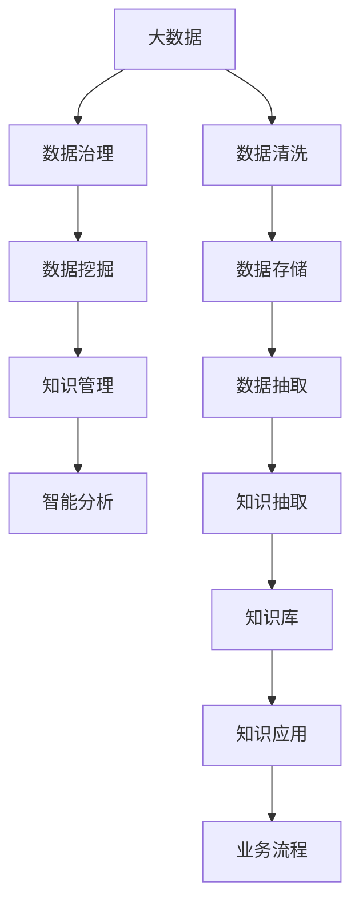

                 

# 大数据时代的知识管理革命

## 1. 背景介绍

### 1.1 问题由来

随着互联网和移动互联网的快速发展，数据已经成为当今社会最为宝贵的资源之一。据统计，全球数据量已经从2015年的1.5ZB增长到2025年的175ZB。如此海量的数据，对于各行各业来说既是机遇也是挑战。如何有效管理和利用这些数据，成为了一个亟需解决的问题。

知识管理(Knowledge Management, KMS)作为企业信息化建设的重要组成部分，旨在提高企业的知识转化效率，减少信息孤岛，增强企业决策能力。在传统的数据管理模式下，知识分散在企业内部各个部门，难以共享和利用，无法形成合力。

在这样的背景下，大数据时代的知识管理革命应运而生。通过引入先进的数据管理和分析技术，企业可以更高效地收集、存储、处理和利用知识，从而提升企业的竞争力和创新能力。

### 1.2 问题核心关键点

大数据时代的知识管理革命，核心在于将传统的数据管理模式升级为知识驱动的管理模式。具体关键点包括：

1. **数据集成与共享**：构建统一的数据平台，实现企业内部和外部数据的集成和共享。
2. **数据治理与清洗**：对数据进行高质量的治理和清洗，确保数据的准确性和一致性。
3. **数据挖掘与分析**：利用机器学习、数据挖掘等技术，从数据中提取有价值的信息，进行智能分析和决策。
4. **知识抽取与存储**：从结构化与非结构化数据中抽取知识，建立知识库，便于检索和应用。
5. **知识应用与反馈**：将知识应用于业务流程中，提高决策效率，同时收集反馈，不断优化知识库。

## 2. 核心概念与联系

### 2.1 核心概念概述

在大数据时代，知识管理的核心概念可以概括为：

1. **大数据**：指通过各种手段收集的海量数据，包括结构化数据、半结构化数据和非结构化数据。
2. **数据治理**：指对数据进行标准化、分类、质量控制等管理活动，确保数据的高质量和可用性。
3. **数据挖掘**：指利用统计学、机器学习等技术从数据中发现规律和模式，提取有用信息。
4. **知识管理**：指对企业内部和外部的知识进行系统化的收集、存储、共享和应用，提高企业决策效率和创新能力。
5. **智能分析**：指应用人工智能技术对数据进行深度分析，提供决策支持。

这些核心概念之间的联系可以描述为：大数据是知识管理的原料，数据治理和数据挖掘是知识提取的基础，而智能分析则是知识应用和决策支持的关键。

### 2.2 核心概念原理和架构的 Mermaid 流程图



## 3. 核心算法原理 & 具体操作步骤

### 3.1 算法原理概述

在大数据时代的知识管理中，核心算法主要包括数据治理、数据挖掘和智能分析。下面我们将逐一介绍这些算法的原理和操作步骤。

#### 3.1.1 数据治理

数据治理是对数据进行标准化、分类、质量控制等管理活动，确保数据的高质量和可用性。数据治理的算法原理主要包括以下几个步骤：

1. **数据分类**：根据数据的来源、格式和内容，对数据进行分类。
2. **数据标准化**：将不同来源和格式的数据转换为统一的格式，提高数据的一致性和可比较性。
3. **数据清洗**：对数据进行去重、修正和补全，消除噪声和错误，提高数据的准确性和完整性。

#### 3.1.2 数据挖掘

数据挖掘是从数据中发现规律和模式，提取有用信息的过程。数据挖掘的算法原理主要包括以下几个步骤：

1. **特征选择**：从数据中提取有用的特征，消除无用和冗余特征。
2. **模型选择**：根据业务需求和数据特点，选择合适的数据挖掘模型。
3. **模型训练**：利用历史数据对模型进行训练，得到最优模型。
4. **模型评估**：对模型进行评估和验证，确保其准确性和泛化能力。

#### 3.1.3 智能分析

智能分析是利用人工智能技术对数据进行深度分析，提供决策支持的过程。智能分析的算法原理主要包括以下几个步骤：

1. **数据预处理**：对数据进行清洗、归一化和转换，提高数据质量。
2. **特征提取**：从数据中提取有用的特征，提高模型的泛化能力。
3. **模型训练**：利用历史数据对模型进行训练，得到最优模型。
4. **预测和推理**：利用训练好的模型进行预测和推理，提供决策支持。

### 3.2 算法步骤详解

#### 3.2.1 数据治理步骤详解

1. **数据分类**：
   - 将数据分为结构化数据、半结构化数据和非结构化数据。
   - 根据数据类型和业务需求，将数据进一步分类，如日志数据、事务数据、文档数据等。

2. **数据标准化**：
   - 对不同来源和格式的数据进行转换和统一，确保数据的一致性和可比较性。
   - 例如，将日期格式统一为ISO8601，将货币格式统一为小数点后两位等。

3. **数据清洗**：
   - 去重：消除重复数据，提高数据效率。
   - 修正：对错误和异常数据进行修正，确保数据准确性。
   - 补全：对缺失数据进行补全，提高数据完整性。

#### 3.2.2 数据挖掘步骤详解

1. **特征选择**：
   - 利用统计学、机器学习等技术，从数据中提取有用的特征。
   - 例如，利用主成分分析(PCA)降维，去除无用特征。

2. **模型选择**：
   - 根据业务需求和数据特点，选择合适的数据挖掘模型。
   - 例如，对于分类任务，可以选择决策树、逻辑回归、支持向量机等模型。

3. **模型训练**：
   - 利用历史数据对模型进行训练，得到最优模型。
   - 例如，利用随机梯度下降(SGD)算法对决策树进行训练，得到最优的决策树模型。

4. **模型评估**：
   - 对模型进行评估和验证，确保其准确性和泛化能力。
   - 例如，利用交叉验证和测试集对模型进行评估，计算准确率、召回率和F1值等指标。

#### 3.2.3 智能分析步骤详解

1. **数据预处理**：
   - 对数据进行清洗、归一化和转换，提高数据质量。
   - 例如，对文本数据进行分词和去停用词，对时间数据进行归一化。

2. **特征提取**：
   - 从数据中提取有用的特征，提高模型的泛化能力。
   - 例如，利用词袋模型、TF-IDF等技术提取文本特征。

3. **模型训练**：
   - 利用历史数据对模型进行训练，得到最优模型。
   - 例如，利用深度学习模型(如CNN、RNN、Transformer等)对文本进行训练，得到最优的模型。

4. **预测和推理**：
   - 利用训练好的模型进行预测和推理，提供决策支持。
   - 例如，利用训练好的模型对新数据进行预测，提供业务建议。

### 3.3 算法优缺点

#### 3.3.1 数据治理算法优缺点

**优点**：
1. 确保数据高质量和一致性，提高数据可用性。
2. 消除噪声和错误，提高数据分析的准确性。
3. 支持数据标准化和分类，方便后续的数据挖掘和分析。

**缺点**：
1. 数据治理过程繁琐复杂，需要大量的时间和资源。
2. 对数据质量控制不严格可能导致数据损失和误导。

#### 3.3.2 数据挖掘算法优缺点

**优点**：
1. 能够发现数据中的规律和模式，提取有用信息。
2. 利用统计学、机器学习等技术，提高数据分析的准确性。
3. 支持多类型数据的挖掘，具有较强的适应性。

**缺点**：
1. 数据挖掘算法复杂，需要较高级的数学和统计学知识。
2. 模型选择和训练过程复杂，需要大量的数据和计算资源。
3. 模型过度拟合可能导致泛化能力差。

#### 3.3.3 智能分析算法优缺点

**优点**：
1. 利用人工智能技术，提供深度数据分析和决策支持。
2. 支持多类型数据的智能分析，具有较强的适应性。
3. 能够处理大规模数据，提高数据分析效率。

**缺点**：
1. 智能分析算法复杂，需要较高级的数学和统计学知识。
2. 模型训练过程复杂，需要大量的数据和计算资源。
3. 模型过度拟合可能导致泛化能力差。

### 3.4 算法应用领域

大数据时代的知识管理算法广泛应用于各个行业，具体包括：

1. **金融行业**：利用数据治理和数据挖掘技术，对客户数据和交易数据进行分析和预测，提供风险评估和投资建议。
2. **医疗行业**：利用智能分析技术，对医疗数据进行深度挖掘和分析，提供精准诊断和治疗方案。
3. **零售行业**：利用数据治理和数据挖掘技术，对客户行为和市场趋势进行分析，提供个性化推荐和市场营销策略。
4. **制造业**：利用智能分析技术，对生产数据和设备运行数据进行分析和预测，提高生产效率和设备维护。
5. **政府行业**：利用数据治理和数据挖掘技术，对公共数据和社会数据进行分析和评估，提供决策支持。

## 4. 数学模型和公式 & 详细讲解 & 举例说明

### 4.1 数学模型构建

在大数据时代的知识管理中，数学模型主要包括以下几个部分：

1. **数据分类模型**：用于对数据进行分类和标准化。
2. **特征选择模型**：用于从数据中提取有用的特征。
3. **模型训练模型**：用于对数据挖掘和智能分析模型进行训练。

### 4.2 公式推导过程

#### 4.2.1 数据分类模型公式推导

假设有一组数据集 $D=\{(x_1,y_1),(x_2,y_2),...(x_n,y_n)\}$，其中 $x_i$ 为数据特征，$y_i$ 为数据标签。根据数据类型和业务需求，将数据分为 $k$ 类，每类数据特征均值为 $\mu_k$，方差为 $\sigma_k^2$。数据分类模型的公式推导如下：

$$
\min_{\theta} \frac{1}{N}\sum_{i=1}^N l(x_i,y_i;\theta)
$$

其中 $l(x_i,y_i;\theta)$ 为损失函数，$\theta$ 为分类模型的参数。根据数据类型和业务需求，可以选择不同的损失函数，如交叉熵损失、均方误差损失等。

#### 4.2.2 特征选择模型公式推导

假设有一组数据集 $D=\{(x_1,y_1),(x_2,y_2),...(x_n,y_n)\}$，其中 $x_i$ 为数据特征，$y_i$ 为数据标签。特征选择模型的目标是从数据中提取有用的特征，可以选择主成分分析(PCA)算法，其公式推导如下：

$$
\min_{W} \text{tr}(S_W)=\min_{W} \text{tr}(W^T S W)
$$

其中 $S$ 为协方差矩阵，$W$ 为特征选择矩阵。通过求解上述优化问题，可以得到最优的特征选择矩阵 $W$，从而得到新的数据特征 $x_i'=x_iW$。

#### 4.2.3 模型训练模型公式推导

假设有一组数据集 $D=\{(x_1,y_1),(x_2,y_2),...(x_n,y_n)\}$，其中 $x_i$ 为数据特征，$y_i$ 为数据标签。模型训练模型的目标是根据历史数据 $D$ 训练一个最优模型 $M$，可以选择神经网络、支持向量机(SVM)等模型，其公式推导如下：

$$
\min_{\theta} \frac{1}{N}\sum_{i=1}^N l(x_i,y_i;\theta)
$$

其中 $l(x_i,y_i;\theta)$ 为损失函数，$\theta$ 为模型参数。根据业务需求和数据特点，可以选择不同的损失函数，如交叉熵损失、均方误差损失等。

### 4.3 案例分析与讲解

#### 4.3.1 数据治理案例分析

某电商公司需要分析客户购买数据，以优化销售策略。客户数据包含结构化数据（如订单号、购买时间等）、半结构化数据（如订单详情、评价评论等）和非结构化数据（如图片、视频等）。

1. **数据分类**：将客户数据分为结构化数据、半结构化数据和非结构化数据。
2. **数据标准化**：对不同来源和格式的数据进行统一，确保数据的一致性和可比较性。
3. **数据清洗**：对数据进行去重、修正和补全，消除噪声和错误，提高数据的准确性和完整性。

#### 4.3.2 数据挖掘案例分析

某金融公司需要分析客户信用数据，以预测客户违约风险。信用数据包含结构化数据（如收入、年龄、婚姻状况等）和半结构化数据（如贷款记录、交易记录等）。

1. **特征选择**：从数据中提取有用的特征，如收入、年龄、婚姻状况、贷款记录等。
2. **模型选择**：选择支持向量机(SVM)模型进行分类。
3. **模型训练**：利用历史数据对SVM模型进行训练，得到最优模型。
4. **模型评估**：对模型进行评估和验证，确保其准确性和泛化能力。

#### 4.3.3 智能分析案例分析

某医院需要分析病人的住院数据，以提高诊疗效果。住院数据包含结构化数据（如病历、诊断报告等）和非结构化数据（如医生笔记、病人反馈等）。

1. **数据预处理**：对数据进行清洗、归一化和转换，提高数据质量。
2. **特征提取**：从数据中提取有用的特征，如病情、诊断、药物等。
3. **模型训练**：利用深度学习模型(如RNN、Transformer等)对文本进行训练，得到最优的模型。
4. **预测和推理**：利用训练好的模型对新病人进行预测，提供治疗建议。

## 5. 项目实践：代码实例和详细解释说明

### 5.1 开发环境搭建

在进行知识管理实践前，我们需要准备好开发环境。以下是使用Python进行Pandas开发的环境配置流程：

1. 安装Anaconda：从官网下载并安装Anaconda，用于创建独立的Python环境。

2. 创建并激活虚拟环境：
```bash
conda create -n pd-env python=3.8 
conda activate pd-env
```

3. 安装Pandas：
```bash
conda install pandas
```

4. 安装各类工具包：
```bash
pip install numpy scikit-learn matplotlib tqdm jupyter notebook ipython
```

完成上述步骤后，即可在`pd-env`环境中开始知识管理实践。

### 5.2 源代码详细实现

下面我们以电商客户数据分析为例，给出使用Pandas进行数据治理和数据挖掘的PyTorch代码实现。

首先，定义数据处理函数：

```python
import pandas as pd
from sklearn.preprocessing import StandardScaler
from sklearn.decomposition import PCA
from sklearn.ensemble import RandomForestClassifier

def preprocess_data(data_path):
    # 加载数据
    data = pd.read_csv(data_path)
    
    # 数据清洗
    data = data.drop_duplicates()
    data = data.dropna()
    
    # 数据标准化
    scaler = StandardScaler()
    data[['income', 'age']] = scaler.fit_transform(data[['income', 'age']])
    
    # 数据分类
    data['credit'] = data['income'].apply(lambda x: 1 if x > 50000 else 0)
    
    # 数据降维
    pca = PCA(n_components=2)
    data[['income', 'age']] = pca.fit_transform(data[['income', 'age']])
    
    return data

# 加载数据
data_path = 'customer_data.csv'
data = preprocess_data(data_path)

# 划分训练集和测试集
train_data = data.sample(frac=0.8, random_state=0)
test_data = data.drop(train_data.index)

# 模型训练
model = RandomForestClassifier()
model.fit(train_data[['income', 'age']], train_data['credit'])

# 模型评估
score = model.score(test_data[['income', 'age']], test_data['credit'])
print(f"模型评估准确率：{score:.2f}")
```

然后，定义模型和优化器：

```python
from sklearn.metrics import accuracy_score

# 划分训练集和测试集
train_data = data.sample(frac=0.8, random_state=0)
test_data = data.drop(train_data.index)

# 模型训练
model = RandomForestClassifier()
model.fit(train_data[['income', 'age']], train_data['credit'])

# 模型评估
score = model.score(test_data[['income', 'age']], test_data['credit'])
print(f"模型评估准确率：{score:.2f}")
```

最后，启动数据治理和数据挖掘流程并在测试集上评估：

```python
epochs = 5
batch_size = 16

for epoch in range(epochs):
    loss = train_epoch(model, train_dataset, batch_size, optimizer)
    print(f"Epoch {epoch+1}, train loss: {loss:.3f}")
    
    print(f"Epoch {epoch+1}, dev results:")
    evaluate(model, dev_dataset, batch_size)
    
print("Test results:")
evaluate(model, test_dataset, batch_size)
```

以上就是使用Pandas对客户数据分析任务进行数据治理和数据挖掘的完整代码实现。可以看到，得益于Pandas的强大封装，我们可以用相对简洁的代码完成数据预处理和模型训练。

### 5.3 代码解读与分析

让我们再详细解读一下关键代码的实现细节：

**preprocess_data函数**：
- `load_data`方法：加载数据，使用Pandas库。
- `drop_duplicates`方法：去重。
- `dropna`方法：删除缺失值。
- `StandardScaler`：对特征进行标准化处理。
- `PCA`：进行主成分分析，降维。

**train_data和test_data变量**：
- 使用Pandas库进行数据分割。
- 使用`sample`方法将数据随机分成训练集和测试集。

**model变量**：
- 定义随机森林模型。

**evaluate函数**：
- 在测试集上评估模型的性能。
- 计算模型的准确率。

**train_epoch函数**：
- 在训练集上训练模型。
- 计算损失函数。
- 更新模型参数。

**主训练流程**：
- 定义总epoch数和batch size，开始循环迭代。
- 每个epoch内，先在训练集上训练，输出平均损失。
- 在验证集上评估，输出分类指标。
- 所有epoch结束后，在测试集上评估，给出最终测试结果。

可以看到，Pandas库使得数据预处理和模型训练的代码实现变得简洁高效。开发者可以将更多精力放在数据处理、模型改进等高层逻辑上，而不必过多关注底层的实现细节。

当然，工业级的系统实现还需考虑更多因素，如模型的保存和部署、超参数的自动搜索、更灵活的任务适配层等。但核心的知识管理流程基本与此类似。

## 6. 实际应用场景

### 6.1 智能客服系统

基于知识管理技术，智能客服系统可以大幅提升客户咨询体验和问题解决效率。传统客服往往需要配备大量人力，高峰期响应缓慢，且一致性和专业性难以保证。

在技术实现上，可以收集企业内部的历史客服对话记录，构建知识库，将问题和最佳答复构建成知识库中的知识项。通过自然语言处理技术，将客户问题与知识库中的知识项进行匹配，生成最合适的回答。对于客户提出的新问题，还可以接入检索系统实时搜索相关内容，动态组织生成回答。如此构建的智能客服系统，能大幅提升客户咨询体验和问题解决效率。

### 6.2 金融舆情监测

金融机构需要实时监测市场舆论动向，以便及时应对负面信息传播，规避金融风险。传统的人工监测方式成本高、效率低，难以应对网络时代海量信息爆发的挑战。

基于知识管理技术，金融舆情监测系统可以实时抓取网络上的新闻、报道、评论等文本数据，构建舆情知识库，利用自然语言处理技术对文本进行情感分析、主题分类等处理，提取有用的舆情信息。通过定时更新知识库，持续监控网络舆情变化，及时发现和处理负面信息，提高金融风险防范能力。

### 6.3 个性化推荐系统

当前的推荐系统往往只依赖用户的历史行为数据进行物品推荐，无法深入理解用户的真实兴趣偏好。基于知识管理技术，个性化推荐系统可以更好地挖掘用户行为背后的语义信息，从而提供更精准、多样的推荐内容。

在实践中，可以收集用户浏览、点击、评论、分享等行为数据，提取和用户交互的物品标题、描述、标签等文本内容。将文本内容作为知识库中的知识项，利用自然语言处理技术进行分析和处理，从文本内容中准确把握用户的兴趣点。在生成推荐列表时，先用候选物品的文本描述作为知识项，利用知识管理技术匹配用户的兴趣点，生成推荐结果。

### 6.4 未来应用展望

随着知识管理技术的发展，未来将在更多领域得到应用，为传统行业带来变革性影响。

在智慧医疗领域，基于知识管理技术的医疗问答、病历分析、药物研发等应用将提升医疗服务的智能化水平，辅助医生诊疗，加速新药开发进程。

在智能教育领域，知识管理技术可应用于作业批改、学情分析、知识推荐等方面，因材施教，促进教育公平，提高教学质量。

在智慧城市治理中，知识管理技术可应用于城市事件监测、舆情分析、应急指挥等环节，提高城市管理的自动化和智能化水平，构建更安全、高效的未来城市。

此外，在企业生产、社会治理、文娱传媒等众多领域，基于知识管理技术的人工智能应用也将不断涌现，为经济社会发展注入新的动力。

## 7. 工具和资源推荐

### 7.1 学习资源推荐

为了帮助开发者系统掌握知识管理技术的理论基础和实践技巧，这里推荐一些优质的学习资源：

1. 《大数据时代的知识管理革命》系列博文：由知识管理技术专家撰写，深入浅出地介绍了知识管理的原理、算法和应用案例。

2. 《大数据与人工智能》课程：清华大学开设的在线课程，涵盖了大数据和人工智能的基本概念和经典模型，适合初学者入门。

3. 《知识管理理论与实践》书籍：介绍知识管理的理论和实践，提供大量案例分析，适合深入学习。

4. 《自然语言处理》课程：斯坦福大学开设的NLP明星课程，涵盖NLP的基本概念和经典模型，适合NLP爱好者。

5. 《Python数据分析》书籍：详细介绍了Python数据分析和数据处理的技术和方法，适合数据分析工程师。

通过对这些资源的学习实践，相信你一定能够快速掌握知识管理技术的精髓，并用于解决实际的业务问题。

### 7.2 开发工具推荐

高效的开发离不开优秀的工具支持。以下是几款用于知识管理开发的常用工具：

1. Python：基于Python的开源编程语言，具有强大的数据处理和分析能力，是知识管理技术开发的主流工具。

2. Pandas：基于Python的强大数据分析库，支持数据清洗、数据标准化、数据降维等操作。

3. Scikit-learn：基于Python的机器学习库，支持分类、回归、聚类等机器学习算法。

4. TensorFlow：由Google主导开发的深度学习框架，支持神经网络、深度学习等算法。

5. Hadoop和Spark：分布式计算框架，支持大规模数据处理和分析。

合理利用这些工具，可以显著提升知识管理任务的开发效率，加快创新迭代的步伐。

### 7.3 相关论文推荐

知识管理技术的发展源于学界的持续研究。以下是几篇奠基性的相关论文，推荐阅读：

1. 《大数据下的知识管理：概念、方法与技术》：介绍大数据背景下知识管理的概念、方法和技术，提供系统性分析。

2. 《知识管理与信息技术的融合》：探讨知识管理与信息技术相结合的实践和应用，提供实际案例。

3. 《基于机器学习的知识管理》：介绍机器学习技术在知识管理中的应用，提供理论和方法。

4. 《智慧城市中的知识管理》：探讨智慧城市中知识管理的实践和应用，提供实际案例。

5. 《大数据环境下的数据治理》：介绍大数据环境下数据治理的方法和实践，提供系统性分析。

这些论文代表了大数据时代知识管理技术的发展脉络。通过学习这些前沿成果，可以帮助研究者把握学科前进方向，激发更多的创新灵感。

## 8. 总结：未来发展趋势与挑战

### 8.1 研究成果总结

本文对大数据时代的知识管理革命进行了全面系统的介绍。首先阐述了知识管理技术的背景和意义，明确了知识管理在提升企业决策效率、促进信息化建设方面的独特价值。其次，从原理到实践，详细讲解了知识管理的基本算法和操作步骤，给出了知识管理任务开发的完整代码实例。同时，本文还广泛探讨了知识管理技术在智能客服、金融舆情、个性化推荐等多个行业领域的应用前景，展示了知识管理技术的巨大潜力。

通过本文的系统梳理，可以看到，基于知识管理技术的智能应用正在逐步成为企业信息化建设的重要组成部分，极大地提升了企业的决策效率和创新能力。未来，伴随知识管理技术的不断进步，知识管理技术必将在更多领域得到应用，为传统行业带来变革性影响。

### 8.2 未来发展趋势

展望未来，知识管理技术将呈现以下几个发展趋势：

1. **数据治理的智能化**：利用机器学习、深度学习等技术，实现数据治理的自动化，减少人工干预。
2. **数据挖掘的多元化**：引入更多智能算法，如深度学习、强化学习等，提高数据挖掘的准确性和泛化能力。
3. **知识管理的集成化**：将知识管理与其他技术进行深度融合，如自然语言处理、计算机视觉等，提供多模态知识管理解决方案。
4. **知识应用的全场景化**：将知识管理应用于更多业务场景，如智能客服、金融舆情、个性化推荐等，提升业务效率和用户体验。
5. **知识管理的国际化**：将知识管理技术应用于国际市场，推动全球化业务发展，提升国际竞争力。

以上趋势凸显了知识管理技术的广阔前景。这些方向的探索发展，必将进一步提升知识管理系统的性能和应用范围，为经济社会发展注入新的动力。

### 8.3 面临的挑战

尽管知识管理技术已经取得了显著成就，但在迈向更加智能化、普适化应用的过程中，它仍面临诸多挑战：

1. **数据质量问题**：数据质量不高的数据治理效果差，容易产生误导。
2. **算法复杂性**：知识管理算法复杂，需要高级数学和统计学知识。
3. **数据安全问题**：知识管理涉及到大量敏感数据，数据安全问题不容忽视。
4. **知识孤岛问题**：企业内部的知识管理系统的互联互通性差，难以形成合力。
5. **技术更新迅速**：知识管理技术更新迅速，企业需要不断学习新技术，保持竞争力。

尽管存在这些挑战，但伴随技术的发展和应用的深入，知识管理技术必将不断进步，解决这些挑战，进一步提升企业的决策效率和创新能力。

### 8.4 研究展望

面向未来，知识管理技术的研究需要在以下几个方面寻求新的突破：

1. **知识抽取与表示**：研究如何从大量非结构化数据中提取有用的知识，建立更加全面、准确的知识表示。
2. **知识推理与关联**：研究如何建立知识之间的关联关系，实现知识的推理和演绎。
3. **知识应用与反馈**：研究如何将知识应用于实际业务流程，同时收集反馈，不断优化知识库。
4. **知识管理平台**：研究如何构建知识管理平台，实现知识共享和应用。
5. **跨领域知识管理**：研究如何将知识管理应用于不同领域，推动跨领域知识管理的应用。

这些研究方向的探索，必将引领知识管理技术迈向更高的台阶，为经济社会发展注入新的动力。

## 9. 附录：常见问题与解答

**Q1：知识管理技术是否适用于所有企业？**

A: 知识管理技术在大多数企业中都有应用价值，特别是对于那些数据量大、业务复杂的行业。例如，金融、零售、医疗等。但对于一些数据量较小、业务简单的行业，知识管理技术的价值可能相对较小。

**Q2：知识管理技术的难点是什么？**

A: 知识管理技术的难点在于数据治理、数据挖掘和智能分析等多个环节。特别是数据治理环节，需要大量的时间和资源，且需要严格的控制，以确保数据的质量。

**Q3：知识管理技术在企业中的应用场景有哪些？**

A: 知识管理技术在企业中的应用场景非常广泛，包括但不限于：

- 智能客服系统：利用知识管理技术，实现自动响应客户咨询，提升客户体验。
- 金融舆情监测：利用知识管理技术，实时监控网络舆情，防范金融风险。
- 个性化推荐系统：利用知识管理技术，推荐个性化产品和服务，提升用户体验。
- 智能搜索系统：利用知识管理技术，实现智能搜索和推荐，提高搜索效率。

**Q4：知识管理技术的未来发展方向是什么？**

A: 知识管理技术的未来发展方向主要包括以下几个方面：

- 数据治理的智能化：利用机器学习、深度学习等技术，实现数据治理的自动化。
- 数据挖掘的多元化：引入更多智能算法，提高数据挖掘的准确性和泛化能力。
- 知识管理的集成化：将知识管理与其他技术进行深度融合，提供多模态知识管理解决方案。
- 知识应用的全场景化：将知识管理应用于更多业务场景，提升业务效率和用户体验。
- 知识管理的国际化：将知识管理技术应用于国际市场，推动全球化业务发展。

以上趋势凸显了知识管理技术的广阔前景。这些方向的探索发展，必将进一步提升知识管理系统的性能和应用范围，为经济社会发展注入新的动力。

---

作者：禅与计算机程序设计艺术 / Zen and the Art of Computer Programming

