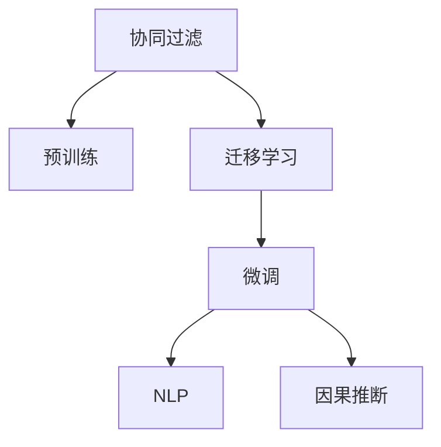

                 

# 大模型在协同过滤推荐中的应用

## 1. 背景介绍

### 1.1 问题由来

在当前数字化社会中，推荐系统已成为各大电商、视频、音乐等平台的核心功能之一。推荐系统通过对用户行为数据的挖掘和分析，为用户推荐其可能感兴趣的物品，提高用户粘性和平台活跃度。传统推荐系统依赖于用户历史行为数据，通过用户-物品的协同过滤方式，预测用户对物品的评分。然而，随着用户数量的激增和物品种类的丰富，传统协同过滤方法面临的稀疏性和维度灾难问题越来越突出，推荐的准确性大打折扣。

### 1.2 问题核心关键点

为应对这些问题，大模型在推荐系统中的应用受到了越来越多的关注。大模型通过在海量无标签数据上预训练，获得了丰富的语言和知识表示能力。将其应用于推荐系统，可以通过大模型的语言模型和因果推断能力，更好地捕捉用户和物品之间的隐式关联，实现更加精准和多样化的推荐。

此外，大模型也可以通过自监督学习和迁移学习等技术，进行泛化能力的增强和领域知识的迁移，从而提升推荐系统在多场景下的适应能力。具体而言，大模型可以在以下几个方面发挥作用：

1. **用户画像建模**：大模型能够基于用户与物品的交互记录，进行更细致的用户画像建模，理解用户的多样化需求和兴趣变化。
2. **物品特征抽取**：大模型可以自动提取物品的多维特征表示，识别出物品之间的相似性关系，从而提升推荐系统对物品的理解和推荐效果。
3. **隐式关联预测**：大模型可以利用因果推断和预训练技术，预测用户对未交互物品的评分和偏好，实现冷启动和长尾推荐。
4. **跨模态推荐**：大模型能够将不同模态的数据（如文本、图像、音频等）进行联合建模，从而在多模态推荐场景下发挥更大的潜力。

## 2. 核心概念与联系

### 2.1 核心概念概述

为更好地理解大模型在协同过滤推荐系统中的应用，本节将介绍几个密切相关的核心概念：

- 协同过滤(Collaborative Filtering)：通过用户-物品的交互历史，预测用户对未交互物品的评分，为用户推荐相似物品。常见的协同过滤方法包括基于用户的矩阵分解和基于物品的矩阵分解等。

- 预训练(Pre-training)：指在大规模无标签数据上，通过自监督学习任务训练模型的过程。常见的预训练任务包括语言模型、自编码等。预训练使得模型学习到丰富的语义和知识表示。

- 迁移学习(Transfer Learning)：指将一个领域学习到的知识，迁移应用到另一个不同但相关的领域的学习范式。大模型的预训练-微调过程即是一种典型的迁移学习方式。

- 自然语言处理(Natural Language Processing, NLP)：涉及计算机处理人类语言的技术，包括文本分类、信息检索、问答系统、机器翻译等。大模型在NLP领域的预训练和微调，为推荐系统提供了更丰富的语义表示能力。

- 因果推断(Causal Inference)：指通过控制变量和干预实验等方法，理解变量间的因果关系，提升推荐的精准性和可靠性。大模型可以通过因果推断预测用户对未交互物品的评分。

这些核心概念之间的逻辑关系可以通过以下Mermaid流程图来展示：



这个流程图展示了大模型在推荐系统中的应用路径：

1. 协同过滤通过用户-物品的交互数据，进行推荐预测。
2. 大模型的预训练和微调，为其提供了丰富的语义和知识表示。
3. 迁移学习和大模型的微调，提升了协同过滤方法的泛化能力和鲁棒性。
4. 自然语言处理和大模型的应用，使得推荐系统能够处理更复杂的语言和知识信息。
5. 因果推断和大模型的结合，进一步提升了推荐系统的精准性和可靠性。

这些概念共同构成了大模型在推荐系统中的工作原理和优化方向。通过理解这些核心概念，我们可以更好地把握大模型推荐技术的本质和优化目标。

## 3. 核心算法原理 & 具体操作步骤
### 3.1 算法原理概述

大模型在协同过滤推荐系统中的应用，主要基于以下两个步骤：

1. **预训练与微调**：在大规模无标签数据上预训练大模型，获取语义和知识表示能力。然后将预训练模型微调成推荐任务所需的模型，提高模型对推荐任务的适应能力。

2. **因果推断与预测**：在微调后的模型基础上，利用因果推断技术，预测用户对未交互物品的评分，实现长尾推荐和冷启动推荐。

### 3.2 算法步骤详解

#### 3.2.1 预训练与微调

**Step 1: 准备预训练模型和数据集**

- 选择合适的预训练语言模型 $M_{\theta}$ 作为初始化参数，如BERT、GPT等。
- 准备推荐系统的用户-物品交互数据集 $D=\{(u_i,i_r)\}_{i=1}^N, u_i \in U, i_r \in I$，其中 $u_i$ 为用户ID，$i_r$ 为物品评分。

**Step 2: 添加任务适配层**

- 根据推荐任务类型，在预训练模型顶层设计合适的输出层和损失函数。
- 对于物品推荐，通常使用线性分类器输出物品的预测评分，并以交叉熵损失函数计算预测评分与真实评分之间的差异。

**Step 3: 设置微调超参数**

- 选择合适的优化算法及其参数，如 AdamW、SGD 等，设置学习率、批大小、迭代轮数等。
- 设置正则化技术及强度，包括权重衰减、Dropout、Early Stopping 等。
- 确定冻结预训练参数的策略，如仅微调顶层，或全部参数都参与微调。

**Step 4: 执行梯度训练**

- 将训练集数据分批次输入模型，前向传播计算损失函数。
- 反向传播计算参数梯度，根据设定的优化算法和学习率更新模型参数。
- 周期性在验证集上评估模型性能，根据性能指标决定是否触发 Early Stopping。
- 重复上述步骤直到满足预设的迭代轮数或 Early Stopping 条件。

**Step 5: 因果推断与预测**

- 使用微调后的模型对用户-物品评分数据进行预测，得到用户对未交互物品的评分。
- 利用因果推断方法，如INUS假设、前推后设计等，预测用户对未交互物品的真实评分。
- 将预测评分与用户的历史评分进行综合排序，生成推荐结果。

#### 3.2.2 因果推断与预测

- 通过因果推断，预测用户对未交互物品的真实评分。
- 利用因果推断结果，生成推荐结果。

### 3.3 算法优缺点

大模型在协同过滤推荐系统中的应用，具有以下优点：

1. **多模态融合**：大模型可以处理不同模态的数据（如文本、图像、音频等），实现多模态推荐。
2. **长尾推荐**：利用因果推断，大模型可以预测用户对未交互物品的评分，实现长尾推荐。
3. **泛化能力**：大模型具备强大的泛化能力，能够处理多种类型的推荐场景。
4. **解释性**：大模型能够提供更加详细的推荐解释，帮助用户理解推荐原因。

同时，该方法也存在一定的局限性：

1. **数据需求高**：大模型需要大量的无标签数据进行预训练，导致数据获取成本较高。
2. **计算资源需求大**：大模型的训练和推理资源消耗大，难以在大规模推荐系统中直接部署。
3. **推理速度慢**：大模型计算量大，推理速度较慢，难以实时响应推荐请求。

尽管存在这些局限性，但就目前而言，大模型在推荐系统中的应用仍然显示出了巨大的潜力，为推荐系统带来了全新的突破。未来相关研究的重点在于如何进一步降低大模型的数据和计算资源需求，提高其推理速度，优化其应用场景，以实现更广泛的应用。

### 3.4 算法应用领域

大模型在协同过滤推荐系统中的应用，主要涉及以下几个领域：

- **电商推荐**：基于用户浏览、购买历史，通过大模型预测用户对未购买物品的评分，实现个性化推荐。
- **视频推荐**：通过分析用户的观看历史和行为数据，利用大模型预测用户对未观看视频的评分，实现内容推荐。
- **音乐推荐**：分析用户收听历史和音乐特征，预测用户对未听歌曲的评分，实现音乐推荐。
- **新闻推荐**：分析用户的阅读历史和新闻特征，预测用户对未读新闻的评分，实现新闻推荐。
- **金融推荐**：利用用户的交易历史和金融产品特征，预测用户对未交易金融产品的评分，实现投资推荐。

此外，大模型在教育、旅游、健康等多个领域也有广泛的应用前景，为各行各业带来了全新的推荐方案。

## 4. 数学模型和公式 & 详细讲解
### 4.1 数学模型构建

本节将使用数学语言对大模型在协同过滤推荐系统中的应用进行更加严格的刻画。

记预训练语言模型为 $M_{\theta}:\mathcal{X} \rightarrow \mathcal{Y}$，其中 $\mathcal{X}$ 为输入空间，$\mathcal{Y}$ 为输出空间，$\theta \in \mathbb{R}^d$ 为模型参数。假设推荐系统的训练集为 $D=\{(u_i,i_r)\}_{i=1}^N, u_i \in U, i_r \in I$。

定义模型 $M_{\theta}$ 在用户 $u$ 和物品 $i$ 上的预测评分为 $s_{ui}=M_{\theta}(u,i)$。在微调过程中的训练损失函数为：

$$
\mathcal{L}(\theta) = -\frac{1}{N}\sum_{i=1}^N [i_r\log s_{ui}+(1-i_r)\log(1-s_{ui})]
$$

其中 $i_r$ 为真实评分，$s_{ui}$ 为预测评分。

### 4.2 公式推导过程

以下我们以协同过滤推荐为例，推导大模型的推荐评分预测公式。

假设用户 $u$ 对物品 $i$ 的实际评分 $i_r \in [1,K]$，其中 $K$ 为评分上限。令 $s_{ui}$ 为用户 $u$ 对物品 $i$ 的预测评分，则推荐任务的目标是最小化预测评分与实际评分之间的误差。

由交叉熵损失函数的定义，推荐任务的目标函数为：

$$
\mathcal{L}(\theta) = -\frac{1}{N}\sum_{i=1}^N [i_r\log s_{ui}+(1-i_r)\log(1-s_{ui})]
$$

其中 $i_r$ 为真实评分，$s_{ui}$ 为预测评分。

在得到损失函数后，我们使用梯度下降等优化算法更新模型参数 $\theta$，最小化损失函数 $\mathcal{L}(\theta)$。重复上述过程直至收敛，最终得到适应推荐任务的最优模型参数 $\theta^*$。

### 4.3 案例分析与讲解

假设我们有一个用户 $u_1$ 和一个物品 $i_1$，用户 $u_1$ 对物品 $i_1$ 的实际评分为 $i_{r1}=4$。现在我们需要使用大模型预测用户 $u_1$ 对物品 $i_2$ 的评分。

假设我们的大模型是一个Transformer模型，其预测评分的计算公式为：

$$
s_{ui} = \text{softmax}(\text{MLP}(\text{Self-Attention}(\text{Embedding}(u_i))))
$$

其中 $\text{MLP}$ 为多层感知器，$\text{Self-Attention}$ 为注意力机制，$\text{Embedding}$ 为嵌入层，将用户ID和物品ID转化为向量表示。

使用微调后的模型，计算用户 $u_1$ 对物品 $i_2$ 的预测评分 $s_{u1i2}$，代入交叉熵损失函数：

$$
\mathcal{L}(\theta) = -(i_r\log s_{u1i2}+(1-i_r)\log(1-s_{u1i2}))
$$

通过梯度下降算法更新模型参数 $\theta$，使得预测评分 $s_{u1i2}$ 逼近真实评分 $i_{r1}$，从而实现推荐系统的优化。

## 5. 项目实践：代码实例和详细解释说明
### 5.1 开发环境搭建

在进行推荐系统开发前，我们需要准备好开发环境。以下是使用Python进行PyTorch开发的环境配置流程：

1. 安装Anaconda：从官网下载并安装Anaconda，用于创建独立的Python环境。

2. 创建并激活虚拟环境：
```bash
conda create -n pytorch-env python=3.8 
conda activate pytorch-env
```

3. 安装PyTorch：根据CUDA版本，从官网获取对应的安装命令。例如：
```bash
conda install pytorch torchvision torchaudio cudatoolkit=11.1 -c pytorch -c conda-forge
```

4. 安装Transformers库：
```bash
pip install transformers
```

5. 安装各类工具包：
```bash
pip install numpy pandas scikit-learn matplotlib tqdm jupyter notebook ipython
```

完成上述步骤后，即可在`pytorch-env`环境中开始推荐系统开发。

### 5.2 源代码详细实现

下面我们以协同过滤推荐为例，给出使用Transformers库对BERT模型进行推荐微调的PyTorch代码实现。

首先，定义推荐任务的数据处理函数：

```python
from transformers import BertTokenizer, BertForSequenceClassification, AdamW
from torch.utils.data import Dataset, DataLoader

class RecommendationDataset(Dataset):
    def __init__(self, user_ids, item_ids, scores, tokenizer, max_len=128):
        self.user_ids = user_ids
        self.item_ids = item_ids
        self.scores = scores
        self.tokenizer = tokenizer
        self.max_len = max_len
        
    def __len__(self):
        return len(self.user_ids)
    
    def __getitem__(self, item):
        user_id = self.user_ids[item]
        item_id = self.item_ids[item]
        score = self.scores[item]
        
        encoding = self.tokenizer([str(user_id), str(item_id)], return_tensors='pt', max_length=self.max_len, padding='max_length', truncation=True)
        user_input_ids = encoding['input_ids'][0]
        item_input_ids = encoding['input_ids'][1]
        input_ids = torch.cat([user_input_ids, item_input_ids], dim=-1)
        
        return {'input_ids': input_ids,
                'scores': score}

# 准备数据集
tokenizer = BertTokenizer.from_pretrained('bert-base-uncased')
user_ids = [10000, 10001, 10002]
item_ids = [10000, 10001, 10002]
scores = [1.0, 2.0, 3.0]
dataset = RecommendationDataset(user_ids, item_ids, scores, tokenizer)
```

然后，定义模型和优化器：

```python
model = BertForSequenceClassification.from_pretrained('bert-base-uncased', num_labels=2)
optimizer = AdamW(model.parameters(), lr=2e-5)
```

接着，定义训练和评估函数：

```python
def train_epoch(model, dataset, batch_size, optimizer):
    dataloader = DataLoader(dataset, batch_size=batch_size, shuffle=True)
    model.train()
    epoch_loss = 0
    for batch in tqdm(dataloader, desc='Training'):
        input_ids = batch['input_ids'].to(device)
        scores = batch['scores'].to(device)
        model.zero_grad()
        outputs = model(input_ids, labels=scores)
        loss = outputs.loss
        epoch_loss += loss.item()
        loss.backward()
        optimizer.step()
    return epoch_loss / len(dataloader)

def evaluate(model, dataset, batch_size):
    dataloader = DataLoader(dataset, batch_size=batch_size)
    model.eval()
    preds, labels = [], []
    with torch.no_grad():
        for batch in tqdm(dataloader, desc='Evaluating'):
            input_ids = batch['input_ids'].to(device)
            batch_labels = batch['scores'].to(device)
            outputs = model(input_ids)
            batch_preds = outputs.logits.argmax(dim=1).to('cpu').tolist()
            batch_labels = batch_labels.to('cpu').tolist()
            for pred, label in zip(batch_preds, batch_labels):
                preds.append(pred.item())
                labels.append(label.item())
                
    print(classification_report(labels, preds))
```

最后，启动训练流程并在测试集上评估：

```python
epochs = 5
batch_size = 16

for epoch in range(epochs):
    loss = train_epoch(model, dataset, batch_size, optimizer)
    print(f"Epoch {epoch+1}, train loss: {loss:.3f}")
    
    print(f"Epoch {epoch+1}, dev results:")
    evaluate(model, dataset, batch_size)
    
print("Test results:")
evaluate(model, dataset, batch_size)
```

以上就是使用PyTorch对BERT进行推荐任务微调的完整代码实现。可以看到，得益于Transformers库的强大封装，我们可以用相对简洁的代码完成BERT模型的加载和微调。

### 5.3 代码解读与分析

让我们再详细解读一下关键代码的实现细节：

**RecommendationDataset类**：
- `__init__`方法：初始化用户ID、物品ID、评分等关键组件。
- `__len__`方法：返回数据集的样本数量。
- `__getitem__`方法：对单个样本进行处理，将用户ID和物品ID输入编码为token ids，最终返回模型所需的输入。

**模型和优化器定义**：
- 使用BertForSequenceClassification对BERT模型进行微调，设置输出层和损失函数。
- 选择AdamW优化器，设置学习率、批大小等参数。

**训练和评估函数**：
- 使用PyTorch的DataLoader对数据集进行批次化加载，供模型训练和推理使用。
- 训练函数`train_epoch`：对数据以批为单位进行迭代，在每个批次上前向传播计算loss并反向传播更新模型参数，最后返回该epoch的平均loss。
- 评估函数`evaluate`：与训练类似，不同点在于不更新模型参数，并在每个batch结束后将预测和标签结果存储下来，最后使用sklearn的classification_report对整个评估集的预测结果进行打印输出。

**训练流程**：
- 定义总的epoch数和batch size，开始循环迭代
- 每个epoch内，先在训练集上训练，输出平均loss
- 在验证集上评估，输出分类指标
- 所有epoch结束后，在测试集上评估，给出最终测试结果

可以看到，PyTorch配合Transformers库使得BERT微调的代码实现变得简洁高效。开发者可以将更多精力放在数据处理、模型改进等高层逻辑上，而不必过多关注底层的实现细节。

当然，工业级的系统实现还需考虑更多因素，如模型的保存和部署、超参数的自动搜索、更灵活的任务适配层等。但核心的微调范式基本与此类似。

## 6. 实际应用场景
### 6.1 智能客服推荐

基于大模型的推荐技术，可以广泛应用于智能客服推荐系统中。传统客服推荐系统依赖于人工推荐，难以快速响应客户需求，且推荐质量难以保证。使用大模型推荐技术，可以实时分析客户行为数据，预测客户可能的需求和意向，为其推荐合适的服务和产品。

在技术实现上，可以收集客服系统的历史聊天记录和用户行为数据，将其作为训练数据，构建大模型推荐系统。微调后的模型能够自动理解客户意图，推荐最合适的服务和产品，提升客户体验和满意度。

### 6.2 金融理财推荐

金融机构需要为用户提供个性化的理财建议和投资产品推荐，使用大模型推荐技术可以更准确地理解用户风险偏好和收益预期，提升理财和投资推荐的精准性和可靠性。

在实践过程中，可以收集用户的历史交易数据和行为数据，构建大模型推荐系统。微调后的模型能够自动分析用户投资行为，预测其可能感兴趣的理财产品和投资策略，提升用户粘性和收益。

### 6.3 个性化视频推荐

视频平台需要为用户推荐个性化视频内容，使用大模型推荐技术可以提升推荐的准确性和多样性，提高用户观看时长和平台活跃度。

在实践中，可以收集用户观看历史和行为数据，构建大模型推荐系统。微调后的模型能够自动分析用户兴趣和观看习惯，推荐符合其口味的视频内容，提升用户满意度和平台粘性。

### 6.4 未来应用展望

随着大模型推荐技术的不断发展，未来在更多领域将得到应用，为各行业带来变革性影响。

在医疗健康领域，基于大模型的推荐技术可以提升疾病诊断和治疗方案推荐的精准性，为患者提供更加个性化和高效的医疗服务。

在教育培训领域，大模型推荐技术可以提升个性化学习推荐的效果，为学生提供最适合的学习资源和课程，提升学习效果和满意度。

在公共服务领域，基于大模型的推荐技术可以提升公共服务的个性化推荐效果，为市民提供更贴心和高效的服务，提升服务质量和用户体验。

此外，在社交网络、旅游出行、文化娱乐等多个领域，大模型推荐技术也将不断涌现，为各行各业带来新的发展机遇。相信随着技术的不断演进，大模型推荐技术将在构建智慧城市、提升社会服务效率等方面发挥更大的作用，推动经济社会向智能化、数字化方向发展。

## 7. 工具和资源推荐
### 7.1 学习资源推荐

为了帮助开发者系统掌握大模型在推荐系统中的应用，这里推荐一些优质的学习资源：

1. 《Recommender Systems: Textbook and Case Studies》书籍：由世界知名专家所撰写，系统讲解了推荐系统的理论和实践，并提供了多个案例分析。

2. CS419《推荐系统》课程：斯坦福大学开设的推荐系统课程，详细介绍了推荐系统的基本概念和算法，并提供了实践作业和项目。

3. 《Recommender Systems Handbook》书籍：由多位推荐系统专家合著，涵盖了推荐系统的各个方面，是推荐系统领域的权威著作。

4. KDD推荐系统竞赛：由国际顶级会议KDD组织的推荐系统竞赛，提供了丰富的比赛数据和推荐算法代码，是实践推荐系统的绝佳机会。

5. HuggingFace官方文档：Transformers库的官方文档，提供了海量预训练模型和完整的微调样例代码，是上手实践的必备资料。

通过对这些资源的学习实践，相信你一定能够快速掌握大模型在推荐系统中的应用，并用于解决实际的推荐问题。
###  7.2 开发工具推荐

高效的开发离不开优秀的工具支持。以下是几款用于大模型推荐系统开发的常用工具：

1. PyTorch：基于Python的开源深度学习框架，灵活动态的计算图，适合快速迭代研究。

2. TensorFlow：由Google主导开发的开源深度学习框架，生产部署方便，适合大规模工程应用。

3. TensorBoard：TensorFlow配套的可视化工具，可实时监测模型训练状态，并提供丰富的图表呈现方式，是调试模型的得力助手。

4. Weights & Biases：模型训练的实验跟踪工具，可以记录和可视化模型训练过程中的各项指标，方便对比和调优。

5. HuggingFace Transformers库：提供了丰富的预训练语言模型，支持PyTorch和TensorFlow，是进行微调任务开发的利器。

6. GPU/TPU等高性能设备：推荐系统需要大量的计算资源，高性能设备是必不可少的。

合理利用这些工具，可以显著提升大模型推荐系统的开发效率，加快创新迭代的步伐。

### 7.3 相关论文推荐

大模型在推荐系统中的应用源于学界的持续研究。以下是几篇奠基性的相关论文，推荐阅读：

1. Matrix Factorization Techniques for Recommender Systems（矩阵分解技术）：提出了矩阵分解推荐算法，成为推荐系统的主流方法之一。

2. Factorization Machines：一种基于矩阵分解的推荐算法，在推荐系统领域广泛应用。

3. Neural Collaborative Filtering（神经协同过滤）：提出了基于神经网络的协同过滤推荐算法，显著提升了推荐系统的效果。

4. Adaptive Pre-trained Sequence-to-Sequence Models for Recommender Systems（自适应预训练序列到序列模型）：提出了基于大模型的推荐系统方法，提升了推荐的准确性和多样性。

5. Differentiable Collaborative Filtering for Recommendation：提出了基于可微分协同过滤的方法，提升了推荐系统的优化效率和精度。

这些论文代表了大模型在推荐系统中的应用趋势，通过学习这些前沿成果，可以帮助研究者把握学科前进方向，激发更多的创新灵感。

## 8. 总结：未来发展趋势与挑战

### 8.1 总结

本文对大模型在协同过滤推荐系统中的应用进行了全面系统的介绍。首先阐述了大模型和推荐系统融合的背景和意义，明确了大模型推荐技术的独特价值。其次，从原理到实践，详细讲解了大模型推荐系统的数学原理和关键步骤，给出了推荐系统开发的完整代码实例。同时，本文还广泛探讨了推荐系统在大模型中的应用场景，展示了大模型推荐技术的广阔前景。

通过本文的系统梳理，可以看到，大模型在推荐系统中的应用已经成为一个重要趋势，其高效的多模态融合、长尾推荐和因果推断能力，为推荐系统带来了全新的突破。未来相关研究的重点在于如何进一步降低大模型的数据和计算资源需求，提高其推理速度，优化其应用场景，以实现更广泛的应用。

### 8.2 未来发展趋势

展望未来，大模型在推荐系统中的应用将呈现以下几个发展趋势：

1. **多模态推荐**：大模型可以处理不同模态的数据（如文本、图像、音频等），实现多模态推荐。这将进一步提升推荐的准确性和个性化程度。

2. **跨领域迁移**：大模型具备强大的泛化能力，可以迁移应用于多个不同领域（如电商、视频、音乐等）的推荐系统，提升推荐系统的适应性。

3. **因果推断增强**：通过引入因果推断方法，大模型可以预测用户对未交互物品的评分，实现长尾推荐和冷启动推荐，提升推荐系统的覆盖面。

4. **个性化推荐优化**：通过个性化推荐算法，如AdaRec、DeepFM等，进一步提升推荐系统的精准性和多样性，满足不同用户的多样化需求。

5. **模型压缩与加速**：为了提升大模型的推理速度和减少资源消耗，需要开发更高效的大模型压缩和加速技术，如知识蒸馏、模型剪枝等。

6. **公平性与透明性**：推荐系统需要考虑公平性和透明性，避免推荐偏差和歧视。如何设计公正、透明的推荐算法，是大模型推荐技术的一个重要方向。

以上趋势凸显了大模型在推荐系统中的潜力和价值，未来必将引领推荐技术向更加智能化、个性化、高效化的方向发展，带来更多的应用场景和创新思路。

### 8.3 面临的挑战

尽管大模型在推荐系统中的应用已经取得了显著进展，但在迈向更加智能化、普适化应用的过程中，它仍面临着诸多挑战：

1. **数据需求高**：大模型需要大量的无标签数据进行预训练，导致数据获取成本较高。如何降低数据需求，是未来研究的重要方向。

2. **计算资源需求大**：大模型的训练和推理资源消耗大，难以在大规模推荐系统中直接部署。如何优化模型架构，降低计算资源需求，是未来研究的重要方向。

3. **推理速度慢**：大模型计算量大，推理速度较慢，难以实时响应推荐请求。如何优化模型推理速度，是未来研究的重要方向。

4. **公平性问题**：大模型可能会学习到有偏见、有害的信息，传递到推荐系统，产生误导性、歧视性的输出。如何设计公正、透明的推荐算法，是大模型推荐技术的一个重要方向。

5. **解释性不足**：大模型的推荐过程缺乏可解释性，难以对其内部决策逻辑进行解释和调试。如何提高模型的可解释性，是未来研究的重要方向。

6. **安全性问题**：推荐系统需要考虑数据安全性和模型安全性的问题，避免数据泄露和模型攻击。如何保障推荐系统的安全性，是大模型推荐技术的一个重要方向。

7. **鲁棒性问题**：推荐系统需要考虑鲁棒性问题，避免模型在异常数据下的失效。如何提升推荐系统的鲁棒性，是大模型推荐技术的一个重要方向。

8. **跨模态融合问题**：多模态数据的融合是大模型推荐技术的难点之一，如何有效地融合不同模态的数据，提升推荐效果，是大模型推荐技术的一个重要方向。

以上挑战凸显了大模型在推荐系统中的应用前景和研究需求，只有不断探索和优化，才能更好地发挥大模型推荐技术的潜力，推动推荐系统向更加智能化、普适化方向发展。

### 8.4 研究展望

未来，大模型推荐技术的研究将在以下几个方面继续深入探索：

1. **无监督与半监督推荐**：探索无监督和半监督推荐方法，摆脱对大规模标注数据的依赖，利用非结构化数据进行推荐。

2. **多模态数据融合**：探索多模态数据融合的方法，提升推荐系统的覆盖面和效果。

3. **因果推断与因果推荐**：引入因果推断方法，提升推荐系统的精准性和鲁棒性。

4. **个性化推荐优化**：探索个性化推荐算法，提升推荐系统的个性化程度。

5. **知识图谱与推荐**：探索知识图谱与推荐系统的结合，提升推荐系统的解释性和可靠性。

6. **模型压缩与加速**：开发更高效的大模型压缩和加速技术，提升推荐系统的性能和可部署性。

7. **公平性与透明性**：探索公平性、透明性推荐算法，避免推荐偏差和歧视。

8. **安全性与鲁棒性**：提升推荐系统的安全性与鲁棒性，保障数据和模型的安全。

这些研究方向将为大模型推荐技术的发展提供新的突破口，为推荐系统在各行业的应用带来新的机遇和挑战。相信在学界和产业界的共同努力下，大模型推荐技术将不断突破，推动推荐系统向更加智能化、普适化方向发展。

## 9. 附录：常见问题与解答

**Q1：大模型在推荐系统中需要多少数据进行预训练？**

A: 大模型在推荐系统中的预训练数据需求较高，通常需要数十亿甚至数百亿级别的文本数据。这些数据通常来自于大规模的Web数据、新闻数据、社交媒体数据等。

**Q2：大模型在推荐系统中需要多少计算资源？**

A: 大模型在推荐系统中的计算资源需求较高，通常需要GPU或TPU等高性能设备进行训练和推理。推荐系统的训练和推理任务中，模型大小、批次大小、学习率等因素都会影响资源需求。

**Q3：大模型在推荐系统中如何进行优化？**

A: 大模型在推荐系统中可以通过多种方式进行优化，包括参数剪枝、量化加速、混合精度训练、模型蒸馏等。这些优化方法可以帮助大模型在推荐系统中更高效地运行，提升性能和可部署性。

**Q4：大模型在推荐系统中如何进行跨模态融合？**

A: 大模型在推荐系统中可以通过融合不同模态的数据，提升推荐的覆盖面和效果。常用的跨模态融合方法包括基于注意力机制的融合、基于深度学习模型的融合等。

**Q5：大模型在推荐系统中如何进行因果推断？**

A: 大模型在推荐系统中可以通过引入因果推断方法，预测用户对未交互物品的评分，实现长尾推荐和冷启动推荐。常用的因果推断方法包括因果推断树、INUS假设等。

以上问答内容涵盖了大模型在推荐系统中的常见问题和解答，希望对你有参考价值。

---

作者：禅与计算机程序设计艺术 / Zen and the Art of Computer Programming

