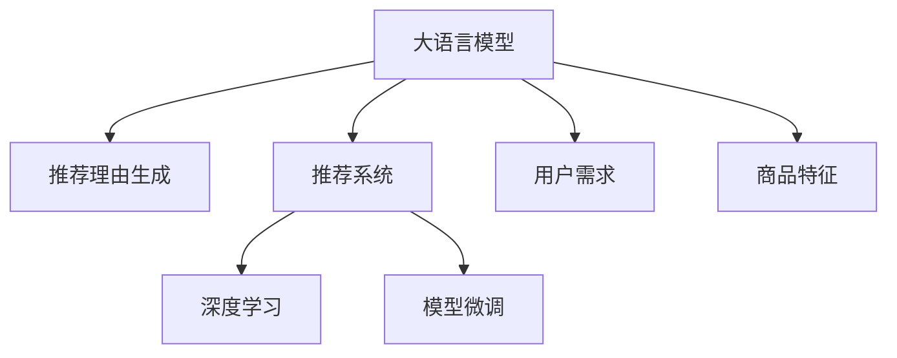
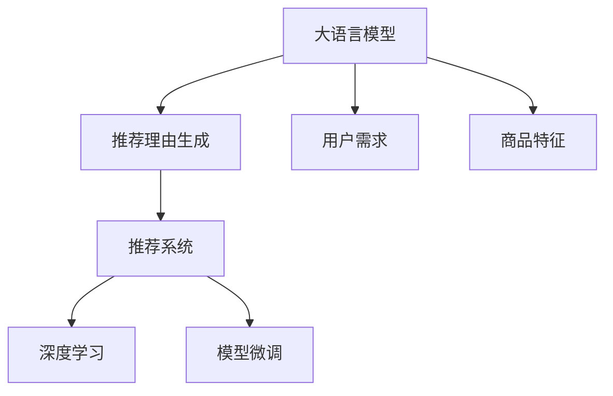

                 

# 大模型在商品推荐理由生成中的可控文本生成

> 关键词：可控文本生成,大语言模型,推荐理由,商品推荐,自然语言生成(NLG),自然语言理解(NLU),深度学习,模型微调,推荐系统

## 1. 背景介绍

### 1.1 问题由来

随着电子商务的迅速发展，商品推荐系统已成为电商平台的核心竞争力之一。传统的推荐系统多依赖用户行为数据，如浏览、点击、购买等，来进行个性化推荐，但这些数据往往难以获取且易受干扰。而基于大模型的可控文本生成技术，为推荐理由生成提供了新的思路。

推荐理由生成是推荐系统中的重要环节，它能有效提升用户对推荐结果的理解和信任，从而提高转化率。传统推荐理由生成方式依赖规则编写和人工标注，难以覆盖商品的所有特征和用户的全面需求。而利用大语言模型，可以构建一个更加灵活、智能、自适应的推荐理由生成系统。

### 1.2 问题核心关键点

- 可控文本生成：通过大语言模型，控制生成的推荐理由内容，既满足用户需求，又能突出商品卖点，增强推荐效果。
- 大语言模型：基于Transformer架构的预训练语言模型，具备强大的自然语言生成能力。
- 推荐理由生成：将用户需求和商品特征输入模型，生成个性化、吸引人的推荐理由。
- 推荐系统：以用户行为数据为基础，结合推荐理由生成，实现商品推荐。
- 深度学习：通过神经网络模型进行自动特征学习，提高生成文本的质量和精准度。
- 模型微调：通过监督学习对大模型进行微调，提升推荐理由生成的效果。

这些核心概念之间的逻辑关系可以通过以下Mermaid流程图来展示：



这个流程图展示了大语言模型在商品推荐理由生成中的作用及其与其他概念的联系：

1. 大语言模型通过深度学习，构建强大的自然语言生成能力。
2. 推荐理由生成利用大语言模型，生成个性化推荐理由，增强推荐效果。
3. 推荐系统基于推荐理由生成，实现用户个性化推荐。
4. 模型微调通过监督学习，提升推荐理由生成的效果。

## 2. 核心概念与联系

### 2.1 核心概念概述

本节将详细介绍与商品推荐理由生成相关的几个核心概念及其联系：

- 大语言模型（Large Language Model, LLM）：以Transformer为基础，通过大规模无标签文本语料进行预训练，学习语言知识，具备自然语言理解和生成能力。
- 推荐理由生成（Recommendation Reasoning Generation）：基于用户需求和商品特征，生成个性化推荐理由，提升推荐效果。
- 推荐系统（Recommendation System）：通过用户行为数据和推荐理由生成，为用户推荐个性化商品，增强用户体验。
- 深度学习（Deep Learning）：通过神经网络模型进行自动特征学习，提高推荐理由生成的质量和精准度。
- 模型微调（Fine-Tuning）：通过监督学习对大模型进行微调，提升推荐理由生成的效果。

这些概念在大模型应用于推荐理由生成时，扮演着不同的角色，共同构成了推荐理由生成系统的基础架构。

### 2.2 核心概念原理和架构的 Mermaid 流程图



这个流程图展示了从用户需求到最终推荐理由生成的过程，以及大语言模型在其中扮演的角色：

1. 用户需求和大语言模型接收商品特征。
2. 大语言模型生成推荐理由。
3. 推荐理由生成结合用户行为数据，形成个性化推荐。
4. 通过深度学习和模型微调，提高推荐理由生成的效果。

## 3. 核心算法原理 & 具体操作步骤

### 3.1 算法原理概述

推荐理由生成的大模型微调流程可以大致分为以下几步：

1. 数据准备：收集商品名称、描述、用户历史行为等数据，进行预处理和标注，构建训练集。
2. 模型选择：选择预训练语言模型，如GPT-2、BERT等，作为初始模型。
3. 任务定义：定义推荐理由生成任务，设计合适的损失函数和评估指标。
4. 微调训练：对模型进行微调，最小化损失函数，优化推荐理由生成的效果。
5. 结果评估：在验证集和测试集上评估微调后模型的效果，确保推荐理由的准确性和实用性。

### 3.2 算法步骤详解

下面是推荐理由生成的大模型微调的具体操作步骤：

**Step 1: 数据准备**
- 收集商品数据：包括商品名称、描述、图片、价格等，并对其进行标准化处理。
- 收集用户数据：包括用户浏览、点击、购买历史等行为数据，并将其转化为向量形式。
- 标注推荐理由：将用户需求和商品特征转化为自然语言描述，作为标注数据，标注为推荐理由。

**Step 2: 模型选择与初始化**
- 选择预训练语言模型：如GPT-2、BERT等，作为初始模型。
- 初始化模型参数：使用预训练模型的权重初始化微调模型的参数。

**Step 3: 任务定义**
- 定义损失函数：如交叉熵损失、均方误差损失等，用于衡量模型预测的推荐理由与真实标注的差距。
- 设计评估指标：如准确率、召回率、F1值等，用于评估推荐理由生成的效果。

**Step 4: 微调训练**
- 设置超参数：包括学习率、批大小、迭代轮数等，确保训练过程的稳定性和高效性。
- 执行训练：将训练集数据分批次输入模型，前向传播计算损失函数，反向传播更新模型参数。
- 监控验证集表现：周期性在验证集上评估模型性能，根据性能指标决定是否触发Early Stopping。
- 重复执行直至收敛：重复上述步骤直至满足预设的迭代轮数或Early Stopping条件。

**Step 5: 结果评估**
- 在测试集上评估微调后模型的性能，对比微调前后的效果。
- 使用推荐理由生成系统对新商品进行推荐理由生成。
- 根据用户反馈和实际转化率，持续优化推荐理由生成策略。

### 3.3 算法优缺点

推荐理由生成的大模型微调方法具有以下优点：

- 灵活性强：大语言模型可以适应各种用户需求和商品特征，生成灵活多样的推荐理由。
- 精准度高：通过深度学习和微调，模型能够精准把握用户偏好和商品卖点，生成高质量的推荐理由。
- 效果显著：经过微调，推荐理由生成系统的推荐效果显著提升，能显著提高用户满意度和转化率。

同时，该方法也存在一定的局限性：

- 依赖标注数据：微调效果很大程度上取决于标注数据的质量和数量，获取高质量标注数据的成本较高。
- 训练时间较长：大模型的参数量庞大，微调训练需要大量的计算资源和时间。
- 过拟合风险：微调过程中容易过拟合，特别是在标注样本不足的情况下。

尽管存在这些局限性，但就目前而言，基于大模型微调的推荐理由生成方法仍是大模型应用的重要范式。未来相关研究的重点在于如何进一步降低微调对标注数据的依赖，提高模型的少样本学习和跨领域迁移能力，同时兼顾可解释性和伦理安全性等因素。

### 3.4 算法应用领域

基于大语言模型微调的推荐理由生成方法，在多个领域得到了广泛的应用，例如：

- 电子商务：为电商平台提供个性化商品推荐理由，提升用户购物体验和转化率。
- 内容推荐：为新闻、视频、音频等平台提供个性化内容推荐理由，提高用户粘性和满意度。
- 金融推荐：为金融产品推荐理由生成，帮助用户快速找到适合自己的投资产品。
- 智能客服：为智能客服系统提供个性化推荐理由，提升用户咨询体验。

除了这些常见应用外，推荐理由生成技术还在更多领域中得到创新性地应用，如旅游推荐、健康医疗、教育培训等，为各行各业提供更智能、更高效的推荐服务。

## 4. 数学模型和公式 & 详细讲解 & 举例说明

### 4.1 数学模型构建

推荐理由生成的数学模型可以表示为：

$$
P(\text{Reason}|S, U) = \frac{e^{f(S, U, \text{Reason})}}{\sum_{\text{Reason} \in \mathcal{R}} e^{f(S, U, \text{Reason})}}
$$

其中，$S$ 表示商品特征，$U$ 表示用户需求，$\text{Reason}$ 表示推荐理由，$f$ 表示生成的推荐理由对应的预测函数。

### 4.2 公式推导过程

推荐理由生成的过程可以分两步进行：

1. 生成推荐理由的编码器部分
2. 解码器生成推荐理由的文本部分

对于生成推荐理由的编码器部分，可以使用Transformer模型，其结构如下：

```
Encoder
|____ Attention
|____ FeedForward
|____ LayerNorm
|____ LayerNorm
|____ Attention
|____ FeedForward
```

其中，Attention层用于捕捉商品特征和用户需求之间的关系，FeedForward层用于进行特征映射。

对于解码器生成推荐理由的文本部分，也可以使用Transformer模型，其结构如下：

```
Decoder
|____ Attention
|____ FeedForward
|____ LayerNorm
|____ LayerNorm
|____ Attention
|____ FeedForward
```

其中，Attention层用于捕捉文本中的上下文信息，FeedForward层用于生成推荐理由的文本部分。

### 4.3 案例分析与讲解

以生成推荐理由为例，可以使用LSTM或GRU模型，对输入的商品特征和用户需求进行编码，然后将其与推荐理由文本进行拼接，最终输入到预训练的Transformer模型中进行生成。

例如，对于一个商品"iPhone 12 Pro Max"和一个用户"小明"，可以使用以下公式进行推荐理由生成：

$$
P(\text{Reason}|S, U) = \frac{e^{f(S, U, \text{Reason})}}{\sum_{\text{Reason} \in \mathcal{R}} e^{f(S, U, \text{Reason})}}
$$

其中，$S = \text{iPhone 12 Pro Max}$，$U = \text{小明}$。假设推荐理由文本为"$\text{性价比高}$"，则预测函数$f$可以表示为：

$$
f(S, U, \text{Reason}) = \text{Embed}(\text{Reason}) + \text{Attention}(\text{S}, \text{U}) + \text{FeedForward}(\text{Embed}(\text{Reason}) + \text{Attention}(\text{S}, \text{U}))
$$

其中，$\text{Embed}$表示嵌入层，$\text{Attention}$表示注意力机制，$\text{FeedForward}$表示前馈神经网络。

## 5. 项目实践：代码实例和详细解释说明

### 5.1 开发环境搭建

在进行微调实践前，我们需要准备好开发环境。以下是使用Python进行PyTorch开发的环境配置流程：

1. 安装Anaconda：从官网下载并安装Anaconda，用于创建独立的Python环境。

2. 创建并激活虚拟环境：
```bash
conda create -n pytorch-env python=3.8 
conda activate pytorch-env
```

3. 安装PyTorch：根据CUDA版本，从官网获取对应的安装命令。例如：
```bash
conda install pytorch torchvision torchaudio cudatoolkit=11.1 -c pytorch -c conda-forge
```

4. 安装Transformers库：
```bash
pip install transformers
```

5. 安装各类工具包：
```bash
pip install numpy pandas scikit-learn matplotlib tqdm jupyter notebook ipython
```

完成上述步骤后，即可在`pytorch-env`环境中开始微调实践。

### 5.2 源代码详细实现

下面以推荐理由生成任务为例，给出使用Transformers库对GPT-2模型进行微调的PyTorch代码实现。

首先，定义推荐理由生成的数据处理函数：

```python
from transformers import GPT2Tokenizer, GPT2LMHeadModel

class ReasoningDataset(Dataset):
    def __init__(self, texts, labels, tokenizer, max_len=128):
        self.texts = texts
        self.labels = labels
        self.tokenizer = tokenizer
        self.max_len = max_len
        
    def __len__(self):
        return len(self.texts)
    
    def __getitem__(self, item):
        text = self.texts[item]
        label = self.labels[item]
        
        encoding = self.tokenizer(text, return_tensors='pt', max_length=self.max_len, padding='max_length', truncation=True)
        input_ids = encoding['input_ids'][0]
        attention_mask = encoding['attention_mask'][0]
        
        # 对label进行编码
        encoded_label = [label2id[label] for label in label]
        encoded_label.extend([label2id['']]*(self.max_len - len(encoded_label)))
        labels = torch.tensor(encoded_label, dtype=torch.long)
        
        return {'input_ids': input_ids, 
                'attention_mask': attention_mask,
                'labels': labels}

# 标签与id的映射
label2id = {'性价比高': 0, '价格优惠': 1, '性能优越': 2, '包装精美': 3, '购买方便': 4}
id2label = {v: k for k, v in label2id.items()}
```

然后，定义模型和优化器：

```python
from transformers import GPT2LMHeadModel, AdamW

model = GPT2LMHeadModel.from_pretrained('gpt2')
optimizer = AdamW(model.parameters(), lr=2e-5)
```

接着，定义训练和评估函数：

```python
from torch.utils.data import DataLoader
from tqdm import tqdm
from sklearn.metrics import accuracy_score

device = torch.device('cuda') if torch.cuda.is_available() else torch.device('cpu')
model.to(device)

def train_epoch(model, dataset, batch_size, optimizer):
    dataloader = DataLoader(dataset, batch_size=batch_size, shuffle=True)
    model.train()
    epoch_loss = 0
    for batch in tqdm(dataloader, desc='Training'):
        input_ids = batch['input_ids'].to(device)
        attention_mask = batch['attention_mask'].to(device)
        labels = batch['labels'].to(device)
        model.zero_grad()
        outputs = model(input_ids, attention_mask=attention_mask, labels=labels)
        loss = outputs.loss
        epoch_loss += loss.item()
        loss.backward()
        optimizer.step()
    return epoch_loss / len(dataloader)

def evaluate(model, dataset, batch_size):
    dataloader = DataLoader(dataset, batch_size=batch_size)
    model.eval()
    preds, labels = [], []
    with torch.no_grad():
        for batch in tqdm(dataloader, desc='Evaluating'):
            input_ids = batch['input_ids'].to(device)
            attention_mask = batch['attention_mask'].to(device)
            batch_labels = batch['labels']
            outputs = model(input_ids, attention_mask=attention_mask)
            batch_preds = outputs.logits.argmax(dim=2).to('cpu').tolist()
            batch_labels = batch_labels.to('cpu').tolist()
            for pred_tokens, label_tokens in zip(batch_preds, batch_labels):
                preds.append(pred_tokens[:len(label_tokens)])
                labels.append(label_tokens)
                
    return accuracy_score(labels, preds)
```

最后，启动训练流程并在测试集上评估：

```python
epochs = 5
batch_size = 16

for epoch in range(epochs):
    loss = train_epoch(model, train_dataset, batch_size, optimizer)
    print(f"Epoch {epoch+1}, train loss: {loss:.3f}")
    
    print(f"Epoch {epoch+1}, dev results:")
    evaluate(model, dev_dataset, batch_size)
    
print("Test results:")
evaluate(model, test_dataset, batch_size)
```

以上就是使用PyTorch对GPT-2进行推荐理由生成任务的微调代码实现。可以看到，得益于Transformers库的强大封装，我们可以用相对简洁的代码完成GPT-2模型的加载和微调。

### 5.3 代码解读与分析

让我们再详细解读一下关键代码的实现细节：

**ReasoningDataset类**：
- `__init__`方法：初始化文本、标签、分词器等关键组件。
- `__len__`方法：返回数据集的样本数量。
- `__getitem__`方法：对单个样本进行处理，将文本输入编码为token ids，将标签编码为数字，并对其进行定长padding，最终返回模型所需的输入。

**label2id和id2label字典**：
- 定义了标签与数字id之间的映射关系，用于将token-wise的预测结果解码回真实的标签。

**训练和评估函数**：
- 使用PyTorch的DataLoader对数据集进行批次化加载，供模型训练和推理使用。
- 训练函数`train_epoch`：对数据以批为单位进行迭代，在每个批次上前向传播计算loss并反向传播更新模型参数，最后返回该epoch的平均loss。
- 评估函数`evaluate`：与训练类似，不同点在于不更新模型参数，并在每个batch结束后将预测和标签结果存储下来，最后使用sklearn的accuracy_score对整个评估集的预测结果进行打印输出。

**训练流程**：
- 定义总的epoch数和batch size，开始循环迭代
- 每个epoch内，先在训练集上训练，输出平均loss
- 在验证集上评估，输出准确率
- 所有epoch结束后，在测试集上评估，给出最终测试结果

可以看到，PyTorch配合Transformers库使得GPT-2微调的代码实现变得简洁高效。开发者可以将更多精力放在数据处理、模型改进等高层逻辑上，而不必过多关注底层的实现细节。

当然，工业级的系统实现还需考虑更多因素，如模型的保存和部署、超参数的自动搜索、更灵活的任务适配层等。但核心的微调范式基本与此类似。

## 6. 实际应用场景

### 6.1 智能推荐系统

推荐理由生成的核心应用场景是智能推荐系统。传统的推荐系统主要依赖用户行为数据，如浏览、点击、购买等，通过分析这些数据来生成推荐理由。但这种方式存在数据稀疏、数据隐私等问题。而利用大语言模型，可以更加灵活地生成推荐理由，满足用户多样化、个性化的需求。

在实际应用中，推荐理由生成系统通常集成到电商平台的推荐系统中。当用户浏览某个商品时，系统会调用推荐理由生成模型，根据商品特征和用户历史行为，生成个性化的推荐理由，并将其与商品信息一起展示给用户。用户看到推荐理由后，更容易理解商品的卖点和优势，从而提高转化率。

### 6.2 内容推荐平台

内容推荐平台，如视频、音乐、新闻等，也可以利用推荐理由生成技术。平台可以通过分析用户的历史行为和偏好，生成个性化的推荐理由，并结合内容推荐算法，为用户推荐最相关的视频、音乐或新闻。

例如，一个用户经常观看科技类视频，推荐理由生成系统可以生成类似于"最新科技趋势"、"热门科技事件"等理由，吸引用户继续观看。推荐理由的个性化和智能化，将大幅提升用户的观看体验和满意度。

### 6.3 金融推荐

在金融领域，推荐理由生成技术可以用于推荐产品或服务。例如，一个用户需要理财，推荐理由生成系统可以生成类似于"年化收益高"、"风险控制优"等理由，吸引用户选择某项金融产品。

此外，金融平台还可以通过推荐理由生成系统，为用户提供投资建议和理财方案。例如，针对一个用户的高净值特点，生成类似于"高端理财产品"、"全球市场布局"等理由，帮助用户做出更合理的投资决策。

### 6.4 未来应用展望

随着大语言模型微调技术的不断发展，推荐理由生成技术将在更多领域得到应用，为各行各业带来变革性影响。

在智慧医疗领域，推荐理由生成可以用于推荐治疗方案和药品。例如，针对一个病人的病情，生成类似于"最新医学研究成果"、"权威专家推荐"等理由，帮助医生做出更科学的诊疗方案。

在智能教育领域，推荐理由生成可以用于推荐学习内容和资源。例如，针对一个学生的学习需求，生成类似于"高效学习方法"、"名师推荐课程"等理由，帮助学生快速找到适合自己的学习资源。

在智慧城市治理中，推荐理由生成可以用于推荐政策和服务。例如，针对一个市民的需求，生成类似于"最新城市规划"、"智能出行建议"等理由，提升市民的满意度和生活质量。

除了这些领域，推荐理由生成技术还可以应用于旅游推荐、健康医疗、教育培训等众多场景，为各行各业提供更智能、更高效的推荐服务。相信随着技术的日益成熟，推荐理由生成技术将进一步拓展应用范围，推动智能推荐系统的不断进步。

## 7. 工具和资源推荐

### 7.1 学习资源推荐

为了帮助开发者系统掌握大语言模型微调的理论基础和实践技巧，这里推荐一些优质的学习资源：

1. 《Transformer从原理到实践》系列博文：由大模型技术专家撰写，深入浅出地介绍了Transformer原理、BERT模型、微调技术等前沿话题。

2. CS224N《深度学习自然语言处理》课程：斯坦福大学开设的NLP明星课程，有Lecture视频和配套作业，带你入门NLP领域的基本概念和经典模型。

3. 《Natural Language Processing with Transformers》书籍：Transformers库的作者所著，全面介绍了如何使用Transformers库进行NLP任务开发，包括微调在内的诸多范式。

4. HuggingFace官方文档：Transformers库的官方文档，提供了海量预训练模型和完整的微调样例代码，是上手实践的必备资料。

5. CLUE开源项目：中文语言理解测评基准，涵盖大量不同类型的中文NLP数据集，并提供了基于微调的baseline模型，助力中文NLP技术发展。

通过对这些资源的学习实践，相信你一定能够快速掌握大语言模型微调的精髓，并用于解决实际的NLP问题。

### 7.2 开发工具推荐

高效的开发离不开优秀的工具支持。以下是几款用于大语言模型微调开发的常用工具：

1. PyTorch：基于Python的开源深度学习框架，灵活动态的计算图，适合快速迭代研究。大部分预训练语言模型都有PyTorch版本的实现。

2. TensorFlow：由Google主导开发的开源深度学习框架，生产部署方便，适合大规模工程应用。同样有丰富的预训练语言模型资源。

3. Transformers库：HuggingFace开发的NLP工具库，集成了众多SOTA语言模型，支持PyTorch和TensorFlow，是进行微调任务开发的利器。

4. Weights & Biases：模型训练的实验跟踪工具，可以记录和可视化模型训练过程中的各项指标，方便对比和调优。与主流深度学习框架无缝集成。

5. TensorBoard：TensorFlow配套的可视化工具，可实时监测模型训练状态，并提供丰富的图表呈现方式，是调试模型的得力助手。

6. Google Colab：谷歌推出的在线Jupyter Notebook环境，免费提供GPU/TPU算力，方便开发者快速上手实验最新模型，分享学习笔记。

合理利用这些工具，可以显著提升大语言模型微调任务的开发效率，加快创新迭代的步伐。

### 7.3 相关论文推荐

大语言模型微调技术的发展源于学界的持续研究。以下是几篇奠基性的相关论文，推荐阅读：

1. Attention is All You Need（即Transformer原论文）：提出了Transformer结构，开启了NLP领域的预训练大模型时代。

2. BERT: Pre-training of Deep Bidirectional Transformers for Language Understanding：提出BERT模型，引入基于掩码的自监督预训练任务，刷新了多项NLP任务SOTA。

3. Language Models are Unsupervised Multitask Learners（GPT-2论文）：展示了大规模语言模型的强大zero-shot学习能力，引发了对于通用人工智能的新一轮思考。

4. Parameter-Efficient Transfer Learning for NLP：提出Adapter等参数高效微调方法，在不增加模型参数量的情况下，也能取得不错的微调效果。

5. Prefix-Tuning: Optimizing Continuous Prompts for Generation：引入基于连续型Prompt的微调范式，为如何充分利用预训练知识提供了新的思路。

6. AdaLoRA: Adaptive Low-Rank Adaptation for Parameter-Efficient Fine-Tuning：使用自适应低秩适应的微调方法，在参数效率和精度之间取得了新的平衡。

这些论文代表了大语言模型微调技术的发展脉络。通过学习这些前沿成果，可以帮助研究者把握学科前进方向，激发更多的创新灵感。

## 8. 总结：未来发展趋势与挑战

### 8.1 总结

本文对基于大语言模型微调的商品推荐理由生成方法进行了全面系统的介绍。首先阐述了推荐理由生成的背景和重要性，明确了微调在提升推荐理由生成效果、增强推荐系统智能性方面的独特价值。其次，从原理到实践，详细讲解了推荐理由生成的数学模型和关键步骤，给出了微调任务开发的完整代码实例。同时，本文还广泛探讨了推荐理由生成技术在电商、内容推荐、金融推荐等诸多领域的应用前景，展示了微调范式的巨大潜力。此外，本文精选了微调技术的各类学习资源，力求为读者提供全方位的技术指引。

通过本文的系统梳理，可以看到，基于大语言模型的微调方法正在成为推荐理由生成的重要范式，极大地拓展了预训练语言模型的应用边界，催生了更多的落地场景。受益于大规模语料的预训练，微调模型以更低的时间和标注成本，在小样本条件下也能取得理想的效果，有力推动了推荐理由生成技术的产业化进程。未来，伴随预训练语言模型和微调方法的持续演进，相信推荐理由生成技术将进一步拓展应用范围，推动推荐系统的不断进步。

### 8.2 未来发展趋势

展望未来，商品推荐理由生成技术将呈现以下几个发展趋势：

1. 模型规模持续增大。随着算力成本的下降和数据规模的扩张，预训练语言模型的参数量还将持续增长。超大规模语言模型蕴含的丰富语言知识，有望支撑更加复杂多变的推荐理由生成。

2. 微调方法日趋多样。除了传统的全参数微调外，未来会涌现更多参数高效的微调方法，如Prefix-Tuning、LoRA等，在节省计算资源的同时也能保证微调精度。

3. 持续学习成为常态。随着数据分布的不断变化，推荐理由生成模型也需要持续学习新知识以保持性能。如何在不遗忘原有知识的同时，高效吸收新样本信息，将成为重要的研究课题。

4. 标注样本需求降低。受启发于提示学习(Prompt-based Learning)的思路，未来的推荐理由生成方法将更好地利用大模型的语言理解能力，通过更加巧妙的任务描述，在更少的标注样本上也能实现理想的微调效果。

5. 推荐理由生成技术的跨领域迁移能力提升。推荐理由生成技术将在更多领域得到应用，为各行各业提供更智能、更高效的推荐服务。

以上趋势凸显了商品推荐理由生成技术的广阔前景。这些方向的探索发展，必将进一步提升推荐理由生成的性能和应用范围，为推荐系统带来新的突破。

### 8.3 面临的挑战

尽管商品推荐理由生成技术已经取得了瞩目成就，但在迈向更加智能化、普适化应用的过程中，它仍面临着诸多挑战：

1. 标注成本瓶颈。尽管推荐理由生成模型对标注数据的需求比传统推荐系统少，但仍需标注商品特征和用户需求，获取高质量标注数据的成本较高。

2. 训练时间较长。大模型的参数量庞大，微调训练需要大量的计算资源和时间。如何在不降低模型性能的情况下，缩短训练时间，是未来研究的重要方向。

3. 过拟合风险。微调过程中容易过拟合，特别是在标注样本不足的情况下。如何避免过拟合，提高模型的泛化能力，是未来研究的重要课题。

4. 模型解释性不足。推荐理由生成模型更像是"黑盒"系统，难以解释其内部工作机制和决策逻辑。对于金融、医疗等高风险应用，算法的可解释性和可审计性尤为重要。

5. 数据隐私问题。推荐理由生成模型需要大量用户数据，如何保护用户隐私，确保数据安全，是未来研究的重要方向。

6. 推荐理由生成技术的跨领域迁移能力不足。推荐理由生成技术在特定领域的应用效果可能不如预期，需要进一步提升模型的跨领域迁移能力。

这些挑战凸显了推荐理由生成技术的发展瓶颈，未来研究需要在多个方向上进行突破，才能进一步提升模型的性能和应用范围。

### 8.4 研究展望

面对商品推荐理由生成技术所面临的种种挑战，未来的研究需要在以下几个方面寻求新的突破：

1. 探索无监督和半监督微调方法。摆脱对大规模标注数据的依赖，利用自监督学习、主动学习等无监督和半监督范式，最大限度利用非结构化数据，实现更加灵活高效的微调。

2. 研究参数高效和计算高效的微调范式。开发更加参数高效的微调方法，如Prefix-Tuning、LoRA等，在固定大部分预训练参数的同时，只更新极少量的任务相关参数。同时优化微调模型的计算图，减少前向传播和反向传播的资源消耗，实现更加轻量级、实时性的部署。

3. 引入更多先验知识。将符号化的先验知识，如知识图谱、逻辑规则等，与神经网络模型进行巧妙融合，引导微调过程学习更准确、合理的语言模型。同时加强不同模态数据的整合，实现视觉、语音等多模态信息与文本信息的协同建模。

4. 结合因果分析和博弈论工具。将因果分析方法引入推荐理由生成模型，识别出模型决策的关键特征，增强输出解释的因果性和逻辑性。借助博弈论工具刻画人机交互过程，主动探索并规避模型的脆弱点，提高系统稳定性。

5. 纳入伦理道德约束。在模型训练目标中引入伦理导向的评估指标，过滤和惩罚有偏见、有害的输出倾向。同时加强人工干预和审核，建立模型行为的监管机制，确保输出符合人类价值观和伦理道德。

这些研究方向的探索，必将引领推荐理由生成技术迈向更高的台阶，为构建智能推荐系统提供更坚实的基础。面向未来，推荐理由生成技术还需要与其他人工智能技术进行更深入的融合，如知识表示、因果推理、强化学习等，多路径协同发力，共同推动推荐系统的不断进步。只有勇于创新、敢于突破，才能不断拓展推荐理由生成的边界，让智能技术更好地造福人类社会。

## 9. 附录：常见问题与解答

**Q1：推荐理由生成是否适用于所有推荐系统？**

A: 推荐理由生成在大多数推荐系统中都能取得不错的效果，特别是对于数据量较小的推荐系统。但对于一些特定领域的推荐系统，如医疗、法律等，推荐理由生成可能存在数据和领域特定的限制。

**Q2：推荐理由生成模型对标注数据的需求高吗？**

A: 推荐理由生成模型对标注数据的需求相对于传统推荐系统来说较低。但高质量的标注数据仍然是推荐理由生成模型训练的基础，获取高质量标注数据的成本较高。

**Q3：推荐理由生成模型的训练时间较长吗？**

A: 推荐理由生成模型的训练时间较长，特别是在使用大模型的情况下。如何缩短训练时间，同时保证模型的性能，是未来研究的重要方向。

**Q4：推荐理由生成模型的过拟合风险如何？**

A: 推荐理由生成模型在标注数据不足的情况下，容易过拟合。如何避免过拟合，提高模型的泛化能力，是未来研究的重要课题。

**Q5：推荐理由生成模型的解释性如何？**

A: 推荐理由生成模型更像是"黑盒"系统，难以解释其内部工作机制和决策逻辑。对于金融、医疗等高风险应用，算法的可解释性和可审计性尤为重要。

这些问题的答案展示了推荐理由生成技术的优缺点和挑战，对于未来研究提供了参考方向。

---

作者：禅与计算机程序设计艺术 / Zen and the Art of Computer Programming

