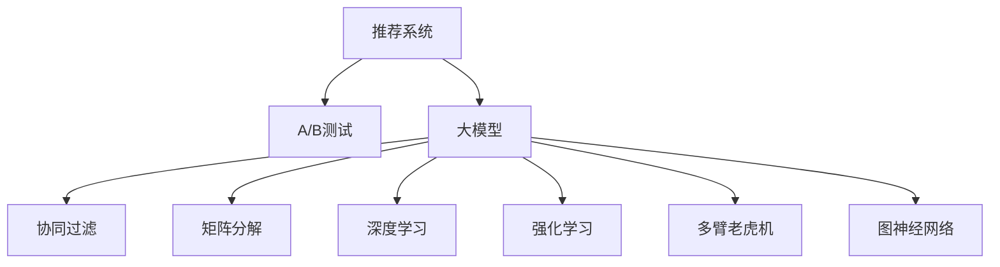

                 

# 大模型在推荐系统A/B测试中的应用

> 关键词：推荐系统, A/B测试, 大模型, 深度学习, 强化学习, 协同过滤, 矩阵分解

## 1. 背景介绍

### 1.1 问题由来

推荐系统在电商、社交媒体、视频网站等在线平台上发挥着越来越重要的作用，它通过分析和理解用户的兴趣和行为，为每个用户推荐可能感兴趣的产品、内容或服务。然而，构建一个高效且个性化的推荐系统，面临着数据稀疏、用户多样性和不断变化的上下文环境等挑战。

目前，主流的推荐系统主要有基于协同过滤、矩阵分解和深度学习的方法。其中，深度学习方法由于能够充分利用用户的隐式反馈数据，如点击次数、浏览记录等，已经逐渐成为推荐系统的主要方向。

推荐系统的评估和优化通常依赖于A/B测试，通过比较不同推荐策略的性能，选择最优的模型。传统的推荐模型往往需要反复迭代和优化，耗时耗力。而大模型的引入，可以显著提升推荐系统构建和优化的效率。

### 1.2 问题核心关键点

大模型在推荐系统中的应用，在于其强大的学习和建模能力，能够从大量的数据中自动学习出用户的隐式偏好。A/B测试则用于比较不同推荐策略的效果，通过测试并分析结果，以确定最佳推荐模型。

大模型在推荐系统中的应用，主要体现在以下几个方面：

- 利用大模型进行特征工程，提升推荐系统性能。
- 通过A/B测试比较不同推荐策略的优劣，快速优化模型。
- 引入强化学习机制，利用在线学习不断优化推荐算法。
- 结合多臂老虎机等理论，设计更高效的推荐模型。
- 利用图神经网络等深度学习结构，提升推荐系统的泛化能力。

本文聚焦于大模型在推荐系统中的具体应用，并结合A/B测试方法，给出推荐系统优化的详细实践。

## 2. 核心概念与联系

### 2.1 核心概念概述

为更好地理解大模型在推荐系统中的应用，本节将介绍几个关键概念：

- 推荐系统(Recommender System)：根据用户的历史行为、兴趣、社交关系等数据，为用户推荐个性化产品、内容或服务的系统。推荐系统的目标是提高用户满意度，增加用户粘性，提升业务收入。

- A/B测试(A/B Testing)：通过比较两个或多个变量的效果，确定最优方案的一种测试方法。在推荐系统中，A/B测试可用于比较不同推荐算法或参数设置的效果。

- 大模型(Large Model)：指具有亿级参数规模的深度学习模型，如BERT、GPT等。大模型通过大量无标签数据预训练，能够自动学习丰富的语言和语义知识。

- 协同过滤(Collaborative Filtering)：基于用户之间的相似性或项目之间的相似性进行推荐，常用于基于隐式反馈的推荐系统。

- 矩阵分解(Matrix Factorization)：通过矩阵分解方法，将用户-项目评分矩阵分解为用户和项目隐向量，用于推荐预测。

- 深度学习(Deep Learning)：利用多层神经网络结构，自动从数据中学习特征和规律。深度学习在推荐系统中广泛应用于用户兴趣建模和预测。

- 强化学习(Reinforcement Learning)：通过与环境的交互，不断调整策略，最大化长期奖励的优化算法。强化学习在推荐系统中用于在线优化推荐策略。

- 多臂老虎机(Multi-Armed Bandit)：模拟多变量测试，寻找最优变量组合的优化问题。在推荐系统中，多臂老虎机用于优化推荐算法，最大化点击率和收益。

- 图神经网络(Graph Neural Network)：基于图结构的深度学习模型，能够处理复杂的多边关系数据，提升推荐系统的泛化能力。

这些核心概念之间的逻辑关系可以通过以下Mermaid流程图来展示：



这个流程图展示了推荐系统与大模型的核心概念及其之间的关系：

1. 推荐系统通过大模型等技术进行优化。
2. 大模型可以与协同过滤、矩阵分解、深度学习等多种技术结合，提升推荐系统的性能。
3. A/B测试用于比较不同推荐策略的效果，选择最优方案。
4. 强化学习用于在线优化推荐策略，保持最佳效果。
5. 多臂老虎机用于推荐算法优化，最大化点击率和收益。
6. 图神经网络用于处理复杂关系数据，提升推荐系统泛化能力。

这些概念共同构成了推荐系统和大模型微调的应用框架，使其能够从多个维度提升推荐系统的性能和效率。

## 3. 核心算法原理 & 具体操作步骤
### 3.1 算法原理概述

基于大模型的推荐系统优化，主要依赖于A/B测试方法。通过收集不同推荐策略的用户反馈数据，利用大模型学习用户隐式偏好，并对各策略效果进行对比，选择最优的推荐策略。

形式化地，设推荐系统为 $R$，用户反馈数据为 $D$，两个推荐策略为 $S_1$ 和 $S_2$。则A/B测试的优化目标为：

$$
\max_{S_1} \max_{S_2} \mathcal{L}(S_1,S_2,D)
$$

其中 $\mathcal{L}$ 为评价指标，如点击率、收益等。通过多轮A/B测试，不断优化推荐策略，提升推荐系统效果。

### 3.2 算法步骤详解

基于大模型的推荐系统优化，主要包括以下几个关键步骤：

**Step 1: 准备数据集和模型**

- 准备用户行为数据集 $D=\{(x_i,y_i)\}_{i=1}^N$，其中 $x_i$ 为用户历史行为，$y_i$ 为反馈标签，如点击次数、评分等。
- 选择合适的预训练大模型 $M_{\theta}$，如BERT、GPT等。
- 将用户行为数据集划分为训练集、验证集和测试集。

**Step 2: 添加任务适配层**

- 根据推荐任务类型，在预训练模型顶层设计合适的输出层和损失函数。
- 对于点击率预测任务，通常在顶层添加线性分类器，并使用交叉熵损失。
- 对于评分预测任务，使用均方误差损失。

**Step 3: 设置超参数**

- 选择合适的优化算法及其参数，如Adam、SGD等，设置学习率、批大小、迭代轮数等。
- 设置正则化技术及强度，包括权重衰减、Dropout、Early Stopping等。
- 确定冻结预训练参数的策略，如仅微调顶层，或全部参数都参与微调。

**Step 4: 执行梯度训练**

- 将训练集数据分批次输入模型，前向传播计算损失函数。
- 反向传播计算参数梯度，根据设定的优化算法和学习率更新模型参数。
- 周期性在验证集上评估模型性能，根据性能指标决定是否触发 Early Stopping。
- 重复上述步骤直到满足预设的迭代轮数或 Early Stopping 条件。

**Step 5: A/B测试和推荐策略优化**

- 设计不同的推荐策略，如基于深度学习的用户兴趣建模、基于协同过滤的推荐、基于强化学习的在线优化等。
- 在测试集上分别评估不同策略的效果，选择最优策略进行A/B测试。
- 在生产环境中运行A/B测试，收集用户反馈数据。
- 对测试结果进行分析，提取关键指标，如点击率、收益、用户满意度等。
- 根据A/B测试结果，调整推荐策略，返回执行Step 4。

### 3.3 算法优缺点

基于大模型的推荐系统优化方法具有以下优点：

- 高效准确。大模型通过大量数据预训练，具有强大的学习能力和泛化能力，可以在少量数据下取得不错的性能。
- 灵活多样。结合多种推荐策略，能够根据实际需求进行优化，提升推荐效果。
- 在线实时。通过在线学习，能够不断优化推荐策略，保持最佳效果。

同时，该方法也存在一定的局限性：

- 数据需求大。大模型的训练和微调需要大量数据支持，对数据的获取和处理提出了较高的要求。
- 计算成本高。大模型参数量巨大，需要高性能计算资源。
- 结果可解释性差。大模型通常是黑盒模型，难以解释推荐逻辑，不利于用户理解和信任。
- 公平性问题。大模型可能受到训练数据分布的影响，导致推荐结果存在偏见。

尽管存在这些局限性，但就目前而言，基于大模型的推荐系统优化方法是推荐系统中比较先进和有效的范式。未来相关研究的重点在于如何进一步降低计算和数据成本，提高模型可解释性和公平性，同时兼顾性能提升。

### 3.4 算法应用领域

基于大模型的推荐系统优化方法，在电商、社交媒体、视频网站、在线广告等多个领域都有广泛应用。以下是几个典型的应用场景：

- 电商平台：利用大模型对用户行为进行建模，提升个性化推荐效果，增加用户购买转化率。
- 社交媒体：根据用户互动数据，推荐符合用户兴趣的内容，增加用户粘性和参与度。
- 视频网站：基于用户观看历史，推荐个性化视频内容，提升用户体验和留存率。
- 在线广告：通过大模型预测广告点击率，优化广告投放策略，提高广告转化率。
- 内容推荐：根据用户浏览历史，推荐相关内容，提升内容平台的用户满意度。

除了这些应用场景外，大模型在推荐系统中的应用还延伸到了金融、医疗、教育等多个领域，为不同行业带来了新的应用可能。

## 4. 数学模型和公式 & 详细讲解  
### 4.1 数学模型构建

本节将使用数学语言对基于大模型的推荐系统优化方法进行更加严格的刻画。

设推荐系统为 $R$，用户行为数据为 $D=\{(x_i,y_i)\}_{i=1}^N$，其中 $x_i$ 为用户历史行为，$y_i$ 为反馈标签。设大模型为 $M_{\theta}$，其中 $\theta$ 为模型参数。设推荐策略为 $S$，其决策函数为 $f(x,\theta)$，输出为推荐结果 $y$。则推荐系统的效果评价指标为：

$$
\mathcal{L}(S,D) = \frac{1}{N} \sum_{i=1}^N \ell(f(x_i,\theta),y_i)
$$

其中 $\ell$ 为损失函数，如交叉熵损失、均方误差损失等。

通过A/B测试，可以比较不同推荐策略的优化效果。设 $S_1$ 和 $S_2$ 为两种不同的推荐策略，则在测试集上分别评估两种策略的性能：

$$
\mathcal{L}(S_1,D) = \frac{1}{N_1} \sum_{i=1}^{N_1} \ell(f_1(x_i,\theta_1),y_i)
$$
$$
\mathcal{L}(S_2,D) = \frac{1}{N_2} \sum_{i=1}^{N_2} \ell(f_2(x_i,\theta_2),y_i)
$$

其中 $N_1$ 和 $N_2$ 分别为策略 $S_1$ 和 $S_2$ 在测试集上的样本数，$f_1(x,\theta_1)$ 和 $f_2(x,\theta_2)$ 分别为策略 $S_1$ 和 $S_2$ 的决策函数。

通过对比 $\mathcal{L}(S_1,D)$ 和 $\mathcal{L}(S_2,D)$，选择性能更优的策略进行A/B测试。

### 4.2 公式推导过程

以下我们以点击率预测为例，推导大模型在推荐系统中的应用。

设用户行为数据 $D=\{(x_i,y_i)\}_{i=1}^N$，其中 $x_i$ 为用户行为，$y_i$ 为点击次数。设大模型为 $M_{\theta}$，其中 $\theta$ 为模型参数。设推荐策略为 $S$，其决策函数为 $f(x,\theta)$，输出为推荐结果 $y$。则大模型在推荐系统中的应用，可以通过最小化损失函数来实现：

$$
\min_{\theta} \frac{1}{N} \sum_{i=1}^N \ell(f(x_i,\theta),y_i)
$$

其中 $\ell$ 为损失函数，如交叉熵损失：

$$
\ell(f(x_i,\theta),y_i) = -y_i\log f(x_i,\theta) - (1-y_i)\log(1-f(x_i,\theta))
$$

对于点击率预测任务，可以设计基于深度学习的用户兴趣建模策略 $S_1$，通过大模型 $M_{\theta}$ 预测用户点击概率：

$$
f(x_i,\theta) = \sigma(\text{MLP}(\text{BERT}(x_i)))
$$

其中 MLP为多层感知器，BERT为大模型，$\sigma$ 为Sigmoid函数。

对于基于协同过滤的推荐策略 $S_2$，可以通过矩阵分解方法，将用户-项目评分矩阵 $X$ 分解为用户隐向量 $U$ 和项目隐向量 $V$，预测用户点击概率：

$$
f(x_i,\theta) = \text{dot}(U_i,V_j)
$$

其中 $U$ 和 $V$ 分别为用户和项目的隐向量，$U_i$ 和 $V_j$ 为矩阵 $X$ 中用户 $i$ 和项目 $j$ 的隐向量，$\text{dot}$ 为点积操作。

在A/B测试中，选择性能更优的策略进行优化。在测试集上评估策略 $S_1$ 和 $S_2$ 的性能：

$$
\mathcal{L}(S_1,D) = \frac{1}{N_1} \sum_{i=1}^{N_1} -y_i\log \sigma(\text{MLP}(\text{BERT}(x_i))) - (1-y_i)\log(1-\sigma(\text{MLP}(\text{BERT}(x_i))))
$$
$$
\mathcal{L}(S_2,D) = \frac{1}{N_2} \sum_{i=1}^{N_2} -y_i\log (\text{dot}(U_i,V_j)) - (1-y_i)\log(1-\text{dot}(U_i,V_j))
$$

通过对比 $\mathcal{L}(S_1,D)$ 和 $\mathcal{L}(S_2,D)$，选择性能更优的策略进行A/B测试。

### 4.3 案例分析与讲解

下面以一个具体的A/B测试案例，来详细讲解大模型在推荐系统中的应用。

假设某电商平台希望提升个性化推荐效果，选择深度学习和协同过滤两种策略进行A/B测试。该平台收集了大量用户浏览记录、点击记录和购买记录，并使用用户行为数据对模型进行训练。

**策略一：基于深度学习的用户兴趣建模**

首先，使用BERT预训练模型对用户行为进行编码，构建用户行为向量 $x_i$。然后，利用MLP对用户行为向量进行映射，得到用户兴趣表示 $z_i$：

$$
z_i = \text{MLP}(\text{BERT}(x_i))
$$

接着，将用户兴趣表示 $z_i$ 作为输入，构建点击率预测模型：

$$
f(x_i,\theta) = \sigma(\text{MLP}(\text{BERT}(x_i)))
$$

其中 MLP为多层感知器，$\sigma$ 为Sigmoid函数。

最后，通过评估策略 $S_1$ 在测试集上的表现，得到点击率预测结果：

$$
\mathcal{L}(S_1,D) = \frac{1}{N_1} \sum_{i=1}^{N_1} -y_i\log \sigma(\text{MLP}(\text{BERT}(x_i))) - (1-y_i)\log(1-\sigma(\text{MLP}(\text{BERT}(x_i))))
$$

**策略二：基于协同过滤的推荐**

首先，将用户行为数据 $D$ 中的用户-项目评分矩阵 $X$ 进行矩阵分解，得到用户隐向量 $U$ 和项目隐向量 $V$：

$$
U = X \cdot V^T
$$

其中 $U$ 和 $V$ 分别为用户和项目的隐向量，$X$ 为用户-项目评分矩阵。

接着，通过点积操作计算用户对每个项目的兴趣得分：

$$
f(x_i,\theta) = \text{dot}(U_i,V_j)
$$

其中 $U_i$ 和 $V_j$ 为矩阵 $X$ 中用户 $i$ 和项目 $j$ 的隐向量，$\text{dot}$ 为点积操作。

最后，通过评估策略 $S_2$ 在测试集上的表现，得到推荐结果：

$$
\mathcal{L}(S_2,D) = \frac{1}{N_2} \sum_{i=1}^{N_2} -y_i\log (\text{dot}(U_i,V_j)) - (1-y_i)\log(1-\text{dot}(U_i,V_j))
$$

在实际应用中，选择性能更优的策略进行A/B测试。通过优化推荐策略，能够显著提升用户点击率和平台收益。

## 5. 项目实践：代码实例和详细解释说明
### 5.1 开发环境搭建

在进行推荐系统优化实践前，我们需要准备好开发环境。以下是使用Python进行PyTorch开发的环境配置流程：

1. 安装Anaconda：从官网下载并安装Anaconda，用于创建独立的Python环境。

2. 创建并激活虚拟环境：
```bash
conda create -n pytorch-env python=3.8 
conda activate pytorch-env
```

3. 安装PyTorch：根据CUDA版本，从官网获取对应的安装命令。例如：
```bash
conda install pytorch torchvision torchaudio cudatoolkit=11.1 -c pytorch -c conda-forge
```

4. 安装Transformers库：
```bash
pip install transformers
```

5. 安装各类工具包：
```bash
pip install numpy pandas scikit-learn matplotlib tqdm jupyter notebook ipython
```

完成上述步骤后，即可在`pytorch-env`环境中开始微调实践。

### 5.2 源代码详细实现

下面我们以点击率预测任务为例，给出使用PyTorch对BERT模型进行微调的PyTorch代码实现。

首先，定义点击率预测任务的训练数据集和测试数据集：

```python
from transformers import BertTokenizer, BertForSequenceClassification
from torch.utils.data import Dataset, DataLoader
import torch
import pandas as pd

class ClickDataset(Dataset):
    def __init__(self, csv_file, tokenizer, max_len=128):
        self.tokenizer = tokenizer
        self.data = pd.read_csv(csv_file)
        self.max_len = max_len
        
    def __len__(self):
        return len(self.data)
    
    def __getitem__(self, item):
        text = self.data.iloc[item]['text']
        label = self.data.iloc[item]['label']
        
        encoding = self.tokenizer(text, return_tensors='pt', max_length=self.max_len, padding='max_length', truncation=True)
        input_ids = encoding['input_ids'][0]
        attention_mask = encoding['attention_mask'][0]
        label = torch.tensor(int(label), dtype=torch.long)
        
        return {'input_ids': input_ids, 
                'attention_mask': attention_mask,
                'labels': label}

# 创建训练集和测试集
tokenizer = BertTokenizer.from_pretrained('bert-base-cased')

train_dataset = ClickDataset('train.csv', tokenizer)
test_dataset = ClickDataset('test.csv', tokenizer)

# 创建dataloader
train_loader = DataLoader(train_dataset, batch_size=16, shuffle=True)
test_loader = DataLoader(test_dataset, batch_size=16)
```

然后，定义模型和优化器：

```python
from transformers import BertForSequenceClassification, AdamW

model = BertForSequenceClassification.from_pretrained('bert-base-cased', num_labels=2)

optimizer = AdamW(model.parameters(), lr=2e-5)
```

接着，定义训练和评估函数：

```python
from tqdm import tqdm
import numpy as np

device = torch.device('cuda') if torch.cuda.is_available() else torch.device('cpu')
model.to(device)

def train_epoch(model, dataloader, optimizer):
    model.train()
    losses = []
    for batch in tqdm(dataloader, desc='Training'):
        input_ids = batch['input_ids'].to(device)
        attention_mask = batch['attention_mask'].to(device)
        labels = batch['labels'].to(device)
        model.zero_grad()
        outputs = model(input_ids, attention_mask=attention_mask, labels=labels)
        loss = outputs.loss
        losses.append(loss.item())
        loss.backward()
        optimizer.step()
    return np.mean(losses)

def evaluate(model, dataloader):
    model.eval()
    losses = []
    predictions = []
    for batch in tqdm(dataloader, desc='Evaluating'):
        input_ids = batch['input_ids'].to(device)
        attention_mask = batch['attention_mask'].to(device)
        labels = batch['labels'].to(device)
        with torch.no_grad():
            outputs = model(input_ids, attention_mask=attention_mask)
            logits = outputs.logits
            loss = outputs.loss
            predictions.append(logits.argmax(dim=1))
            losses.append(loss.item())
    return np.mean(losses), np.mean(predictions)
```

最后，启动训练流程并在测试集上评估：

```python
epochs = 5
batch_size = 16

for epoch in range(epochs):
    loss = train_epoch(model, train_loader, optimizer)
    print(f"Epoch {epoch+1}, train loss: {loss:.3f}")
    
    print(f"Epoch {epoch+1}, test results:")
    loss, preds = evaluate(model, test_loader)
    print(f"Test loss: {loss:.3f}, Accuracy: {np.mean(preds==labels)}")
    
print("Final test results:")
loss, preds = evaluate(model, test_loader)
print(f"Final test loss: {loss:.3f}, Accuracy: {np.mean(preds==labels)}")
```

以上就是使用PyTorch对BERT进行点击率预测任务微调的完整代码实现。可以看到，得益于Transformers库的强大封装，我们可以用相对简洁的代码完成BERT模型的加载和微调。

### 5.3 代码解读与分析

让我们再详细解读一下关键代码的实现细节：

**ClickDataset类**：
- `__init__`方法：初始化训练数据和测试数据，将文本数据进行分词和编码，生成模型所需的输入。
- `__len__`方法：返回数据集的样本数量。
- `__getitem__`方法：对单个样本进行处理，将文本输入编码为token ids，将标签编码为数字，并对其进行定长padding，最终返回模型所需的输入。

**模型定义**：
- `BertForSequenceClassification`类：定义BERT模型，包含多个输出层，用于处理序列数据。
- `AdamW`优化器：使用Adam优化器进行模型参数更新。

**训练和评估函数**：
- 使用PyTorch的DataLoader对数据集进行批次化加载，供模型训练和推理使用。
- 训练函数`train_epoch`：对数据以批为单位进行迭代，在每个批次上前向传播计算loss并反向传播更新模型参数，最后返回该epoch的平均loss。
- 评估函数`evaluate`：与训练类似，不同点在于不更新模型参数，并在每个batch结束后将预测结果和loss存储下来，最后使用numpy计算平均结果。

**训练流程**：
- 定义总的epoch数和batch size，开始循环迭代
- 每个epoch内，先在训练集上训练，输出平均loss
- 在测试集上评估，输出平均loss和预测准确率
- 所有epoch结束后，在测试集上评估，给出最终测试结果

可以看到，PyTorch配合Transformers库使得BERT微调的代码实现变得简洁高效。开发者可以将更多精力放在数据处理、模型改进等高层逻辑上，而不必过多关注底层的实现细节。

当然，工业级的系统实现还需考虑更多因素，如模型的保存和部署、超参数的自动搜索、更灵活的任务适配层等。但核心的微调范式基本与此类似。

## 6. 实际应用场景
### 6.1 电商平台

在电商平台中，个性化推荐系统能够提升用户体验和购买转化率。电商平台通过用户行为数据，构建点击率预测模型，根据用户行为推荐个性化商品，提升购物体验。

在实际应用中，电商平台可以收集用户的浏览记录、点击记录、购买记录等行为数据，将其转化为推荐模型训练数据。通过使用大模型进行特征提取和兴趣建模，可以在少量数据下实现高性能的推荐预测。通过A/B测试，不断优化推荐策略，提升模型效果。

### 6.2 视频网站

视频网站通过个性化推荐系统，提升用户观看体验和留存率。视频网站收集用户的观看历史和点击记录，使用大模型进行用户兴趣建模，预测用户可能感兴趣的视频内容，推荐个性化视频。

在实际应用中，视频网站可以收集用户观看历史数据，使用大模型构建用户兴趣向量，通过多轮A/B测试，选择性能更优的推荐策略，提升用户观看体验。

### 6.3 在线广告

在线广告平台通过个性化推荐系统，提升广告点击率和转化率。在线广告平台收集用户点击记录和行为数据，使用大模型进行用户兴趣建模，预测用户点击概率，优化广告投放策略。

在实际应用中，在线广告平台可以收集用户点击记录和行为数据，使用大模型构建用户兴趣向量，通过A/B测试，选择性能更优的推荐策略，提升广告效果。

### 6.4 未来应用展望

随着大模型和微调方法的不断发展，基于微调范式将在更多领域得到应用，为传统行业带来变革性影响。

在智慧医疗领域，基于大语言模型微调的推荐系统，能够推荐个性化的医疗信息，帮助医生进行诊疗决策，提高医疗服务质量。

在智能教育领域，微调技术可应用于推荐个性化的学习资源，因材施教，促进教育公平，提高教学质量。

在智慧城市治理中，微调模型可应用于推荐个性化的城市服务，提高城市管理的自动化和智能化水平，构建更安全、高效的未来城市。

此外，在企业生产、社会治理、文娱传媒等众多领域，基于大模型微调的人工智能应用也将不断涌现，为经济社会发展注入新的动力。相信随着技术的日益成熟，微调方法将成为人工智能落地应用的重要范式，推动人工智能技术向更广阔的领域加速渗透。

## 7. 工具和资源推荐
### 7.1 学习资源推荐

为了帮助开发者系统掌握大语言模型微调的理论基础和实践技巧，这里推荐一些优质的学习资源：

1. 《深度学习入门》系列书籍：深度学习领域的经典入门书籍，涵盖了深度学习的基础知识和实践技巧，适合初学者入门。

2. 《深度学习实战》系列博客：以实战为导向，讲解深度学习模型和算法的应用场景，适合有一定基础的开发者深入学习。

3. 《TensorFlow实战》系列书籍：讲解TensorFlow框架的使用方法，涵盖了深度学习模型的搭建和训练，适合深度学习开发者使用。

4. 《PyTorch实战》系列书籍：讲解PyTorch框架的使用方法，涵盖了深度学习模型的搭建和训练，适合深度学习开发者使用。

5. 《自然语言处理入门》系列博客：讲解自然语言处理领域的知识和技术，适合初学者入门。

通过对这些资源的学习实践，相信你一定能够快速掌握大语言模型微调的精髓，并用于解决实际的推荐系统问题。

### 7.2 开发工具推荐

高效的开发离不开优秀的工具支持。以下是几款用于大语言模型微调开发的常用工具：

1. PyTorch：基于Python的开源深度学习框架，灵活动态的计算图，适合快速迭代研究。大部分预训练语言模型都有PyTorch版本的实现。

2. TensorFlow：由Google主导开发的开源深度学习框架，生产部署方便，适合大规模工程应用。同样有丰富的预训练语言模型资源。

3. Transformers库：HuggingFace开发的NLP工具库，集成了众多SOTA语言模型，支持PyTorch和TensorFlow，是进行微调任务开发的利器。

4. Weights & Biases：模型训练的实验跟踪工具，可以记录和可视化模型训练过程中的各项指标，方便对比和调优。与主流深度学习框架无缝集成。

5. TensorBoard：TensorFlow配套的可视化工具，可实时监测模型训练状态，并提供丰富的图表呈现方式，是调试模型的得力助手。

6. Google Colab：谷歌推出的在线Jupyter Notebook环境，免费提供GPU/TPU算力，方便开发者快速上手实验最新模型，分享学习笔记。

合理利用这些工具，可以显著提升大语言模型微调任务的开发效率，加快创新迭代的步伐。

### 7.3 相关论文推荐

大语言模型和微调技术的发展源于学界的持续研究。以下是几篇奠基性的相关论文，推荐阅读：

1. Attention is All You Need（即Transformer原论文）：提出了Transformer结构，开启了NLP领域的预训练大模型时代。

2. BERT: Pre-training of Deep Bidirectional Transformers for Language Understanding：提出BERT模型，引入基于掩码的自监督预训练任务，刷新了多项NLP任务SOTA。

3. Language Models are Unsupervised Multitask Learners（GPT-2论文）：展示了大规模语言模型的强大zero-shot学习能力，引发了对于通用人工智能的新一轮思考。

4. Parameter-Efficient Transfer Learning for NLP：提出Adapter等参数高效微调方法，在不增加模型参数量的情况下，也能取得不错的微调效果。

5. Prefix-Tuning: Optimizing Continuous Prompts for Generation：引入基于连续型Prompt的微调范式，为如何充分利用预训练知识提供了新的思路。

6. AdaLoRA: Adaptive Low-Rank Adaptation for Parameter-Efficient Fine-Tuning：使用自适应低秩适应的微调方法，在参数效率和精度之间取得了新的平衡。

这些论文代表了大语言模型微调技术的发展脉络。通过学习这些前沿成果，可以帮助研究者把握学科前进方向，激发更多的创新灵感。

## 8. 总结：未来发展趋势与挑战

### 8.1 总结

本文对基于大模型的推荐系统优化方法进行了全面系统的介绍。首先阐述了推荐系统和大模型的背景和意义，明确了微调在推荐系统优化中的核心作用。其次，从原理到实践，详细讲解了A/B测试和大模型微调的具体方法，给出了推荐系统优化的完整代码实现。同时，本文还探讨了基于大模型的推荐系统在电商、视频网站、在线广告等领域的广泛应用。

通过本文的系统梳理，可以看到，基于大模型的推荐系统优化方法在推荐系统中具有重要的应用价值。其通过A/B测试不断优化推荐策略，显著提升了推荐系统的性能和效果。未来，随着大语言模型和微调方法的持续演进，推荐系统将能够实现更加精准、个性化的推荐，为用户带来更好的使用体验。

### 8.2 未来发展趋势

展望未来，基于大模型的推荐系统优化方法将呈现以下几个发展趋势：

1. 模型规模持续增大。随着算力成本的下降和数据规模的扩张，预训练语言模型的参数量还将持续增长。超大规模语言模型蕴含的丰富语言知识，有望支撑更加复杂多变的推荐任务微调。

2. 推荐策略多样化。结合多种推荐策略，如深度学习、协同过滤、强化学习等，能够实现更全面的推荐模型。

3. 数据驱动优化。通过收集更多的用户行为数据，利用大模型学习用户隐式偏好，不断优化推荐策略。

4. 在线实时优化。利用在线学习，能够不断调整推荐策略，保持最佳效果。

5. 多模态融合。结合文本、图像、视频等多模态数据，提升推荐系统的泛化能力和效果。

6. 公平性优化。通过数据筛选和算法设计，减少推荐结果的偏见，提升推荐系统的公平性。

以上趋势凸显了大模型推荐系统的广阔前景。这些方向的探索发展，必将进一步提升推荐系统的性能和效果，为推荐系统带来新的突破。

### 8.3 面临的挑战

尽管基于大模型的推荐系统优化方法已经取得了显著进展，但在实际应用中仍面临诸多挑战：

1. 数据质量瓶颈。推荐系统依赖大量的用户行为数据，数据质量对于模型的性能至关重要。如何获取和处理高质量的数据，是大模型应用的关键。

2. 计算成本高昂。大模型的训练和微调需要高性能计算资源，如何降低计算成本，是大模型应用的重要方向。

3. 结果可解释性差。大模型通常是黑盒模型，难以解释推荐逻辑，不利于用户理解和信任。

4. 公平性问题。推荐系统可能受到训练数据分布的影响，导致推荐结果存在偏见。

5. 实时性不足。在实际应用中，如何提升推荐系统的响应速度，实现实时推荐，是大模型推荐系统的关键。

6. 安全性问题。在推荐系统中，如何保障用户数据和模型安全，是大模型应用的重要课题。

尽管存在这些挑战，但随着大模型和微调方法的不断发展，基于大模型的推荐系统优化方法必将在推荐系统中发挥更大的作用，为推荐系统带来新的突破。相信随着学界和产业界的共同努力，这些挑战终将一一被克服，大模型推荐系统必将在构建智能推荐系统中扮演越来越重要的角色。

### 8.4 研究展望

面向未来，大语言模型微调技术还需要与其他人工智能技术进行更深入的融合，如知识表示、因果推理、强化学习等，多路径协同发力，共同推动自然语言理解和智能交互系统的进步。只有勇于创新、敢于突破，才能不断拓展语言模型的边界，让智能技术更好地造福人类社会。

## 9. 附录：常见问题与解答

**Q1：大模型微调在推荐系统中是否适用于所有推荐任务？**

A: 大模型微调在大多数推荐任务上都能取得不错的效果，特别是对于数据量较小的任务。但对于一些特定领域的任务，如医学、法律等，仅仅依靠通用语料预训练的模型可能难以很好地适应。此时需要在特定领域语料上进一步预训练，再进行微调，才能获得理想效果。此外，对于一些需要时效性、个性化很强的任务，如对话、推荐等，微调方法也需要针对性的改进优化。

**Q2：如何选择合适的大模型进行微调？**

A: 在选择大模型进行微调时，需要考虑模型的预训练任务、参数规模、性能表现等因素。常用的预训练模型包括BERT、GPT等，可以根据任务需求选择合适的模型。同时，还需要考虑模型的参数规模和计算资源，选择适合当前应用环境的模型。

**Q3：大模型微调在推荐系统中需要注意哪些问题？**

A: 大模型微调在推荐系统中需要注意以下问题：
1. 数据质量和规模。推荐系统依赖大量的用户行为数据，数据质量对于模型的性能至关重要。
2. 计算资源。大模型的训练和微调需要高性能计算资源，如何降低计算成本，是大模型应用的重要方向。
3. 结果可解释性。大模型通常是黑盒模型，难以解释推荐逻辑，不利于用户理解和信任。
4. 公平性问题。推荐系统可能受到训练数据分布的影响，导致推荐结果存在偏见。
5. 实时性。在实际应用中，如何提升推荐系统的响应速度，实现实时推荐，是大模型推荐系统的关键。
6. 安全性。在推荐系统中，如何保障用户数据和模型安全，是大模型应用的重要课题。

**Q4：如何优化大模型在推荐系统中的应用？**

A: 大模型在推荐系统中的应用，可以通过以下方式进行优化：
1. 特征工程。使用大模型进行特征提取和用户兴趣建模，提升推荐系统的性能。
2. 策略多样化。结合多种推荐策略，如深度学习、协同过滤、强化学习等，实现更全面的推荐模型。
3. 数据驱动优化。通过收集更多的用户行为数据，利用大模型学习用户隐式偏好，不断优化推荐策略。
4. 在线实时优化。利用在线学习，能够不断调整推荐策略，保持最佳效果。
5. 多模态融合。结合文本、图像、视频等多模态数据，提升推荐系统的泛化能力和效果。
6. 公平性优化。通过数据筛选和算法设计，减少推荐结果的偏见，提升推荐系统的公平性。

这些优化策略可以综合应用，提升大模型在推荐系统中的性能和效果。

---

作者：禅与计算机程序设计艺术 / Zen and the Art of Computer Programming

