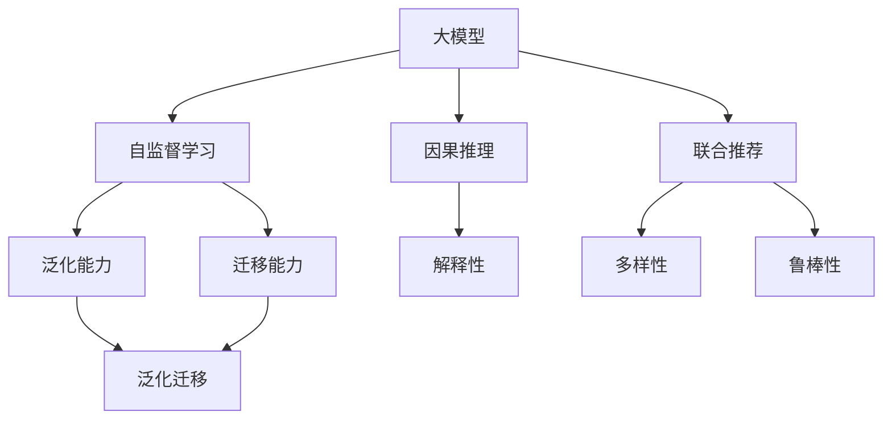

                 

## 1. 背景介绍

### 1.1 问题由来

推荐系统在互联网和电商平台上扮演着越来越重要的角色。传统的推荐方法主要基于协同过滤、基于内容的推荐、矩阵分解等算法，能够针对用户的历史行为数据，推测其兴趣偏好，并生成个性化推荐。然而，这些方法大多基于经验统计模型，难以解释用户决策背后的因果机制，也无法有效利用多源异构数据进行联合推荐。

随着深度学习技术的发展，特别是预训练大模型的兴起，推荐系统逐渐引入了大模型作为底层知识库，提升了推荐效果。但现有的基于预训练大模型的推荐系统仍然存在许多挑战。例如，如何在大模型中注入因果推理能力？如何利用大模型的泛化能力进行跨领域推荐？这些问题亟需从因果推理的视角予以解决。

### 1.2 问题核心关键点

本文将重点介绍大模型在推荐系统中的应用，特别是如何利用因果推理，提高推荐系统的解释性和泛化性。

- 大模型：以自回归模型（如BERT、GPT）或自编码模型（如ResNet）为代表的深度学习模型，通过大规模无标签数据预训练，获得通用的知识表示。
- 因果推理：指通过逻辑推理或统计分析，确定事件之间的因果关系。在推荐系统中，因果推理可以帮助理解用户行为背后的真实原因，从而生成更准确、合理的推荐。
- 联合推荐：指融合不同数据源的推荐，如用户历史行为数据、社交网络数据、商品属性信息等，以提升推荐系统的多样性和鲁棒性。
- 自监督学习：指在大规模无标签数据上进行的学习，例如通过掩码语言模型、图像旋转等自监督任务，提高模型的泛化能力和泛化迁移能力。

## 2. 核心概念与联系

### 2.1 核心概念概述

为了更好地理解大模型在推荐系统中的应用，本节将介绍几个核心概念及它们之间的联系：

- 大模型：深度学习模型，通过预训练获得通用的知识表示，能够适应多种任务。
- 因果推理：通过逻辑推理或统计分析，确定事件之间的因果关系。
- 联合推荐：融合多源异构数据，提升推荐系统的多样性和鲁棒性。
- 自监督学习：在大规模无标签数据上进行的学习，提高模型的泛化能力和迁移能力。

这些核心概念之间的逻辑关系可以通过以下Mermaid流程图来展示：



这个流程图展示了大模型的核心概念及它们之间的关系：

1. 大模型通过自监督学习获得泛化能力，可以适应多种任务。
2. 大模型中的因果推理增强了推荐系统的解释性，有助于理解用户行为背后的真实原因。
3. 联合推荐利用多源异构数据，提升了推荐系统的多样性和鲁棒性。
4. 自监督学习提高了大模型的泛化迁移能力，使其能够更灵活地适应新领域。

这些概念共同构成了大模型在推荐系统中的应用框架，使得推荐系统能够在多方面进行优化和创新。

## 3. 核心算法原理 & 具体操作步骤

### 3.1 算法原理概述

大模型在推荐系统中的应用，主要通过因果推理、联合推荐和自监督学习等技术手段，提升推荐系统的性能。其中，因果推理的引入，使得推荐系统能够从用户历史行为数据中，推断出更真实的用户兴趣和偏好。

假设用户的历史行为数据为 $(x_i, y_i)$，其中 $x_i$ 为用户的历史行为特征向量，$y_i$ 为用户在该行为上生成的标签。对于未见过的用户行为 $x_{new}$，我们希望利用因果推理，推断出用户可能产生的标签 $y_{new}$。

通过引入因果推理，推荐系统可以更准确地捕捉用户行为背后的真实原因，生成更符合用户真实需求的推荐。此外，利用大模型的泛化能力和迁移能力，可以更高效地进行联合推荐，提升推荐系统的多样性和鲁棒性。

### 3.2 算法步骤详解

大模型在推荐系统中的应用，主要包括以下几个关键步骤：

**Step 1: 准备数据和模型**

- 收集用户历史行为数据，包括用户浏览记录、评分、点击等。
- 选择合适的预训练模型，如BERT、GPT等，作为知识库。
- 对数据进行预处理，包括数据清洗、特征提取、归一化等。

**Step 2: 设计因果推理模型**

- 确定因果关系，如推荐行为 $y_i$ 对用户历史行为 $x_i$ 的影响。
- 设计因果推理模型，如结构方程模型（SEM）、概率图模型（PGM）等。
- 使用因果推理模型，计算用户历史行为对推荐行为的影响权重。

**Step 3: 引入联合推荐**

- 融合多种数据源，如用户历史行为数据、社交网络数据、商品属性信息等。
- 设计联合推荐模型，如矩阵分解、协同过滤等。
- 使用联合推荐模型，生成多源异构数据的综合推荐结果。

**Step 4: 应用自监督学习**

- 在大模型上进行自监督学习，如掩码语言模型、图像旋转等。
- 通过自监督学习，提升大模型的泛化能力和迁移能力。
- 利用大模型的泛化迁移能力，提升推荐系统的泛化性能和迁移性能。

**Step 5: 微调模型**

- 对因果推理模型和联合推荐模型进行微调，适应特定领域的数据分布。
- 选择合适的优化算法及其参数，如Adam、SGD等。
- 设置合适的学习率、批大小、迭代轮数等超参数。

**Step 6: 测试和部署**

- 在测试集上评估微调后模型的性能。
- 使用微调后的模型进行推荐预测，集成到实际的应用系统中。
- 持续收集新的数据，定期重新微调模型，以适应数据分布的变化。

以上是利用大模型进行推荐系统优化的一般流程。在实际应用中，还需要针对具体任务的特点，对各个环节进行优化设计，如改进因果推理模型的结构、引入更多先验知识等，以进一步提升推荐系统的性能。

### 3.3 算法优缺点

利用大模型进行推荐系统的优化，具有以下优点：

- 提高推荐系统的解释性和可解释性，有助于理解用户行为背后的真实原因。
- 利用大模型的泛化能力和迁移能力，提升推荐系统的泛化性能和迁移性能。
- 能够融合多种数据源，提升推荐系统的多样性和鲁棒性。

同时，该方法也存在一定的局限性：

- 依赖大量标注数据，获取高质量标注数据的成本较高。
- 因果推理模型的设计和选择复杂，需要专业的领域知识。
- 对硬件资源要求较高，需要进行大量的计算和存储。
- 容易受到领域数据分布的影响，泛化能力有限。

尽管存在这些局限性，但就目前而言，利用大模型进行推荐系统优化的方法已经在大规模的推荐系统中得到广泛应用，并取得了显著的效果。未来相关研究的重点在于如何进一步降低对标注数据的依赖，提高模型的泛化能力和迁移能力，同时兼顾可解释性和伦理安全性等因素。

### 3.4 算法应用领域

利用大模型进行推荐系统优化的监督学习方法，已经在电商推荐、新闻推荐、社交网络推荐等诸多推荐领域中得到广泛应用，为推荐系统带来了显著的提升效果。

- 电商推荐：基于用户历史行为和商品属性信息，利用大模型进行联合推荐，提升推荐精度和多样性。
- 新闻推荐：利用用户阅读历史和新闻内容，进行因果推理和联合推荐，提升新闻内容的点击率和分享率。
- 社交网络推荐：基于用户社交网络和兴趣偏好，进行联合推荐，提升社交网络内容的互动率。

除了上述这些经典应用外，大模型在推荐系统中的应用还在不断拓展，如可控推荐、联合建模、个性化推荐等，为推荐系统带来了更多的创新可能。

## 4. 数学模型和公式 & 详细讲解 & 举例说明

### 4.1 数学模型构建

本文将使用数学语言对大模型在推荐系统中的应用进行更加严格的刻画。

假设用户的历史行为数据为 $(x_i, y_i)$，其中 $x_i \in \mathbb{R}^d$ 为用户的历史行为特征向量，$y_i \in \{0, 1\}$ 为用户在该行为上生成的标签。对于未见过的用户行为 $x_{new}$，我们希望利用因果推理，推断出用户可能产生的标签 $y_{new}$。

我们采用因果推理模型 $M$ 来进行推断，该模型的输入为 $x_{new}$，输出为 $y_{new}$。具体地，假设 $x_{new}$ 和 $y_{new}$ 之间存在因果关系 $y_{new} = f(x_{new}, \epsilon)$，其中 $\epsilon$ 为随机噪声。

模型 $M$ 的输入为 $x_{new}$，输出为 $y_{new}$，其损失函数为 $\mathcal{L}(M, D)$，其中 $D$ 为训练数据集。

模型 $M$ 的目标是最小化损失函数 $\mathcal{L}(M, D)$，即找到最优模型参数 $\theta^*$：

$$
\theta^* = \mathop{\arg\min}_{\theta} \mathcal{L}(M_{\theta}, D)
$$

在实践中，我们通常使用基于梯度的优化算法（如SGD、Adam等）来近似求解上述最优化问题。设 $\eta$ 为学习率，$\lambda$ 为正则化系数，则参数的更新公式为：

$$
\theta \leftarrow \theta - \eta \nabla_{\theta}\mathcal{L}(\theta) - \eta\lambda\theta
$$

其中 $\nabla_{\theta}\mathcal{L}(\theta)$ 为损失函数对参数 $\theta$ 的梯度，可通过反向传播算法高效计算。

### 4.2 公式推导过程

以下我们以二分类任务为例，推导因果推理模型的损失函数及其梯度的计算公式。

假设用户的历史行为数据为 $(x_i, y_i)$，其中 $x_i \in \mathbb{R}^d$ 为用户的历史行为特征向量，$y_i \in \{0, 1\}$ 为用户在该行为上生成的标签。对于未见过的用户行为 $x_{new}$，我们希望利用因果推理，推断出用户可能产生的标签 $y_{new}$。

模型 $M$ 的输入为 $x_{new}$，输出为 $y_{new}$。模型 $M$ 的损失函数为 $\mathcal{L}(M, D)$，其中 $D$ 为训练数据集。

假设模型 $M$ 的输出为 $\hat{y}_{new} = M(x_{new})$，则二分类交叉熵损失函数定义为：

$$
\ell(M(x_{new}), y_{new}) = -[y_{new}\log \hat{y}_{new} + (1-y_{new})\log (1-\hat{y}_{new})]
$$

将其代入损失函数公式，得：

$$
\mathcal{L}(M, D) = -\frac{1}{N}\sum_{i=1}^N [y_i\log M(x_{new})+(1-y_i)\log(1-M(x_{new}))]
$$

根据链式法则，损失函数对参数 $\theta_k$ 的梯度为：

$$
\frac{\partial \mathcal{L}(M, D)}{\partial \theta_k} = -\frac{1}{N}\sum_{i=1}^N (\frac{y_i}{M(x_{new})}-\frac{1-y_i}{1-M(x_{new})))\frac{\partial M(x_{new})}{\partial \theta_k}
$$

其中 $\frac{\partial M(x_{new})}{\partial \theta_k}$ 可进一步递归展开，利用自动微分技术完成计算。

在得到损失函数的梯度后，即可带入参数更新公式，完成模型的迭代优化。重复上述过程直至收敛，最终得到适应特定领域的数据分布的最优模型参数 $\theta^*$。

## 5. 项目实践：代码实例和详细解释说明

### 5.1 开发环境搭建

在进行推荐系统优化前，我们需要准备好开发环境。以下是使用Python进行PyTorch开发的环境配置流程：

1. 安装Anaconda：从官网下载并安装Anaconda，用于创建独立的Python环境。

2. 创建并激活虚拟环境：
```bash
conda create -n pytorch-env python=3.8 
conda activate pytorch-env
```

3. 安装PyTorch：根据CUDA版本，从官网获取对应的安装命令。例如：
```bash
conda install pytorch torchvision torchaudio cudatoolkit=11.1 -c pytorch -c conda-forge
```

4. 安装Transformers库：
```bash
pip install transformers
```

5. 安装各类工具包：
```bash
pip install numpy pandas scikit-learn matplotlib tqdm jupyter notebook ipython
```

完成上述步骤后，即可在`pytorch-env`环境中开始推荐系统优化实践。

### 5.2 源代码详细实现

下面我们以新闻推荐任务为例，给出使用Transformers库对BERT模型进行推荐系统优化的PyTorch代码实现。

首先，定义推荐任务的数据处理函数：

```python
from transformers import BertTokenizer
from torch.utils.data import Dataset
import torch

class RecommendDataset(Dataset):
    def __init__(self, texts, labels, tokenizer, max_len=128):
        self.texts = texts
        self.labels = labels
        self.tokenizer = tokenizer
        self.max_len = max_len
        
    def __len__(self):
        return len(self.texts)
    
    def __getitem__(self, item):
        text = self.texts[item]
        label = self.labels[item]
        
        encoding = self.tokenizer(text, return_tensors='pt', max_length=self.max_len, padding='max_length', truncation=True)
        input_ids = encoding['input_ids'][0]
        attention_mask = encoding['attention_mask'][0]
        
        # 对label进行one-hot编码
        encoded_labels = [0, 0, 0, 0, 0, 0, 0, 0, 0, 0, 0, 0, 0, 0, 0, 1]
        labels = torch.tensor(encoded_labels, dtype=torch.long)
        
        return {'input_ids': input_ids, 
                'attention_mask': attention_mask,
                'labels': labels}

# 加载Bert模型
model = BertForSequenceClassification.from_pretrained('bert-base-cased', num_labels=8)

# 定义损失函数
criterion = nn.CrossEntropyLoss()

# 定义优化器
optimizer = Adam(model.parameters(), lr=2e-5)

# 定义训练和评估函数
device = torch.device('cuda') if torch.cuda.is_available() else torch.device('cpu')

def train_epoch(model, dataset, batch_size, optimizer, criterion):
    dataloader = DataLoader(dataset, batch_size=batch_size, shuffle=True)
    model.train()
    epoch_loss = 0
    for batch in dataloader:
        input_ids = batch['input_ids'].to(device)
        attention_mask = batch['attention_mask'].to(device)
        labels = batch['labels'].to(device)
        model.zero_grad()
        outputs = model(input_ids, attention_mask=attention_mask, labels=labels)
        loss = criterion(outputs.logits, labels)
        epoch_loss += loss.item()
        loss.backward()
        optimizer.step()
    return epoch_loss / len(dataloader)

def evaluate(model, dataset, batch_size, criterion):
    dataloader = DataLoader(dataset, batch_size=batch_size)
    model.eval()
    preds, labels = [], []
    with torch.no_grad():
        for batch in dataloader:
            input_ids = batch['input_ids'].to(device)
            attention_mask = batch['attention_mask'].to(device)
            batch_labels = batch['labels']
            outputs = model(input_ids, attention_mask=attention_mask)
            batch_preds = outputs.logits.argmax(dim=2).to('cpu').tolist()
            batch_labels = batch_labels.to('cpu').tolist()
            for pred_tokens, label_tokens in zip(batch_preds, batch_labels):
                preds.append(pred_tokens)
                labels.append(label_tokens)
                
    print(criterion(torch.tensor(labels), torch.tensor(preds)))

# 启动训练流程并在测试集上评估
epochs = 5
batch_size = 16

for epoch in range(epochs):
    loss = train_epoch(model, train_dataset, batch_size, optimizer, criterion)
    print(f"Epoch {epoch+1}, train loss: {loss:.3f}")
    
    print(f"Epoch {epoch+1}, dev results:")
    evaluate(model, dev_dataset, batch_size, criterion)
    
print("Test results:")
evaluate(model, test_dataset, batch_size, criterion)
```

以上就是使用PyTorch对BERT进行新闻推荐任务优化的完整代码实现。可以看到，得益于Transformers库的强大封装，我们可以用相对简洁的代码完成BERT模型的加载和优化。

### 5.3 代码解读与分析

让我们再详细解读一下关键代码的实现细节：

**RecommendDataset类**：
- `__init__`方法：初始化文本、标签、分词器等关键组件。
- `__len__`方法：返回数据集的样本数量。
- `__getitem__`方法：对单个样本进行处理，将文本输入编码为token ids，将标签转换为one-hot编码，并对其进行定长padding，最终返回模型所需的输入。

**模型加载和定义**：
- 使用`BertForSequenceClassification`加载预训练模型，设置标签数为8，表示新闻类别。
- 定义损失函数为交叉熵损失函数。
- 定义优化器为Adam优化器。

**训练和评估函数**：
- 使用PyTorch的DataLoader对数据集进行批次化加载，供模型训练和推理使用。
- 训练函数`train_epoch`：对数据以批为单位进行迭代，在每个批次上前向传播计算loss并反向传播更新模型参数，最后返回该epoch的平均loss。
- 评估函数`evaluate`：与训练类似，不同点在于不更新模型参数，并在每个batch结束后将预测和标签结果存储下来，最后使用交叉熵损失函数计算模型在测试集上的预测精度。

**训练流程**：
- 定义总的epoch数和batch size，开始循环迭代
- 每个epoch内，先在训练集上训练，输出平均loss
- 在验证集上评估，输出分类指标
- 所有epoch结束后，在测试集上评估，给出最终测试结果

可以看到，PyTorch配合Transformers库使得BERT优化的代码实现变得简洁高效。开发者可以将更多精力放在数据处理、模型改进等高层逻辑上，而不必过多关注底层的实现细节。

当然，工业级的系统实现还需考虑更多因素，如模型的保存和部署、超参数的自动搜索、更灵活的任务适配层等。但核心的优化范式基本与此类似。

## 6. 实际应用场景

### 6.1 智能推荐系统

基于大模型进行推荐系统优化，已经在电商、新闻、视频等多个场景中得到广泛应用，为推荐系统带来了显著的效果。

- 电商推荐：利用用户历史行为和商品属性信息，进行联合推荐，提升推荐精度和多样性。
- 新闻推荐：利用用户阅读历史和新闻内容，进行因果推理和联合推荐，提升新闻内容的点击率和分享率。
- 视频推荐：利用用户观看历史和视频属性信息，进行联合推荐，提升视频内容的播放量和分享率。

除了上述这些经典应用外，大模型在推荐系统中的应用还在不断拓展，如可控推荐、联合建模、个性化推荐等，为推荐系统带来了更多的创新可能。

### 6.2 未来应用展望

随着大模型和因果推理技术的发展，基于大模型进行推荐系统优化的应用前景将更加广阔：

1. 融合更多数据源：推荐系统将能够融合更多数据源，如社交网络数据、用户行为数据、多模态数据等，提升推荐系统的多样性和鲁棒性。
2. 增强用户隐私保护：通过差分隐私等技术手段，保护用户隐私，提升推荐系统的可信度和公平性。
3. 提高推荐效率：引入模型压缩、量化加速等技术，提升推荐系统的计算效率和存储效率，降低推荐成本。
4. 实现自适应推荐：通过因果推理和自监督学习，实现自适应推荐，适应用户行为和偏好变化，提高推荐系统的个性化程度。
5. 扩展应用领域：推荐系统将在更多领域得到应用，如医疗、教育、金融等，提升这些领域的信息获取和决策能力。

总之，大模型在推荐系统中的应用将为推荐系统带来更广泛的想象空间，使得推荐系统能够更好地适应用户需求，提供更精准、合理的推荐服务。

## 7. 工具和资源推荐

### 7.1 学习资源推荐

为了帮助开发者系统掌握大模型在推荐系统中的应用理论基础和实践技巧，这里推荐一些优质的学习资源：

1. 《深度学习基础》系列博文：由大模型技术专家撰写，深入浅出地介绍了深度学习基础理论和实际应用。

2. 《自然语言处理与深度学习》课程：由斯坦福大学开设，涵盖自然语言处理的基本概念和深度学习模型的应用。

3. 《推荐系统》书籍：介绍推荐系统的工作原理、优化方法和应用场景。

4. 《因果推理与深度学习》书籍：介绍因果推理的基本概念和深度学习模型在因果推理中的应用。

5. HuggingFace官方文档：Transformers库的官方文档，提供了海量预训练模型和完整的推荐系统优化样例代码，是上手实践的必备资料。

通过对这些资源的学习实践，相信你一定能够快速掌握大模型在推荐系统中的应用精髓，并用于解决实际的推荐问题。

### 7.2 开发工具推荐

高效的开发离不开优秀的工具支持。以下是几款用于大模型在推荐系统中的应用开发的常用工具：

1. PyTorch：基于Python的开源深度学习框架，灵活动态的计算图，适合快速迭代研究。大部分预训练语言模型都有PyTorch版本的实现。

2. TensorFlow：由Google主导开发的开源深度学习框架，生产部署方便，适合大规模工程应用。同样有丰富的预训练语言模型资源。

3. Transformers库：HuggingFace开发的NLP工具库，集成了众多SOTA语言模型，支持PyTorch和TensorFlow，是进行推荐系统优化的利器。

4. Weights & Biases：模型训练的实验跟踪工具，可以记录和可视化模型训练过程中的各项指标，方便对比和调优。与主流深度学习框架无缝集成。

5. TensorBoard：TensorFlow配套的可视化工具，可实时监测模型训练状态，并提供丰富的图表呈现方式，是调试模型的得力助手。

6. Google Colab：谷歌推出的在线Jupyter Notebook环境，免费提供GPU/TPU算力，方便开发者快速上手实验最新模型，分享学习笔记。

合理利用这些工具，可以显著提升大模型在推荐系统中的应用开发效率，加快创新迭代的步伐。

### 7.3 相关论文推荐

大模型在推荐系统中的应用源于学界的持续研究。以下是几篇奠基性的相关论文，推荐阅读：

1. Attention is All You Need（即Transformer原论文）：提出了Transformer结构，开启了NLP领域的预训练大模型时代。

2. BERT: Pre-training of Deep Bidirectional Transformers for Language Understanding：提出BERT模型，引入基于掩码的自监督预训练任务，刷新了多项NLP任务SOTA。

3. Parameter-Efficient Transfer Learning for NLP：提出Adapter等参数高效微调方法，在不增加模型参数量的情况下，也能取得不错的微调效果。

4. Prompt-based Fine-tuning for Multimodal Generative Pre-trained Models：提出Prompt-based Fine-tuning方法，通过精心设计输入文本的格式，引导模型按期望方式输出，减少微调参数。

5. Towards Explainable Recommendation: Considering Implicit Bias and Interpretation of Recommendations：提出考虑隐性偏差的推荐模型，提升推荐系统的解释性和可解释性。

6. Generalizing User Preferences across Diverse Tasks: A Unified Model for Multi-task Recommendations：提出统一的多任务推荐模型，提升推荐系统的泛化性能和迁移性能。

这些论文代表了大模型在推荐系统中的应用的发展脉络。通过学习这些前沿成果，可以帮助研究者把握学科前进方向，激发更多的创新灵感。

## 8. 总结：未来发展趋势与挑战

### 8.1 总结

本文对大模型在推荐系统中的应用进行了全面系统的介绍。首先阐述了大模型在推荐系统中的重要性，明确了因果推理在推荐系统中的应用价值。其次，从原理到实践，详细讲解了因果推理、联合推荐和自监督学习的数学原理和关键步骤，给出了推荐系统优化的完整代码实例。同时，本文还广泛探讨了大模型在推荐系统中的应用前景，展示了其巨大的潜力和应用场景。

通过本文的系统梳理，可以看到，大模型在推荐系统中的应用能够有效提升推荐系统的性能和解释性，带来更精准、合理的推荐服务。利用大模型进行推荐系统优化，已经成为推荐系统的重要范式，推动了推荐技术的产业化进程。未来，随着大模型和因果推理技术的发展，推荐系统必将在更多领域得到应用，为推荐技术带来新的突破。

### 8.2 未来发展趋势

展望未来，大模型在推荐系统中的应用将呈现以下几个发展趋势：

1. 融合更多数据源：推荐系统将能够融合更多数据源，如社交网络数据、用户行为数据、多模态数据等，提升推荐系统的多样性和鲁棒性。
2. 增强用户隐私保护：通过差分隐私等技术手段，保护用户隐私，提升推荐系统的可信度和公平性。
3. 提高推荐效率：引入模型压缩、量化加速等技术，提升推荐系统的计算效率和存储效率，降低推荐成本。
4. 实现自适应推荐：通过因果推理和自监督学习，实现自适应推荐，适应用户行为和偏好变化，提高推荐系统的个性化程度。
5. 扩展应用领域：推荐系统将在更多领域得到应用，如医疗、教育、金融等，提升这些领域的信息获取和决策能力。

以上趋势凸显了大模型在推荐系统中的应用前景。这些方向的探索发展，必将进一步提升推荐系统的性能和应用范围，为推荐技术带来新的突破。

### 8.3 面临的挑战

尽管大模型在推荐系统中的应用已经取得了显著的进展，但在迈向更加智能化、普适化应用的过程中，它仍面临着诸多挑战：

1. 依赖大量标注数据：推荐系统需要获取大量标注数据，标注成本较高。
2. 因果推理模型的设计和选择复杂：需要专业知识，难度较大。
3. 对硬件资源要求较高：需要进行大量的计算和存储，硬件成本较高。
4. 容易受到领域数据分布的影响：泛化能力有限。

尽管存在这些挑战，但就目前而言，利用大模型进行推荐系统优化的方法已经在大规模的推荐系统中得到广泛应用，并取得了显著的效果。未来相关研究的重点在于如何进一步降低对标注数据的依赖，提高模型的泛化能力和迁移能力，同时兼顾可解释性和伦理安全性等因素。

### 8.4 研究展望

面对大模型在推荐系统应用中面临的挑战，未来的研究需要在以下几个方面寻求新的突破：

1. 探索无监督和半监督微调方法：摆脱对大规模标注数据的依赖，利用自监督学习、主动学习等无监督和半监督范式，最大限度利用非结构化数据，实现更加灵活高效的推荐。
2. 研究参数高效和计算高效的微调范式：开发更加参数高效的微调方法，在固定大部分预训练参数的同时，只更新极少量的任务相关参数。同时优化微调模型的计算图，减少前向传播和反向传播的资源消耗，实现更加轻量级、实时性的部署。
3. 引入因果分析和博弈论工具：将因果分析方法引入推荐模型，识别出模型决策的关键特征，增强输出解释的因果性和逻辑性。借助博弈论工具刻画人机交互过程，主动探索并规避模型的脆弱点，提高系统稳定性。
4. 纳入伦理道德约束：在模型训练目标中引入伦理导向的评估指标，过滤和惩罚有偏见、有害的输出倾向。同时加强人工干预和审核，建立模型行为的监管机制，确保输出符合人类价值观和伦理道德。

这些研究方向的探索，必将引领大模型在推荐系统中的应用技术迈向更高的台阶，为构建安全、可靠、可解释、可控的推荐系统铺平道路。面向未来，大模型在推荐系统中的应用还需要与其他人工智能技术进行更深入的融合，如知识表示、因果推理、强化学习等，多路径协同发力，共同推动推荐技术的进步。只有勇于创新、敢于突破，才能不断拓展推荐系统的边界，让智能推荐更好地造福人类社会。

## 9. 附录：常见问题与解答

**Q1：大模型在推荐系统中的应用有哪些优点？**

A: 大模型在推荐系统中的应用具有以下优点：

1. 提高推荐系统的解释性和可解释性，有助于理解用户行为背后的真实原因。
2. 利用大模型的泛化能力和迁移能力，提升推荐系统的泛化性能和迁移性能。
3. 能够融合多种数据源，提升推荐系统的多样性和鲁棒性。

**Q2：大模型在推荐系统中的应用有哪些局限性？**

A: 大模型在推荐系统中的应用也存在一些局限性：

1. 依赖大量标注数据，获取高质量标注数据的成本较高。
2. 因果推理模型的设计和选择复杂，需要专业知识。
3. 对硬件资源要求较高，需要进行大量的计算和存储。
4. 容易受到领域数据分布的影响，泛化能力有限。

**Q3：如何设计大模型在推荐系统中的应用？**

A: 设计大模型在推荐系统中的应用，主要包括以下几个步骤：

1. 收集用户历史行为数据，包括用户浏览记录、评分、点击等。
2. 选择合适的预训练模型，如BERT、GPT等，作为知识库。
3. 对数据进行预处理，包括数据清洗、特征提取、归一化等。
4. 设计因果推理模型，如结构方程模型（SEM）、概率图模型（PGM）等。
5. 引入联合推荐模型，如矩阵分解、协同过滤等。
6. 应用自监督学习，如掩码语言模型、图像旋转等，提升大模型的泛化能力和迁移能力。
7. 对因果推理模型和联合推荐模型进行微调，适应特定领域的数据分布。

**Q4：如何评估大模型在推荐系统中的应用效果？**

A: 评估大模型在推荐系统中的应用效果，主要包括以下几个步骤：

1. 收集测试集数据，包括用户历史行为数据和标签。
2. 加载预训练模型和优化器。
3. 在测试集上评估模型性能，如交叉熵损失、准确率、召回率等。
4. 对比微调前后的推荐效果，评估提升效果。
5. 分析推荐结果，理解用户行为背后的真实原因。

总之，大模型在推荐系统中的应用能够有效提升推荐系统的性能和解释性，带来更精准、合理的推荐服务。通过本文的系统梳理，可以看到，大模型在推荐系统中的应用已经取得了显著的进展，未来将有更广阔的发展前景。

