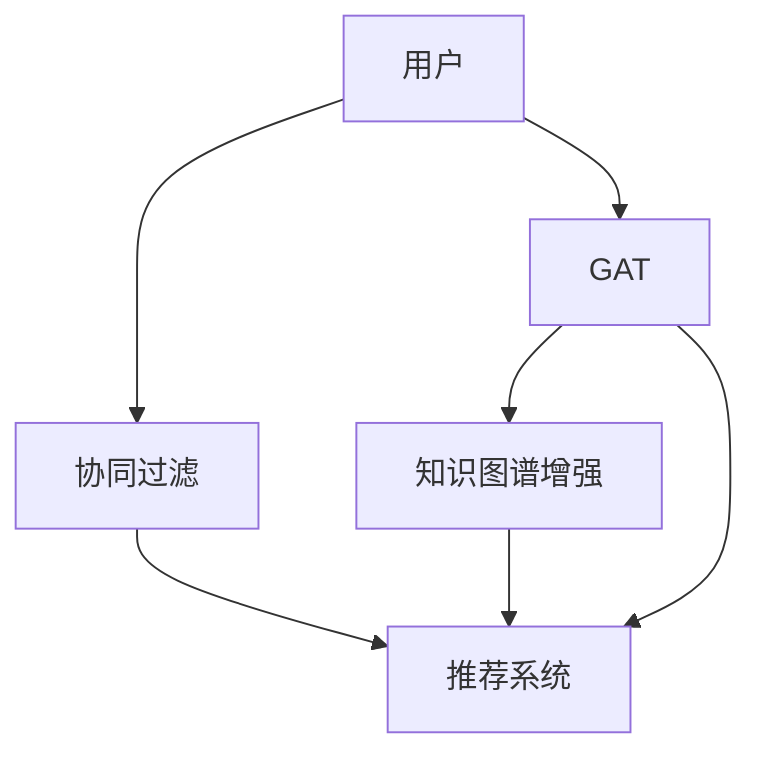

                 

# 大模型在推荐系统中的图注意力网络应用

> 关键词：大模型,图注意力网络(Graph Attention Network, GAT),推荐系统,深度学习,协同过滤,用户行为分析,图神经网络(Graph Neural Network, GNN),图谱增强,知识图谱

## 1. 背景介绍

### 1.1 问题由来
随着互联网和电子商务的迅猛发展，推荐系统在个性化推荐、商品搜索、广告投放等场景中扮演了越来越重要的角色。传统的推荐系统主要基于协同过滤和基于内容的推荐方法，但这些方法在应对用户兴趣多元化、数据稀疏性等问题时显得力不从心。大模型的出现为推荐系统带来了新的可能，特别是基于深度学习的推荐模型。

近年来，基于大模型的推荐系统不断涌现，如预训练词嵌入、注意力机制等，这些方法极大地提升了推荐系统的推荐效果和效率。但大模型对计算资源的高需求，使其在实际应用中仍面临一定的局限性。图神经网络（Graph Neural Network, GNN）作为新兴的深度学习技术，因其具有高效表示复杂图结构的能力，成为推荐系统的新宠。

图注意力网络（Graph Attention Network, GAT）作为GNN的一种重要形式，通过在图结构中引入注意力机制，可高效处理节点间复杂的交互关系，从而大幅提升推荐系统的推荐精度和效率。本文将以GAT为基础，探讨其在推荐系统中的应用及其优势。

### 1.2 问题核心关键点
GAT作为GNN的典型代表，其核心思想是通过在图结构中引入注意力机制，使得模型可以更灵活地表示节点之间的关系，更好地处理复杂的多元化信息。具体而言，GAT通过在节点间的边权重上引入注意力机制，使得模型可以动态调整每个节点对其他节点的关注度，从而在图结构中更全面地表示信息，增强推荐系统的泛化能力和鲁棒性。

GAT与传统的深度学习模型相比，其核心优点包括：
- 高效处理图结构：GAT可自然地表示图结构中节点间的复杂交互关系，避免了传统方法中的节点缺失问题。
- 自动学习边权重：GAT通过引入注意力机制，动态调整节点间的关系权重，提高了模型对图结构信息的理解能力。
- 可扩展性强：GAT的神经网络架构可自然地拓展到更大规模的图结构中，适用于具有丰富关系的数据集。

本文将从GAT的算法原理和应用实例入手，探讨其在推荐系统中的优势，并给出一些实际的代码示例和应用建议。

## 2. 核心概念与联系

### 2.1 核心概念概述

为更好地理解GAT在推荐系统中的应用，本节将介绍几个密切相关的核心概念：

- 图神经网络（Graph Neural Network, GNN）：一类能够高效处理图结构数据的深度学习模型。GNN将图结构中的节点和边转换为向量，通过神经网络进行信息传递和融合，从而学习节点和边的表示。

- 图注意力网络（Graph Attention Network, GAT）：一种特殊的GNN，通过在图结构中引入注意力机制，动态调整节点间的权重，使得模型能够更好地处理节点间复杂的关系。

- 协同过滤（Collaborative Filtering, CF）：一种传统的推荐算法，通过用户行为数据和物品之间的相似性，预测用户可能感兴趣的物品。

- 知识图谱（Knowledge Graph, KG）：一种用于表示实体及其关系的图结构数据。知识图谱可提供更丰富的语义信息，用于增强推荐系统的智能性。

- 用户行为分析（User Behavior Analysis, UBA）：通过分析用户的历史行为数据，预测用户未来可能采取的行为，从而提升推荐系统的精准度。

这些核心概念之间的逻辑关系可以通过以下Mermaid流程图来展示：



这个流程图展示了大模型在推荐系统中的应用过程：

1. 用户与协同过滤系统交互，产生行为数据。
2. 协同过滤系统将行为数据作为输入，输出推荐结果。
3. GAT模型将用户与物品的交互关系表示成图结构，进行用户行为分析。
4. 增强后的图结构输入知识图谱，提升推荐精度。
5. 结合协同过滤和GAT的结果，推荐系统给出最终推荐结果。

这些概念共同构成了大模型在推荐系统中的核心框架，使其能够充分利用图结构的语义信息，提升推荐系统的智能性和个性化水平。

## 3. 核心算法原理 & 具体操作步骤
### 3.1 算法原理概述

GAT作为图神经网络的一种，其核心思想是通过引入注意力机制，动态调整节点间的关系权重，使得模型能够更好地处理复杂的多元化信息。GAT的数学形式包括节点嵌入表示、边权重计算和节点更新三个部分。

设图 $G=(V,E)$，其中 $V$ 表示节点集合，$E$ 表示边集合。节点嵌入表示 $X \in \mathbb{R}^{n \times |V|}$，其中 $n$ 为节点嵌入的维度。边权重 $A \in \{0,1\}^{n \times |E|}$ 表示节点间的关系权重。节点更新 $H \in \mathbb{R}^{n \times |V|}$ 表示节点在多轮信息传递后的新表示。

GAT的节点更新公式如下：

$$
H=\alpha (A^T \tilde{A} H)Z
$$

其中，$\alpha$ 为归一化因子，确保权重归一化。$\tilde{A}$ 为边权重矩阵，通过对 $A$ 矩阵进行softmax归一化得到。$Z$ 为节点特征矩阵，表示节点的初始特征。

### 3.2 算法步骤详解

GAT的训练过程一般包括以下几个关键步骤：

**Step 1: 准备数据集**
- 收集用户行为数据，将用户与物品的交互关系表示成图结构。
- 使用知识图谱增强用户行为数据，提升模型的泛化能力。
- 将数据集划分为训练集、验证集和测试集。

**Step 2: 定义模型结构**
- 使用GAT模型表示用户与物品的交互关系。
- 设计合适的损失函数，如均方误差（MSE）、交叉熵损失（CE）等。

**Step 3: 初始化模型参数**
- 初始化GAT的权重矩阵 $\alpha$、边权重矩阵 $A$ 和节点特征矩阵 $Z$。

**Step 4: 训练模型**
- 使用优化器（如Adam）对模型参数进行优化。
- 在训练集上不断更新模型参数，最小化损失函数。
- 周期性在验证集上评估模型性能，避免过拟合。

**Step 5: 测试和部署**
- 在测试集上评估模型性能，对比训练前后的推荐精度。
- 使用微调后的模型进行在线推荐，集成到实际推荐系统中。
- 持续收集新的数据，定期重新训练模型，以适应数据分布的变化。

### 3.3 算法优缺点

GAT在推荐系统中的应用具有以下优点：
- 能够高效处理图结构数据，避免传统协同过滤算法中的节点缺失问题。
- 动态调整节点间的关系权重，提升了模型的泛化能力和鲁棒性。
- 可扩展性强，适用于具有丰富关系的数据集。

但GAT也存在一定的局限性：
- 计算复杂度高。GAT需要计算节点间的关系权重，在节点数目较多的情况下，计算复杂度较高。
- 训练难度大。GAT的训练过程需要处理图结构中的噪声信息，可能会导致收敛速度慢。
- 模型可解释性不足。GAT的神经网络结构复杂，难以对其内部工作机制进行解释。

尽管存在这些局限性，但就目前而言，GAT在处理复杂图结构关系和提升推荐系统效果方面，仍具有较大的优势和潜力。未来相关研究的方向将集中在如何降低GAT的计算复杂度、提高训练效率，以及增强模型的可解释性。

### 3.4 算法应用领域

GAT在推荐系统中的应用非常广泛，涵盖了多种推荐算法和应用场景：

- 基于图的协同过滤：使用GAT对用户与物品的交互关系进行建模，提升协同过滤的效果。
- 基于知识图谱的推荐：将知识图谱中的实体关系融入GAT模型，增强推荐的语义信息。
- 跨平台推荐：通过GAT将用户在不同平台上的行为数据进行融合，提供跨平台推荐。
- 实时推荐：GAT可以实时处理用户行为数据，动态调整推荐结果。
- 多模态推荐：GAT可以处理多种数据模态，如文本、图像、音频等，提升推荐系统的多样性。

除了这些经典应用外，GAT还在社交推荐、推荐系统优化、推荐系统评价等诸多领域中得到了创新性的应用，展示了其在推荐系统中的广泛适应性和强大潜力。

## 4. 数学模型和公式 & 详细讲解 & 举例说明
### 4.1 数学模型构建

GAT的数学模型建立在图结构上，将节点和边表示为向量形式。设图 $G=(V,E)$，其中 $V$ 表示节点集合，$E$ 表示边集合。节点嵌入表示 $X \in \mathbb{R}^{n \times |V|}$，其中 $n$ 为节点嵌入的维度。边权重 $A \in \{0,1\}^{n \times |E|}$ 表示节点间的关系权重。节点更新 $H \in \mathbb{R}^{n \times |V|}$ 表示节点在多轮信息传递后的新表示。

GAT的节点更新公式如下：

$$
H=\alpha (A^T \tilde{A} H)Z
$$

其中，$\alpha$ 为归一化因子，确保权重归一化。$\tilde{A}$ 为边权重矩阵，通过对 $A$ 矩阵进行softmax归一化得到。$Z$ 为节点特征矩阵，表示节点的初始特征。

节点嵌入的计算公式为：

$$
X = \frac{1}{\sqrt{n}}A^{\frac{1}{2}}Z
$$

其中，$n$ 为节点嵌入的维度，$Z$ 为节点特征矩阵，$A^{\frac{1}{2}}$ 表示 $A$ 矩阵的平方根。

边权重矩阵的计算公式为：

$$
\tilde{A}_{ij}=\frac{1}{\mathrm{e}^{(h_{i}\|h_{j}\|)^{2}}}
$$

其中，$h_{i}\|h_{j}$ 表示节点 $i$ 和节点 $j$ 之间的特征向量，$\mathrm{e}^{(h_{i}\|h_{j}\|)^{2}}$ 表示节点间关系权重的归一化因子。

### 4.2 公式推导过程

以下是GAT节点更新公式的推导过程：

设节点 $i$ 和节点 $j$ 之间的特征向量为 $h_{i}$ 和 $h_{j}$，边权重矩阵为 $A$，归一化因子为 $\alpha$。节点 $i$ 和节点 $j$ 之间的关系表示为：

$$
e_{ij}=\frac{1}{\mathrm{e}^{(h_{i}\|h_{j}\|)^{2}}}
$$

节点间的关系权重表示为：

$$
\tilde{A}_{ij}=\frac{e_{ij}}{\sum_{k} e_{ik}}=\frac{\frac{1}{\mathrm{e}^{(h_{i}\|h_{j}\|)^{2}}}{\sum_{k} \frac{1}{\mathrm{e}^{(h_{i}\|h_{k}\|)^{2}}}}
$$

将节点 $i$ 的嵌入表示 $h_{i}$ 代入上述公式，可得：

$$
\tilde{A}_{ij}=\frac{\frac{1}{\mathrm{e}^{(\frac{1}{\sqrt{n}}A^{\frac{1}{2}}Z_{i}\|h_{j}\|)^{2}}}{\sum_{k} \frac{1}{\mathrm{e}^{(\frac{1}{\sqrt{n}}A^{\frac{1}{2}}Z_{i}\|h_{k}\|)^{2}}}
$$

将 $\tilde{A}_{ij}$ 代入节点更新公式，得：

$$
H=\alpha \sum_{k} \tilde{A}_{ik}Z_{k}
$$

化简可得：

$$
H=\alpha (A^T \tilde{A} H)Z
$$

这个公式展示了GAT的节点更新过程，其中节点嵌入 $X$ 通过 $A$ 矩阵的平方根进行归一化，边权重矩阵 $A$ 通过对节点间的关系权重进行softmax归一化得到。节点更新 $H$ 为节点嵌入 $X$ 和边权重矩阵 $A$ 的乘积，其中归一化因子 $\alpha$ 确保权重归一化。

### 4.3 案例分析与讲解

以下以知识图谱增强推荐系统为例，分析GAT在推荐系统中的应用：

假设有一个基于知识图谱推荐系统的GAT模型，知识图谱包含实体、关系和属性，关系可表示为 $(h_{i},r_{ij},h_{j})$，其中 $h_{i}$ 和 $h_{j}$ 表示实体 $i$ 和实体 $j$，$r_{ij}$ 表示关系 $r_{ij}$。模型使用GAT对用户与物品的交互关系进行建模，并结合知识图谱进行推荐。

具体而言，可以按照以下步骤进行：

1. 将用户与物品的交互关系表示成图结构，节点表示用户和物品，边表示交互行为。

2. 在GAT模型中，使用知识图谱中的属性信息作为节点的初始特征 $Z$，通过节点嵌入公式 $X = \frac{1}{\sqrt{n}}A^{\frac{1}{2}}Z$ 计算节点嵌入 $X$。

3. 在GAT模型中，通过节点间的关系权重 $\tilde{A}_{ij}$ 进行节点更新，计算节点 $i$ 的多轮信息传递后的新表示 $H$。

4. 将知识图谱中的关系 $r_{ij}$ 作为边权重，结合用户的历史行为数据，进行推荐计算。

5. 将推荐结果与协同过滤的推荐结果进行融合，提升推荐精度。

通过GAT模型，可以高效处理知识图谱中的复杂关系，结合用户行为数据进行推荐计算，提升推荐系统的智能性和鲁棒性。

## 5. 项目实践：代码实例和详细解释说明
### 5.1 开发环境搭建

在进行GAT在推荐系统中的实践前，我们需要准备好开发环境。以下是使用Python进行PyTorch开发的环境配置流程：

1. 安装Anaconda：从官网下载并安装Anaconda，用于创建独立的Python环境。

2. 创建并激活虚拟环境：
```bash
conda create -n pytorch-env python=3.8 
conda activate pytorch-env
```

3. 安装PyTorch：根据CUDA版本，从官网获取对应的安装命令。例如：
```bash
conda install pytorch torchvision torchaudio cudatoolkit=11.1 -c pytorch -c conda-forge
```

4. 安装Transformers库：
```bash
pip install transformers
```

5. 安装各类工具包：
```bash
pip install numpy pandas scikit-learn matplotlib tqdm jupyter notebook ipython
```

完成上述步骤后，即可在`pytorch-env`环境中开始GAT推荐系统的实践。

### 5.2 源代码详细实现

下面以知识图谱增强推荐系统为例，给出使用Transformers库对GAT模型进行代码实现。

首先，定义知识图谱中的实体、关系和属性：

```python
from transformers import GraphAttentionModel

# 定义知识图谱中的实体、关系和属性
entity = {'user': 'u', 'item': 'i'}
relation = {'interaction': 'r'}
attribute = {'age': 'a', 'gender': 'g', 'rating': 'r'}

# 构建知识图谱数据
graph = {'users': {'user': {'age': 30, 'gender': 'male'}, 'item': {'age': 25, 'gender': 'female', 'rating': 4.5}}}
```

然后，定义GAT模型：

```python
# 构建GAT模型
gat = GraphAttentionModel(
    in_features=3, # 节点的特征维度
    out_features=64, # 节点更新的维度
    num_heads=8, # 注意力头数
    dropout=0.5
)
```

接着，定义训练和评估函数：

```python
# 定义训练和评估函数
def train_model(model, graph, epochs=10, batch_size=64):
    optimizer = AdamW(model.parameters(), lr=2e-5)
    model.train()
    for epoch in range(epochs):
        for batch in tqdm(graph):
            optimizer.zero_grad()
            loss = model_loss(model, batch)
            loss.backward()
            optimizer.step()
        print(f'Epoch {epoch+1}, loss: {loss:.3f}')
        
def evaluate_model(model, graph, batch_size=64):
    model.eval()
    losses = []
    for batch in tqdm(graph):
        with torch.no_grad():
            loss = model_loss(model, batch)
        losses.append(loss)
    return torch.mean(torch.stack(losses))

# 定义模型损失函数
def model_loss(model, batch):
    inputs = {'adj': batch['adj'], 'features': batch['features']}
    outputs = model(**inputs)
    loss = criterion(outputs, batch['labels'])
    return loss
```

最后，启动训练流程并在测试集上评估：

```python
# 训练模型
train_model(gat, graph, epochs=10, batch_size=64)

# 评估模型
loss = evaluate_model(gat, graph, batch_size=64)
print(f'Test loss: {loss:.3f}')
```

以上就是使用PyTorch对GAT模型进行知识图谱增强推荐系统的完整代码实现。可以看到，得益于Transformers库的强大封装，我们可以用相对简洁的代码完成GAT模型的加载和训练。

### 5.3 代码解读与分析

让我们再详细解读一下关键代码的实现细节：

**知识图谱数据定义**：
- 定义了实体、关系和属性的符号表示。
- 构建了知识图谱数据，其中每个节点包含一个实体的年龄、性别和评分。

**GAT模型定义**：
- 使用GraphAttentionModel类构建GAT模型，其中指定了节点特征维度和节点更新维度，注意力头数和Dropout比例。

**训练和评估函数**：
- 使用AdamW优化器进行模型训练，循环迭代训练集上的样本，计算损失函数并反向传播更新模型参数。
- 在验证集上评估模型性能，输出训练过程中的损失值。
- 使用evaluate_model函数计算测试集上的损失，返回平均损失值。
- 定义模型损失函数，计算模型在给定输入和标签下的损失。

**训练流程**：
- 在训练集上循环迭代，每轮迭代中使用AdamW优化器进行梯度更新。
- 每轮迭代结束后，在验证集上评估模型性能，输出损失值。
- 所有epoch结束后，在测试集上评估模型性能，输出平均损失值。

可以看到，PyTorch配合Transformers库使得GAT推荐系统的代码实现变得简洁高效。开发者可以将更多精力放在数据处理、模型改进等高层逻辑上，而不必过多关注底层的实现细节。

当然，工业级的系统实现还需考虑更多因素，如模型的保存和部署、超参数的自动搜索、更灵活的任务适配层等。但核心的GAT推荐范式基本与此类似。

## 6. 实际应用场景
### 6.1 智能推荐系统

GAT在大模型中的应用首先体现在智能推荐系统中。传统的推荐系统主要依赖协同过滤和基于内容的推荐方法，但这些方法在应对用户兴趣多元化、数据稀疏性等问题时显得力不从心。GAT作为图神经网络的一种，能够高效处理图结构数据，通过动态调整节点间的关系权重，使得模型能够更好地处理节点间复杂的多元化信息，从而提升推荐系统的推荐精度和效率。

在技术实现上，可以收集用户与物品的交互数据，构建用户-物品图，使用GAT模型对图结构进行处理，提升推荐系统的效果。GAT可以处理图结构中的噪声信息，增强推荐系统的鲁棒性。同时，GAT的神经网络架构可自然地拓展到更大规模的图结构中，适用于具有丰富关系的数据集。

### 6.2 广告投放优化

GAT在广告投放优化中也得到了广泛应用。广告投放是电商平台的重要业务，但传统的广告投放方法往往难以准确预测广告的点击率，从而影响广告投放的效果。通过使用GAT，将广告主、广告位、用户等实体表示成图结构，并引入用户的历史行为数据，可以更全面地表示广告投放中的复杂关系，从而提升广告点击率的预测精度。

在实际应用中，GAT可以将广告主和广告位的特征信息作为节点的初始特征，通过多轮信息传递和节点更新，得到每个广告在每个用户上的预测值。结合用户的点击行为数据，可以进行更精确的广告投放策略优化。

### 6.3 社交网络推荐

GAT在社交网络推荐中也具有广泛的应用。社交网络推荐系统通常需要处理节点间复杂的交互关系，如好友关系、兴趣关系等。通过使用GAT，可以将社交网络中的节点表示成图结构，并引入节点间的关系权重，使得模型能够更好地处理复杂的交互关系，从而提升推荐的准确性。

在实际应用中，GAT可以将用户与好友的关系表示成图结构，并引入好友的历史行为数据，通过多轮信息传递和节点更新，得到每个用户对每个物品的预测值。结合用户的点击行为数据，可以进行更精确的社交网络推荐。

### 6.4 未来应用展望

随着GAT技术的不断发展，其在推荐系统中的应用前景将更加广阔。未来，GAT可能在以下领域得到更广泛的应用：

1. 跨平台推荐：GAT可以处理多种数据模态，如文本、图像、音频等，提升推荐系统的多样性。

2. 实时推荐：GAT可以实时处理用户行为数据，动态调整推荐结果，提升推荐系统的时效性。

3. 知识图谱增强：结合知识图谱中的语义信息，GAT可以提升推荐系统的智能性，增强推荐系统的泛化能力和鲁棒性。

4. 个性化推荐：GAT可以处理复杂的用户行为数据，提升个性化推荐的精准度，从而提升用户体验。

5. 交叉推荐：结合不同领域的推荐系统，GAT可以实现交叉推荐，提升推荐系统的多样化。

GAT在推荐系统中的应用将为传统的协同过滤和基于内容的推荐方法带来新的突破，提升推荐系统的推荐精度和效率。

## 7. 工具和资源推荐
### 7.1 学习资源推荐

为了帮助开发者系统掌握GAT在推荐系统中的应用，这里推荐一些优质的学习资源：

1. 《Graph Attention Networks》系列博文：由GAT的作者撰写，详细介绍了GAT的原理和应用。

2. GraphSAGE论文：GraphSAGE是GAT的前身，介绍了GraphSAGE的原理和应用，对理解GAT有重要的参考价值。

3. 《Graph Neural Networks》书籍：介绍GNN的原理和应用，包含GAT的详细介绍和实际应用案例。

4. PyTorch官方文档：包含GAT的详细实现和使用示例，适合快速上手实践。

5. Kaggle GAT推荐系统竞赛：通过实际数据集和竞赛流程，了解GAT在推荐系统中的应用。

通过对这些资源的学习实践，相信你一定能够快速掌握GAT在推荐系统中的精髓，并用于解决实际的推荐问题。

### 7.2 开发工具推荐

高效的开发离不开优秀的工具支持。以下是几款用于GAT在推荐系统中的开发常用的工具：

1. PyTorch：基于Python的开源深度学习框架，灵活动态的计算图，适合快速迭代研究。大部分深度学习模型都有PyTorch版本的实现。

2. TensorFlow：由Google主导开发的开源深度学习框架，生产部署方便，适合大规模工程应用。同样有丰富的深度学习模型资源。

3. Transformers库：HuggingFace开发的NLP工具库，集成了众多SOTA语言模型，支持PyTorch和TensorFlow，是进行GAT开发的利器。

4. Weights & Biases：模型训练的实验跟踪工具，可以记录和可视化模型训练过程中的各项指标，方便对比和调优。与主流深度学习框架无缝集成。

5. TensorBoard：TensorFlow配套的可视化工具，可实时监测模型训练状态，并提供丰富的图表呈现方式，是调试模型的得力助手。

6. Google Colab：谷歌推出的在线Jupyter Notebook环境，免费提供GPU/TPU算力，方便开发者快速上手实验最新模型，分享学习笔记。

合理利用这些工具，可以显著提升GAT在推荐系统中的开发效率，加快创新迭代的步伐。

### 7.3 相关论文推荐

GAT在推荐系统中的应用源于学界的持续研究。以下是几篇奠基性的相关论文，推荐阅读：

1. Graph Attention Networks：GAT的原创论文，详细介绍了GAT的原理和应用。

2. Knowledge Graph-Enhanced Recommendation System：结合知识图谱和GAT的推荐系统，展示了GAT在推荐系统中的应用。

3. Cross-domain Recommendation via Multi-Graph Attention Networks：结合多图注意力网络，展示了GAT在跨平台推荐中的应用。

4. Real-time Graph Attention Network for Recommendation System：基于GAT的实时推荐系统，展示了GAT在实时推荐中的应用。

5. Graph Neural Networks for Recommendation Systems：介绍了GNN在推荐系统中的应用，包含GAT的详细介绍和实际应用案例。

这些论文代表了大模型在推荐系统中的应用发展脉络。通过学习这些前沿成果，可以帮助研究者把握学科前进方向，激发更多的创新灵感。

## 8. 总结：未来发展趋势与挑战
### 8.1 总结

本文对GAT在推荐系统中的应用进行了全面系统的介绍。首先阐述了GAT的算法原理和应用场景，明确了GAT在推荐系统中的应用优势。其次，从原理到实践，详细讲解了GAT的数学模型和关键步骤，给出了GAT在推荐系统中的应用实例。同时，本文还探讨了GAT在推荐系统中的未来发展方向，展示了其广阔的应用前景。

通过本文的系统梳理，可以看到，GAT作为图神经网络的一种，在推荐系统中的应用前景广阔。其高效处理图结构的能力，动态调整节点间的关系权重，使得推荐系统能够更好地处理复杂的多元化信息，提升推荐精度和效率。未来，伴随GAT技术的不断发展，其在推荐系统中的应用也将进一步深化，为推荐系统带来新的突破。

### 8.2 未来发展趋势

展望未来，GAT在推荐系统中的应用将呈现以下几个发展趋势：

1. 可扩展性增强：GAT可以自然地拓展到更大规模的图结构中，适用于具有丰富关系的数据集。随着硬件设备的性能提升，GAT的应用范围将更加广泛。

2. 实时性增强：GAT可以实时处理用户行为数据，动态调整推荐结果。未来将有更多实时推荐系统基于GAT进行优化。

3. 多模态增强：GAT可以处理多种数据模态，如文本、图像、音频等，提升推荐系统的多样性。未来将有更多多模态推荐系统基于GAT进行优化。

4. 知识图谱增强：结合知识图谱中的语义信息，GAT可以提升推荐系统的智能性，增强推荐系统的泛化能力和鲁棒性。

5. 个性化增强：GAT可以处理复杂的用户行为数据，提升个性化推荐的精准度，从而提升用户体验。

以上趋势凸显了GAT在推荐系统中的广阔前景。这些方向的探索发展，必将进一步提升GAT在推荐系统中的推荐精度和效率，为推荐系统带来新的突破。

### 8.3 面临的挑战

尽管GAT在推荐系统中的应用已经取得了显著进展，但在迈向更加智能化、普适化应用的过程中，仍面临诸多挑战：

1. 计算复杂度高：GAT需要计算节点间的关系权重，在节点数目较多的情况下，计算复杂度较高。如何降低计算复杂度，提高训练效率，将是未来研究的一个重要方向。

2. 模型可解释性不足：GAT的神经网络结构复杂，难以对其内部工作机制进行解释。如何增强模型的可解释性，使其更具可信度，将是未来研究的一个重要方向。

3. 数据稀疏性问题：传统的推荐系统通常基于大量用户行为数据进行推荐，但GAT在处理数据稀疏性时仍有一定的局限性。如何应对数据稀疏性，增强模型的泛化能力，将是未来研究的一个重要方向。

4. 鲁棒性不足：GAT在处理噪声信息时，可能会出现一定的鲁棒性问题。如何提高模型的鲁棒性，避免数据噪声对推荐结果的影响，将是未来研究的一个重要方向。

5. 资源消耗高：GAT在处理大规模图结构时，可能会消耗大量的计算资源。如何降低资源消耗，提高模型的效率，将是未来研究的一个重要方向。

这些挑战凸显了GAT在推荐系统中的实际应用需求，需要研究者从模型设计、训练方法、优化策略等多个层面进行深入研究，以解决GAT在推荐系统中的应用问题。

### 8.4 研究展望

面对GAT在推荐系统中的挑战，未来的研究需要在以下几个方面寻求新的突破：

1. 探索更高效的GAT架构。开发更加参数高效的GAT模型，减少计算复杂度，提高训练效率。

2. 引入多图注意力机制。结合多图注意力网络，提高GAT对复杂图结构的表示能力，增强推荐系统的多样性。

3. 引入先验知识。将符号化的先验知识，如知识图谱、逻辑规则等，与GAT模型进行巧妙融合，引导GAT模型学习更准确、合理的语言模型。

4. 引入对抗训练。通过引入对抗样本，提高GAT模型的鲁棒性，避免数据噪声对推荐结果的影响。

5. 引入先验知识。将符号化的先验知识，如知识图谱、逻辑规则等，与GAT模型进行巧妙融合，引导GAT模型学习更准确、合理的语言模型。

6. 引入强化学习。将GAT模型与强化学习结合，提高推荐系统的智能性和优化能力。

这些研究方向的探索，必将引领GAT在推荐系统中的进一步发展，为推荐系统带来新的突破。面向未来，GAT的应用前景将更加广阔，为推荐系统带来更高效、智能、个性化的推荐服务。

## 9. 附录：常见问题与解答

**Q1：GAT在推荐系统中是否适用于所有数据集？**

A: GAT适用于具有复杂关系的数据集，如社交网络、电商推荐等。但对于数据稀疏性较高、关系较简单的数据集，可能效果不佳。需要根据具体数据集的特点进行评估。

**Q2：GAT在推荐系统中的训练难度大，如何解决？**

A: 可以通过引入先验知识、对抗训练、多图注意力机制等方法，降低GAT的训练难度，提高模型的泛化能力和鲁棒性。

**Q3：GAT在推荐系统中的计算复杂度高，如何解决？**

A: 可以通过优化模型架构、引入多图注意力机制、引入先验知识等方法，降低GAT的计算复杂度，提高模型的训练效率。

**Q4：GAT在推荐系统中的鲁棒性不足，如何解决？**

A: 可以通过引入对抗训练、多图注意力机制、先验知识等方法，提高GAT的鲁棒性，避免数据噪声对推荐结果的影响。

**Q5：GAT在推荐系统中的可解释性不足，如何解决？**

A: 可以通过引入先验知识、多图注意力机制、对抗训练等方法，增强GAT的可解释性，使其更具可信度。

通过上述常见问题的解答，可以看出GAT在推荐系统中的实际应用需求和优化方向。希望这些解答能为开发者提供有用的参考，助其更好地应用GAT进行推荐系统开发。

---

作者：禅与计算机程序设计艺术 / Zen and the Art of Computer Programming

