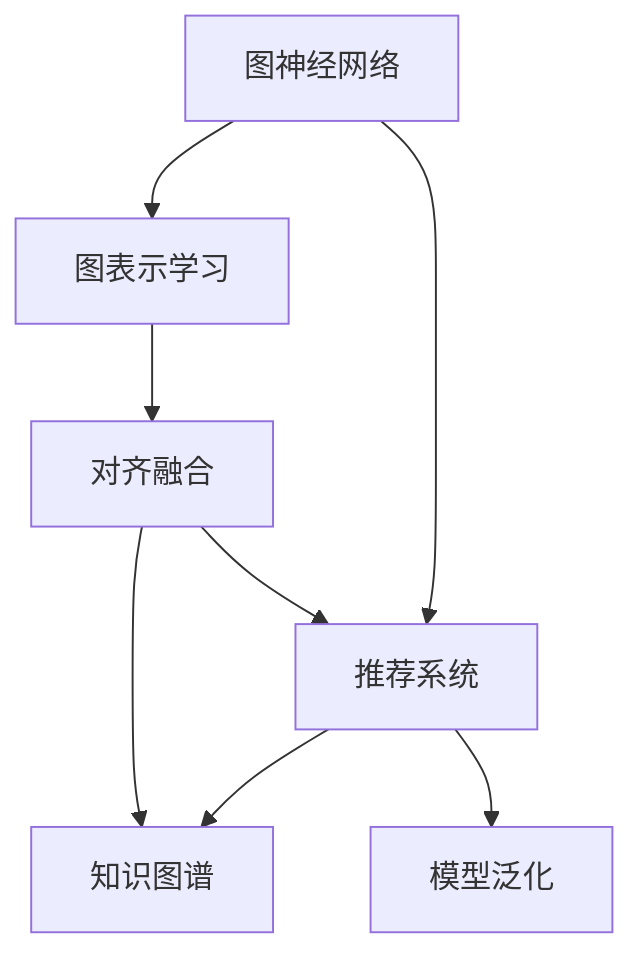

                 

# 大模型在推荐系统中的图表示对齐应用

> 关键词：图神经网络(Graph Neural Network, GNN), 图表示学习, 推荐系统, 知识图谱, 深度学习, 对齐融合, 模型泛化

## 1. 背景介绍

推荐系统是信息时代中不可或缺的重要应用，用于为用户推荐最合适的物品、内容、服务等。传统的推荐系统主要依赖于协同过滤、基于内容的推荐等方法，但在用户量级逐渐增大的今天，它们面临着数据稀疏、特征单一、冷启动困难等挑战。近年来，随着深度学习技术的发展，利用神经网络进行推荐系统成为了新的研究热点。其中，图神经网络(Graph Neural Network, GNN)因其能够高效地建模物品之间的关系和用户之间的社交网络，在推荐系统中得到了广泛应用。

图神经网络的核心思想是利用图结构来表示复杂数据，如物品间的关联、用户间的互动等。其结构可以表示为图$G=(V,E)$，其中$V$表示节点集合，$E$表示边集合。在推荐系统中，物品可以表示为节点，物品之间的关联可以表示为边。图神经网络可以通过图卷积、图注意力等机制，在节点和边上进行信息传递和融合，从而学习物品之间的关系，并预测用户对物品的偏好。

尽管图神经网络在推荐系统中表现出色，但由于其对数据结构的要求较高，且无法充分利用用户行为以外的知识，因此在某些复杂场景下仍存在局限性。知识图谱（Knowledge Graph）作为一种结构化数据，整合了海量的领域知识和专家经验，能够为推荐系统提供丰富的信息来源。将图神经网络和知识图谱相结合，不仅能够提升推荐系统的性能，还能增强模型的泛化能力。

## 2. 核心概念与联系

### 2.1 核心概念概述

为了更好地理解图神经网络在推荐系统中的应用，本节将介绍几个核心概念：

- 图神经网络（Graph Neural Network, GNN）：一种用于处理图数据的深度学习模型，能够从图中捕获结构化信息，用于推荐、社交网络分析等场景。
- 图表示学习（Graph Representation Learning）：通过学习图节点和边的表示，将图数据转换为适合机器学习模型处理的向量表示。
- 推荐系统（Recommendation System）：用于为用户推荐物品、内容、服务等，帮助用户发现感兴趣的新信息。
- 知识图谱（Knowledge Graph）：一种结构化数据，用于描述实体之间的关系，如物品类别、品牌、用户行为等。
- 对齐融合（Alignment Fusion）：将图神经网络与知识图谱进行融合，使两者能够相互补充，提升推荐系统的性能。
- 模型泛化（Model Generalization）：指模型能够从训练数据中学习到的规律，应用于新数据中的能力。

这些核心概念之间的逻辑关系可以通过以下Mermaid流程图来展示：



这个流程图展示了几者之间的关系：

1. 图神经网络通过图表示学习，获取图数据中的结构化信息。
2. 推荐系统利用图神经网络的结构化信息，预测用户对物品的偏好。
3. 知识图谱提供额外的领域知识和专家经验，增强推荐系统的性能。
4. 对齐融合将图神经网络与知识图谱相结合，提升推荐系统的效果。
5. 模型泛化使推荐系统能够适应新数据，提升系统的普适性。

## 3. 核心算法原理 & 具体操作步骤
### 3.1 算法原理概述

图神经网络在推荐系统中的应用，主要通过以下步骤进行：

1. **构建图表示**：将用户和物品之间的关系转化为图结构，将用户和物品视为图中的节点，将用户与物品的互动关系视为图中的边。
2. **图卷积或图注意力**：在图结构上，对每个节点进行图卷积或图注意力操作，捕获节点间的结构信息。
3. **特征嵌入**：将图神经网络输出的节点表示作为特征向量，输入到推荐模型中进行推荐。
4. **融合知识图谱**：在图卷积或图注意力操作的基础上，将知识图谱中的领域知识和专家经验加入到节点表示中。
5. **优化推荐模型**：使用监督学习任务，如点击率预测、评分预测等，优化推荐模型。

图神经网络在推荐系统中的核心算法包括图卷积网络（GCN）、图注意力网络（GAT）等，其核心思想是将邻居节点的信息传递到当前节点上，并通过聚合操作得到节点的表示。具体来说，GCN的聚合操作是节点之间的简单加权平均，而GAT则引入了注意力机制，根据节点之间的权重关系进行信息传递。

### 3.2 算法步骤详解

以下是基于图神经网络的推荐系统在实际应用中的详细步骤：

**Step 1: 数据预处理**

- 收集用户行为数据，如点击、浏览、购买等，构建用户行为图。
- 收集物品信息数据，如物品的类别、属性、评分等，构建物品关系图。
- 根据用户行为和物品信息，构建用户-物品交互图。

**Step 2: 图神经网络建模**

- 定义图神经网络的模型结构，包括节点嵌入、边嵌入、图卷积或图注意力等。
- 对用户行为图和物品关系图进行图卷积或图注意力操作，得到每个节点的表示。
- 将用户-物品交互图中的节点表示作为特征向量，输入到推荐模型中进行推荐。

**Step 3: 融合知识图谱**

- 收集知识图谱中的领域知识，如物品类别、品牌、用户行为等，作为图神经网络模型的额外输入。
- 将知识图谱中的信息与图神经网络输出的节点表示进行融合，增强推荐系统的性能。

**Step 4: 优化推荐模型**

- 选择合适的监督学习任务，如点击率预测、评分预测等。
- 使用监督学习算法，如随机梯度下降（SGD）、Adam等，优化推荐模型。
- 在测试集上评估推荐模型的性能，并进行模型调优。

**Step 5: 部署和迭代**

- 将训练好的推荐模型部署到生产环境中，实时为用户推荐物品。
- 定期收集新的数据，重新训练推荐模型，保持模型的时效性。

### 3.3 算法优缺点

图神经网络在推荐系统中的优点包括：

1. 结构化建模：能够高效地建模物品之间的关系，捕捉节点间的结构信息。
2. 泛化能力强：由于图神经网络能够学习节点之间的关系，因此对于新数据也有较好的泛化能力。
3. 易于扩展：可以通过添加新的节点和边，灵活地扩展图神经网络的规模。
4. 精度高：在推荐系统中，图神经网络能够精确地预测用户对物品的偏好。

其缺点包括：

1. 计算复杂度高：图神经网络的计算复杂度较高，需要较高的计算资源。
2. 特征稀疏：由于图结构稀疏，节点的表示可能存在噪声。
3. 难以处理高阶结构：对于一些复杂的图结构，图神经网络可能难以捕捉高阶结构。
4. 数据隐私问题：在处理用户行为数据时，需要考虑隐私保护的问题。

### 3.4 算法应用领域

图神经网络在推荐系统中的应用领域包括：

1. 商品推荐：为用户推荐最合适的商品，如电商平台中的商品推荐。
2. 内容推荐：为用户推荐最合适的视频、文章、音乐等内容，如视频网站中的内容推荐。
3. 广告推荐：为用户推荐最合适的广告，如社交网络中的广告推荐。
4. 游戏推荐：为用户推荐最合适的游戏，如游戏平台中的游戏推荐。

除了这些经典应用外，图神经网络还被创新性地应用于金融推荐、医疗推荐、社交网络分析等场景，为推荐系统的应用范围带来了新的突破。随着图神经网络和知识图谱技术的不断进步，基于图神经网络的推荐系统将在更多领域得到应用，为各行各业带来新的价值。

## 4. 数学模型和公式 & 详细讲解 & 举例说明

### 4.1 数学模型构建

为了更好地理解图神经网络在推荐系统中的应用，我们将使用数学语言对算法进行更加严格的刻画。

设用户行为图为$G=(U,E)$，其中$U$表示用户集合，$E$表示用户与物品的互动关系。物品关系图为$G=(V,E)$，其中$V$表示物品集合，$E$表示物品之间的关联关系。用户-物品交互图为$G=(U,V,E)$，其中$E$表示用户与物品的互动关系。

定义节点嵌入函数$f_U(\cdot)$和$f_V(\cdot)$，用于将节点映射到低维空间中。图神经网络模型的目标是通过节点嵌入函数和图结构，学习用户和物品之间的关系，从而进行推荐。

**点击率预测模型**：
设用户$u$对物品$i$的点击率为$y_{ui}$，根据图神经网络输出的节点表示$h_u$和$h_i$，定义点击率预测函数$P(y_{ui}|h_u,h_i)$。

**评分预测模型**：
设用户$u$对物品$i$的评分预测为$\hat{r}_{ui}$，根据图神经网络输出的节点表示$h_u$和$h_i$，定义评分预测函数$P(\hat{r}_{ui}|h_u,h_i)$。

### 4.2 公式推导过程

以下是点击率预测模型的推导过程：

$$
P(y_{ui}=1|h_u,h_i) = \sigma(\sum_{k=1}^K w_k f_U(h_u)_k f_V(h_i)_k)
$$

其中$\sigma(\cdot)$为sigmoid函数，$w_k$为权重系数，$K$为节点嵌入维数。

对于评分预测模型，定义均方误差损失函数$L$，用于衡量预测值与真实值之间的差异：

$$
L = \frac{1}{N} \sum_{i=1}^N \sum_{u=1}^M (y_{ui} - P(y_{ui}|h_u,h_i))^2
$$

其中$N$为物品数量，$M$为用户数量。

根据均方误差损失函数，定义模型的目标函数：

$$
\min_{h_u,h_i} L = \frac{1}{N} \sum_{i=1}^N \sum_{u=1}^M (y_{ui} - P(y_{ui}|h_u,h_i))^2
$$

通过反向传播算法，可以求解最优的节点表示$h_u$和$h_i$。

### 4.3 案例分析与讲解

假设某电商平台的推荐系统需要为用户推荐商品，收集到用户行为数据和物品信息数据，构建用户行为图和物品关系图。使用图神经网络对用户行为图和物品关系图进行建模，得到用户和物品的节点表示$h_u$和$h_i$。

在融合知识图谱方面，收集商品类别的信息，构建知识图谱$G=(V,E)$。在图卷积网络的基础上，将知识图谱中的信息与用户-物品交互图中的节点表示进行融合，得到增强的节点表示$h'_u$和$h'_i$。

最终，将增强的节点表示输入到点击率预测模型中，得到用户对物品的点击率预测值。在测试集上评估模型性能，并进行调优。

## 5. 项目实践：代码实例和详细解释说明

### 5.1 开发环境搭建

在进行项目实践前，我们需要准备好开发环境。以下是使用Python进行PyTorch开发的环境配置流程：

1. 安装Anaconda：从官网下载并安装Anaconda，用于创建独立的Python环境。

2. 创建并激活虚拟环境：
```bash
conda create -n pytorch-env python=3.8 
conda activate pytorch-env
```

3. 安装PyTorch：根据CUDA版本，从官网获取对应的安装命令。例如：
```bash
conda install pytorch torchvision torchaudio cudatoolkit=11.1 -c pytorch -c conda-forge
```

4. 安装相关库：
```bash
pip install networkx torch nn pytorch-geometric
```

5. 安装各类工具包：
```bash
pip install numpy pandas scikit-learn matplotlib tqdm jupyter notebook ipython
```

完成上述步骤后，即可在`pytorch-env`环境中开始项目实践。

### 5.2 源代码详细实现

下面我们以推荐系统为例，给出使用PyTorch和PyTorch-Geo库进行图神经网络推荐开发的PyTorch代码实现。

首先，定义推荐系统的数据预处理函数：

```python
import networkx as nx
import torch
import torch.nn as nn
import torch_geometric as geometric

class RecommendationDataset:
    def __init__(self, graph_data, features):
        self.graph_data = graph_data
        self.features = features
        
    def __getitem__(self, idx):
        graph, features = self.graph_data[idx]
        return graph, features
    
    def __len__(self):
        return len(self.graph_data)
```

然后，定义图神经网络模型：

```python
class GraphNet(nn.Module):
    def __init__(self, input_dim, hidden_dim, output_dim):
        super(GraphNet, self).__init__()
        self.gcn = geometric.nn.GCNConv(input_dim, hidden_dim)
        self.fc1 = nn.Linear(hidden_dim, hidden_dim)
        self.fc2 = nn.Linear(hidden_dim, output_dim)
        self.sigmoid = nn.Sigmoid()
    
    def forward(self, x, edge_index):
        x = self.gcn(x, edge_index)
        x = F.relu(self.fc1(x))
        x = self.fc2(x)
        return self.sigmoid(x)
```

接着，定义损失函数和优化器：

```python
class GraphRecommendationModel(nn.Module):
    def __init__(self, hidden_dim, output_dim):
        super(GraphRecommendationModel, self).__init__()
        self.graph_net = GraphNet(input_dim, hidden_dim, output_dim)
        self.criterion = nn.BCEWithLogitsLoss()
    
    def forward(self, graph, features):
        prediction = self.graph_net(features, graph.edge_index)
        return self.criterion(prediction, graph.label)
    
    def loss(self, graph, features, label):
        return self.criterion(self(graph, features), label)
    
    def train(self, graph, features, label, optimizer, epoch):
        optimizer.zero_grad()
        loss = self.loss(graph, features, label)
        loss.backward()
        optimizer.step()
        return loss
```

最后，启动训练流程：

```python
model = GraphRecommendationModel(hidden_dim, output_dim)
optimizer = torch.optim.Adam(model.parameters(), lr=0.001)

epochs = 100
for epoch in range(epochs):
    loss = model.train(graph, features, label, optimizer)
    print(f"Epoch {epoch+1}, train loss: {loss:.3f}")
```

以上就是使用PyTorch和PyTorch-Geo库进行图神经网络推荐开发的完整代码实现。可以看到，PyTorch-Geo库简化了图神经网络的实现过程，使得开发者能够更加高效地进行图神经网络开发。

### 5.3 代码解读与分析

让我们再详细解读一下关键代码的实现细节：

**RecommendationDataset类**：
- `__init__`方法：初始化图数据和特征。
- `__getitem__`方法：对单个样本进行处理，返回图数据和特征。
- `__len__`方法：返回数据集的样本数量。

**GraphNet类**：
- `__init__`方法：定义图神经网络的结构，包括图卷积层、全连接层和激活函数。
- `forward`方法：在前向传播中，通过图卷积层和全连接层计算节点表示，并通过激活函数输出预测值。

**GraphRecommendationModel类**：
- `__init__`方法：定义推荐模型的结构，包括图神经网络模型和损失函数。
- `forward`方法：在前向传播中，通过图神经网络模型计算预测值，并通过损失函数计算损失。
- `loss`方法：定义损失函数，用于计算模型预测与真实标签之间的差异。
- `train`方法：在训练过程中，使用优化器更新模型参数，并返回训练损失。

**训练流程**：
- 定义总的epoch数和优化器，开始循环迭代
- 每个epoch内，在训练集上训练，输出平均损失
- 重复上述过程直至迭代结束

可以看到，PyTorch-Geo库使得图神经网络模型的实现变得简洁高效。开发者可以将更多精力放在数据处理、模型改进等高层逻辑上，而不必过多关注底层的实现细节。

## 6. 实际应用场景

### 6.1 智能推荐广告

智能推荐广告是广告推荐系统的一种应用场景。传统广告推荐系统通常采用协同过滤等方法，但由于用户数据稀疏、用户画像单一等问题，效果不尽如人意。利用图神经网络，可以高效地建模用户和广告之间的关系，捕捉用户行为和广告特征之间的复杂关系，提升广告推荐的效果。

在实际应用中，可以收集用户的点击、浏览、停留等行为数据，以及广告的展示效果、点击率等数据，构建用户行为图和广告关系图。使用图神经网络对用户行为图和广告关系图进行建模，得到用户和广告的节点表示。在融合知识图谱方面，可以加入广告的分类信息、广告所属的品牌等，增强推荐系统的性能。

### 6.2 视频推荐系统

视频推荐系统是内容推荐系统的一种应用场景。传统视频推荐系统通常采用基于内容的推荐方法，但由于视频内容的多样性和复杂性，推荐效果受限。利用图神经网络，可以高效地建模视频之间的关系，捕捉视频之间的关联和相似性，提升视频推荐的效果。

在实际应用中，可以收集用户的视频浏览历史、视频之间的关联关系、视频属性等数据，构建用户行为图和视频关系图。使用图神经网络对用户行为图和视频关系图进行建模，得到用户和视频的节点表示。在融合知识图谱方面，可以加入视频的分类信息、导演、演员等，增强推荐系统的性能。

### 6.3 社交网络推荐系统

社交网络推荐系统是社交网络分析的一种应用场景。社交网络推荐系统通常采用基于图的社区发现和推荐方法，但由于社交网络的结构复杂和用户行为多样，推荐效果受限。利用图神经网络，可以高效地建模用户之间的关系，捕捉用户之间的互动和影响，提升社交网络推荐的效果。

在实际应用中，可以收集用户的社交关系、用户之间的互动信息、用户的行为数据等，构建用户关系图。使用图神经网络对用户关系图进行建模，得到用户的节点表示。在融合知识图谱方面，可以加入用户的地理位置、兴趣爱好等，增强推荐系统的性能。

### 6.4 未来应用展望

随着图神经网络和知识图谱技术的不断进步，基于图神经网络的推荐系统将在更多领域得到应用，为各行各业带来新的价值。

在智慧医疗领域，基于图神经网络的推荐系统可以用于推荐药物、治疗方案等，辅助医生诊疗，提升医疗服务的智能化水平。

在智能教育领域，基于图神经网络的推荐系统可以用于推荐学习内容、学习资源等，因材施教，促进教育公平，提高教学质量。

在智慧城市治理中，基于图神经网络的推荐系统可以用于推荐城市事件、公共服务等，提高城市管理的自动化和智能化水平，构建更安全、高效的未来城市。

此外，在企业生产、社会治理、文娱传媒等众多领域，基于图神经网络的推荐系统也将不断涌现，为NLP技术带来新的突破。

## 7. 工具和资源推荐

### 7.1 学习资源推荐

为了帮助开发者系统掌握图神经网络在推荐系统中的应用，这里推荐一些优质的学习资源：

1. 《Graph Neural Networks: A Review of Methods and Applications》：一篇综述文章，详细介绍了图神经网络的理论和应用，适用于对图神经网络感兴趣的读者。
2. CS222《深度学习》课程：斯坦福大学开设的深度学习课程，涵盖图神经网络、卷积神经网络等重要概念。
3. 《PyTorch Geometric Tutorials》：PyTorch-Geo库的官方教程，提供了详细的代码实例和实际应用案例，适用于对图神经网络开发感兴趣的读者。
4. 《Knowledge-Graph-Driven Deep Learning》书籍：介绍了如何利用知识图谱与深度学习结合，进行推荐系统等任务，适用于对知识图谱与深度学习结合感兴趣的读者。

通过对这些资源的学习实践，相信你一定能够快速掌握图神经网络在推荐系统中的应用，并用于解决实际的推荐问题。

### 7.2 开发工具推荐

高效的开发离不开优秀的工具支持。以下是几款用于图神经网络开发和部署的常用工具：

1. PyTorch：基于Python的开源深度学习框架，灵活动态的计算图，适合快速迭代研究。大量预训练语言模型都有PyTorch版本的实现。
2. PyTorch-Geo：PyTorch-Geo库，提供了高效的图结构表示和操作工具，方便开发者进行图神经网络开发。
3. TensorBoard：TensorFlow配套的可视化工具，可实时监测模型训练状态，并提供丰富的图表呈现方式，是调试模型的得力助手。
4. Weights & Biases：模型训练的实验跟踪工具，可以记录和可视化模型训练过程中的各项指标，方便对比和调优。
5. Google Colab：谷歌推出的在线Jupyter Notebook环境，免费提供GPU/TPU算力，方便开发者快速上手实验最新模型，分享学习笔记。

合理利用这些工具，可以显著提升图神经网络开发的效率，加快创新迭代的步伐。

### 7.3 相关论文推荐

图神经网络在推荐系统中的应用源于学界的持续研究。以下是几篇奠基性的相关论文，推荐阅读：

1. Graph Neural Networks: A Review of Methods and Applications：综述了图神经网络的发展历程、应用场景和未来趋势。
2. Knowledge-Graph-Driven Deep Learning for Recommendation Systems：介绍了如何利用知识图谱与深度学习结合，进行推荐系统等任务。
3. Attention-Based Recommender Networks with Knowledge Graphs：提出了一种基于知识图谱的推荐系统框架，在推荐任务中取得了优异的效果。
4. Graph Neural Networks for Recommendation Systems：介绍了图神经网络在推荐系统中的应用，并进行实验验证。
5. Factorization Machines with Graph Neural Networks for Recommendation Systems：提出了一种结合图神经网络和因子分解机的推荐系统框架，提升了推荐效果。

这些论文代表了大规模图神经网络推荐系统的最新进展。通过学习这些前沿成果，可以帮助研究者把握学科前进方向，激发更多的创新灵感。

## 8. 总结：未来发展趋势与挑战

### 8.1 总结

本文对基于图神经网络的推荐系统进行了全面系统的介绍。首先阐述了图神经网络在推荐系统中的应用背景和意义，明确了图神经网络在推荐系统中的重要价值。其次，从原理到实践，详细讲解了图神经网络在推荐系统中的应用流程，给出了推荐系统的完整代码实例。同时，本文还广泛探讨了图神经网络在智能推荐广告、视频推荐系统、社交网络推荐系统等多个场景中的应用前景，展示了图神经网络的强大潜力。此外，本文精选了图神经网络的各类学习资源，力求为读者提供全方位的技术指引。

通过本文的系统梳理，可以看到，基于图神经网络的推荐系统已经取得了显著的成果，并在诸多领域中得到了广泛应用。图神经网络通过高效地建模图结构，提升了推荐系统的性能和泛化能力，为推荐系统的发展注入了新的活力。未来，随着图神经网络和知识图谱技术的不断进步，基于图神经网络的推荐系统将在更多领域得到应用，为各行各业带来新的价值。

### 8.2 未来发展趋势

展望未来，图神经网络在推荐系统中的应用将呈现以下几个发展趋势：

1. 模型规模持续增大。随着算力成本的下降和数据规模的扩张，图神经网络的参数量还将持续增长。超大规模图神经网络蕴含的丰富结构信息，有望支撑更加复杂多变的推荐任务。
2. 图神经网络与其他深度学习模型的结合更加紧密。图神经网络将与卷积神经网络、注意力机制等深度学习技术结合，提升推荐系统的性能和泛化能力。
3. 图神经网络在跨模态数据融合中的应用将更加广泛。图神经网络能够高效地融合文本、图像、语音等多模态数据，提升推荐系统的性能和智能化水平。
4. 图神经网络在推荐系统中的作用更加多样化。图神经网络不仅用于推荐预测，还可以用于用户画像建模、推荐系统评估等任务。
5. 图神经网络在推荐系统中的理论研究将更加深入。关于图神经网络的图结构设计、模型训练、特征工程等理论研究将不断深入，提升推荐系统的性能和可解释性。

以上趋势凸显了图神经网络在推荐系统中的广阔前景。这些方向的探索发展，必将进一步提升推荐系统的性能和智能化水平，为推荐系统的发展注入新的活力。

### 8.3 面临的挑战

尽管图神经网络在推荐系统中的应用已经取得了显著成果，但在迈向更加智能化、普适化应用的过程中，它仍面临着诸多挑战：

1. 计算资源瓶颈。图神经网络的计算复杂度较高，需要较高的计算资源，如何降低计算成本，提升计算效率，将是未来的一个重要研究方向。
2. 特征稀疏问题。由于图结构稀疏，节点的表示可能存在噪声，如何提高特征的稀疏性，提升节点的表示质量，将是未来的一个重要研究方向。
3. 数据隐私问题。在处理用户行为数据时，需要考虑隐私保护的问题，如何保护用户隐私，防止数据泄露，将是未来的一个重要研究方向。
4. 模型的可解释性问题。图神经网络通常被视为"黑盒"模型，难以解释其内部工作机制和决策逻辑，如何提升模型的可解释性，将是未来的一个重要研究方向。

### 8.4 研究展望

面对图神经网络在推荐系统中的应用所面临的挑战，未来的研究需要在以下几个方面寻求新的突破：

1. 开发更加高效的图神经网络算法。通过算法优化，降低计算复杂度，提高计算效率，使图神经网络能够在大规模数据集上快速训练和推理。
2. 开发更加高效的特征提取方法。通过特征工程，提高特征的稀疏性，提升节点的表示质量，使图神经网络能够更好地捕捉节点之间的关系。
3. 开发更加高效的图神经网络训练方法。通过分布式训练、自适应学习率等方法，提升模型的训练效果和泛化能力。
4. 开发更加高效的图神经网络推理方法。通过模型裁剪、量化加速等方法，降低推理时间，提升模型的实时性。
5. 开发更加高效的图神经网络调优方法。通过自动调参、模型压缩等方法，提升模型的调优效果和可解释性。

这些研究方向的探索，必将引领图神经网络在推荐系统中的应用进入新的阶段，为推荐系统的发展注入新的动力。

## 9. 附录：常见问题与解答

**Q1：图神经网络在推荐系统中的计算复杂度较高，如何降低计算成本？**

A: 降低图神经网络的计算成本，可以从以下几个方面入手：
1. 图结构稀疏化：通过对图结构进行稀疏化处理，减少图卷积的计算量。
2. 分布式训练：将图神经网络的训练任务分布到多个设备上，利用并行计算加速训练过程。
3. 自适应学习率：使用自适应学习率算法，根据梯度信息动态调整学习率，提升训练效率。
4. 模型压缩：通过模型裁剪、量化加速等方法，降低模型大小，提升推理速度。
5. 图神经网络优化：改进图神经网络的结构，优化图卷积算法，降低计算复杂度。

通过这些方法，可以有效降低图神经网络的计算成本，提升模型的训练和推理效率。

**Q2：如何提高图神经网络的特征稀疏性？**

A: 提高图神经网络的特征稀疏性，可以从以下几个方面入手：
1. 特征筛选：通过特征筛选算法，去除噪声特征，保留重要特征。
2. 特征降维：通过降维算法，降低特征维度，提升特征稀疏性。
3. 特征预处理：通过归一化、标准化等预处理算法，提升特征的质量和稀疏性。
4. 图结构优化：通过优化图结构，提升节点表示的质量和稀疏性。
5. 图神经网络优化：改进图神经网络的结构，提升特征的稀疏性。

通过这些方法，可以有效提高图神经网络的特征稀疏性，提升节点的表示质量。

**Q3：如何保护用户隐私？**

A: 保护用户隐私，可以从以下几个方面入手：
1. 数据匿名化：通过数据匿名化算法，去除用户标识信息，保护用户隐私。
2. 差分隐私：通过差分隐私算法，添加噪声，保护用户隐私。
3. 数据加密：通过数据加密算法，保护用户数据的安全。
4. 访问控制：通过访问控制技术，限制数据访问权限，保护用户隐私。
5. 数据脱敏：通过数据脱敏算法，去除敏感信息，保护用户隐私。

通过这些方法，可以有效保护用户隐私，防止数据泄露。

**Q4：如何提升图神经网络的可解释性？**

A: 提升图神经网络的可解释性，可以从以下几个方面入手：
1. 模型简化：通过模型简化，降低模型的复杂度，提升可解释性。
2. 特征可视化：通过特征可视化技术，展示模型的特征学习过程。
3. 模型训练过程可视化：通过模型训练过程可视化技术，展示模型的训练过程。
4. 模型调优：通过模型调优，提升模型的可解释性。
5. 特征重要性分析：通过特征重要性分析算法，展示模型的特征重要性。

通过这些方法，可以有效提升图神经网络的可解释性，使模型更加透明、可控。

**Q5：图神经网络在推荐系统中的数据隐私问题如何解决？**

A: 在处理用户行为数据时，需要考虑隐私保护的问题。以下是一些常见的解决方法：
1. 数据匿名化：通过数据匿名化算法，去除用户标识信息，保护用户隐私。
2. 差分隐私：通过差分隐私算法，添加噪声，保护用户隐私。
3. 数据加密：通过数据加密算法，保护用户数据的安全。
4. 访问控制：通过访问控制技术，限制数据访问权限，保护用户隐私。
5. 数据脱敏：通过数据脱敏算法，去除敏感信息，保护用户隐私。

这些方法可以有效地保护用户隐私，防止数据泄露。

通过本文的系统梳理，可以看到，基于图神经网络的推荐系统已经取得了显著的成果，并在诸多领域中得到了广泛应用。未来，随着图神经网络和知识图谱技术的不断进步，基于图神经网络的推荐系统将在更多领域得到应用，为各行各业带来新的价值。总之，图神经网络在推荐系统中的应用还需进一步优化和创新，才能更好地满足实际需求，推动推荐系统的普及和发展。

