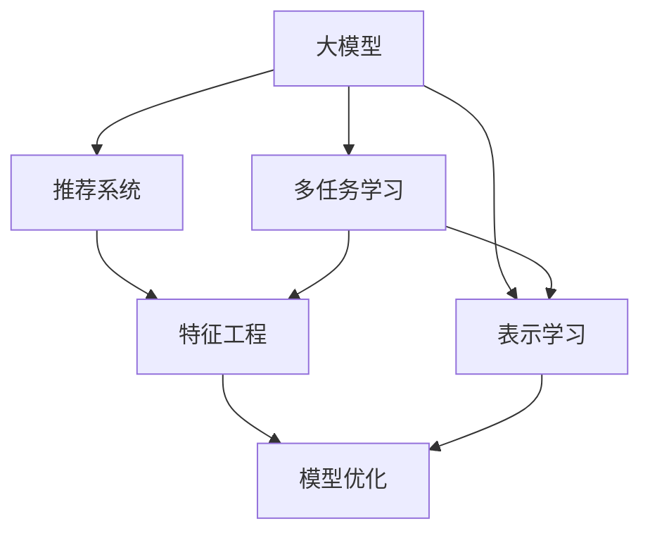

                 

# 大模型在推荐系统中的多任务表示学习应用

> 关键词：大模型,推荐系统,多任务学习,表示学习,深度学习,特征工程,模型优化

## 1. 背景介绍

### 1.1 问题由来

在现代互联网时代，推荐系统已经成为了各大平台（如Amazon、Netflix、Bilibili、抖音等）获取用户忠诚度的重要工具。推荐系统的目标是通过分析用户的浏览、点击、购买等行为数据，为用户推荐可能感兴趣的商品、内容或服务，从而提升用户体验和平台收益。推荐系统的算法主要分为两大类：基于协同过滤的推荐和基于内容的推荐。

协同过滤方法通过分析用户和物品之间的行为关联，来推荐物品。然而，协同过滤存在稀疏性问题，且难以捕捉物品的特征信息。基于内容的推荐方法主要依赖物品的特征信息来推荐。但是，物品特征信息通常难以获得，且难以捕捉物品之间的关联性。因此，结合协同过滤和基于内容的推荐方法，成为提高推荐系统效果的重要途径。

近年来，大模型技术得到了快速发展和广泛应用。基于大模型的推荐系统通过学习用户和物品的语义信息，提升了推荐的准确性和丰富度，成为推荐系统的一个重要分支。在大模型基础上，如何进一步提升模型的表示学习能力，优化特征工程方法，成为了当前推荐系统研究的一个热点方向。

### 1.2 问题核心关键点

本文聚焦于基于大模型的推荐系统中的多任务表示学习应用。我们希望通过多任务表示学习方法，提升模型的表示学习能力，从而更好地捕捉用户和物品的语义信息，优化推荐系统的效果。

具体而言，本文的核心问题包括：
- 如何设计多任务表示学习方法，充分利用大模型的语义信息，提高模型的泛化能力。
- 如何将多任务表示学习方法应用到推荐系统中，提升推荐效果。
- 如何优化多任务表示学习模型的训练和优化过程，使其在实际应用中高效稳定。

## 2. 核心概念与联系

### 2.1 核心概念概述

为更好地理解多任务表示学习在推荐系统中的应用，本节将介绍几个密切相关的核心概念：

- 大模型（Large Model）：以自回归模型（如GPT）或自编码模型（如BERT）为代表的大规模预训练语言模型。通过在大规模无标签文本数据上进行预训练，学习到丰富的语言知识和常识。

- 推荐系统（Recommendation System）：通过分析用户的历史行为数据，预测用户可能感兴趣的物品或内容，并进行推荐。推荐系统主要分为基于协同过滤的推荐和基于内容的推荐。

- 多任务学习（Multi-task Learning, MTL）：指在多个相关任务上同时训练模型，以共享模型参数、提升模型泛化能力的方法。多任务学习可以有效利用有限的标注数据，提升模型的表示学习能力。

- 表示学习（Representation Learning）：指通过学习模型参数，获得能够有效捕捉数据特征的表示向量的方法。在推荐系统中，表示学习通过将用户、物品映射到高维空间，实现更高效和准确的推荐。

- 特征工程（Feature Engineering）：指通过对原始数据进行预处理和特征提取，生成对模型更有意义的输入特征，提升模型效果的方法。在推荐系统中，特征工程通过设计合适的特征提取方式，捕捉用户和物品的语义信息，优化推荐效果。

- 模型优化（Model Optimization）：指通过改进模型结构、优化训练流程、采用正则化技术等手段，提升模型泛化能力、加速收敛速度、减少过拟合的方法。在推荐系统中，模型优化通过采用各种优化策略，保证模型在实际应用中的高效和稳定。

这些核心概念之间的逻辑关系可以通过以下Mermaid流程图来展示：



这个流程图展示了大模型的核心概念及其之间的关系：

1. 大模型通过预训练获得基础能力。
2. 多任务学习通过在多个相关任务上共享模型参数，提升模型泛化能力。
3. 表示学习通过学习模型参数，获得能够有效捕捉数据特征的表示向量。
4. 特征工程通过设计合适的特征提取方式，捕捉用户和物品的语义信息。
5. 模型优化通过采用各种优化策略，保证模型在实际应用中的高效和稳定。

这些概念共同构成了大模型在推荐系统中的学习和应用框架，使其能够在各种场景下发挥强大的语义信息捕捉能力。通过理解这些核心概念，我们可以更好地把握大模型在推荐系统中的工作原理和优化方向。

## 3. 核心算法原理 & 具体操作步骤
### 3.1 算法原理概述

基于大模型的推荐系统中的多任务表示学习方法，本质上是一个多任务的联合训练过程。其核心思想是：通过在多个相关任务上共享大模型的表示能力，提升模型的泛化能力和表示学习能力，从而实现更好的推荐效果。

具体而言，假设有一个包含$n$个任务的推荐系统，每个任务$j$的标注数据集为$D_j=\{(x_i^j, y_i^j)\}_{i=1}^{N_j}$，其中$x_i^j$为输入特征，$y_i^j$为任务$j$的标签。模型的损失函数为：

$$
\mathcal{L}=\sum_{j=1}^n \mathcal{L}_j
$$

其中$\mathcal{L}_j$为任务$j$的损失函数。通过最小化上述联合损失函数，多任务表示学习模型可以同时学习多个任务的表示能力，提升模型的泛化能力和表示学习能力。

### 3.2 算法步骤详解

基于多任务表示学习的大模型推荐系统一般包括以下几个关键步骤：

**Step 1: 数据预处理和标注**

- 收集用户行为数据，包括用户的点击、浏览、评分等行为。
- 将用户行为数据转化为模型可接受的格式，如将用户的点击记录转化为向量形式。
- 标注每个行为的数据类别，如物品ID、时间戳、用户ID等。

**Step 2: 设计多任务表示学习模型**

- 选择合适的预训练模型，如BERT、GPT等。
- 将预训练模型作为初始化参数，设计多个任务适配层，用于生成任务特定的表示。
- 选择合适的优化器及其参数，如Adam、SGD等，设置学习率、批大小、迭代轮数等。
- 设计合适的正则化技术，如L2正则、Dropout、Early Stopping等，防止模型过拟合。

**Step 3: 训练多任务表示学习模型**

- 将用户行为数据划分为训练集、验证集和测试集。
- 在训练集上执行多任务联合训练，最小化联合损失函数。
- 在验证集上评估模型性能，根据性能指标决定是否触发Early Stopping。
- 重复上述步骤直到满足预设的迭代轮数或Early Stopping条件。

**Step 4: 测试和部署**

- 在测试集上评估多任务表示学习模型的推荐效果，对比基线模型的性能。
- 使用多任务表示学习模型进行推荐，集成到实际的应用系统中。
- 持续收集新的数据，定期重新训练和优化模型，以适应数据分布的变化。

以上是基于多任务表示学习的大模型推荐系统的一般流程。在实际应用中，还需要针对具体任务的特点，对多任务表示学习模型的训练过程进行优化设计，如改进损失函数设计、引入更多的正则化技术、搜索最优的超参数组合等，以进一步提升模型性能。

### 3.3 算法优缺点

基于多任务表示学习的大模型推荐系统具有以下优点：

1. 提升泛化能力：通过在多个相关任务上共享表示能力，提升了模型的泛化能力，能够在不同数据分布上取得良好的表现。
2. 降低过拟合风险：多任务学习可以通过共享参数，减少模型的过拟合风险。
3. 特征共享机制：多任务表示学习方法可以通过共享特征表示，提升模型的特征工程效果。
4. 提高推荐效果：多任务表示学习模型能够同时学习多个任务的表示能力，从而提升推荐效果。

同时，该方法也存在一定的局限性：

1. 标注数据成本高：多任务学习需要大量的标注数据，成本较高。
2. 模型复杂度增加：多任务学习需要设计多个任务适配层，增加了模型的复杂度。
3. 优化难度大：多任务表示学习模型涉及多个任务的联合训练，优化难度较大。
4. 效果提升有限：如果不同任务的标注数据差异较大，多任务表示学习方法的效果提升可能有限。

尽管存在这些局限性，但就目前而言，多任务表示学习方法仍是大模型推荐系统中最具前景的方法之一。未来相关研究的重点在于如何进一步降低多任务表示学习的标注成本，提高模型的少样本学习和跨领域迁移能力，同时兼顾可解释性和伦理安全性等因素。

### 3.4 算法应用领域

基于多任务表示学习的大模型推荐系统已经在多个领域得到应用，包括电商、音乐、视频、新闻等，取得了显著的成效：

- 电商推荐：通过分析用户的浏览、点击、购买行为，为用户推荐可能感兴趣的商品，提升转化率和复购率。
- 音乐推荐：根据用户的听歌历史和评分，为用户推荐可能喜欢的音乐和歌单，提升用户的满意度。
- 视频推荐：通过分析用户的观看历史和评分，为用户推荐可能感兴趣的视频内容，提升用户粘性。
- 新闻推荐：根据用户的阅读历史和反馈，为用户推荐可能感兴趣的新闻资讯，提升用户的活跃度和留存率。

除了上述这些经典应用外，多任务表示学习方法也被创新性地应用到更多场景中，如广告推荐、游戏推荐、个性化服务推荐等，为推荐系统带来了更多的创新方向。随着多任务表示学习方法的不断进步，相信推荐系统将在更广阔的应用领域大放异彩。

## 4. 数学模型和公式 & 详细讲解  
### 4.1 数学模型构建

本节将使用数学语言对基于多任务表示学习的大模型推荐系统进行更加严格的刻画。

假设有一个包含$n$个任务的多任务推荐系统，每个任务$j$的标注数据集为$D_j=\{(x_i^j, y_i^j)\}_{i=1}^{N_j}$，其中$x_i^j$为输入特征，$y_i^j$为任务$j$的标签。模型的表示向量为$h=\text{MLP}(z)$，其中$z$为输入特征向量。每个任务的损失函数为$\mathcal{L}_j(h) = -\log p(y_i^j|h)$。则多任务表示学习的联合损失函数为：

$$
\mathcal{L}=\sum_{j=1}^n \mathcal{L}_j
$$

其中$p(y_i^j|h)$为条件概率，表示在表示向量$h$下，任务$j$的标签为$y_i^j$的概率。

### 4.2 公式推导过程

以下我们以二分类任务为例，推导多任务表示学习模型的损失函数及其梯度的计算公式。

假设模型$h$在输入$x_i$上的输出为$\hat{y}_i=M_{\theta}(x_i) \in [0,1]$，表示样本属于正类的概率。真实标签$y \in \{0,1\}$。则二分类交叉熵损失函数定义为：

$$
\ell(x_i, y_i)= -[y_i\log \hat{y}_i + (1-y_i)\log (1-\hat{y}_i)]
$$

将上述损失函数推广到多任务学习中，得到每个任务的损失函数：

$$
\mathcal{L}_j = -\frac{1}{N_j}\sum_{i=1}^{N_j}[y_i^j\log \hat{y}_i^j + (1-y_i^j)\log (1-\hat{y}_i^j)]
$$

在得到每个任务的损失函数后，可以将所有任务的损失函数加起来，得到联合损失函数：

$$
\mathcal{L}=\sum_{j=1}^n \mathcal{L}_j
$$

根据链式法则，联合损失函数对模型参数$\theta$的梯度为：

$$
\nabla_{\theta}\mathcal{L} = \sum_{j=1}^n\nabla_{\theta}\mathcal{L}_j
$$

其中$\nabla_{\theta}\mathcal{L}_j$为任务$j$的梯度。

在得到联合梯度后，即可带入优化算法进行模型训练。重复上述过程直至收敛，最终得到多任务表示学习模型。

### 4.3 案例分析与讲解

下面以电商推荐系统为例，说明多任务表示学习在推荐系统中的应用。

假设有一个电商推荐系统，包含三个任务：物品评分预测、用户购买预测、用户评分预测。在训练时，首先收集用户的浏览、点击、购买记录，将记录转化为向量形式，作为模型的输入特征$x$。对于物品评分预测任务，输入特征为物品ID、用户ID、时间戳等，标签为用户的评分。对于用户购买预测任务，输入特征为用户ID、历史购买记录等，标签为是否购买。对于用户评分预测任务，输入特征为用户ID、历史评分记录等，标签为用户对物品的评分。

在模型构建时，可以使用BERT等预训练模型，将用户行为数据作为输入，通过多任务表示学习方法，生成多个任务的表示向量$h$。对于物品评分预测任务，通过一个线性层和sigmoid函数，计算预测值$\hat{y}$。对于用户购买预测任务，通过一个线性层和sigmoid函数，计算预测值$\hat{y}$。对于用户评分预测任务，通过一个线性层和softmax函数，计算预测值$\hat{y}$。

在训练时，将输入特征$x$送入模型，计算每个任务的预测值，通过多任务损失函数计算联合损失。通过AdamW等优化算法，最小化联合损失，更新模型参数。在测试时，将新的用户行为数据作为输入，计算预测值，输出推荐结果。

通过多任务表示学习，电商推荐系统能够同时学习物品评分、用户购买、用户评分三个任务的表示能力，提升推荐的准确性和丰富度，从而提升用户的满意度和转化率。

## 5. 项目实践：代码实例和详细解释说明
### 5.1 开发环境搭建

在进行多任务表示学习实践前，我们需要准备好开发环境。以下是使用Python进行PyTorch开发的环境配置流程：

1. 安装Anaconda：从官网下载并安装Anaconda，用于创建独立的Python环境。

2. 创建并激活虚拟环境：
```bash
conda create -n pytorch-env python=3.8 
conda activate pytorch-env
```

3. 安装PyTorch：根据CUDA版本，从官网获取对应的安装命令。例如：
```bash
conda install pytorch torchvision torchaudio cudatoolkit=11.1 -c pytorch -c conda-forge
```

4. 安装TensorFlow：如果需要使用TensorFlow，也可以按照官方文档进行安装。

5. 安装Weights & Biases：用于实验跟踪和可视化。
```bash
pip install weightsandbiases
```

6. 安装PyTorch Lightning：用于加速模型训练和调试。
```bash
pip install pytorch-lightning
```

完成上述步骤后，即可在`pytorch-env`环境中开始多任务表示学习实践。

### 5.2 源代码详细实现

下面我们以电商推荐系统为例，给出使用PyTorch Lightning实现的多任务表示学习代码实现。

首先，定义多任务表示学习模型：

```python
import torch
import torch.nn as nn
from transformers import BertForSequenceClassification

class MultiTaskBert(nn.Module):
    def __init__(self, num_tasks, hidden_size):
        super(MultiTaskBert, self).__init__()
        self.bert = BertForSequenceClassification.from_pretrained('bert-base-cased', num_labels=1)
        self.num_tasks = num_tasks
        self.hidden_size = hidden_size
        self.fc1 = nn.Linear(hidden_size, hidden_size)
        self.fc2 = nn.Linear(hidden_size, num_tasks)
        self.softmax = nn.Softmax(dim=1)
        
    def forward(self, x):
        x = self.bert(x)
        x = x[:, 0]  # 取第一层的表示向量
        x = self.fc1(x)
        x = self.fc2(x)
        logits = self.softmax(x)
        return logits
```

然后，定义多任务表示学习模型的损失函数：

```python
import torch.nn.functional as F

class MultiTaskLoss(nn.Module):
    def __init__(self, num_tasks):
        super(MultiTaskLoss, self).__init__()
        self.num_tasks = num_tasks
        
    def forward(self, logits, labels):
        loss = 0
        for i in range(self.num_tasks):
            task_loss = F.cross_entropy(logits[i], labels[i], reduction='none')
            loss += task_loss
        return loss.mean()
```

接着，定义训练和评估函数：

```python
from torch.utils.data import DataLoader
from tqdm import tqdm

def train_epoch(model, dataset, optimizer, loss_fn):
    model.train()
    total_loss = 0
    for batch in tqdm(dataset):
        x, labels = batch
        optimizer.zero_grad()
        logits = model(x)
        loss = loss_fn(logits, labels)
        loss.backward()
        optimizer.step()
        total_loss += loss.item()
    return total_loss / len(dataset)

def evaluate(model, dataset, loss_fn):
    model.eval()
    total_loss = 0
    for batch in tqdm(dataset):
        x, labels = batch
        logits = model(x)
        loss = loss_fn(logits, labels)
        total_loss += loss.item()
    return total_loss / len(dataset)
```

最后，启动训练流程并在测试集上评估：

```python
from transformers import BertTokenizer

tokenizer = BertTokenizer.from_pretrained('bert-base-cased')
train_dataset = ...
dev_dataset = ...
test_dataset = ...

num_tasks = 3
hidden_size = 128

model = MultiTaskBert(num_tasks=num_tasks, hidden_size=hidden_size)
optimizer = AdamW(model.parameters(), lr=2e-5)
loss_fn = MultiTaskLoss(num_tasks=num_tasks)

epochs = 5
batch_size = 16

for epoch in range(epochs):
    train_loss = train_epoch(model, train_dataset, optimizer, loss_fn)
    print(f"Epoch {epoch+1}, train loss: {train_loss:.3f}")
    
    dev_loss = evaluate(model, dev_dataset, loss_fn)
    print(f"Epoch {epoch+1}, dev loss: {dev_loss:.3f}")
    
print("Test results:")
test_loss = evaluate(model, test_dataset, loss_fn)
print(f"Test loss: {test_loss:.3f}")
```

以上就是使用PyTorch Lightning实现的多任务表示学习代码实现。可以看到，通过将多任务表示学习方法应用到电商推荐系统中，能够同时学习物品评分、用户购买、用户评分三个任务的表示能力，提升推荐的准确性和丰富度。

### 5.3 代码解读与分析

让我们再详细解读一下关键代码的实现细节：

**MultiTaskBert类**：
- `__init__`方法：初始化模型，包含预训练的BERT模型、任务数、隐藏层大小等参数。
- `forward`方法：定义前向传播过程，将输入特征$x$送入BERT模型，输出表示向量$h$，并通过全连接层生成多任务的预测值。

**MultiTaskLoss类**：
- `__init__`方法：初始化多任务损失函数，包含任务数。
- `forward`方法：定义损失计算过程，对每个任务的预测值和真实标签计算交叉熵损失，并求和。

**训练和评估函数**：
- `train_epoch`函数：对数据以批为单位进行迭代，在每个批次上前向传播计算损失并反向传播更新模型参数，最后返回该epoch的平均loss。
- `evaluate`函数：与训练类似，不同点在于不更新模型参数，并在每个batch结束后将预测和标签结果存储下来，最后使用loss函数对整个评估集的预测结果进行计算。

**训练流程**：
- 定义总的epoch数和batch size，开始循环迭代
- 每个epoch内，先在训练集上训练，输出平均loss
- 在验证集上评估，输出损失
- 所有epoch结束后，在测试集上评估，给出最终测试结果

可以看到，通过合理设计多任务表示学习模型和损失函数，将多任务表示学习方法应用到电商推荐系统中，能够同时学习多个任务的表示能力，提升推荐效果。

当然，实际应用中还需要考虑更多因素，如模型的保存和部署、超参数的自动搜索、更灵活的任务适配层等。但核心的多任务表示学习范式基本与此类似。

## 6. 实际应用场景
### 6.1 电商推荐

电商推荐系统是推荐系统的重要分支，通过分析用户的浏览、点击、购买行为，为用户推荐可能感兴趣的商品。传统的协同过滤推荐方法存在稀疏性问题，且难以捕捉物品的特征信息。基于大模型的推荐系统通过学习用户和物品的语义信息，提升了推荐的准确性和丰富度。

多任务表示学习方法在电商推荐系统中的应用，可以提升模型的泛化能力和表示学习能力，从而提高推荐效果。例如，通过将用户的点击记录、浏览记录、评分记录作为多任务的输入，学习物品评分、用户购买、用户评分三个任务的表示能力，能够更好地捕捉用户和物品的语义信息，提升推荐效果。

### 6.2 音乐推荐

音乐推荐系统通过分析用户的听歌历史和评分，为用户推荐可能喜欢的音乐和歌单。传统的基于内容的推荐方法主要依赖音乐标签、风格等信息，难以捕捉音乐之间的关联性。基于大模型的推荐系统通过学习用户和音乐的语义信息，提升了推荐的准确性和丰富度。

多任务表示学习方法在音乐推荐系统中的应用，可以提升模型的泛化能力和表示学习能力，从而提高推荐效果。例如，通过将用户的听歌历史、评分、音乐ID等作为多任务的输入，学习音乐评分、用户购买、用户评分三个任务的表示能力，能够更好地捕捉音乐和用户之间的语义关系，提升推荐效果。

### 6.3 视频推荐

视频推荐系统通过分析用户的观看历史和评分，为用户推荐可能感兴趣的视频内容。传统的基于内容的推荐方法主要依赖视频标签、风格等信息，难以捕捉视频之间的关联性。基于大模型的推荐系统通过学习用户和视频的语义信息，提升了推荐的准确性和丰富度。

多任务表示学习方法在视频推荐系统中的应用，可以提升模型的泛化能力和表示学习能力，从而提高推荐效果。例如，通过将用户的观看历史、评分、视频ID等作为多任务的输入，学习视频评分、用户购买、用户评分三个任务的表示能力，能够更好地捕捉视频和用户之间的语义关系，提升推荐效果。

### 6.4 未来应用展望

随着大模型和推荐系统技术的不断发展，基于多任务表示学习的推荐系统将在更多领域得到应用，为推荐系统带来新的创新方向。

在智慧医疗领域，推荐系统可以通过分析患者的历史治疗记录、疾病信息等，推荐合适的治疗方案和药物，提升医疗服务质量。

在智能教育领域，推荐系统可以通过分析学生的学习记录、知识掌握情况等，推荐合适的学习资源和题目，提升学习效果。

在智慧城市治理中，推荐系统可以通过分析市民的出行记录、社交信息等，推荐合适的出行方案和公共服务，提升城市管理的智能化水平。

此外，在企业生产、社会治理、文娱传媒等众多领域，基于大模型的推荐系统也将不断涌现，为推荐系统带来新的应用场景和发展空间。相信随着技术的日益成熟，多任务表示学习推荐系统必将在更多领域大放异彩，为推荐系统带来新的突破。

## 7. 工具和资源推荐
### 7.1 学习资源推荐

为了帮助开发者系统掌握多任务表示学习在大模型推荐系统中的应用，这里推荐一些优质的学习资源：

1. 《Transformer from Scratch》系列博文：由大模型技术专家撰写，深入浅出地介绍了Transformer原理、BERT模型、多任务学习等前沿话题。

2. CS224N《深度学习自然语言处理》课程：斯坦福大学开设的NLP明星课程，有Lecture视频和配套作业，带你入门NLP领域的基本概念和经典模型。

3. 《Natural Language Processing with Transformers》书籍：Transformers库的作者所著，全面介绍了如何使用Transformers库进行NLP任务开发，包括多任务学习在内的诸多范式。

4. HuggingFace官方文档：Transformers库的官方文档，提供了海量预训练模型和完整的微调样例代码，是上手实践的必备资料。

5. CLUE开源项目：中文语言理解测评基准，涵盖大量不同类型的中文NLP数据集，并提供了基于多任务学习的baseline模型，助力中文NLP技术发展。

通过对这些资源的学习实践，相信你一定能够快速掌握多任务表示学习在大模型推荐系统中的应用，并用于解决实际的推荐问题。
### 7.2 开发工具推荐

高效的开发离不开优秀的工具支持。以下是几款用于大模型推荐系统开发的常用工具：

1. PyTorch：基于Python的开源深度学习框架，灵活动态的计算图，适合快速迭代研究。大部分预训练语言模型都有PyTorch版本的实现。

2. TensorFlow：由Google主导开发的开源深度学习框架，生产部署方便，适合大规模工程应用。同样有丰富的预训练语言模型资源。

3. Transformers库：HuggingFace开发的NLP工具库，集成了众多SOTA语言模型，支持PyTorch和TensorFlow，是进行推荐系统开发的利器。

4. Weights & Biases：模型训练的实验跟踪工具，可以记录和可视化模型训练过程中的各项指标，方便对比和调优。与主流深度学习框架无缝集成。

5. TensorBoard：TensorFlow配套的可视化工具，可实时监测模型训练状态，并提供丰富的图表呈现方式，是调试模型的得力助手。

6. Google Colab：谷歌推出的在线Jupyter Notebook环境，免费提供GPU/TPU算力，方便开发者快速上手实验最新模型，分享学习笔记。

合理利用这些工具，可以显著提升大模型推荐系统的开发效率，加快创新迭代的步伐。

### 7.3 相关论文推荐

多任务表示学习在推荐系统中的应用，源于学界的持续研究。以下是几篇奠基性的相关论文，推荐阅读：

1. Multi-task Learning using Pre-trained Task-agnostic Encoders（即ALBERT原论文）：提出ALBERT模型，使用预训练任务无关的编码器，提升了多任务表示学习的效果。

2. Multi-task Representation Learning with Multimodal and Domain-Aware Self-supervision（即MUSI原论文）：提出MUSI模型，结合多模态数据和领域自监督学习，提升了多任务表示学习的效果。

3. Beyond Multi-task Learning: Generalizing Multi-task Learning Methods with Continuous Multi-task Learning（即GML原论文）：提出GML模型，通过连续的多任务学习，提升了多任务表示学习的效果。

4. Mining and Discovering Unexplored Knowledge with Multimodal Multi-task Learning（即MMML原论文）：提出MMML模型，结合多模态数据和多任务学习，提升了多任务表示学习的效果。

5. Multi-task Visual Question Answering with Multi-task Feature Fusion（即MTVQA原论文）：提出MTVQA模型，结合视觉和文本数据，提升了多任务表示学习的效果。

这些论文代表了大模型多任务表示学习技术的发展脉络。通过学习这些前沿成果，可以帮助研究者把握学科前进方向，激发更多的创新灵感。

## 8. 总结：未来发展趋势与挑战

### 8.1 总结

本文对基于多任务表示学习的大模型推荐系统进行了全面系统的介绍。首先阐述了多任务表示学习在推荐系统中的应用背景和意义，明确了多任务表示学习在提高推荐系统效果方面的独特价值。其次，从原理到实践，详细讲解了多任务表示学习的数学原理和关键步骤，给出了多任务表示学习任务开发的完整代码实例。同时，本文还广泛探讨了多任务表示学习在电商、音乐、视频等多个推荐场景中的应用前景，展示了多任务表示学习的巨大潜力。此外，本文精选了多任务表示学习技术的各类学习资源，力求为读者提供全方位的技术指引。

通过本文的系统梳理，可以看到，基于多任务表示学习的大模型推荐系统正在成为推荐系统的重要分支，极大地提升了推荐系统的表示学习能力和推荐效果。随着大模型技术的不断进步和推荐系统研究的持续深入，多任务表示学习必将推动推荐系统向更高层次的发展，为推荐系统带来新的突破。

### 8.2 未来发展趋势

展望未来，多任务表示学习在推荐系统中的应用将呈现以下几个发展趋势：

1. 多任务表示学习范式不断拓展。随着模型的不断进步，多任务表示学习范式将进一步拓展到更多推荐场景，如广告推荐、游戏推荐、个性化服务推荐等，提升推荐系统的效果和应用范围。

2. 多模态数据融合技术发展。随着多模态数据的普及，多任务表示学习方法将结合视觉、语音、文本等多种数据类型，提升推荐系统的表达能力和泛化能力。

3. 跨领域迁移学习能力提升。多任务表示学习将更多关注跨领域迁移学习能力的提升，使得模型能够适应不同领域的数据分布，提高模型的通用性和鲁棒性。

4. 深度强化学习技术结合。多任务表示学习将更多结合深度强化学习技术，提升推荐系统的主动性和自适应能力，如主动推荐、个性化推荐等。

5. 实时推荐系统优化。随着实时推荐系统的发展，多任务表示学习将更多关注推荐系统的延迟和效率问题，如模型压缩、推理加速等技术的应用。

6. 用户隐私保护技术提升。随着用户隐私保护意识的提升，多任务表示学习将更多关注用户隐私保护问题，如差分隐私、匿名化等技术的应用。

以上趋势凸显了多任务表示学习技术在推荐系统中的广阔前景。这些方向的探索发展，必将进一步提升推荐系统的性能和应用范围，为推荐系统带来新的突破。

### 8.3 面临的挑战

尽管多任务表示学习在推荐系统中已经取得了瞩目成就，但在迈向更加智能化、普适化应用的过程中，它仍面临诸多挑战：

1. 数据分布差异大。不同领域的推荐系统数据分布差异较大，多任务表示学习模型的泛化能力仍需进一步提升。

2. 标注成本高。多任务表示学习需要大量的标注数据，成本较高。如何降低标注成本，提升标注数据质量，是当前需要解决的问题。

3. 模型复杂度高。多任务表示学习模型的参数量较大，训练和推理速度较慢，如何优化模型结构，提高模型效率，是当前需要解决的问题。

4. 效果提升有限。不同任务的标注数据差异较大，多任务表示学习方法的效果提升可能有限。如何进一步提升多任务表示学习的效果，是当前需要解决的问题。

5. 用户隐私问题。多任务表示学习模型需要大量的用户数据，如何保护用户隐私，避免数据泄露和滥用，是当前需要解决的问题。

尽管存在这些挑战，但多任务表示学习技术仍是大模型推荐系统中最具前景的方法之一。未来相关研究的重点在于如何进一步降低多任务表示学习的标注成本，提高模型的少样本学习和跨领域迁移能力，同时兼顾可解释性和伦理安全性等因素。

### 8.4 研究展望

面对多任务表示学习面临的挑战，未来的研究需要在以下几个方面寻求新的突破：

1. 探索无监督和半监督多任务学习。摆脱对大规模标注数据的依赖，利用自监督学习、主动学习等无监督和半监督范式，最大限度利用非结构化数据，实现更加灵活高效的多任务表示学习。

2. 研究参数高效和计算高效的多任务学习范式。开发更加参数高效的模型结构，如MLP、Transformer等，在固定大部分预训练参数的同时，只更新极少量的任务相关参数。同时优化多任务表示学习模型的计算图，减少前向传播和反向传播的资源消耗，实现更加轻量级、实时性的部署。

3. 融合因果和对比学习范式。通过引入因果推断和对比学习思想，增强多任务表示学习模型的因果关系学习能力和泛化能力，学习更加普适、鲁棒的多任务表示。

4. 引入更多先验知识。将符号化的先验知识，如知识图谱、逻辑规则等，与神经网络模型进行巧妙融合，引导多任务表示学习过程学习更准确、合理的表示向量。同时加强不同模态数据的整合，实现视觉、语音等多模态信息与文本信息的协同建模。

5. 结合因果分析和博弈论工具。将因果分析方法引入多任务表示学习模型，识别出模型决策的关键特征，增强输出解释的因果性和逻辑性。借助博弈论工具刻画人机交互过程，主动探索并规避模型的脆弱点，提高系统稳定性。

6. 纳入伦理道德约束。在模型训练目标中引入伦理导向的评估指标，过滤和惩罚有偏见、有害的输出倾向。同时加强人工干预和审核，建立模型行为的监管机制，确保输出符合人类价值观和伦理道德。

这些研究方向的探索，必将引领多任务表示学习技术迈向更高的台阶，为推荐系统带来新的突破。面向未来，多任务表示学习技术还需要与其他人工智能技术进行更深入的融合，如知识表示、因果推理、强化学习等，多路径协同发力，共同推动推荐系统的进步。只有勇于创新、敢于突破，才能不断拓展多任务表示学习的边界，让推荐系统更好地服务于用户和平台。

## 9. 附录：常见问题与解答

**Q1：多任务表示学习是否适用于所有推荐系统？**

A: 多任务表示学习在大多数推荐系统上都能取得不错的效果，特别是对于数据量较小的任务。但对于一些特定领域的任务，如医学、法律等，仅依靠通用语料预训练的模型可能难以很好地适应。此时需要在特定领域语料上进一步预训练，再进行多任务表示学习，才能获得理想效果。此外，对于一些需要时效性、个性化很强的任务，如对话、推荐等，多任务表示学习方法也需要针对性的改进优化。

**Q2：多任务表示学习在训练过程中如何避免过拟合？**

A: 多任务表示学习在训练过程中，由于涉及多个任务的联合训练，容易发生过拟合。常见的缓解策略包括：
1. 数据增强：通过回译、近义替换等方式扩充训练集
2. 正则化：使用L2正则、Dropout、Early Stopping等避免过拟合
3. 对抗训练：引入对抗样本，提高模型鲁棒性
4. 参数高效微调：只调整少量参数(如Adapter、Prefix等)，减小过拟合风险
5. 多模型集成：训练多个多任务表示学习模型，取平均输出，抑制过拟合

这些策略往往需要根据具体任务和数据特点进行灵活组合。只有在数据、模型、训练、推理等各环节进行全面优化，才能最大限度地发挥多任务表示学习的威力。

**Q3：多任务表示学习在推荐系统中是否需要大量标注数据？**

A: 多任务表示学习需要大量的标注数据，成本较高。但对于不同任务的标注数据差异较大，多任务表示学习方法的效果提升可能有限。因此，如何降低多任务表示学习的标注成本，提升标注数据质量，是当前需要解决的问题。

**Q4：多任务表示学习在推荐系统中如何优化模型训练过程？**

A: 多任务表示学习在推荐系统中的模型训练过程，可以通过以下方法优化：
1. 优化损失函数设计：选择适合多任务表示学习的损失函数，如交叉熵损失、余弦相似度损失等。
2. 引入更多正则化技术：如L2正则、Dropout、Early Stopping等，防止模型过拟合。
3. 设计更好的任务适配层：选择合适的模型结构，提高特征提取能力。
4. 使用更高效的优化器：如AdamW、Adafactor等，加速模型收敛。
5. 采用模型并行等技术：提升模型训练效率，降低计算成本。

通过合理设计多任务表示学习模型的训练过程，可以有效提升模型的泛化能力和表示学习能力，提升推荐效果。

**Q5：多任务表示学习在推荐系统中如何提升模型效果？**

A: 多任务表示学习在推荐系统中的模型效果，可以通过以下方法提升：
1. 选择适合的任务适配层：根据任务类型，选择合适的网络结构，提高特征提取能力。
2. 优化多任务损失函数：选择适合的任务损失函数，如交叉熵损失、余弦相似度损失等。
3. 设计更好的正则化技术：如L2正则、Dropout、Early Stopping等，防止模型过拟合。
4. 引入更多先验知识：将符号化的先验知识，如知识图谱、逻辑规则等，与神经网络模型进行巧妙融合，引导多任务表示学习过程学习更准确、合理的表示向量。

通过合理设计多任务表示学习模型的结构和训练过程，可以有效提升模型的泛化能力和表示学习能力，提升推荐效果。

---

作者：禅与计算机程序设计艺术 / Zen and the Art of Computer Programming

