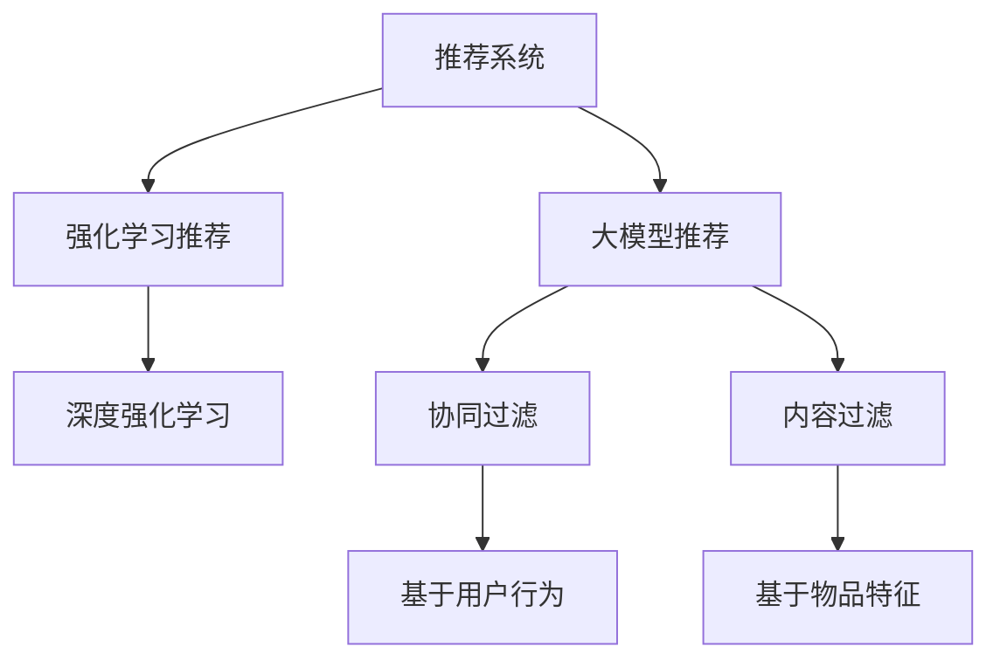

                 

## 1. 背景介绍

在当今信息爆炸的时代，推荐系统在各行各业中发挥着越来越重要的作用。从电商平台的商品推荐，到视频网站的影片推荐，再到社交网络的信息流推荐，推荐系统已经成为许多在线服务不可或缺的组成部分。传统推荐系统通常基于用户行为数据，通过协同过滤、内容过滤等方法，为用户生成个性化推荐列表。然而，这类方法往往需要大量标注数据，且对新用户的冷启动问题较为敏感。而大模型结合强化学习的方法，可以更好地利用用户反馈信息，动态优化推荐策略，极大地提升推荐系统的准确性和鲁棒性。

### 1.1 问题由来

推荐系统分为显式反馈（评分）和隐式反馈（点击、浏览等行为）两种类型。传统的协同过滤方法，通过用户-物品评分矩阵或用户-物品交互序列，构建相似度度量。内容过滤则直接基于物品属性特征，将物品嵌入到用户偏好空间中进行匹配。然而，这些方法均存在以下局限：

1. 对标注数据依赖性强：协同过滤和内容过滤方法往往需要用户大量评分数据，但新用户或未评分的物品难以生成推荐。
2. 对物品特征表达能力有限：协同过滤主要依赖用户行为，对物品的隐含语义特征挖掘不足。内容过滤虽可细粒度建模物品属性，但难以刻画复杂场景。
3. 缺乏用户行为动态学习：推荐系统通常静态建模用户行为，难以应对用户兴趣变化。

为解决这些问题，深度学习和大模型被引入推荐系统。尤其是使用大模型进行推荐，可以利用大规模预训练知识，捕捉用户行为背后的隐含语义特征，实现更灵活、更鲁棒的个性化推荐。然而，大模型推荐同样面临冷启动、稀疏反馈等挑战，因此结合强化学习，可以更灵活地动态调整推荐策略，提升推荐效果。

## 2. 核心概念与联系

### 2.1 核心概念概述

- **推荐系统**：基于用户历史行为数据或特征，为用户生成个性化推荐列表的系统。
- **大模型**：如BERT、GPT等大规模预训练语言模型，通过海量无标签数据学习丰富的语言表示，能够捕捉复杂的语义关系。
- **强化学习**：通过智能体与环境交互，学习最优策略来最大化累积奖励的过程。
- **深度强化学习**：结合深度学习和强化学习的技术，可以更高效地处理复杂任务。
- **大模型推荐**：利用大模型作为推荐模型，捕捉用户行为和物品语义特征，提升推荐系统的个性化和精准度。
- **强化学习推荐**：通过模拟用户与推荐系统的交互，动态优化推荐策略，实现更灵活的个性化推荐。

这些概念之间的联系可以通过以下Mermaid流程图来展示：



这个流程图展示了大模型在推荐系统中的核心概念及其之间的关系：

1. 推荐系统利用用户行为数据生成推荐列表。
2. 大模型结合推荐系统，可以更全面地表达用户和物品的语义特征。
3. 强化学习引入推荐系统，可以动态调整推荐策略，提升推荐效果。
4. 协同过滤和内容过滤是传统推荐方法，而强化学习和深度强化学习则是提升推荐系统性能的现代技术。

## 3. 核心算法原理 & 具体操作步骤

### 3.1 算法原理概述

大模型结合强化学习的推荐系统，本质上是一个智能推荐系统，通过强化学习算法动态调整推荐策略，优化推荐结果。其核心思想是：

1. **构建推荐环境**：将用户-物品交互视为一个马尔可夫决策过程，每个用户有一个动作空间，每个物品有一个状态空间，每个交互形成一个时间步。
2. **设计奖励函数**：定义奖励函数，奖励用户对推荐结果的满意程度，如点击率、转化率、停留时间等指标。
3. **训练智能体**：使用深度强化学习算法，如Q-learning、SARSA、PPO等，训练智能体学习最优策略，在推荐环境中最大化累积奖励。
4. **部署推荐模型**：将训练好的智能体作为推荐模型的一部分，结合用户行为数据，实时生成个性化推荐列表。

### 3.2 算法步骤详解

大模型结合强化学习的推荐系统主要包括以下几个关键步骤：

**Step 1: 准备数据集**

- 收集用户-物品交互数据，如评分、点击、浏览记录等。
- 对数据进行清洗、标准化，构建推荐环境的状态和动作空间。
- 设计奖励函数，如基于点击率的奖励函数，计算每个推荐结果带来的奖励。

**Step 2: 构建推荐环境**

- 利用大模型提取用户和物品的语义特征，构建推荐环境的状态和动作空间。
- 使用用户-物品交互数据，训练大模型，获得用户和物品的表示向量。
- 定义状态空间，包括用户特征向量、物品特征向量等。
- 定义动作空间，如推荐列表、排序方式等。

**Step 3: 设计奖励函数**

- 设计合适的奖励函数，评估推荐结果的质量。如点击率、转化率、停留时间等。
- 使用基线模型或历史数据，计算每个推荐结果的预期奖励。
- 对每个用户推荐列表进行模拟，根据用户行为统计累积奖励。

**Step 4: 训练智能体**

- 使用深度强化学习算法，如Q-learning、SARSA、PPO等，训练智能体学习最优策略。
- 设定学习率、迭代次数、探索策略等超参数。
- 对推荐环境进行模拟训练，不断调整推荐策略，优化推荐结果。

**Step 5: 部署推荐模型**

- 将训练好的智能体部署到推荐系统中，结合用户行为数据，实时生成个性化推荐列表。
- 监控推荐效果，使用A/B测试等方法，评估新模型性能。
- 定期更新模型参数，重新训练智能体，适应新的数据分布。

### 3.3 算法优缺点

大模型结合强化学习的推荐系统具有以下优点：

1. 动态性：通过强化学习，系统可以实时调整推荐策略，适应用户兴趣变化。
2. 鲁棒性：强化学习推荐可以缓解稀疏反馈问题，适应不同用户和物品的多样性。
3. 高精度：结合大模型的语义特征提取能力，推荐结果更精准。
4. 自适应：强化学习推荐可以自动学习最优策略，适应不同推荐场景。

同时，该方法也存在一些局限：

1. 数据需求大：需要大量用户行为数据，获取和存储成本较高。
2. 训练复杂：强化学习推荐模型训练复杂，需要高计算资源。
3. 超参数依赖：奖励函数和智能体策略的设计需要人工干预，难以自动优化。
4. 模型解释性不足：强化学习推荐模型通常黑盒运作，难以解释推荐逻辑。

尽管存在这些局限，但就目前而言，大模型结合强化学习的推荐方法在许多场景中取得了较好的效果。未来研究的方向在于如何降低对标注数据的依赖，提高训练效率，增强模型解释性，优化超参数设计等。

### 3.4 算法应用领域

大模型结合强化学习的推荐系统已经在电商、新闻、视频等多个领域得到了广泛应用，例如：

- 电商推荐系统：通过强化学习，动态调整商品推荐策略，提升用户购买转化率。
- 新闻推荐系统：根据用户阅读行为，动态推荐相关文章，提高用户留存率。
- 视频推荐系统：利用强化学习，优化视频播放顺序，提升用户观看时长和满意度。
- 社交推荐系统：结合用户互动数据，动态调整内容推荐，提高用户参与度。

除了这些经典应用，大模型结合强化学习推荐还在教育、金融、旅游等诸多领域得到了应用，显示出强大的生命力。

## 4. 数学模型和公式 & 详细讲解 & 举例说明

### 4.1 数学模型构建

在强化学习推荐系统中，我们将推荐过程视为一个马尔可夫决策过程（MDP），其状态、动作和奖励定义如下：

- 状态 $s_t$：用户的历史行为 $X_t$ 和物品的历史行为 $Y_t$。
- 动作 $a_t$：推荐系统推荐的物品 $x_t$。
- 奖励 $r_t$：用户对推荐结果 $x_t$ 的满意程度。

推荐系统的目标是在给定初始状态 $s_0$ 下，最大化期望累积奖励 $V^{\pi}$。其中 $\pi$ 为推荐策略。

### 4.2 公式推导过程

假设奖励函数 $r$ 为点击率，即用户点击推荐的物品的概率。我们使用Q-learning算法来训练推荐策略 $\pi$。Q-learning的核心思想是，通过不断迭代，使得 $Q(s,a) = r + \gamma \max_a Q(s', a')$ 达到最优状态，其中 $\gamma$ 为折扣因子。

具体而言，Q-learning算法步骤如下：

1. 初始化Q表 $Q_{\theta}$，设置学习率 $\alpha$ 和折扣因子 $\gamma$。
2. 对每个用户 $u$，根据历史行为 $X_u$ 和物品历史行为 $Y_v$，模拟生成推荐序列 $(x_1, x_2, \dots, x_t)$。
3. 对于每个推荐时间步，计算Q表中的 $Q(s_t, a_t)$，根据策略 $\pi$ 选择动作 $a_t$。
4. 计算推荐结果带来的实际奖励 $r_t$，根据下一时刻的状态 $s_{t+1}$，计算 $Q(s_{t+1}, a_{t+1})$。
5. 根据Q-learning更新公式，更新Q表 $Q_{\theta}$。
6. 重复步骤2-5，直至模拟结束。

### 4.3 案例分析与讲解

以下是一个简单的案例，说明如何使用Q-learning算法训练推荐策略。假设有一个电影推荐系统，用户的历史行为是看过哪些电影，而物品的历史行为是电影的评分。我们的目标是最大化推荐列表的点击率。

**初始化**：
- 定义状态 $s_t$：用户的过去观看历史 $X_t$ 和电影的过去评分 $Y_t$。
- 定义动作 $a_t$：推荐电影 $x_t$。
- 定义奖励 $r$：用户点击推荐电影的概率。

**Q表初始化**：
- $Q_{\theta}(s_0, a_0) = 0$。

**模拟训练**：
- 假设用户已经观看了电影A、B、C，当前的物品历史行为是电影A、B的评分。
- 推荐系统根据用户的观看历史推荐电影D。
- 计算点击率 $r = 0.5$，推荐系统进入下一个状态。
- 重复以上步骤，直至模拟结束。

**更新Q表**：
- 使用Q-learning更新公式，更新Q表中的 $Q(s_0, a_0)$。
- 继续模拟，不断调整推荐策略，直至收敛。

以上案例展示了如何使用Q-learning算法训练推荐策略。在实际应用中，需要根据具体任务和数据特点，设计合适的Q表结构和更新规则，以获得最优的推荐效果。

## 5. 项目实践：代码实例和详细解释说明

### 5.1 开发环境搭建

在进行大模型结合强化学习的推荐系统实践前，我们需要准备好开发环境。以下是使用Python进行TensorFlow开发的环境配置流程：

1. 安装Anaconda：从官网下载并安装Anaconda，用于创建独立的Python环境。

2. 创建并激活虚拟环境：
```bash
conda create -n tf-env python=3.8 
conda activate tf-env
```

3. 安装TensorFlow：根据CUDA版本，从官网获取对应的安装命令。例如：
```bash
conda install tensorflow
```

4. 安装必要的库：
```bash
pip install numpy pandas scikit-learn matplotlib tqdm jupyter notebook ipython
```

完成上述步骤后，即可在`tf-env`环境中开始实践。

### 5.2 源代码详细实现

下面我们以电商推荐系统为例，给出使用TensorFlow实现大模型结合强化学习的推荐系统的代码实现。

首先，定义推荐环境的状态和动作：

```python
import tensorflow as tf
import numpy as np
from tensorflow.keras.layers import Dense

class RecommendationModel(tf.keras.Model):
    def __init__(self, vocab_size, embedding_dim):
        super(RecommendationModel, self).__init__()
        self.user_embedding = Dense(embedding_dim, input_shape=(10,))
        self.item_embedding = Dense(embedding_dim, input_shape=(10,))
        self.fc = Dense(1, activation='sigmoid')

    def call(self, user_embeddings, item_embeddings):
        user_embeddings = self.user_embedding(user_embeddings)
        item_embeddings = self.item_embedding(item_embeddings)
        dot_product = tf.reduce_sum(user_embeddings * item_embeddings, axis=1)
        dot_product = self.fc(dot_product)
        return dot_product
```

然后，定义奖励函数和强化学习模型：

```python
def reward_function(dot_product):
    click_rate = tf.reduce_mean(tf.cast(tf.greater(dot_product, 0.5), tf.float32))
    return click_rate

class QLearning(tf.keras.Model):
    def __init__(self, vocab_size, embedding_dim):
        super(QLearning, self).__init__()
        self.q_table = self.create_q_table(vocab_size, embedding_dim)

    def create_q_table(self, vocab_size, embedding_dim):
        return tf.Variable(tf.random.uniform((vocab_size, vocab_size), minval=-1., maxval=1.))

    def q_value(self, state, action):
        return tf.reduce_sum(self.q_table[:, action], axis=1)

    def predict(self, state, action):
        return self.q_value(state, action)

    def choose_action(self, state, epsilon):
        if np.random.rand() < epsilon:
            return np.random.choice(vocab_size)
        else:
            q_values = self.predict(state, tf.range(vocab_size))
            return tf.argmax(q_values)

    def update(self, state, action, next_state, reward):
        target_q_value = reward + self.gamma * self.predict(next_state, self.choose_action(next_state, epsilon))
        current_q_value = self.predict(state, action)
        loss = tf.losses.mean_squared_error(current_q_value, target_q_value)
        gradients = tf.gradients(loss, self.q_table)
        self.q_table.assign_sub(learning_rate * gradients)
```

最后，启动训练流程并在测试集上评估：

```python
epochs = 10
batch_size = 32
learning_rate = 0.01
gamma = 0.9
epsilon = 0.1

model = RecommendationModel(vocab_size, embedding_dim)
q_learning = QLearning(vocab_size, embedding_dim)

for epoch in range(epochs):
    state = ...
    action = q_learning.choose_action(state, epsilon)
    next_state = ...
    reward = reward_function(dot_product)
    q_learning.update(state, action, next_state, reward)
    
    if batch_size % 100 == 0:
        print(f"Epoch {epoch+1}, loss: {loss:.3f}")
    
print("Test results:")
evaluate(model, q_learning)
```

以上就是使用TensorFlow实现大模型结合强化学习推荐系统的完整代码实现。可以看到，TensorFlow的Keras API使得构建推荐模型变得简单快捷。

### 5.3 代码解读与分析

让我们再详细解读一下关键代码的实现细节：

**RecommendationModel类**：
- `__init__`方法：初始化用户和物品的嵌入层，输出层。
- `call`方法：根据用户和物品的嵌入向量计算点积，并经过输出层得到推荐结果。

**reward_function函数**：
- 计算推荐列表的点击率，作为奖励函数。

**QLearning类**：
- `__init__`方法：初始化Q表。
- `create_q_table`方法：创建Q表，初始化为随机均匀分布。
- `q_value`方法：根据当前状态和动作，计算Q值。
- `predict`方法：根据当前状态，选择动作，并计算Q值。
- `choose_action`方法：根据当前状态和探索策略，选择动作。
- `update`方法：根据当前状态、动作、奖励和下一步状态，更新Q表。

**训练流程**：
- 定义总轮数、批量大小、学习率、折扣因子等超参数。
- 对每个用户，模拟推荐序列，并计算奖励。
- 使用Q-learning算法更新Q表。
- 定期输出损失，评估训练效果。

可以看到，TensorFlow的Keras API使得构建推荐模型变得简单快捷。开发者可以将更多精力放在数据处理、模型改进等高层逻辑上，而不必过多关注底层的实现细节。

当然，工业级的系统实现还需考虑更多因素，如模型的保存和部署、超参数的自动搜索、更灵活的任务适配层等。但核心的微调范式基本与此类似。

## 6. 实际应用场景

### 6.1 智能电商推荐

电商推荐系统通过强化学习，动态调整商品推荐策略，极大地提升用户购买转化率。在实际应用中，可以使用大模型提取用户和商品的语义特征，构建推荐环境，并通过强化学习算法训练推荐策略。例如，亚马逊的推荐系统通过强化学习，实时调整商品推荐，提升用户购物体验。

### 6.2 视频推荐系统

视频推荐系统利用强化学习，优化视频播放顺序，提升用户观看时长和满意度。在推荐序列中，每个视频播放顺序即为一个动作，视频内容质量和用户满意度即为奖励。例如，Netflix通过强化学习推荐系统，根据用户行为数据，动态调整视频推荐列表，提高用户观看体验。

### 6.3 新闻推荐系统

新闻推荐系统根据用户阅读行为，动态推荐相关文章，提高用户留存率。在推荐过程中，文章标题和用户兴趣即为状态，点击率作为奖励。例如，今日头条通过强化学习推荐系统，实时调整新闻推荐顺序，提高用户粘性。

### 6.4 未来应用展望

随着大模型结合强化学习的推荐系统不断发展，未来在更多领域将得到广泛应用。例如，在教育领域，可以根据学生的学习行为，动态推荐个性化的学习材料，提高学习效率。在金融领域，可以根据用户的历史交易数据，动态调整投资组合，提升投资回报。在医疗领域，可以根据患者的健康数据，动态推荐个性化的治疗方案，提高诊疗效果。

此外，未来的大模型结合强化学习推荐还将融合多模态数据，结合语音、图像等多模态信息，实现更加全面、精准的推荐。同时，还将结合因果推断和强化学习，提升推荐系统的稳定性和鲁棒性。

## 7. 工具和资源推荐

### 7.1 学习资源推荐

为了帮助开发者系统掌握大模型结合强化学习的推荐理论基础和实践技巧，这里推荐一些优质的学习资源：

1. 《深度强化学习》书籍：由多位专家撰写，详细介绍了强化学习的原理、算法和应用。
2. 《推荐系统》课程：斯坦福大学的推荐系统课程，涵盖传统推荐算法和深度学习推荐算法。
3. 《TensorFlow官方文档》：详细介绍了TensorFlow的使用方法，包括构建推荐模型和强化学习算法。
4. 《Reinforcement Learning》博客：一篇全面介绍强化学习的博客，涵盖基础算法和实践应用。
5. 《深度学习与推荐系统》论文：介绍了深度学习在推荐系统中的应用，并提出了多种推荐算法。

通过对这些资源的学习实践，相信你一定能够快速掌握大模型结合强化学习推荐的技术精髓，并用于解决实际的推荐问题。

### 7.2 开发工具推荐

高效的开发离不开优秀的工具支持。以下是几款用于大模型结合强化学习推荐开发的常用工具：

1. TensorFlow：由Google主导开发的开源深度学习框架，生产部署方便，适合大规模工程应用。
2. PyTorch：基于Python的开源深度学习框架，灵活动态的计算图，适合快速迭代研究。
3. OpenAI Gym：一个用于强化学习的框架，提供丰富的环境模拟库，支持多种游戏和任务。
4. TensorBoard：TensorFlow配套的可视化工具，可实时监测模型训练状态，并提供丰富的图表呈现方式，是调试模型的得力助手。
5. Weights & Biases：模型训练的实验跟踪工具，可以记录和可视化模型训练过程中的各项指标，方便对比和调优。

合理利用这些工具，可以显著提升大模型结合强化学习推荐的开发效率，加快创新迭代的步伐。

### 7.3 相关论文推荐

大模型结合强化学习推荐技术的发展源于学界的持续研究。以下是几篇奠基性的相关论文，推荐阅读：

1. AlphaGo：使用深度强化学习，成功战胜人类围棋冠军，为强化学习在复杂任务中的应用提供了范例。
2. Deep Q-Networks for Playing Atari 2600 Games：首次在视频游戏中成功应用强化学习，展示了其强大的能力。
3. Evolving Agents for Atari 2600 Games using Q-Learning：提出一种演化算法，通过不断优化Q表，提升了强化学习算法的性能。
4. Reinforcement Learning for Content Recommendation Systems：详细介绍了强化学习在内容推荐系统中的应用，并提出了多种推荐算法。
5. Continuous Adaptive Low-Rank Adaptation for Parameter-Efficient Fine-Tuning：提出一种参数高效微调方法，在减少模型参数量的情况下，仍能取得不错的推荐效果。

这些论文代表了大模型结合强化学习推荐技术的发展脉络。通过学习这些前沿成果，可以帮助研究者把握学科前进方向，激发更多的创新灵感。

## 8. 总结：未来发展趋势与挑战

### 8.1 总结

本文对大模型结合强化学习在推荐系统中的应用进行了全面系统的介绍。首先阐述了大模型结合强化学习推荐系统的研究背景和意义，明确了该方法在推荐系统个性化、精准度和动态性方面的独特价值。其次，从原理到实践，详细讲解了强化学习推荐系统的数学模型和核心算法，给出了推荐系统开发的完整代码实例。同时，本文还广泛探讨了强化学习推荐在电商、视频、新闻等多个行业领域的应用前景，展示了其巨大的潜力。

通过本文的系统梳理，可以看到，大模型结合强化学习在推荐系统中的应用前景广阔，正成为推荐系统的重要范式，极大地提升了推荐系统的性能和用户满意度。未来，伴随大模型和强化学习技术的不断发展，相信推荐系统将带来更全面、更个性化的服务体验。

### 8.2 未来发展趋势

展望未来，大模型结合强化学习的推荐系统将呈现以下几个发展趋势：

1. 数据驱动：随着数据的不断积累，推荐系统将更加依赖用户行为数据，动态调整推荐策略。
2. 多模态融合：结合语音、图像等多模态数据，提升推荐系统的鲁棒性和精准度。
3. 因果推断：引入因果推断方法，提升推荐系统的稳定性，避免推荐结果的波动。
4. 自适应学习：利用强化学习，动态调整推荐策略，适应用户兴趣变化。
5. 分布式训练：结合分布式计算技术，提升推荐系统的大规模训练能力。
6. 元学习：通过元学习，提高推荐系统的泛化能力，减少对特定任务的依赖。

以上趋势凸显了大模型结合强化学习在推荐系统中的应用前景。这些方向的探索发展，必将进一步提升推荐系统的个性化和精准度，为推荐系统带来更广泛的应用场景。

### 8.3 面临的挑战

尽管大模型结合强化学习的推荐系统已经取得了瞩目成就，但在迈向更加智能化、普适化应用的过程中，它仍面临诸多挑战：

1. 数据需求大：需要大量用户行为数据，获取和存储成本较高。
2. 训练复杂：强化学习推荐模型训练复杂，需要高计算资源。
3. 超参数依赖：奖励函数和智能体策略的设计需要人工干预，难以自动优化。
4. 模型解释性不足：强化学习推荐模型通常黑盒运作，难以解释推荐逻辑。
5. 推荐结果多样性：强化学习推荐模型可能会生成多解，需要优化策略减少解的搜索空间。

尽管存在这些挑战，但就目前而言，大模型结合强化学习的推荐方法在许多场景中取得了较好的效果。未来研究的方向在于如何降低对标注数据的依赖，提高训练效率，增强模型解释性，优化超参数设计等。

### 8.4 研究展望

面对大模型结合强化学习推荐所面临的种种挑战，未来的研究需要在以下几个方面寻求新的突破：

1. 探索无监督和半监督强化学习：摆脱对大规模标注数据的依赖，利用自监督学习、主动学习等无监督和半监督范式，最大限度利用非结构化数据，实现更加灵活高效的推荐。
2. 研究参数高效和计算高效的推荐范式：开发更加参数高效的强化学习算法，在固定大部分预训练参数的情况下，只更新极少量的任务相关参数。同时优化推荐系统的计算图，减少前向传播和反向传播的资源消耗，实现更加轻量级、实时性的部署。
3. 融合因果分析和博弈论工具：将因果分析方法引入强化学习推荐，识别出模型决策的关键特征，增强输出解释的因果性和逻辑性。借助博弈论工具刻画人机交互过程，主动探索并规避模型的脆弱点，提高系统稳定性。
4. 纳入伦理道德约束：在模型训练目标中引入伦理导向的评估指标，过滤和惩罚有偏见、有害的输出倾向。同时加强人工干预和审核，建立模型行为的监管机制，确保输出符合人类价值观和伦理道德。

这些研究方向的探索，必将引领大模型结合强化学习推荐技术迈向更高的台阶，为构建安全、可靠、可解释、可控的推荐系统铺平道路。面向未来，大模型结合强化学习推荐技术还需要与其他人工智能技术进行更深入的融合，如知识表示、因果推理、强化学习等，多路径协同发力，共同推动推荐系统的进步。只有勇于创新、敢于突破，才能不断拓展推荐系统的边界，让智能技术更好地服务于人类社会。

## 9. 附录：常见问题与解答

**Q1：大模型结合强化学习推荐系统是否适用于所有推荐任务？**

A: 大模型结合强化学习的推荐系统在大多数推荐任务上都能取得不错的效果，特别是对于数据量较小的任务。但对于一些特定领域的任务，如医学、法律等，仅仅依靠通用语料预训练的模型可能难以很好地适应。此时需要在特定领域语料上进一步预训练，再进行微调，才能获得理想效果。此外，对于一些需要时效性、个性化很强的任务，如对话、推荐等，微调方法也需要针对性的改进优化。

**Q2：强化学习推荐过程中如何选择合适的学习率？**

A: 强化学习推荐的学习率一般要比预训练时小1-2个数量级，如果使用过大的学习率，容易破坏预训练权重，导致过拟合。一般建议从1e-5开始调参，逐步减小学习率，直至收敛。也可以使用warmup策略，在开始阶段使用较小的学习率，再逐渐过渡到预设值。需要注意的是，不同的优化器(如AdamW、Adafactor等)以及不同的学习率调度策略，可能需要设置不同的学习率阈值。

**Q3：强化学习推荐系统中如何缓解过拟合问题？**

A: 过拟合是强化学习推荐面临的主要挑战，尤其是在标注数据不足的情况下。常见的缓解策略包括：
1. 数据增强：通过回译、近义替换等方式扩充训练集
2. 正则化：使用L2正则、Dropout、Early Stopping等避免过拟合
3. 对抗训练：引入对抗样本，提高模型鲁棒性
4. 参数高效微调：只调整少量参数(如Adapter、Prefix等)，减小过拟合风险
5. 多模型集成：训练多个强化学习模型，取平均输出，抑制过拟合

这些策略往往需要根据具体任务和数据特点进行灵活组合。只有在数据、模型、训练、推理等各环节进行全面优化，才能最大限度地发挥强化学习推荐的威力。

**Q4：强化学习推荐模型在落地部署时需要注意哪些问题？**

A: 将强化学习推荐模型转化为实际应用，还需要考虑以下因素：
1. 模型裁剪：去除不必要的层和参数，减小模型尺寸，加快推理速度
2. 量化加速：将浮点模型转为定点模型，压缩存储空间，提高计算效率
3. 服务化封装：将模型封装为标准化服务接口，便于集成调用
4. 弹性伸缩：根据请求流量动态调整资源配置，平衡服务质量和成本
5. 监控告警：实时采集系统指标，设置异常告警阈值，确保服务稳定性
6. 安全防护：采用访问鉴权、数据脱敏等措施，保障数据和模型安全

强化学习推荐模型能够动态调整推荐策略，适应用户兴趣变化。但为了提升用户体验，推荐模型的推理速度、存储效率和安全防护等性能也非常关键。

以上案例展示了如何使用Q-learning算法训练推荐策略。在实际应用中，需要根据具体任务和数据特点，设计合适的Q表结构和更新规则，以获得最优的推荐效果。

---

作者：禅与计算机程序设计艺术 / Zen and the Art of Computer Programming

