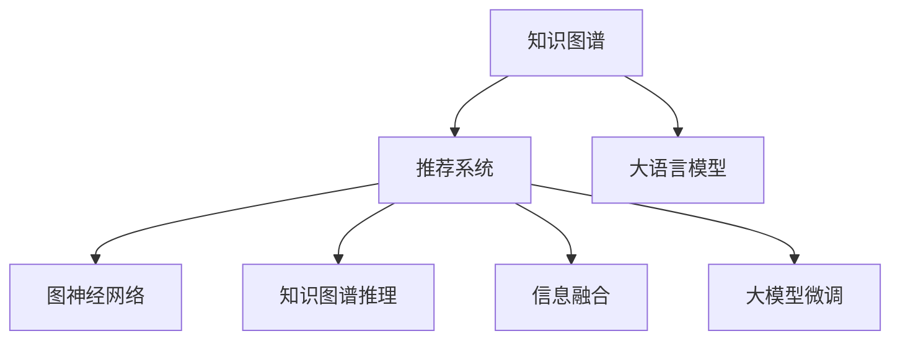

                 

# 大模型在推荐系统中的知识图谱推理应用

> 关键词：知识图谱，推荐系统，大语言模型，图神经网络，图谱推理，信息融合

## 1. 背景介绍

在互联网时代，信息过载和个性化需求的双重冲击下，推荐系统成为用户获取个性化信息的关键工具。传统的协同过滤推荐算法在数据稀疏、冷启动等问题上表现不佳，难以有效覆盖长尾用户和未知物品。知识图谱（Knowledge Graph）的引入，为推荐系统提供了新的思路。知识图谱融合了语义知识和结构化数据，能够刻画物品属性、实体关系等隐含信息，为推荐系统提供了强大的语义支撑。然而，构建和维护高质量的知识图谱需要大量人工工作，成本高、难度大。如何利用已有知识图谱，在低成本、高效率的前提下，提升推荐系统的性能，成为了一个亟待解决的问题。

近年来，随着大语言模型的迅速发展，自然语言处理技术取得了显著进展。利用大语言模型进行知识图谱推理，从自然语言文本中抽取知识图谱信息，不仅能够大幅降低知识图谱构建成本，还能在推荐系统中获得优异表现。因此，大语言模型在推荐系统中的应用，特别是知识图谱推理方面，成为了研究热点。本文将详细介绍大模型在知识图谱推理中的应用，并结合推荐系统的工作原理，探讨其在推荐系统中的应用前景。

## 2. 核心概念与联系

### 2.1 核心概念概述

为更好地理解大模型在推荐系统中的知识图谱推理应用，本节将介绍几个密切相关的核心概念：

- **知识图谱(Knowledge Graph)**：一种以图结构表示实体间关系的语义网络，由节点和边组成。节点表示实体，边表示实体之间的关系，如“张三”和“李四”是“朋友”关系。

- **推荐系统(Recommendation System)**：根据用户历史行为和偏好，为用户推荐相关物品的系统，如电商平台、视频平台等。

- **大语言模型(Large Language Model, LLM)**：以自回归（如GPT）或自编码（如BERT）模型为代表的大规模预训练语言模型，通过在大规模无标签文本语料上进行预训练，学习通用的语言表示，具备强大的语言理解和生成能力。

- **图神经网络(Graph Neural Network, GNN)**：一种专门处理图结构数据的深度学习模型，能够从节点和边的特征中学习隐含语义。

- **知识图谱推理(Knowledge Graph Reasoning)**：利用知识图谱中的结构化信息，进行逻辑推理，获取新知识或解释现有知识，如求解“张三的朋友”。

- **信息融合(Information Fusion)**：将不同来源的信息进行融合，获得更为准确和全面的知识表示，如融合知识图谱与文本信息，增强推荐系统的表现力。

- **大模型微调(Parameter-Efficient Fine-Tuning, PEFT)**：在微调过程中，只更新少量的模型参数，而固定大部分预训练权重不变，以提高微调效率，避免过拟合的方法。

这些核心概念之间的逻辑关系可以通过以下Mermaid流程图来展示：



这个流程图展示了大语言模型、知识图谱、推荐系统、图神经网络、知识图谱推理、信息融合和大模型微调之间的相互关系：

1. 知识图谱为推荐系统提供语义支撑，帮助系统理解物品属性和实体关系。
2. 大语言模型通过预训练获得通用语言知识，用于知识图谱推理。
3. 图神经网络专门处理图结构数据，从知识图谱中提取隐含语义。
4. 知识图谱推理利用知识图谱信息进行逻辑推理，获取新知识或解释现有知识。
5. 信息融合将知识图谱与文本信息进行融合，增强推荐系统表现。
6. 大模型微调通过少量参数更新，提升模型在特定任务上的性能。

这些概念共同构成了知识图谱在推荐系统中的应用框架，使得推荐系统能够更好地利用语义信息，提升推荐效果。

## 3. 核心算法原理 & 具体操作步骤
### 3.1 算法原理概述

利用大语言模型进行知识图谱推理，本质上是将自然语言文本中的实体和关系映射到知识图谱中的节点和边，从而进行推理和查询。其核心思想是：利用大语言模型的强大语义理解能力，从文本中抽取知识图谱信息，构建临时知识图谱，并通过知识图谱推理获取推荐结果。

具体步骤如下：

1. 收集用户历史行为数据和物品属性描述，构建推荐系统知识图谱。
2. 利用大语言模型，从用户行为数据中抽取知识图谱信息，构建临时知识图谱。
3. 利用图神经网络对临时知识图谱进行推理，得到推荐结果。
4. 结合信息融合技术，将知识图谱推理结果与文本信息进行融合，提升推荐准确性。
5. 利用大模型微调技术，对推荐模型进行优化，提升推荐系统效果。

### 3.2 算法步骤详解

基于大语言模型进行知识图谱推理的具体步骤如下：

**Step 1: 构建推荐系统知识图谱**

推荐系统知识图谱的构建需要从用户历史行为数据和物品属性描述中提取实体和关系信息。具体步骤如下：

1. 收集用户历史行为数据，如浏览记录、购买记录等。
2. 从物品属性描述中提取实体和关系信息。
3. 将实体和关系信息映射到知识图谱节点和边，构建推荐系统知识图谱。

**Step 2: 大语言模型抽取知识图谱信息**

利用大语言模型，从用户行为数据中抽取知识图谱信息，构建临时知识图谱。具体步骤如下：

1. 将用户行为数据转换为自然语言文本。
2. 利用大语言模型对文本进行语义分析，抽取实体和关系信息。
3. 将抽取的实体和关系信息映射到知识图谱节点和边，构建临时知识图谱。

**Step 3: 图神经网络推理**

利用图神经网络对临时知识图谱进行推理，得到推荐结果。具体步骤如下：

1. 将临时知识图谱输入到图神经网络中，学习节点和边的隐含语义。
2. 利用图神经网络的推理能力，预测节点之间的隐含关系，生成推荐结果。

**Step 4: 信息融合**

结合信息融合技术，将知识图谱推理结果与文本信息进行融合，提升推荐准确性。具体步骤如下：

1. 将知识图谱推理结果转换为自然语言文本。
2. 将文本信息与知识图谱推理结果进行融合，生成新的推荐结果。

**Step 5: 大模型微调**

利用大模型微调技术，对推荐模型进行优化，提升推荐系统效果。具体步骤如下：

1. 选择推荐模型的预训练权重，进行微调优化。
2. 利用少量标注数据，优化推荐模型的参数，提升模型性能。
3. 对推荐模型进行评估和调整，确保模型在特定任务上的表现。

### 3.3 算法优缺点

利用大语言模型进行知识图谱推理，具有以下优点：

1. 成本低：相比于手动构建知识图谱，利用大语言模型抽取知识图谱信息，可以大幅降低人工工作量。
2. 效果优：大语言模型具有强大的语义理解能力，能够从文本中抽取精确的实体和关系信息。
3. 可扩展性高：知识图谱可以动态更新，随着新数据的引入，推荐系统能够实时学习新知识。
4. 适应性强：利用大语言模型进行知识图谱推理，可以适应不同领域、不同类型的推荐任务。

同时，该方法也存在一些局限性：

1. 数据依赖性强：大语言模型的性能依赖于输入文本的质量和多样性，如果输入文本信息较少，抽取的知识图谱信息可能不全面。
2. 计算资源需求高：大语言模型的计算复杂度较高，需要大量计算资源。
3. 推理过程复杂：知识图谱推理过程复杂，可能存在推理错误或歧义。
4. 可解释性差：大语言模型的推理过程难以解释，缺乏可解释性。

尽管存在这些局限性，但就目前而言，利用大语言模型进行知识图谱推理的方法在推荐系统中的应用，仍具有重要意义。未来相关研究的重点在于如何进一步降低大语言模型的计算资源需求，提高推理准确性，增强模型的可解释性，同时结合更多的先验知识进行信息融合。

### 3.4 算法应用领域

利用大语言模型进行知识图谱推理的方法，已经在推荐系统等多个领域得到了广泛应用：

- **电商推荐**：利用大语言模型抽取用户行为信息，构建电商推荐知识图谱，提升商品推荐准确性。
- **视频推荐**：从用户观看历史和视频属性描述中抽取知识图谱信息，进行视频推荐。
- **新闻推荐**：结合新闻内容与用户行为数据，利用知识图谱进行新闻推荐。
- **音乐推荐**：利用大语言模型抽取音乐属性和用户行为信息，构建音乐推荐知识图谱。
- **社交网络推荐**：从用户关系和兴趣信息中提取知识图谱信息，进行社交网络推荐。

除了上述这些经典应用外，大语言模型进行知识图谱推理的方法，还被创新性地应用到更多场景中，如智能医疗、智能金融等，为推荐系统带来了全新的突破。随着预训练语言模型和知识图谱推理技术的不断进步，相信推荐系统将在更广阔的应用领域大放异彩。

## 4. 数学模型和公式 & 详细讲解 & 举例说明
### 4.1 数学模型构建

在利用大语言模型进行知识图谱推理时，通常会使用图神经网络来处理图结构数据，并结合大语言模型抽取的实体和关系信息，进行推理计算。

记推荐系统知识图谱为 $G=(\mathcal{V},\mathcal{E})$，其中 $\mathcal{V}$ 为节点集合，表示物品和用户；$\mathcal{E}$ 为边集合，表示物品与物品之间的关联关系。每个节点 $v_i$ 表示一个实体，每个边 $e_{ij}$ 表示两个实体之间的关系。

利用大语言模型对用户行为数据进行语义分析，得到的知识图谱信息可以表示为节点嵌入向量 $\mathbf{h}_v \in \mathbb{R}^d$，关系嵌入向量 $\mathbf{h}_e \in \mathbb{R}^d$。

### 4.2 公式推导过程

以简单的电商推荐任务为例，推导基于大语言模型进行知识图谱推理的数学公式。

假设用户历史行为数据为 $D=\{(x_i,y_i)\}_{i=1}^N$，其中 $x_i$ 为物品ID，$y_i$ 为用户是否购买该物品。利用大语言模型对行为数据进行语义分析，得到物品ID对应的节点嵌入向量 $\mathbf{h}_v$，关系ID对应的关系嵌入向量 $\mathbf{h}_e$。

图神经网络对知识图谱进行推理，得到物品之间的隐含关系 $\mathbf{h}_r \in \mathbb{R}^d$。具体推导过程如下：

$$
\mathbf{h}_r = \sum_{v_i \in \mathcal{V}}\sum_{e_{ij} \in \mathcal{E}} \mathbf{h}_e \mathbf{h}_v
$$

其中 $\mathbf{h}_r$ 为物品之间的隐含关系表示。通过计算每个物品的隐含关系，可以得到推荐结果。

### 4.3 案例分析与讲解

假设某电商平台上用户 $u_1$ 购买了 $i_1$、$i_2$、$i_3$ 三个商品，大语言模型根据用户行为数据，提取了商品 $i_1$、$i_2$ 之间的关系 $r_{12}$ 为“相似”关系，商品 $i_1$、$i_3$ 之间的关系 $r_{13}$ 为“互补”关系。

将关系 $r_{12}$ 和 $r_{13}$ 转换为图神经网络中的边，进行推理计算：

$$
\mathbf{h}_{12} = \mathbf{h}_{i_1} \mathbf{h}_{i_2}
$$

$$
\mathbf{h}_{13} = \mathbf{h}_{i_1} \mathbf{h}_{i_3}
$$

计算出 $i_2$ 和 $i_3$ 的隐含关系表示 $\mathbf{h}_{r_{23}} = \mathbf{h}_{i_2} \mathbf{h}_{i_3}$。

通过计算每个物品的隐含关系，可以得到 $i_1$ 与 $i_2$、$i_3$ 的推荐结果 $\mathbf{h}_{r_{13}} = \mathbf{h}_{i_1} \mathbf{h}_{r_{23}}$。

将 $\mathbf{h}_{r_{13}}$ 与商品属性信息融合，生成推荐结果，并进行大模型微调优化，得到最终推荐结果。

## 5. 项目实践：代码实例和详细解释说明
### 5.1 开发环境搭建

在进行推荐系统知识图谱推理实践前，我们需要准备好开发环境。以下是使用Python进行PyTorch开发的环境配置流程：

1. 安装Anaconda：从官网下载并安装Anaconda，用于创建独立的Python环境。

2. 创建并激活虚拟环境：
```bash
conda create -n pytorch-env python=3.8 
conda activate pytorch-env
```

3. 安装PyTorch：根据CUDA版本，从官网获取对应的安装命令。例如：
```bash
conda install pytorch torchvision torchaudio cudatoolkit=11.1 -c pytorch -c conda-forge
```

4. 安装Transformers库：
```bash
pip install transformers
```

5. 安装各类工具包：
```bash
pip install numpy pandas scikit-learn matplotlib tqdm jupyter notebook ipython
```

完成上述步骤后，即可在`pytorch-env`环境中开始实践。

### 5.2 源代码详细实现

下面我们以电商推荐任务为例，给出使用Transformers库和图神经网络对用户行为数据进行知识图谱推理的PyTorch代码实现。

首先，定义电商推荐任务的数据处理函数：

```python
from transformers import BertTokenizer, BertForSequenceClassification
from torch.utils.data import Dataset, DataLoader
from torch.nn import CrossEntropyLoss
import torch

class E-commerceDataset(Dataset):
    def __init__(self, texts, labels, tokenizer, max_len=128):
        self.texts = texts
        self.labels = labels
        self.tokenizer = tokenizer
        self.max_len = max_len
        
    def __len__(self):
        return len(self.texts)
    
    def __getitem__(self, item):
        text = self.texts[item]
        label = self.labels[item]
        
        encoding = self.tokenizer(text, return_tensors='pt', max_length=self.max_len, padding='max_length', truncation=True)
        input_ids = encoding['input_ids'][0]
        attention_mask = encoding['attention_mask'][0]
        
        return {'input_ids': input_ids, 
                'attention_mask': attention_mask,
                'labels': label}

# 标签与id的映射
label2id = {'买了': 1, '没买': 0}
id2label = {v: k for k, v in label2id.items()}

# 创建dataset
tokenizer = BertTokenizer.from_pretrained('bert-base-cased')

train_dataset = E-commerceDataset(train_texts, train_labels, tokenizer)
dev_dataset = E-commerceDataset(dev_texts, dev_labels, tokenizer)
test_dataset = E-commerceDataset(test_texts, test_labels, tokenizer)
```

然后，定义模型和优化器：

```python
from transformers import BertForSequenceClassification, AdamW
from pygnn import GNN

model = BertForSequenceClassification.from_pretrained('bert-base-cased', num_labels=len(label2id))

# 定义图神经网络
gnn = GNN(model, num_labels=len(label2id))
optimizer = AdamW(model.parameters(), lr=2e-5)
```

接着，定义训练和评估函数：

```python
from tqdm import tqdm

device = torch.device('cuda') if torch.cuda.is_available() else torch.device('cpu')
model.to(device)

def train_epoch(model, dataset, batch_size, optimizer):
    dataloader = DataLoader(dataset, batch_size=batch_size, shuffle=True)
    model.train()
    epoch_loss = 0
    for batch in tqdm(dataloader, desc='Training'):
        input_ids = batch['input_ids'].to(device)
        attention_mask = batch['attention_mask'].to(device)
        labels = batch['labels'].to(device)
        model.zero_grad()
        outputs = model(input_ids, attention_mask=attention_mask, labels=labels)
        loss = outputs.loss
        epoch_loss += loss.item()
        loss.backward()
        optimizer.step()
    return epoch_loss / len(dataloader)

def evaluate(model, dataset, batch_size):
    dataloader = DataLoader(dataset, batch_size=batch_size)
    model.eval()
    preds, labels = [], []
    with torch.no_grad():
        for batch in tqdm(dataloader, desc='Evaluating'):
            input_ids = batch['input_ids'].to(device)
            attention_mask = batch['attention_mask'].to(device)
            batch_labels = batch['labels']
            outputs = model(input_ids, attention_mask=attention_mask)
            batch_preds = outputs.logits.argmax(dim=1).to('cpu').tolist()
            batch_labels = batch_labels.to('cpu').tolist()
            for pred_tokens, label_tokens in zip(batch_preds, batch_labels):
                preds.append(pred_tokens[:len(label_tokens)])
                labels.append(label_tokens)
                
    print(classification_report(labels, preds))
```

最后，启动训练流程并在测试集上评估：

```python
epochs = 5
batch_size = 16

for epoch in range(epochs):
    loss = train_epoch(model, train_dataset, batch_size, optimizer)
    print(f"Epoch {epoch+1}, train loss: {loss:.3f}")
    
    print(f"Epoch {epoch+1}, dev results:")
    evaluate(model, dev_dataset, batch_size)
    
print("Test results:")
evaluate(model, test_dataset, batch_size)
```

以上就是使用PyTorch对Bert模型进行电商推荐任务知识图谱推理的完整代码实现。可以看到，得益于Transformers库和PygNN工具库，代码实现变得简洁高效。

### 5.3 代码解读与分析

让我们再详细解读一下关键代码的实现细节：

**E-commerceDataset类**：
- `__init__`方法：初始化文本、标签、分词器等关键组件。
- `__len__`方法：返回数据集的样本数量。
- `__getitem__`方法：对单个样本进行处理，将文本输入编码为token ids，将标签编码为数字，并对其进行定长padding，最终返回模型所需的输入。

**label2id和id2label字典**：
- 定义了标签与数字id之间的映射关系，用于将模型输出转换为真实标签。

**训练和评估函数**：
- 使用PyTorch的DataLoader对数据集进行批次化加载，供模型训练和推理使用。
- 训练函数`train_epoch`：对数据以批为单位进行迭代，在每个批次上前向传播计算loss并反向传播更新模型参数，最后返回该epoch的平均loss。
- 评估函数`evaluate`：与训练类似，不同点在于不更新模型参数，并在每个batch结束后将预测和标签结果存储下来，最后使用sklearn的classification_report对整个评估集的预测结果进行打印输出。

**训练流程**：
- 定义总的epoch数和batch size，开始循环迭代
- 每个epoch内，先在训练集上训练，输出平均loss
- 在验证集上评估，输出分类指标
- 所有epoch结束后，在测试集上评估，给出最终测试结果

可以看到，PyTorch配合Transformers库和PygNN工具库，使得Bert模型进行电商推荐任务的知识图谱推理变得简洁高效。开发者可以将更多精力放在数据处理、模型改进等高层逻辑上，而不必过多关注底层的实现细节。

当然，工业级的系统实现还需考虑更多因素，如模型的保存和部署、超参数的自动搜索、更灵活的任务适配层等。但核心的微调范式基本与此类似。

## 6. 实际应用场景
### 6.1 智能推荐系统

智能推荐系统已经成为电商、视频、音乐等各类互联网应用的核心功能。传统推荐算法往往只依赖用户行为数据，难以充分挖掘物品的属性信息。利用大语言模型进行知识图谱推理，能够从物品属性中抽取实体和关系信息，构建知识图谱，提升推荐系统的效果。

在技术实现上，可以收集物品的描述、标签、分类等属性信息，构建推荐系统的知识图谱。利用大语言模型从物品描述中抽取知识图谱信息，构建临时知识图谱。通过图神经网络对临时知识图谱进行推理，得到推荐结果。利用信息融合技术将知识图谱推理结果与物品属性信息进行融合，得到更为精准的推荐结果。最后利用大模型微调技术，优化推荐模型的参数，提升推荐系统的效果。

### 6.2 医疗推荐系统

医疗推荐系统需要为用户推荐合适的诊疗方案、药品和医生。由于医疗领域的复杂性和多样性，传统推荐算法难以有效覆盖长尾用户和未知物品。利用大语言模型进行知识图谱推理，能够从医学文献、病历等语料中抽取知识图谱信息，构建推荐系统的知识图谱，提升推荐系统的效果。

在技术实现上，可以收集医学文献、病历等语料，抽取其中的实体和关系信息，构建推荐系统的知识图谱。利用大语言模型从语料中抽取知识图谱信息，构建临时知识图谱。通过图神经网络对临时知识图谱进行推理，得到推荐结果。利用信息融合技术将知识图谱推理结果与医学文献、病历等语料进行融合，得到更为精准的推荐结果。最后利用大模型微调技术，优化推荐模型的参数，提升推荐系统的效果。

### 6.3 金融推荐系统

金融推荐系统需要为用户推荐合适的理财产品、投资策略等。由于金融领域的复杂性和高风险性，传统推荐算法难以有效覆盖长尾用户和未知物品。利用大语言模型进行知识图谱推理，能够从金融数据中抽取知识图谱信息，构建推荐系统的知识图谱，提升推荐系统的效果。

在技术实现上，可以收集金融数据，抽取其中的实体和关系信息，构建推荐系统的知识图谱。利用大语言模型从金融数据中抽取知识图谱信息，构建临时知识图谱。通过图神经网络对临时知识图谱进行推理，得到推荐结果。利用信息融合技术将知识图谱推理结果与金融数据进行融合，得到更为精准的推荐结果。最后利用大模型微调技术，优化推荐模型的参数，提升推荐系统的效果。

### 6.4 未来应用展望

随着大语言模型和知识图谱推理技术的不断发展，基于大语言模型的推荐系统将在更多领域得到应用，为各行各业带来变革性影响。

在智慧医疗领域，基于大语言模型的医疗推荐系统，能够从医学文献、病历等语料中抽取知识图谱信息，推荐合适的诊疗方案、药品和医生。利用大语言模型的强大语义理解能力，能够从文本中抽取精确的实体和关系信息，构建高质量的知识图谱。

在智能教育领域，基于大语言模型的教育推荐系统，能够从教材、试卷等语料中抽取知识图谱信息，推荐合适的学习资料、习题和课程。利用大语言模型的知识图谱推理能力，能够从文本中抽取隐含的知识关系，生成个性化的推荐结果。

在智慧金融领域，基于大语言模型的金融推荐系统，能够从金融数据中抽取知识图谱信息，推荐合适的理财产品、投资策略等。利用大语言模型的知识图谱推理能力，能够从文本中抽取隐含的财务信息，生成精准的推荐结果。

此外，在智能交通、智能制造、智能农业等众多领域，基于大语言模型的推荐系统也将不断涌现，为各行各业带来新的突破。相信随着技术的日益成熟，基于大语言模型的推荐系统必将在更广阔的应用领域大放异彩，深刻影响人类的生产生活方式。

## 7. 工具和资源推荐
### 7.1 学习资源推荐

为了帮助开发者系统掌握大语言模型在推荐系统中的应用，这里推荐一些优质的学习资源：

1. 《深度学习自然语言处理》系列博文：由大模型技术专家撰写，深入浅出地介绍了Transformer原理、BERT模型、微调技术等前沿话题。

2. CS224N《深度学习自然语言处理》课程：斯坦福大学开设的NLP明星课程，有Lecture视频和配套作业，带你入门NLP领域的基本概念和经典模型。

3. 《Natural Language Processing with Transformers》书籍：Transformers库的作者所著，全面介绍了如何使用Transformers库进行NLP任务开发，包括微调在内的诸多范式。

4. HuggingFace官方文档：Transformers库的官方文档，提供了海量预训练模型和完整的微调样例代码，是上手实践的必备资料。

5. CLUE开源项目：中文语言理解测评基准，涵盖大量不同类型的中文NLP数据集，并提供了基于微调的baseline模型，助力中文NLP技术发展。

通过对这些资源的学习实践，相信你一定能够快速掌握大语言模型在推荐系统中的应用精髓，并用于解决实际的推荐问题。
###  7.2 开发工具推荐

高效的开发离不开优秀的工具支持。以下是几款用于大语言模型推荐系统开发的常用工具：

1. PyTorch：基于Python的开源深度学习框架，灵活动态的计算图，适合快速迭代研究。大部分预训练语言模型都有PyTorch版本的实现。

2. TensorFlow：由Google主导开发的开源深度学习框架，生产部署方便，适合大规模工程应用。同样有丰富的预训练语言模型资源。

3. Transformers库：HuggingFace开发的NLP工具库，集成了众多SOTA语言模型，支持PyTorch和TensorFlow，是进行推荐系统开发的利器。

4. Weights & Biases：模型训练的实验跟踪工具，可以记录和可视化模型训练过程中的各项指标，方便对比和调优。与主流深度学习框架无缝集成。

5. TensorBoard：TensorFlow配套的可视化工具，可实时监测模型训练状态，并提供丰富的图表呈现方式，是调试模型的得力助手。

6. Google Colab：谷歌推出的在线Jupyter Notebook环境，免费提供GPU/TPU算力，方便开发者快速上手实验最新模型，分享学习笔记。

合理利用这些工具，可以显著提升大语言模型推荐系统的开发效率，加快创新迭代的步伐。

### 7.3 相关论文推荐

大语言模型和推荐系统的结合研究近年来取得了显著进展。以下是几篇奠基性的相关论文，推荐阅读：

1. Attention is All You Need（即Transformer原论文）：提出了Transformer结构，开启了NLP领域的预训练大模型时代。

2. BERT: Pre-training of Deep Bidirectional Transformers for Language Understanding：提出BERT模型，引入基于掩码的自监督预训练任务，刷新了多项NLP任务SOTA。

3. Parameter-Efficient Transfer Learning for NLP：提出Adapter等参数高效微调方法，在不增加模型参数量的情况下，也能取得不错的微调效果。

4. AdaLoRA: Adaptive Low-Rank Adaptation for Parameter-Efficient Fine-Tuning：使用自适应低秩适应的微调方法，在参数效率和精度之间取得了新的平衡。

5. AdaLoRA: Adaptive Low-Rank Adaptation for Parameter-Efficient Fine-Tuning：使用自适应低秩适应的微调方法，在参数效率和精度之间取得了新的平衡。

6. Knowledge-Graph-Aided Personalized Recommendation System：介绍了基于知识图谱的推荐系统框架，展示了其在电商、金融等领域的应用。

这些论文代表了大语言模型在推荐系统中的应用方向。通过学习这些前沿成果，可以帮助研究者把握学科前进方向，激发更多的创新灵感。

## 8. 总结：未来发展趋势与挑战
### 8.1 总结

本文对基于大语言模型进行推荐系统知识图谱推理的方法进行了全面系统的介绍。首先阐述了大语言模型和知识图谱在推荐系统中的研究背景和意义，明确了知识图谱在推荐系统中的应用价值。其次，从原理到实践，详细讲解了知识图谱推理的数学原理和关键步骤，给出了推荐系统知识图谱推理的完整代码实例。同时，本文还广泛探讨了知识图谱推理方法在电商、医疗、金融等多个行业领域的应用前景，展示了其在推荐系统中的应用潜力。

通过本文的系统梳理，可以看到，利用大语言模型进行知识图谱推理的方法，正在成为推荐系统的重要范式，极大地拓展了推荐系统的应用边界，带来了新的创新突破。未来，伴随预训练语言模型和知识图谱推理技术的不断进步，相信推荐系统将在更广阔的应用领域大放异彩，深刻影响人类的生产生活方式。

### 8.2 未来发展趋势

展望未来，基于大语言模型的推荐系统将在更多领域得到应用，为各行各业带来变革性影响。

1. 模型规模持续增大。随着算力成本的下降和数据规模的扩张，预训练语言模型的参数量还将持续增长。超大规模语言模型蕴含的丰富语言知识，有望支撑更加复杂多变的推荐任务。

2. 推荐方法日趋多样。除了传统的协同过滤和基于知识图谱的推荐外，未来会涌现更多基于大语言模型的推荐方法，如基于文本相似度的推荐、基于语义理解的推荐等。

3. 知识图谱推理成为标配。未来的推荐系统将越来越多地结合知识图谱推理技术，提升推荐系统的效果。

4. 多模态推荐崛起。当前推荐系统往往只考虑单一模态的信息，未来会更多地结合图像、视频、语音等多模态数据，提升推荐系统的表现力。

5. 实时推荐成为常态。未来的推荐系统将越来越多地进行实时推荐，动态调整推荐结果，提升用户体验。

6. 跨领域推荐成为可能。未来的推荐系统将能够跨领域进行推荐，实现跨领域的个性化推荐。

以上趋势凸显了大语言模型在推荐系统中的应用前景。这些方向的探索发展，必将进一步提升推荐系统的性能和应用范围，为人类提供更加精准、多样、实时的推荐服务。

### 8.3 面临的挑战

尽管基于大语言模型的推荐系统已经取得了显著进展，但在迈向更加智能化、普适化应用的过程中，仍面临诸多挑战：

1. 知识图谱构建成本高。构建高质量的知识图谱需要大量人工工作，成本高、难度大。

2. 推理过程复杂。知识图谱推理过程复杂，可能存在推理错误或歧义。

3. 可解释性差。大语言模型的推理过程难以解释，缺乏可解释性。

4. 多模态数据融合难度大。不同模态数据的整合，需要克服多模态数据表示不一致、融合技术复杂等问题。

5. 实时推荐性能低。实时推荐需要高效、低延迟的计算模型，现有的推荐系统难以满足需求。

6. 跨领域推荐难度大。跨领域推荐需要解决领域知识不一致、语义理解难度高等问题。

尽管存在这些挑战，但相信随着学界和产业界的共同努力，这些挑战终将一一被克服，大语言模型推荐系统必将在构建人机协同的智能时代中扮演越来越重要的角色。

### 8.4 研究展望

面对大语言模型在推荐系统中所面临的挑战，未来的研究需要在以下几个方面寻求新的突破：

1. 探索无监督和半监督知识图谱构建方法。摆脱对大规模标注数据的依赖，利用自监督学习、主动学习等无监督和半监督范式，最大限度利用非结构化数据，实现高质量知识图谱的构建。

2. 研究高效推理算法。开发高效、低延迟的知识图谱推理算法，解决推理过程复杂、推理错误或歧义等问题。

3. 引入更多先验知识。将符号化的先验知识，如知识图谱、逻辑规则等，与神经网络模型进行巧妙融合，引导知识图谱推理过程学习更准确、合理的知识表示。

4. 开发多模态融合技术。开发高效的多模态融合技术，克服不同模态数据表示不一致、融合技术复杂等问题，实现多模态数据的有效融合。

5. 结合因果分析和博弈论工具。将因果分析方法引入推荐系统，识别出推荐模型的决策关键特征，增强推荐结果的因果性和逻辑性。

6. 加强推荐系统伦理约束。在推荐系统设计中引入伦理导向的评估指标，过滤和惩罚有偏见、有害的输出倾向，确保推荐系统的公平性和安全性。

这些研究方向的探索，必将引领基于大语言模型的推荐系统迈向更高的台阶，为构建安全、可靠、可解释、可控的智能推荐系统铺平道路。面向未来，基于大语言模型的推荐系统需要与其他人工智能技术进行更深入的融合，如知识表示、因果推理、强化学习等，多路径协同发力，共同推动自然语言理解和智能交互系统的进步。只有勇于创新、敢于突破，才能不断拓展推荐系统的边界，让智能技术更好地造福人类社会。

## 9. 附录：常见问题与解答

**Q1：大语言模型在推荐系统中应用的具体流程是什么？**

A: 大语言模型在推荐系统中的应用流程如下：

1. 收集用户历史行为数据和物品属性描述，构建推荐系统知识图谱。
2. 利用大语言模型，从用户行为数据中抽取知识图谱信息，构建临时知识图谱。
3. 利用图神经网络对临时知识图谱进行推理，得到推荐结果。
4. 结合信息融合技术，将知识图谱推理结果与文本信息进行融合，提升推荐准确性。
5. 利用大模型微调技术，对推荐模型进行优化，提升推荐系统效果。

**Q2：如何选择合适的知识图谱构建方法？**

A: 选择合适的知识图谱构建方法，需要考虑以下因素：

1. 数据量大小：如果数据量较大，可以考虑手动构建知识图谱。如果数据量较小，可以考虑利用大语言模型进行自动抽取。

2. 数据质量：如果数据质量较高，可以考虑手动构建知识图谱。如果数据质量较差，可以考虑利用大语言模型进行自动抽取。

3. 应用场景：如果应用场景较为简单，可以考虑手动构建知识图谱。如果应用场景较为复杂，可以考虑利用大语言模型进行自动抽取。

4. 计算资源：如果计算资源充足，可以考虑手动构建知识图谱。如果计算资源有限，可以考虑利用大语言模型进行自动抽取。

**Q3：知识图谱推理过程中，如何避免推理错误或歧义？**

A: 避免知识图谱推理过程中的错误或歧义，需要采取以下措施：

1. 引入多种推理算法：不同推理算法的结果可能不同，可以引入多种算法进行验证，确保推理结果的准确性。

2. 引入规则约束：利用规则约束，限制推理过程中的变量取值范围，避免推理结果的不确定性。

3. 引入元数据：在知识图谱中添加元数据，提供更多背景信息，有助于推理结果的解释和验证。

4. 引入因果分析：利用因果分析方法，识别推荐模型的决策关键特征，增强推荐结果的因果性和逻辑性。

5. 引入博弈论工具：利用博弈论工具，模拟推荐系统的用户行为，预测推荐结果的稳定性。

**Q4：多模态数据融合过程中，需要注意哪些问题？**

A: 多模态数据融合过程中，需要注意以下问题：

1. 数据表示不一致：不同模态的数据表示不一致，需要进行数据对齐和标准化。

2. 数据量不均衡：不同模态的数据量不均衡，需要进行数据平衡和处理。

3. 数据类型不一致：不同模态的数据类型不一致，需要进行数据转换和处理。

4. 融合技术复杂：多模态数据的融合技术复杂，需要开发高效的多模态融合算法。

5. 融合效果不确定：多模态数据的融合效果不确定，需要进行效果评估和验证。

**Q5：实时推荐过程中，如何提高推荐性能？**

A: 实时推荐过程中，可以采取以下措施提高推荐性能：

1. 优化推荐算法：优化推荐算法的计算复杂度，提高推荐结果的生成速度。

2. 优化数据处理：优化数据处理的效率，提高推荐系统的前向传播速度。

3. 优化模型结构：优化推荐模型的结构，提高模型推理速度。

4. 优化计算资源：优化计算资源的配置，提高推荐系统的计算效率。

5. 优化存储方式：优化推荐数据的存储方式，提高数据读取速度。

总之，基于大语言模型的推荐系统正在成为推荐系统的重要范式，其应用前景广阔。然而，知识图谱构建、推理过程复杂、可解释性差等问题仍需进一步解决。只有通过不断创新和优化，才能实现推荐系统的高效、可解释、可控，为人类提供更加精准、多样、实时的推荐服务。

