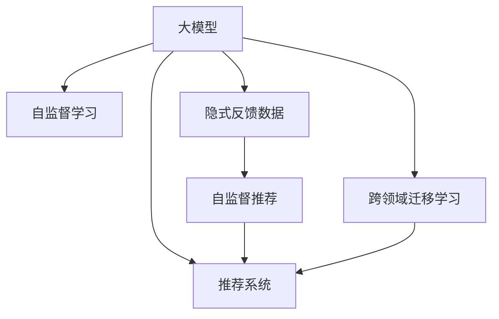

                 

## 1. 背景介绍

推荐系统在互联网时代扮演着越来越重要的角色，通过个性化推荐满足用户的个性化需求，显著提升用户体验和平台活跃度。传统的推荐系统主要依赖于用户行为数据，通过协同过滤、矩阵分解等方法分析用户兴趣和物品属性，从而进行精准推荐。然而，随着数据的爆发性增长，传统推荐系统面临数据稀疏性、冷启动等问题，难以全面覆盖长尾场景和新兴兴趣。与此同时，大模型的发展为推荐系统带来了新的可能，通过自监督学习等技术，能够更好地利用隐式反馈数据，挖掘用户和物品的潜在关联，形成更加全面的推荐模型。

本文将对大模型在推荐系统中的自监督学习应用进行系统性的介绍，从理论到实践全面梳理大模型推荐的技术脉络，并展望未来的发展趋势和应用前景。

## 2. 核心概念与联系

### 2.1 核心概念概述

为更好地理解大模型在推荐系统中的应用，本节将介绍几个密切相关的核心概念：

- 大模型(大语言模型)：以自回归(如GPT)或自编码(如BERT)模型为代表的大规模预训练语言模型。通过在大规模无标签文本语料上进行预训练，学习通用的语言表示，具备强大的语言理解和生成能力。

- 自监督学习(Self-Supervised Learning)：通过设计自监督任务，利用未标注数据训练模型，学习数据的隐含结构。自监督学习在大模型预训练中发挥了重要作用。

- 隐式反馈数据：用户在平台上浏览、点击、评分等行为数据，虽然不包含直接标签，但蕴含了丰富的用户兴趣和物品属性信息。

- 推荐系统：通过分析用户行为数据和物品属性，推荐用户可能感兴趣的产品或内容，提升用户满意度。

- 自监督推荐(即大模型推荐)：利用大模型在无标注数据上的预训练能力，通过自监督学习挖掘用户兴趣和物品属性，形成推荐模型。

- 跨领域迁移学习：通过预训练模型在不同领域数据上的迁移学习，实现跨领域推荐任务。

这些核心概念之间的逻辑关系可以通过以下Mermaid流程图来展示：



这个流程图展示了大模型的核心概念及其之间的关系：

1. 大模型通过自监督学习在大规模无标签数据上预训练，形成强大的语言表示能力。
2. 隐式反馈数据蕴含着用户兴趣和物品属性的隐含信息，是大模型推荐的基础。
3. 自监督推荐利用大模型的预训练能力，挖掘用户和物品的潜在关联，形成推荐模型。
4. 跨领域迁移学习进一步拓展了大模型的应用边界，实现不同领域推荐任务的共同优化。

这些概念共同构成了大模型推荐的基本框架，使其能够利用数据驱动的方式，在推荐系统中找到用户和物品的潜在联系，提升推荐效果。

## 3. 核心算法原理 & 具体操作步骤

### 3.1 算法原理概述

大模型在推荐系统中的自监督学习应用，本质上是一种基于深度学习的无监督学习范式。其核心思想是：利用大模型的预训练能力，通过自监督学习挖掘用户和物品的潜在关联，形成推荐模型。具体来说，将隐式反馈数据输入预训练语言模型，通过设计特定的自监督任务，训练模型学习用户和物品的潜在特征，生成推荐的概率分布，从而实现精准推荐。

形式化地，假设大模型为 $M_{\theta}$，其中 $\theta$ 为预训练得到的模型参数。给定用户 $u$ 和物品 $i$ 的隐式反馈 $x_{u,i}$，模型的目标是在不使用显式标签的情况下，预测 $x_{u,i}$ 的概率分布 $p_{u,i}$，即：

$$
p_{u,i} = M_{\theta}(x_{u,i})
$$

推荐模型的优化目标是最小化负对数似然损失，即：

$$
\mathcal{L}(\theta) = -\frac{1}{N} \sum_{u,i} x_{u,i} \log p_{u,i} + (1-x_{u,i}) \log (1-p_{u,i})
$$

其中 $N$ 为用户和物品的总数，$x_{u,i}$ 为0或1，表示用户 $u$ 是否与物品 $i$ 有交互。

### 3.2 算法步骤详解

大模型在推荐系统中的自监督学习应用，主要包括以下几个关键步骤：

**Step 1: 准备预训练模型和数据集**
- 选择合适的预训练语言模型 $M_{\theta}$，如BERT、GPT等。
- 准备用户和物品的隐式反馈数据集 $D=\{x_{u,i}\}_{u,i}$，其中 $x_{u,i}$ 为0或1，表示用户 $u$ 是否与物品 $i$ 有交互。

**Step 2: 添加任务适配层**
- 根据推荐任务类型，设计合适的输出层和损失函数。
- 对于推荐任务，通常在顶层添加线性分类器和负对数似然损失函数。
- 对于召回任务，通常使用二项分布的负对数似然损失函数。

**Step 3: 设置自监督学习超参数**
- 选择合适的优化算法及其参数，如Adam、SGD等，设置学习率、批大小、迭代轮数等。
- 设置正则化技术及强度，包括权重衰减、Dropout、Early Stopping等。
- 确定冻结预训练参数的策略，如仅微调顶层，或全部参数都参与微调。

**Step 4: 执行自监督训练**
- 将隐式反馈数据分批次输入模型，前向传播计算损失函数。
- 反向传播计算参数梯度，根据设定的优化算法和学习率更新模型参数。
- 周期性在验证集上评估模型性能，根据性能指标决定是否触发 Early Stopping。
- 重复上述步骤直到满足预设的迭代轮数或 Early Stopping 条件。

**Step 5: 生成推荐结果**
- 使用训练后的模型 $M_{\theta}$ 对用户 $u$ 和物品 $i$ 进行预测，生成推荐概率 $p_{u,i}$。
- 根据推荐概率排序，选择评分最高的物品，生成推荐列表。

以上是自监督推荐的一般流程。在实际应用中，还需要针对具体任务的特点，对自监督训练过程的各个环节进行优化设计，如改进训练目标函数，引入更多的正则化技术，搜索最优的超参数组合等，以进一步提升模型性能。

### 3.3 算法优缺点

大模型在推荐系统中的自监督学习应用，具有以下优点：

1. 利用无标注数据进行训练，大幅降低了标注成本。
2. 模型学习到更深层次的语言表示，能够更好地捕捉用户和物品的潜在关联。
3. 在大规模数据上训练，模型具有较强的泛化能力，能够在长尾场景中取得良好效果。
4. 结合预训练和微调，推荐模型可以兼具通用性和参数高效性，适应多种推荐任务。

同时，该方法也存在一定的局限性：

1. 对数据分布的变化敏感。如果目标数据与预训练数据分布差异较大，自监督推荐的效果可能受影响。
2. 需要较长的训练时间。自监督训练的时间开销较大，实际应用中需要平衡训练和推荐的速度。
3. 缺乏跨领域迁移能力。由于自监督推荐主要依赖于预训练模型，其跨领域迁移能力有限。
4. 模型复杂度较高。大模型的复杂度较高，训练和推理所需资源较多。

尽管存在这些局限性，但自监督推荐方法在大规模推荐系统的训练和推荐过程中，已显示出显著的优势，成为推荐系统的重要研究方向。

### 3.4 算法应用领域

大模型在推荐系统中的自监督学习应用，已经在多种推荐场景中得到应用，例如：

- 个性化推荐：利用用户历史行为数据，生成个性化的物品推荐列表。
- 召回推荐：从大规模商品库中筛选出符合用户偏好的物品，增加推荐结果的多样性。
- 标签推荐：通过用户对物品的评分，生成物品的推荐标签，增强推荐系统的解释性。
- 跨领域推荐：在推荐模型中加入跨领域迁移学习的策略，提升不同领域推荐任务的性能。
- 实时推荐：通过在线微调模型，实时更新推荐模型，提升推荐结果的时效性。

除了上述这些经典场景外，自监督推荐还被创新性地应用到更多场景中，如多模态推荐、协同过滤与自监督结合等，为推荐系统带来了新的突破。随着自监督推荐方法的不断进步，相信推荐系统将在更广泛的应用领域大放异彩。

## 4. 数学模型和公式 & 详细讲解

### 4.1 数学模型构建

本节将使用数学语言对大模型在推荐系统中的自监督学习应用进行更加严格的刻画。

记大模型为 $M_{\theta}:\mathcal{X} \rightarrow \mathcal{Y}$，其中 $\mathcal{X}$ 为用户行为数据，$\mathcal{Y}$ 为推荐结果的概率分布，$\theta$ 为模型参数。假设推荐任务的目标是最大化用户点击物品的概率 $p_{u,i}$，则目标函数为：

$$
\mathcal{L}(\theta) = -\frac{1}{N} \sum_{u,i} x_{u,i} \log p_{u,i} + (1-x_{u,i}) \log (1-p_{u,i})
$$

其中 $N$ 为用户和物品的总数，$x_{u,i}$ 为0或1，表示用户 $u$ 是否与物品 $i$ 有交互。

### 4.2 公式推导过程

以下我们以推荐任务为例，推导推荐模型中的自监督学习目标函数及其梯度的计算公式。

假设用户 $u$ 与物品 $i$ 的隐式反馈数据为 $x_{u,i}$，推荐模型 $M_{\theta}$ 的输出为 $p_{u,i} = M_{\theta}(x_{u,i})$。根据自监督学习目标函数，对 $M_{\theta}$ 求偏导得到梯度：

$$
\frac{\partial \mathcal{L}(\theta)}{\partial \theta_k} = -\frac{1}{N} \sum_{u,i} x_{u,i} \frac{\partial \log p_{u,i}}{\partial \theta_k} + (1-x_{u,i}) \frac{\partial \log (1-p_{u,i})}{\partial \theta_k}
$$

其中 $k$ 为模型参数 $\theta$ 的索引，$\frac{\partial \log p_{u,i}}{\partial \theta_k}$ 和 $\frac{\partial \log (1-p_{u,i})}{\partial \theta_k}$ 可以通过反向传播算法高效计算。

在得到目标函数的梯度后，即可带入优化算法，完成模型的迭代优化。重复上述过程直至收敛，最终得到适应推荐任务的最优模型参数 $\theta^*$。

## 5. 项目实践：代码实例和详细解释说明

### 5.1 开发环境搭建

在进行自监督推荐实践前，我们需要准备好开发环境。以下是使用Python进行PyTorch开发的环境配置流程：

1. 安装Anaconda：从官网下载并安装Anaconda，用于创建独立的Python环境。

2. 创建并激活虚拟环境：
```bash
conda create -n pytorch-env python=3.8 
conda activate pytorch-env
```

3. 安装PyTorch：根据CUDA版本，从官网获取对应的安装命令。例如：
```bash
conda install pytorch torchvision torchaudio cudatoolkit=11.1 -c pytorch -c conda-forge
```

4. 安装Transformers库：
```bash
pip install transformers
```

5. 安装各类工具包：
```bash
pip install numpy pandas scikit-learn matplotlib tqdm jupyter notebook ipython
```

完成上述步骤后，即可在`pytorch-env`环境中开始自监督推荐实践。

### 5.2 源代码详细实现

下面我们以推荐任务为例，给出使用Transformers库对BERT模型进行自监督训练的PyTorch代码实现。

首先，定义推荐任务的数据处理函数：

```python
from transformers import BertTokenizer
from torch.utils.data import Dataset
import torch

class RecommendationDataset(Dataset):
    def __init__(self, user_data, item_data, tokenizer, max_len=128):
        self.user_data = user_data
        self.item_data = item_data
        self.tokenizer = tokenizer
        self.max_len = max_len
        
    def __len__(self):
        return len(self.user_data)
    
    def __getitem__(self, item):
        user_id = self.user_data[item][0]
        item_id = self.item_data[item][0]
        
        encoding = self.tokenizer(str(user_id) + ' ' + str(item_id), return_tensors='pt', max_length=self.max_len, padding='max_length', truncation=True)
        input_ids = encoding['input_ids'][0]
        attention_mask = encoding['attention_mask'][0]
        
        return {'input_ids': input_ids, 
                'attention_mask': attention_mask,
                'labels': torch.tensor(1.0 if self.user_data[item][1] == item_id else 0.0, dtype=torch.float32)}
```

然后，定义模型和优化器：

```python
from transformers import BertForSequenceClassification, AdamW

model = BertForSequenceClassification.from_pretrained('bert-base-cased', num_labels=2)

optimizer = AdamW(model.parameters(), lr=2e-5)
```

接着，定义训练和评估函数：

```python
from torch.utils.data import DataLoader
from tqdm import tqdm
from sklearn.metrics import roc_auc_score

device = torch.device('cuda') if torch.cuda.is_available() else torch.device('cpu')
model.to(device)

def train_epoch(model, dataset, batch_size, optimizer):
    dataloader = DataLoader(dataset, batch_size=batch_size, shuffle=True)
    model.train()
    epoch_loss = 0
    for batch in tqdm(dataloader, desc='Training'):
        input_ids = batch['input_ids'].to(device)
        attention_mask = batch['attention_mask'].to(device)
        labels = batch['labels'].to(device)
        model.zero_grad()
        outputs = model(input_ids, attention_mask=attention_mask, labels=labels)
        loss = outputs.loss
        epoch_loss += loss.item()
        loss.backward()
        optimizer.step()
    return epoch_loss / len(dataloader)

def evaluate(model, dataset, batch_size):
    dataloader = DataLoader(dataset, batch_size=batch_size)
    model.eval()
    preds, labels = [], []
    with torch.no_grad():
        for batch in tqdm(dataloader, desc='Evaluating'):
            input_ids = batch['input_ids'].to(device)
            attention_mask = batch['attention_mask'].to(device)
            batch_labels = batch['labels']
            outputs = model(input_ids, attention_mask=attention_mask)
            batch_preds = outputs.logits.argmax(dim=2).to('cpu').tolist()
            batch_labels = batch_labels.to('cpu').tolist()
            for pred, label in zip(batch_preds, batch_labels):
                preds.append(pred)
                labels.append(label)
                
    print(f'ROC-AUC score: {roc_auc_score(labels, preds)}')
```

最后，启动训练流程并在测试集上评估：

```python
epochs = 5
batch_size = 16

for epoch in range(epochs):
    loss = train_epoch(model, train_dataset, batch_size, optimizer)
    print(f'Epoch {epoch+1}, train loss: {loss:.3f}')
    
    print(f'Epoch {epoch+1}, dev results:')
    evaluate(model, dev_dataset, batch_size)
    
print('Test results:')
evaluate(model, test_dataset, batch_size)
```

以上就是使用PyTorch对BERT进行自监督训练的完整代码实现。可以看到，得益于Transformers库的强大封装，我们可以用相对简洁的代码完成BERT模型的加载和自监督训练。

### 5.3 代码解读与分析

让我们再详细解读一下关键代码的实现细节：

**RecommendationDataset类**：
- `__init__`方法：初始化用户行为数据、物品数据、分词器等关键组件。
- `__len__`方法：返回数据集的样本数量。
- `__getitem__`方法：对单个样本进行处理，将用户行为数据和物品数据拼接为统一格式的字符串，输入编码为token ids，生成训练样本。

**训练和评估函数**：
- 使用PyTorch的DataLoader对数据集进行批次化加载，供模型训练和推理使用。
- 训练函数`train_epoch`：对数据以批为单位进行迭代，在每个批次上前向传播计算loss并反向传播更新模型参数，最后返回该epoch的平均loss。
- 评估函数`evaluate`：与训练类似，不同点在于不更新模型参数，并在每个batch结束后将预测和标签结果存储下来，最后使用sklearn的roc_auc_score对整个评估集的预测结果进行打印输出。

**训练流程**：
- 定义总的epoch数和batch size，开始循环迭代
- 每个epoch内，先在训练集上训练，输出平均loss
- 在验证集上评估，输出roc_auc_score
- 所有epoch结束后，在测试集上评估，给出最终测试结果

可以看到，PyTorch配合Transformers库使得BERT自监督训练的代码实现变得简洁高效。开发者可以将更多精力放在数据处理、模型改进等高层逻辑上，而不必过多关注底层的实现细节。

当然，工业级的系统实现还需考虑更多因素，如模型的保存和部署、超参数的自动搜索、更灵活的任务适配层等。但核心的自监督训练范式基本与此类似。

## 6. 实际应用场景

### 6.1 电商平台推荐

电商平台利用大模型进行自监督推荐，可以显著提升用户的购物体验。用户在平台上浏览商品、收藏商品、点击商品等行为，都蕴含着用户对不同商品的兴趣偏好。通过将用户行为数据输入预训练模型，训练模型学习用户和商品的潜在关联，生成推荐的概率分布，从而实现精准推荐。

在技术实现上，可以收集用户的浏览、收藏、点击、购买等行为数据，提取商品标题、描述、标签等文本内容。将文本内容作为模型输入，用户在商品上的行为作为监督信号，在此基础上对BERT模型进行自监督训练。训练后的模型能够从文本内容中准确把握用户的兴趣点，生成个性化的商品推荐列表，极大地提升用户的购买转化率。

### 6.2 新闻推荐

新闻平台通过大模型进行自监督推荐，可以为用户推荐更多符合兴趣的新闻内容，增加平台的活跃度。用户对新闻的阅读时长、点击量等行为，都蕴含着用户对不同新闻内容的偏好。通过将用户行为数据输入预训练模型，训练模型学习用户和新闻的潜在关联，生成推荐的概率分布，从而实现精准推荐。

在技术实现上，可以收集用户的阅读时长、点击量、评论量等行为数据，提取新闻标题、摘要、标签等文本内容。将文本内容作为模型输入，用户在新闻上的行为作为监督信号，在此基础上对BERT模型进行自监督训练。训练后的模型能够从新闻内容中准确把握用户的兴趣点，生成个性化的新闻推荐列表，显著提升用户的阅读满意度。

### 6.3 视频推荐

视频平台通过大模型进行自监督推荐，可以为用户推荐更多符合兴趣的视频内容，增加平台的活跃度和用户粘性。用户对视频的观看时长、点赞量、评论量等行为，都蕴含着用户对不同视频内容的偏好。通过将用户行为数据输入预训练模型，训练模型学习用户和视频的潜在关联，生成推荐的概率分布，从而实现精准推荐。

在技术实现上，可以收集用户的观看时长、点赞量、评论量等行为数据，提取视频标题、描述、标签等文本内容。将文本内容作为模型输入，用户在视频上的行为作为监督信号，在此基础上对BERT模型进行自监督训练。训练后的模型能够从视频内容中准确把握用户的兴趣点，生成个性化的视频推荐列表，显著提升用户的观看体验。

### 6.4 未来应用展望

随着自监督推荐方法的不断进步，基于大模型的推荐系统将在更多领域得到应用，为各行各业带来变革性影响。

在智能家居领域，推荐系统可以基于用户的习惯和偏好，智能推荐家居设备的使用方案，提升家庭生活的便捷性和智能化水平。

在金融领域，推荐系统可以基于用户的投资行为和偏好，推荐个性化的金融产品，帮助用户实现财富增值。

在教育领域，推荐系统可以基于学生的学习行为和偏好，推荐个性化的学习内容和课程，提升学习效果和教育公平。

此外，在医疗、旅游、娱乐等众多领域，基于大模型的推荐系统也将不断涌现，为各行各业带来新的商业机会和创新体验。相信随着大模型推荐技术的持续演进，推荐系统必将在更广阔的应用领域大放异彩，为经济社会发展注入新的动力。

## 7. 工具和资源推荐

### 7.1 学习资源推荐

为了帮助开发者系统掌握大模型在推荐系统中的应用，这里推荐一些优质的学习资源：

1. 《Transformers从原理到实践》系列博文：由大模型技术专家撰写，深入浅出地介绍了Transformer原理、BERT模型、自监督推荐等前沿话题。

2. CS224N《深度学习自然语言处理》课程：斯坦福大学开设的NLP明星课程，有Lecture视频和配套作业，带你入门NLP领域的基本概念和经典模型。

3. 《Natural Language Processing with Transformers》书籍：Transformers库的作者所著，全面介绍了如何使用Transformers库进行NLP任务开发，包括自监督推荐在内的诸多范式。

4. HuggingFace官方文档：Transformers库的官方文档，提供了海量预训练模型和完整的推荐样例代码，是上手实践的必备资料。

5. Kaggle推荐竞赛：Kaggle平台上多个推荐竞赛，涵盖了不同领域的推荐任务，提供了丰富的数据集和基线模型，是提升推荐技术实力的绝佳平台。

通过对这些资源的学习实践，相信你一定能够快速掌握大模型推荐技术的精髓，并用于解决实际的推荐问题。

### 7.2 开发工具推荐

高效的开发离不开优秀的工具支持。以下是几款用于大模型推荐开发的常用工具：

1. PyTorch：基于Python的开源深度学习框架，灵活动态的计算图，适合快速迭代研究。大部分预训练语言模型都有PyTorch版本的实现。

2. TensorFlow：由Google主导开发的开源深度学习框架，生产部署方便，适合大规模工程应用。同样有丰富的预训练语言模型资源。

3. Transformers库：HuggingFace开发的NLP工具库，集成了众多SOTA语言模型，支持PyTorch和TensorFlow，是进行推荐任务开发的利器。

4. Weights & Biases：模型训练的实验跟踪工具，可以记录和可视化模型训练过程中的各项指标，方便对比和调优。与主流深度学习框架无缝集成。

5. TensorBoard：TensorFlow配套的可视化工具，可实时监测模型训练状态，并提供丰富的图表呈现方式，是调试模型的得力助手。

6. Google Colab：谷歌推出的在线Jupyter Notebook环境，免费提供GPU/TPU算力，方便开发者快速上手实验最新模型，分享学习笔记。

合理利用这些工具，可以显著提升大模型推荐任务的开发效率，加快创新迭代的步伐。

### 7.3 相关论文推荐

大模型推荐技术的发展源于学界的持续研究。以下是几篇奠基性的相关论文，推荐阅读：

1. Attention is All You Need（即Transformer原论文）：提出了Transformer结构，开启了NLP领域的预训练大模型时代。

2. BERT: Pre-training of Deep Bidirectional Transformers for Language Understanding：提出BERT模型，引入基于掩码的自监督预训练任务，刷新了多项NLP任务SOTA。

3. Reformer: The Efficient Transformer：提出Reformer结构，大幅降低Transformer的计算复杂度，提升模型训练效率。

4. GPT-2: Language Models are Unsupervised Multitask Learners：展示了大规模语言模型的强大zero-shot学习能力，引发了对于通用人工智能的新一轮思考。

5. Masked Language Model Pretraining for Sequence Generation：提出掩码语言模型预训练方法，进一步提升了BERT等语言模型的性能。

6. BART: Denoising Pre-training for Natural Language Processing：提出BART模型，通过掩码语言模型预训练和自回归预训练相结合的方式，提升了模型的泛化能力和训练效率。

这些论文代表了大模型推荐技术的发展脉络。通过学习这些前沿成果，可以帮助研究者把握学科前进方向，激发更多的创新灵感。

## 8. 总结：未来发展趋势与挑战

### 8.1 总结

本文对大模型在推荐系统中的自监督学习应用进行了系统性的介绍。首先阐述了大模型推荐技术的研究背景和意义，明确了自监督推荐在推荐系统中的应用价值。其次，从原理到实践，详细讲解了自监督推荐的数学原理和关键步骤，给出了推荐任务开发的完整代码实例。同时，本文还广泛探讨了自监督推荐在电商、新闻、视频等多个推荐场景中的应用前景，展示了自监督推荐范式的巨大潜力。

通过本文的系统梳理，可以看到，大模型推荐技术利用无标注数据进行自监督学习，能够更好地挖掘用户和物品的潜在关联，提升推荐系统的精准度。在实际应用中，自监督推荐方法具有较低的标注成本和较强的泛化能力，特别适用于长尾场景和新兴兴趣。

### 8.2 未来发展趋势

展望未来，大模型推荐技术将呈现以下几个发展趋势：

1. 模型规模持续增大。随着算力成本的下降和数据规模的扩张，预训练语言模型的参数量还将持续增长。超大模型蕴含的丰富语言表示能力，有望支撑更加复杂多变的推荐任务。

2. 自监督推荐方法多样化。未来将涌现更多自监督推荐方法，如Masked Language Model、Reformer等，在保持高精度的同时，降低模型训练和推理的时间复杂度。

3. 融合知识图谱与推荐系统。结合符号化的先验知识，通过知识图谱的方式增强模型的推荐能力，提升推荐系统的解释性和鲁棒性。

4. 跨领域自监督推荐。在大模型推荐的基础上，引入跨领域迁移学习的策略，实现不同领域推荐任务的共同优化。

5. 多模态推荐系统。结合视觉、音频等多模态数据，提升推荐系统的多感官融合能力，形成更全面的用户兴趣模型。

6. 实时自监督推荐。通过在线微调大模型，实现实时更新推荐策略，提升推荐结果的时效性和个性化。

以上趋势凸显了大模型推荐技术的广阔前景。这些方向的探索发展，必将进一步提升推荐系统的性能和应用范围，为各行各业带来变革性影响。

### 8.3 面临的挑战

尽管大模型推荐技术已经取得了显著成效，但在迈向更加智能化、普适化应用的过程中，仍面临诸多挑战：

1. 数据稀疏性。大规模推荐系统面临数据稀疏性的问题，尤其是冷启动用户和长尾物品的场景，难以获得充分的训练数据。

2. 跨领域泛化能力。大模型推荐主要依赖于预训练模型的泛化能力，不同领域之间的泛化效果可能较差，需要进一步提升跨领域迁移能力。

3. 实时推荐性能。自监督推荐方法需要较长的训练时间，实时推荐系统对计算资源的需求较高，需要优化模型结构和训练方法。

4. 用户隐私保护。推荐系统通常需要收集用户的隐私数据，如何保护用户隐私，避免数据泄露，是推荐系统应用中的一个重要问题。

5. 模型公平性。大模型推荐可能存在一定的偏见，需要对模型进行公平性检测和优化，确保推荐结果的公平性和多样性。

6. 自监督学习目标设计。自监督推荐方法的目标函数设计较为复杂，需要根据具体任务进行精心设计，避免目标函数带来的负面影响。

这些挑战都需要未来继续深入研究，通过技术创新和算法优化，不断提升大模型推荐技术的应用效果。

### 8.4 研究展望

面对大模型推荐技术所面临的挑战，未来的研究需要在以下几个方面寻求新的突破：

1. 探索无监督和半监督推荐方法。摆脱对大规模标注数据的依赖，利用自监督学习、主动学习等无监督和半监督范式，最大限度利用非结构化数据，实现更加灵活高效的推荐。

2. 研究参数高效和计算高效的推荐范式。开发更加参数高效的推荐方法，在固定大部分预训练参数的同时，只更新极少量的任务相关参数。同时优化推荐模型的计算图，减少前向传播和反向传播的资源消耗，实现更加轻量级、实时性的部署。

3. 引入因果推断和对比学习范式。通过引入因果推断和对比学习思想，增强推荐模型建立稳定因果关系的能力，学习更加普适、鲁棒的语言表示。

4. 融合知识图谱与推荐系统。将符号化的先验知识，如知识图谱、逻辑规则等，与神经网络模型进行巧妙融合，引导推荐过程学习更准确、合理的用户和物品表示。

5. 结合因果分析和博弈论工具。将因果分析方法引入推荐模型，识别出推荐过程中的关键特征，增强推荐结果的因果性和逻辑性。借助博弈论工具刻画人机交互过程，主动探索并规避推荐系统的脆弱点，提高系统稳定性。

6. 纳入伦理道德约束。在推荐模型训练目标中引入伦理导向的评估指标，过滤和惩罚有害的推荐结果，确保推荐系统的公平性和安全性。

这些研究方向的探索，必将引领大模型推荐技术迈向更高的台阶，为推荐系统带来新的突破，推动人工智能技术在各行各业的应用。

## 9. 附录：常见问题与解答

**Q1：自监督推荐是否适用于所有推荐场景？**

A: 自监督推荐在大多数推荐场景上都能取得不错的效果，特别是对于数据量较小的场景。但对于一些特定领域的推荐场景，如特定领域的商品推荐、特定主题的新闻推荐等，仍需结合领域知识进行微调或改进。

**Q2：如何选择合适的自监督学习任务？**

A: 选择合适的自监督学习任务是提升自监督推荐效果的关键。通常可以从以下几个角度考虑：
1. 任务相关性：选择与推荐任务高度相关的自监督任务，如掩码语言模型、次序感知任务等。
2. 数据可用性：选择有足够数据支持的自监督任务，避免数据稀疏性带来的负面影响。
3. 模型复杂度：选择计算复杂度适中的自监督任务，避免过高的计算资源消耗。

**Q3：自监督推荐与传统推荐方法相比，有哪些优势？**

A: 自监督推荐具有以下优势：
1. 数据利用率高：自监督推荐可以利用无标注数据进行训练，减少标注成本。
2. 泛化能力强：自监督推荐利用大模型的预训练能力，能够更好地泛化到新的推荐场景。
3. 鲁棒性好：自监督推荐结合了多模态信息，能够抵御部分异常数据的干扰。
4. 实时性强：自监督推荐可以通过在线微调模型，实现实时更新推荐策略。

**Q4：自监督推荐如何缓解过拟合问题？**

A: 缓解自监督推荐过拟合的方法主要包括以下几个方面：
1. 数据增强：通过近义词替换、数据扩充等手段，增加训练集的多样性。
2. 正则化：使用L2正则、Dropout等技术，防止模型过拟合。
3. 多任务学习：结合多个自监督任务进行训练，增强模型的泛化能力。
4. 对抗训练：引入对抗样本，提高模型的鲁棒性和泛化性。
5. 参数高效：采用参数高效的推荐方法，减少过拟合风险。

**Q5：自监督推荐在实际应用中，如何平衡训练和推荐的速度？**

A: 平衡自监督推荐训练和推荐的速度，通常需要以下方法：
1. 数据分批：将大规模数据集分批输入模型进行训练，减少计算资源消耗。
2. 增量学习：通过在线微调模型，实现快速更新推荐策略。
3. 模型裁剪：去除不必要的层和参数，减小模型尺寸，加快推理速度。
4. 混合精度训练：使用混合精度训练，降低计算资源消耗，提升训练效率。

合理利用这些技术，可以显著提升自监督推荐的实际应用效果，实现高效、稳定的推荐系统。

总之，自监督推荐技术利用大模型的预训练能力，能够挖掘用户和物品的潜在关联，提升推荐系统的精准度和个性化程度。未来，随着技术不断进步，自监督推荐必将在更多领域得到应用，为各行各业带来变革性影响。

---

作者：禅与计算机程序设计艺术 / Zen and the Art of Computer Programming

