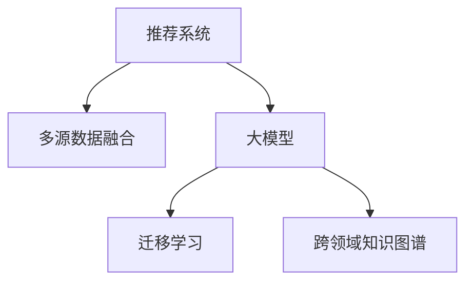

                 

# 大模型在推荐系统多源数据融合中的应用

## 1. 背景介绍

随着互联网的快速发展，推荐系统在电商、社交、视频等众多领域中扮演着越来越重要的角色。然而，由于用户行为数据的多样性和复杂性，单一数据源往往难以全面、准确地刻画用户偏好。因此，推荐系统逐渐发展出多源数据融合的策略，以融合多种数据源，形成更加全面、准确的推荐结果。大模型，特别是预训练语言模型，以其强大的表达能力和泛化能力，为多源数据融合提供了新的思路和方法。

本博客将从背景介绍、核心概念与联系、核心算法原理与操作步骤、数学模型与公式、项目实践、实际应用场景、工具和资源推荐、未来发展趋势与挑战等方面，系统性地介绍大模型在推荐系统多源数据融合中的应用。

## 2. 核心概念与联系

### 2.1 核心概念概述

为了更好地理解大模型在推荐系统多源数据融合中的应用，本节将介绍几个密切相关的核心概念：

- **推荐系统**：通过分析用户行为数据，为用户推荐感兴趣的商品、内容等。推荐系统可以分为基于协同过滤、基于内容的推荐、混合推荐等多种类型。

- **多源数据融合**：将多个数据源中的信息融合在一起，形成更加全面、准确的用户画像和推荐结果。常见的多源数据包括用户行为数据、社交关系数据、商品属性数据等。

- **大模型**：以自回归(如GPT)或自编码(如BERT)模型为代表的大规模预训练语言模型。通过在大规模无标签文本语料上进行预训练，学习到丰富的语言知识和常识，具备强大的语言理解和生成能力。

- **迁移学习**：指将一个领域学习到的知识，迁移应用到另一个不同但相关的领域的学习范式。大模型的预训练-微调过程即是一种典型的迁移学习方式。

- **跨领域知识图谱**：由实体、关系、属性组成的知识库，用于辅助用户画像和推荐决策，提供更加丰富、准确的知识支持。

这些核心概念之间的逻辑关系可以通过以下Mermaid流程图来展示：



这个流程图展示了大模型在推荐系统多源数据融合中的核心概念及其之间的关系：

1. 推荐系统通过融合多种数据源，构建用户画像。
2. 大模型作为预训练知识源，通过迁移学习的方式应用于推荐系统。
3. 跨领域知识图谱提供丰富的背景知识，辅助用户画像和推荐决策。

## 3. 核心算法原理 & 具体操作步骤

### 3.1 算法原理概述

大模型在推荐系统多源数据融合中的应用，本质上是利用预训练语言模型的泛化能力，通过迁移学习和多源数据融合，提升推荐系统的精准度和鲁棒性。其核心思想是：将大模型视作一个强大的"特征提取器"，通过在推荐系统多源数据上进行有监督的微调，使得模型能够更好地理解用户偏好和行为模式，从而生成更准确的推荐结果。

具体而言，大模型的预训练过程通常是在大规模无标签文本数据上进行自监督学习，学习到通用的语言表示。然后，在大规模有标签推荐数据上进行微调，学习特定的推荐任务。微调后的模型可以通过对多种数据源进行融合，形成更加全面、准确的用户画像，从而生成更加精准的推荐结果。

### 3.2 算法步骤详解

基于大模型的推荐系统多源数据融合，一般包括以下几个关键步骤：

**Step 1: 准备数据集**
- 收集多种数据源的数据，如用户行为数据、社交关系数据、商品属性数据等。
- 对数据进行清洗、归一化、标签化等预处理，生成适合大模型微调的数据集。

**Step 2: 构建融合模型**
- 选择适合的大模型作为初始化参数，如BERT、GPT等。
- 根据推荐系统的具体任务，设计合适的输出层和损失函数。
- 将多种数据源的数据融合到模型输入中，如将用户行为数据、商品属性数据等转化为文本向量，与社交关系数据一起输入模型。

**Step 3: 设置微调超参数**
- 选择合适的优化算法及其参数，如AdamW、SGD等，设置学习率、批大小、迭代轮数等。
- 设置正则化技术及强度，包括权重衰减、Dropout、Early Stopping等。
- 确定冻结预训练参数的策略，如仅微调顶层，或全部参数都参与微调。

**Step 4: 执行梯度训练**
- 将融合后的数据集分批次输入模型，前向传播计算损失函数。
- 反向传播计算参数梯度，根据设定的优化算法和学习率更新模型参数。
- 周期性在验证集上评估模型性能，根据性能指标决定是否触发 Early Stopping。
- 重复上述步骤直到满足预设的迭代轮数或 Early Stopping 条件。

**Step 5: 测试和部署**
- 在测试集上评估融合后的模型，对比微调前后的精度提升。
- 使用融合后的模型对新样本进行推理预测，集成到实际的应用系统中。
- 持续收集新的数据，定期重新微调模型，以适应数据分布的变化。

以上是基于大模型的推荐系统多源数据融合的一般流程。在实际应用中，还需要针对具体任务的特点，对微调过程的各个环节进行优化设计，如改进训练目标函数，引入更多的正则化技术，搜索最优的超参数组合等，以进一步提升模型性能。

### 3.3 算法优缺点

基于大模型的推荐系统多源数据融合方法具有以下优点：
1. 能够融合多种数据源，形成更加全面、准确的用户画像和推荐结果。
2. 利用大模型的泛化能力，提升了推荐系统的精准度和鲁棒性。
3. 大模型的迁移学习特性，使得推荐系统能够快速适应新数据源和新任务。
4. 结合知识图谱等外部知识，增强了推荐系统的解释性和可信度。

同时，该方法也存在一定的局限性：
1. 数据处理复杂度较高，需要额外的数据预处理和融合工作。
2. 大模型的训练和微调成本较高，需要较强的计算资源和标注数据。
3. 数据隐私问题，需要确保用户数据的隐私保护和匿名化处理。
4. 模型的可解释性不足，难以对其推荐决策进行深入分析和调试。

尽管存在这些局限性，但就目前而言，基于大模型的推荐系统多源数据融合方法仍是大数据时代推荐系统的重要范式。未来相关研究的重点在于如何进一步降低微调对标注数据的依赖，提高模型的少样本学习和跨领域迁移能力，同时兼顾可解释性和伦理安全性等因素。

### 3.4 算法应用领域

基于大模型的推荐系统多源数据融合方法，在推荐系统领域已经得到了广泛的应用，涵盖了电商推荐、社交推荐、内容推荐、新闻推荐等多个方向，具体应用包括：

- 电商推荐系统：通过融合用户行为数据、商品属性数据、社交关系数据，生成个性化商品推荐。
- 社交推荐系统：基于用户的社交关系和兴趣爱好，推荐用户可能感兴趣的内容和用户。
- 内容推荐系统：通过融合用户的浏览记录、评分数据、文本评论等，推荐用户可能感兴趣的内容。
- 新闻推荐系统：通过融合用户的历史阅读记录、社交关系、时事热点等，推荐用户可能感兴趣的新闻。

除了上述这些经典应用外，大模型在推荐系统多源数据融合中还涌现了如电影推荐、游戏推荐、金融推荐等更多创新方向，为推荐系统带来了全新的突破。

## 4. 数学模型和公式 & 详细讲解 & 举例说明

### 4.1 数学模型构建

本节将使用数学语言对基于大模型的推荐系统多源数据融合过程进行更加严格的刻画。

记推荐系统融合后的数据集为 $D=\{(x_i,y_i)\}_{i=1}^N$，其中 $x_i$ 为融合后的输入，$y_i$ 为对应的推荐结果。定义融合后的推荐系统为 $M_{\theta}:\mathcal{X} \rightarrow \mathcal{Y}$，其中 $\mathcal{X}$ 为输入空间，$\mathcal{Y}$ 为输出空间，$\theta \in \mathbb{R}^d$ 为模型参数。

定义模型 $M_{\theta}$ 在数据样本 $(x,y)$ 上的损失函数为 $\ell(M_{\theta}(x),y)$，则在数据集 $D$ 上的经验风险为：

$$
\mathcal{L}(\theta) = \frac{1}{N} \sum_{i=1}^N \ell(M_{\theta}(x_i),y_i)
$$

在得到损失函数的梯度后，即可带入参数更新公式，完成模型的迭代优化。重复上述过程直至收敛，最终得到适应推荐任务的最优模型参数 $\theta^*$。

### 4.2 公式推导过程

以下我们以电商推荐系统为例，推导基于大模型的推荐系统多源数据融合的数学公式。

假设推荐系统融合后的数据集 $D$ 包含用户行为数据 $x_u$、商品属性数据 $x_p$、社交关系数据 $x_s$，将这些数据融合为一个文本向量 $x \in \mathbb{R}^n$，通过预训练语言模型 $M_{\theta}$ 进行微调，得到推荐结果 $y \in \{1,0\}$，表示用户是否购买该商品。

定义模型 $M_{\theta}$ 在输入 $x$ 上的输出为 $\hat{y}=M_{\theta}(x)$，表示用户购买商品的概率。假设真实标签 $y \in \{0,1\}$，则二分类交叉熵损失函数定义为：

$$
\ell(M_{\theta}(x),y) = -[y\log \hat{y} + (1-y)\log(1-\hat{y})]
$$

将其代入经验风险公式，得：

$$
\mathcal{L}(\theta) = -\frac{1}{N}\sum_{i=1}^N [y_i\log M_{\theta}(x_i)+(1-y_i)\log(1-M_{\theta}(x_i))]
$$

根据链式法则，损失函数对参数 $\theta_k$ 的梯度为：

$$
\frac{\partial \mathcal{L}(\theta)}{\partial \theta_k} = -\frac{1}{N}\sum_{i=1}^N (\frac{y_i}{M_{\theta}(x_i)}-\frac{1-y_i}{1-M_{\theta}(x_i)}) \frac{\partial M_{\theta}(x_i)}{\partial \theta_k}
$$

其中 $\frac{\partial M_{\theta}(x_i)}{\partial \theta_k}$ 可进一步递归展开，利用自动微分技术完成计算。

在得到损失函数的梯度后，即可带入参数更新公式，完成模型的迭代优化。重复上述过程直至收敛，最终得到适应推荐任务的最优模型参数 $\theta^*$。

### 4.3 案例分析与讲解

**电商推荐系统**
- 数据集构建：融合用户历史行为数据 $x_u$（如点击记录、浏览记录等）、商品属性数据 $x_p$（如价格、品牌、类别等）、社交关系数据 $x_s$（如好友评分、好友购买记录等）。
- 融合方式：通过拼接、加权平均等方式将三类数据转换为一个文本向量 $x$。
- 模型选择：选择BERT等大模型作为初始化参数，添加线性分类器作为输出层。
- 微调步骤：在标注数据集上执行梯度训练，优化模型参数，最小化损失函数。
- 评估指标：使用AUC、F1-score等指标评估模型性能。

**社交推荐系统**
- 数据集构建：融合用户的社交关系数据 $x_s$（如好友列表、好友关系等）、兴趣爱好数据 $x_i$（如关注内容、点赞记录等）、历史互动数据 $x_h$（如聊天记录、互动记录等）。
- 融合方式：通过拼接、加权平均等方式将三类数据转换为一个文本向量 $x$。
- 模型选择：选择GPT等大模型作为初始化参数，添加线性分类器作为输出层。
- 微调步骤：在标注数据集上执行梯度训练，优化模型参数，最小化损失函数。
- 评估指标：使用AUC、Recall、Precision等指标评估模型性能。

## 5. 项目实践：代码实例和详细解释说明

### 5.1 开发环境搭建

在进行推荐系统多源数据融合的微调实践前，我们需要准备好开发环境。以下是使用Python进行PyTorch开发的环境配置流程：

1. 安装Anaconda：从官网下载并安装Anaconda，用于创建独立的Python环境。

2. 创建并激活虚拟环境：
```bash
conda create -n recommendation-env python=3.8 
conda activate recommendation-env
```

3. 安装PyTorch：根据CUDA版本，从官网获取对应的安装命令。例如：
```bash
conda install pytorch torchvision torchaudio cudatoolkit=11.1 -c pytorch -c conda-forge
```

4. 安装Transformers库：
```bash
pip install transformers
```

5. 安装各类工具包：
```bash
pip install numpy pandas scikit-learn matplotlib tqdm jupyter notebook ipython
```

完成上述步骤后，即可在`recommendation-env`环境中开始微调实践。

### 5.2 源代码详细实现

这里我们以电商推荐系统为例，给出使用Transformers库对BERT模型进行微调的PyTorch代码实现。

首先，定义推荐系统的输入和输出：

```python
from transformers import BertTokenizer
from torch.utils.data import Dataset
import torch

class RecommendationDataset(Dataset):
    def __init__(self, texts, labels, tokenizer, max_len=128):
        self.texts = texts
        self.labels = labels
        self.tokenizer = tokenizer
        self.max_len = max_len
        
    def __len__(self):
        return len(self.texts)
    
    def __getitem__(self, item):
        text = self.texts[item]
        label = self.labels[item]
        
        encoding = self.tokenizer(text, return_tensors='pt', max_length=self.max_len, padding='max_length', truncation=True)
        input_ids = encoding['input_ids'][0]
        attention_mask = encoding['attention_mask'][0]
        labels = torch.tensor(label, dtype=torch.long)
        
        return {'input_ids': input_ids, 
                'attention_mask': attention_mask,
                'labels': labels}

# 标签与id的映射
tag2id = {'0': 0, '1': 1}
id2tag = {v: k for k, v in tag2id.items()}

# 创建dataset
tokenizer = BertTokenizer.from_pretrained('bert-base-cased')

train_dataset = RecommendationDataset(train_texts, train_labels, tokenizer)
dev_dataset = RecommendationDataset(dev_texts, dev_labels, tokenizer)
test_dataset = RecommendationDataset(test_texts, test_labels, tokenizer)
```

然后，定义模型和优化器：

```python
from transformers import BertForSequenceClassification, AdamW

model = BertForSequenceClassification.from_pretrained('bert-base-cased', num_labels=len(tag2id))

optimizer = AdamW(model.parameters(), lr=2e-5)
```

接着，定义训练和评估函数：

```python
from torch.utils.data import DataLoader
from tqdm import tqdm
from sklearn.metrics import accuracy_score, precision_score, recall_score, f1_score

device = torch.device('cuda') if torch.cuda.is_available() else torch.device('cpu')
model.to(device)

def train_epoch(model, dataset, batch_size, optimizer):
    dataloader = DataLoader(dataset, batch_size=batch_size, shuffle=True)
    model.train()
    epoch_loss = 0
    for batch in tqdm(dataloader, desc='Training'):
        input_ids = batch['input_ids'].to(device)
        attention_mask = batch['attention_mask'].to(device)
        labels = batch['labels'].to(device)
        model.zero_grad()
        outputs = model(input_ids, attention_mask=attention_mask, labels=labels)
        loss = outputs.loss
        epoch_loss += loss.item()
        loss.backward()
        optimizer.step()
    return epoch_loss / len(dataloader)

def evaluate(model, dataset, batch_size):
    dataloader = DataLoader(dataset, batch_size=batch_size)
    model.eval()
    preds, labels = [], []
    with torch.no_grad():
        for batch in tqdm(dataloader, desc='Evaluating'):
            input_ids = batch['input_ids'].to(device)
            attention_mask = batch['attention_mask'].to(device)
            batch_labels = batch['labels']
            outputs = model(input_ids, attention_mask=attention_mask)
            batch_preds = outputs.logits.argmax(dim=2).to('cpu').tolist()
            batch_labels = batch_labels.to('cpu').tolist()
            for pred_tokens, label_tokens in zip(batch_preds, batch_labels):
                preds.append(pred_tokens)
                labels.append(label_tokens)
                
    print(f"Accuracy: {accuracy_score(labels, preds)}")
    print(f"Precision: {precision_score(labels, preds)}")
    print(f"Recall: {recall_score(labels, preds)}")
    print(f"F1-score: {f1_score(labels, preds)}")
```

最后，启动训练流程并在测试集上评估：

```python
epochs = 5
batch_size = 16

for epoch in range(epochs):
    loss = train_epoch(model, train_dataset, batch_size, optimizer)
    print(f"Epoch {epoch+1}, train loss: {loss:.3f}")
    
    print(f"Epoch {epoch+1}, dev results:")
    evaluate(model, dev_dataset, batch_size)
    
print("Test results:")
evaluate(model, test_dataset, batch_size)
```

以上就是使用PyTorch对BERT进行电商推荐系统微调的完整代码实现。可以看到，得益于Transformers库的强大封装，我们可以用相对简洁的代码完成BERT模型的加载和微调。

### 5.3 代码解读与分析

让我们再详细解读一下关键代码的实现细节：

**RecommendationDataset类**：
- `__init__`方法：初始化文本、标签、分词器等关键组件。
- `__len__`方法：返回数据集的样本数量。
- `__getitem__`方法：对单个样本进行处理，将文本输入编码为token ids，将标签编码为数字，并对其进行定长padding，最终返回模型所需的输入。

**tag2id和id2tag字典**：
- 定义了标签与数字id之间的映射关系，用于将token-wise的预测结果解码回真实的标签。

**训练和评估函数**：
- 使用PyTorch的DataLoader对数据集进行批次化加载，供模型训练和推理使用。
- 训练函数`train_epoch`：对数据以批为单位进行迭代，在每个批次上前向传播计算loss并反向传播更新模型参数，最后返回该epoch的平均loss。
- 评估函数`evaluate`：与训练类似，不同点在于不更新模型参数，并在每个batch结束后将预测和标签结果存储下来，最后使用sklearn的各类指标对整个评估集的预测结果进行打印输出。

**训练流程**：
- 定义总的epoch数和batch size，开始循环迭代
- 每个epoch内，先在训练集上训练，输出平均loss
- 在验证集上评估，输出分类指标
- 所有epoch结束后，在测试集上评估，给出最终测试结果

可以看到，PyTorch配合Transformers库使得BERT微调的代码实现变得简洁高效。开发者可以将更多精力放在数据处理、模型改进等高层逻辑上，而不必过多关注底层的实现细节。

当然，工业级的系统实现还需考虑更多因素，如模型的保存和部署、超参数的自动搜索、更灵活的任务适配层等。但核心的微调范式基本与此类似。

## 6. 实际应用场景

### 6.1 电商推荐系统

电商推荐系统通过融合用户行为数据、商品属性数据、社交关系数据，生成个性化商品推荐。利用大模型的迁移学习能力，电商推荐系统可以更加全面、准确地刻画用户偏好和行为模式，从而生成更加精准的推荐结果。

在技术实现上，可以收集用户的历史点击记录、浏览记录、评分记录等数据，提取和商品属性数据、社交关系数据一起输入模型，进行多源数据融合和微调。微调后的模型能够自动学习用户行为模式，生成个性化推荐列表。

### 6.2 社交推荐系统

社交推荐系统基于用户的社交关系和兴趣爱好，推荐用户可能感兴趣的内容和用户。利用大模型的迁移学习能力，社交推荐系统可以更加全面、准确地刻画用户画像，从而生成更加精准的推荐结果。

在技术实现上，可以收集用户的社交关系数据、兴趣爱好数据、历史互动数据等，提取并融合到模型输入中，进行多源数据融合和微调。微调后的模型能够自动学习用户社交关系和兴趣爱好，生成个性化推荐列表。

### 6.3 内容推荐系统

内容推荐系统通过融合用户的浏览记录、评分数据、文本评论等，推荐用户可能感兴趣的内容。利用大模型的迁移学习能力，内容推荐系统可以更加全面、准确地刻画用户偏好，从而生成更加精准的推荐结果。

在技术实现上，可以收集用户的浏览记录、评分数据、文本评论等，提取并融合到模型输入中，进行多源数据融合和微调。微调后的模型能够自动学习用户偏好，生成个性化推荐列表。

### 6.4 未来应用展望

随着大模型和微调方法的不断发展，基于大模型的方法将在更多领域得到应用，为传统行业带来变革性影响。

在智慧医疗领域，基于大模型的推荐系统可以为医生推荐患者可能感兴趣的治疗方案和药物，辅助医生诊疗，提升医疗服务质量。

在智能教育领域，基于大模型的推荐系统可以为学生推荐适合的学习资源和课程，促进教育公平，提高教学质量。

在智慧城市治理中，基于大模型的推荐系统可以为市民推荐可能感兴趣的活动和景点，提升城市管理智能化水平，构建更安全、高效的未来城市。

此外，在企业生产、社会治理、文娱传媒等众多领域，基于大模型的推荐系统也将不断涌现，为经济社会发展注入新的动力。相信随着技术的日益成熟，推荐系统将更加智能、普适、安全，为人类生产生活方式带来深远影响。

## 7. 工具和资源推荐

### 7.1 学习资源推荐

为了帮助开发者系统掌握大模型在推荐系统多源数据融合中的应用，这里推荐一些优质的学习资源：

1. 《推荐系统实战》系列书籍：系统介绍了推荐系统的发展历史、基础算法、最新技术等，适合新手入门。

2. 《深度学习推荐系统》课程：斯坦福大学开设的深度学习课程，重点讲解推荐系统中的深度学习方法。

3. 《推荐系统基础》书籍：介绍了推荐系统的基本概念、算法原理、实际应用等，适合初学者和中级开发者。

4. 《TensorFlow推荐系统实战》书籍：详细介绍了TensorFlow在推荐系统中的应用，涵盖模型构建、训练优化、性能评估等环节。

5. 《Spark推荐系统实战》书籍：介绍了基于Apache Spark的推荐系统实现，涵盖数据处理、模型训练、系统部署等关键步骤。

通过对这些资源的学习实践，相信你一定能够快速掌握大模型在推荐系统多源数据融合中的精髓，并用于解决实际的推荐问题。

### 7.2 开发工具推荐

高效的开发离不开优秀的工具支持。以下是几款用于大模型在推荐系统多源数据融合中开发的常用工具：

1. PyTorch：基于Python的开源深度学习框架，灵活动态的计算图，适合快速迭代研究。大部分预训练语言模型都有PyTorch版本的实现。

2. TensorFlow：由Google主导开发的开源深度学习框架，生产部署方便，适合大规模工程应用。同样有丰富的预训练语言模型资源。

3. Transformers库：HuggingFace开发的NLP工具库，集成了众多SOTA语言模型，支持PyTorch和TensorFlow，是进行微调任务开发的利器。

4. Weights & Biases：模型训练的实验跟踪工具，可以记录和可视化模型训练过程中的各项指标，方便对比和调优。与主流深度学习框架无缝集成。

5. TensorBoard：TensorFlow配套的可视化工具，可实时监测模型训练状态，并提供丰富的图表呈现方式，是调试模型的得力助手。

6. Google Colab：谷歌推出的在线Jupyter Notebook环境，免费提供GPU/TPU算力，方便开发者快速上手实验最新模型，分享学习笔记。

合理利用这些工具，可以显著提升大模型在推荐系统多源数据融合中的开发效率，加快创新迭代的步伐。

### 7.3 相关论文推荐

大模型在推荐系统多源数据融合中的应用源于学界的持续研究。以下是几篇奠基性的相关论文，推荐阅读：

1. Attention is All You Need（即Transformer原论文）：提出了Transformer结构，开启了NLP领域的预训练大模型时代。

2. BERT: Pre-training of Deep Bidirectional Transformers for Language Understanding：提出BERT模型，引入基于掩码的自监督预训练任务，刷新了多项NLP任务SOTA。

3. TensorFlow Recommender Library：由Google推出的推荐系统开发工具库，集成了多种推荐算法和模型，支持Python和C++两种语言。

4. LightFM: A Library for Hybrid Recommender Systems：提出了一种混合推荐算法，将矩阵分解和深度学习结合，提升推荐效果。

5. Deep Matrix Factorization Networks：提出了一种基于深度神经网络的矩阵分解方法，提升了推荐系统的准确性和泛化能力。

这些论文代表了大模型在推荐系统中的应用方向，通过学习这些前沿成果，可以帮助研究者把握学科前进方向，激发更多的创新灵感。

## 8. 总结：未来发展趋势与挑战

### 8.1 总结

本文对基于大模型的推荐系统多源数据融合方法进行了全面系统的介绍。首先阐述了大模型和推荐系统的研究背景和意义，明确了多源数据融合在推荐系统中的重要作用。其次，从原理到实践，详细讲解了基于大模型的推荐系统多源数据融合过程，给出了微调任务开发的完整代码实例。同时，本文还广泛探讨了该方法在电商、社交、内容推荐等多个方向的应用前景，展示了其在推荐系统中的巨大潜力。此外，本文精选了推荐系统相关的学习资源，力求为读者提供全方位的技术指引。

通过本文的系统梳理，可以看到，基于大模型的推荐系统多源数据融合方法正在成为推荐系统的重要范式，极大地拓展了推荐系统的应用边界，催生了更多的落地场景。得益于大规模语料的预训练，大模型能够融合多种数据源，形成更加全面、准确的用户画像，从而生成更加精准的推荐结果。未来，伴随大模型和微调方法的持续演进，基于大模型的推荐系统必将在更多领域得到应用，为人类生产生活方式带来深远影响。

### 8.2 未来发展趋势

展望未来，基于大模型的推荐系统多源数据融合技术将呈现以下几个发展趋势：

1. 模型规模持续增大。随着算力成本的下降和数据规模的扩张，预训练语言模型的参数量还将持续增长。超大规模语言模型蕴含的丰富语言知识，有望支撑更加复杂多变的推荐任务。

2. 微调方法日趋多样。除了传统的全参数微调外，未来会涌现更多参数高效的微调方法，如LoRA、Prefix等，在节省计算资源的同时也能保证微调精度。

3. 持续学习成为常态。随着数据分布的不断变化，推荐系统也需要持续学习新知识以保持性能。如何在不遗忘原有知识的同时，高效吸收新样本信息，将成为重要的研究课题。

4. 少样本学习和多任务学习融合。未来的推荐系统将更加注重在少量标注数据下进行推荐，通过多任务学习机制，提高推荐系统的泛化能力。

5. 跨领域知识图谱的应用。跨领域知识图谱将提供更加丰富、准确的推荐信息，增强推荐系统的解释性和可信度。

6. 融合多模态数据。未来的推荐系统将更加注重融合多模态数据，如图像、音频、视频等，提升推荐系统的丰富性和准确性。

以上趋势凸显了大模型在推荐系统多源数据融合中的广阔前景。这些方向的探索发展，必将进一步提升推荐系统的性能和应用范围，为经济社会发展注入新的动力。

### 8.3 面临的挑战

尽管基于大模型的推荐系统多源数据融合方法已经取得了瞩目成就，但在迈向更加智能化、普适化应用的过程中，它仍面临着诸多挑战：

1. 数据处理复杂度较高，需要额外的数据预处理和融合工作。数据质量、数据标注的准确性等因素对推荐结果有较大影响。

2. 大模型的训练和微调成本较高，需要较强的计算资源和标注数据。大规模模型的训练和微调需要耗费大量时间和计算资源。

3. 数据隐私问题，需要确保用户数据的隐私保护和匿名化处理。如何在保护用户隐私的前提下进行数据融合，是未来研究的重要方向。

4. 模型的可解释性不足，难以对其推荐决策进行深入分析和调试。推荐系统需要提供更加透明、可解释的推荐结果，增强用户信任。

5. 推荐系统的鲁棒性和泛化能力不足。如何提高推荐系统对异常数据和噪声数据的鲁棒性，增强其泛化能力，是未来研究的重要方向。

6. 跨领域知识图谱的应用存在技术瓶颈。如何构建更加高效、准确的跨领域知识图谱，是未来研究的重要方向。

正视推荐系统面临的这些挑战，积极应对并寻求突破，将是大模型在推荐系统多源数据融合中走向成熟的必由之路。相信随着学界和产业界的共同努力，这些挑战终将一一被克服，大模型必将在推荐系统多源数据融合中发挥更大的作用。

### 8.4 研究展望

面对基于大模型的推荐系统多源数据融合所面临的种种挑战，未来的研究需要在以下几个方面寻求新的突破：

1. 探索少样本学习和多任务学习范式。摆脱对大规模标注数据的依赖，利用少样本学习、多任务学习等方法，在少量标注样本下进行推荐。

2. 研究参数高效和多任务学习的融合。开发更加参数高效的推荐方法，在固定大部分预训练参数的同时，只更新极少量的任务相关参数。

3. 引入因果分析和博弈论工具。通过因果分析方法，增强推荐系统的解释性和可信度，减少用户偏见和误导。

4. 融合符号化的先验知识。将符号化的先验知识，如知识图谱、逻辑规则等，与神经网络模型进行融合，提升推荐系统的泛化能力和解释性。

5. 构建跨领域知识图谱。通过构建跨领域知识图谱，提高推荐系统的知识融合能力，增强其泛化能力和解释性。

6. 引入多模态数据。融合多模态数据，如图像、音频、视频等，提升推荐系统的丰富性和准确性。

这些研究方向的探索，必将引领基于大模型的推荐系统多源数据融合技术迈向更高的台阶，为推荐系统带来新的突破。相信随着技术的不断进步，大模型必将在推荐系统多源数据融合中发挥更加重要的作用，为人类生产生活方式带来深远影响。

## 9. 附录：常见问题与解答

**Q1：推荐系统如何利用多源数据融合提升推荐效果？**

A: 推荐系统通过融合多种数据源，构建更加全面、准确的用户画像和推荐结果。例如，电商推荐系统融合用户行为数据、商品属性数据、社交关系数据，生成个性化商品推荐。

**Q2：在多源数据融合中，如何处理数据质量和数据标注问题？**

A: 多源数据融合中，数据质量和数据标注的准确性对推荐结果有较大影响。建议对数据进行严格的清洗和标注，采用数据增强、半监督学习等方法，提高数据质量和推荐系统的泛化能力。

**Q3：基于大模型的推荐系统是否适用于所有推荐场景？**

A: 基于大模型的推荐系统在大多数推荐场景下都能取得不错的效果，特别是对于数据量较小的任务。但对于一些特定领域的任务，如医学、法律等，仅仅依靠通用语料预训练的模型可能难以很好地适应。此时需要在特定领域语料上进一步预训练，再进行微调，才能获得理想效果。

**Q4：如何在推荐系统中实现跨领域知识图谱的应用？**

A: 在推荐系统中实现跨领域知识图谱的应用，需要进行数据融合和知识注入。具体步骤包括：
1. 构建跨领域知识图谱，涵盖多个领域的信息。
2. 将知识图谱中的实体、关系、属性等转换为文本向量，作为推荐系统的输入。
3. 使用大模型进行多源数据融合和微调，学习推荐任务。
4. 将融合后的推荐结果与知识图谱中的信息进行联合评估，提升推荐系统的解释性和可信度。

**Q5：如何提高基于大模型的推荐系统的泛化能力？**

A: 提高基于大模型的推荐系统的泛化能力，可以从以下几个方面入手：
1. 数据增强：通过数据增强技术，扩充训练集，提高模型的泛化能力。
2. 多任务学习：在少样本学习或多任务学习中，通过多个相关任务进行联合训练，提升模型的泛化能力。
3. 跨领域知识图谱：通过构建跨领域知识图谱，提高推荐系统的知识融合能力，增强其泛化能力。
4. 少样本学习和多任务学习融合：在少量标注数据下进行推荐，通过多任务学习机制，提高推荐系统的泛化能力。

**Q6：如何提高基于大模型的推荐系统的解释性和可信度？**

A: 提高基于大模型的推荐系统的解释性和可信度，可以从以下几个方面入手：
1. 引入跨领域知识图谱：通过构建跨领域知识图谱，提供更多的背景知识，增强推荐系统的解释性和可信度。
2. 引入因果分析：通过因果分析方法，增强推荐系统的解释性和可信度。
3. 引入多模态数据：融合多模态数据，如图像、音频、视频等，提升推荐系统的丰富性和准确性。
4. 构建可解释模型：通过引入可解释的模型组件，增强推荐系统的解释性和可信度。

这些问题的解答，希望能够为读者提供关于基于大模型的推荐系统多源数据融合的更多信息和指导，帮助其在实际应用中更好地发挥作用。

---

作者：禅与计算机程序设计艺术 / Zen and the Art of Computer Programming

