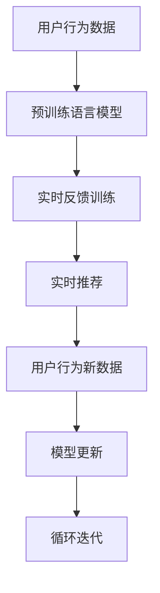

                 

## 1. 背景介绍

### 1.1 问题由来
推荐系统是互联网时代的重要应用，广泛用于电商、视频、音乐、新闻等领域。随着数据量的增长和用户需求的个性化，推荐系统逐渐由静态推荐过渡到动态实时推荐，以更好地适应用户的即时需求和动态变化。实时推荐系统依赖于对用户行为的实时观测和分析，以及根据新数据快速更新推荐模型，以满足用户不断变化的需求。

然而，构建实时推荐系统面临诸多挑战，包括：
1. **高延迟**：实时推荐需要快速处理用户行为数据，并对模型进行更新，以避免推荐结果滞后。
2. **高计算成本**：随着用户规模和数据量的增长，实时推荐需要高效率、高并发的计算资源。
3. **模型泛化能力**：实时推荐需要模型具备较强的泛化能力，以应对新用户的动态行为和历史行为之间的差异。
4. **冷启动问题**：对于新用户，推荐系统缺乏足够的行为数据，难以进行精准推荐。

## 2. 核心概念与联系

### 2.1 核心概念概述

为了应对这些挑战，大模型在推荐系统中的应用逐渐引起了研究者的关注。大模型（如BERT、GPT-3等）以其庞大的参数规模和丰富的语义表示能力，能够有效处理文本和用户行为数据，具备强大的实时反馈能力和泛化能力。

### 2.2 核心概念原理和架构的 Mermaid 流程图



- **用户行为数据**：用户的行为数据，如浏览记录、点击记录、评分记录等。
- **预训练语言模型**：在大规模无标签文本数据上预训练的语言模型，如BERT、GPT-3等。
- **实时反馈训练**：利用用户行为数据，对预训练模型进行实时微调，更新模型参数以适应新的用户行为。
- **实时推荐**：根据微调后的模型进行实时推荐，生成推荐列表。
- **用户行为新数据**：用户行为数据的新增部分，用于不断更新和微调模型。
- **模型更新**：根据新数据不断更新模型参数，提升模型的泛化能力和实时推荐效果。
- **循环迭代**：实时反馈和模型更新的循环过程，确保模型不断适应新的用户行为。

## 3. 核心算法原理 & 具体操作步骤

### 3.1 算法原理概述

大模型在推荐系统中的实时反馈训练，本质上是一种在线学习(Online Learning)过程。该过程通过实时观测用户行为数据，不断更新模型参数，从而提升模型的实时推荐能力。其核心思想是：将预训练语言模型作为初始化参数，通过不断接收实时反馈数据，进行在线微调，逐步适应用户的新行为，并生成更加精准的推荐结果。

形式化地，假设预训练语言模型为 $M_{\theta}$，其中 $\theta$ 为预训练得到的模型参数。给定用户 $u$ 在时间 $t$ 的行为数据 $D_t=\{x_{ut}\}$，其中 $x_{ut}$ 表示用户 $u$ 在时间 $t$ 的行为（如浏览的网页、点击的商品、评分的内容等）。实时反馈训练的目标是最小化损失函数 $\mathcal{L}$，即：

$$
\theta^* = \mathop{\arg\min}_{\theta} \mathcal{L}(M_{\theta}, D)
$$

其中 $\mathcal{L}$ 为基于用户行为数据的损失函数，用于衡量推荐模型在实时反馈训练过程中的预测效果。

### 3.2 算法步骤详解

基于大模型的实时反馈训练，主要包括以下几个关键步骤：

**Step 1: 数据预处理**

- 收集用户的行为数据 $D_t=\{x_{ut}\}$。
- 对用户行为数据进行预处理，如文本分词、特征提取等，得到输入到预训练语言模型的格式。

**Step 2: 模型初始化和微调**

- 选择预训练语言模型 $M_{\theta}$ 作为初始化参数，如 BERT、GPT-3 等。
- 设计合适的损失函数 $\mathcal{L}$，如交叉熵损失、均方误差损失等。
- 通过梯度下降等优化算法，对模型进行微调，更新参数 $\theta$。

**Step 3: 实时推荐**

- 在实时场景下，对用户行为数据进行实时处理和分析。
- 将处理后的用户行为数据输入微调后的模型，生成推荐结果。
- 将推荐结果推送给用户，并收集用户的反馈数据。

**Step 4: 模型更新**

- 根据用户反馈数据，更新模型的损失函数 $\mathcal{L}$。
- 使用在线学习算法，更新模型参数 $\theta$，以适应新的用户行为。
- 重复上述步骤，直至模型收敛或达到预设迭代次数。

### 3.3 算法优缺点

基于大模型的实时反馈训练具有以下优点：
1. **高实时性**：大模型能够快速处理大规模数据，实时更新模型参数，提供精准推荐。
2. **泛化能力强**：预训练模型学习到的语言知识，能够帮助模型更好地泛化到新用户和新场景。
3. **参数高效**：在实时反馈训练中，部分预训练参数固定不变，只微调顶层，减小计算成本。
4. **效果显著**：在大规模数据上进行的微调，能够显著提升推荐模型的效果。

同时，该方法也存在一些局限性：
1. **数据依赖性强**：实时反馈训练依赖于大量的用户行为数据，获取高质量数据成本较高。
2. **过拟合风险**：实时反馈训练可能导致模型过拟合新数据，降低模型泛化能力。
3. **模型复杂度高**：大模型的计算复杂度高，实时更新模型参数对硬件资源要求较高。
4. **动态调整困难**：用户行为数据具有不确定性和多样性，实时调整模型参数难以保证推荐效果。

尽管存在这些局限性，但大模型在实时推荐中的应用，仍是大数据时代推荐系统研究的一个重要方向。未来相关研究的重点在于如何进一步降低实时反馈训练对硬件的依赖，提高模型的泛化能力，同时兼顾实时性和可解释性等因素。

### 3.4 算法应用领域

基于大模型的实时反馈训练，广泛应用于电商、视频、音乐、新闻等多个领域，为推荐系统带来了新的突破。

- **电商推荐**：如淘宝、京东等电商平台，利用用户行为数据进行实时推荐，提升购物体验和销量。
- **视频推荐**：如YouTube、Netflix等视频平台，根据用户观看行为和评分数据，实时生成个性化视频推荐。
- **音乐推荐**：如Spotify、网易云音乐等音乐应用，根据用户听歌行为和评分数据，实时推送个性化音乐列表。
- **新闻推荐**：如今日头条、人民日报等新闻网站，根据用户阅读行为和互动数据，实时推送相关新闻内容。

除了这些常见的应用场景，大模型在推荐系统中的实时反馈训练，也逐渐应用于金融、旅游、健康等更多领域，为各行业带来了新的智能化解决方案。

## 4. 数学模型和公式 & 详细讲解 & 举例说明

### 4.1 数学模型构建

在实时反馈训练中，可以使用在线梯度下降(Online Gradient Descent)算法更新模型参数。设用户行为数据为 $D_t=\{x_{ut}\}$，预训练模型为 $M_{\theta}$，损失函数为 $\mathcal{L}$，则在线梯度下降更新公式为：

$$
\theta_{t+1} = \theta_t - \eta_t \nabla_{\theta}\mathcal{L}(M_{\theta}, D_t)
$$

其中 $\eta_t$ 为学习率，$\nabla_{\theta}\mathcal{L}(M_{\theta}, D_t)$ 为损失函数对模型参数的梯度。

### 4.2 公式推导过程

以电商推荐为例，假设用户的浏览历史为 $\{x_{ut}\}$，其中 $x_{ut}$ 为用户在时间 $t$ 浏览的商品ID。预训练模型为 BERT，则实时反馈训练的损失函数 $\mathcal{L}$ 可以表示为：

$$
\mathcal{L}(M_{\theta}, D) = -\sum_{t=1}^T \frac{1}{N} \sum_{u=1}^N \sum_{i=1}^k \log \hat{y}_i(x_{ut}, \theta)
$$

其中 $N$ 为用户数量，$k$ 为每用户行为数据 $D_t$ 中的商品ID数量。$\hat{y}_i(x_{ut}, \theta)$ 为模型预测用户在时间 $t$ 点击商品ID $i$ 的概率。

### 4.3 案例分析与讲解

假设用户 $u$ 在时间 $t$ 浏览了商品 $x_{ut}=[2,3,4]$，模型预测其在每个商品上的点击概率如下：

- 商品2：$P_{u,t}(2|x_{ut}, \theta)=0.1$
- 商品3：$P_{u,t}(3|x_{ut}, \theta)=0.2$
- 商品4：$P_{u,t}(4|x_{ut}, \theta)=0.3$

实际点击的商品为2，则损失函数为：

$$
\mathcal{L}(M_{\theta}, D_t) = -\frac{1}{N} \sum_{u=1}^N \log P_{u,t}(2|x_{ut}, \theta) = -\frac{1}{N} \sum_{u=1}^N \log 0.1
$$

根据在线梯度下降算法，更新模型参数 $\theta$ 的公式为：

$$
\theta_{t+1} = \theta_t - \eta_t \nabla_{\theta}\mathcal{L}(M_{\theta}, D_t)
$$

其中 $\nabla_{\theta}\mathcal{L}(M_{\theta}, D_t)$ 可以递归展开为：

$$
\nabla_{\theta}\mathcal{L}(M_{\theta}, D_t) = -\frac{1}{N} \sum_{u=1}^N \frac{\partial \log P_{u,t}(2|x_{ut}, \theta)}{\partial \theta}
$$

通过对模型参数 $\theta$ 的不断更新，使得模型能够逐步适应用户的实时行为，生成更加精准的推荐结果。

## 5. 项目实践：代码实例和详细解释说明

### 5.1 开发环境搭建

在进行实时反馈训练实践前，我们需要准备好开发环境。以下是使用Python进行PyTorch开发的环境配置流程：

1. 安装Anaconda：从官网下载并安装Anaconda，用于创建独立的Python环境。

2. 创建并激活虚拟环境：
```bash
conda create -n pytorch-env python=3.8 
conda activate pytorch-env
```

3. 安装PyTorch：根据CUDA版本，从官网获取对应的安装命令。例如：
```bash
conda install pytorch torchvision torchaudio cudatoolkit=11.1 -c pytorch -c conda-forge
```

4. 安装Transformers库：
```bash
pip install transformers
```

5. 安装各类工具包：
```bash
pip install numpy pandas scikit-learn matplotlib tqdm jupyter notebook ipython
```

完成上述步骤后，即可在`pytorch-env`环境中开始实时反馈训练实践。

### 5.2 源代码详细实现

这里我们以电商推荐为例，给出使用Transformers库对BERT模型进行实时反馈训练的PyTorch代码实现。

首先，定义电商推荐的数据处理函数：

```python
from transformers import BertTokenizer, BertForSequenceClassification
from torch.utils.data import Dataset
import torch

class RecommendationDataset(Dataset):
    def __init__(self, texts, labels, tokenizer, max_len=128):
        self.texts = texts
        self.labels = labels
        self.tokenizer = tokenizer
        self.max_len = max_len
        
    def __len__(self):
        return len(self.texts)
    
    def __getitem__(self, item):
        text = self.texts[item]
        label = self.labels[item]
        
        encoding = self.tokenizer(text, return_tensors='pt', max_length=self.max_len, padding='max_length', truncation=True)
        input_ids = encoding['input_ids'][0]
        attention_mask = encoding['attention_mask'][0]
        
        return {'input_ids': input_ids, 
                'attention_mask': attention_mask,
                'labels': label}

# 定义标签与数字id的映射
label2id = {'0': 0, '1': 1}
id2label = {v: k for k, v in label2id.items()}

# 创建dataset
tokenizer = BertTokenizer.from_pretrained('bert-base-cased')

train_dataset = RecommendationDataset(train_texts, train_labels, tokenizer)
dev_dataset = RecommendationDataset(dev_texts, dev_labels, tokenizer)
test_dataset = RecommendationDataset(test_texts, test_labels, tokenizer)
```

然后，定义模型和优化器：

```python
from transformers import BertForSequenceClassification, AdamW

model = BertForSequenceClassification.from_pretrained('bert-base-cased', num_labels=len(label2id))

optimizer = AdamW(model.parameters(), lr=2e-5)
```

接着，定义训练和评估函数：

```python
from torch.utils.data import DataLoader
from tqdm import tqdm
from sklearn.metrics import accuracy_score

device = torch.device('cuda') if torch.cuda.is_available() else torch.device('cpu')
model.to(device)

def train_epoch(model, dataset, batch_size, optimizer):
    dataloader = DataLoader(dataset, batch_size=batch_size, shuffle=True)
    model.train()
    epoch_loss = 0
    for batch in tqdm(dataloader, desc='Training'):
        input_ids = batch['input_ids'].to(device)
        attention_mask = batch['attention_mask'].to(device)
        labels = batch['labels'].to(device)
        model.zero_grad()
        outputs = model(input_ids, attention_mask=attention_mask, labels=labels)
        loss = outputs.loss
        epoch_loss += loss.item()
        loss.backward()
        optimizer.step()
    return epoch_loss / len(dataloader)

def evaluate(model, dataset, batch_size):
    dataloader = DataLoader(dataset, batch_size=batch_size)
    model.eval()
    preds, labels = [], []
    with torch.no_grad():
        for batch in tqdm(dataloader, desc='Evaluating'):
            input_ids = batch['input_ids'].to(device)
            attention_mask = batch['attention_mask'].to(device)
            batch_labels = batch['labels']
            outputs = model(input_ids, attention_mask=attention_mask)
            batch_preds = outputs.logits.argmax(dim=1).to('cpu').tolist()
            batch_labels = batch_labels.to('cpu').tolist()
            for pred, label in zip(batch_preds, batch_labels):
                preds.append(pred)
                labels.append(label)
                
    print('Accuracy: {:.2f}%'.format(accuracy_score(labels, preds) * 100))
```

最后，启动训练流程并在测试集上评估：

```python
epochs = 5
batch_size = 16

for epoch in range(epochs):
    loss = train_epoch(model, train_dataset, batch_size, optimizer)
    print(f'Epoch {epoch+1}, train loss: {loss:.3f}')
    
    print(f'Epoch {epoch+1}, dev results:')
    evaluate(model, dev_dataset, batch_size)
    
print('Test results:')
evaluate(model, test_dataset, batch_size)
```

以上就是使用PyTorch对BERT进行实时反馈训练的完整代码实现。可以看到，借助Transformers库，实时反馈训练的代码实现相对简洁高效。

### 5.3 代码解读与分析

让我们再详细解读一下关键代码的实现细节：

**RecommendationDataset类**：
- `__init__`方法：初始化文本、标签、分词器等关键组件。
- `__len__`方法：返回数据集的样本数量。
- `__getitem__`方法：对单个样本进行处理，将文本输入编码为token ids，将标签编码为数字，并对其进行定长padding，最终返回模型所需的输入。

**label2id和id2label字典**：
- 定义了标签与数字id之间的映射关系，用于将预测结果解码为真实的标签。

**训练和评估函数**：
- 使用PyTorch的DataLoader对数据集进行批次化加载，供模型训练和推理使用。
- 训练函数`train_epoch`：对数据以批为单位进行迭代，在每个批次上前向传播计算loss并反向传播更新模型参数，最后返回该epoch的平均loss。
- 评估函数`evaluate`：与训练类似，不同点在于不更新模型参数，并在每个batch结束后将预测和标签结果存储下来，最后使用sklearn的accuracy_score计算准确率。

**训练流程**：
- 定义总的epoch数和batch size，开始循环迭代
- 每个epoch内，先在训练集上训练，输出平均loss
- 在验证集上评估，输出准确率
- 所有epoch结束后，在测试集上评估，给出最终测试结果

可以看到，PyTorch配合Transformers库使得实时反馈训练的代码实现变得简洁高效。开发者可以将更多精力放在数据处理、模型改进等高层逻辑上，而不必过多关注底层的实现细节。

当然，工业级的系统实现还需考虑更多因素，如模型的保存和部署、超参数的自动搜索、更灵活的任务适配层等。但核心的实时反馈训练范式基本与此类似。

## 6. 实际应用场景

### 6.1 智能客服系统

实时反馈训练在智能客服系统中的应用，能够显著提升客服响应的效率和质量。传统客服系统通常依赖人工操作，响应时间长且质量不稳定。通过实时反馈训练，智能客服系统能够实时获取用户反馈，快速调整推荐策略，提供更加个性化和精准的客户服务。

在技术实现上，可以收集客服对话记录和用户评分数据，作为监督数据，对预训练的对话模型进行实时微调。微调后的模型能够自动理解用户意图，匹配最合适的答案模板进行回复。对于客户提出的新问题，还可以接入检索系统实时搜索相关内容，动态组织生成回答。如此构建的智能客服系统，能大幅提升客户咨询体验和问题解决效率。

### 6.2 金融舆情监测

实时反馈训练在金融舆情监测中的应用，能够实时监测市场舆论动向，及时应对负面信息传播，规避金融风险。金融市场瞬息万变，传统的舆情监测方法难以快速响应突发事件。通过实时反馈训练，实时舆情监测系统能够自动抓取市场新闻、评论等文本数据，实时分析情感倾向和话题热度，一旦发现负面信息激增等异常情况，系统便会自动预警，帮助金融机构快速应对潜在风险。

### 6.3 个性化推荐系统

实时反馈训练在个性化推荐系统中的应用，能够动态调整推荐策略，提升推荐效果。传统的推荐系统通常基于历史行为数据进行推荐，难以适应新用户的动态行为和变化。通过实时反馈训练，推荐系统能够根据用户的实时行为数据，实时更新推荐模型，生成更加精准的个性化推荐结果。

在技术实现上，可以收集用户浏览、点击、评分等行为数据，提取和用户交互的物品标题、描述、标签等文本内容。将文本内容作为模型输入，用户的后续行为（如是否点击、购买等）作为监督信号，在此基础上对预训练语言模型进行实时微调。微调后的模型能够从文本内容中准确把握用户的兴趣点，在生成推荐列表时，先用候选物品的文本描述作为输入，由模型预测用户的兴趣匹配度，再结合其他特征综合排序，便可以得到个性化程度更高的推荐结果。

### 6.4 未来应用展望

随着大模型和实时反馈训练技术的发展，未来的推荐系统将呈现以下几个趋势：

1. **实时性更高**：随着硬件资源的提升和算法优化的深入，推荐系统的实时性将进一步提升，能够快速响应用户的即时需求。
2. **个性化更强**：实时反馈训练能够动态调整推荐策略，更好地适应用户的个性化需求和行为变化。
3. **跨域协同**：通过跨领域数据融合和模型协同，推荐系统将具备更强的泛化能力和适应性。
4. **多模态整合**：推荐系统将融合多种数据模态，如文本、图像、视频等，提供更加丰富的推荐内容。
5. **知识驱动**：结合知识图谱和规则库等专家知识，推荐系统将具备更强的决策解释能力和知识整合能力。

## 7. 工具和资源推荐

### 7.1 学习资源推荐

为了帮助开发者系统掌握大模型在推荐系统中的应用，这里推荐一些优质的学习资源：

1. 《Transformer from PyTorch to TensorFlow》系列博文：由大模型技术专家撰写，深入浅出地介绍了Transformer原理、BERT模型、微调技术等前沿话题。

2. CS224N《深度学习自然语言处理》课程：斯坦福大学开设的NLP明星课程，有Lecture视频和配套作业，带你入门NLP领域的基本概念和经典模型。

3. 《Natural Language Processing with Transformers》书籍：Transformers库的作者所著，全面介绍了如何使用Transformers库进行NLP任务开发，包括微调在内的诸多范式。

4. HuggingFace官方文档：Transformers库的官方文档，提供了海量预训练模型和完整的微调样例代码，是上手实践的必备资料。

5. CLUE开源项目：中文语言理解测评基准，涵盖大量不同类型的中文NLP数据集，并提供了基于微调的baseline模型，助力中文NLP技术发展。

通过对这些资源的学习实践，相信你一定能够快速掌握大模型在推荐系统中的应用，并用于解决实际的推荐问题。

### 7.2 开发工具推荐

高效的开发离不开优秀的工具支持。以下是几款用于大模型在推荐系统中的应用开发的常用工具：

1. PyTorch：基于Python的开源深度学习框架，灵活动态的计算图，适合快速迭代研究。大部分预训练语言模型都有PyTorch版本的实现。

2. TensorFlow：由Google主导开发的开源深度学习框架，生产部署方便，适合大规模工程应用。同样有丰富的预训练语言模型资源。

3. Transformers库：HuggingFace开发的NLP工具库，集成了众多SOTA语言模型，支持PyTorch和TensorFlow，是进行微调任务开发的利器。

4. Weights & Biases：模型训练的实验跟踪工具，可以记录和可视化模型训练过程中的各项指标，方便对比和调优。与主流深度学习框架无缝集成。

5. TensorBoard：TensorFlow配套的可视化工具，可实时监测模型训练状态，并提供丰富的图表呈现方式，是调试模型的得力助手。

6. Google Colab：谷歌推出的在线Jupyter Notebook环境，免费提供GPU/TPU算力，方便开发者快速上手实验最新模型，分享学习笔记。

合理利用这些工具，可以显著提升大模型在推荐系统中的应用开发效率，加快创新迭代的步伐。

### 7.3 相关论文推荐

大模型和实时反馈训练技术的发展源于学界的持续研究。以下是几篇奠基性的相关论文，推荐阅读：

1. Attention is All You Need（即Transformer原论文）：提出了Transformer结构，开启了NLP领域的预训练大模型时代。

2. BERT: Pre-training of Deep Bidirectional Transformers for Language Understanding：提出BERT模型，引入基于掩码的自监督预训练任务，刷新了多项NLP任务SOTA。

3. Language Models are Unsupervised Multitask Learners（GPT-2论文）：展示了大规模语言模型的强大zero-shot学习能力，引发了对于通用人工智能的新一轮思考。

4. Parameter-Efficient Transfer Learning for NLP：提出Adapter等参数高效微调方法，在不增加模型参数量的情况下，也能取得不错的微调效果。

5. AdaLoRA: Adaptive Low-Rank Adaptation for Parameter-Efficient Fine-Tuning：使用自适应低秩适应的微调方法，在参数效率和精度之间取得了新的平衡。

这些论文代表了大模型在推荐系统中的应用发展脉络。通过学习这些前沿成果，可以帮助研究者把握学科前进方向，激发更多的创新灵感。

## 8. 总结：未来发展趋势与挑战

### 8.1 总结

本文对基于大模型的实时反馈训练方法进行了全面系统的介绍。首先阐述了实时反馈训练在推荐系统中的应用背景和意义，明确了实时反馈训练在提升推荐效果、降低成本等方面的独特价值。其次，从原理到实践，详细讲解了实时反馈训练的数学模型和关键步骤，给出了实时反馈训练任务开发的完整代码实例。同时，本文还广泛探讨了实时反馈训练方法在智能客服、金融舆情、个性化推荐等多个领域的应用前景，展示了实时反馈训练范式的巨大潜力。最后，本文精选了实时反馈训练技术的各类学习资源，力求为读者提供全方位的技术指引。

通过本文的系统梳理，可以看到，基于大模型的实时反馈训练方法正在成为推荐系统实时推荐的重要手段，极大地拓展了推荐系统的应用边界，为推荐系统带来了新的突破。未来，伴随大模型和微调方法的不断进步，相信推荐系统必将在更多领域得到应用，为经济社会发展注入新的动力。

### 8.2 未来发展趋势

展望未来，实时反馈训练技术将呈现以下几个发展趋势：

1. **自动化程度更高**：随着自动化调参和模型压缩等技术的进步，实时反馈训练的自动化程度将进一步提高，降低人工干预的难度。
2. **数据效率更高**：通过在线学习算法和自适应学习率等方法，实时反馈训练将更好地利用小规模数据，提高模型泛化能力。
3. **模型复杂度更低**：通过参数高效微调方法和模型压缩技术，实时反馈训练的模型将具备更低的计算复杂度和更高的实时性。
4. **应用场景更广**：实时反馈训练将不仅仅应用于推荐系统，还将拓展到更多领域，如智能客服、金融舆情、智能家居等。
5. **用户体验更好**：实时反馈训练将结合多模态数据融合和知识表示等技术，提升推荐系统的人机交互体验和决策透明度。

以上趋势凸显了实时反馈训练技术的广阔前景。这些方向的探索发展，必将进一步提升推荐系统的性能和应用范围，为经济社会发展注入新的动力。

### 8.3 面临的挑战

尽管实时反馈训练技术已经取得了显著进展，但在迈向更加智能化、普适化应用的过程中，它仍面临诸多挑战：

1. **数据获取困难**：实时反馈训练依赖于大量的用户行为数据，获取高质量数据成本较高。
2. **模型过拟合**：实时反馈训练可能导致模型过拟合新数据，降低模型泛化能力。
3. **系统复杂度增加**：实时反馈训练引入了更多的在线学习算法和模型管理机制，系统复杂度增加。
4. **实时响应延迟**：实时反馈训练需要快速处理和更新模型参数，响应延迟可能成为性能瓶颈。
5. **数据隐私和安全**：用户行为数据的隐私和安全问题需要妥善处理，确保用户数据不被滥用。

尽管存在这些挑战，但实时反馈训练技术在未来仍然具备广阔的发展空间。未来相关研究的重点在于如何进一步降低数据获取成本，提高模型泛化能力，同时兼顾实时性和可解释性等因素。

### 8.4 研究展望

面对实时反馈训练技术面临的挑战，未来的研究需要在以下几个方面寻求新的突破：

1. **数据增强和合成**：通过数据增强和合成技术，提高实时反馈训练的数据质量和多样性，降低数据获取成本。
2. **在线学习算法优化**：开发更高效的在线学习算法，减少模型更新过程中的计算和存储开销，提高实时响应速度。
3. **多模态融合**：结合文本、图像、语音等多种数据模态，提升推荐系统的决策能力和用户体验。
4. **模型压缩和优化**：通过模型压缩和优化技术，降低实时反馈训练的计算复杂度，提高实时响应速度。
5. **隐私保护和安全**：开发隐私保护和安全技术，确保用户行为数据的安全和隐私保护。

这些研究方向的探索，必将引领实时反馈训练技术迈向更高的台阶，为推荐系统带来更加智能、安全、普适的应用体验。

## 9. 附录：常见问题与解答

**Q1：实时反馈训练是否适用于所有推荐系统？**

A: 实时反馈训练在电商、视频、音乐、新闻等领域的应用已经取得了显著成果，但对于一些特殊领域的推荐系统，如医疗、教育等，实时反馈训练的效果可能受限于数据获取难度和领域特定知识。此时需要在特定领域语料上进一步预训练，再进行微调，才能获得理想效果。

**Q2：实时反馈训练如何防止模型过拟合？**

A: 实时反馈训练容易导致模型过拟合新数据，降低模型泛化能力。常见的防止过拟合的方法包括：
1. 数据增强：通过回译、近义替换等方式扩充训练集。
2. 正则化：使用L2正则、Dropout等技术。
3. 对抗训练：引入对抗样本，提高模型鲁棒性。
4. 模型压缩：通过剪枝、量化等技术，减小模型规模。

这些方法可以结合使用，根据具体场景灵活选择，以防止模型过拟合。

**Q3：实时反馈训练如何提升推荐系统的效果？**

A: 实时反馈训练能够动态调整推荐策略，提升推荐效果。具体而言，通过实时获取用户行为数据，对预训练模型进行微调，生成更加精准的推荐结果。微调后的模型能够根据用户的实时行为数据，动态调整推荐策略，生成更符合用户需求和兴趣的推荐内容。

**Q4：实时反馈训练在推荐系统中的应用有哪些？**

A: 实时反馈训练在推荐系统中的应用场景广泛，包括但不限于：
1. 电商推荐：实时抓取用户浏览记录，生成个性化推荐。
2. 视频推荐：实时分析用户观看记录和评分数据，生成个性化视频推荐。
3. 音乐推荐：实时分析用户听歌记录和评分数据，生成个性化音乐推荐。
4. 新闻推荐：实时抓取用户阅读记录和互动数据，生成个性化新闻内容推荐。

除了这些常见的应用场景，实时反馈训练还应用于金融、旅游、健康等更多领域，为各行业带来了新的智能化解决方案。

**Q5：实时反馈训练在推荐系统中的应用有什么优势？**

A: 实时反馈训练在推荐系统中的应用，具有以下优势：
1. 高实时性：能够实时处理用户行为数据，快速更新模型参数，提供精准推荐。
2. 泛化能力强：预训练模型学习到的语言知识，能够帮助模型更好地泛化到新用户和新场景。
3. 参数高效：在实时反馈训练中，部分预训练参数固定不变，只微调顶层，减小计算成本。
4. 动态调整：能够动态调整推荐策略，适应用户的个性化需求和行为变化。

这些优势使得实时反馈训练在推荐系统中的应用前景广阔。

