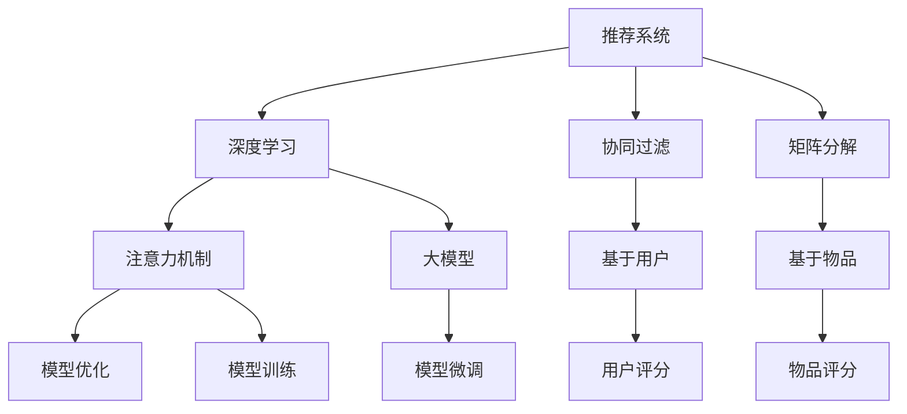

                 

# 大模型在推荐系统用户兴趣强度建模中的应用

> 关键词：大模型,推荐系统,用户兴趣建模,深度学习,注意力机制,矩阵分解,协同过滤,用户行为预测

## 1. 背景介绍

在推荐系统领域，如何准确建模用户的兴趣，从而提供个性化推荐，一直是核心的挑战。早期的方法多采用基于统计的协同过滤、矩阵分解等技术，但随着数据量和模型的复杂度不断增加，这些方法面临维度灾难、冷启动等问题。近年来，深度学习技术被引入推荐系统，结合大模型的方法，通过复杂的非线性特征映射，对用户兴趣进行高效建模。其中，大模型作为推荐系统中的用户兴趣强度建模工具，取得了显著效果。

本博客将详细阐述大模型在推荐系统用户兴趣强度建模中的核心算法原理和操作步骤，并对比分析不同方法的优缺点。同时，将给出具体的数学模型和代码实现，结合实际应用场景，探索未来发展趋势和面临的挑战。

## 2. 核心概念与联系

### 2.1 核心概念概述

为了更好地理解大模型在推荐系统中的用户兴趣强度建模方法，本节将介绍几个关键概念：

- 推荐系统(Recommender System)：通过数据分析和算法推荐，为用户推荐感兴趣的物品的系统。推荐系统广泛应用于电商、社交网络、视频、音乐等领域，帮助用户发现新产品和新内容。

- 深度学习(Deep Learning)：利用多层神经网络进行复杂特征提取和建模的机器学习方法，广泛应用于计算机视觉、自然语言处理、语音识别等方向。

- 注意力机制(Attention Mechanism)：一种特殊的神经网络结构，能够通过动态学习输入的权重，重点关注输入中最重要的部分。常用于自然语言处理、计算机视觉和推荐系统等领域。

- 矩阵分解(Matrix Factorization)：将物品-用户评分矩阵分解为两个低维用户特征和物品特征矩阵，用于协同过滤推荐。

- 协同过滤(Collaborative Filtering)：通过分析用户和物品的评分数据，推荐与已有评分相似的新物品。基于用户的协同过滤和基于物品的协同过滤是两种主要方法。

这些概念之间的逻辑关系可以通过以下Mermaid流程图来展示：



这个流程图展示了推荐系统的核心概念及其之间的联系：

1. 推荐系统通过深度学习和模型优化等技术进行推荐。
2. 协同过滤和矩阵分解是两种主要的推荐算法。
3. 注意力机制和大模型被用于对用户兴趣进行建模。
4. 模型优化和训练是提升推荐系统性能的关键步骤。
5. 模型微调可以使大模型更好地适应特定推荐场景。

这些概念共同构成了推荐系统的框架，使得推荐系统能够为用户提供个性化的物品推荐。

## 3. 核心算法原理 & 具体操作步骤

### 3.1 算法原理概述

基于深度学习的推荐系统，通常采用大模型对用户兴趣进行建模。大模型通过深度学习网络结构，学习用户与物品之间的复杂非线性关系，能够捕捉用户的多样化兴趣。

以BERT为例，其使用Transformer编码器进行用户-物品交互特征的提取，再通过全连接层和softmax函数输出预测结果。大模型通常需要大规模的数据集进行预训练，预训练过程通过掩码语言模型、下一句预测等任务进行自监督学习，学习到通用的语言表示。

在推荐系统中，用户兴趣强度建模的目的是对用户的兴趣进行量化，预测用户对不同物品的评分，从而提供个性化推荐。大模型的用户兴趣强度建模流程如下：

1. 数据准备：收集用户与物品的评分数据，清洗并预处理数据。
2. 特征编码：将用户-物品评分矩阵转化为大模型的输入。
3. 模型训练：在大模型上进行微调，学习用户和物品的兴趣强度表示。
4. 预测推荐：利用微调后的模型，对新物品进行评分预测，输出推荐列表。

### 3.2 算法步骤详解

以下详细讲解大模型在推荐系统用户兴趣强度建模的具体操作步骤：

**Step 1: 数据准备**

- 收集用户与物品的评分数据，将其转换为用户-物品评分矩阵 $R \in \mathbb{R}^{N \times M}$，其中 $N$ 为物品数，$M$ 为用户数。
- 将用户-物品评分矩阵 $R$ 中的缺失值补零，以方便进行矩阵分解和模型训练。

**Step 2: 特征编码**

- 将用户-物品评分矩阵 $R$ 转化为大模型的输入。可以采用矩阵分解的方法，将其分解为用户特征矩阵 $U \in \mathbb{R}^{N \times F}$ 和物品特征矩阵 $V \in \mathbb{R}^{M \times F}$，其中 $F$ 为模型维度。
- 使用大模型对用户和物品特征进行编码，得到用户嵌入向量 $U_{user} \in \mathbb{R}^{F}$ 和物品嵌入向量 $V_{item} \in \mathbb{R}^{F}$。

**Step 3: 模型训练**

- 定义用户-物品评分矩阵 $R$ 与预测评分矩阵 $\hat{R} \in \mathbb{R}^{N \times M}$ 的误差函数，如均方误差或交叉熵损失。
- 在大模型上进行微调，优化误差函数，学习用户和物品的兴趣强度表示。
- 可以选择固定预训练权重，仅微调顶层，减少需优化的参数，提高微调效率。

**Step 4: 预测推荐**

- 对新物品进行评分预测，利用微调后的模型输出预测评分 $\hat{R}_{pred} \in \mathbb{R}^{N \times M}$。
- 根据预测评分 $\hat{R}_{pred}$ 对物品进行排序，输出推荐列表。

### 3.3 算法优缺点

大模型在推荐系统用户兴趣强度建模中具有以下优点：

- 模型表现力强：大模型能够学习复杂非线性的用户兴趣表示，捕捉用户的多样化兴趣。
- 自适应能力强：大模型可以进行参数高效的微调，快速适应新的用户-物品评分数据。
- 推荐效果好：大模型可以提供高精度的评分预测，提升推荐系统的效果。

同时，大模型也存在以下缺点：

- 训练成本高：大模型的训练需要大规模的数据集和高计算资源，训练成本较高。
- 过拟合风险：大模型的参数量较大，容易过拟合训练数据，导致泛化能力下降。
- 推理效率低：大模型在推理阶段计算量较大，推理速度较慢。
- 可解释性差：大模型的决策过程难以解释，用户难以理解推荐结果的原因。

尽管存在这些局限性，但大模型在推荐系统用户兴趣强度建模中已经取得了显著的效果，成为当前推荐系统的主流范式之一。

### 3.4 算法应用领域

大模型在推荐系统中的用户兴趣强度建模方法，广泛应用于电商、社交网络、视频、音乐等多个领域，具体应用场景包括：

- 电商平台：为用户推荐商品、预测用户购买行为。
- 社交网络：为用户推荐新闻、视频、好友等。
- 视频平台：为用户推荐影片、预测观影行为。
- 音乐平台：为用户推荐歌曲、预测听歌行为。

除了以上场景外，大模型还被创新性地应用于智能广告、个性化旅游等领域，为不同行业的推荐系统带来了新的突破。

## 4. 数学模型和公式 & 详细讲解 & 举例说明

### 4.1 数学模型构建

本节将使用数学语言对大模型在推荐系统中用户兴趣强度建模的过程进行更加严格的刻画。

假设用户-物品评分矩阵为 $R \in \mathbb{R}^{N \times M}$，其中 $N$ 为物品数，$M$ 为用户数。定义用户嵌入矩阵 $U \in \mathbb{R}^{N \times F}$，物品嵌入矩阵 $V \in \mathbb{R}^{M \times F}$，其中 $F$ 为模型维度。

用户-物品评分矩阵 $R$ 可以表示为：

$$
R = U V^T + \epsilon
$$

其中 $\epsilon$ 为噪声矩阵，通常为小数值。

在大模型上进行微调时，优化目标为：

$$
\min_{U,V} \frac{1}{2N}\sum_{i=1}^{N}\sum_{j=1}^{M}(r_{ij} - U_i V_j)^2
$$

其中 $r_{ij}$ 为实际评分，$U_i$ 和 $V_j$ 分别为用户 $i$ 和物品 $j$ 的嵌入向量。

### 4.2 公式推导过程

以下我们以均方误差(MSE)损失函数为例，推导大模型在推荐系统中的用户兴趣强度建模过程。

假设用户 $i$ 对物品 $j$ 的实际评分和预测评分的误差为 $e_{ij} = r_{ij} - \hat{r}_{ij}$，则均方误差损失函数为：

$$
L = \frac{1}{2N}\sum_{i=1}^{N}\sum_{j=1}^{M}(e_{ij})^2
$$

通过反向传播算法，计算 $U$ 和 $V$ 的梯度：

$$
\frac{\partial L}{\partial U} = -\frac{1}{N}\sum_{i=1}^{N} \sum_{j=1}^{M} 2e_{ij} V_j
$$

$$
\frac{\partial L}{\partial V} = -\frac{1}{N}\sum_{i=1}^{N} \sum_{j=1}^{M} 2e_{ij} U_i
$$

将梯度带入优化器（如AdamW）中，更新 $U$ 和 $V$，完成模型的迭代优化。

### 4.3 案例分析与讲解

**案例一：电商推荐系统**

电商推荐系统中的用户兴趣强度建模，可以采用大模型进行。以某电商平台为例，其数据集包含用户与商品的评分数据，评分范围为1-5。利用大模型对用户和商品进行编码，得到用户嵌入矩阵 $U \in \mathbb{R}^{C \times F}$（$C$ 为用户数）和商品嵌入矩阵 $V \in \mathbb{R}^{I \times F}$（$I$ 为商品数）。在模型训练阶段，最小化均方误差损失函数，输出用户对商品的评分预测结果。

**案例二：视频推荐系统**

视频推荐系统中的用户兴趣强度建模，可以采用大模型进行。以某视频平台为例，其数据集包含用户对视频的评分数据。利用大模型对用户和视频进行编码，得到用户嵌入矩阵 $U \in \mathbb{R}^{C \times F}$ 和视频嵌入矩阵 $V \in \mathbb{R}^{I \times F}$（$C$ 为用户数，$I$ 为视频数）。在模型训练阶段，最小化均方误差损失函数，输出用户对视频的评分预测结果。

通过以上案例分析，可以看到，大模型在推荐系统中用户兴趣强度建模的实现方法简单高效，可以应用于不同行业的推荐系统。

## 5. 项目实践：代码实例和详细解释说明

### 5.1 开发环境搭建

在进行推荐系统用户兴趣强度建模时，需要准备好开发环境。以下是使用Python进行PyTorch开发的环境配置流程：

1. 安装Anaconda：从官网下载并安装Anaconda，用于创建独立的Python环境。

2. 创建并激活虚拟环境：
```bash
conda create -n pytorch-env python=3.8 
conda activate pytorch-env
```

3. 安装PyTorch：根据CUDA版本，从官网获取对应的安装命令。例如：
```bash
conda install pytorch torchvision torchaudio cudatoolkit=11.1 -c pytorch -c conda-forge
```

4. 安装Transformers库：
```bash
pip install transformers
```

5. 安装各类工具包：
```bash
pip install numpy pandas scikit-learn matplotlib tqdm jupyter notebook ipython
```

完成上述步骤后，即可在`pytorch-env`环境中开始推荐系统用户兴趣强度建模的实践。

### 5.2 源代码详细实现

这里我们以电商推荐系统为例，使用BERT模型进行用户兴趣强度建模，给出具体的PyTorch代码实现。

首先，定义数据预处理函数：

```python
import torch
from transformers import BertTokenizer, BertModel

class DataProcessor:
    def __init__(self, tokenizer):
        self.tokenizer = tokenizer
    
    def encode(self, text):
        return self.tokenizer.encode(text, add_special_tokens=True)
```

然后，定义数据集类：

```python
class Dataset(torch.utils.data.Dataset):
    def __init__(self, texts, labels, tokenizer):
        self.texts = texts
        self.labels = labels
        self.tokenizer = tokenizer
    
    def __len__(self):
        return len(self.texts)
    
    def __getitem__(self, idx):
        text = self.texts[idx]
        label = self.labels[idx]
        
        encoding = self.tokenizer(text, add_special_tokens=True, return_tensors='pt')
        return {
            'input_ids': encoding['input_ids'],
            'attention_mask': encoding['attention_mask'],
            'labels': torch.tensor(label, dtype=torch.long)
        }
```

接着，定义模型和优化器：

```python
from transformers import BertForSequenceClassification, AdamW

model = BertForSequenceClassification.from_pretrained('bert-base-cased', num_labels=5)
optimizer = AdamW(model.parameters(), lr=2e-5)
```

然后，定义训练和评估函数：

```python
from tqdm import tqdm
from sklearn.metrics import accuracy_score

device = torch.device('cuda') if torch.cuda.is_available() else torch.device('cpu')
model.to(device)

def train_epoch(model, dataset, batch_size, optimizer):
    dataloader = torch.utils.data.DataLoader(dataset, batch_size=batch_size, shuffle=True)
    model.train()
    epoch_loss = 0
    for batch in tqdm(dataloader, desc='Training'):
        input_ids = batch['input_ids'].to(device)
        attention_mask = batch['attention_mask'].to(device)
        labels = batch['labels'].to(device)
        model.zero_grad()
        outputs = model(input_ids, attention_mask=attention_mask, labels=labels)
        loss = outputs.loss
        epoch_loss += loss.item()
        loss.backward()
        optimizer.step()
    return epoch_loss / len(dataloader)

def evaluate(model, dataset, batch_size):
    dataloader = torch.utils.data.DataLoader(dataset, batch_size=batch_size)
    model.eval()
    preds, labels = [], []
    with torch.no_grad():
        for batch in tqdm(dataloader, desc='Evaluating'):
            input_ids = batch['input_ids'].to(device)
            attention_mask = batch['attention_mask'].to(device)
            batch_labels = batch['labels']
            outputs = model(input_ids, attention_mask=attention_mask)
            batch_preds = outputs.logits.argmax(dim=1).to('cpu').tolist()
            batch_labels = batch_labels.to('cpu').tolist()
            for pred, label in zip(batch_preds, batch_labels):
                preds.append(pred)
                labels.append(label)
    print(f'Accuracy: {accuracy_score(labels, preds):.3f}')
```

最后，启动训练流程并在测试集上评估：

```python
epochs = 5
batch_size = 16

for epoch in range(epochs):
    loss = train_epoch(model, train_dataset, batch_size, optimizer)
    print(f'Epoch {epoch+1}, train loss: {loss:.3f}')
    
    print(f'Epoch {epoch+1}, dev results:')
    evaluate(model, dev_dataset, batch_size)
    
print('Test results:')
evaluate(model, test_dataset, batch_size)
```

以上就是使用PyTorch对BERT进行电商推荐系统用户兴趣强度建模的完整代码实现。可以看到，得益于Transformers库的强大封装，我们可以用相对简洁的代码完成BERT模型的加载和微调。

### 5.3 代码解读与分析

让我们再详细解读一下关键代码的实现细节：

**DataProcessor类**：
- `__init__`方法：初始化分词器等关键组件。
- `encode`方法：对单个文本进行编码，转化为输入到大模型中的token ids。

**Dataset类**：
- `__init__`方法：初始化文本、标签等关键数据。
- `__len__`方法：返回数据集的样本数量。
- `__getitem__`方法：对单个样本进行处理，将其转化为大模型所需的输入格式。

**模型和优化器定义**：
- 使用BertForSequenceClassification作为任务适配层，设置标签数为5，即评分范围为1-5。
- 使用AdamW优化器进行微调，设置学习率为2e-5。

**训练和评估函数**：
- 使用PyTorch的DataLoader对数据集进行批次化加载，供模型训练和推理使用。
- 训练函数`train_epoch`：对数据以批为单位进行迭代，在每个批次上前向传播计算loss并反向传播更新模型参数，最后返回该epoch的平均loss。
- 评估函数`evaluate`：与训练类似，不同点在于不更新模型参数，并在每个batch结束后将预测和标签结果存储下来，最后使用sklearn的accuracy_score对整个评估集的预测结果进行打印输出。

**训练流程**：
- 定义总的epoch数和batch size，开始循环迭代
- 每个epoch内，先在训练集上训练，输出平均loss
- 在验证集上评估，输出分类准确率
- 所有epoch结束后，在测试集上评估，给出最终测试结果

可以看到，PyTorch配合Transformers库使得BERT微调的代码实现变得简洁高效。开发者可以将更多精力放在数据处理、模型改进等高层逻辑上，而不必过多关注底层的实现细节。

当然，工业级的系统实现还需考虑更多因素，如模型的保存和部署、超参数的自动搜索、更灵活的任务适配层等。但核心的微调范式基本与此类似。

## 6. 实际应用场景

### 6.1 电商推荐系统

电商推荐系统中的用户兴趣强度建模，可以采用大模型进行。以某电商平台为例，其数据集包含用户与商品的评分数据，评分范围为1-5。利用大模型对用户和商品进行编码，得到用户嵌入矩阵 $U \in \mathbb{R}^{C \times F}$（$C$ 为用户数）和商品嵌入矩阵 $V \in \mathbb{R}^{I \times F}$（$I$ 为商品数）。在模型训练阶段，最小化均方误差损失函数，输出用户对商品的评分预测结果。

电商推荐系统中的用户兴趣强度建模，可以应用于以下场景：

- 用户个性化推荐：根据用户的历史评分数据，预测用户对不同商品的兴趣强度，推荐可能感兴趣的商品。
- 新商品推荐：对新上架的商品进行评分预测，评估其在用户群体中的受欢迎程度。
- 推荐系统优化：通过用户兴趣强度建模，优化推荐算法，提升推荐效果。

### 6.2 视频推荐系统

视频推荐系统中的用户兴趣强度建模，可以采用大模型进行。以某视频平台为例，其数据集包含用户对视频的评分数据。利用大模型对用户和视频进行编码，得到用户嵌入矩阵 $U \in \mathbb{R}^{C \times F}$ 和视频嵌入矩阵 $V \in \mathbb{R}^{I \times F}$（$C$ 为用户数，$I$ 为视频数）。在模型训练阶段，最小化均方误差损失函数，输出用户对视频的评分预测结果。

视频推荐系统中的用户兴趣强度建模，可以应用于以下场景：

- 用户个性化推荐：根据用户的历史评分数据，预测用户对不同视频的兴趣强度，推荐可能感兴趣的视频。
- 视频热门度预测：对新视频进行评分预测，评估其在用户群体中的受欢迎程度。
- 推荐系统优化：通过用户兴趣强度建模，优化推荐算法，提升推荐效果。

### 6.3 未来应用展望

随着大模型和微调方法的不断发展，基于大模型的推荐系统将在更多领域得到应用，为不同行业带来新的突破。

在智慧医疗领域，基于大模型推荐系统的用户兴趣强度建模，可以用于推荐医生、药品、医疗知识等，帮助患者更快找到所需信息。

在智能教育领域，大模型推荐系统可以用于推荐课程、教材、学习资源等，帮助学生更高效地学习。

在智慧城市治理中，大模型推荐系统可以用于推荐交通路线、旅游景点、公共设施等，提升城市管理水平。

此外，在企业生产、社会治理、文娱传媒等众多领域，大模型推荐系统也将不断涌现，为不同行业的推荐系统带来新的突破。相信随着技术的日益成熟，大模型推荐系统必将在更多领域大放异彩，深刻影响各行各业的智能化转型。

## 7. 工具和资源推荐
### 7.1 学习资源推荐

为了帮助开发者系统掌握大模型在推荐系统中用户兴趣强度建模的理论基础和实践技巧，这里推荐一些优质的学习资源：

1. 《深度学习推荐系统》系列博文：由深度学习推荐系统专家撰写，深入浅出地介绍了推荐系统的发展历程、基本原理和经典算法。

2. CS229《机器学习》课程：斯坦福大学开设的经典课程，系统讲解了机器学习的基本理论和算法，包括协同过滤、矩阵分解等推荐算法。

3. 《推荐系统实战》书籍：详细介绍了推荐系统的设计、实现和优化方法，并结合实际项目进行了深入讲解。

4. 《深度学习与推荐系统》课程：针对深度学习在推荐系统中的应用，介绍了大模型、注意力机制等前沿技术。

5. 《Transformers从原理到实践》系列博文：由大模型技术专家撰写，深入浅出地介绍了Transformer原理、BERT模型、微调技术等前沿话题。

通过对这些资源的学习实践，相信你一定能够快速掌握大模型在推荐系统中用户兴趣强度建模的精髓，并用于解决实际的推荐问题。

### 7.2 开发工具推荐

高效的开发离不开优秀的工具支持。以下是几款用于大模型推荐系统用户兴趣强度建模开发的常用工具：

1. PyTorch：基于Python的开源深度学习框架，灵活动态的计算图，适合快速迭代研究。大部分预训练语言模型都有PyTorch版本的实现。

2. TensorFlow：由Google主导开发的开源深度学习框架，生产部署方便，适合大规模工程应用。同样有丰富的预训练语言模型资源。

3. Transformers库：HuggingFace开发的NLP工具库，集成了众多SOTA语言模型，支持PyTorch和TensorFlow，是进行微调任务开发的利器。

4. Weights & Biases：模型训练的实验跟踪工具，可以记录和可视化模型训练过程中的各项指标，方便对比和调优。与主流深度学习框架无缝集成。

5. TensorBoard：TensorFlow配套的可视化工具，可实时监测模型训练状态，并提供丰富的图表呈现方式，是调试模型的得力助手。

6. Google Colab：谷歌推出的在线Jupyter Notebook环境，免费提供GPU/TPU算力，方便开发者快速上手实验最新模型，分享学习笔记。

合理利用这些工具，可以显著提升大模型推荐系统用户兴趣强度建模的开发效率，加快创新迭代的步伐。

### 7.3 相关论文推荐

大模型在推荐系统中用户兴趣强度建模的研究源于学界的持续研究。以下是几篇奠基性的相关论文，推荐阅读：

1. Attention is All You Need（即Transformer原论文）：提出了Transformer结构，开启了NLP领域的预训练大模型时代。

2. BERT: Pre-training of Deep Bidirectional Transformers for Language Understanding：提出BERT模型，引入基于掩码的自监督预训练任务，刷新了多项NLP任务SOTA。

3. Matrix Factorization Techniques for Recommender Systems：介绍了矩阵分解的基本原理和优化算法，是推荐系统领域的经典论文。

4. Parameter-Efficient Matrix Factorization for Recommendation：提出一种参数高效矩阵分解方法，减少了模型参数量。

5. Attention-Based Recommender System：介绍了基于注意力的推荐系统方法，显著提高了推荐效果。

6. Deep Interest Model for Recommender System：提出一种深度兴趣模型，用于推荐系统用户兴趣强度建模。

这些论文代表了大模型推荐系统用户兴趣强度建模的发展脉络。通过学习这些前沿成果，可以帮助研究者把握学科前进方向，激发更多的创新灵感。

## 8. 总结：未来发展趋势与挑战

### 8.1 总结

本文对大模型在推荐系统中用户兴趣强度建模的方法进行了全面系统的介绍。首先阐述了大模型和微调技术的研究背景和意义，明确了用户兴趣强度建模在推荐系统中的重要地位。其次，从原理到实践，详细讲解了大模型在推荐系统中的用户兴趣强度建模过程，并给出了具体的数学模型和代码实现。同时，本文还广泛探讨了用户兴趣强度建模在电商、视频等不同推荐场景中的应用，展示了其广泛的应用前景。

通过本文的系统梳理，可以看到，基于大模型的用户兴趣强度建模方法在推荐系统中已经取得了显著的效果，成为当前推荐系统的主流范式之一。未来，伴随大模型和微调方法的不断进步，基于大模型的推荐系统必将在更多领域大放异彩，为不同行业的推荐系统带来新的突破。

### 8.2 未来发展趋势

展望未来，大模型在推荐系统中的用户兴趣强度建模将呈现以下几个发展趋势：

1. 模型规模持续增大。随着算力成本的下降和数据规模的扩张，大模型的参数量还将持续增长。超大规模语言模型蕴含的丰富语言知识，有望支撑更加复杂多变的推荐场景。

2. 微调方法日趋多样。除了传统的全参数微调外，未来会涌现更多参数高效的微调方法，如LoRA、Prefix等，在节省计算资源的同时也能保证微调精度。

3. 持续学习成为常态。随着数据分布的不断变化，推荐系统也需要持续学习新数据以保持性能。如何在不遗忘原有知识的同时，高效吸收新数据信息，将成为重要的研究课题。

4. 标注样本需求降低。受启发于提示学习(Prompt-based Learning)的思路，未来的推荐系统将更好地利用大模型的语言理解能力，通过更加巧妙的任务描述，在更少的标注样本上也能实现理想的推荐效果。

5. 推荐效果更加个性化。大模型推荐系统能够利用注意力机制和复杂非线性映射，捕捉用户的多样化兴趣和动态变化。结合推荐系统中的多臂老虎机(MAB)算法，可以提升推荐效果。

6. 推荐系统更加公平。利用对抗训练和公平性约束，推荐系统可以避免对特定用户的过度推荐，减少推荐偏见。

以上趋势凸显了大模型推荐系统用户兴趣强度建模的广阔前景。这些方向的探索发展，必将进一步提升推荐系统的效果和公平性，为推荐系统带来新的突破。

### 8.3 面临的挑战

尽管大模型推荐系统在用户兴趣强度建模中已经取得了显著的效果，但在迈向更加智能化、普适化应用的过程中，它仍面临着诸多挑战：

1. 训练成本高昂。大模型的训练需要大规模的数据集和高计算资源，训练成本较高。如何在保证模型性能的前提下，降低训练成本，是一个重要的研究方向。

2. 过拟合风险。大模型的参数量较大，容易过拟合训练数据，导致泛化能力下降。如何在保证模型表现力的情况下，减小过拟合风险，是未来的挑战之一。

3. 推理效率低。大模型在推理阶段计算量较大，推理速度较慢。如何在保持模型性能的同时，提高推理效率，优化资源占用，是另一个重要问题。

4. 可解释性差。大模型的决策过程难以解释，用户难以理解推荐结果的原因。如何在提高推荐效果的同时，增强模型的可解释性，是未来的研究方向。

5. 安全性问题。大模型推荐系统可能被用于传播虚假信息、操纵用户行为等，存在安全隐患。如何从模型和算法层面保障用户数据和行为的安全，也是重要的研究课题。

6. 用户隐私保护。推荐系统需要收集用户数据，如何保障用户隐私，避免数据滥用，是未来的重要挑战。

面对这些挑战，未来的研究需要在数据、模型、算法等多个维度协同发力，才能真正实现大模型推荐系统的智能化、普适化应用。

### 8.4 研究展望

面对大模型推荐系统用户兴趣强度建模所面临的种种挑战，未来的研究需要在以下几个方面寻求新的突破：

1. 探索无监督和半监督推荐方法。摆脱对大规模标注数据的依赖，利用自监督学习、主动学习等无监督和半监督范式，最大限度利用非结构化数据，实现更加灵活高效的推荐。

2. 研究参数高效和计算高效的推荐方法。开发更加参数高效的推荐方法，在固定大部分预训练参数的同时，只更新极少量的任务相关参数。同时优化推荐系统的计算图，减少前向传播和反向传播的资源消耗，实现更加轻量级、实时性的部署。

3. 融合因果和对比学习范式。通过引入因果推断和对比学习思想，增强推荐系统建立稳定因果关系的能力，学习更加普适、鲁棒的用户兴趣表示，从而提升推荐系统泛化性和抗干扰能力。

4. 引入更多先验知识。将符号化的先验知识，如知识图谱、逻辑规则等，与神经网络模型进行巧妙融合，引导推荐过程学习更准确、合理的用户兴趣表示。同时加强不同模态数据的整合，实现视觉、语音等多模态信息与文本信息的协同建模。

5. 结合因果分析和博弈论工具。将因果分析方法引入推荐系统，识别出推荐系统决策的关键特征，增强输出解释的因果性和逻辑性。借助博弈论工具刻画人机交互过程，主动探索并规避推荐系统的脆弱点，提高系统稳定性。

6. 纳入伦理道德约束。在推荐系统训练目标中引入伦理导向的评估指标，过滤和惩罚有害的推荐结果，确保推荐系统输出符合人类价值观和伦理道德。

这些研究方向的探索，必将引领大模型推荐系统用户兴趣强度建模技术迈向更高的台阶，为推荐系统带来新的突破。面向未来，大模型推荐系统还需与其他人工智能技术进行更深入的融合，如知识表示、因果推理、强化学习等，多路径协同发力，共同推动推荐系统的进步。只有勇于创新、敢于突破，才能不断拓展推荐系统的边界，让智能技术更好地服务于人类。

## 9. 附录：常见问题与解答

**Q1：大模型推荐系统是否适用于所有推荐场景？**

A: 大模型推荐系统在大多数推荐场景上都能取得不错的效果，特别是对于数据量较大的场景。但对于一些特定领域的推荐场景，如医疗、法律等，仅仅依靠通用语料预训练的模型可能难以很好地适应。此时需要在特定领域语料上进一步预训练，再进行微调，才能获得理想效果。

**Q2：如何缓解大模型推荐系统中的过拟合问题？**

A: 缓解大模型推荐系统中的过拟合问题，可以采取以下策略：
1. 数据增强：通过回译、近义替换等方式扩充训练集。
2. 正则化：使用L2正则、Dropout、Early Stopping等避免过拟合。
3. 对抗训练：引入对抗样本，提高模型鲁棒性。
4. 参数高效微调：只调整少量参数(如LoRA、Prefix等)，减小过拟合风险。
5. 多模型集成：训练多个推荐模型，取平均输出，抑制过拟合。

这些策略往往需要根据具体场景和数据特点进行灵活组合。只有在数据、模型、训练、推理等各环节进行全面优化，才能最大限度地发挥大模型推荐系统的潜力。

**Q3：大模型推荐系统中的用户兴趣强度建模是否需要标注数据？**

A: 大模型推荐系统中的用户兴趣强度建模，通常需要标注数据进行微调。标注数据的质量和数量对模型的性能有重要影响。在标注数据较少的场景，可以采用无监督和半监督学习的方法，如自监督学习、主动学习等，最大限度利用非结构化数据，实现更加灵活高效的推荐。

**Q4：大模型推荐系统中的用户兴趣强度建模是否需要重头训练？**

A: 大模型推荐系统中的用户兴趣强度建模，通常不需要重头训练。可以通过微调已有预训练模型，在少样本或无样本情况下，获得理想的推荐效果。

**Q5：如何评价大模型推荐系统的推荐效果？**

A: 评价大模型推荐系统的推荐效果，可以使用多种指标，如准确率、召回率、F1分数、AUC等。根据具体场景和业务需求，选择合适的评价指标。同时，可以通过A/B测试等方法，评估推荐系统的实际效果。

通过本文的系统梳理，可以看到，大模型在推荐系统中用户兴趣强度建模的方法已经在多个实际应用中取得了显著的效果，成为当前推荐系统的主流范式之一。未来，伴随大模型和微调方法的不断进步，基于大模型的推荐系统必将在更多领域大放异彩，深刻影响各行各业的智能化转型。

