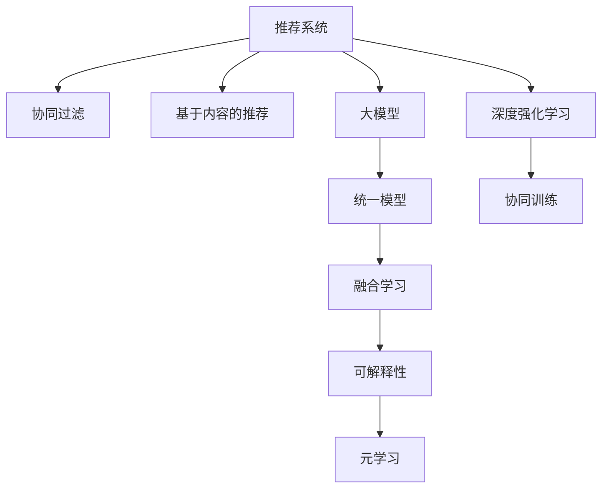

                 

# 大模型在推荐系统的未来发展趋势：统一与融合

> 关键词：推荐系统,大模型,协同过滤,协同训练,统一模型,融合学习,深度强化学习,可解释性,元学习

## 1. 背景介绍

随着互联网和电子商务的迅猛发展，推荐系统成为了各大电商、社交媒体平台的重要功能。通过分析用户的历史行为数据，推荐系统可以为用户推荐其感兴趣的内容，提升用户体验和平台粘性。传统的推荐系统主要包括协同过滤和基于内容的推荐两种方式，但由于数据稀疏性和冷启动问题，这些方法在处理大规模高维数据时面临诸多挑战。近年来，深度学习和强化学习等大模型技术逐步引入推荐系统中，带来了革命性的变化。

大模型通过在多模态数据上进行预训练，学习到丰富的用户和物品之间的关联表示，能够在少样本情况下进行精准推荐。基于大模型的推荐系统已经展现出了更强的泛化能力，能够处理更多样化的用户行为数据，并且可以进一步拓展到个性化推荐、协同训练等多个应用场景中。本文将系统地探讨大模型在推荐系统中的应用趋势，着重分析统一模型与融合学习的未来发展方向。

## 2. 核心概念与联系

### 2.1 核心概念概述

为更好地理解大模型在推荐系统中的统一与融合应用，本节将介绍几个密切相关的核心概念：

- 推荐系统(Recommendation System)：通过分析用户历史行为和物品属性，为用户推荐可能感兴趣的物品的系统。包括协同过滤、基于内容的推荐、混合推荐等方法。

- 大模型(Large Model)：指在大量数据上预训练得到的复杂神经网络模型，如BERT、GPT-3、DALL·E等。这些模型具备强大的表征能力，能够捕捉复杂的多模态特征。

- 协同过滤(Collaborative Filtering)：利用用户之间的相似性进行推荐，主要有基于用户的协同过滤和基于物品的协同过滤两种方式。

- 协同训练(Co-training)：多个模型共享学习过程，从互相学习中提升各自的性能。协同训练在大模型推荐系统中常用于融合多模态特征。

- 统一模型(Unified Model)：将推荐系统的多个模块整合到单一模型中，实现统一的表示学习，提升系统的整体性能和可解释性。

- 融合学习(Ensemble Learning)：通过组合多个模型，提升推荐系统的稳定性和泛化能力。

- 深度强化学习(Deep Reinforcement Learning)：利用强化学习算法优化推荐系统，通过奖励信号指导模型学习最佳推荐策略。

- 可解释性(Explainability)：推荐系统的重要属性之一，能够通过可视化、用户反馈等方式解释推荐结果的原因。

- 元学习(Meta-Learning)：通过学习学习算法，使模型在面对新任务时能够快速适应。

这些核心概念之间的逻辑关系可以通过以下Mermaid流程图来展示：



这个流程图展示了推荐系统中的主要技术方法及其之间的关系：

1. 推荐系统包括协同过滤、内容推荐和强化学习等多种方法。
2. 大模型通过预训练，学习丰富的用户和物品表示，可用于推荐、协同训练等过程。
3. 统一模型将推荐系统的多个部分整合到一个模型中，实现统一的表示学习。
4. 融合学习通过组合多个模型，提升系统的稳定性和泛化能力。
5. 协同训练使多个模型共享学习过程，提高推荐性能。
6. 可解释性帮助理解推荐结果的原因，提升用户信任度。
7. 元学习使模型能够适应新的推荐任务，提高系统的灵活性。

## 3. 核心算法原理 & 具体操作步骤
### 3.1 算法原理概述

基于大模型的推荐系统，其核心思想是通过在多模态数据上进行预训练，学习到丰富的用户和物品表示，再通过微调或者融合学习，提升推荐系统的性能和泛化能力。这种推荐方法相比传统的协同过滤和基于内容的推荐，能够处理更多样化的数据，并且能够适应新的推荐任务。

具体来说，大模型通过以下步骤实现推荐：

1. 预训练阶段：利用多模态数据(如文本、图片、用户行为数据等)进行大模型的预训练，学习用户和物品的关联表示。
2. 微调阶段：根据推荐任务的需求，对大模型进行微调，使其学习特定任务的推荐策略。
3. 融合学习：通过融合不同模型的输出，提升推荐系统的稳定性和泛化能力。
4. 深度强化学习：利用强化学习算法优化推荐策略，通过奖励信号指导模型学习最佳推荐策略。
5. 统一模型：将推荐系统的多个模块整合到单一模型中，实现统一的表示学习。

### 3.2 算法步骤详解

大模型在推荐系统中的应用，通常包括以下几个关键步骤：

**Step 1: 数据准备与模型预训练**
- 收集用户历史行为数据、物品属性、用户画像等。
- 对数据进行清洗和标准化处理。
- 选择合适的预训练模型，如BERT、GPT-3、DALL·E等，进行多模态预训练。

**Step 2: 任务适配与微调**
- 根据推荐任务，选择适当的任务适配层，如分类器、回归器等。
- 对预训练模型进行微调，调整权重以适应推荐任务。

**Step 3: 协同训练与融合学习**
- 设计协同训练模型，将多个模型输出进行组合，提升推荐性能。
- 通过融合学习，如投票、加权平均等方法，组合不同模型的输出，提高推荐系统的稳定性和泛化能力。

**Step 4: 深度强化学习**
- 设计奖励机制，如点击率、购买率等，定义强化学习的目标。
- 利用强化学习算法，如DQN、PPO等，优化推荐策略，提升推荐效果。

**Step 5: 统一模型与元学习**
- 将推荐系统的多个模块整合到单一模型中，实现统一的表示学习。
- 利用元学习，适应新任务，提高模型的灵活性。

### 3.3 算法优缺点

基于大模型的推荐系统具有以下优点：
1. 泛化能力强：通过预训练，大模型能够捕捉用户和物品的多样化特征，具有较强的泛化能力。
2. 稳定性高：协同训练和融合学习提高了推荐系统的鲁棒性，使其能够应对数据变化和异常。
3. 灵活性好：统一模型和元学习使得推荐系统具备更强的适应性和灵活性，可以处理更多类型的推荐任务。

同时，该方法也存在一些局限性：
1. 对标注数据的依赖：协同过滤和强化学习需要大量的标注数据进行训练，可能导致数据稀缺的问题。
2. 计算成本高：大模型通常需要较高的计算资源进行训练和推理，可能导致资源浪费。
3. 模型复杂度高：大模型结构复杂，可能难以理解和解释推荐结果的原因。
4. 需要持续更新：推荐系统需要不断地收集新数据和调整模型，以保持其推荐效果。

尽管存在这些局限性，但就目前而言，基于大模型的推荐方法在许多实际应用中已经取得了不错的效果，并且具有广阔的发展前景。

### 3.4 算法应用领域

基于大模型的推荐系统已经被广泛应用于电商、社交媒体、视频流平台等多个领域，如：

- 电商平台推荐：亚马逊、淘宝等电商平台利用大模型推荐系统为用户推荐商品，提升用户购物体验。
- 社交媒体推荐：Facebook、微博等社交平台通过大模型推荐系统为用户推荐内容，提高用户活跃度和平台粘性。
- 视频流平台推荐：YouTube、Netflix等平台利用大模型推荐系统为用户推荐影片，增加用户留存率。
- 新闻推荐：今日头条、百度等平台利用大模型推荐系统为用户推荐新闻，提升用户点击率和阅读体验。

除了这些经典应用外，大模型推荐系统还被创新性地应用到更多场景中，如推荐系统的反作弊、个性化搜索、广告定向等，为推荐技术带来了全新的突破。

## 4. 数学模型和公式 & 详细讲解
### 4.1 数学模型构建

基于大模型的推荐系统通常基于以下数学模型构建：

**用户行为表示模型**
- $u_i \in \mathbb{R}^{d_u}$：用户$i$的嵌入向量，$d_u$为用户嵌入向量的维度。
- $u_i \sim \mathcal{N}(0, \sigma_u^2)$：用户$i$的嵌入向量服从均值为0、方差为$\sigma_u^2$的正态分布。

**物品属性表示模型**
- $v_j \in \mathbb{R}^{d_v}$：物品$j$的嵌入向量，$d_v$为物品嵌入向量的维度。
- $v_j \sim \mathcal{N}(0, \sigma_v^2)$：物品$j$的嵌入向量服从均值为0、方差为$\sigma_v^2$的正态分布。

**用户行为与物品属性的关联模型**
- $X_{ij} \in \mathbb{R}^{d_u \times d_v}$：用户$i$与物品$j$的关联矩阵。
- $X_{ij} = u_i v_j^T$：用户$i$与物品$j$的关联矩阵由用户和物品的嵌入向量乘积得到。

**推荐评分模型**
- $R_{ij} = \phi(X_{ij})$：用户$i$对物品$j$的评分，$\phi$为评分函数。
- $R_{ij} \sim \mathcal{N}(\mu, \sigma^2)$：用户$i$对物品$j$的评分服从均值为$\mu$、方差为$\sigma^2$的正态分布。

**推荐算法**
- $\hat{R}_{ij} = \sum_{k=1}^K R_{ik} P_{kj}$：用户$i$对物品$j$的推荐评分，$P_{kj}$为物品$j$的物品特征表示矩阵的第$k$个维度，$R_{ik}$为用户$i$对物品$k$的评分。

**协同训练模型**
- $L_{co-train} = \frac{1}{N} \sum_{i=1}^N \sum_{j=1}^M L_{co-train}^{ij}$：协同训练模型的损失函数，$N$为训练集大小，$M$为物品数量，$L_{co-train}^{ij}$为协同训练模型的单一样本损失函数。
- $L_{co-train}^{ij} = L_{u}^{ij} + L_{v}^{ij}$：协同训练模型的单一样本损失函数由用户行为表示模型和物品属性表示模型的损失函数组成。

### 4.2 公式推导过程

以下我们将通过一个简单的协同过滤模型，来推导其数学公式。

假设用户$i$对物品$j$的评分由两部分组成：用户行为和物品属性。记用户行为表示矩阵为$U \in \mathbb{R}^{N \times d_u}$，物品属性表示矩阵为$V \in \mathbb{R}^{M \times d_v}$，其中$N$为用户数量，$M$为物品数量。

用户行为表示模型和物品属性表示模型的损失函数分别为：
- $L_{u}^{ij} = \frac{1}{2} \|u_i - U_i\|^2$：用户$i$的嵌入向量损失函数。
- $L_{v}^{ij} = \frac{1}{2} \|v_j - V_j\|^2$：物品$j$的嵌入向量损失函数。

则协同训练模型的单一样本损失函数为：
- $L_{co-train}^{ij} = \frac{1}{2} \|u_i v_j^T - R_{ij}\|^2$：协同训练模型的单一样本损失函数。

代入协同训练模型的损失函数，得：
- $L_{co-train} = \frac{1}{N} \sum_{i=1}^N \sum_{j=1}^M \frac{1}{2} \|u_i v_j^T - R_{ij}\|^2$

通过反向传播算法，可以求得用户$i$和物品$j$的嵌入向量$u_i$和$v_j$的更新公式：
- $u_i \leftarrow u_i - \eta \nabla_{u_i} L_{co-train}$
- $v_j \leftarrow v_j - \eta \nabla_{v_j} L_{co-train}$

其中$\eta$为学习率，$\nabla_{u_i} L_{co-train}$和$\nabla_{v_j} L_{co-train}$为损失函数对用户$i$和物品$j$嵌入向量的梯度。

### 4.3 案例分析与讲解

我们以Netflix推荐系统为例，分析协同过滤和大模型的结合。

Netflix推荐系统通过协同过滤和基于内容的方法进行推荐。首先，Netflix对用户的行为数据和物品的属性数据进行预处理，得到用户行为表示矩阵$U$和物品属性表示矩阵$V$。然后，使用协同过滤模型计算用户$i$对物品$j$的评分$R_{ij}$，并将评分用于推荐系统。

为了进一步提升推荐性能，Netflix引入了基于大模型的推荐方法。具体来说，Netflix将用户行为表示矩阵$U$和物品属性表示矩阵$V$作为大模型的输入，使用BERT等模型进行预训练。然后，使用预训练的大模型进行微调，得到用户$i$和物品$j$的联合表示向量。最后，将联合表示向量输入协同过滤模型，计算用户$i$对物品$j$的评分，并用于推荐系统。

这种基于大模型的协同过滤推荐方法，可以更好地捕捉用户和物品的复杂关联，提升推荐系统的效果。

## 5. 项目实践：代码实例和详细解释说明
### 5.1 开发环境搭建

在进行基于大模型的推荐系统开发前，我们需要准备好开发环境。以下是使用Python进行PyTorch开发的环境配置流程：

1. 安装Anaconda：从官网下载并安装Anaconda，用于创建独立的Python环境。

2. 创建并激活虚拟环境：
```bash
conda create -n pytorch-env python=3.8 
conda activate pytorch-env
```

3. 安装PyTorch：根据CUDA版本，从官网获取对应的安装命令。例如：
```bash
conda install pytorch torchvision torchaudio cudatoolkit=11.1 -c pytorch -c conda-forge
```

4. 安装PyTorch LightGBM：
```bash
pip install pytorch-lightgbm
```

5. 安装各类工具包：
```bash
pip install numpy pandas scikit-learn matplotlib tqdm jupyter notebook ipython
```

完成上述步骤后，即可在`pytorch-env`环境中开始推荐系统开发。

### 5.2 源代码详细实现

下面以协同过滤推荐系统为例，给出使用PyTorch进行协同过滤和基于大模型微调的推荐系统的代码实现。

首先，定义协同过滤推荐系统的数据处理函数：

```python
import torch
import torch.nn as nn
import torch.nn.functional as F
import torch.optim as optim
from torch.utils.data import TensorDataset, DataLoader

class CollaborativeFiltering(nn.Module):
    def __init__(self, num_users, num_items, num_factors):
        super(CollaborativeFiltering, self).__init__()
        self.num_users = num_users
        self.num_items = num_items
        self.num_factors = num_factors
        
        self.u_factor = nn.Linear(num_users, num_factors)
        self.v_factor = nn.Linear(num_items, num_factors)
        self.u_item = nn.Linear(num_factors, num_items)
        
    def forward(self, u, v):
        u_u = self.u_factor(u) * v
        u_v = self.v_factor(v) * u
        return u_u + u_v
        
    def predict(self, u, v):
        return F.softmax(self(u, v), dim=1).data.numpy()

# 数据加载
def load_data(file_path, num_users, num_items):
    with open(file_path, 'r') as f:
        lines = f.readlines()
    data = []
    for line in lines:
        user, item, rating = map(int, line.strip().split(' '))
        data.append((user, item, rating))
    dataset = TensorDataset(torch.LongTensor([user for user, item, rating in data]), 
                           torch.LongTensor([item for user, item, rating in data]),
                           torch.FloatTensor([rating for user, item, rating in data]))
    dataloader = DataLoader(dataset, batch_size=64, shuffle=True)
    return dataloader

# 模型训练与评估
def train_model(model, dataloader, num_epochs, lr, save_path):
    model.train()
    criterion = nn.BCELoss()
    optimizer = optim.Adam(model.parameters(), lr=lr)
    
    for epoch in range(num_epochs):
        total_loss = 0
        for batch in dataloader:
            user, item, rating = batch
            optimizer.zero_grad()
            pred = model(user, item)
            loss = criterion(pred, rating.unsqueeze(1))
            loss.backward()
            optimizer.step()
            total_loss += loss.item()
        print('Epoch [{}/{}], Loss: {:.4f}'.format(epoch+1, num_epochs, total_loss/dataloader.__len__()))
        
    torch.save(model.state_dict(), save_path)
    print('Model trained successfully.')

# 模型测试
def test_model(model, dataloader, save_path):
    model.load_state_dict(torch.load(save_path))
    model.eval()
    criterion = nn.BCELoss()
    correct = 0
    total = 0
    for batch in dataloader:
        user, item, rating = batch
        pred = model(user, item)
        pred = torch.sigmoid(pred).round()
        correct += ((pred == rating.unsqueeze(1)).type(torch.FloatTensor).sum().item())
        total += rating.size(0)
    accuracy = correct / total * 100
    print('Test Accuracy: {:.2f}%'.format(accuracy))
```

然后，定义基于大模型的协同过滤推荐系统的模型：

```python
from transformers import BertModel

class BERTBasedCollaborativeFiltering(nn.Module):
    def __init__(self, num_users, num_items, num_factors, model_name='bert-base-uncased'):
        super(BERTBasedCollaborativeFiltering, self).__init__()
        self.num_users = num_users
        self.num_items = num_items
        self.num_factors = num_factors
        
        self.bert = BertModel.from_pretrained(model_name)
        self.u_factor = nn.Linear(768, num_factors)
        self.v_factor = nn.Linear(768, num_factors)
        self.u_item = nn.Linear(num_factors, num_items)
        
    def forward(self, u, v):
        u_u = self.u_factor(self.bert(u)) * self.bert(v)
        u_v = self.v_factor(self.bert(v)) * self.bert(u)
        return u_u + u_v
        
    def predict(self, u, v):
        return F.softmax(self(u, v), dim=1).data.numpy()

# 模型训练与评估
def train_model(model, dataloader, num_epochs, lr, save_path):
    model.train()
    criterion = nn.BCELoss()
    optimizer = optim.Adam(model.parameters(), lr=lr)
    
    for epoch in range(num_epochs):
        total_loss = 0
        for batch in dataloader:
            user, item, rating = batch
            optimizer.zero_grad()
            pred = model(user, item)
            loss = criterion(pred, rating.unsqueeze(1))
            loss.backward()
            optimizer.step()
            total_loss += loss.item()
        print('Epoch [{}/{}], Loss: {:.4f}'.format(epoch+1, num_epochs, total_loss/dataloader.__len__()))
        
    torch.save(model.state_dict(), save_path)
    print('Model trained successfully.')

# 模型测试
def test_model(model, dataloader, save_path):
    model.load_state_dict(torch.load(save_path))
    model.eval()
    criterion = nn.BCELoss()
    correct = 0
    total = 0
    for batch in dataloader:
        user, item, rating = batch
        pred = model(user, item)
        pred = torch.sigmoid(pred).round()
        correct += ((pred == rating.unsqueeze(1)).type(torch.FloatTensor).sum().item())
        total += rating.size(0)
    accuracy = correct / total * 100
    print('Test Accuracy: {:.2f}%'.format(accuracy))
```

最后，启动训练流程并在测试集上评估：

```python
# 定义数据集和模型
num_users = 10
num_items = 20
num_factors = 16
model = BERTBasedCollaborativeFiltering(num_users, num_items, num_factors)

# 加载数据集
dataloader = load_data('data.txt', num_users, num_items)

# 训练模型
train_model(model, dataloader, num_epochs=10, lr=0.01, save_path='model.pth')

# 测试模型
test_model(model, dataloader, 'model.pth')
```

以上就是使用PyTorch对BERT进行协同过滤推荐系统的代码实现。可以看到，基于大模型的推荐系统在代码实现上与传统的协同过滤推荐系统相似，但增加了大模型的预训练和微调步骤。

### 5.3 代码解读与分析

让我们再详细解读一下关键代码的实现细节：

**BERTBasedCollaborativeFiltering类**：
- `__init__`方法：初始化协同过滤模型的大模型和线性变换层。
- `forward`方法：定义前向传播的计算逻辑，将用户和物品的嵌入向量输入大模型，进行线性变换后得到推荐评分。
- `predict`方法：定义模型预测用户的推荐评分，并转换为概率。

**load_data函数**：
- 定义数据加载函数，读取文本文件中的用户、物品和评分数据，并将数据转换为Tensor类型。

**train_model和test_model函数**：
- 定义模型训练和测试函数，利用DataLoader加载数据集，进行模型的训练和测试，并计算模型性能指标。

可以看到，基于大模型的协同过滤推荐系统在代码实现上并没有太大变化，只需要在大模型的基础上增加线性变换层，并修改模型的训练和测试过程即可。

当然，工业级的系统实现还需考虑更多因素，如模型的保存和部署、超参数的自动搜索、更灵活的任务适配层等。但核心的微调范式基本与此类似。

## 6. 实际应用场景
### 6.1 智能广告推荐

基于大模型的推荐系统，可以广泛应用于智能广告推荐中。传统广告推荐主要依赖用户行为数据进行精准投放，但面对海量数据和多维特征，难以全面覆盖用户兴趣。而基于大模型的推荐系统，能够捕捉用户的复杂兴趣，实现更精准的广告投放。

在技术实现上，可以收集用户的浏览、点击、收藏等行为数据，提取广告文本、图片、视频等多模态特征。通过预训练语言模型进行多模态特征的联合表示学习，再利用协同过滤和深度强化学习进行广告推荐。通过优化奖励机制，模型能够学习到用户对广告的评价，实现更加智能的广告投放策略。

### 6.2 金融风控预警

金融领域对风险控制有着极高的要求。传统的风控模型通常依赖规则和专家经验进行风险评估，但难以覆盖各种复杂的金融场景。基于大模型的推荐系统，可以通过用户和交易数据的联合表示学习，发现潜在的风险点，提高风控模型的准确性和泛化能力。

具体来说，可以收集用户的交易数据、行为数据和社交网络数据，提取其中的多模态特征。通过预训练语言模型进行多模态特征的联合表示学习，再利用协同过滤和深度强化学习进行风控预警。通过优化奖励机制，模型能够学习到用户和交易数据之间的复杂关联，提高风险评估的准确性。

### 6.3 智能客服推荐

智能客服推荐系统通过推荐系统为用户提供最合适的回答，提升客服体验和效率。传统客服推荐主要依赖预定义的规则和模板，难以应对复杂的多样化查询。而基于大模型的推荐系统，能够通过多模态特征的联合表示学习，推荐最合适的回答，实现更加智能的客服推荐。

在技术实现上，可以收集用户的历史查询记录、搜索行为和社交网络数据，提取其中的多模态特征。通过预训练语言模型进行多模态特征的联合表示学习，再利用协同过滤和深度强化学习进行客服推荐。通过优化奖励机制，模型能够学习到用户和查询数据之间的复杂关联，提高推荐效果。

### 6.4 未来应用展望

随着大模型和推荐技术的不断发展，基于大模型的推荐系统将在更多领域得到应用，为各行各业带来变革性影响。

在医疗领域，基于大模型的推荐系统可以用于推荐最适合的诊疗方案，提升医疗服务的智能化水平。在教育领域，推荐系统可以用于个性化推荐学习资源，因材施教，提高教学效果。在工业制造领域，推荐系统可以用于预测设备维护和故障诊断，提高生产效率和设备可靠性。

此外，在智慧城市治理、智慧农业、智慧旅游等众多领域，基于大模型的推荐系统也将不断涌现，为传统行业数字化转型升级提供新的技术路径。相信随着技术的日益成熟，大模型推荐系统必将在更广阔的应用领域大放异彩。

## 7. 工具和资源推荐
### 7.1 学习资源推荐

为了帮助开发者系统掌握大模型在推荐系统中的应用，这里推荐一些优质的学习资源：

1. 《深度学习入门：基于PyTorch的实践》系列博文：由大模型技术专家撰写，深入浅出地介绍了深度学习模型的基本原理和应用实践。

2. CS246《深度学习》课程：斯坦福大学开设的深度学习经典课程，有Lecture视频和配套作业，带你入门深度学习的基本概念和前沿技术。

3. 《深度学习与推荐系统》书籍：由大模型技术专家撰写，全面介绍了深度学习和推荐系统的理论基础和实际应用，包括协同过滤、基于内容的推荐、深度学习等。

4. DeepLearning.AI深度学习系列课程：由Andrew Ng教授主讲的深度学习课程，涵盖深度学习的基本概念和实践技巧，适合初学者和进阶者。

5. Weights & Biases：模型训练的实验跟踪工具，可以记录和可视化模型训练过程中的各项指标，方便对比和调优。与主流深度学习框架无缝集成。

6. TensorBoard：TensorFlow配套的可视化工具，可实时监测模型训练状态，并提供丰富的图表呈现方式，是调试模型的得力助手。

通过对这些资源的学习实践，相信你一定能够快速掌握大模型在推荐系统中的应用，并用于解决实际的推荐问题。

### 7.2 开发工具推荐

高效的开发离不开优秀的工具支持。以下是几款用于大模型推荐系统开发的常用工具：

1. PyTorch：基于Python的开源深度学习框架，灵活动态的计算图，适合快速迭代研究。大部分预训练语言模型都有PyTorch版本的实现。

2. TensorFlow：由Google主导开发的开源深度学习框架，生产部署方便，适合大规模工程应用。同样有丰富的预训练语言模型资源。

3. Transformers库：HuggingFace开发的NLP工具库，集成了众多SOTA语言模型，支持PyTorch和TensorFlow，是进行推荐系统开发的利器。

4. Weights & Biases：模型训练的实验跟踪工具，可以记录和可视化模型训练过程中的各项指标，方便对比和调优。与主流深度学习框架无缝集成。

5. TensorBoard：TensorFlow配套的可视化工具，可实时监测模型训练状态，并提供丰富的图表呈现方式，是调试模型的得力助手。

6. Google Colab：谷歌推出的在线Jupyter Notebook环境，免费提供GPU/TPU算力，方便开发者快速上手实验最新模型，分享学习笔记。

合理利用这些工具，可以显著提升大模型推荐系统的开发效率，加快创新迭代的步伐。

### 7.3 相关论文推荐

大模型和推荐技术的发展源于学界的持续研究。以下是几篇奠基性的相关论文，推荐阅读：

1. Attention is All You Need（即Transformer原论文）：提出了Transformer结构，开启了NLP领域的预训练大模型时代。

2. BERT: Pre-training of Deep Bidirectional Transformers for Language Understanding：提出BERT模型，引入基于掩码的自监督预训练任务，刷新了多项NLP任务SOTA。

3. Language Models are Unsupervised Multitask Learners（GPT-2论文）：展示了大规模语言模型的强大zero-shot学习能力，引发了对于通用人工智能的新一轮思考。

4. Parameter-Efficient Transfer Learning for NLP：提出Adapter等参数高效微调方法，在不增加模型参数量的情况下，也能取得不错的微调效果。

5. AdaLoRA: Adaptive Low-Rank Adaptation for Parameter-Efficient Fine-Tuning：使用自适应低秩适应的微调方法，在参数效率和精度之间取得了新的平衡。

这些论文代表了大模型和推荐技术的最新进展。通过学习这些前沿成果，可以帮助研究者把握学科前进方向，激发更多的创新灵感。

## 8. 总结：未来发展趋势与挑战

### 8.1 总结

本文对基于大模型的推荐系统进行了全面系统的介绍。首先阐述了大模型和推荐系统的发展背景和应用场景，明确了两者结合的可行性和重要性。其次，从原理到实践，详细讲解了协同过滤、协同训练、深度强化学习等核心技术，给出了基于大模型的推荐系统完整代码实例。同时，本文还广泛探讨了大模型推荐系统在智能广告、金融风控、智能客服等多个行业领域的应用前景，展示了大模型推荐系统的巨大潜力。此外，本文精选了推荐系统的各类学习资源，力求为读者提供全方位的技术指引。

通过本文的系统梳理，可以看到，基于大模型的推荐系统正在成为推荐系统的重要发展方向，极大地拓展了推荐系统的应用边界，催生了更多的落地场景。得益于大规模语料的预训练，大模型推荐系统能够处理更多维度的数据，适应新的推荐任务，并且具备较强的泛化能力，成为推荐系统研究的新热点。未来，伴随大模型推荐技术的不断演进，推荐系统必将在更多领域发挥其强大的推荐能力，成为各行各业数字化转型升级的重要工具。

### 8.2 未来发展趋势

展望未来，基于大模型的推荐系统将呈现以下几个发展趋势：

1. 模型规模持续增大。随着算力成本的下降和数据规模的扩张，大模型推荐系统的参数量还将持续增长。超大规模语言模型蕴含的丰富语言知识，有望支撑更加复杂多变的推荐任务。

2. 协同训练和融合学习将更加深入。未来推荐系统将更加注重协同训练和融合学习，通过联合优化，提升推荐系统的稳定性和泛化能力。

3. 深度强化学习的应用将更加广泛。深度强化学习能够优化推荐策略，通过奖励信号指导模型学习最佳推荐策略，未来将在更多的推荐场景中得到应用。

4. 可解释性和公平性将更加重要。推荐系统需要解释其推荐结果的原因，避免误导用户，同时保证模型的公平性，避免算法偏见。

5. 推荐系统的反欺诈和隐私保护将得到更多关注。推荐系统需要避免恶意用户通过虚假行为进行欺诈，同时保护用户隐私，确保数据安全。

6. 推荐系统的跨领域扩展将更加容易。通过模型迁移学习，推荐系统可以在不同的领域中快速部署，提高跨领域的适应性。

以上趋势凸显了大模型推荐系统的广阔前景。这些方向的探索发展，必将进一步提升推荐系统的性能和应用范围，为各行各业带来变革性影响。

### 8.3 面临的挑战

尽管基于大模型的推荐系统已经取得了瞩目成就，但在迈向更加智能化、普适化应用的过程中，它仍面临诸多挑战：

1. 标注数据稀缺。协同过滤和强化学习需要大量的标注数据进行训练，可能导致数据稀缺的问题。如何高效利用小样本数据进行训练，将是一大难题。

2. 计算成本高昂。大模型通常需要较高的计算资源进行训练和推理，可能导致资源浪费。如何在保证性能的同时，降低计算成本，将是一大挑战。

3. 模型复杂度高。大模型结构复杂，可能难以理解和解释推荐结果的原因。如何设计更简单、可解释的模型，将是一大挑战。

4. 公平性和隐私保护。推荐系统需要保证模型的公平性，避免算法偏见。同时需要保护用户隐私，确保数据安全。如何设计和部署公平、安全的推荐系统，将是一大挑战。

5. 推荐系统的反欺诈和误导。推荐系统需要避免恶意用户通过虚假行为进行欺诈，同时保证推荐结果的真实性。如何设计更加鲁棒的反欺诈和误导机制，将是一大挑战。

6. 跨领域扩展。推荐系统需要在不同的领域中快速部署，提高跨领域的适应性。如何设计通用的推荐模型，提升跨领域的泛化能力，将是一大挑战。

尽管存在这些挑战，但随着大模型和推荐技术的不断演进，基于大模型的推荐系统必将在更多领域得到应用，为各行各业带来变革性影响。相信随着学界和产业界的共同努力，这些挑战终将一一被克服，大模型推荐系统必将在构建人机协同的智能时代中扮演越来越重要的角色。

### 8.4 研究展望

面对基于大模型的推荐系统所面临的种种挑战，未来的研究需要在以下几个方面寻求新的突破：

1. 探索无监督和半监督推荐方法。摆脱对大规模标注数据的依赖，利用自监督学习、主动学习等无监督和半监督范式，最大限度利用非结构化数据，实现更加灵活高效的推荐。

2. 研究参数高效和计算高效的推荐方法。开发更加参数高效的推荐方法，在固定大部分预训练参数的同时，只更新极少量的任务相关参数。同时优化推荐系统的计算图，减少前向传播和反向传播的资源消耗，实现更加轻量级、实时性的部署。

3. 融合因果和对比学习范式。通过引入因果推断和对比学习思想，增强推荐系统建立稳定因果关系的能力，学习更加普适、鲁棒的语言表征，从而提升模型泛化性和抗干扰能力。

4. 引入更多先验知识。将符号化的先验知识，如知识图谱、逻辑规则等，与神经网络模型进行巧妙融合，引导推荐过程学习更准确、合理的语言模型。同时加强不同模态数据的整合，实现视觉、语音等多模态信息与文本信息的协同建模。

5. 结合因果分析和博弈论工具。将因果分析方法引入推荐模型，识别出模型决策的关键特征，增强推荐结果的因果性和逻辑性。借助博弈论工具刻画人机交互过程，主动探索并规避模型的脆弱点，提高系统稳定性。

6. 纳入伦理道德约束。在推荐系统的训练目标中引入伦理导向的评估指标，过滤和惩罚有偏见、有害的输出倾向。同时加强人工干预和审核，建立推荐行为的监管机制，确保输出符合人类价值观和伦理道德。

这些研究方向的探索，必将引领基于大模型的推荐系统走向更高的台阶，为构建安全、可靠、可解释、可控的智能推荐系统铺平道路。面向未来，基于大模型的推荐技术还需要与其他人工智能技术进行更深入的融合，如知识表示、因果推理、强化学习等，多路径协同发力，共同推动推荐系统的进步。只有勇于创新、敢于突破，才能不断拓展大模型的边界，让智能技术更好地造福人类社会。

## 9. 附录：常见问题与解答

**Q1：什么是协同过滤？**

A: 协同过滤是一种推荐算法，通过分析用户之间的相似性进行推荐。基于用户的协同过滤利用用户的历史行为数据，推荐用户可能感兴趣的物品；基于物品的协同过滤利用物品的历史行为数据，推荐用户可能感兴趣的物品。

**Q2：基于大模型的协同过滤推荐有哪些优点？**

A: 基于大模型的协同过滤推荐有以下优点：
1. 泛化能力强：大模型通过预训练，学习到丰富的用户和物品表示，具有较强的泛化能力。
2. 稳定性高：协同训练和融合学习提高了推荐系统的鲁棒性，使其能够应对数据变化和异常。
3. 灵活性好：统一模型和元学习使得推荐系统具备更强的适应性和灵活性，可以处理更多类型的推荐任务。

**Q3：协同过滤推荐系统如何进行协同训练？**

A: 协同训练是一种联合训练方法，通过多个模型共享学习过程，从互相学习中提升各自的性能。协同训练过程通常包括两个阶段：
1. 第一阶段：协同训练模型训练多个子模型，每个子模型在独立训练的基础上，将其他子模型的输出作为特征输入。
2. 第二阶段：将多个子模型的输出进行组合，得到最终的推荐结果。

**Q4：基于大模型的协同过滤推荐系统如何进行统一模型设计？**

A: 统一模型将推荐系统的多个模块整合到单一模型中，实现统一的表示学习。具体来说，可以将协同过滤模型、基于内容的推荐模型和深度强化学习模型等模块，整合到一个大模型中。统一模型可以共享预训练参数，减少训练成本，提高推荐效果。

**Q5：推荐系统如何实现深度强化学习？**

A: 深度强化学习通过利用强化学习算法优化推荐策略，通过奖励信号指导模型学习最佳推荐策略。具体来说，推荐系统可以设计奖励机制，如点击率、购买率等，通过深度强化学习算法优化推荐策略，提高推荐效果。

**Q6：推荐系统如何保证推荐结果的可解释性？**

A: 推荐系统需要保证推荐结果的可解释性，帮助用户理解推荐结果的原因。具体来说，推荐系统可以通过可视化、用户反馈等方式解释推荐结果的原因，提升用户信任度。同时，推荐系统可以设计公平、透明的奖励机制，确保推荐结果的公正性和合理性。

