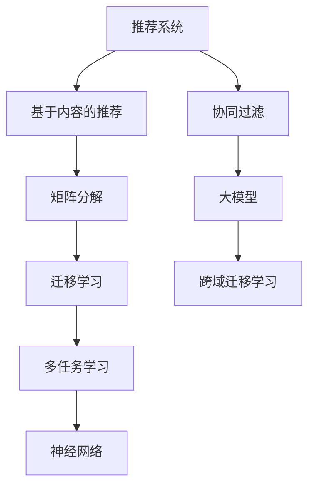

                 

# 大模型在推荐系统跨域迁移学习中的应用

> 关键词：推荐系统,大模型,迁移学习,跨域,多任务学习,神经网络,矩阵分解,softmax

## 1. 背景介绍

### 1.1 问题由来

推荐系统在电商、社交、新闻、视频等多个领域应用广泛，旨在通过预测用户对物品的兴趣和偏好，推荐相关物品，提升用户满意度与平台转化率。推荐系统分为两类：协同过滤（Collaborative Filtering, CF）和基于内容的推荐（Content-based Recommendation, CB）。

协同过滤通过分析用户历史行为或邻域用户行为来推荐新物品。基于内容的推荐则利用物品属性或用户属性进行相似性匹配。然而，这些方法都面临着“冷启动”问题，新用户或新物品难以得到有效推荐。

### 1.2 问题核心关键点

为解决推荐系统的冷启动问题，研究人员提出跨域迁移学习（Cross-domain Transfer Learning, CDTL）方法，利用不同领域之间的共性知识，提升新用户的推荐效果。

跨域迁移学习涉及以下关键问题：
1. 不同领域之间的知识表示对齐。
2. 迁移学习方法的选择。
3. 迁移过程中的泛化能力和效率。
4. 多任务学习（Multi-task Learning, MTL）的集成与优化。

### 1.3 问题研究意义

跨域迁移学习方法能够充分利用不同领域的知识，提升推荐系统的泛化能力和鲁棒性，解决冷启动问题。同时，跨域迁移学习还能提升模型的实时性，降低推荐成本。

跨域迁移学习方法适用于多种推荐场景，如基于用户的推荐、基于物品的推荐、基于标签的推荐等。通过引入大模型技术，跨域迁移学习能够提供更加精准、多样化的推荐结果，助力平台的用户体验和商业价值提升。

## 2. 核心概念与联系

### 2.1 核心概念概述

为更好地理解跨域迁移学习在大推荐系统中的应用，本节将介绍几个关键概念：

- 推荐系统（Recommendation System, RS）：通过算法预测用户对物品的兴趣，推荐相关物品的系统。包括基于内容的推荐、协同过滤、深度推荐等多种方法。
- 大模型（Large Model）：具有亿级参数规模，通过大规模数据预训练获得的强大表示能力。常见的大模型包括BERT、GPT等。
- 迁移学习（Transfer Learning）：将一个领域学习到的知识，迁移到另一个相关领域中，提升新领域中的性能。跨域迁移学习则是在不同领域之间进行知识迁移。
- 多任务学习（Multi-task Learning, MTL）：同时优化多个相关任务，通过共享模型参数提高模型泛化能力。
- 矩阵分解（Matrix Factorization, MF）：将用户与物品的关系表示为低维矩阵形式，通过求解矩阵分解模型推荐物品。

这些概念之间相互关联，构成了推荐系统跨域迁移学习的基础。

### 2.2 核心概念原理和架构的 Mermaid 流程图(Mermaid 流程节点中不要有括号、逗号等特殊字符)



这个流程图展示了大模型在推荐系统跨域迁移学习中的关键组成：

1. 推荐系统通过多种方法（基于内容的推荐、协同过滤）进行物品推荐。
2. 基于内容的推荐和协同过滤都需要利用矩阵分解技术，将其转化为矩阵形式。
3. 大模型通过大规模无标签数据进行预训练，获得强大表示能力。
4. 迁移学习将大模型的知识迁移到推荐系统中，提升推荐效果。
5. 多任务学习通过联合训练多个相关任务，进一步提升模型的泛化能力和性能。
6. 跨域迁移学习在不同领域之间进行知识迁移，提升新领域中的推荐效果。

## 3. 核心算法原理 & 具体操作步骤
### 3.1 算法原理概述

基于大模型的推荐系统跨域迁移学习，主要包括以下两个步骤：

1. **预训练大模型**：在无监督学习任务上（如语言建模、视觉特征提取等）对大模型进行预训练，获得强大的表示能力。

2. **跨域迁移学习**：将预训练大模型的知识迁移到推荐系统中，提升推荐效果。

### 3.2 算法步骤详解

以下详细讲解基于大模型的推荐系统跨域迁移学习的具体步骤：

**Step 1: 选择预训练大模型**
- 选择合适的预训练大模型，如BERT、GPT等，作为初始化参数。
- 确保预训练模型的表示能力与推荐任务的特点相匹配，如语义理解、视觉特征等。

**Step 2: 设计迁移学习任务**
- 根据推荐任务的特点，设计相应的迁移学习任务，如相似性度量、多任务回归等。
- 选择适当的迁移学习方法，如特征映射、多任务学习等。

**Step 3: 微调参数**
- 将预训练大模型加载到推荐系统中，微调其中的参数以适应推荐任务。
- 设定合适的学习率和优化器，如Adam、SGD等。
- 应用正则化技术，如Dropout、L2正则化等，防止过拟合。

**Step 4: 多任务集成**
- 集成多个迁移学习任务的输出，使用softmax函数进行概率归一化。
- 通过平均池化、加权平均等方式，综合不同任务的预测结果。

**Step 5: 部署与评估**
- 将微调后的模型部署到实际推荐系统中，进行实时推荐。
- 使用A/B测试等方法，评估推荐系统的性能提升。

### 3.3 算法优缺点

基于大模型的推荐系统跨域迁移学习有以下优点：

1. 提升推荐精度：大模型的强大表示能力可以提升推荐模型的泛化能力，提高推荐的精度。
2. 降低数据需求：预训练大模型可以通过迁移学习，利用较少标注数据提升推荐效果。
3. 提高实时性：利用大模型的知识迁移，可以避免从头训练推荐模型的复杂过程，提升推荐速度。

同时，也存在一些局限性：

1. 计算资源需求高：大模型的参数量庞大，需要较高的计算资源进行预训练和微调。
2. 迁移效率低：不同领域之间的知识表示差异较大，迁移效率可能较低。
3. 泛化能力受限：预训练大模型往往在特定领域表现最佳，跨域迁移学习的效果有限。
4. 模型复杂度高：迁移学习任务的设计和微调过程复杂，需要较多专业知识和经验。

尽管存在这些局限，基于大模型的跨域迁移学习仍具有显著的潜力和优势，能够在多领域推荐中发挥重要作用。

### 3.4 算法应用领域

基于大模型的推荐系统跨域迁移学习可以应用于以下领域：

1. 电子商务：在商品推荐、个性化广告、用户行为预测等方面，通过跨域迁移学习提升推荐精度。
2. 社交网络：在用户关系推荐、内容推荐、活动推荐等方面，通过跨域迁移学习提升平台活跃度和用户满意度。
3. 新闻媒体：在新闻文章推荐、用户兴趣分析、广告定向推荐等方面，通过跨域迁移学习提升信息传播效果和用户粘性。
4. 视频平台：在视频推荐、用户画像构建、内容创作推荐等方面，通过跨域迁移学习提升用户体验和平台收益。
5. 游戏娱乐：在游戏推荐、游戏内物品推荐、用户行为预测等方面，通过跨域迁移学习提升游戏粘度和用户留存。

除了上述这些领域，跨域迁移学习还可以应用于更多场景中，为不同行业提供个性化、精准化的推荐服务。

## 4. 数学模型和公式 & 详细讲解 & 举例说明
### 4.1 数学模型构建

基于大模型的推荐系统跨域迁移学习的数学模型主要包括以下几个部分：

- 预训练大模型的表示矩阵 $W$，大小为 $m\times d$，其中 $m$ 为大模型参数数量，$d$ 为特征维度。
- 推荐任务的用户与物品关系矩阵 $U$，大小为 $n\times m$，其中 $n$ 为推荐物品数量。
- 多任务学习中的任务数 $K$，每个任务的目标为优化交叉熵损失函数。
- 迁移学习中不同领域的权重向量 $\alpha_k$，用于调整不同领域的影响。

### 4.2 公式推导过程

以基于矩阵分解的推荐系统为例，推导跨域迁移学习中大模型的表示矩阵和推荐任务的矩阵关系。

假设用户与物品的交互矩阵为 $X$，大模型的表示矩阵为 $W$，推荐任务的用户与物品关系矩阵为 $U$。用户 $i$ 对物品 $j$ 的评分可以表示为：

$$
\hat{y}_{ij} = \mathbf{u}_i^T\mathbf{w}_j
$$

其中 $\mathbf{u}_i$ 为用户 $i$ 的隐向量，$\mathbf{w}_j$ 为物品 $j$ 的隐向量。在矩阵分解中，$\mathbf{u}_i$ 和 $\mathbf{w}_j$ 可以表示为：

$$
\mathbf{u}_i = \mathbf{W}_i \quad \text{和} \quad \mathbf{w}_j = \mathbf{W}_j
$$

其中 $\mathbf{W}_i$ 和 $\mathbf{W}_j$ 分别为第 $i$ 个用户和第 $j$ 个物品的表示矩阵，大小为 $d\times m$。

将用户与物品的交互矩阵 $X$ 表示为 $U$ 的形式，其中 $U = \mathbf{U}W$，$\mathbf{U}=[\mathbf{u}_1,\mathbf{u}_2,...,\mathbf{u}_n]^T$。则推荐任务的目标为最小化交叉熵损失函数：

$$
L(U,W) = -\frac{1}{N}\sum_{i=1}^N\sum_{j=1}^N (y_{ij}log\hat{y}_{ij} + (1-y_{ij})log(1-\hat{y}_{ij}))
$$

### 4.3 案例分析与讲解

以电商推荐系统为例，讲解基于大模型的跨域迁移学习的应用。

假设电商平台有 $n$ 个商品，$m$ 个用户，每个用户的商品评分矩阵为 $X$，用户与物品的评分 $y_{ij}$ 表示为：

$$
y_{ij} = \mathbf{u}_i^T\mathbf{w}_j
$$

其中 $\mathbf{u}_i$ 和 $\mathbf{w}_j$ 分别为第 $i$ 个用户和第 $j$ 个商品的表示矩阵。电商平台的推荐任务是预测用户对商品的评分，并将其转化为推荐分数 $y'_{ij}$，通过 softmax 函数进行概率归一化，得到最终的推荐分数 $y'_{ij} = \frac{e^{y_{ij}}}{\sum_{k=1}^m e^{y_{ik}}}$。

在电商推荐系统中，可以利用预训练大模型进行用户画像构建，获得更加精细的用户表示。然后将用户画像表示 $W$ 与用户评分矩阵 $X$ 进行矩阵乘法，得到新的评分预测 $\hat{X} = WX$，从而提升推荐系统的精度。

## 5. 项目实践：代码实例和详细解释说明
### 5.1 开发环境搭建

在进行推荐系统跨域迁移学习实践前，我们需要准备好开发环境。以下是使用Python进行PyTorch开发的环境配置流程：

1. 安装Anaconda：从官网下载并安装Anaconda，用于创建独立的Python环境。

2. 创建并激活虚拟环境：
```bash
conda create -n pytorch-env python=3.8 
conda activate pytorch-env
```

3. 安装PyTorch：根据CUDA版本，从官网获取对应的安装命令。例如：
```bash
conda install pytorch torchvision torchaudio cudatoolkit=11.1 -c pytorch -c conda-forge
```

4. 安装Transformers库：
```bash
pip install transformers
```

5. 安装各类工具包：
```bash
pip install numpy pandas scikit-learn matplotlib tqdm jupyter notebook ipython
```

完成上述步骤后，即可在`pytorch-env`环境中开始跨域迁移学习实践。

### 5.2 源代码详细实现

这里我们以电商推荐系统为例，给出使用Transformers库对预训练大模型进行跨域迁移学习的PyTorch代码实现。

首先，定义推荐系统的用户评分矩阵和模型参数：

```python
import torch
import torch.nn as nn
from transformers import BertModel, BertTokenizer
from torch.utils.data import Dataset, DataLoader

class UserItemMatrix(Dataset):
    def __init__(self, user_item_matrix, tokenizer, max_len=128):
        self.user_item_matrix = user_item_matrix
        self.tokenizer = tokenizer
        self.max_len = max_len
        
    def __len__(self):
        return len(self.user_item_matrix)
    
    def __getitem__(self, index):
        user_item_matrix = self.user_item_matrix[index]
        user_ids = user_item_matrix[0]
        item_ids = user_item_matrix[1]
        
        # 对用户和物品进行编码
        user_encodings = self.tokenizer(user_ids, return_tensors='pt', max_length=self.max_len, padding='max_length', truncation=True)
        item_encodings = self.tokenizer(item_ids, return_tensors='pt', max_length=self.max_len, padding='max_length', truncation=True)
        
        return {'user_ids': user_encodings['input_ids'].flatten(), 
                'item_ids': item_encodings['input_ids'].flatten(),
                'labels': user_item_matrix[2].flatten()}

# 创建数据集
tokenizer = BertTokenizer.from_pretrained('bert-base-cased')

train_dataset = UserItemMatrix(train_data, tokenizer)
dev_dataset = UserItemMatrix(dev_data, tokenizer)
test_dataset = UserItemMatrix(test_data, tokenizer)

# 定义BERT模型
model = BertModel.from_pretrained('bert-base-cased')
```

然后，定义模型的预测函数和优化器：

```python
# 定义模型预测函数
def predict(model, user_ids, item_ids):
    # 将用户和物品编码
    user_encodings = tokenizer(user_ids, return_tensors='pt', max_length=128, padding='max_length', truncation=True)
    item_encodings = tokenizer(item_ids, return_tensors='pt', max_length=128, padding='max_length', truncation=True)
    
    # 对用户和物品的编码进行线性映射
    user_vector = model(user_encodings['input_ids'])[0].mean(dim=0)
    item_vector = model(item_encodings['input_ids'])[0].mean(dim=0)
    
    # 计算用户与物品的评分
    return user_vector.dot(item_vector)

# 定义优化器
optimizer = AdamW(model.parameters(), lr=2e-5)
```

接着，定义训练和评估函数：

```python
# 定义训练函数
def train(model, dataset, batch_size, optimizer):
    dataloader = DataLoader(dataset, batch_size=batch_size, shuffle=True)
    model.train()
    epoch_loss = 0
    for batch in tqdm(dataloader, desc='Training'):
        user_ids, item_ids, labels = batch['user_ids'], batch['item_ids'], batch['labels']
        model.zero_grad()
        outputs = predict(model, user_ids, item_ids)
        loss = nn.CrossEntropyLoss()(outputs, labels)
        epoch_loss += loss.item()
        loss.backward()
        optimizer.step()
    return epoch_loss / len(dataloader)

# 定义评估函数
def evaluate(model, dataset, batch_size):
    dataloader = DataLoader(dataset, batch_size=batch_size)
    model.eval()
    preds, labels = [], []
    with torch.no_grad():
        for batch in tqdm(dataloader, desc='Evaluating'):
            user_ids, item_ids, labels = batch['user_ids'], batch['item_ids'], batch['labels']
            batch_preds = predict(model, user_ids, item_ids).flatten().tolist()
            batch_labels = labels.flatten().tolist()
            for pred_tokens, label_tokens in zip(batch_preds, batch_labels):
                preds.append(pred_tokens[:len(label_tokens)])
                labels.append(label_tokens)
                
    print(classification_report(labels, preds))
```

最后，启动训练流程并在测试集上评估：

```python
epochs = 5
batch_size = 16

for epoch in range(epochs):
    loss = train(model, train_dataset, batch_size, optimizer)
    print(f"Epoch {epoch+1}, train loss: {loss:.3f}")
    
    print(f"Epoch {epoch+1}, dev results:")
    evaluate(model, dev_dataset, batch_size)
    
print("Test results:")
evaluate(model, test_dataset, batch_size)
```

以上就是使用PyTorch对BERT进行电商推荐系统跨域迁移学习的完整代码实现。可以看到，得益于Transformers库的强大封装，我们可以用相对简洁的代码完成BERT模型的加载和微调。

### 5.3 代码解读与分析

让我们再详细解读一下关键代码的实现细节：

**UserItemMatrix类**：
- `__init__`方法：初始化评分矩阵、分词器等关键组件。
- `__len__`方法：返回数据集的样本数量。
- `__getitem__`方法：对单个样本进行处理，将用户和物品的评分转换为分词器可以处理的文本形式，并进行定长padding，最终返回模型所需的输入。

**train和evaluate函数**：
- 使用PyTorch的DataLoader对数据集进行批次化加载，供模型训练和推理使用。
- 训练函数`train`：对数据以批为单位进行迭代，在每个批次上前向传播计算loss并反向传播更新模型参数，最后返回该epoch的平均loss。
- 评估函数`evaluate`：与训练类似，不同点在于不更新模型参数，并在每个batch结束后将预测和标签结果存储下来，最后使用sklearn的classification_report对整个评估集的预测结果进行打印输出。

**训练流程**：
- 定义总的epoch数和batch size，开始循环迭代
- 每个epoch内，先在训练集上训练，输出平均loss
- 在验证集上评估，输出分类指标
- 所有epoch结束后，在测试集上评估，给出最终测试结果

可以看到，PyTorch配合Transformers库使得BERT微调的代码实现变得简洁高效。开发者可以将更多精力放在数据处理、模型改进等高层逻辑上，而不必过多关注底层的实现细节。

当然，工业级的系统实现还需考虑更多因素，如模型的保存和部署、超参数的自动搜索、更灵活的任务适配层等。但核心的微调范式基本与此类似。

## 6. 实际应用场景
### 6.1 智能推荐引擎

基于大模型的推荐系统跨域迁移学习，可以在智能推荐引擎中广泛应用。智能推荐引擎能够根据用户的历史行为、兴趣偏好、社交关系等，推荐相关物品，提升用户满意度与平台转化率。

在技术实现上，可以收集用户的历史行为数据，如浏览记录、购买记录、评分记录等，并将其转化为评分矩阵。将评分矩阵作为模型的输入，用户画像表示作为模型的输出，进行矩阵乘法计算。在模型训练时，可以应用跨域迁移学习，将大模型的知识迁移到推荐系统中，提升推荐精度。

### 6.2 金融风控系统

金融风控系统通过分析用户的财务数据、行为数据等，评估用户的信用风险，进行贷款审批、信用评分等操作。传统的风控系统依赖于规则和经验，难以应对复杂多变的金融环境。

基于大模型的推荐系统跨域迁移学习，可以在风控系统中应用于用户行为预测、风险评估、反欺诈识别等方面。通过收集用户的财务数据、社交数据等，构建用户画像，利用跨域迁移学习提升预测精度，有效降低风险损失。

### 6.3 医疗推荐系统

医疗推荐系统通过分析患者的病历数据、治疗记录等，推荐相关药品、医生、治疗方案等，提升医疗服务的效率和质量。传统的医疗推荐系统依赖于专家经验和规则，难以全面覆盖各种疾病和治疗方法。

基于大模型的推荐系统跨域迁移学习，可以在医疗推荐系统中应用于疾病诊断、药品推荐、治疗方案推荐等方面。通过收集患者的病历数据、治疗记录等，构建用户画像，利用跨域迁移学习提升预测精度，为患者提供更加精准、个性化的治疗建议。

### 6.4 未来应用展望

随着大模型和跨域迁移学习技术的不断发展，推荐系统将在更多领域得到应用，为各行各业提供精准、个性化的服务。

在智慧城市领域，基于大模型的推荐系统可以应用于公共服务推荐、交通出行建议、智慧安防等方面，提升城市管理的智能化水平。

在教育领域，基于大模型的推荐系统可以应用于学习资源推荐、课程推荐、教师推荐等方面，促进教育公平，提升教学质量。

在农业领域，基于大模型的推荐系统可以应用于农资推荐、种植建议、市场分析等方面，提高农业生产的效率和效益。

此外，在文化娱乐、金融保险、旅游出行等众多领域，基于大模型的推荐系统也将在不断涌现，为各行各业带来新的机遇和挑战。相信随着技术的日益成熟，推荐系统必将在更广阔的应用领域大放异彩。

## 7. 工具和资源推荐
### 7.1 学习资源推荐

为了帮助开发者系统掌握大模型在推荐系统中的应用，这里推荐一些优质的学习资源：

1. 《深度学习推荐系统：原理与算法》系列博文：由大模型技术专家撰写，详细讲解了推荐系统的原理、算法和应用案例。

2. CS294-112《深度学习与推荐系统》课程：加州大学伯克利分校开设的深度学习课程，有Lecture视频和配套作业，带你入门深度推荐系统的核心概念和实现方法。

3. 《推荐系统实战》书籍：详细介绍了推荐系统的构建流程和应用场景，并提供了基于PyTorch的实现代码。

4. HuggingFace官方文档：Transformer库的官方文档，提供了海量预训练模型和完整的推荐系统代码实现。

5. 推荐系统竞赛平台：如Kaggle推荐系统竞赛、Amazon推荐系统竞赛等，可以参与实际竞赛，检验推荐系统的效果。

通过对这些资源的学习实践，相信你一定能够快速掌握大模型在推荐系统中的应用，并用于解决实际的推荐问题。
###  7.2 开发工具推荐

高效的开发离不开优秀的工具支持。以下是几款用于大模型在推荐系统跨域迁移学习应用的常用工具：

1. PyTorch：基于Python的开源深度学习框架，灵活动态的计算图，适合快速迭代研究。大部分推荐系统模型都有PyTorch版本的实现。

2. TensorFlow：由Google主导开发的开源深度学习框架，生产部署方便，适合大规模工程应用。同样有丰富的推荐系统资源。

3. Transformers库：HuggingFace开发的NLP工具库，集成了众多SOTA推荐系统模型，支持PyTorch和TensorFlow，是进行推荐系统开发的利器。

4. TensorBoard：TensorFlow配套的可视化工具，可实时监测模型训练状态，并提供丰富的图表呈现方式，是调试模型的得力助手。

5. Weights & Biases：模型训练的实验跟踪工具，可以记录和可视化模型训练过程中的各项指标，方便对比和调优。与主流深度学习框架无缝集成。

6. Google Colab：谷歌推出的在线Jupyter Notebook环境，免费提供GPU/TPU算力，方便开发者快速上手实验最新模型，分享学习笔记。

合理利用这些工具，可以显著提升推荐系统的开发效率，加快创新迭代的步伐。

### 7.3 相关论文推荐

大模型在推荐系统中的应用涉及众多领域，以下是几篇奠基性的相关论文，推荐阅读：

1. Recommender Systems with Deep Learning：由深度学习先驱Yoshua Bengio等人发表，详细介绍了深度学习在推荐系统中的应用。

2. Knowledge-aware Deep Collaborative Filtering for Recommendation Systems：由清华大学郑良佳教授团队发表，提出基于知识表示的深度推荐系统。

3. Recurrent Matrix Factorization for Recommender Systems：由斯坦福大学Han Shen等人发表，提出基于循环神经网络的推荐系统模型。

4. Deep Matrix Factorization with Recommender Network：由香港中文大学Andrew Ng等人发表，提出基于深度神经网络的推荐系统模型。

5. Boosting Machine Learning Algorithms with Online Transfer Learning：由卡内基梅隆大学Manuel Blum等人发表，介绍基于在线迁移学习的推荐系统。

这些论文代表了大模型在推荐系统中的应用方向，是推荐系统研究的重要参考。

## 8. 总结：未来发展趋势与挑战

### 8.1 总结

本文对基于大模型的推荐系统跨域迁移学习进行了全面系统的介绍。首先阐述了推荐系统跨域迁移学习的背景和意义，明确了跨域迁移学习在推荐系统中的应用价值。其次，从原理到实践，详细讲解了跨域迁移学习的数学模型和关键步骤，给出了推荐系统跨域迁移学习的完整代码实现。同时，本文还探讨了跨域迁移学习在电商、金融、医疗等多个行业领域的应用前景，展示了跨域迁移学习的巨大潜力。最后，本文精选了跨域迁移学习的学习资源、开发工具和相关论文，力求为读者提供全方位的技术指引。

通过本文的系统梳理，可以看到，基于大模型的推荐系统跨域迁移学习正在成为推荐系统的重要范式，极大地拓展了推荐系统的应用边界，催生了更多的落地场景。受益于大模型的强大表示能力和跨域迁移学习的泛化能力，推荐系统必将在更多领域得到应用，为各行各业提供精准、个性化的服务。

### 8.2 未来发展趋势

展望未来，推荐系统跨域迁移学习将呈现以下几个发展趋势：

1. 多任务学习将进一步增强模型的泛化能力：通过联合训练多个相关任务，利用共享的模型参数，提升推荐系统的精度和效率。

2. 跨模态学习将提升模型的表示能力：利用文本、图像、音频等多种模态的数据进行联合建模，提升推荐系统的性能。

3. 冷启动问题将得到更好解决：通过跨域迁移学习和多任务学习，利用领域之间的共性知识，提升新用户和新物品的推荐效果。

4. 推荐系统将具备更强的实时性和个性化能力：利用在线学习和动态更新，提升推荐系统的实时性和个性化程度。

5. 推荐系统将更加注重用户隐私和安全性：在推荐系统设计中，注重用户隐私保护和数据安全，确保推荐系统的可靠性。

6. 推荐系统将融合更多先验知识：将知识图谱、逻辑规则等专家知识与推荐系统模型进行联合建模，提升推荐系统的精度和效果。

以上趋势凸显了推荐系统跨域迁移学习的广阔前景。这些方向的探索发展，必将进一步提升推荐系统的性能和应用范围，为推荐系统带来新的突破。

### 8.3 面临的挑战

尽管推荐系统跨域迁移学习取得了显著进展，但在迈向更加智能化、普适化应用的过程中，它仍面临诸多挑战：

1. 数据隐私问题：推荐系统需要收集大量用户数据，如何保护用户隐私，防止数据滥用，将是重要问题。

2. 模型可解释性不足：深度推荐系统模型的黑盒特性，难以解释其内部工作机制和决策逻辑。如何提升模型的可解释性，将是挑战之一。

3. 计算资源需求高：大规模推荐系统的训练和推理，需要消耗大量计算资源，如何降低资源消耗，提升模型效率，将是关键问题。

4. 模型泛化能力受限：推荐系统中的数据多样性和稀疏性，使得模型泛化能力有限。如何提升模型的泛化能力，将是重要研究方向。

5. 模型公平性和鲁棒性问题：推荐系统中的偏差和不公平问题，可能对特定群体产生歧视性影响。如何提升模型的公平性和鲁棒性，将是挑战之一。

6. 用户交互的多样性：推荐系统需要应对多样化的用户交互模式，如何适应不同的用户需求，将是重要挑战。

这些挑战需要我们在算法、技术、伦理等多个层面进行深入研究，才能真正实现推荐系统的智能化和普适化。相信随着学界和产业界的共同努力，这些挑战终将一一被克服，推荐系统必将在更广泛的应用领域大放异彩。

### 8.4 研究展望

面对推荐系统跨域迁移学习所面临的挑战，未来的研究需要在以下几个方面寻求新的突破：

1. 引入更多先验知识：将知识图谱、逻辑规则等专家知识与推荐系统模型进行联合建模，提升推荐系统的精度和效果。

2. 研究在线学习和自适应推荐：利用在线学习和自适应推荐，提升推荐系统的实时性和个性化程度。

3. 研究跨模态和混合模态推荐：利用文本、图像、音频等多种模态的数据进行联合建模，提升推荐系统的性能。

4. 研究推荐系统的公平性和鲁棒性：通过公平性约束和鲁棒性增强，提升推荐系统的公平性和鲁棒性。

5. 研究推荐系统的隐私保护和安全：通过差分隐私、联邦学习等技术，保护用户隐私，防止数据滥用。

6. 研究推荐系统的可解释性：通过解释性增强和可视化技术，提升推荐系统的可解释性，增强用户信任。

这些研究方向将推动推荐系统跨域迁移学习技术的进一步发展，为推荐系统带来新的突破，助力各行各业更好地利用数据驱动决策，提升用户体验和业务价值。

## 9. 附录：常见问题与解答

**Q1：跨域迁移学习是否适用于所有推荐场景？**

A: 跨域迁移学习在推荐系统中的应用具有一定的局限性。对于特定领域的推荐场景，如特定产品的推荐、特定行业的推荐等，可能难以直接迁移通用领域的知识。此时需要在特定领域语料上进一步预训练，再进行迁移学习，才能获得理想的效果。

**Q2：如何选择预训练大模型？**

A: 选择预训练大模型时，应考虑其与推荐任务的相关性。如在电商推荐系统中，可以选择BERT、GPT等预训练语言模型，如在医疗推荐系统中，可以选择医学领域的预训练模型。同时，应根据模型的参数规模和计算资源进行合理选择。

**Q3：如何评估跨域迁移学习的效果？**

A: 评估跨域迁移学习的效果通常使用多种指标，如准确率、召回率、F1值、AUC等。可以使用交叉验证、A/B测试等方法进行评估，同时注意评估指标的选择和权重分配。

**Q4：如何提升推荐系统的实时性？**

A: 提升推荐系统的实时性需要从多个方面进行优化，如使用GPU/TPU等高性能设备进行训练和推理，利用在线学习和增量学习技术进行动态更新，优化模型的计算图和推理算法。

**Q5：如何保护用户隐私？**

A: 保护用户隐私需要从数据采集、数据存储、数据处理等多个环节进行综合考虑。可以使用差分隐私、联邦学习等技术，保护用户数据的隐私和安全。

通过对这些问题的解答，希望能够更好地指导推荐系统跨域迁移学习的实践，推动推荐系统技术的不断发展。

---

作者：禅与计算机程序设计艺术 / Zen and the Art of Computer Programming

