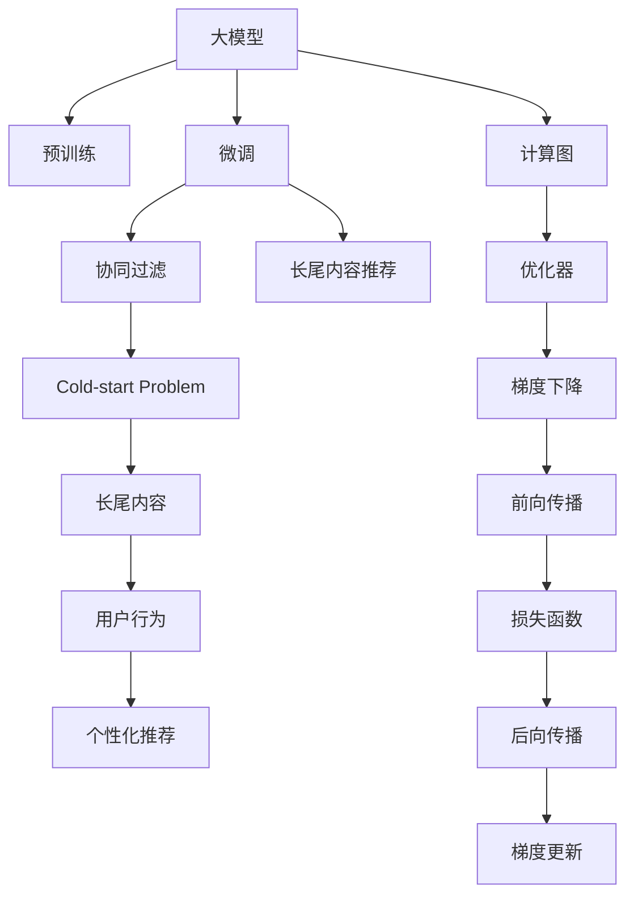

                 

# 大模型在推荐系统长尾内容推荐中的作用

> 关键词：大模型,长尾内容推荐,协同过滤,冷启动,个性化推荐,内容召回,计算图

## 1. 背景介绍

在现代互联网应用中，推荐系统被广泛使用，广泛应用于电商、新闻、视频、社交等众多领域，显著提升了用户体验和业务价值。然而，随着平台用户基数和内容数量的不断增长，传统推荐算法面临“长尾内容推荐”这一严峻挑战。长尾内容通常指那些相对冷门、小众、且需求稀少的物品，由于用户数量和曝光度较低，这些物品难以被传统推荐算法发现和推荐，导致用户需求得不到满足，平台内容分发效率低。

长尾内容推荐的关键在于如何在有限的曝光机会中，高效识别和匹配用户需求。大模型作为当下最先进的自然语言处理技术，提供了对大规模语料进行预训练、微调和推理的能力，可以深度挖掘长尾内容的语义特征，实现精准匹配和推荐。

## 2. 核心概念与联系

### 2.1 核心概念概述

为更好地理解大模型在推荐系统中的应用，本节将介绍几个密切相关的核心概念：

- 大模型(Large Model)：指以Transformer等架构为代表的大规模预训练语言模型，如GPT、BERT、T5等。通过在大规模无标签文本语料上进行预训练，学习通用的语言表示，具备强大的语言理解和生成能力。

- 预训练(Pre-training)：指在大规模无标签文本语料上，通过自监督学习任务训练通用语言模型的过程。常见的预训练任务包括掩码语言模型、下一句预测等。

- 微调(Fine-tuning)：指在预训练模型的基础上，使用下游任务的少量标注数据，通过有监督学习优化模型在特定任务上的性能。

- 协同过滤(Collaborative Filtering)：通过分析用户和物品之间的互动关系，预测用户对物品的兴趣或物品的受欢迎程度，推荐相似物品给用户或相似用户。

- 冷启动问题(Cold-start Problem)：新用户或新物品在平台初期没有足够的历史数据，传统协同过滤算法难以进行有效的推荐。

- 长尾内容推荐(Long-Tail Content Recommendation)：在推荐系统中，如何高效识别和推荐那些相对冷门、需求稀少的物品，以实现内容的全覆盖和用户的精准匹配。

- 计算图(Computation Graph)：深度学习模型中，前向传播和反向传播的过程可以看作一个有向无环图，称为计算图。计算图是优化模型计算过程的基础。

这些核心概念之间的逻辑关系可以通过以下Mermaid流程图来展示：



这个流程图展示了大模型推荐系统的核心概念及其之间的关系：

1. 大模型通过预训练获得基础能力。
2. 微调优化模型以适应特定任务，如协同过滤。
3. 协同过滤预测用户兴趣和物品受欢迎程度，实现个性化推荐。
4. 长尾内容推荐通过优化算法，提高模型对小众物品的识别能力。
5. 计算图优化模型的计算过程，提高推理效率。
6. 优化器通过梯度下降等算法，调整模型参数。

这些概念共同构成了大模型在推荐系统中的应用框架，使得推荐系统能够高效识别和推荐长尾内容，提升用户体验和平台价值。

## 3. 核心算法原理 & 具体操作步骤
### 3.1 算法原理概述

大模型在推荐系统中的应用，主要分为两个关键步骤：预训练和微调。预训练过程通过自监督学习任务，在大规模无标签文本数据上学习通用的语言表示，为后续微调提供强大的特征提取能力。微调过程则通过有监督学习任务，在大模型预训练权重的基础上，进一步优化模型以适应推荐系统的特定需求。

在微调过程中，我们通常使用下游推荐任务的标注数据，对大模型的顶层或部分层进行优化，以获得对长尾内容的识别能力。微调的核心思想是通过有标签数据对模型进行参数更新，使得模型在推荐任务上的表现接近真实标签。

### 3.2 算法步骤详解

基于大模型的推荐系统微调过程一般包括以下几个关键步骤：

**Step 1: 准备预训练模型和数据集**
- 选择合适的预训练语言模型 $M_{\theta}$ 作为初始化参数，如 BERT、GPT等。
- 准备推荐任务 $T$ 的标注数据集 $D=\{(u_i, i_i)\}_{i=1}^N$，其中 $u_i$ 表示用户，$i_i$ 表示物品。
- 将数据集划分为训练集、验证集和测试集。

**Step 2: 设计推荐目标函数**
- 根据推荐任务类型，设计合适的推荐目标函数。如对于点击率预测任务，目标函数为 $f(u_i, i_i) = \text{sigmoid}(M_{\theta}(u_i \| i_i))$，其中 $M_{\theta}(u_i \| i_i)$ 表示模型对物品 $i_i$ 推荐给用户 $u_i$ 的概率。
- 定义损失函数，如均方误差损失、交叉熵损失等。

**Step 3: 选择微调策略**
- 确定微调的层级和参数更新方式，如只微调顶层，或仅更新部分权重。
- 设置微调学习率、批量大小、迭代次数等超参数。

**Step 4: 执行微调训练**
- 将训练集数据分批次输入模型，前向传播计算损失函数。
- 反向传播计算参数梯度，根据设定的优化算法更新模型参数。
- 周期性在验证集上评估模型性能，根据性能指标决定是否触发 Early Stopping。
- 重复上述步骤直到满足预设的迭代轮数或 Early Stopping 条件。

**Step 5: 部署和优化**
- 在测试集上评估微调后模型 $M_{\hat{\theta}}$ 的性能。
- 将微调后的模型部署到推荐系统中，进行实时推荐。
- 根据系统运行情况和用户反馈，持续优化模型和推荐策略。

### 3.3 算法优缺点

基于大模型的推荐系统微调方法具有以下优点：

- 高效识别长尾内容。大模型在大规模文本数据上预训练，具备强大的语义表示能力，能够识别和推荐那些传统推荐算法难以覆盖的长尾内容。
- 提高推荐精度。微调过程可以针对推荐任务进行优化，提升模型在特定场景下的预测精度。
- 降低冷启动问题。通过在大模型预训练权重基础上微调，可以解决新用户和物品的推荐问题。

同时，该方法也存在一些局限性：

- 需要大量标注数据。微调过程依赖于有标签数据，标注数据集的大小和质量直接影响微调效果。
- 计算资源消耗大。大模型的规模庞大，微调过程对计算资源和内存需求较高，需要高性能计算设备支持。
- 数据隐私风险。推荐系统需要大量用户行为数据，数据隐私和安全性问题需谨慎处理。
- 模型泛化能力有待提升。微调模型面对新场景和新物品时，泛化能力有限，仍需进一步优化。

尽管存在这些局限性，但就目前而言，基于大模型的推荐系统微调方法在长尾内容推荐中仍是最有效的方案之一。未来相关研究的重点在于如何进一步降低微调对标注数据的依赖，提高模型泛化能力，同时兼顾用户隐私和数据安全。

### 3.4 算法应用领域

基于大模型的推荐系统微调方法已经广泛应用于电商、新闻、视频、社交等多个领域，特别是在长尾内容推荐方面取得了显著成效。以下是几个典型的应用场景：

**电商推荐**
- 电商平台的商品种类繁多，用户对一些长尾商品的兴趣可能较低，通过微调模型可以更精准地识别并推荐这些商品。
- 例如，用户浏览过一件T恤，可以通过微调模型预测其对类似风格的其他商品感兴趣，实现精准推荐。

**新闻推荐**
- 新闻平台上的内容多样，用户对一些冷门或小众新闻的兴趣难以把握。
- 通过微调模型，系统可以识别用户对特定主题或分类的新闻兴趣，提供个性化阅读建议。

**视频推荐**
- 视频内容的海量性使得个性化推荐尤为重要，如何高效发现长尾视频内容是关键。
- 微调模型可以通过用户观看历史和行为数据，推荐用户未浏览但可能感兴趣的视频内容，提高用户粘性。

**社交推荐**
- 社交平台上的内容更注重个性化和时效性，用户兴趣更难预测。
- 通过微调模型，系统可以识别用户对特定好友或话题的兴趣，推荐相关内容，提升社交互动体验。

## 4. 数学模型和公式 & 详细讲解  
### 4.1 数学模型构建

本节将使用数学语言对基于大模型的推荐系统微调过程进行更加严格的刻画。

记推荐系统模型为 $M_{\theta}:\mathcal{U} \times \mathcal{I} \rightarrow [0,1]$，其中 $\mathcal{U}$ 为用户集合，$\mathcal{I}$ 为物品集合。假设推荐任务的目标函数为 $f(u_i, i_i)$，则推荐系统模型的损失函数为：

$$
\mathcal{L}(\theta) = \frac{1}{N}\sum_{i=1}^N \ell(f(u_i, i_i), y_i)
$$

其中 $\ell$ 为损失函数，$y_i$ 为真实标签。

微调的目标是最小化损失函数 $\mathcal{L}(\theta)$，即找到最优参数：

$$
\theta^* = \mathop{\arg\min}_{\theta} \mathcal{L}(\theta)
$$

在实践中，我们通常使用基于梯度的优化算法（如SGD、Adam等）来近似求解上述最优化问题。设 $\eta$ 为学习率，$\lambda$ 为正则化系数，则参数的更新公式为：

$$
\theta \leftarrow \theta - \eta \nabla_{\theta}\mathcal{L}(\theta) - \eta\lambda\theta
$$

其中 $\nabla_{\theta}\mathcal{L}(\theta)$ 为损失函数对参数 $\theta$ 的梯度，可通过反向传播算法高效计算。

### 4.2 公式推导过程

以下我们以点击率预测任务为例，推导损失函数及其梯度的计算公式。

假设模型 $M_{\theta}$ 在输入 $(u_i, i_i)$ 上的输出为 $\hat{p}=M_{\theta}(u_i \| i_i) \in [0,1]$，表示物品 $i_i$ 推荐给用户 $u_i$ 的概率。真实标签 $y_i \in \{0,1\}$。则二分类交叉熵损失函数定义为：

$$
\ell(f(u_i, i_i), y_i) = -[y_i\log f(u_i, i_i) + (1-y_i)\log (1-f(u_i, i_i))]
$$

将其代入经验风险公式，得：

$$
\mathcal{L}(\theta) = -\frac{1}{N}\sum_{i=1}^N [y_i\log M_{\theta}(u_i \| i_i)+(1-y_i)\log(1-M_{\theta}(u_i \| i_i))]
$$

根据链式法则，损失函数对参数 $\theta_k$ 的梯度为：

$$
\frac{\partial \mathcal{L}(\theta)}{\partial \theta_k} = -\frac{1}{N}\sum_{i=1}^N (\frac{y_i}{M_{\theta}(u_i \| i_i)}-\frac{1-y_i}{1-M_{\theta}(u_i \| i_i)}) \frac{\partial M_{\theta}(u_i \| i_i)}{\partial \theta_k}
$$

其中 $\frac{\partial M_{\theta}(u_i \| i_i)}{\partial \theta_k}$ 可进一步递归展开，利用自动微分技术完成计算。

在得到损失函数的梯度后，即可带入参数更新公式，完成模型的迭代优化。重复上述过程直至收敛，最终得到适应推荐任务的最优模型参数 $\theta^*$。

## 5. 项目实践：代码实例和详细解释说明
### 5.1 开发环境搭建

在进行微调实践前，我们需要准备好开发环境。以下是使用Python进行PyTorch开发的环境配置流程：

1. 安装Anaconda：从官网下载并安装Anaconda，用于创建独立的Python环境。

2. 创建并激活虚拟环境：
```bash
conda create -n pytorch-env python=3.8 
conda activate pytorch-env
```

3. 安装PyTorch：根据CUDA版本，从官网获取对应的安装命令。例如：
```bash
conda install pytorch torchvision torchaudio cudatoolkit=11.1 -c pytorch -c conda-forge
```

4. 安装Transformers库：
```bash
pip install transformers
```

5. 安装各类工具包：
```bash
pip install numpy pandas scikit-learn matplotlib tqdm jupyter notebook ipython
```

完成上述步骤后，即可在`pytorch-env`环境中开始微调实践。

### 5.2 源代码详细实现

下面我们以电商商品推荐任务为例，给出使用Transformers库对BERT模型进行微调的PyTorch代码实现。

首先，定义推荐任务的数据处理函数：

```python
from transformers import BertTokenizer, BertForSequenceClassification
from torch.utils.data import Dataset
import torch

class RecommenderDataset(Dataset):
    def __init__(self, texts, labels, tokenizer, max_len=128):
        self.texts = texts
        self.labels = labels
        self.tokenizer = tokenizer
        self.max_len = max_len
        
    def __len__(self):
        return len(self.texts)
    
    def __getitem__(self, item):
        text = self.texts[item]
        label = self.labels[item]
        
        encoding = self.tokenizer(text, return_tensors='pt', max_length=self.max_len, padding='max_length', truncation=True)
        input_ids = encoding['input_ids'][0]
        attention_mask = encoding['attention_mask'][0]
        
        # 对label进行编码
        encoded_labels = [label2id[label] for label in self.labels] 
        encoded_labels.extend([label2id['O']] * (self.max_len - len(encoded_labels)))
        labels = torch.tensor(encoded_labels, dtype=torch.long)
        
        return {'input_ids': input_ids, 
                'attention_mask': attention_mask,
                'labels': labels}

# 标签与id的映射
label2id = {'O': 0, 'B-ITEM': 1, 'I-ITEM': 2}
id2label = {v: k for k, v in label2id.items()}

# 创建dataset
tokenizer = BertTokenizer.from_pretrained('bert-base-cased')

train_dataset = RecommenderDataset(train_texts, train_labels, tokenizer)
dev_dataset = RecommenderDataset(dev_texts, dev_labels, tokenizer)
test_dataset = RecommenderDataset(test_texts, test_labels, tokenizer)
```

然后，定义模型和优化器：

```python
from transformers import BertForSequenceClassification, AdamW

model = BertForSequenceClassification.from_pretrained('bert-base-cased', num_labels=len(label2id))

optimizer = AdamW(model.parameters(), lr=2e-5)
```

接着，定义训练和评估函数：

```python
from torch.utils.data import DataLoader
from tqdm import tqdm
from sklearn.metrics import classification_report

device = torch.device('cuda') if torch.cuda.is_available() else torch.device('cpu')
model.to(device)

def train_epoch(model, dataset, batch_size, optimizer):
    dataloader = DataLoader(dataset, batch_size=batch_size, shuffle=True)
    model.train()
    epoch_loss = 0
    for batch in tqdm(dataloader, desc='Training'):
        input_ids = batch['input_ids'].to(device)
        attention_mask = batch['attention_mask'].to(device)
        labels = batch['labels'].to(device)
        model.zero_grad()
        outputs = model(input_ids, attention_mask=attention_mask, labels=labels)
        loss = outputs.loss
        epoch_loss += loss.item()
        loss.backward()
        optimizer.step()
    return epoch_loss / len(dataloader)

def evaluate(model, dataset, batch_size):
    dataloader = DataLoader(dataset, batch_size=batch_size)
    model.eval()
    preds, labels = [], []
    with torch.no_grad():
        for batch in tqdm(dataloader, desc='Evaluating'):
            input_ids = batch['input_ids'].to(device)
            attention_mask = batch['attention_mask'].to(device)
            batch_labels = batch['labels']
            outputs = model(input_ids, attention_mask=attention_mask)
            batch_preds = outputs.logits.argmax(dim=2).to('cpu').tolist()
            batch_labels = batch_labels.to('cpu').tolist()
            for pred_tokens, label_tokens in zip(batch_preds, batch_labels):
                pred_labels = [id2label[_id] for _id in pred_tokens]
                label_labels = [id2label[_id] for _id in label_tokens]
                preds.append(pred_labels[:len(label_labels)])
                labels.append(label_labels)
                
    print(classification_report(labels, preds))
```

最后，启动训练流程并在测试集上评估：

```python
epochs = 5
batch_size = 16

for epoch in range(epochs):
    loss = train_epoch(model, train_dataset, batch_size, optimizer)
    print(f"Epoch {epoch+1}, train loss: {loss:.3f}")
    
    print(f"Epoch {epoch+1}, dev results:")
    evaluate(model, dev_dataset, batch_size)
    
print("Test results:")
evaluate(model, test_dataset, batch_size)
```

以上就是使用PyTorch对BERT进行电商商品推荐任务微调的完整代码实现。可以看到，得益于Transformers库的强大封装，我们可以用相对简洁的代码完成BERT模型的加载和微调。

### 5.3 代码解读与分析

让我们再详细解读一下关键代码的实现细节：

**RecommenderDataset类**：
- `__init__`方法：初始化文本、标签、分词器等关键组件。
- `__len__`方法：返回数据集的样本数量。
- `__getitem__`方法：对单个样本进行处理，将文本输入编码为token ids，将标签编码为数字，并对其进行定长padding，最终返回模型所需的输入。

**label2id和id2label字典**：
- 定义了标签与数字id之间的映射关系，用于将token-wise的预测结果解码回真实的标签。

**训练和评估函数**：
- 使用PyTorch的DataLoader对数据集进行批次化加载，供模型训练和推理使用。
- 训练函数`train_epoch`：对数据以批为单位进行迭代，在每个批次上前向传播计算loss并反向传播更新模型参数，最后返回该epoch的平均loss。
- 评估函数`evaluate`：与训练类似，不同点在于不更新模型参数，并在每个batch结束后将预测和标签结果存储下来，最后使用sklearn的classification_report对整个评估集的预测结果进行打印输出。

**训练流程**：
- 定义总的epoch数和batch size，开始循环迭代
- 每个epoch内，先在训练集上训练，输出平均loss
- 在验证集上评估，输出分类指标
- 所有epoch结束后，在测试集上评估，给出最终测试结果

可以看到，PyTorch配合Transformers库使得BERT微调的代码实现变得简洁高效。开发者可以将更多精力放在数据处理、模型改进等高层逻辑上，而不必过多关注底层的实现细节。

当然，工业级的系统实现还需考虑更多因素，如模型的保存和部署、超参数的自动搜索、更灵活的任务适配层等。但核心的微调范式基本与此类似。

## 6. 实际应用场景
### 6.1 电商推荐

基于大模型微调的推荐系统在电商领域得到了广泛应用。电商平台的商品种类繁多，用户对一些长尾商品的兴趣可能较低，通过微调模型可以更精准地识别并推荐这些商品。

在技术实现上，可以收集用户浏览、点击、购买等行为数据，提取和商品描述、标签等文本内容。将文本内容作为模型输入，用户的后续行为（如是否点击、购买等）作为监督信号，在此基础上微调预训练语言模型。微调后的模型能够从文本内容中准确把握用户的兴趣点，在生成推荐列表时，先用候选商品的描述作为输入，由模型预测用户的兴趣匹配度，再结合其他特征综合排序，便可以得到个性化程度更高的推荐结果。

### 6.2 新闻推荐

新闻平台上的内容多样，用户对一些冷门或小众新闻的兴趣难以把握。通过微调模型，系统可以识别用户对特定主题或分类的新闻兴趣，提供个性化阅读建议。

在技术实现上，可以收集用户的历史阅读记录和行为数据，提取和新闻标题、摘要等文本内容。将文本内容作为模型输入，用户的后续行为（如是否阅读、点赞等）作为监督信号，在此基础上微调预训练语言模型。微调后的模型能够从文本内容中准确把握用户的兴趣点，在生成推荐列表时，先用候选新闻的标题和摘要作为输入，由模型预测用户的阅读兴趣，再结合其他特征综合排序，便可以得到个性化程度更高的新闻推荐。

### 6.3 视频推荐

视频内容的海量性使得个性化推荐尤为重要，如何高效发现长尾视频内容是关键。通过微调模型，系统可以识别用户对特定类型或主题的视频内容感兴趣，推荐相关视频，提高用户粘性。

在技术实现上，可以收集用户观看历史和行为数据，提取和视频标题、标签等文本内容。将文本内容作为模型输入，用户的后续行为（如是否观看、点赞等）作为监督信号，在此基础上微调预训练语言模型。微调后的模型能够从文本内容中准确把握用户的兴趣点，在生成推荐列表时，先用候选视频的标题和标签作为输入，由模型预测用户的观看兴趣，再结合其他特征综合排序，便可以得到个性化程度更高的视频推荐。

### 6.4 社交推荐

社交平台上的内容更注重个性化和时效性，用户兴趣更难预测。通过微调模型，系统可以识别用户对特定好友或话题的兴趣，推荐相关内容，提升社交互动体验。

在技术实现上，可以收集用户的互动行为数据，提取和好友、话题等文本内容。将文本内容作为模型输入，用户的后续行为（如是否互动、点赞等）作为监督信号，在此基础上微调预训练语言模型。微调后的模型能够从文本内容中准确把握用户的兴趣点，在生成推荐列表时，先用候选好友或话题的描述作为输入，由模型预测用户的互动兴趣，再结合其他特征综合排序，便可以得到个性化程度更高的社交推荐。

## 7. 工具和资源推荐
### 7.1 学习资源推荐

为了帮助开发者系统掌握大模型微调的理论基础和实践技巧，这里推荐一些优质的学习资源：

1. 《Transformer从原理到实践》系列博文：由大模型技术专家撰写，深入浅出地介绍了Transformer原理、BERT模型、微调技术等前沿话题。

2. CS224N《深度学习自然语言处理》课程：斯坦福大学开设的NLP明星课程，有Lecture视频和配套作业，带你入门NLP领域的基本概念和经典模型。

3. 《Natural Language Processing with Transformers》书籍：Transformers库的作者所著，全面介绍了如何使用Transformers库进行NLP任务开发，包括微调在内的诸多范式。

4. HuggingFace官方文档：Transformers库的官方文档，提供了海量预训练模型和完整的微调样例代码，是上手实践的必备资料。

5. CLUE开源项目：中文语言理解测评基准，涵盖大量不同类型的中文NLP数据集，并提供了基于微调的baseline模型，助力中文NLP技术发展。

通过对这些资源的学习实践，相信你一定能够快速掌握大模型微调的精髓，并用于解决实际的NLP问题。
###  7.2 开发工具推荐

高效的开发离不开优秀的工具支持。以下是几款用于大模型微调开发的常用工具：

1. PyTorch：基于Python的开源深度学习框架，灵活动态的计算图，适合快速迭代研究。大部分预训练语言模型都有PyTorch版本的实现。

2. TensorFlow：由Google主导开发的开源深度学习框架，生产部署方便，适合大规模工程应用。同样有丰富的预训练语言模型资源。

3. Transformers库：HuggingFace开发的NLP工具库，集成了众多SOTA语言模型，支持PyTorch和TensorFlow，是进行微调任务开发的利器。

4. Weights & Biases：模型训练的实验跟踪工具，可以记录和可视化模型训练过程中的各项指标，方便对比和调优。与主流深度学习框架无缝集成。

5. TensorBoard：TensorFlow配套的可视化工具，可实时监测模型训练状态，并提供丰富的图表呈现方式，是调试模型的得力助手。

6. Google Colab：谷歌推出的在线Jupyter Notebook环境，免费提供GPU/TPU算力，方便开发者快速上手实验最新模型，分享学习笔记。

合理利用这些工具，可以显著提升大模型微调的开发效率，加快创新迭代的步伐。

### 7.3 相关论文推荐

大模型和微调技术的发展源于学界的持续研究。以下是几篇奠基性的相关论文，推荐阅读：

1. Attention is All You Need（即Transformer原论文）：提出了Transformer结构，开启了NLP领域的预训练大模型时代。

2. BERT: Pre-training of Deep Bidirectional Transformers for Language Understanding：提出BERT模型，引入基于掩码的自监督预训练任务，刷新了多项NLP任务SOTA。

3. Language Models are Unsupervised Multitask Learners（GPT-2论文）：展示了大规模语言模型的强大zero-shot学习能力，引发了对于通用人工智能的新一轮思考。

4. Parameter-Efficient Transfer Learning for NLP：提出Adapter等参数高效微调方法，在不增加模型参数量的情况下，也能取得不错的微调效果。

5. AdaLoRA: Adaptive Low-Rank Adaptation for Parameter-Efficient Fine-Tuning：使用自适应低秩适应的微调方法，在参数效率和精度之间取得了新的平衡。

这些论文代表了大模型微调技术的发展脉络。通过学习这些前沿成果，可以帮助研究者把握学科前进方向，激发更多的创新灵感。

## 8. 总结：未来发展趋势与挑战
### 8.1 总结

本文对基于大模型的推荐系统微调方法进行了全面系统的介绍。首先阐述了推荐系统在长尾内容推荐中面临的挑战，以及大模型在这一领域中发挥的重要作用。其次，从原理到实践，详细讲解了推荐系统微调的理论基础和关键步骤，给出了微调任务开发的完整代码实例。同时，本文还广泛探讨了微调方法在电商、新闻、视频、社交等多个领域的应用前景，展示了微调范式的巨大潜力。此外，本文精选了微调技术的各类学习资源，力求为读者提供全方位的技术指引。

通过本文的系统梳理，可以看到，基于大模型的推荐系统微调方法在长尾内容推荐中具有不可替代的独特优势，显著提升了推荐系统的覆盖度和个性化程度，带来了显著的用户体验提升和业务价值增长。未来，伴随预训练语言模型和微调方法的持续演进，相信推荐系统将能够更高效地识别和推荐长尾内容，为用户提供更丰富的个性化体验。

### 8.2 未来发展趋势

展望未来，大模型在推荐系统中的应用将呈现以下几个发展趋势：

1. 长尾内容推荐成为主流。随着技术进步，长尾内容推荐将变得更加高效和精准，能够覆盖更多的物品类型和用户兴趣。

2. 跨模态融合更加广泛。推荐系统将越来越多地融合视觉、语音、文本等多模态数据，提供更全面、多样化的推荐服务。

3. 实时推荐成为可能。随着计算资源和算法优化的提升，推荐系统将能够实现更快速的实时推荐，提升用户体验。

4. 推荐系统将与外部数据更加融合。推荐系统将越来越依赖外部数据，如用户行为、社交网络、市场环境等，通过跨领域知识融合，提升推荐精度。

5. 推荐系统将具备更强个性化能力。通过用户画像的深度刻画和多任务联合训练，推荐系统将更加理解用户的隐性需求，提供更精准的个性化推荐。

6. 推荐系统的可解释性将增强。推荐系统将具备更高的可解释性，用户能够更清晰地理解推荐依据和逻辑，增强信任感。

以上趋势凸显了大模型在推荐系统中的应用前景。这些方向的探索发展，必将进一步提升推荐系统的性能和用户体验，为电商、新闻、视频、社交等领域带来更深的变革。

### 8.3 面临的挑战

尽管大模型在推荐系统中的应用已经取得了显著成效，但在迈向更加智能化、普适化应用的过程中，它仍面临诸多挑战：

1. 数据隐私和安全问题。推荐系统需要大量用户行为数据，数据隐私和安全性问题需谨慎处理。

2. 推荐系统的公平性。推荐系统需避免推荐偏见和歧视性内容，确保推荐结果的公正性。

3. 推荐系统的实时性。推荐系统需具备更强的实时处理能力，以应对用户的高频交互需求。

4. 推荐系统的扩展性。推荐系统需具备更强的扩展性，以支持大规模应用和海量用户。

5. 推荐系统的鲁棒性。推荐系统需具备更强的鲁棒性，以应对异常数据和异常行为。

6. 推荐系统的透明性。推荐系统需具备更高的透明性，以使用户理解和信任推荐结果。

正视推荐系统面临的这些挑战，积极应对并寻求突破，将是大模型微调走向成熟的必由之路。相信随着学界和产业界的共同努力，这些挑战终将一一被克服，大模型微调必将在构建人机协同的智能时代中扮演越来越重要的角色。

### 8.4 研究展望

面对大模型推荐系统所面临的种种挑战，未来的研究需要在以下几个方面寻求新的突破：

1. 开发更加高效的长尾内容推荐算法。探索如何在大模型微调的基础上，进一步提升长尾内容推荐的准确性和覆盖度。

2. 研究跨模态融合的推荐技术。探索如何利用多模态数据，提升推荐系统的泛化能力和个性化能力。

3. 开发更高效的实时推荐算法。探索如何在大模型微调的基础上，实现更高效的实时推荐。

4. 研究推荐系统的公平性。探索如何在大模型微调的基础上，避免推荐偏见和歧视性内容，提升推荐系统的公正性。

5. 研究推荐系统的透明性。探索如何在大模型微调的基础上，提升推荐系统的透明性和可解释性，增强用户信任。

6. 探索更高效的推荐算法。研究如何在大模型微调的基础上，实现更高效的推荐算法，提高推荐系统的性能和用户体验。

这些研究方向的探索，必将引领推荐系统向更高层次发展，为人工智能技术的广泛应用和落地带来新的契机。

## 9. 附录：常见问题与解答
----------------------------------------------------------------
**Q1：大模型微调是否适用于所有推荐任务？**

A: 大模型微调在大多数推荐任务上都能取得不错的效果，特别是对于数据量较小的任务。但对于一些特定领域的任务，如医学、法律等，仅仅依靠通用语料预训练的模型可能难以很好地适应。此时需要在特定领域语料上进一步预训练，再进行微调，才能获得理想效果。此外，对于一些需要时效性、个性化很强的任务，如对话、推荐等，微调方法也需要针对性的改进优化。

**Q2：微调过程中如何选择合适的学习率？**

A: 微调的学习率一般要比预训练时小1-2个数量级，如果使用过大的学习率，容易破坏预训练权重，导致过拟合。一般建议从1e-5开始调参，逐步减小学习率，直至收敛。也可以使用warmup策略，在开始阶段使用较小的学习率，再逐渐过渡到预设值。需要注意的是，不同的优化器(如AdamW、Adafactor等)以及不同的学习率调度策略，可能需要设置不同的学习率阈值。

**Q3：采用大模型微调时会面临哪些资源瓶颈？**

A: 目前主流的预训练大模型动辄以亿计的参数规模，对算力、内存、存储都提出了很高的要求。GPU/TPU等高性能设备是必不可少的，但即便如此，超大批次的训练和推理也可能遇到显存不足的问题。因此需要采用一些资源优化技术，如梯度积累、混合精度训练、模型并行等，来突破硬件瓶颈。同时，模型的存储和读取也可能占用大量时间和空间，需要采用模型压缩、稀疏化存储等方法进行优化。

**Q4：如何缓解微调过程中的过拟合问题？**

A: 过拟合是微调面临的主要挑战，尤其是在标注数据不足的情况下。常见的缓解策略包括：
1. 数据增强：通过回译、近义替换等方式扩充训练集
2. 正则化：使用L2正则、Dropout、Early Stopping等避免过拟合
3. 对抗训练：引入对抗样本，提高模型鲁棒性
4. 参数高效微调：只调整少量参数(如Adapter、Prefix等)，减小过拟合风险
5. 多模型集成：训练多个微调模型，取平均输出，抑制过拟合

这些策略往往需要根据具体任务和数据特点进行灵活组合。只有在数据、模型、训练、推理等各环节进行全面优化，才能最大限度地发挥大模型微调的威力。

**Q5：微调模型在落地部署时需要注意哪些问题？**

A: 将微调模型转化为实际应用，还需要考虑以下因素：
1. 模型裁剪：去除不必要的层和参数，减小模型尺寸，加快推理速度
2. 量化加速：将浮点模型转为定点模型，压缩存储空间，提高计算效率
3. 服务化封装：将模型封装为标准化服务接口，便于集成调用
4. 弹性伸缩：根据请求流量动态调整资源配置，平衡服务质量和成本
5. 监控告警：实时采集系统指标，设置异常告警阈值，确保服务稳定性
6. 安全防护：采用访问鉴权、数据脱敏等措施，保障数据和模型安全

大模型微调为推荐系统带来了强大的语义理解能力，但如何将强大的性能转化为稳定、高效、安全的业务价值，还需要工程实践的不断打磨。唯有从数据、算法、工程、业务等多个维度协同发力，才能真正实现人工智能技术在推荐系统中的落地应用。

总之，微调需要开发者根据具体任务，不断迭代和优化模型、数据和算法，方能得到理想的效果。

---

作者：禅与计算机程序设计艺术 / Zen and the Art of Computer Programming

