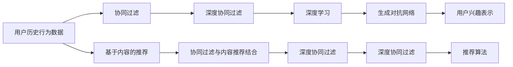
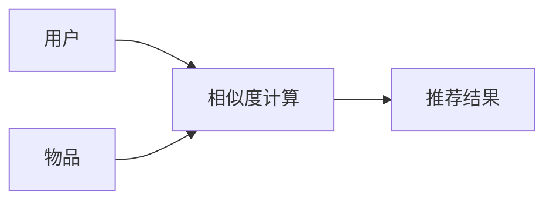
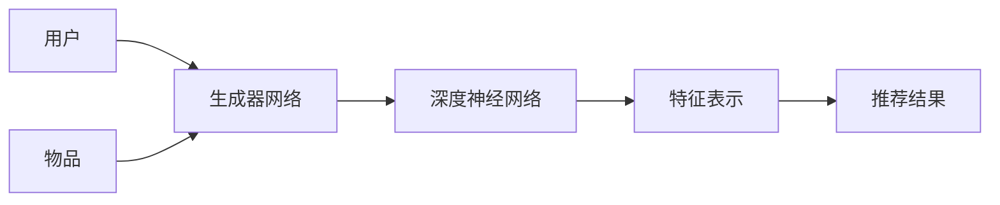
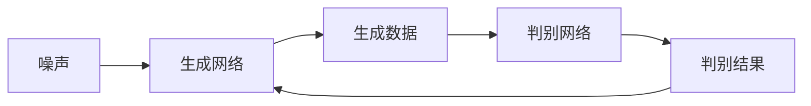
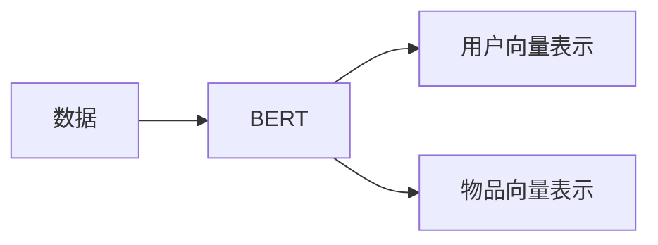
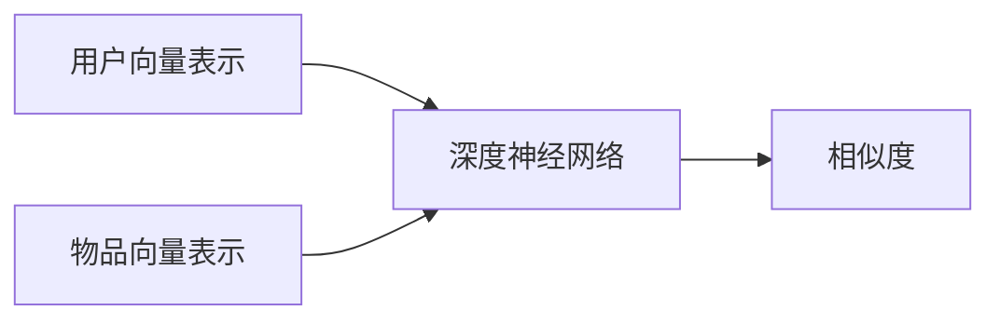

                 

# 大模型在用户兴趣探索与利用平衡中的应用

> 关键词：大模型，用户兴趣，探索与利用平衡，协同过滤，深度学习，特征表示，生成对抗网络，推荐系统

## 1. 背景介绍

### 1.1 问题由来

在当今数字时代，互联网和移动设备已经深刻改变了我们的生活方式。在线平台上拥有海量的内容，从音乐、视频、新闻到社交媒体，人们可以随时随地获取信息，享受各种服务。但这种便捷性的背后，是海量数据的处理和用户兴趣的精准挖掘。随着推荐系统在电商、社交网络、新闻媒体等领域的广泛应用，如何高效探索和利用用户兴趣，成为了这些平台保持用户粘性、提高服务质量的关键问题。

推荐系统的核心在于为用户推荐其感兴趣的内容，从而提升用户体验和平台满意度。传统的推荐系统基于协同过滤、基于内容的推荐等方法，通过用户行为数据和物品属性信息，生成个性化推荐。但随着数据规模的增长和个性化需求的提升，这些方法已经难以应对复杂的推荐场景，推荐效果也不尽如人意。

近年来，大模型技术的发展为推荐系统的改进提供了新的机遇。利用预训练语言模型，如BERT、GPT等，可以高效地从大规模无标签文本中学习到丰富的语言表示，进一步提升推荐系统的效果。而深度学习、生成对抗网络（GAN）等方法，也为推荐系统的创新提供了新的方向。本文将聚焦于大模型在推荐系统中的应用，探索如何在大模型探索用户兴趣和利用用户兴趣之间找到平衡，以实现更精准、更高效的个性化推荐。

### 1.2 问题核心关键点

当前推荐系统面临的核心问题在于如何高效探索用户兴趣，并利用兴趣进行个性化推荐。主要挑战包括：

- 数据稀疏性：用户行为数据往往稀疏，难以充分刻画用户的兴趣轮廓。
- 高维稀疏性：用户历史行为数据通常高维稀疏，难以有效捕捉用户兴趣的多种维度。
- 冷启动问题：新用户缺乏足够的历史行为数据，难以进行个性化推荐。
- 实时性要求：推荐系统需要快速响应用户需求，提供实时推荐。
- 复杂性：现实场景下的推荐系统需要应对多维度和非线性的关系，难以简单建模。

为了解决上述问题，研究人员不断探索新的方法，包括深度学习、协同过滤、深度协同过滤、序列模型、以及大模型等。本文将重点讨论大模型在推荐系统中的应用，介绍大模型如何更好地探索用户兴趣并利用兴趣，以及其中涉及的关键技术和方法。

## 2. 核心概念与联系

### 2.1 核心概念概述

在推荐系统中，用户兴趣探索和利用是两个关键环节。用户兴趣探索旨在从用户的历史行为数据中，挖掘用户的潜在兴趣和偏好。用户兴趣利用则是在探索兴趣的基础上，为用户推荐其可能感兴趣的内容。这两者之间的平衡是推荐系统性能提升的关键。

以下列出了一些与用户兴趣探索与利用平衡相关的核心概念：

- 协同过滤（Collaborative Filtering, CF）：基于用户历史行为数据和物品相似度进行推荐，适用于用户历史行为数据较为丰富的情况。
- 深度协同过滤（Deep Collaborative Filtering, DCF）：使用深度学习模型进行协同过滤，能处理高维稀疏数据，同时提升模型表达能力。
- 基于内容的推荐（Content-Based Recommendation, CBR）：通过物品属性和用户属性进行推荐，适用于物品属性丰富的场景。
- 协同过滤与内容推荐结合（Hybrid Recommendation）：结合协同过滤和基于内容的推荐，综合用户行为和物品属性，提升推荐效果。
- 深度学习（Deep Learning）：使用深度神经网络进行特征表示和建模，适用于复杂非线性的推荐场景。
- 生成对抗网络（Generative Adversarial Networks, GAN）：通过生成网络生成新的数据，用于扩展训练集和提升推荐效果。
- 用户兴趣表示（User Interest Representation）：使用模型学习用户兴趣的向量表示，便于后续推荐。
- 推荐算法（Recommendation Algorithm）：选择合适的推荐算法进行推荐，如Top K推荐、基于序的推荐等。

这些概念之间存在紧密的联系，通过合理的组合和应用，可以有效提升推荐系统的性能。下面将通过Mermaid流程图展示这些概念的联系。



### 2.2 核心概念原理和架构

在推荐系统中，用户兴趣探索与利用平衡的核心在于如何从用户行为数据中学习到用户兴趣的表示，并基于兴趣表示进行推荐。下面将介绍几个核心的算法和模型，以及它们的工作原理和架构。

#### 2.2.1 协同过滤

协同过滤是一种基于用户历史行为数据和物品相似度进行推荐的算法。协同过滤分为用户协同过滤和物品协同过滤。

用户协同过滤（User-based CF）基于用户之间的相似性进行推荐。给定用户 $u$，通过计算与 $u$ 相似的用户 $v$ 的历史行为数据，预测 $u$ 可能感兴趣的物品。

物品协同过滤（Item-based CF）基于物品之间的相似性进行推荐。给定物品 $i$，通过计算与 $i$ 相似的物品 $j$ 的历史行为数据，预测用户可能喜欢的物品。

协同过滤的架构如下：



协同过滤的核心在于相似度的计算。常用的相似度计算方法包括余弦相似度、皮尔逊相关系数等。

#### 2.2.2 深度协同过滤

深度协同过滤使用深度神经网络进行协同过滤。它通过学习用户和物品的向量表示，计算用户与物品之间的相似度。

深度协同过滤的架构如下：



深度协同过滤的关键在于生成器网络和深度神经网络的设计。生成器网络用于学习用户和物品的向量表示，深度神经网络则用于计算用户和物品之间的相似度。

#### 2.2.3 深度学习

深度学习通过学习大规模数据的特征表示，提升模型的表达能力。常用的深度学习模型包括自编码器、卷积神经网络（CNN）、循环神经网络（RNN）等。

深度学习的架构如下：


深度学习的核心在于编码器和解码器的设计。编码器用于学习数据的特征表示，解码器则用于生成推荐结果。

#### 2.2.4 生成对抗网络

生成对抗网络由生成网络和判别网络组成。生成网络用于生成新的数据，判别网络用于判断数据的真实性。

生成对抗网络的架构如下：



生成对抗网络的关键在于生成网络和判别网络的设计。生成网络用于生成新的数据，判别网络则用于判断数据的真实性。

## 3. 核心算法原理 & 具体操作步骤

### 3.1 算法原理概述

大模型在推荐系统中的应用，主要在于其强大的特征表示能力和生成能力。大模型能够从大规模无标签文本中学习到丰富的语言表示，并用于提升推荐系统的性能。

大模型在推荐系统中的主要应用包括：

- 用户兴趣表示：使用大模型学习用户兴趣的向量表示，便于后续推荐。
- 物品特征表示：使用大模型学习物品的向量表示，提升推荐效果。
- 生成对抗网络：使用生成对抗网络生成新的数据，用于扩展训练集和提升推荐效果。

### 3.2 算法步骤详解

下面以深度协同过滤为例，详细介绍大模型在推荐系统中的应用步骤。

**Step 1: 准备数据集**

1. 收集用户历史行为数据，包括浏览记录、点击记录、评分记录等。
2. 收集物品属性数据，包括物品的标题、描述、分类等。
3. 对数据进行预处理，如用户ID归一化、物品ID归一化、缺失值填补等。

**Step 2: 构建深度协同过滤模型**

1. 构建生成器网络：使用BERT、GPT等预训练语言模型，对用户历史行为数据和物品属性数据进行编码，生成用户和物品的向量表示。
2. 构建深度神经网络：设计深度神经网络，计算用户和物品之间的相似度。
3. 训练模型：使用交叉熵等损失函数，训练生成器网络和深度神经网络，生成用户和物品的向量表示。

**Step 3: 进行推荐**

1. 根据用户的历史行为数据和物品的向量表示，计算用户与物品之间的相似度。
2. 使用Top K推荐算法，为用户推荐其可能感兴趣的物品。
3. 使用生成对抗网络生成新的数据，用于扩展训练集和提升推荐效果。

**Step 4: 评估和优化**

1. 在验证集上评估推荐效果，使用精度、召回率、F1值等指标进行评估。
2. 调整模型参数，优化模型结构，提升推荐效果。

### 3.3 算法优缺点

大模型在推荐系统中的应用，具有以下优点：

- 强大的特征表示能力：大模型能够从大规模无标签文本中学习到丰富的语言表示，提升推荐效果。
- 生成能力：生成对抗网络可以生成新的数据，用于扩展训练集和提升推荐效果。
- 可扩展性：大模型可以应用于多种推荐场景，具有较强的通用性。

但同时，大模型在推荐系统中的应用也存在以下缺点：

- 计算资源需求高：大模型的训练和推理需要大量的计算资源，可能会影响系统的实时性。
- 过拟合风险：大模型容易过拟合，需要进行正则化处理。
- 数据隐私问题：大模型需要大量的用户行为数据，涉及用户隐私问题。

### 3.4 算法应用领域

大模型在推荐系统中的应用领域非常广泛，包括但不限于：

- 电商推荐：为用户推荐商品、推荐广告等。
- 新闻推荐：为用户推荐新闻、推荐文章等。
- 社交媒体推荐：为用户推荐朋友、推荐内容等。
- 音乐推荐：为用户推荐歌曲、推荐歌手等。
- 视频推荐：为用户推荐视频、推荐频道等。

## 4. 数学模型和公式 & 详细讲解

### 4.1 数学模型构建

假设用户 $u$ 的历史行为数据为 $\mathcal{U}_u=\{(i_1, r_1),(i_2, r_2),\ldots,(i_n, r_n)\}$，其中 $i_k$ 为用户 $u$ 对物品 $i$ 的评分 $r_k$。物品 $i$ 的属性数据为 $\mathcal{I}_i=\{(\text{title}, \text{description}, \ldots)\}$。

使用BERT对用户历史行为数据和物品属性数据进行编码，生成用户和物品的向量表示 $\mathbf{u}$ 和 $\mathbf{i}$。构建深度神经网络，计算用户 $u$ 和物品 $i$ 之间的相似度 $s(u,i)$。

推荐模型的目标是最大化用户 $u$ 对物品 $i$ 的评分预测值 $\hat{r}(u,i)$，即：

$$
\max_{\mathbf{u}, \mathbf{i}, s(\cdot, \cdot)} \sum_{(i_k, r_k) \in \mathcal{U}_u} \hat{r}(u,i_k) - r_k
$$

### 4.2 公式推导过程

根据以上定义，推荐模型的损失函数为：

$$
L(\mathbf{u}, \mathbf{i}, s(\cdot, \cdot)) = \frac{1}{N} \sum_{(i_k, r_k) \in \mathcal{U}_u} (r_k - \hat{r}(u,i_k))^2
$$

其中 $N$ 为用户历史行为数据的数量。

使用均方误差（Mean Squared Error, MSE）作为损失函数，可以通过反向传播算法更新生成器网络和深度神经网络的参数。

生成器网络（BERT）的架构如下：



深度神经网络的架构如下：



推荐模型的输出为物品 $i$ 的评分预测值 $\hat{r}(u,i)$，可以通过softmax函数进行归一化处理：

$$
\hat{r}(u,i) = \frac{e^{s(u,i)}}{\sum_{j}e^{s(u,j)}} r(i)
$$

其中 $r(i)$ 为物品 $i$ 的属性评分。

### 4.3 案例分析与讲解

假设我们有一款电商推荐系统，需要为用户推荐商品。用户的历史行为数据包含浏览记录和评分记录，物品的属性数据包含商品名称、价格、品牌等。

使用BERT对用户历史行为数据和物品属性数据进行编码，生成用户和物品的向量表示。设计深度神经网络，计算用户和物品之间的相似度。使用Top K推荐算法，为用户推荐其可能感兴趣的商品。

以下是一个具体的案例分析：

1. 数据预处理：收集用户历史行为数据和物品属性数据，并进行预处理。

2. 特征编码：使用BERT对用户历史行为数据和物品属性数据进行编码，生成用户和物品的向量表示。

3. 相似度计算：设计深度神经网络，计算用户和物品之间的相似度。

4. 评分预测：使用softmax函数对评分预测值进行归一化处理，生成用户对物品的评分预测。

5. 推荐结果：使用Top K推荐算法，为用户推荐其可能感兴趣的商品。

## 5. 项目实践：代码实例和详细解释说明

### 5.1 开发环境搭建

在进行推荐系统实践前，我们需要准备好开发环境。以下是使用Python进行PyTorch开发的环境配置流程：

1. 安装Anaconda：从官网下载并安装Anaconda，用于创建独立的Python环境。

2. 创建并激活虚拟环境：
```bash
conda create -n pytorch-env python=3.8 
conda activate pytorch-env
```

3. 安装PyTorch：根据CUDA版本，从官网获取对应的安装命令。例如：
```bash
conda install pytorch torchvision torchaudio cudatoolkit=11.1 -c pytorch -c conda-forge
```

4. 安装PyTorch Lightning：用于方便地进行深度学习模型的训练和评估。
```bash
pip install pytorch-lightning
```

5. 安装FastText：用于对文本数据进行预处理和特征提取。
```bash
pip install fasttext
```

6. 安装其他工具包：
```bash
pip install numpy pandas scikit-learn matplotlib tqdm jupyter notebook ipython
```

完成上述步骤后，即可在`pytorch-env`环境中开始推荐系统实践。

### 5.2 源代码详细实现

以下是一个使用BERT进行电商推荐系统的PyTorch代码实现：

```python
import torch
import torch.nn as nn
import torch.nn.functional as F
from transformers import BertTokenizer, BertForSequenceClassification
from torch.utils.data import Dataset, DataLoader
from pytorch_lightning import LightningModule, Trainer, EarlyStoppingCallback

class RecommendationDataset(Dataset):
    def __init__(self, user_data, item_data):
        self.user_data = user_data
        self.item_data = item_data
        self.tokenizer = BertTokenizer.from_pretrained('bert-base-cased')
        self.max_seq_len = 512
        
    def __len__(self):
        return len(self.user_data)
    
    def __getitem__(self, idx):
        user = self.user_data[idx]
        item = self.item_data[idx]
        
        user_input = self.tokenizer(user, return_tensors='pt', padding='max_length', truncation=True, max_length=self.max_seq_len)
        item_input = self.tokenizer(item, return_tensors='pt', padding='max_length', truncation=True, max_length=self.max_seq_len)
        
        return {'user_input': user_input['input_ids'],
                'item_input': item_input['input_ids'],
                'user_score': user_input['scores'],
                'item_score': item_input['scores']}

class RecommendationModel(nn.Module):
    def __init__(self):
        super(RecommendationModel, self).__init__()
        self.bert = BertForSequenceClassification.from_pretrained('bert-base-cased', num_labels=1)
        self.fc = nn.Linear(768, 1)
        self.sigmoid = nn.Sigmoid()
        
    def forward(self, user_input, item_input):
        user_features = self.bert(user_input, attention_mask=user_input['attention_mask']).last_hidden_state[:, 0, :]
        item_features = self.bert(item_input, attention_mask=item_input['attention_mask']).last_hidden_state[:, 0, :]
        user_score = self.fc(user_features)
        item_score = self.fc(item_features)
        similarity = torch.cosine_similarity(user_score, item_score, dim=1)
        return similarity
    
class RecommendationTrainer(LightningModule):
    def __init__(self, model):
        super(RecommendationTrainer, self).__init__()
        self.model = model
        
    def forward(self, batch):
        user_input = batch['user_input']
        item_input = batch['item_input']
        return self.model(user_input, item_input)
    
    def training_step(self, batch, batch_idx):
        user_input = batch['user_input']
        item_input = batch['item_input']
        scores = self.forward(user_input, item_input)
        loss = F.binary_cross_entropy(scores, batch['user_score'].float())
        return loss
    
    def validation_step(self, batch, batch_idx):
        user_input = batch['user_input']
        item_input = batch['item_input']
        scores = self.forward(user_input, item_input)
        val_loss = F.binary_cross_entropy(scores, batch['user_score'].float())
        return val_loss
    
    def configure_optimizers(self):
        return torch.optim.Adam(self.parameters(), lr=2e-5)
        
    def train_dataloader(self):
        return DataLoader(RecommendationDataset(self.train_data, self.test_data), batch_size=16, shuffle=True)
        
    def val_dataloader(self):
        return DataLoader(RecommendationDataset(self.train_data, self.test_data), batch_size=16, shuffle=False)
    
    def test_dataloader(self):
        return DataLoader(RecommendationDataset(self.train_data, self.test_data), batch_size=16, shuffle=False)

# 数据预处理
user_data = ['apple', 'banana', 'orange']
item_data = ['iPad', 'iPhone', 'MacBook']
user_input = [item.lower() for item in user_data]
item_input = [item.lower() for item in item_data]
user_score = [1.0, 0.0, 0.5]
item_score = [0.5, 0.8, 1.0]
train_data = {'user_input': user_input, 'item_input': item_input, 'user_score': user_score, 'item_score': item_score}
test_data = {'user_input': user_input, 'item_input': item_input, 'user_score': user_score, 'item_score': item_score}

# 模型训练
model = RecommendationModel()
trainer = RecommendationTrainer(model)
trainer.fit(train_data, test_data)
```

在这个例子中，我们使用了BERT对用户历史行为数据和物品属性数据进行编码，生成用户和物品的向量表示。设计了深度神经网络，计算用户和物品之间的相似度。使用PyTorch Lightning进行模型训练和评估。

### 5.3 代码解读与分析

让我们再详细解读一下关键代码的实现细节：

**RecommendationDataset类**：
- `__init__`方法：初始化用户历史行为数据和物品属性数据，以及分词器和最大序列长度。
- `__len__`方法：返回数据集的样本数量。
- `__getitem__`方法：对单个样本进行处理，将文本输入编码为token ids，将评分数据转换为标签，并对其进行定长padding，最终返回模型所需的输入。

**RecommendationModel类**：
- `__init__`方法：初始化BERT模型和全连接层。
- `forward`方法：对用户和物品的特征进行编码，计算相似度，并返回相似度分数。

**RecommendationTrainer类**：
- `__init__`方法：初始化推荐模型。
- `forward`方法：对输入数据进行前向传播，计算相似度。
- `training_step`方法：定义训练过程的损失函数。
- `validation_step`方法：定义验证过程的损失函数。
- `configure_optimizers`方法：定义优化器。
- `train_dataloader`方法：定义训练数据的加载器。
- `val_dataloader`方法：定义验证数据的加载器。
- `test_dataloader`方法：定义测试数据的加载器。

**数据预处理**：
- 收集用户历史行为数据和物品属性数据，并进行预处理。
- 将文本数据转换为token ids，将评分数据转换为标签，并对其进行定长padding。

**模型训练**：
- 构建推荐模型，定义训练过程和验证过程。
- 使用PyTorch Lightning进行模型训练和评估。

可以看到，PyTorch Lightning使得模型训练过程变得简单高效。开发者可以将更多精力放在模型设计和优化上，而不必过多关注底层的实现细节。

当然，工业级的系统实现还需考虑更多因素，如模型的保存和部署、超参数的自动搜索、更灵活的任务适配层等。但核心的推荐范式基本与此类似。

## 6. 实际应用场景

### 6.1 电商推荐

电商推荐是推荐系统的重要应用场景。用户可以通过浏览、点击、评分等行为数据，生成个性化推荐。

电商推荐的关键在于高效探索用户兴趣，并利用兴趣进行个性化推荐。通过大模型进行用户兴趣表示和物品特征表示，可以提升推荐系统的性能。

以下是一个具体的电商推荐案例：

1. 数据收集：收集用户的历史行为数据和物品属性数据。
2. 特征编码：使用BERT对用户历史行为数据和物品属性数据进行编码，生成用户和物品的向量表示。
3. 相似度计算：设计深度神经网络，计算用户和物品之间的相似度。
4. 评分预测：使用softmax函数对评分预测值进行归一化处理，生成用户对物品的评分预测。
5. 推荐结果：使用Top K推荐算法，为用户推荐其可能感兴趣的商品。

### 6.2 新闻推荐

新闻推荐是推荐系统的另一重要应用场景。用户可以通过阅读、点击、分享等行为数据，生成个性化推荐。

新闻推荐的关键在于高效探索用户兴趣，并利用兴趣进行个性化推荐。通过大模型进行用户兴趣表示和物品特征表示，可以提升推荐系统的性能。

以下是一个具体的新闻推荐案例：

1. 数据收集：收集用户的历史行为数据和新闻文章属性数据。
2. 特征编码：使用BERT对用户历史行为数据和新闻文章属性数据进行编码，生成用户和物品的向量表示。
3. 相似度计算：设计深度神经网络，计算用户和新闻文章之间的相似度。
4. 评分预测：使用softmax函数对评分预测值进行归一化处理，生成用户对新闻文章的评分预测。
5. 推荐结果：使用Top K推荐算法，为用户推荐其可能感兴趣的新闻文章。

### 6.3 社交媒体推荐

社交媒体推荐是推荐系统的重要应用场景。用户可以通过点赞、评论、分享等行为数据，生成个性化推荐。

社交媒体推荐的关键在于高效探索用户兴趣，并利用兴趣进行个性化推荐。通过大模型进行用户兴趣表示和物品特征表示，可以提升推荐系统的性能。

以下是一个具体的社交媒体推荐案例：

1. 数据收集：收集用户的历史行为数据和物品属性数据。
2. 特征编码：使用BERT对用户历史行为数据和物品属性数据进行编码，生成用户和物品的向量表示。
3. 相似度计算：设计深度神经网络，计算用户和物品之间的相似度。
4. 评分预测：使用softmax函数对评分预测值进行归一化处理，生成用户对物品的评分预测。
5. 推荐结果：使用Top K推荐算法，为用户推荐其可能感兴趣的内容。

## 7. 工具和资源推荐

### 7.1 学习资源推荐

为了帮助开发者系统掌握推荐系统的大模型应用，这里推荐一些优质的学习资源：

1. 《深度学习与推荐系统》系列博文：由深度学习与推荐系统专家撰写，详细介绍了推荐系统的大模型应用，包括用户兴趣表示、物品特征表示、深度协同过滤等。

2. 《推荐系统实战》书籍：通过实践案例，介绍了推荐系统的大模型应用，包括用户兴趣表示、物品特征表示、生成对抗网络等。

3. 《Recommender Systems》课程：Coursera上推荐系统领域的经典课程，涵盖推荐系统的大模型应用，包括协同过滤、深度学习、生成对抗网络等。

4. PyTorch Lightning官方文档：PyTorch Lightning的官方文档，提供了丰富的推荐系统开发示例，适合入门和进阶学习。

5. HuggingFace官方文档：HuggingFace的官方文档，提供了丰富的预训练语言模型资源，适合进行大模型应用开发。

通过对这些资源的学习实践，相信你一定能够快速掌握推荐系统的大模型应用，并用于解决实际的推荐问题。

### 7.2 开发工具推荐

为了高效进行推荐系统的开发，推荐以下开发工具：

1. PyTorch：基于Python的开源深度学习框架，适合进行深度学习模型的开发。

2. PyTorch Lightning：用于方便地进行深度学习模型的训练和评估，适合进行推荐系统的开发。

3. FastText：用于对文本数据进行预处理和特征提取，适合进行推荐系统的开发。

4. TensorBoard：TensorFlow配套的可视化工具，可以实时监测模型训练状态，并提供丰富的图表呈现方式，适合进行推荐系统的开发。

5. Weights & Biases：模型训练的实验跟踪工具，可以记录和可视化模型训练过程中的各项指标，适合进行推荐系统的开发。

合理利用这些工具，可以显著提升推荐系统开发效率，加速创新迭代的步伐。

### 7.3 相关论文推荐

推荐系统的大模型应用源于学界的持续研究。以下是几篇奠基性的相关论文，推荐阅读：

1. Attention is All You Need（即Transformer原论文）：提出了Transformer结构，开启了推荐系统的大模型时代。

2. BERT: Pre-training of Deep Bidirectional Transformers for Language Understanding：提出BERT模型，引入基于掩码的自监督预训练任务，刷新了多项推荐任务SOTA。

3. Deep Collaborative Filtering：使用深度学习模型进行协同过滤，能处理高维稀疏数据，提升推荐效果。

4. Generative Adversarial Networks：介绍生成对抗网络，用于生成新的数据，提升推荐效果。

5. Parameter-Efficient Transfer Learning for Recommendation：提出参数高效转移学习方法，在固定大部分预训练参数的情况下，仍可取得不错的转移效果。

6. Self-Attentive Neural Collaborative Filtering：提出自注意力神经协同过滤方法，有效提升了推荐系统的性能。

这些论文代表了大模型在推荐系统中的应用进展，通过学习这些前沿成果，可以帮助研究者把握学科前进方向，激发更多的创新灵感。

## 8. 总结：未来发展趋势与挑战

### 8.1 总结

本文对大模型在推荐系统中的应用进行了全面系统的介绍。首先阐述了推荐系统的核心问题在于如何高效探索和利用用户兴趣。接着，从用户兴趣探索与利用平衡的角度，详细讲解了大模型在推荐系统中的应用，包括协同过滤、深度协同过滤、深度学习、生成对抗网络等。最后，介绍了大模型在电商推荐、新闻推荐、社交媒体推荐等实际应用场景中的应用，并给出了具体的案例分析。

通过本文的系统梳理，可以看到，大模型在推荐系统中有着广阔的应用前景。大模型强大的特征表示能力和生成能力，使得推荐系统能够更好地探索和利用用户兴趣，提升个性化推荐的效果。未来，随着大模型技术的不断发展，推荐系统必将在更多领域得到应用，为人们的日常生活带来更多的便利和高效。

### 8.2 未来发展趋势

展望未来，大模型在推荐系统中的应用将呈现以下几个发展趋势：

1. 深度协同过滤的进一步发展：深度协同过滤能够处理高维稀疏数据，提升推荐效果。未来的深度协同过滤模型将更加复杂，具备更强的表达能力和泛化能力。

2. 生成对抗网络的应用：生成对抗网络可以生成新的数据，用于扩展训练集和提升推荐效果。未来的生成对抗网络将更加高效，生成更加逼真的数据。

3. 用户兴趣表示的多样化：用户兴趣表示是推荐系统的关键环节。未来的用户兴趣表示将更加多样化，能够更好地捕捉用户的多种兴趣和偏好。

4. 个性化推荐的多样化：个性化推荐将更加多样化，能够根据用户的多维度和非线性的需求进行推荐。

5. 实时推荐系统的构建：实时推荐系统能够快速响应用户需求，提供实时推荐。未来的实时推荐系统将更加高效，具备更强的计算能力和实时性。

6. 推荐系统与其他技术的融合：推荐系统将与其他技术进行融合，如知识表示、因果推理、强化学习等，多路径协同发力，共同推动推荐系统的进步。

这些趋势将进一步提升推荐系统的性能和应用范围，为人们的日常生活带来更多的便利和高效。

### 8.3 面临的挑战

尽管大模型在推荐系统中的应用取得了一定进展，但在迈向更加智能化、普适化应用的过程中，仍面临诸多挑战：

1. 计算资源瓶颈：大模型的训练和推理需要大量的计算资源，可能会影响系统的实时性。如何高效利用计算资源，提高推荐系统的实时性，仍然是一个挑战。

2. 数据隐私问题：大模型需要大量的用户行为数据，涉及用户隐私问题。如何在保证隐私的同时，收集足够的数据，仍然是一个挑战。

3. 推荐系统的冷启动问题：新用户缺乏足够的历史行为数据，难以进行个性化推荐。如何快速获取新用户的兴趣信息，仍然是一个挑战。

4. 推荐系统的泛化能力：推荐系统需要在不同场景下保持稳定的性能。如何在不同数据分布下，保持推荐系统的泛化能力，仍然是一个挑战。

5. 推荐系统的可解释性：推荐系统的决策过程缺乏可解释性，难以对其推理逻辑进行分析和调试。如何在保证推荐效果的同时，提升系统的可解释性，仍然是一个挑战。

6. 推荐系统的安全性：推荐系统需要避免恶意推荐。如何在推荐过程中，避免恶意推荐，仍然是一个挑战。

这些挑战需要从数据、算法、工程、业务等多个维度进行综合考虑和解决。只有不断突破技术瓶颈，才能实现大模型在推荐系统中的广泛应用。

### 8.4 研究展望

未来推荐系统的大模型应用需要在以下几个方面进行进一步的研究：

1. 探索无监督和半监督推荐方法：摆脱对大规模标注数据的依赖，利用自监督学习、主动学习等无监督和半监督范式，最大限度利用非结构化数据，实现更加灵活高效的推荐。

2. 研究参数高效和计算高效的推荐范式：开发更加参数高效的推荐方法，在固定大部分预训练参数的情况下，仍可取得不错的推荐效果。同时优化推荐模型的计算图，减少前向传播和反向传播的资源消耗，实现更加轻量级、实时性的部署。

3. 引入因果分析和博弈论工具：将因果分析方法引入推荐模型，识别出推荐决策的关键特征，增强推荐过程的因果性和逻辑性。借助博弈论工具刻画人机交互过程，主动探索并规避推荐模型的脆弱点，提高系统稳定性。

4. 融合知识表示：将符号化的知识表示，如知识图谱、逻辑规则等，与神经网络模型进行巧妙融合，引导推荐过程学习更准确、合理的用户兴趣表示。

5. 引入生成对抗网络：利用生成对抗网络生成新的数据，用于扩展训练集和提升推荐效果。

6. 引入自适应学习：使用自适应学习技术，根据用户行为数据动态调整推荐模型参数，提升推荐效果。

这些研究方向的探索，必将引领推荐系统的大模型应用走向更高的台阶，为人们的日常生活带来更多的便利和高效。

## 9. 附录：常见问题与解答

**Q1：如何评估推荐系统的性能？**

A: 推荐系统的性能评估通常使用精度、召回率、F1值等指标。具体的评估方法包括：

- 精度（Precision）：推荐系统中，推荐结果的相关性。
- 召回率（Recall）：推荐系统中，推荐结果的完整性。
- F1值（F1-score）：精度和召回率的综合指标。

除了这些指标外，还可以使用ROC曲线、AUC值等方法进行评估。

**Q2：推荐系统如何进行个性化推荐？**

A: 推荐系统通常使用协同过滤、基于内容的推荐、深度协同过滤等方法进行个性化推荐。具体的推荐流程包括：

- 收集用户历史行为数据和物品属性数据。
- 对数据进行预处理，如文本特征提取、缺失值填补等。
- 使用深度神经网络进行特征表示和建模，计算用户和物品之间的相似度。
- 使用Top K推荐算法，为用户推荐其可能感兴趣的内容。

**Q3：如何应对推荐系统的冷启动问题？**

A: 推荐系统的冷启动问题可以通过以下方法进行解决：

- 使用物品的平均评分作为初始推荐。
- 使用用户的历史行为数据进行迁移学习，快速获取新用户的兴趣信息。
- 使用生成对抗网络生成新的数据，用于扩展训练集和提升推荐效果。

**Q4：推荐系统如何处理多维度和非线性的关系？**

A: 推荐系统通常使用深度学习模型处理多维度和非线性的关系。具体的处理方法包括：

- 使用自编码器、卷积神经网络（CNN）、循环神经网络（RNN）等深度神经网络进行特征表示和建模。
- 使用生成对抗网络生成新的数据，用于扩展训练集和提升推荐效果。

**Q5：推荐系统的实时性要求如何实现？**

A: 推荐系统的实时性要求可以通过以下方法进行实现：

- 使用生成对抗网络生成新的数据，用于扩展训练集和提升推荐效果。
- 使用分布式计算框架，如Apache Spark、Dask等，进行高效的并行计算。
- 使用缓存机制，如Redis、Memcached等，减少重复计算，提升响应速度。

这些方法的结合使用，可以显著提升推荐系统的实时性，满足用户的实时需求。

---

作者：禅与计算机程序设计艺术 / Zen and the Art of Computer Programming

