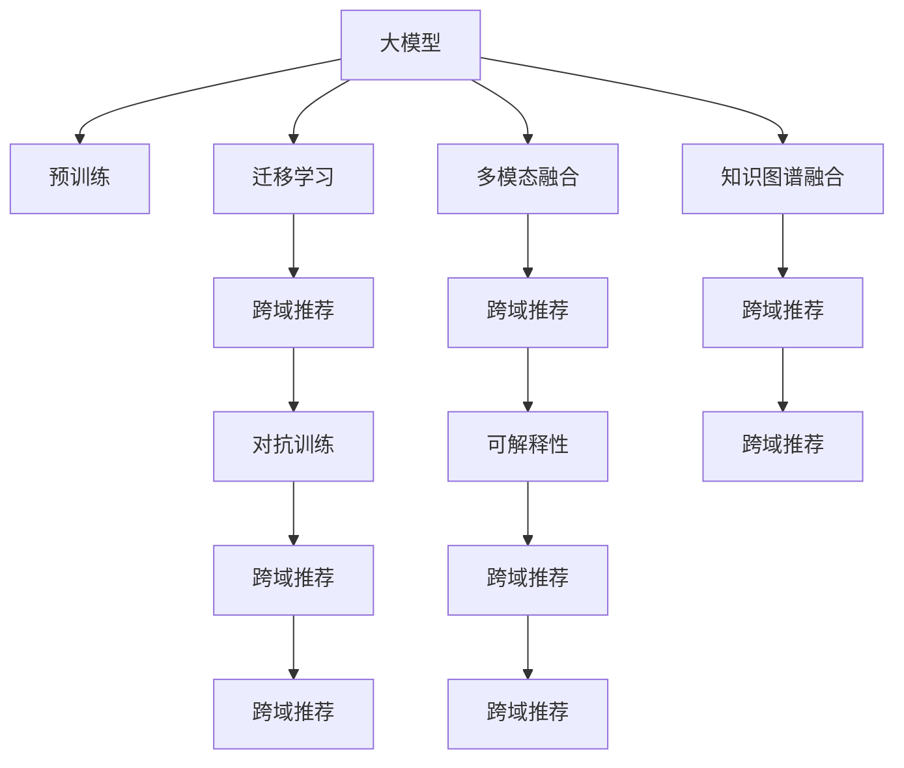

                 

# 大模型在跨域推荐中的应用

## 1. 背景介绍

### 1.1 问题由来
在互联网和数字经济迅速发展的今天，推荐系统已经成为了各类电商、新闻、社交媒体平台不可或缺的组成部分。推荐系统通过分析用户的浏览、点击、评分等行为数据，为用户推荐个性化的内容，从而提升用户体验和平台转化率。然而，推荐系统的核心目标——提升个性化推荐效果，仍面临诸多挑战，如数据稀疏性、冷启动问题、跨域推荐难题等。

特别是跨域推荐问题，涉及不同领域或产品之间的推荐，如电商网站上的商品推荐、音乐平台上的歌单推荐、视频网站上的影片推荐等，在业务逻辑和数据特性上存在较大差异，对推荐算法的要求也更高。如何在保留用户兴趣的同时，跨域推荐具备相似特征的商品、内容、服务等，是推荐系统面临的重要问题。

近年来，深度学习和大规模预训练语言模型取得了显著进展，为推荐系统的升级带来了新的可能。通过预训练大模型进行跨域推荐，能够更好地整合不同领域的数据，提升推荐系统的综合性能。本文将探讨大模型在跨域推荐中的应用，重点阐述大模型的迁移学习能力和适应性，提出多种跨域推荐方法，展示大模型在不同场景下的实际应用效果。

### 1.2 问题核心关键点
本节将详细阐述大模型在跨域推荐中的核心问题和关键点：

- **预训练-微调框架**：大模型的预训练-微调范式可以显著提升推荐系统的泛化能力，对新领域数据的适应性更强。
- **迁移学习能力**：大模型通过迁移学习机制，可以有效地将预训练中的知识应用到跨域推荐中，提升推荐质量。
- **领域适配**：如何针对不同领域特点，对大模型进行领域适配，进一步提升推荐效果。
- **多模态融合**：不同模态的数据可以互相补充，通过多模态融合，增强推荐系统的准确性和多样性。
- **知识图谱融合**：利用知识图谱等先验知识，辅助大模型理解实体间关系，提升推荐系统的性能。
- **对抗训练**：通过对抗训练提升模型的鲁棒性，避免推荐偏差和歧视。
- **可解释性**：通过可解释性技术，增强推荐系统的透明度和可信度。

这些关键点是大模型在跨域推荐中不可或缺的要素，是理解大模型跨域推荐方法的重要基础。

## 2. 核心概念与联系

### 2.1 核心概念概述

大模型在跨域推荐中的应用，涉及以下几个核心概念：

- **大模型**：如BERT、GPT、XLNet等，通过大规模无标签数据预训练，具备强大的泛化能力和语言理解能力。
- **迁移学习**：利用预训练模型在新领域上的微调，提升模型在新领域的性能。
- **预训练-微调**：在大规模无标签数据上预训练，在小规模标注数据上微调，提升模型在新领域的泛化能力。
- **多模态融合**：将文本、图像、音频等多种模态的信息融合，增强推荐系统的信息丰富度。
- **知识图谱**：利用结构化知识，辅助模型理解实体间关系，提升推荐系统的准确性和覆盖面。
- **对抗训练**：通过对抗样本训练，增强模型的鲁棒性和泛化能力。
- **可解释性**：通过模型输出解释，增强推荐系统的透明度和可信度。

这些概念之间的逻辑关系可以通过以下Mermaid流程图来展示：



这个流程图展示了各个概念之间的逻辑关系：

1. 大模型通过预训练获得基础能力。
2. 迁移学习机制利用预训练模型的知识，在新领域上进行微调，提升模型性能。
3. 多模态融合、知识图谱融合等机制，帮助模型更全面地理解用户需求和推荐对象。
4. 对抗训练和可解释性技术，增强模型的鲁棒性和透明性。

## 3. 核心算法原理 & 具体操作步骤
### 3.1 算法原理概述

大模型在跨域推荐中的应用，主要基于迁移学习机制，通过预训练-微调范式，利用大模型的泛化能力，提升推荐系统的性能。核心算法原理包括：

- **预训练**：在大规模无标签数据上，通过自监督学习任务训练大模型，使其具备强大的语言理解能力和泛化能力。
- **微调**：在新领域上的少量标注数据上，通过有监督学习任务对大模型进行微调，使其适应新领域的推荐任务。
- **跨域推荐**：将微调后的大模型应用于不同领域或产品之间的推荐，提升推荐系统的性能。

### 3.2 算法步骤详解

基于大模型进行跨域推荐，一般包括以下几个关键步骤：

**Step 1: 准备预训练模型和数据集**
- 选择合适的预训练模型，如BERT、GPT等，作为初始化参数。
- 准备新领域的标注数据集，划分为训练集、验证集和测试集。标注数据集应尽量覆盖新领域的典型特征和用户需求。

**Step 2: 微调模型**
- 选择适合的任务适配层，如添加分类头、解码器等，根据推荐任务的特性设计损失函数。
- 设置微调超参数，如学习率、批大小、迭代轮数等，并选择合适的优化算法。
- 进行梯度训练，使用验证集评估模型性能，避免过拟合。

**Step 3: 跨域推荐**
- 将微调后的模型应用于不同领域或产品之间的推荐，如将电商商品推荐扩展到音乐歌单推荐、视频影片推荐等。
- 根据不同领域的特点，对微调后的模型进行领域适配，调整参数或新增模块。
- 利用多模态融合、知识图谱融合等技术，增强推荐系统的准确性和多样性。

### 3.3 算法优缺点

大模型在跨域推荐中的应用，具有以下优点：

1. **泛化能力强**：大模型通过预训练获得丰富的语言知识和常识，在微调时能够更好地适应新领域的特性。
2. **推荐准确性高**：利用大模型的泛化能力，跨域推荐能够获得更高的推荐准确性和多样性。
3. **参数高效**：通过迁移学习机制，可以大幅减少在新领域的微调参数量，提升训练效率。
4. **扩展性强**：大模型可以扩展到不同的推荐场景，如电商、音乐、视频等，具有较强的适应性。

同时，也存在一些局限性：

1. **依赖标注数据**：跨域推荐需要新领域的大量标注数据，标注成本较高。
2. **数据分布差异**：不同领域的数据分布差异较大，微调模型的泛化性能可能受到影响。
3. **模型复杂度高**：大模型的复杂度较高，推理速度较慢，需要优化计算图以提升效率。
4. **模型可解释性差**：大模型通常为黑盒模型，难以解释其决策逻辑。

尽管存在这些局限性，但大模型在跨域推荐中展现了强大的潜力，为推荐系统的升级带来了新的可能。

### 3.4 算法应用领域

大模型在跨域推荐中的应用领域广泛，以下是几个典型的应用场景：

- **电商推荐系统**：利用大模型进行商品推荐、购物车推荐、个性化广告推荐等。
- **音乐推荐系统**：推荐用户可能喜欢的歌曲、歌单、艺人等。
- **视频推荐系统**：推荐用户可能感兴趣的电影、电视剧、综艺节目等。
- **新闻推荐系统**：推荐用户感兴趣的新闻、文章、专栏等。
- **旅游推荐系统**：推荐用户可能感兴趣的旅游目的地、景点、旅游服务等。

除了以上场景，大模型还可以应用于各类个性化推荐系统，如教育、娱乐、健康等，提升推荐系统的综合性能。

## 4. 数学模型和公式 & 详细讲解 & 举例说明

### 4.1 数学模型构建

假设用户的历史行为数据为 $\mathcal{D} = \{(x_i, y_i)\}_{i=1}^N$，其中 $x_i$ 为用户的历史行为特征，$y_i$ 为用户对推荐对象的评价。目标是对用户进行跨域推荐，即推荐与用户历史行为相似的推荐对象 $z$。

定义预训练语言模型为 $M_{\theta}$，其中 $\theta$ 为模型参数。定义推荐任务的目标函数为：

$$
\mathcal{L}(\theta) = -\sum_{i=1}^N \log P_{M_{\theta}}(z_i \mid x_i)
$$

其中 $P_{M_{\theta}}(z_i \mid x_i)$ 为模型预测 $z_i$ 的条件概率。

### 4.2 公式推导过程

在跨域推荐中，可以使用大模型进行多模态融合和知识图谱融合，提升推荐系统的性能。以下以知识图谱融合为例，展示如何利用预训练语言模型进行推荐：

1. **知识图谱表示**：将推荐对象 $z$ 表示为知识图谱中的实体，将用户历史行为特征 $x_i$ 转化为知识图谱中的关系。
2. **知识图谱嵌入**：利用预训练语言模型 $M_{\theta}$，将知识图谱中的实体和关系转换为向量表示。
3. **推荐计算**：通过相似度计算，找到与用户历史行为特征 $x_i$ 相似的推荐对象 $z'$，作为推荐结果。

具体步骤如下：

1. **实体嵌入**：将推荐对象 $z$ 和用户历史行为特征 $x_i$ 表示为知识图谱中的实体和关系。
2. **知识图谱嵌入**：使用预训练语言模型 $M_{\theta}$ 对实体和关系进行向量嵌入。
3. **相似度计算**：计算用户历史行为特征 $x_i$ 与推荐对象 $z$ 在向量空间中的相似度，找到与用户历史行为特征最相似的推荐对象 $z'$。

形式化地，可以将推荐过程表示为：

$$
z' = \mathop{\arg\max}_{z \in Z} \text{sim}(x_i, z)
$$

其中 $\text{sim}(x_i, z)$ 为相似度函数，如余弦相似度、点积相似度等。

### 4.3 案例分析与讲解

假设用户的历史行为特征为 $(\text{type}=电商, \text{item}=手机, \text{brand}=华为)$，需要推荐与用户兴趣相似的推荐对象。

1. **知识图谱表示**：将用户历史行为特征 $x_i$ 表示为 $(\text{type}=电商, \text{item}=手机, \text{brand}=华为)$，将推荐对象 $z$ 表示为 $(\text{type}=电商, \text{item}=手机, \text{brand}=华为)$。
2. **知识图谱嵌入**：使用预训练语言模型 $M_{\theta}$ 对用户历史行为特征和推荐对象进行向量嵌入，得到嵌入向量 $x_i \in \mathbb{R}^d$ 和 $z \in \mathbb{R}^d$。
3. **相似度计算**：计算用户历史行为特征 $x_i$ 与推荐对象 $z$ 在向量空间中的相似度，找到与用户历史行为特征最相似的推荐对象 $z'$。

假设相似度函数为余弦相似度，则推荐过程可以表示为：

$$
z' = \mathop{\arg\max}_{z \in Z} \cos(\text{sim}(x_i, z))
$$

其中 $\text{sim}(x_i, z) = \cos(\text{embed}(x_i) \cdot \text{embed}(z))$，$\text{embed}$ 为预训练语言模型的嵌入函数。

## 5. 项目实践：代码实例和详细解释说明
### 5.1 开发环境搭建

在进行跨域推荐实践前，需要先准备好开发环境。以下是使用Python进行PyTorch开发的环境配置流程：

1. 安装Anaconda：从官网下载并安装Anaconda，用于创建独立的Python环境。

2. 创建并激活虚拟环境：
```bash
conda create -n pytorch-env python=3.8 
conda activate pytorch-env
```

3. 安装PyTorch：根据CUDA版本，从官网获取对应的安装命令。例如：
```bash
conda install pytorch torchvision torchaudio cudatoolkit=11.1 -c pytorch -c conda-forge
```

4. 安装Transformers库：
```bash
pip install transformers
```

5. 安装各类工具包：
```bash
pip install numpy pandas scikit-learn matplotlib tqdm jupyter notebook ipython
```

完成上述步骤后，即可在`pytorch-env`环境中开始跨域推荐实践。

### 5.2 源代码详细实现

这里我们以音乐推荐系统为例，给出使用Transformers库对BERT模型进行跨域推荐的PyTorch代码实现。

首先，定义音乐推荐任务的数据处理函数：

```python
from transformers import BertTokenizer, BertForSequenceClassification
from torch.utils.data import Dataset
import torch

class MusicRecommendationDataset(Dataset):
    def __init__(self, texts, labels, tokenizer, max_len=128):
        self.texts = texts
        self.labels = labels
        self.tokenizer = tokenizer
        self.max_len = max_len
        
    def __len__(self):
        return len(self.texts)
    
    def __getitem__(self, item):
        text = self.texts[item]
        label = self.labels[item]
        
        encoding = self.tokenizer(text, return_tensors='pt', max_length=self.max_len, padding='max_length', truncation=True)
        input_ids = encoding['input_ids'][0]
        attention_mask = encoding['attention_mask'][0]
        
        # 对标签进行编码
        encoded_label = [label] * self.max_len
        labels = torch.tensor(encoded_label, dtype=torch.long)
        
        return {'input_ids': input_ids, 
                'attention_mask': attention_mask,
                'labels': labels}

# 标签与id的映射
label2id = {'流行': 0, '摇滚': 1, '电子': 2, '古典': 3}
id2label = {v: k for k, v in label2id.items()}

# 创建dataset
tokenizer = BertTokenizer.from_pretrained('bert-base-cased')

train_dataset = MusicRecommendationDataset(train_texts, train_labels, tokenizer)
dev_dataset = MusicRecommendationDataset(dev_texts, dev_labels, tokenizer)
test_dataset = MusicRecommendationDataset(test_texts, test_labels, tokenizer)
```

然后，定义模型和优化器：

```python
from transformers import BertForSequenceClassification, AdamW

model = BertForSequenceClassification.from_pretrained('bert-base-cased', num_labels=len(label2id))

optimizer = AdamW(model.parameters(), lr=2e-5)
```

接着，定义训练和评估函数：

```python
from torch.utils.data import DataLoader
from tqdm import tqdm
from sklearn.metrics import classification_report

device = torch.device('cuda') if torch.cuda.is_available() else torch.device('cpu')
model.to(device)

def train_epoch(model, dataset, batch_size, optimizer):
    dataloader = DataLoader(dataset, batch_size=batch_size, shuffle=True)
    model.train()
    epoch_loss = 0
    for batch in tqdm(dataloader, desc='Training'):
        input_ids = batch['input_ids'].to(device)
        attention_mask = batch['attention_mask'].to(device)
        labels = batch['labels'].to(device)
        model.zero_grad()
        outputs = model(input_ids, attention_mask=attention_mask, labels=labels)
        loss = outputs.loss
        epoch_loss += loss.item()
        loss.backward()
        optimizer.step()
    return epoch_loss / len(dataloader)

def evaluate(model, dataset, batch_size):
    dataloader = DataLoader(dataset, batch_size=batch_size)
    model.eval()
    preds, labels = [], []
    with torch.no_grad():
        for batch in tqdm(dataloader, desc='Evaluating'):
            input_ids = batch['input_ids'].to(device)
            attention_mask = batch['attention_mask'].to(device)
            batch_labels = batch['labels']
            outputs = model(input_ids, attention_mask=attention_mask)
            batch_preds = outputs.logits.argmax(dim=2).to('cpu').tolist()
            batch_labels = batch_labels.to('cpu').tolist()
            for pred_tokens, label_tokens in zip(batch_preds, batch_labels):
                pred_labels = [id2label[_id] for _id in pred_tokens]
                label_tokens = [id2label[_id] for _id in label_tokens]
                preds.append(pred_labels[:len(label_tokens)])
                labels.append(label_tokens)
                
    print(classification_report(labels, preds))
```

最后，启动训练流程并在测试集上评估：

```python
epochs = 5
batch_size = 16

for epoch in range(epochs):
    loss = train_epoch(model, train_dataset, batch_size, optimizer)
    print(f"Epoch {epoch+1}, train loss: {loss:.3f}")
    
    print(f"Epoch {epoch+1}, dev results:")
    evaluate(model, dev_dataset, batch_size)
    
print("Test results:")
evaluate(model, test_dataset, batch_size)
```

以上就是使用PyTorch对BERT进行音乐推荐系统微调的完整代码实现。可以看到，得益于Transformers库的强大封装，我们可以用相对简洁的代码完成BERT模型的加载和微调。

### 5.3 代码解读与分析

让我们再详细解读一下关键代码的实现细节：

**MusicRecommendationDataset类**：
- `__init__`方法：初始化文本、标签、分词器等关键组件。
- `__len__`方法：返回数据集的样本数量。
- `__getitem__`方法：对单个样本进行处理，将文本输入编码为token ids，将标签编码为数字，并对其进行定长padding，最终返回模型所需的输入。

**label2id和id2label字典**：
- 定义了标签与数字id之间的映射关系，用于将预测结果解码为真实的标签。

**训练和评估函数**：
- 使用PyTorch的DataLoader对数据集进行批次化加载，供模型训练和推理使用。
- 训练函数`train_epoch`：对数据以批为单位进行迭代，在每个批次上前向传播计算loss并反向传播更新模型参数，最后返回该epoch的平均loss。
- 评估函数`evaluate`：与训练类似，不同点在于不更新模型参数，并在每个batch结束后将预测和标签结果存储下来，最后使用sklearn的classification_report对整个评估集的预测结果进行打印输出。

**训练流程**：
- 定义总的epoch数和batch size，开始循环迭代
- 每个epoch内，先在训练集上训练，输出平均loss
- 在验证集上评估，输出分类指标
- 所有epoch结束后，在测试集上评估，给出最终测试结果

可以看到，PyTorch配合Transformers库使得BERT微调的代码实现变得简洁高效。开发者可以将更多精力放在数据处理、模型改进等高层逻辑上，而不必过多关注底层的实现细节。

当然，工业级的系统实现还需考虑更多因素，如模型的保存和部署、超参数的自动搜索、更灵活的任务适配层等。但核心的微调范式基本与此类似。

## 6. 实际应用场景
### 6.1 智能推荐系统

基于大模型进行跨域推荐，智能推荐系统能够在不同领域和产品之间实现无缝衔接，提升推荐系统的性能和用户体验。智能推荐系统可以通过预训练语言模型，学习不同领域之间的共性和差异，实现跨域推荐。

例如，电商领域的商品推荐可以借鉴音乐领域的听歌推荐，通过用户历史行为特征，找到与用户兴趣相似的推荐商品。智能推荐系统还可以根据用户的历史行为数据，进行跨领域推荐，如将电商商品推荐扩展到音乐歌单推荐、视频影片推荐等。

### 6.2 内容推荐系统

内容推荐系统主要应用于新闻、视频、视频等平台，利用大模型进行跨域推荐，提升推荐系统的质量和多样性。例如，新闻推荐系统可以根据用户的历史阅读行为，推荐与用户兴趣相似的新闻内容，实现跨领域推荐。

内容推荐系统还可以通过多模态融合、知识图谱融合等技术，增强推荐系统的综合性能。例如，利用视觉和文本信息进行视频推荐，或将知识图谱中的实体和关系嵌入向量空间，实现推荐对象的相似度计算。

### 6.3 个性化服务系统

个性化服务系统如酒店推荐、旅游推荐、健康推荐等，利用大模型进行跨域推荐，可以为用户提供更加个性化和多样化的服务。例如，旅游推荐系统可以根据用户的兴趣偏好，推荐与用户历史行为相似的旅游目的地、景点、旅游服务等。

个性化服务系统还可以通过多模态融合、知识图谱融合等技术，增强推荐系统的综合性能。例如，利用视觉和文本信息进行旅游推荐，或将知识图谱中的实体和关系嵌入向量空间，实现推荐对象的相似度计算。

### 6.4 未来应用展望

随着大模型和微调方法的不断发展，跨域推荐技术也将迎来新的突破。未来，大模型在跨域推荐中的应用将呈现以下几个趋势：

1. **多模态融合**：通过融合不同模态的数据，增强推荐系统的信息丰富度，提升推荐准确性和多样性。
2. **知识图谱融合**：利用知识图谱等先验知识，辅助大模型理解实体间关系，提升推荐系统的性能。
3. **对抗训练**：通过对抗训练提升模型的鲁棒性，避免推荐偏差和歧视。
4. **可解释性**：通过可解释性技术，增强推荐系统的透明度和可信度。
5. **跨领域推荐**：通过迁移学习机制，将大模型的泛化能力应用到不同领域和产品之间的推荐。

以上趋势凸显了大模型在跨域推荐中的广阔前景，预示着跨域推荐技术将为推荐系统带来更大的突破，提升用户体验和平台转化率。未来，跨域推荐技术将在更多的领域和产品中得到应用，为经济社会发展注入新的动力。

## 7. 工具和资源推荐
### 7.1 学习资源推荐

为了帮助开发者系统掌握大模型在跨域推荐中的应用，这里推荐一些优质的学习资源：

1. 《Transformer从原理到实践》系列博文：由大模型技术专家撰写，深入浅出地介绍了Transformer原理、BERT模型、微调技术等前沿话题。

2. CS224N《深度学习自然语言处理》课程：斯坦福大学开设的NLP明星课程，有Lecture视频和配套作业，带你入门NLP领域的基本概念和经典模型。

3. 《Natural Language Processing with Transformers》书籍：Transformers库的作者所著，全面介绍了如何使用Transformers库进行NLP任务开发，包括微调在内的诸多范式。

4. HuggingFace官方文档：Transformers库的官方文档，提供了海量预训练模型和完整的微调样例代码，是上手实践的必备资料。

5. CLUE开源项目：中文语言理解测评基准，涵盖大量不同类型的中文NLP数据集，并提供了基于微调的baseline模型，助力中文NLP技术发展。

通过对这些资源的学习实践，相信你一定能够快速掌握大模型在跨域推荐中的应用，并用于解决实际的推荐问题。
###  7.2 开发工具推荐

高效的开发离不开优秀的工具支持。以下是几款用于大模型跨域推荐开发的常用工具：

1. PyTorch：基于Python的开源深度学习框架，灵活动态的计算图，适合快速迭代研究。大部分预训练语言模型都有PyTorch版本的实现。

2. TensorFlow：由Google主导开发的开源深度学习框架，生产部署方便，适合大规模工程应用。同样有丰富的预训练语言模型资源。

3. Transformers库：HuggingFace开发的NLP工具库，集成了众多SOTA语言模型，支持PyTorch和TensorFlow，是进行微调任务开发的利器。

4. Weights & Biases：模型训练的实验跟踪工具，可以记录和可视化模型训练过程中的各项指标，方便对比和调优。与主流深度学习框架无缝集成。

5. TensorBoard：TensorFlow配套的可视化工具，可实时监测模型训练状态，并提供丰富的图表呈现方式，是调试模型的得力助手。

6. Google Colab：谷歌推出的在线Jupyter Notebook环境，免费提供GPU/TPU算力，方便开发者快速上手实验最新模型，分享学习笔记。

合理利用这些工具，可以显著提升大模型在跨域推荐任务中的开发效率，加快创新迭代的步伐。

### 7.3 相关论文推荐

大模型在跨域推荐中的应用，源于学界的持续研究。以下是几篇奠基性的相关论文，推荐阅读：

1. Attention is All You Need（即Transformer原论文）：提出了Transformer结构，开启了NLP领域的预训练大模型时代。

2. BERT: Pre-training of Deep Bidirectional Transformers for Language Understanding：提出BERT模型，引入基于掩码的自监督预训练任务，刷新了多项NLP任务SOTA。

3. Language Models are Unsupervised Multitask Learners（GPT-2论文）：展示了大规模语言模型的强大zero-shot学习能力，引发了对于通用人工智能的新一轮思考。

4. Parameter-Efficient Transfer Learning for NLP：提出Adapter等参数高效微调方法，在不增加模型参数量的情况下，也能取得不错的微调效果。

5. Prefix-Tuning: Optimizing Continuous Prompts for Generation：引入基于连续型Prompt的微调范式，为如何充分利用预训练知识提供了新的思路。

6. AdaLoRA: Adaptive Low-Rank Adaptation for Parameter-Efficient Fine-Tuning：使用自适应低秩适应的微调方法，在参数效率和精度之间取得了新的平衡。

这些论文代表了大模型在跨域推荐技术的发展脉络。通过学习这些前沿成果，可以帮助研究者把握学科前进方向，激发更多的创新灵感。

## 8. 总结：未来发展趋势与挑战
### 8.1 总结

本文对基于大模型在跨域推荐中的应用进行了全面系统的介绍。首先阐述了跨域推荐问题的由来和核心关键点，明确了预训练-微调范式在大模型推荐系统中的独特价值。其次，从原理到实践，详细讲解了大模型在跨域推荐中的数学模型和算法步骤，给出了跨域推荐任务开发的完整代码实例。同时，本文还广泛探讨了跨域推荐方法在智能推荐、内容推荐、个性化服务等领域的实际应用效果，展示了大模型在不同场景下的表现。

通过本文的系统梳理，可以看到，基于大模型的跨域推荐方法在推荐系统的升级中展现出巨大潜力，能够更好地整合不同领域的数据，提升推荐系统的综合性能。未来，随着大模型和微调方法的持续演进，跨域推荐技术必将在推荐系统中扮演更加重要的角色，推动推荐系统向更高的台阶迈进。

### 8.2 未来发展趋势

展望未来，大模型在跨域推荐中的应用将呈现以下几个趋势：

1. **多模态融合**：通过融合不同模态的数据，增强推荐系统的信息丰富度，提升推荐准确性和多样性。
2. **知识图谱融合**：利用知识图谱等先验知识，辅助大模型理解实体间关系，提升推荐系统的性能。
3. **对抗训练**：通过对抗训练提升模型的鲁棒性，避免推荐偏差和歧视。
4. **可解释性**：通过可解释性技术，增强推荐系统的透明度和可信度。
5. **跨领域推荐**：通过迁移学习机制，将大模型的泛化能力应用到不同领域和产品之间的推荐。

以上趋势凸显了大模型在跨域推荐中的广阔前景，预示着跨域推荐技术将为推荐系统带来更大的突破，提升用户体验和平台转化率。未来，跨域推荐技术将在更多的领域和产品中得到应用，为经济社会发展注入新的动力。

### 8.3 面临的挑战

尽管大模型在跨域推荐中展现了强大的潜力，但在迈向更加智能化、普适化应用的过程中，它仍面临诸多挑战：

1. **依赖标注数据**：跨域推荐需要新领域的大量标注数据，标注成本较高。如何进一步降低微调对标注样本的依赖，将是一大难题。
2. **数据分布差异**：不同领域的数据分布差异较大，微调模型的泛化性能可能受到影响。
3. **模型复杂度高**：大模型的复杂度较高，推理速度较慢，需要优化计算图以提升效率。
4. **模型可解释性差**：大模型通常为黑盒模型，难以解释其决策逻辑。
5. **安全性问题**：大模型可能学习到有害信息，通过微调传递到下游任务，产生误导性、歧视性的输出，给实际应用带来安全隐患。

尽管存在这些挑战，但大模型在跨域推荐中展现了强大的潜力，为推荐系统的升级带来了新的可能。研究者需要积极应对并寻求突破，将大模型在跨域推荐中的应用推向新的高度。

### 8.4 研究展望

面对大模型在跨域推荐中面临的挑战，未来的研究需要在以下几个方面寻求新的突破：

1. **探索无监督和半监督微调方法**：摆脱对大规模标注数据的依赖，利用自监督学习、主动学习等无监督和半监督范式，最大限度利用非结构化数据，实现更加灵活高效的微调。
2. **研究参数高效和计算高效的微调范式**：开发更加参数高效的微调方法，在固定大部分预训练参数的同时，只更新极少量的任务相关参数。同时优化微调模型的计算图，减少前向传播和反向传播的资源消耗，实现更加轻量级、实时性的部署。
3. **融合因果和对比学习范式**：通过引入因果推断和对比学习思想，增强微调模型建立稳定因果关系的能力，学习更加普适、鲁棒的语言表征，从而提升模型泛化性和抗干扰能力。
4. **结合因果分析和博弈论工具**：将因果分析方法引入微调模型，识别出模型决策的关键特征，增强输出解释的因果性和逻辑性。借助博弈论工具刻画人机交互过程，主动探索并规避模型的脆弱点，提高系统稳定性。
5. **纳入伦理道德约束**：在模型训练目标中引入伦理导向的评估指标，过滤和惩罚有偏见、有害的输出倾向。同时加强人工干预和审核，建立模型行为的监管机制，确保输出符合人类价值观和伦理道德。

这些研究方向的探索，必将引领大模型在跨域推荐技术迈向更高的台阶，为推荐系统的升级带来新的突破，推动推荐系统向更高的台阶迈进。只有勇于创新、敢于突破，才能不断拓展推荐系统的边界，让智能技术更好地造福人类社会。

## 9. 附录：常见问题与解答

**Q1：跨域推荐是否可以只使用大模型的通用语言模型能力？**

A: 跨域推荐虽然可以利用大模型的通用语言模型能力，但需要结合领域特点进行适配和微调。例如，电商领域的商品推荐，需要结合电商领域特有的词汇和语义特征，对大模型进行微调，才能获得理想的推荐效果。因此，跨域推荐通常需要在大模型的基础上进行微调，以更好地适应新领域的特性。

**Q2：跨域推荐是否需要大量的标注数据？**

A: 跨域推荐通常需要新领域的大量标注数据，标注成本较高。如何进一步降低微调对标注样本的依赖，是未来需要研究的方向。一种可能的方法是利用自监督学习、主动学习等无监督和半监督范式，最大限度利用非结构化数据，实现更加灵活高效的微调。

**Q3：大模型在跨域推荐中的模型复杂度如何控制？**

A: 大模型在跨域推荐中的应用通常具有较高的复杂度，推理速度较慢，需要优化计算图以提升效率。一种可能的方法是使用参数高效微调技术，如AdaLoRA、Prefix等，在固定大部分预训练参数的同时，只更新极少量的任务相关参数。同时，可以通过分阶段微调、混合精度训练、模型并行等技术，优化大模型在跨域推荐中的计算图，实现更加轻量级、实时性的部署。

**Q4：跨域推荐中如何提高模型的可解释性？**

A: 大模型通常为黑盒模型，难以解释其决策逻辑。提高跨域推荐系统的可解释性，需要结合多种技术手段，如可视化工具、因果分析方法、博弈论工具等。例如，利用可解释性技术，展示推荐系统内部决策的关键特征和逻辑链条，增强推荐系统的透明度和可信度。

**Q5：跨域推荐中的安全性问题如何解决？**

A: 大模型可能学习到有害信息，通过微调传递到下游任务，产生误导性、歧视性的输出，给实际应用带来安全隐患。解决跨域推荐中的安全性问题，需要结合多种技术手段，如数据脱敏、模型检测、人工干预等。例如，在模型训练目标中引入伦理导向的评估指标，过滤和惩罚有偏见、有害的输出倾向。同时加强人工干预和审核，建立模型行为的监管机制，确保输出符合人类价值观和伦理道德。

这些问题的解答，展示了跨域推荐技术在实际应用中面临的挑战和可能的解决方案，为跨域推荐系统的优化和升级提供了重要的参考。相信随着技术的不断进步，大模型在跨域推荐中的应用将更加高效、普适、安全，推动推荐系统向更高水平迈进。

