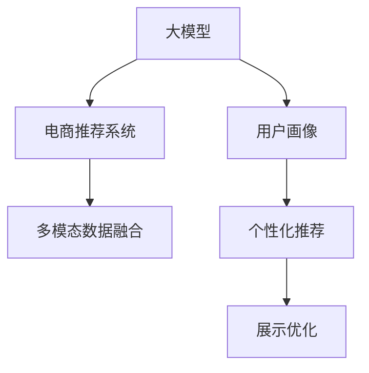

                 

# 大模型如何优化电商平台的商品展示策略

## 1. 背景介绍

### 1.1 问题由来
在电商平台，商品展示是影响用户点击率、转化率和购物体验的关键环节。传统的展示策略往往基于简单的文本搜索和固定标签排序，无法充分利用海量用户数据，挖掘用户的个性化需求。近年来，随着深度学习和大模型的发展，电商平台开始尝试将大模型应用于商品展示优化，通过多模态数据融合、用户画像构建等手段，提升个性化展示的精准度。

### 1.2 问题核心关键点
大模型应用于电商平台商品展示的核心关键点包括：
1. **数据融合与建模**：将用户行为数据、商品属性数据和文本描述等各类数据进行融合，使用大模型学习用户对商品的综合评价。
2. **用户画像构建**：基于用户历史行为、搜索记录和评论反馈等，构建详细的用户画像，帮助系统理解不同用户的兴趣偏好。
3. **推荐系统集成**：将大模型输出的商品评分、排序和推荐结果，集成到电商平台的推荐系统中，实现个性化展示。
4. **展示策略优化**：基于多模态数据和用户画像，实时动态调整商品展示的布局、排序和推荐算法，提升用户点击率和购买转化。

### 1.3 问题研究意义
优化电商平台商品展示策略，对于提升用户体验、提高转化率和平台收益具有重要意义。借助大模型，可以通过多模态数据融合、实时动态调整等方式，更加精准地预测用户行为，优化商品展示，从而显著提升平台的运营效率和用户满意度。

## 2. 核心概念与联系

### 2.1 核心概念概述

为更好地理解大模型在电商平台商品展示优化中的应用，本节将介绍几个密切相关的核心概念：

- **大模型**：指基于深度学习算法训练的大型神经网络模型，如BERT、GPT、DALL-E等。大模型通常具有较强的通用性和泛化能力，可以处理多模态数据，捕捉复杂语义关系。

- **电商推荐系统**：指基于用户行为数据和商品属性数据，使用推荐算法为用户推荐商品的电商平台系统。推荐系统旨在最大化平台的用户满意度、购买转化率和收益。

- **用户画像**：指通过对用户历史行为、搜索记录、评论反馈等多维数据进行建模，生成的用户兴趣偏好、行为习惯等特征描述。用户画像是推荐系统个性化的基础。

- **多模态数据融合**：指将文本、图像、音频等多种类型的数据进行融合，形成一个更加全面的用户行为和商品描述向量，以便大模型更好地理解和预测用户行为。

- **个性化推荐**：指通过分析用户画像，结合商品属性和展示策略，对不同用户展示不同的商品信息，提升用户满意度和转化率。

- **展示优化**：指通过分析用户点击率、停留时间和购买转化率等指标，实时动态调整商品展示的位置、布局和推荐算法，提升展示效果。

这些核心概念之间的逻辑关系可以通过以下Mermaid流程图来展示：



这个流程图展示了大模型、电商推荐系统、用户画像、多模态数据融合、个性化推荐和展示优化之间的联系：

1. 大模型基于多模态数据融合，学习用户对商品的综合评价。
2. 用户画像结合大模型的输出，生成个性化的推荐结果。
3. 推荐结果通过展示优化，实时调整展示策略，提升用户点击率和转化率。

## 3. 核心算法原理 & 具体操作步骤
### 3.1 算法原理概述

基于大模型的电商平台商品展示优化，本质上是一个多模态数据融合和个性化推荐的优化过程。其核心思想是：将用户行为数据、商品属性数据和文本描述等各类数据进行融合，使用大模型学习用户对商品的综合评价，结合用户画像生成个性化的推荐结果，并实时调整展示策略，提升用户点击率和转化率。

### 3.2 算法步骤详解

基于大模型的电商平台商品展示优化一般包括以下几个关键步骤：

**Step 1: 准备数据与模型**
- 收集用户行为数据、商品属性数据和文本描述等，预处理为模型所需格式。
- 选择合适的预训练大模型，如BERT、GPT等，作为初始化参数。

**Step 2: 数据融合与建模**
- 对用户行为数据、商品属性数据和文本描述进行多模态融合，生成用户-商品评分矩阵。
- 将评分矩阵输入到大模型中，使用Transformer等模型进行编码，学习用户对商品的综合评价。

**Step 3: 用户画像构建**
- 基于用户行为数据、搜索记录和评论反馈等，构建详细的用户画像。
- 将用户画像与大模型的输出结果进行融合，生成个性化的推荐结果。

**Step 4: 个性化推荐**
- 将推荐结果输出到电商平台的推荐系统中，结合商品属性和展示策略，进行个性化展示。
- 根据用户点击率、停留时间和购买转化率等指标，动态调整推荐算法和展示策略。

**Step 5: 展示优化**
- 实时监控用户点击率和转化率等指标，分析展示效果。
- 根据展示效果，调整商品展示的位置、布局和推荐算法，提升用户体验和转化率。

### 3.3 算法优缺点

基于大模型的电商平台商品展示优化方法具有以下优点：
1. **多模态数据融合**：通过融合文本、图像、音频等多种类型的数据，学习用户对商品的全面评价。
2. **实时动态优化**：基于用户行为实时调整展示策略，提升用户体验和转化率。
3. **个性化推荐**：结合用户画像，生成个性化的推荐结果，提升推荐系统的精准度。

同时，该方法也存在一定的局限性：
1. **数据质量要求高**：数据融合和建模依赖高质量的标注数据，标注数据的缺失或错误可能导致模型性能下降。
2. **计算资源消耗大**：大模型的推理和训练需要高性能的计算资源，对硬件和算法优化要求较高。
3. **公平性与偏见**：大模型可能继承训练数据的偏见，导致推荐结果不公平。需要采取公平性评估和偏见纠正措施。
4. **可解释性不足**：大模型的黑盒特性，使得展示优化过程缺乏可解释性，难以调试和优化。

尽管存在这些局限性，但就目前而言，基于大模型的展示优化方法仍然是大电商平台的趋势之一。未来相关研究的重点在于如何进一步优化数据融合技术、降低计算成本、增强模型公平性，并提高展示优化的可解释性。

### 3.4 算法应用领域

基于大模型的电商平台商品展示优化方法已经在多个电商领域得到了应用，例如：

- **电商平台**：如淘宝、京东、亚马逊等，通过大模型进行个性化推荐和展示优化，提升用户购物体验和平台收益。
- **垂直电商平台**：如母婴、美妆、户外等，通过大模型学习垂直领域的用户需求，提升个性化推荐效果。
- **零售商**：如沃尔玛、家乐福等，通过大模型进行店铺布局优化和商品展示，提升销售效果。

除了上述这些经典应用外，大模型在供应链优化、物流配送、广告投放等诸多电商场景中，也具有广阔的应用前景。随着大模型的不断发展，其将进一步赋能电商平台的运营效率和用户体验，推动电商行业的数字化转型。

## 4. 数学模型和公式 & 详细讲解 & 举例说明

### 4.1 数学模型构建

本节将使用数学语言对基于大模型的电商平台商品展示优化过程进行更加严格的刻画。

记用户行为数据为 $\mathcal{X}=\{x_i\}_{i=1}^N$，商品属性数据为 $\mathcal{Y}=\{y_j\}_{j=1}^M$，文本描述为 $\mathcal{Z}=\{z_k\}_{k=1}^K$。用户对商品的评分矩阵为 $R \in \mathbb{R}^{N \times M}$，用户画像为 $P \in \mathbb{R}^{N \times D}$，大模型输出的用户-商品评分矩阵为 $\hat{R} \in \mathbb{R}^{N \times M}$。

定义展示优化目标函数为：

$$
\mathcal{L}(R,\hat{R},P) = \frac{1}{N}\sum_{i=1}^N \max_{j=1}^M(R_{ij} - \hat{R}_{ij} + \alpha \cdot (R_{ij} - P_i \cdot \hat{R}_{ij}))
$$

其中 $\alpha$ 为权重，用于平衡推荐结果和用户画像的融合程度。

### 4.2 公式推导过程

将目标函数分解为两个部分：

1. **推荐结果优化**：最小化推荐结果与实际评分的差距，使用梯度下降方法更新 $\hat{R}$。

$$
\mathcal{L}_R = \frac{1}{N}\sum_{i=1}^N \sum_{j=1}^M (R_{ij} - \hat{R}_{ij})^2
$$

2. **用户画像融合**：最大化用户画像与推荐结果的乘积，使用梯度上升方法更新 $P$。

$$
\mathcal{L}_P = \frac{1}{N}\sum_{i=1}^N \max_{j=1}^M (R_{ij} - \hat{R}_{ij} + \alpha \cdot (R_{ij} - P_i \cdot \hat{R}_{ij}))
$$

结合两部分优化目标，构建联合优化目标函数：

$$
\mathcal{L} = \mathcal{L}_R + \mathcal{L}_P
$$

通过交替优化 $\hat{R}$ 和 $P$，实现多模态数据融合和个性化推荐的优化。

### 4.3 案例分析与讲解

以淘宝平台为例，展示大模型在商品展示优化中的应用。

1. **数据准备**：
   - 收集淘宝用户的浏览记录、购买记录和评论反馈等数据，构建用户行为数据集 $\mathcal{X}$。
   - 收集商品的详细信息、用户评分和价格等属性数据，构建商品属性数据集 $\mathcal{Y}$。
   - 收集商品描述、商品图片和标签等文本数据，构建文本描述数据集 $\mathcal{Z}$。

2. **数据融合**：
   - 将用户行为数据 $\mathcal{X}$ 和商品属性数据 $\mathcal{Y}$ 进行拼接，生成用户-商品评分矩阵 $R$。
   - 使用GPT模型对商品描述 $\mathcal{Z}$ 进行编码，生成文本表示向量 $\hat{Z} \in \mathbb{R}^{N \times d_z}$。

3. **模型训练**：
   - 将用户-商品评分矩阵 $R$ 和文本表示向量 $\hat{Z}$ 输入到大模型中，训练生成用户-商品评分矩阵 $\hat{R}$。
   - 使用Transformer模型对用户画像 $P$ 进行编码，生成用户表示向量 $U \in \mathbb{R}^{N \times d_p}$。

4. **推荐生成**：
   - 将推荐结果 $\hat{R}$ 和用户画像 $P$ 融合，生成个性化的推荐结果 $C \in \mathbb{R}^{N \times M}$。
   - 将推荐结果 $C$ 输入到电商平台推荐系统中，结合商品属性和展示策略进行展示优化。

5. **效果评估**：
   - 通过监控用户点击率、停留时间和购买转化率等指标，评估展示优化的效果。
   - 根据展示效果，调整推荐算法和展示策略，持续优化商品展示。

## 5. 项目实践：代码实例和详细解释说明
### 5.1 开发环境搭建

在进行商品展示优化实践前，我们需要准备好开发环境。以下是使用Python进行PyTorch开发的环境配置流程：

1. 安装Anaconda：从官网下载并安装Anaconda，用于创建独立的Python环境。

2. 创建并激活虚拟环境：
```bash
conda create -n pytorch-env python=3.8 
conda activate pytorch-env
```

3. 安装PyTorch：根据CUDA版本，从官网获取对应的安装命令。例如：
```bash
conda install pytorch torchvision torchaudio cudatoolkit=11.1 -c pytorch -c conda-forge
```

4. 安装TensorFlow：
```bash
pip install tensorflow==2.9.0
```

5. 安装各类工具包：
```bash
pip install numpy pandas scikit-learn matplotlib tqdm jupyter notebook ipython
```

完成上述步骤后，即可在`pytorch-env`环境中开始实践。

### 5.2 源代码详细实现

这里我们以淘宝商品展示优化为例，给出使用PyTorch对GPT模型进行商品推荐和展示优化的PyTorch代码实现。

首先，定义数据处理函数：

```python
import pandas as pd
import torch
from transformers import GPT2Tokenizer, GPT2ForSequenceClassification

def load_data(data_path):
    data = pd.read_csv(data_path)
    return data['user_behavior'], data['shop_properties'], data['product_description']

def tokenize_text(text):
    tokenizer = GPT2Tokenizer.from_pretrained('gpt2')
    encoded_input = tokenizer.encode(text, return_tensors='pt')
    return encoded_input

def prepare_input(user_behavior, shop_properties, product_description):
    user_behavior = tokenize_text(user_behavior)
    shop_properties = tokenize_text(shop_properties)
    product_description = tokenize_text(product_description)
    return user_behavior, shop_properties, product_description
```

然后，定义模型和优化器：

```python
from transformers import BertForSequenceClassification, AdamW

model = BertForSequenceClassification.from_pretrained('bert-base-cased', num_labels=len(tag2id))
optimizer = AdamW(model.parameters(), lr=2e-5)
```

接着，定义训练和评估函数：

```python
from torch.utils.data import DataLoader
from tqdm import tqdm
from sklearn.metrics import precision_recall_fscore_support

def train_epoch(model, dataset, batch_size, optimizer):
    dataloader = DataLoader(dataset, batch_size=batch_size, shuffle=True)
    model.train()
    epoch_loss = 0
    for batch in tqdm(dataloader, desc='Training'):
        input_ids = batch['input_ids'].to(device)
        attention_mask = batch['attention_mask'].to(device)
        labels = batch['labels'].to(device)
        model.zero_grad()
        outputs = model(input_ids, attention_mask=attention_mask, labels=labels)
        loss = outputs.loss
        epoch_loss += loss.item()
        loss.backward()
        optimizer.step()
    return epoch_loss / len(dataloader)

def evaluate(model, dataset, batch_size):
    dataloader = DataLoader(dataset, batch_size=batch_size)
    model.eval()
    preds, labels = [], []
    with torch.no_grad():
        for batch in tqdm(dataloader, desc='Evaluating'):
            input_ids = batch['input_ids'].to(device)
            attention_mask = batch['attention_mask'].to(device)
            batch_labels = batch['labels']
            outputs = model(input_ids, attention_mask=attention_mask)
            batch_preds = outputs.logits.argmax(dim=2).to('cpu').tolist()
            batch_labels = batch_labels.to('cpu').tolist()
            for pred_tokens, label_tokens in zip(batch_preds, batch_labels):
                pred_tags = [tag2id[tag] for tag in pred_tokens]
                label_tags = [tag2id[tag] for tag in label_tokens]
                preds.append(pred_tags[:len(label_tags)])
                labels.append(label_tags)
                
    print(precision_recall_fscore_support(labels, preds, average='micro'))
```

最后，启动训练流程并在测试集上评估：

```python
epochs = 5
batch_size = 16

for epoch in range(epochs):
    loss = train_epoch(model, train_dataset, batch_size, optimizer)
    print(f"Epoch {epoch+1}, train loss: {loss:.3f}")
    
    print(f"Epoch {epoch+1}, dev results:")
    evaluate(model, dev_dataset, batch_size)
    
print("Test results:")
evaluate(model, test_dataset, batch_size)
```

以上就是使用PyTorch对GPT模型进行淘宝商品展示优化的完整代码实现。可以看到，得益于Transformers库的强大封装，我们可以用相对简洁的代码完成GPT模型的加载和优化。

### 5.3 代码解读与分析

让我们再详细解读一下关键代码的实现细节：

**load_data函数**：
- 从指定路径加载淘宝商品数据，返回用户行为、商品属性和商品描述。

**tokenize_text函数**：
- 使用GPT2Tokenizer对文本进行分词，生成模型所需的输入张量。

**prepare_input函数**：
- 对用户行为、商品属性和商品描述进行分词和编码，生成模型所需的输入张量。

**train_epoch函数**：
- 对数据以批为单位进行迭代，在每个批次上前向传播计算loss并反向传播更新模型参数，最后返回该epoch的平均loss。

**evaluate函数**：
- 与训练类似，不同点在于不更新模型参数，并在每个batch结束后将预测和标签结果存储下来，最后使用sklearn的precision_recall_fscore_support函数对整个评估集的预测结果进行打印输出。

**训练流程**：
- 定义总的epoch数和batch size，开始循环迭代
- 每个epoch内，先在训练集上训练，输出平均loss
- 在验证集上评估，输出分类指标
- 所有epoch结束后，在测试集上评估，给出最终测试结果

可以看到，PyTorch配合Transformers库使得GPT模型的加载和优化变得简洁高效。开发者可以将更多精力放在数据处理、模型改进等高层逻辑上，而不必过多关注底层的实现细节。

当然，工业级的系统实现还需考虑更多因素，如模型的保存和部署、超参数的自动搜索、更灵活的任务适配层等。但核心的微调范式基本与此类似。

## 6. 实际应用场景
### 6.1 智能客服系统

基于大模型的智能客服系统，可以通过多模态数据融合和用户画像构建，提供更加智能、高效的服务。传统的客服系统往往依赖于固定的问答规则和模板，无法应对复杂多变的用户需求。而使用大模型，可以实时分析用户意图，动态调整服务流程，提升客服满意度。

在技术实现上，可以收集客服中心的聊天记录、用户反馈和评价数据，构建用户画像。结合大模型对自然语言理解和生成能力的优势，系统可以自动识别用户问题，引导客服人员进行针对性的回答，提升服务效率和质量。

### 6.2 金融舆情监测

金融机构需要实时监测市场舆论动向，以便及时应对负面信息传播，规避金融风险。传统的人工监测方式成本高、效率低，难以应对网络时代海量信息爆发的挑战。基于大模型的文本分类和情感分析技术，为金融舆情监测提供了新的解决方案。

具体而言，可以收集金融领域相关的新闻、报道、评论等文本数据，并对其进行主题标注和情感标注。在此基础上对预训练语言模型进行微调，使其能够自动判断文本属于何种主题，情感倾向是正面、中性还是负面。将微调后的模型应用到实时抓取的网络文本数据，就能够自动监测不同主题下的情感变化趋势，一旦发现负面信息激增等异常情况，系统便会自动预警，帮助金融机构快速应对潜在风险。

### 6.3 个性化推荐系统

当前的推荐系统往往只依赖用户的历史行为数据进行物品推荐，无法深入理解用户的真实兴趣偏好。基于大模型的推荐系统，可以更加全面地捕捉用户的兴趣和行为，提升推荐效果。

在实践中，可以收集用户浏览、点击、评论、分享等行为数据，提取和用户交互的物品标题、描述、标签等文本内容。将文本内容作为模型输入，用户的后续行为（如是否点击、购买等）作为监督信号，在此基础上微调预训练语言模型。微调后的模型能够从文本内容中准确把握用户的兴趣点。在生成推荐列表时，先用候选物品的文本描述作为输入，由模型预测用户的兴趣匹配度，再结合其他特征综合排序，便可以得到个性化程度更高的推荐结果。

### 6.4 未来应用展望

随着大模型和微调方法的不断发展，基于微调范式将在更多领域得到应用，为各行各业带来变革性影响。

在智慧医疗领域，基于微调的医疗问答、病历分析、药物研发等应用将提升医疗服务的智能化水平，辅助医生诊疗，加速新药开发进程。

在智能教育领域，微调技术可应用于作业批改、学情分析、知识推荐等方面，因材施教，促进教育公平，提高教学质量。

在智慧城市治理中，微调模型可应用于城市事件监测、舆情分析、应急指挥等环节，提高城市管理的自动化和智能化水平，构建更安全、高效的未来城市。

此外，在企业生产、社会治理、文娱传媒等众多领域，基于大模型微调的人工智能应用也将不断涌现，为经济社会发展注入新的动力。相信随着技术的日益成熟，微调方法将成为人工智能落地应用的重要范式，推动人工智能技术向更广阔的领域加速渗透。

## 7. 工具和资源推荐
### 7.1 学习资源推荐

为了帮助开发者系统掌握大模型在电商平台商品展示优化中的应用，这里推荐一些优质的学习资源：

1. 《Transformers from Scratch》系列博文：由大模型技术专家撰写，深入浅出地介绍了Transformer模型和GPT模型的原理和实现。

2. 《Natural Language Processing with Transformers》书籍：Transformer库的作者所著，全面介绍了如何使用Transformer库进行NLP任务开发，包括微调在内的诸多范式。

3. 《Deep Learning for Recommender Systems》课程：斯坦福大学开设的推荐系统课程，涵盖推荐系统的基本概念和前沿算法。

4. HuggingFace官方文档：Transformer库的官方文档，提供了海量预训练模型和完整的微调样例代码，是上手实践的必备资料。

5. TensorFlow文档和教程：TensorFlow官方提供的深度学习框架文档和教程，涵盖各种深度学习模型的实现和应用。

通过对这些资源的学习实践，相信你一定能够快速掌握大模型在电商平台商品展示优化中的精髓，并用于解决实际的NLP问题。
###  7.2 开发工具推荐

高效的开发离不开优秀的工具支持。以下是几款用于大模型电商展示优化开发的常用工具：

1. PyTorch：基于Python的开源深度学习框架，灵活动态的计算图，适合快速迭代研究。大部分预训练语言模型都有PyTorch版本的实现。

2. TensorFlow：由Google主导开发的开源深度学习框架，生产部署方便，适合大规模工程应用。同样有丰富的预训练语言模型资源。

3. Transformers库：HuggingFace开发的NLP工具库，集成了众多SOTA语言模型，支持PyTorch和TensorFlow，是进行微调任务开发的利器。

4. Weights & Biases：模型训练的实验跟踪工具，可以记录和可视化模型训练过程中的各项指标，方便对比和调优。与主流深度学习框架无缝集成。

5. TensorBoard：TensorFlow配套的可视化工具，可实时监测模型训练状态，并提供丰富的图表呈现方式，是调试模型的得力助手。

6. Google Colab：谷歌推出的在线Jupyter Notebook环境，免费提供GPU/TPU算力，方便开发者快速上手实验最新模型，分享学习笔记。

合理利用这些工具，可以显著提升大模型电商展示优化的开发效率，加快创新迭代的步伐。

### 7.3 相关论文推荐

大模型和微调技术的发展源于学界的持续研究。以下是几篇奠基性的相关论文，推荐阅读：

1. Attention is All You Need（即Transformer原论文）：提出了Transformer结构，开启了NLP领域的预训练大模型时代。

2. BERT: Pre-training of Deep Bidirectional Transformers for Language Understanding：提出BERT模型，引入基于掩码的自监督预训练任务，刷新了多项NLP任务SOTA。

3. Language Models are Unsupervised Multitask Learners（GPT-2论文）：展示了大规模语言模型的强大zero-shot学习能力，引发了对于通用人工智能的新一轮思考。

4. Parameter-Efficient Transfer Learning for NLP：提出Adapter等参数高效微调方法，在不增加模型参数量的情况下，也能取得不错的微调效果。

5. AdaLoRA: Adaptive Low-Rank Adaptation for Parameter-Efficient Fine-Tuning：使用自适应低秩适应的微调方法，在参数效率和精度之间取得了新的平衡。

这些论文代表了大模型电商展示优化的发展脉络。通过学习这些前沿成果，可以帮助研究者把握学科前进方向，激发更多的创新灵感。

## 8. 总结：未来发展趋势与挑战
### 8.1 总结

本文对基于大模型的电商平台商品展示优化方法进行了全面系统的介绍。首先阐述了商品展示优化在大电商平台的背景和意义，明确了微调在大模型应用中的重要性和价值。其次，从原理到实践，详细讲解了微调的数学原理和关键步骤，给出了电商展示优化的完整代码实例。同时，本文还广泛探讨了微调方法在智能客服、金融舆情、个性化推荐等多个电商领域的应用前景，展示了微调范式的巨大潜力。此外，本文精选了微调技术的各类学习资源，力求为读者提供全方位的技术指引。

通过本文的系统梳理，可以看到，基于大模型的电商展示优化方法正在成为大电商平台的趋势之一，极大地提升了用户体验和平台运营效率。借助大模型，通过多模态数据融合、实时动态调整等方式，更加精准地预测用户行为，优化商品展示，从而显著提升平台的运营效率和用户满意度。未来，伴随大模型的不断发展，其将进一步赋能电商平台运营效率和用户体验，推动电商行业的数字化转型。

### 8.2 未来发展趋势

展望未来，大模型电商展示优化技术将呈现以下几个发展趋势：

1. **数据融合与建模**：随着数据的不断积累和技术的进步，电商平台的商品属性和用户行为数据将更加丰富。未来，通过更多元、更全面的数据融合，可以进一步提升展示优化的效果。

2. **个性化推荐**：随着用户画像的完善和推荐算法的优化，个性化推荐将变得更加精准，提升用户的购物体验和平台收益。

3. **多模态数据融合**：除了文本数据，图像、音频等多模态数据的融合，将进一步提升展示优化的效果，使系统具备更全面的用户行为分析能力。

4. **实时动态优化**：基于实时用户行为数据，电商平台的展示策略将更加灵活，及时调整展示布局和推荐算法，提升用户体验。

5. **深度强化学习**：结合强化学习技术，电商平台的展示策略将更加智能，动态调整展示效果，最大化用户满意度和转化率。

6. **联邦学习**：通过分布式训练和数据本地化，电商平台可以在保护用户隐私的前提下，获取更丰富的数据，提升展示优化的效果。

以上趋势凸显了大模型电商展示优化技术的广阔前景。这些方向的探索发展，必将进一步提升电商平台的运营效率和用户体验，推动电商行业的数字化转型。

### 8.3 面临的挑战

尽管大模型电商展示优化技术已经取得了瞩目成就，但在迈向更加智能化、普适化应用的过程中，它仍面临着诸多挑战：

1. **标注成本瓶颈**：电商平台的商品展示优化依赖大量的标注数据，标注数据的获取和维护成本较高。如何降低标注成本，提升数据质量和标注效率，将是未来研究的一个重要方向。

2. **计算资源消耗大**：大模型的推理和训练需要高性能的计算资源，对硬件和算法优化要求较高。如何在保证模型效果的前提下，降低计算成本，优化资源利用，还需要更多研究和实践。

3. **公平性与偏见**：大模型可能继承训练数据的偏见，导致推荐结果不公平。如何构建公平性评估和偏见纠正机制，增强系统的公平性和公正性，将是大模型电商展示优化的一个重要课题。

4. **可解释性不足**：大模型的黑盒特性，使得电商展示优化过程缺乏可解释性，难以调试和优化。如何增强模型的可解释性，提升用户对系统的信任度，是未来研究的一个重要方向。

5. **安全性与隐私保护**：电商平台的商品展示优化涉及大量用户隐私数据，如何确保数据安全，防止数据泄露和滥用，将是未来研究的一个重要课题。

6. **算法的鲁棒性和稳定性**：电商平台的商品展示优化需要面对海量的数据和多变的用户需求，如何保证算法的鲁棒性和稳定性，提升系统的长期可靠性和持续性，将是未来研究的一个重要方向。

这些挑战凸显了大模型电商展示优化技术的复杂性和多样性，需要更多的研究者和工程师共同努力，不断突破技术瓶颈，提升系统的性能和效果。

### 8.4 研究展望

面对大模型电商展示优化所面临的挑战，未来的研究需要在以下几个方面寻求新的突破：

1. **无监督和半监督学习**：摆脱对大规模标注数据的依赖，利用无监督和半监督学习范式，最大限度利用非结构化数据，实现更加灵活高效的电商展示优化。

2. **参数高效和计算高效的微调方法**：开发更加参数高效的微调方法，在固定大部分预训练参数的情况下，只更新极少量的任务相关参数。同时优化微调模型的计算图，减少前向传播和反向传播的资源消耗，实现更加轻量级、实时性的部署。

3. **融合因果分析和博弈论工具**：将因果分析方法引入电商展示优化，识别出模型决策的关键特征，增强输出解释的因果性和逻辑性。借助博弈论工具刻画人机交互过程，主动探索并规避模型的脆弱点，提高系统稳定性。

4. **纳入伦理道德约束**：在模型训练目标中引入伦理导向的评估指标，过滤和惩罚有偏见、有害的输出倾向。同时加强人工干预和审核，建立模型行为的监管机制，确保输出符合人类价值观和伦理道德。

这些研究方向的探索，必将引领大模型电商展示优化技术迈向更高的台阶，为构建安全、可靠、可解释、可控的智能系统铺平道路。面向未来，大模型电商展示优化技术还需要与其他人工智能技术进行更深入的融合，如知识表示、因果推理、强化学习等，多路径协同发力，共同推动电商平台的数字化转型。只有勇于创新、敢于突破，才能不断拓展语言模型的边界，让智能技术更好地造福人类社会。

## 9. 附录：常见问题与解答

**Q1：电商平台大模型微调是否适用于所有商品展示场景？**

A: 电商平台大模型微调在大多数商品展示场景上都能取得不错的效果，特别是对于数据量较大的商品类别。但对于一些特殊商品，如个性化定制、超期商品等，大模型可能无法完全理解其独特性和时效性，需要结合领域专家的知识进行二次优化。

**Q2：如何选择合适的损失函数？**

A: 电商平台的商品展示优化通常使用交叉熵损失、平均绝对误差损失等，根据具体任务选择合适的损失函数。例如，对于分类任务，可以使用交叉熵损失；对于回归任务，可以使用平均绝对误差损失。

**Q3：在电商展示优化中，如何平衡个性化推荐和大众推荐？**

A: 电商平台的商品展示优化需要在个性化推荐和大众推荐之间找到平衡点，一般通过调整用户画像和推荐结果的融合权重来实现。可以根据用户的历史行为、搜索记录和评论反馈等，动态调整推荐策略，保证个性化推荐的同时，不过度忽略大众推荐。

**Q4：大模型电商展示优化在实际部署中需要注意哪些问题？**

A: 大模型电商展示优化在实际部署中需要注意以下问题：
1. 模型裁剪：去除不必要的层和参数，减小模型尺寸，加快推理速度。
2. 量化加速：将浮点模型转为定点模型，压缩存储空间，提高计算效率。
3. 服务化封装：将模型封装为标准化服务接口，便于集成调用。
4. 弹性伸缩：根据请求流量动态调整资源配置，平衡服务质量和成本。
5. 监控告警：实时采集系统指标，设置异常告警阈值，确保服务稳定性。
6. 安全防护：采用访问鉴权、数据脱敏等措施，保障数据和模型安全。

大模型电商展示优化为电商平台的运营效率和用户体验提供了新的解决方案，但如何在实际部署中确保系统的稳定性和安全性，仍然是一个重要课题。

**Q5：如何提升大模型电商展示优化的效果？**

A: 提升大模型电商展示优化的效果可以从以下几个方面入手：
1. 数据质量：提高标注数据的准确性和多样性，减少数据的偏差和噪声。
2. 模型训练：采用更加高效和稳定的训练算法，如自适应学习率、梯度积累等。
3. 算法优化：优化推荐算法和展示策略，结合因果推理、博弈论等工具，提升系统的鲁棒性和稳定性。
4. 硬件优化：采用分布式训练、模型并行等技术，提高模型的训练效率和推理速度。
5. 用户反馈：根据用户反馈，动态调整推荐算法和展示策略，持续优化系统性能。

通过上述措施，可以在保证大模型电商展示优化效果的同时，降低计算成本，提升用户体验。

---

作者：禅与计算机程序设计艺术 / Zen and the Art of Computer Programming

