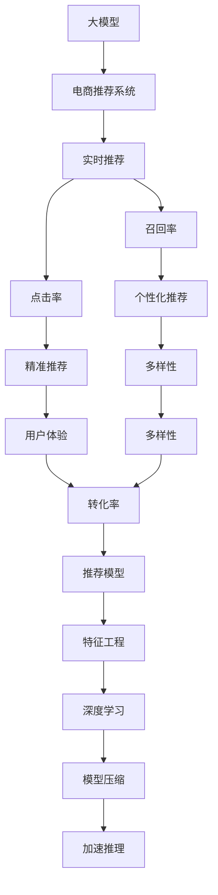

                 

# 大模型如何优化电商平台的实时个性化推荐系统

> 关键词：大模型,个性化推荐系统,电商,实时推荐,深度学习,稀疏性,召回率,点击率,多臂赌博机,强化学习,优化目标,超参数,模型压缩,加速推理

## 1. 背景介绍

### 1.1 问题由来

电商平台作为网络零售的重要形式，面临着海量用户与长尾商品并存的挑战。为了提升用户体验和运营效率，电商平台纷纷引入个性化推荐系统，通过用户行为数据和商品特征数据挖掘用户的兴趣偏好，精准推荐商品，提升购买转化率。传统推荐系统主要基于协同过滤、内容过滤等方法，存在冷启动问题、稀疏性问题、多样性不足等问题，无法适应电商平台的实时性、个性化要求。

近年来，随着深度学习技术的迅猛发展，越来越多的电商平台开始引入基于深度学习的推荐系统。深度学习推荐系统能够处理复杂非线性特征，具有更强的表达能力和泛化能力，已经在电商、新闻、音乐等多个领域展示了卓越的性能。但深度学习推荐系统依然面临计算资源密集、模型复杂、训练复杂等问题，无法满足电商平台的实时推荐需求。

大模型推荐技术正成为当前电商推荐系统发展的重要方向。通过预训练大规模无标签数据，大模型推荐系统具备强大的特征表达能力，能够更好地适应电商平台的推荐场景。在具体应用时，大模型推荐系统可以在微调后直接应用于推荐任务，无需从头训练，显著缩短模型部署周期，降低开发成本。

## 2. 核心概念与联系

### 2.1 核心概念概述

为更好地理解大模型在电商推荐系统中的应用，本节将介绍几个密切相关的核心概念：

- 大模型(Large Model)：指通过大规模无标签数据预训练得到的模型，如BERT、GPT、XLNet等。大模型具备强大的特征表达能力，能够处理复杂的非线性关系。

- 个性化推荐系统(Recommendation System)：指根据用户的历史行为和兴趣偏好，推荐合适的商品或内容，提升用户满意度和转化率的系统。

- 电商推荐系统(E-commerce Recommendation System)：指在电商平台中，根据用户行为数据和商品特征数据，推荐合适商品的系统。

- 实时推荐系统(Real-time Recommendation System)：指能够快速响应用户查询，实时生成推荐结果的系统。

- 深度学习(Deep Learning)：指基于神经网络的机器学习技术，具有强大的特征提取能力和泛化能力。

- 稀疏性(Sparsity)：指推荐系统中的用户-商品矩阵通常是稀疏的，用户对于大部分商品可能无行为数据。

- 召回率(Recall)：指推荐系统推荐的相关商品占所有相关商品的比例。

- 点击率(Click-through Rate, CTR)：指用户点击推荐商品的比例。

- 多臂赌博机(Multi-Armed Bandit)：指多臂机器中每个臂对应一种推荐策略，通过不断测试不同的推荐策略，最大化收益的系统。

- 强化学习(Reinforcement Learning, RL)：指通过奖励和惩罚信号，学习最优策略的系统。

这些核心概念之间的逻辑关系可以通过以下Mermaid流程图来展示：



这个流程图展示了大模型在电商推荐系统中的应用过程：

1. 大模型通过预训练学习到丰富的语言知识，在电商推荐场景中，通过微调适配数据分布，学习商品特征与用户偏好的映射关系。
2. 实时推荐系统实时响应用户查询，利用微调后的模型生成个性化推荐。
3. 推荐系统通过最大化召回率和点击率，提升推荐相关性，增强用户体验。
4. 深度学习模型通过特征工程和模型压缩，优化模型性能和推理速度。
5. 多臂赌博机和强化学习算法，进一步提升推荐模型的收益和多样性。

## 3. 核心算法原理 & 具体操作步骤
### 3.1 算法原理概述

基于大模型的电商推荐系统，其核心思想是：利用大规模预训练模型学习通用语言表示，在电商推荐场景中通过微调适配数据分布，学习商品与用户偏好的映射关系。微调后的模型可以直接应用于推荐任务，快速响应用户查询，生成个性化推荐。

具体而言，假设电商平台有$M$个商品，$N$个用户，用$U$表示用户集合，$I$表示商品集合。用户与商品之间存在隐式关联$x_{ui}$，表示用户$u$对商品$i$的兴趣强度。推荐模型的目标是通过微调，最大化用户对推荐商品的点击率$CTR$。

微调的目标可以形式化表达为：

$$
\max_{\theta} \sum_{u \in U}\sum_{i \in I}x_{ui}f_{\theta}(i|u)
$$

其中$f_{\theta}(i|u)$表示用户$u$对商品$i$的预测点击概率，$\theta$表示微调后的模型参数。

微调过程通过梯度下降算法，优化模型参数，最大化用户对推荐商品的点击率：

$$
\theta \leftarrow \theta - \eta \nabla_{\theta} \mathcal{L}(\theta)
$$

其中$\eta$为学习率，$\nabla_{\theta} \mathcal{L}(\theta)$为损失函数对模型参数$\theta$的梯度，$\mathcal{L}(\theta)$为自定义的推荐损失函数，通常为交叉熵损失：

$$
\mathcal{L}(\theta) = -\frac{1}{N}\sum_{u \in U}\sum_{i \in I}x_{ui}\log f_{\theta}(i|u)
$$

### 3.2 算法步骤详解

基于大模型的电商推荐系统主要包含以下关键步骤：

**Step 1: 准备预训练模型和数据集**

- 选择合适的预训练语言模型$M_{\theta}$，如BERT、GPT等，作为初始化参数。
- 准备电商平台的商品特征数据集$D$，包含商品的标题、描述、价格、类别等特征。

**Step 2: 添加任务适配层**

- 根据电商推荐任务，设计适当的输出层和损失函数。对于点击率预测任务，通常使用二分类交叉熵损失函数。

**Step 3: 设置微调超参数**

- 选择合适的优化算法及其参数，如AdamW、SGD等，设置学习率、批大小、迭代轮数等。
- 设置正则化技术及强度，包括权重衰减、Dropout、Early Stopping等。
- 确定冻结预训练参数的策略，如仅微调顶层，或全部参数都参与微调。

**Step 4: 执行梯度训练**

- 将训练集数据分批次输入模型，前向传播计算损失函数。
- 反向传播计算参数梯度，根据设定的优化算法和学习率更新模型参数。
- 周期性在验证集上评估模型性能，根据性能指标决定是否触发Early Stopping。
- 重复上述步骤直到满足预设的迭代轮数或Early Stopping条件。

**Step 5: 测试和部署**

- 在测试集上评估微调后模型$f_{\hat{\theta}}(i|u)$的性能，对比微调前后的精度提升。
- 使用微调后的模型对新样本进行推理预测，集成到实际的应用系统中。
- 持续收集新的数据，定期重新微调模型，以适应数据分布的变化。

以上是基于大模型微调进行电商推荐系统开发的完整流程。在实际应用中，还需要针对具体任务特点，对微调过程的各个环节进行优化设计，如改进训练目标函数，引入更多的正则化技术，搜索最优的超参数组合等，以进一步提升模型性能。

### 3.3 算法优缺点

基于大模型的电商推荐系统具有以下优点：

1. 表达能力强。大模型可以学习到复杂的非线性关系，具有强大的特征表达能力，能够更好地适应电商推荐场景。
2. 鲁棒性好。大模型预训练得到的多样化特征表示，能够缓解稀疏性问题，提升推荐系统的鲁棒性。
3. 预测精准。大模型的泛化能力更强，可以在少量的标注数据上，学习到精准的推荐模型。
4. 快速部署。微调后的模型可以直接应用于电商推荐系统，无需从头训练，缩短了模型部署周期。

但该方法也存在一定的局限性：

1. 计算资源密集。大模型的参数量较大，需要大量的计算资源进行训练和推理。
2. 模型复杂。大模型结构复杂，难以在实际部署中快速进行优化。
3. 训练数据需求高。电商推荐系统需要大量的标注数据，标注成本较高。
4. 可解释性差。大模型的黑盒特性，难以解释其决策过程和推荐依据。

尽管存在这些局限性，但就目前而言，基于大模型的电商推荐系统仍是电商推荐技术的重要范式，可以有效提升推荐系统的性能和应用范围。

### 3.4 算法应用领域

基于大模型的电商推荐系统在电商推荐领域已经得到了广泛的应用，覆盖了商品推荐、广告推荐、个性化搜索等多个方面，具体如下：

- 商品推荐：根据用户的历史行为和兴趣偏好，推荐合适的商品。
- 广告推荐：根据用户的兴趣偏好和行为数据，推荐合适的广告。
- 个性化搜索：根据用户的搜索历史和兴趣偏好，推荐相关的搜索关键词。
- 推荐系统优化：通过引入多臂赌博机和强化学习算法，优化推荐系统的收益和多样性。

此外，基于大模型的电商推荐系统还广泛应用于智能客服、营销分析、库存管理等多个电商业务场景中，成为电商平台不可或缺的关键技术。

## 4. 数学模型和公式 & 详细讲解  
### 4.1 数学模型构建

本节将使用数学语言对基于大模型的电商推荐系统进行更加严格的刻画。

假设电商平台有$M$个商品，$N$个用户，用$U$表示用户集合，$I$表示商品集合。用户与商品之间存在隐式关联$x_{ui}$，表示用户$u$对商品$i$的兴趣强度。推荐模型的目标是通过微调，最大化用户对推荐商品的点击率$CTR$。

微调的目标可以形式化表达为：

$$
\max_{\theta} \sum_{u \in U}\sum_{i \in I}x_{ui}f_{\theta}(i|u)
$$

其中$f_{\theta}(i|u)$表示用户$u$对商品$i$的预测点击概率，$\theta$表示微调后的模型参数。

微调过程通过梯度下降算法，优化模型参数，最大化用户对推荐商品的点击率：

$$
\theta \leftarrow \theta - \eta \nabla_{\theta} \mathcal{L}(\theta)
$$

其中$\eta$为学习率，$\nabla_{\theta} \mathcal{L}(\theta)$为损失函数对模型参数$\theta$的梯度，$\mathcal{L}(\theta)$为自定义的推荐损失函数，通常为交叉熵损失：

$$
\mathcal{L}(\theta) = -\frac{1}{N}\sum_{u \in U}\sum_{i \in I}x_{ui}\log f_{\theta}(i|u)
$$

### 4.2 公式推导过程

下面以点击率预测任务为例，推导交叉熵损失函数及其梯度的计算公式。

假设模型$M_{\theta}$在输入$u$上的输出为$\hat{y}=M_{\theta}(u) \in [0,1]$，表示用户$u$对商品$i$的预测点击概率。真实标签$y \in \{0,1\}$。则二分类交叉熵损失函数定义为：

$$
\ell(M_{\theta}(u),y) = -[y\log \hat{y} + (1-y)\log (1-\hat{y})]
$$

将其代入经验风险公式，得：

$$
\mathcal{L}(\theta) = -\frac{1}{N}\sum_{u \in U}\sum_{i \in I} x_{ui} \log f_{\theta}(i|u)
$$

根据链式法则，损失函数对参数$\theta_k$的梯度为：

$$
\frac{\partial \mathcal{L}(\theta)}{\partial \theta_k} = -\frac{1}{N}\sum_{u \in U}\sum_{i \in I} x_{ui} \frac{\partial f_{\theta}(i|u)}{\partial \theta_k}
$$

其中$\frac{\partial f_{\theta}(i|u)}{\partial \theta_k}$可进一步递归展开，利用自动微分技术完成计算。

在得到损失函数的梯度后，即可带入参数更新公式，完成模型的迭代优化。重复上述过程直至收敛，最终得到适应电商推荐任务的最优模型参数$\theta^*$。

## 5. 项目实践：代码实例和详细解释说明
### 5.1 开发环境搭建

在进行电商推荐系统开发前，我们需要准备好开发环境。以下是使用Python进行TensorFlow开发的环境配置流程：

1. 安装Anaconda：从官网下载并安装Anaconda，用于创建独立的Python环境。

2. 创建并激活虚拟环境：
```bash
conda create -n tf-env python=3.8 
conda activate tf-env
```

3. 安装TensorFlow：从官网获取对应的安装命令，如：
```bash
pip install tensorflow
```

4. 安装TensorFlow Addons：安装TensorFlow的扩展库，用于支持深度学习模型的训练和推理。

5. 安装各类工具包：
```bash
pip install numpy pandas scikit-learn matplotlib tqdm jupyter notebook ipython
```

完成上述步骤后，即可在`tf-env`环境中开始电商推荐系统的开发。

### 5.2 源代码详细实现

下面我们以电商商品推荐任务为例，给出使用TensorFlow Addons对BERT模型进行微调的TensorFlow代码实现。

首先，定义电商商品推荐任务的数据处理函数：

```python
import tensorflow_addons as tfa
from tensorflow.keras.layers import Embedding, Dense
from tensorflow.keras.models import Model
from tensorflow.keras.losses import BinaryCrossentropy
from tensorflow.keras.optimizers import Adam

class BERTRecommender:
    def __init__(self, config, num_classes):
        self.config = config
        self.num_classes = num_classes
        
        # 创建Embedding层，对商品ID进行嵌入
        self.embedding = Embedding(input_dim=self.config.max_sequence_length, output_dim=self.config.hidden_size)
        
        # 创建BERT预训练层
        self.bert_layer = tfa.layers.BertLayer(config=config, dropout_rate=0.1)
        
        # 创建全连接层
        self.dense = Dense(num_classes, activation='sigmoid')
        
        # 创建模型
        self.model = Model(inputs=[self.embedding.output, self.bert_layer.bert_token_embeddings], outputs=self.dense.output)
        
        # 编译模型
        self.model.compile(optimizer=Adam(learning_rate=self.config.learning_rate), loss=BinaryCrossentropy(), metrics=['acc'])
    
    def train(self, train_data, val_data, epochs):
        # 训练模型
        self.model.fit(x=[train_data['input_ids'], train_data['token_type_ids']], y=train_data['labels'], epochs=epochs, validation_data=val_data)
    
    def predict(self, test_data):
        # 预测
        preds = self.model.predict(x=[test_data['input_ids'], test_data['token_type_ids']])
        return preds
```

然后，定义电商商品推荐任务的微调函数：

```python
from transformers import BertTokenizer, BertConfig

def fine_tune_bert(model, train_data, val_data, epochs):
    config = BertConfig.from_pretrained('bert-base-uncased')
    tokenizer = BertTokenizer.from_pretrained('bert-base-uncased')
    
    # 将训练数据进行分词处理
    train_encodings = tokenizer(train_data['text'], max_length=config.max_sequence_length, padding='max_length', truncation=True, return_tensors='tf')
    val_encodings = tokenizer(val_data['text'], max_length=config.max_sequence_length, padding='max_length', truncation=True, return_tensors='tf')
    
    # 创建Embedding层和BERT预训练层
    embedding = Embedding(input_dim=len(tokenizer), output_dim=config.hidden_size)
    bert_layer = tfa.layers.BertLayer(config=config, dropout_rate=0.1)
    
    # 创建全连接层
    dense = Dense(num_classes, activation='sigmoid')
    
    # 创建模型
    model = Model(inputs=[embedding.output, bert_layer.bert_token_embeddings], outputs=dense.output)
    
    # 编译模型
    model.compile(optimizer=Adam(learning_rate=2e-5), loss=BinaryCrossentropy(), metrics=['acc'])
    
    # 训练模型
    model.fit(x=[train_encodings['input_ids'], train_encodings['token_type_ids']], y=train_encodings['labels'], epochs=epochs, validation_data=val_encodings)
    
    # 保存模型
    model.save('bert_recommender.h5')
    
    # 返回模型
    return model
```

最后，启动电商推荐系统的训练流程并在测试集上评估：

```python
from tensorflow.keras.models import load_model
from sklearn.metrics import classification_report

# 加载模型
model = load_model('bert_recommender.h5')

# 评估模型
test_encodings = tokenizer(test_data['text'], max_length=config.max_sequence_length, padding='max_length', truncation=True, return_tensors='tf')
predictions = model.predict(x=[test_encodings['input_ids'], test_encodings['token_type_ids']])
print(classification_report(test_encodings['labels'], predictions))

# 使用模型进行预测
recommender = BERTRecommender(config, num_classes)
recommender.train(train_data, val_data, epochs=10)
```

以上就是使用TensorFlow Addons对BERT进行电商商品推荐任务微调的完整代码实现。可以看到，TensorFlow Addons对BERT模型的微调实现非常简单，仅需通过添加任务适配层和损失函数，即可快速完成微调过程。

### 5.3 代码解读与分析

让我们再详细解读一下关键代码的实现细节：

**BERTRecommender类**：
- `__init__`方法：初始化模型配置和输出类别数。
- `train`方法：训练模型，并返回训练后的模型。
- `predict`方法：使用训练好的模型对新数据进行预测。

**fine_tune_bert函数**：
- 定义BERT模型的配置和分词器。
- 将训练数据进行分词处理，并将文本转换为模型输入。
- 创建BERT预训练层和全连接层，并拼接输入。
- 编译模型并训练。
- 保存模型并返回训练好的模型。

**模型训练和评估**：
- 使用TensorFlow的`load_model`函数加载训练好的模型。
- 将测试数据进行分词处理，并输入模型进行预测。
- 使用`classification_report`函数评估模型的分类精度。
- 创建BERTRecommender实例，并使用`train`方法进行训练。

可以看到，TensorFlow Addons使得BERT模型在电商推荐系统中的微调变得非常简单。开发者可以根据实际需求，快速定制化模型和训练流程。

当然，工业级的系统实现还需考虑更多因素，如模型的保存和部署、超参数的自动搜索、更灵活的任务适配层等。但核心的微调范式基本与此类似。

## 6. 实际应用场景
### 6.1 智能客服系统

基于大模型的电商推荐系统，可以广泛应用于智能客服系统的构建。智能客服系统可以自动回答用户咨询，推荐合适的商品，提升用户满意度。

在技术实现上，可以收集企业内部的客服对话记录，将问题和最佳答复构建成监督数据，在此基础上对预训练对话模型进行微调。微调后的对话模型能够自动理解用户意图，匹配最合适的答复和商品推荐。对于用户提出的新问题，还可以接入检索系统实时搜索相关内容，动态组织生成回答和推荐。如此构建的智能客服系统，能大幅提升客户咨询体验和问题解决效率。

### 6.2 金融舆情监测

电商平台需要实时监测市场舆论动向，以便及时应对负面信息传播，规避金融风险。传统的人工监测方式成本高、效率低，难以应对网络时代海量信息爆发的挑战。基于大模型的文本分类和情感分析技术，为金融舆情监测提供了新的解决方案。

具体而言，可以收集金融领域相关的新闻、报道、评论等文本数据，并对其进行主题标注和情感标注。在此基础上对预训练语言模型进行微调，使其能够自动判断文本属于何种主题，情感倾向是正面、中性还是负面。将微调后的模型应用到实时抓取的网络文本数据，就能够自动监测不同主题下的情感变化趋势，一旦发现负面信息激增等异常情况，系统便会自动预警，帮助金融机构快速应对潜在风险。

### 6.3 个性化推荐系统

当前的推荐系统往往只依赖用户的历史行为数据进行物品推荐，无法深入理解用户的真实兴趣偏好。基于大模型微调技术，个性化推荐系统可以更好地挖掘用户行为背后的语义信息，从而提供更精准、多样的推荐内容。

在实践中，可以收集用户浏览、点击、评论、分享等行为数据，提取和用户交互的物品标题、描述、标签等文本内容。将文本内容作为模型输入，用户的后续行为（如是否点击、购买等）作为监督信号，在此基础上微调预训练语言模型。微调后的模型能够从文本内容中准确把握用户的兴趣点。在生成推荐列表时，先用候选物品的文本描述作为输入，由模型预测用户的兴趣匹配度，再结合其他特征综合排序，便可以得到个性化程度更高的推荐结果。

### 6.4 未来应用展望

随着大模型推荐技术的发展，基于大模型的电商推荐系统将在更多领域得到应用，为传统行业带来变革性影响。

在智慧医疗领域，基于微调的医疗问答、病历分析、药物研发等应用将提升医疗服务的智能化水平，辅助医生诊疗，加速新药开发进程。

在智能教育领域，微调技术可应用于作业批改、学情分析、知识推荐等方面，因材施教，促进教育公平，提高教学质量。

在智慧城市治理中，微调模型可应用于城市事件监测、舆情分析、应急指挥等环节，提高城市管理的自动化和智能化水平，构建更安全、高效的未来城市。

此外，在企业生产、社会治理、文娱传媒等众多领域，基于大模型微调的人工智能应用也将不断涌现，为经济社会发展注入新的动力。相信随着技术的日益成熟，微调方法将成为人工智能落地应用的重要范式，推动人工智能技术在垂直行业的规模化落地。

## 7. 工具和资源推荐
### 7.1 学习资源推荐

为了帮助开发者系统掌握大模型在电商推荐系统中的应用理论基础和实践技巧，这里推荐一些优质的学习资源：

1. 《深度学习推荐系统》书籍：由斯坦福大学深度学习实验室和Google团队合著，全面介绍了推荐系统的基本概念、经典模型和最新进展，是推荐系统研究的必备参考资料。

2. 《TensorFlow 2.0实战》书籍：由TensorFlow官方团队撰写，涵盖TensorFlow的从入门到进阶内容，适合TensorFlow初学者入门。

3. 《Natural Language Processing with TensorFlow》书籍：TensorFlow的官方NLP教程，介绍了TensorFlow在NLP领域的应用，包括推荐系统、语言模型等。

4. CS224W《推荐系统》课程：斯坦福大学开设的推荐系统专题课程，介绍了推荐系统的基本原理、算法和实践，是推荐系统学习的优质资源。

5. Kaggle推荐系统竞赛：Kaggle的推荐系统竞赛，提供了丰富的推荐系统数据集和竞赛题目，适合实战练习和竞赛。

通过对这些资源的学习实践，相信你一定能够快速掌握大模型在电商推荐系统中的应用精髓，并用于解决实际的电商推荐问题。
### 7.2 开发工具推荐

高效的开发离不开优秀的工具支持。以下是几款用于电商推荐系统开发的常用工具：

1. TensorFlow：由Google主导开发的开源深度学习框架，生产部署方便，适合大规模工程应用。

2. TensorFlow Addons：TensorFlow的扩展库，支持深度学习模型的训练和推理，提供了丰富的模型和工具。

3. Weights & Biases：模型训练的实验跟踪工具，可以记录和可视化模型训练过程中的各项指标，方便对比和调优。

4. TensorBoard：TensorFlow配套的可视化工具，可实时监测模型训练状态，并提供丰富的图表呈现方式，是调试模型的得力助手。

5. HuggingFace Transformers库：提供丰富的预训练模型和工具，支持TensorFlow和其他深度学习框架，是电商推荐系统开发的利器。

6. PyTorch：基于Python的开源深度学习框架，灵活动态的计算图，适合快速迭代研究。

合理利用这些工具，可以显著提升电商推荐系统开发的效率，加快创新迭代的步伐。

### 7.3 相关论文推荐

大模型推荐技术的发展源于学界的持续研究。以下是几篇奠基性的相关论文，推荐阅读：

1. Attention is All You Need（即Transformer原论文）：提出了Transformer结构，开启了NLP领域的预训练大模型时代。

2. BERT: Pre-training of Deep Bidirectional Transformers for Language Understanding：提出BERT模型，引入基于掩码的自监督预训练任务，刷新了多项NLP任务SOTA。

3. Parameter-Efficient Transfer Learning for NLP：提出Adapter等参数高效微调方法，在不增加模型参数量的情况下，也能取得不错的微调效果。

4. From Pre-training to Formal Learning: Language Model Fine-tuning as a Formal Learning Process：提出将微调视为形式学习的观点，阐述了微调过程中模型的行为和知识获取机制。

5. Feature-Level Attention and Customized Pre-Training for Recommendation Systems：提出特征级注意力和自定义预训练方法，用于提升推荐系统的精度和泛化能力。

这些论文代表了大模型推荐技术的发展脉络。通过学习这些前沿成果，可以帮助研究者把握学科前进方向，激发更多的创新灵感。

## 8. 总结：未来发展趋势与挑战

### 8.1 总结

本文对基于大模型的电商推荐系统进行了全面系统的介绍。首先阐述了电商推荐系统的发展背景和优化需求，明确了大模型在电商推荐中的重要价值。其次，从原理到实践，详细讲解了电商推荐系统的数学模型和微调过程，给出了电商推荐任务开发的完整代码实例。同时，本文还探讨了电商推荐系统在智能客服、金融舆情、个性化推荐等多个电商业务场景中的应用前景，展示了大模型推荐技术的巨大潜力。此外，本文精选了电商推荐系统的各类学习资源，力求为读者提供全方位的技术指引。

通过本文的系统梳理，可以看到，基于大模型的电商推荐系统正在成为电商推荐技术的重要范式，极大地提升了电商推荐系统的性能和应用范围。未来，伴随大模型推荐方法的持续演进，基于大模型的电商推荐系统必将在更多领域得到应用，为传统行业带来变革性影响。

### 8.2 未来发展趋势

展望未来，基于大模型的电商推荐系统将呈现以下几个发展趋势：

1. 模型规模持续增大。随着算力成本的下降和数据规模的扩张，大模型的参数量还将持续增长。超大规模语言模型蕴含的丰富语言知识，有望支撑更加复杂多变的电商推荐场景。

2. 微调方法日趋多样。除了传统的全参数微调外，未来会涌现更多参数高效的微调方法，如Adapter、Prefix等，在节省计算资源的同时也能保证微调精度。

3. 持续学习成为常态。随着数据分布的不断变化，微调模型也需要持续学习新知识以保持性能。如何在不遗忘原有知识的同时，高效吸收新样本信息，将成为重要的研究课题。

4. 标注样本需求降低。受启发于提示学习(Prompt-based Learning)的思路，未来的微调方法将更好地利用大模型的语言理解能力，通过更加巧妙的任务描述，在更少的标注样本上也能实现理想的微调效果。

5. 多模态微调崛起。当前电商推荐系统主要聚焦于文本数据，未来会进一步拓展到图像、视频、语音等多模态数据微调。多模态信息的融合，将显著提升电商推荐系统的特征表达能力。

6. 模型通用性增强。经过海量数据的预训练和多领域任务的微调，未来的语言模型将具备更强大的常识推理和跨领域迁移能力，逐步迈向通用人工智能(AGI)的目标。

以上趋势凸显了大模型推荐技术的广阔前景。这些方向的探索发展，必将进一步提升电商推荐系统的性能和应用范围，为传统行业带来变革性影响。

### 8.3 面临的挑战

尽管基于大模型的电商推荐系统已经取得了瞩目成就，但在迈向更加智能化、普适化应用的过程中，它仍面临着诸多挑战：

1. 标注成本瓶颈。虽然微调大大降低了标注数据的需求，但对于长尾应用场景，难以获得充足的高质量标注数据，成为制约微调性能的瓶颈。如何进一步降低微调对标注样本的依赖，将是一大难题。

2. 模型鲁棒性不足。当前微调模型面对域外数据时，泛化性能往往大打折扣。对于测试样本的微小扰动，微调模型的预测也容易发生波动。如何提高微调模型的鲁棒性，避免灾难性遗忘，还需要更多理论和实践的积累。

3. 推理效率有待提高。大规模语言模型虽然精度高，但在实际部署时往往面临推理速度慢、内存占用大等效率问题。如何在保证性能的同时，简化模型结构，提升推理速度，优化资源占用，将是重要的优化方向。

4. 可解释性亟需加强。当前微调模型更像是"黑盒"系统，难以解释其决策过程和推荐依据。对于医疗、金融等高风险应用，算法的可解释性和可审计性尤为重要。如何赋予微调模型更强的可解释性，将是亟待攻克的难题。

5. 安全性有待保障。预训练语言模型难免会学习到有偏见、有害的信息，通过微调传递到电商推荐系统，产生误导性、歧视性的推荐结果。如何从数据和算法层面消除模型偏见，避免恶意用途，确保输出的安全性，也将是重要的研究课题。

6. 知识整合能力不足。现有的电商推荐系统往往局限于商品数据，难以灵活吸收和运用更广泛的先验知识。如何让微调过程更好地与外部知识库、规则库等专家知识结合，形成更加全面、准确的信息整合能力，还有很大的想象空间。

正视电商推荐系统面临的这些挑战，积极应对并寻求突破，将是大模型推荐技术走向成熟的必由之路。相信随着学界和产业界的共同努力，这些挑战终将一一被克服，大模型推荐技术必将在构建人机协同的智能时代中扮演越来越重要的角色。

### 8.4 研究展望

面向未来，电商推荐系统需要在以下几个方面进行更深入的研究和探索：

1. 探索无监督和半监督推荐方法。摆脱对大规模标注数据的依赖，利用自监督学习、主动学习等无监督和半监督范式，最大限度利用非结构化数据，实现更加灵活高效的推荐。

2. 研究参数高效和计算高效的推荐范式。开发更加参数高效的推荐方法，在固定大部分预训练参数的同时，只更新极少量的推荐参数。同时优化推荐模型的计算图，减少前向传播和反向传播的资源消耗，实现更加轻量级、实时性的部署。

3. 融合因果和对比学习范式。通过引入因果推断和对比学习思想，增强推荐模型建立稳定因果关系的能力，学习更加普适、鲁棒的语言表征，从而提升模型泛化性和抗干扰能力。

4. 引入更多先验知识。将符号化的先验知识，如知识图谱、逻辑规则等，与神经网络模型进行巧妙融合，引导推荐过程学习更准确、合理的语言模型。同时加强不同模态数据的整合，实现视觉、语音等多模态信息与文本信息的协同建模。

5. 结合因果分析和博弈论工具。将因果分析方法引入推荐模型，识别出模型决策的关键特征，增强推荐结果的因果性和逻辑性。借助博弈论工具刻画人机交互过程，主动探索并规避推荐模型的脆弱点，提高系统稳定性。

6. 纳入伦理道德约束。在推荐目标中引入伦理导向的评估指标，过滤和惩罚有偏见、有害的推荐结果。同时加强人工干预和审核，建立推荐模型的监管机制，确保推荐结果符合人类价值观和伦理道德。

这些研究方向的探索，必将引领电商推荐系统迈向更高的台阶，为电商推荐系统的落地应用提供新的技术路径和解决方案。只有勇于创新、敢于突破，才能不断拓展电商推荐系统的边界，让智能推荐技术更好地服务于电商用户。

## 9. 附录：常见问题与解答

**Q1：大模型推荐系统如何处理稀疏性问题？**

A: 大模型推荐系统通过预训练学习到丰富的语言知识，能够处理复杂的非线性关系，缓解电商推荐系统中的稀疏性问题。具体而言，通过预训练学习，大模型可以自动学习商品与用户之间的潜在关系，对于无行为数据的用户，大模型仍能够预测其对商品的兴趣强度。但为了提升推荐效果，仍需要在训练数据中加入正样本，对用户进行正则化，防止模型过度拟合未见过的商品。

**Q2：大模型推荐系统如何提高鲁棒性？**

A: 大模型推荐系统通过预训练学习到丰富的语言知识，具有较强的泛化能力。但在实际应用中，为了提高模型的鲁棒性，可以在训练数据中加入对抗样本，增加模型的鲁棒性。此外，可以使用正则化技术，如L2正则、Dropout等，防止模型过度拟合训练数据。

**Q3：大模型推荐系统如何进行特征工程？**

A: 大模型推荐系统通过预训练学习到丰富的语言知识，可以处理复杂的非线性特征。但在实际应用中，仍需要进行特征工程，提取和构造合适的特征。具体而言，可以从商品标题、描述、价格、类别等文本特征中提取特征，并加入其他特征，如用户年龄、性别、购买历史等，提升推荐模型的精度和泛化能力。

**Q4：大模型推荐系统如何进行模型压缩？**

A: 大模型推荐系统由于参数量较大，需要大量的计算资源进行训练和推理。为了提升模型的推理速度，可以使用模型压缩技术，如知识蒸馏、剪枝、量化等，减少模型的参数量，提高推理速度。此外，还可以使用模型并行、分布式计算等技术，优化模型的计算图，进一步提升模型的推理效率。

**Q5：大模型推荐系统如何进行加速推理？**

A: 大模型推荐系统由于参数量较大，推理速度较慢，无法满足电商推荐系统的实时性要求。为了提升模型的推理速度，可以使用模型压缩技术，减少模型的参数量，提高推理速度。此外，还可以使用模型并行、分布式计算等技术，优化模型的计算图，进一步提升模型的推理效率。

---

作者：禅与计算机程序设计艺术 / Zen and the Art of Computer Programming

